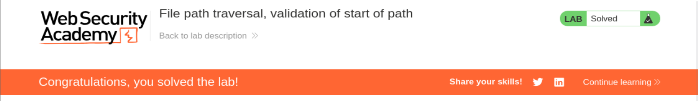

# Write-up - PortSwigger Lab 21 (Validation of start of path)

--------------------------------------------------------------------------------------------------------------------------------------------------------------------------------------------------------------------------------
LAB: File path traversal, validation of start of path
--------------------------------------------------------------------------------------------------------------------------------------------------------------------------------------------------------------------------------

# CONTEXTO

Este laboratorio introduce un mecanismo de defensa aparentemente “correcto”:

La aplicación valida que el parámetro `filename` empiece por:

    /var/www/images/

Es decir, el desarrollador intenta asegurarse de que SOLO se acceda a archivos dentro de ese directorio.

Pseudocódigo típico vulnerable:

    if not filename.startswith("/var/www/images/"):
        bloquear()

A simple vista parece seguro.

Pero no lo es.

--------------------------------------------------------------------------------------------------------------------------------------------------------------------------------------------------------------------------------

# PROBLEMA REAL

El servidor SOLO valida el INICIO de la ruta (string check), pero NO valida la ruta FINAL resuelta por el sistema operativo.

Esto es el fallo clave.

--------------------------------------------------------------------------------------------------------------------------------------------------------------------------------------------------------------------------------

# FLUJO REAL DEL SERVIDOR

1. Recibe el input del usuario
2. Comprueba que empieza por /var/www/images/
3. Si pasa → lo usa directamente
4. El sistema operativo RESUELVE la ruta (../ etc)

El error:

    validación textual != validación real del filesystem

--------------------------------------------------------------------------------------------------------------------------------------------------------------------------------------------------------------------------------

# PASO A PASO PRÁCTICO

## 1. Accedemos al laboratorio

URL:

https://0a4100bb0396d25981f0678b00f9005c.web-security-academy.net/

## 2. Interceptamos imagen

Abrimos una imagen → nueva pestaña:

    /image?filename=/var/www/images/42.jpg

## 3. Petición capturada

GET /image?filename=/var/www/images/42.jpg

--------------------------------------------------------------------------------------------------------------------------------------------------------------------------------------------------------------------------------

# IDENTIFICACIÓN DEL VECTOR

Parámetro vulnerable:

    filename

Observación clave:

    YA incluye ruta absoluta

Esto es importante: NO tenemos que construir la ruta → ya está incluida.

--------------------------------------------------------------------------------------------------------------------------------------------------------------------------------------------------------------------------------

# INTENTOS QUE FALLAN

Payload              | Resultado
--------------------|---------
/etc/passwd         | Bloqueado
../../../etc/passwd | Bloqueado

Motivo:

No empiezan por /var/www/images/

--------------------------------------------------------------------------------------------------------------------------------------------------------------------------------------------------------------------------------

# PAYLOAD CORRECTO

    /var/www/images/../../../etc/passwd

--------------------------------------------------------------------------------------------------------------------------------------------------------------------------------------------------------------------------------

# POR QUÉ FUNCIONA

## FASE 1: VALIDACIÓN

El servidor evalúa:

    startswith("/var/www/images/") → TRUE

Pasa el filtro.

## FASE 2: RESOLUCIÓN DEL SISTEMA

El sistema interpreta:

    /var/www/images/../../../etc/passwd

Paso a paso:

    /var/www/images/
    → ../ → /var/www/
    → ../ → /var/
    → ../ → /
    → etc/passwd

Resultado final:

    /etc/passwd

--------------------------------------------------------------------------------------------------------------------------------------------------------------------------------------------------------------------------------

# RESPUESTA

HTTP/2 200 OK

Contenido:

    root:x:0:0:root:/root:/bin/bash
    daemon:x:1:1:daemon:/usr/sbin/nologin
    ...

Esto confirma lectura arbitraria.

--------------------------------------------------------------------------------------------------------------------------------------------------------------------------------------------------------------------------------

# ERROR DE SEGURIDAD

El desarrollador hizo:

    validar string

Pero debería haber hecho:

    validar ruta canónica

--------------------------------------------------------------------------------------------------------------------------------------------------------------------------------------------------------------------------------

# CÓMO DEBERÍA SER

Correcto:

    real_path = realpath(input)
    if not real_path.startswith(base_dir):
        bloquear()

Incorrecto:

    if input.startswith(base_dir):
        permitir()

--------------------------------------------------------------------------------------------------------------------------------------------------------------------------------------------------------------------------------

# DIFERENCIA CLAVE

Tipo validación        | Seguridad
----------------------|---------
String (startswith)   | ❌ Vulnerable
Filesystem realpath   | ✅ Correcto

--------------------------------------------------------------------------------------------------------------------------------------------------------------------------------------------------------------------------------

# CONCEPTO CLAVE

Esto es un bypass de:

    Prefix validation

Porque:

    Cumples la condición…
    …pero rompes la lógica después

--------------------------------------------------------------------------------------------------------------------------------------------------------------------------------------------------------------------------------

# FRASE IMPORTANTE

    "Validar el inicio de la ruta NO significa controlar el destino final"

--------------------------------------------------------------------------------------------------------------------------------------------------------------------------------------------------------------------------------

# IMAGEN DEL LAB

