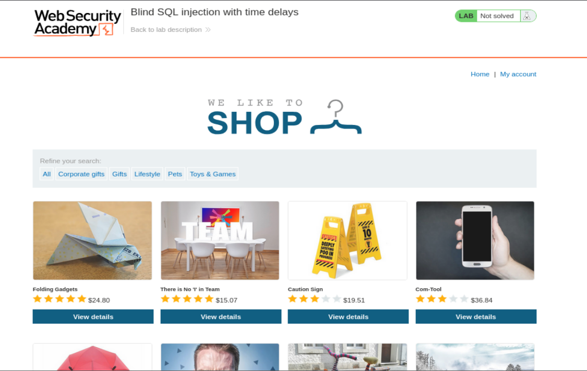
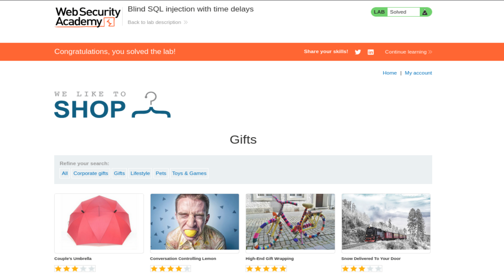

# Write-up - PortSwigger SQLi Lab 13

Voy a hacer un laboratorio de Port Swigger. El lab 13 de SQLi (En esta url: https://portswigger.net/web-security/sql-injection/blind/lab-time-delays)

--------------------------------------------------------------------------------------------------------------------------------------------------------------------------------------------------------------------------------

## Antes de nada la teoría

# TEORÍA: BLIND SQLi Retrasos de tiempo (Time-Based)

**Escenario:** Ataque posible gracias a que las consultas web se procesan de forma síncrona.

Obtenemos un cronómetro a modo de interruptor:

- **Respuesta Instantánea:** Query es falsa.
- **Respuesta con retraso (10s):** Query es verdadera.

## Mecanismo

MySQL/PostgreSQL -> `SLEEP(10)` o `pg_sleep(10)`

Vamos a introducir una instrucción `IF` (condicional) para que ejecute esa pausa **SOLO SI** nuestra pregunta a la bbdd es verdadera.

### Análisis payload Microsoft SQL SERVER

#### Prueba 1: Condición falsa

```sql
'; IF (1=2) WAITFOR DELAY '0:0:10'--
```

`1 NOT = 2`, luego no ejecutamos el resto de la sentencia.

**Respuesta instantánea**

#### Prueba 2: Condición verdadera

```sql
'; IF (1=1) WAITFOR DELAY '0:0:10'--
```

`1=1` Es verdadero Luego ejecutamos el resto de la sentencia

**Respuesta tardará en procesarse 10 segundos.**

## Extracción de datos

Confirmamos que podemos controlar tiempo respuesta.

-> **APLICAMOS LA MISMA LOGICA AL RECORTE DE CADENAS** -> `SUBSTRING()` -> METIENDOLA EN EL `IF`

### Payload

```sql
'; IF (SELECT COUNT(Username) FROM Users WHERE Username = 'Administrator' AND SUBSTRING(Password, 1, 1) > 'm') = 1 WAITFOR DELAY '0:0:10'--
```

CONTRASEÑA = `tweq1`

`COUNT` -> CONTAR EL NUMERO DE SALIDAS DE LA BBDD RESPECTO LOS FILTROS DE BUSQUEDA

### Payload

```sql
'; IF (SELECT COUNT(Username) FROM Users WHERE Username = 'FEDE' AND SUBSTRING(Password, 1, 1) > 'm') = 1 WAITFOR DELAY '0:0:10'--
```

CONTRASEÑA = `tweq1`

### Users

```text
username | password | id
administrator | tweq1
```

COUNT -> `1`

### Explicación conceptual de esta teoría

Aquí la idea clave no es “ver” los datos, sino **medir el comportamiento temporal** del servidor.

En una blind SQL injection time-based:

- no ves el resultado de la consulta
- no ves mensajes de error
- no cambia el HTML
- no aparece un `Welcome back`
- no te devuelve directamente los datos

Entonces conviertes la base de datos en un sistema binario basado en tiempo:

- si la condición que preguntas es **verdadera**, fuerzas una pausa
- si la condición es **falsa**, la respuesta vuelve normal y rápida

Ese retraso es tu canal lateral.

Dicho de otra forma:

**No estás leyendo datos de la base de datos.**
**Estás preguntando cosas y usando el reloj como respuesta.**

Por eso esta técnica es muy útil cuando la aplicación:

- no muestra errores
- no muestra cambios visuales
- no devuelve resultados útiles
- pero sí procesa las consultas de forma síncrona

Si el servidor espera a que la base de datos termine antes de responder, entonces puedes “escuchar” a la BBDD midiendo cuánto tarda en contestar.

### Idea práctica simplificada

Pregunta:

> “¿Se ejecutó una pausa de 10 segundos?”

Si la respuesta es sí:

- la condición era verdadera

Si la respuesta es no:

- la condición era falsa

Eso es exactamente lo que convierte el tiempo en un interruptor.

--------------------------------------------------------------------------------------------------------------------------------------------------------------------------------------------------------------------------------

# Laboratorio: Inyección SQL ciega con retrasos de tiempo

Este laboratorio contiene una vulnerabilidad de inyección SQL ciega. La aplicación utiliza una cookie de seguimiento para analítica y realiza una consulta SQL que incluye el valor de la cookie enviada.

Los resultados de la consulta SQL no se devuelven, y la aplicación no responde de forma diferente dependiendo de si la consulta devuelve filas o produce un error. Sin embargo, dado que la consulta se ejecuta de forma síncrona, es posible provocar retrasos de tiempo condicionales para inferir información.

## Para resolver el laboratorio

Explota la vulnerabilidad de inyección SQL para provocar un retraso de 10 segundos.

### Traducción y explicación del laboratorio

Este laboratorio es muy importante porque te obliga a cambiar completamente la mentalidad respecto a los anteriores.

En otros labs podías apoyarte en:

- respuestas visibles diferentes
- errores condicionales
- mensajes del motor SQL
- contenido filtrado directamente

Aquí no.

Aquí el laboratorio te dice claramente que:

- la aplicación **no devuelve resultados**
- la aplicación **no cambia si la query da filas**
- la aplicación **no cambia si la query produce un error**
- pero **sí** puedes inferir cosas porque la consulta se ejecuta síncronamente

Eso significa que el único indicador útil es el **tiempo**.

No importa tanto el contenido de la respuesta como cuánto tarda en llegar.

### Objetivo real del laboratorio

En este lab concreto todavía no hace falta enumerar toda la contraseña ni reconstruir carácter por carácter. El objetivo es más simple:

- confirmar la vulnerabilidad time-based
- identificar una sintaxis válida para provocar una pausa
- hacer que el servidor tarde 10 segundos en responder
- conseguir que PortSwigger marque el laboratorio como resuelto

Es decir, este lab es el “lab de validación” de la técnica time-based antes de pasar a labs donde el tiempo se usa para extraer información sensible.

--------------------------------------------------------------------------------------------------------------------------------------------------------------------------------------------------------------------------------

## Vamos a llevar a cabo esto de forma práctica

Le damos a empezar laboratorio y se nos abre la siguiente página web:

`https://0a0200dd042c100880b367a10075002c.web-security-academy.net/`

La página web tiene el aspecto de la imagen 1.



**Referencia a la imagen 1:** Vista inicial del laboratorio. La aplicación tiene apariencia de tienda normal, sin cambios visibles ni indicadores directos en la respuesta. Este es precisamente el punto clave del laboratorio: el canal observable no es el HTML ni un mensaje visible, sino el **tiempo que tarda la respuesta HTTP**.

Una vez dentro, abrimos burpsuitepro y en el navegador activamos el FoxyProxy para que en el HTTP History vayan apareciendo las distintas Requests mientras navegamos por la página.

Como ya nos da pistas la descripción del laboratorio, tenemos una cookie de rastreo que la aplicación usa internamente para hacer una consulta SQL.

Para ello, nos vamos a la categoria de Gifts => `GET /filter?category=Gifts HTTP/1.1`

y capturamos la petición de burpsuite:

```http
GET /filter?category=Gifts HTTP/2
Host: 0a0200dd042c100880b367a10075002c.web-security-academy.net
Cookie: TrackingId=6jH6oqaIsII6npus; session=EzuTeYrj7OicRZoStou6ZDmpMu0SkbsZ
User-Agent: Mozilla/5.0 (X11; Linux x86_64; rv:140.0) Gecko/20100101 Firefox/140.0
Accept: text/html,application/xhtml+xml,application/xml;q=0.9,*/*;q=0.8
Accept-Language: en-US,en;q=0.5
Accept-Encoding: gzip, deflate, br
Referer: https://0a0200dd042c100880b367a10075002c.web-security-academy.net/
Upgrade-Insecure-Requests: 1
Sec-Fetch-Dest: document
Sec-Fetch-Mode: navigate
Sec-Fetch-Site: same-origin
Sec-Fetch-User: ?1
Priority: u=0, i
Te: trailers
```

--------------------------------------------------------------------------------------------------------------------------------------------------------------------------------------------------------------------------------

Si le damos a **Send** nos devuelve una Response con este mensaje:

```http
HTTP/2 200 OK
```

Y lo importante aquí no es solo que devuelva `200 OK`, sino que lo hace **rápidamente**.

Eso establece nuestra **línea base temporal**:

- request legítima
- respuesta normal
- tiempo normal de procesamiento

En un ataque time-based esto es fundamental, porque primero tienes que saber cómo responde la aplicación **sin retraso artificial**.

### Punto importante

Una respuesta `200 OK` por sí sola no nos dice si el payload funciona o no. En time-based lo importante es:

- si responde en tiempo normal
- o si responde con una pausa claramente anómala

En otras palabras:

**Aquí el semáforo no es el status code.**
**Aquí el semáforo es el cronómetro.**

--------------------------------------------------------------------------------------------------------------------------------------------------------------------------------------------------------------------------------

## Primera prueba: payload con `SLEEP(10)`

Ahora vamos meter en el Cookie:

```http
Cookie: TrackingId=6jH6oqaIsII6npus' || (SELECT SLEEP(10))--;
```

### El Análisis del Payload: ¿Qué intentabas hacer?

Tu intención era provocar un **Time-based Blind SQLi** (Inyección ciega basada en tiempo):

- `||`: Operador de concatenación o "OR" lógico (dependiendo de la DB).
- `(SELECT SLEEP(10))`: Función de MySQL para pausar la ejecución 10 segundos.
- `--`: Comentario para ignorar el resto de la consulta original.

### ¿Por qué respondió al instante (200 OK)?

Si la página cargó rápido y con código `200`, significa que la base de datos ignoró o no ejecutó el comando de pausa.

La razón más probable es:

**Incompatibilidad de Sintaxis (El motor no es MySQL)**

### Explicación técnica detallada

Aquí lo que estás haciendo es una forma de **fingerprinting** del motor de base de datos a través de funciones temporales.

Si `SLEEP(10)` funcionara, sería una pista fuerte a favor de MySQL.

Pero como no se ejecuta el retraso, lo que observas es:

- no hay pausa
- la respuesta llega rápido
- el código HTTP no cambia de forma útil
- el HTML no cambia

Eso te dice que ese payload **no está pegando correctamente con la sintaxis y funciones del DBMS**.

Muy importante:

que no pause **no significa necesariamente** que no haya vulnerabilidad.

Significa que **esa forma concreta de payload** no es la adecuada para el motor de base de datos que hay detrás.

### Qué has aprendido con esta prueba fallida

Has aprendido algo muy útil:

- el parámetro puede seguir siendo vulnerable
- pero `SLEEP()` no parece ser la función correcta
- así que probablemente no estés delante de MySQL

Esta prueba fallida no es una pérdida de tiempo. Al contrario: te ayuda a descartar una familia de DBMS y acercarte a la sintaxis correcta.

--------------------------------------------------------------------------------------------------------------------------------------------------------------------------------------------------------------------------------

## Vamos a probar con el otro payload

```http
Cookie: TrackingId=6jH6oqaIsII6npus' || (SELECT pg_sleep(10))--
```

De esta manera ha tardado **10 segundos** en responder y además desde el laboratorio en la página web nos muestra que el laboratorio está resuelto.



**Referencia a la imagen 2:** Pantalla final del laboratorio ya resuelto. El retraso de 10 segundos ha sido interpretado correctamente por la plataforma como prueba de explotación exitosa de la vulnerabilidad time-based.

### El hecho de que el servidor haya tardado exactamente 10 segundos en responder confirma dos cosas críticas sobre tu objetivo

#### El motor de base de datos es PostgreSQL

La función `pg_sleep()` es exclusiva de este sistema. Al responder al comando, el servidor ha revelado su identidad (**DBMS Fingerprinting**).

#### Vulnerabilidad Blind Confirmada

La aplicación es vulnerable, pero como no muestra errores ni cambios visuales, el tiempo es tu único canal de comunicación.

### El Análisis del Payload Exitoso

```sql
' || (SELECT pg_sleep(10))--
```

- `||`: En PostgreSQL, este es el operador de concatenación de cadenas. Estás intentando "pegar" el resultado de la función de tiempo al ID de la cookie.
- `(SELECT pg_sleep(10))`: Esta subconsulta obliga a la base de datos a pausar su actividad durante 10 segundos antes de terminar de procesar la respuesta HTTP.
- `--`: Comentario de SQL que anula el resto de la consulta original para evitar errores de sintaxis que pudieran anular el efecto del tiempo.

### Explicación paso a paso de por qué funciona

#### Paso 1: Rompes la lógica original del valor de la cookie

La aplicación seguramente está construyendo algo parecido a:

```sql
SELECT * FROM tracking WHERE id = '6jH6oqaIsII6npus'
```

Cuando tú inyectas:

```sql
6jH6oqaIsII6npus' || (SELECT pg_sleep(10))--
```

estás intentando cerrar la cadena original y añadir una expresión que hace que la base de datos ejecute una pausa.

#### Paso 2: PostgreSQL acepta `pg_sleep(10)`

Como la función existe, la base de datos la ejecuta de verdad.

#### Paso 3: El servidor espera a la BBDD

La aplicación web no responde hasta que la consulta termina.

#### Paso 4: La consulta tarda 10 segundos

Como la consulta tarda 10 segundos, la respuesta HTTP también tarda 10 segundos.

#### Paso 5: El laboratorio se resuelve

PortSwigger detecta ese comportamiento y marca el laboratorio como completado.

### Qué significa realmente el éxito de este payload

Significa que ya has demostrado tres cosas a la vez:

1. **Puedes inyectar SQL en la cookie `TrackingId`.**
2. **Puedes ejecutar funciones del motor de base de datos.**
3. **Puedes manipular el tiempo de respuesta del servidor.**

Y eso, en time-based SQLi, es exactamente la base a partir de la cual luego se construyen payloads para extraer datos carácter a carácter.

--------------------------------------------------------------------------------------------------------------------------------------------------------------------------------------------------------------------------------

## Qué acabas de demostrar técnicamente

Aunque este laboratorio solo te pide provocar un retraso de 10 segundos, en realidad acabas de demostrar una cadena completa de capacidades ofensivas:

### 1. Confirmación del vector de ataque

El vector es la cookie `TrackingId`, no un parámetro GET visible ni un formulario.

### 2. Confirmación de vulnerabilidad SQLi

La cookie no está siendo saneada correctamente y su valor se interpreta dentro de una consulta SQL.

### 3. Fingerprinting del SGBD

Has descartado MySQL con `SLEEP(10)` y has confirmado PostgreSQL con `pg_sleep(10)`.

### 4. Confirmación de ejecución síncrona

La respuesta HTTP espera a que termine la consulta en la base de datos.

### 5. Confirmación del canal lateral

Ya tienes un canal observable:

- sin pausa -> falso o payload incorrecto
- con pausa -> verdadero o payload ejecutado correctamente

Ese canal lateral es el corazón del time-based blind SQLi.

--------------------------------------------------------------------------------------------------------------------------------------------------------------------------------------------------------------------------------

## Diferencia entre este lab y los siguientes labs time-based

Este laboratorio es “el más básico” de la familia time-based.

Aquí solo necesitas:

- meter una función de sleep válida
- conseguir que tarde 10 segundos
- resolver el lab

En labs posteriores, lo que harás será algo como esto:

```sql
'; SELECT CASE WHEN (SUBSTRING(password,1,1)='a') THEN pg_sleep(10) ELSE pg_sleep(0) END--
```

o variantes equivalentes.

Y ahí sí usarás el tiempo para responder preguntas del estilo:

- ¿la primera letra es `a`?
- ¿la longitud es mayor que `10`?
- ¿el carácter `5` es un número?
- etc.

Este lab no te pide todavía eso, pero sí te obliga a dominar la pieza previa: **hacer que el retraso funcione**.

--------------------------------------------------------------------------------------------------------------------------------------------------------------------------------------------------------------------------------

## Resumen técnico completo del proceso

En este laboratorio hemos seguido una lógica muy clara:

1. **Capturar una request legítima**
   - con la cookie `TrackingId`
   - estableciendo el comportamiento base de la aplicación

2. **Probar un payload de MySQL**
   - `SLEEP(10)`
   - no funciona
   - descartamos esa sintaxis

3. **Probar un payload de PostgreSQL**
   - `pg_sleep(10)`
   - funciona
   - confirma el DBMS

4. **Medir el tiempo de respuesta**
   - comprobamos que tarda 10 segundos
   - eso demuestra la inyección time-based

5. **Resolver el laboratorio**
   - PortSwigger detecta el retraso
   - lab completado

--------------------------------------------------------------------------------------------------------------------------------------------------------------------------------------------------------------------------------

## Payloads clave utilizados

### Payload que no funcionó (orientado a MySQL)
```http
Cookie: TrackingId=6jH6oqaIsII6npus' || (SELECT SLEEP(10))--;
```

### Payload que sí funcionó (orientado a PostgreSQL)
```http
Cookie: TrackingId=6jH6oqaIsII6npus' || (SELECT pg_sleep(10))--
```

--------------------------------------------------------------------------------------------------------------------------------------------------------------------------------------------------------------------------------

## Conclusión

Este laboratorio enseña una idea fundamental dentro de las blind SQL injections:

**Cuando no puedes ver ni datos, ni errores, ni cambios visuales, todavía te queda el tiempo.**

Ese tiempo se convierte en un canal lateral que permite comunicarte con la base de datos.

La aplicación parece totalmente muda:

- no muestra filas
- no da errores
- no cambia el contenido
- no revela resultados

Pero el reloj sí habla.

Y cuando consigues forzar una pausa controlada de 10 segundos, ya has ganado el control del canal de comunicación necesario para seguir explotando el sistema.

### Frase clave de este lab

**No ves el resultado de la query.**
**Lo mides.**

Eso es exactamente el corazón del **Blind SQL injection with time delays**.

**Laboratorio resuelto.**
