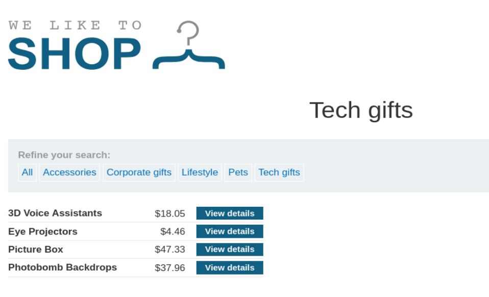
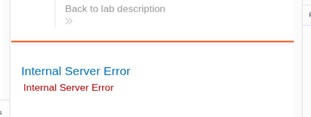
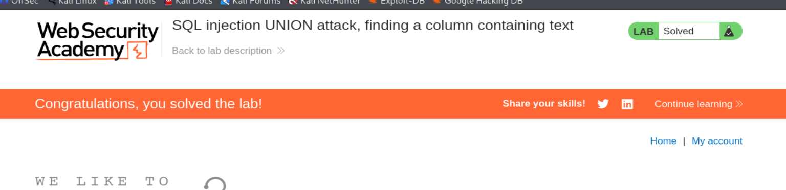
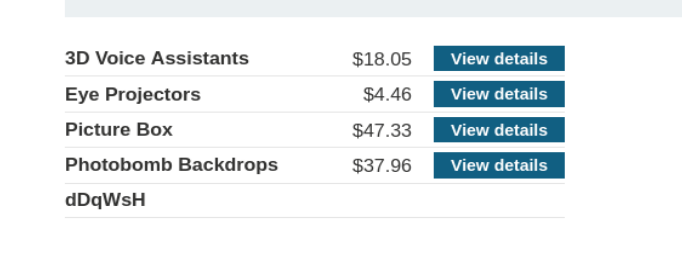

# Write-up - PortSwigger SQLi Lab 3

Voy a hacer un laboratorio de Port Swigger. El lab 3 de SQLi (En esta url: https://portswigger.net/web-security/sql-injection/union-attacks/lab-determine-number-of-columns)

## Descripción: Tradúcela al Español

**Lab: SQL injection UNION attack, determining the number of columns returned by the query**

Este laboratorio contiene una vulnerabilidad de inyección SQL en el filtro de categoría de productos. Los resultados de la consulta se devuelven en la respuesta de la aplicación, por lo que puedes usar un ataque UNION para recuperar datos de otras tablas. El primer paso de este tipo de ataque es determinar el número de columnas que devuelve la consulta. Después usarás esta técnica en laboratorios posteriores para construir el ataque completo.

Para resolver el laboratorio, determina el número de columnas devueltas por la consulta realizando un ataque SQL injection UNION que devuelva una fila adicional que contenga valores null.

## Apertura del laboratorio

Le damos a abrir lab y nos abre una página con la url:

`https://0a38000c041513e383ff5f3500d10076.web-security-academy.net/`

Una vez dentro, abrimos burpsuitepro y en el navegador activamos el FoxyProxy para que en el HTTP History vayan apareciendo las distintas Requests mientras navegamos por la página. Como ya nos da pistas la descripción del laboratorio, nos vamos a ir a la categoria Tech+gifts (imagen 1)

`https://0a38000c041513e383ff5f3500d10076.web-security-academy.net/filter?category=Tech+gifts`



También vemos que en dicha página nos muestra este texto el cual es una pista: Make the database retrieve the string: 'dDqWsH'

Cuando en burpsuitepro nos aparece en el HTTP History le damos botón derecho y Send to Repeater

Entonces vamos a ver cuantas columnas tiene la tabla para el UNION attack:

Para ello metemos en el parámetro GET /filter?category=Tech+gifts justo después icrementando de uno en uno hasta que nos dé un 500 Internal Server Error. Entonces tendremos ese número de columnas -1:

```http
GET /filter?category=Tech+gifts' ORDER BY 1--
HTTP/2 200 OK

GET /filter?category=Tech+gifts' ORDER BY 2--
HTTP/2 200 OK

GET /filter?category=Tech+gifts' ORDER BY 3--
HTTP/2 200 OK

GET /filter?category=Tech+gifts' ORDER BY 4--
HTTP/2 500 Internal Server Error
```

Con esto sabemos que tenemos 3 columnas. También es bastante evidente con la la imagen1, ya que se nos muestra una tabla con 3 columnas.

Vamos a verificar ahora que columnas aceptan texto:
Para ello probamos a meter esta consulta en el parámetro de antes aprovechándonos de la pista de antes, y probamos en cada columna dejando el resto a NULL. Se supone que cuando laencontremos por lo que dice la pista resolvemos el laboratorio:

```http
' UNION SELECT 'dDqWsH',NULL,NULL--
HTTP/2 500 Internal Server Error
```

Esta no es, mostrándono el error de la imagen 2



```http
' UNION SELECT NULL,'dDqWsH',NULL--
HTTP/2 200 OK
```

Esta sí es y nos muestra las imagenes 3 y 4 de laboratorio resuelto y con la cadenita insertada en dicha tabla





```http
' UNION SELECT NULL,NULL,'dDqWsH'--
HTTP/2 500 Internal Server Error
```

Esta no es

## Resultado final

Laboratorio resuelto
