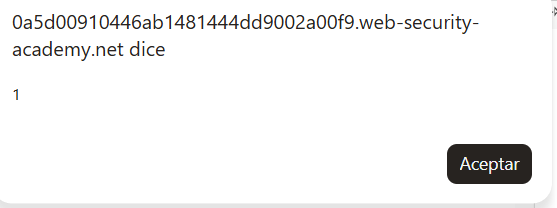

# Lab 41 — DOM XSS en `innerHTML` usando `location.search`

**Laboratorio de PortSwigger Web Security Academy**  
**Categoría:** Cross-site scripting / DOM-based XSS  
**URL del lab:** `https://portswigger.net/web-security/cross-site-scripting/dom-based/lab-innerhtml-sink`

---

## 1. Enunciado del laboratorio

Este laboratorio contiene una vulnerabilidad de **cross-site scripting basado en DOM**, también llamado **DOM XSS**, en la funcionalidad de búsqueda del blog.

La aplicación utiliza una asignación a `innerHTML`, que modifica el contenido HTML de un elemento de la página usando datos procedentes de `location.search`. Como `location.search` viene de la URL y el usuario puede modificar la URL, el atacante controla el dato que acaba insertándose en el DOM.

Para resolver el laboratorio hay que conseguir que se ejecute la función:

```javascript
alert(1)
```

El payload usado es:

```html

```

---

## 2. Objetivo real del laboratorio

El objetivo no es simplemente memorizar un payload. El objetivo es entender esta cadena completa:

```text
URL controlada por el usuario
        ↓
location.search
        ↓
URLSearchParams(...).get('search')
        ↓
variable query
        ↓
innerHTML = query
        ↓
HTML interpretado por el navegador
        ↓
evento onerror ejecutado
        ↓
alert(1)
```

La clave del lab es esta:

> Si datos controlados por el usuario llegan a `innerHTML`, el navegador puede interpretarlos como HTML real, no como texto.

---

## 3. Imagen 1 — Página inicial del laboratorio


Al iniciar el laboratorio se abre una página tipo blog de PortSwigger. En la parte superior aparece el título:

```text
DOM XSS in innerHTML sink using source location.search
```

La página contiene un buscador con el placeholder:

```text
Search the blog...
```

A simple vista parece una funcionalidad normal de búsqueda, pero en este laboratorio el buscador es el punto vulnerable.

---

## 4. Conceptos necesarios antes de explotar el lab

Antes de explotar el laboratorio hay que tener claros varios conceptos: **source**, **sink**, **DOM XSS**, `location.search`, `URLSearchParams`, `getElementById`, `innerHTML`, `textContent`, `<span>`, ``, `src` y `onerror`.

---

## 5. Qué es DOM XSS

Un **DOM XSS** ocurre cuando la vulnerabilidad no depende directamente de que el servidor devuelva HTML malicioso, sino de que el JavaScript del navegador toma datos controlados por el usuario y los inserta de forma peligrosa en el DOM.

En un XSS reflejado clásico, el flujo suele ser:

```text
Usuario envía payload → servidor lo refleja → navegador lo ejecuta
```

En DOM XSS, el flujo es distinto:

```text
Usuario controla URL → JavaScript del navegador lee la URL → JavaScript modifica el DOM → navegador ejecuta
```

En este lab, el servidor simplemente entrega la página con un script vulnerable. El problema ocurre después, en el navegador, cuando ese script lee el parámetro `search` de la URL y lo mete en `innerHTML`.

---

## 6. Source y sink

En DOM XSS siempre hay que identificar dos piezas:

### 6.1. Source

El **source** es el origen del dato controlado por el usuario.

En este laboratorio el source es:

```javascript
window.location.search
```

`location.search` contiene la parte de la URL que empieza por `?`.

Ejemplo:

```text
https://lab.web-security-academy.net/?search=pepe1
```

Aquí:

```javascript
window.location.search
```

devuelve:

```text
?search=pepe1
```

Es un source peligroso porque cualquier usuario puede modificar la URL.

### 6.2. Sink

El **sink** es el lugar donde acaba el dato y donde puede convertirse en código ejecutable.

En este laboratorio el sink es:

```javascript
innerHTML
```

Concretamente:

```javascript
document.getElementById('searchMessage').innerHTML = query;
```

Esto es peligroso porque `innerHTML` no inserta texto plano. Inserta HTML que el navegador interpreta.

---

## 7. Código vulnerable encontrado en el DOM

Después de introducir una cadena normal como `pepe1` en el buscador e inspeccionar la página con las herramientas de desarrollador, se observa una estructura similar a esta:

```html
<section class="blog-header">
    <h1>
        <span>0 search results for '</span>
        <span id="searchMessage">pepe1</span>
        <span>'</span>
    </h1>

    <script>
        function doSearchQuery(query) {
            document.getElementById('searchMessage').innerHTML = query;
        }

        var query = (new URLSearchParams(window.location.search)).get('search');
        if(query) {
            doSearchQuery(query);
        }
    </script>
    <hr>
</section>
```

Este bloque explica todo el laboratorio.

---

## 8. Análisis línea por línea del código

### 8.1. Contenedor del mensaje de búsqueda

```html
<span id="searchMessage">pepe1</span>
```

Aquí se muestra el valor que hemos buscado. Si buscamos `pepe1`, el texto `pepe1` aparece dentro del elemento con `id="searchMessage"`.

Ese elemento es el destino donde el JavaScript va a colocar el valor del parámetro `search`.

---

### 8.2. Función vulnerable

```javascript
function doSearchQuery(query) {
    document.getElementById('searchMessage').innerHTML = query;
}
```

Esta función recibe un parámetro llamado `query` y lo mete dentro del elemento `searchMessage` usando `innerHTML`.

Aquí está la vulnerabilidad exacta:

```javascript
.innerHTML = query
```

Si `query` contiene texto normal, se muestra texto normal. Pero si `query` contiene HTML, el navegador lo interpreta como HTML real.

---

### 8.3. Lectura del parámetro de la URL

```javascript
var query = (new URLSearchParams(window.location.search)).get('search');
```

Esta línea hace varias cosas:

1. Lee la parte de la URL que empieza por `?` usando `window.location.search`.
2. La convierte en un objeto manejable con `URLSearchParams`.
3. Extrae el valor del parámetro `search`.

Ejemplo:

```text
/?search=pepe1
```

Entonces:

```javascript
query = "pepe1";
```

Si la URL es:

```text
/?search=
```

Entonces:

```javascript
query = "";
```

---

### 8.4. Condición de ejecución

```javascript
if(query) {
    doSearchQuery(query);
}
```

Si existe un valor en `search`, se llama a la función vulnerable.

Esto significa que basta con añadir el parámetro `search` a la URL para activar el comportamiento vulnerable.

---

## 9. Qué es `getElementById`

La función:

```javascript
document.getElementById('searchMessage')
```

busca en el DOM un elemento cuyo atributo `id` sea `searchMessage`.

En el HTML existe esto:

```html
<span id="searchMessage">pepe1</span>
```

Por tanto, `getElementById('searchMessage')` devuelve ese `<span>`.

Esto por sí solo no es vulnerable. Buscar un elemento por ID es normal y seguro.

El problema empieza cuando al elemento encontrado se le asigna contenido usando `innerHTML`.

La frase correcta es:

> `getElementById` encuentra el elemento. `innerHTML` lo convierte en peligroso.

---

## 10. Qué es un `<span>`

`<span>` es una etiqueta HTML genérica en línea. Se usa para envolver texto o fragmentos pequeños de contenido.

Ejemplo:

```html
<p>Hola <span>mundo</span></p>
```

Visualmente no cambia nada. Se usa mucho para:

- aplicar estilos,
- identificar una zona con un `id`,
- modificar contenido con JavaScript.

En este lab:

```html
<span id="searchMessage">pepe1</span>
```

sirve como contenedor donde se coloca el texto de búsqueda.

Lo importante es que `<span>` no protege nada. Si dentro de un `<span>` se inserta un `` mediante `innerHTML`, el navegador crea ese `` como nodo real.

---

## 11. Qué es `innerHTML`

`innerHTML` es una propiedad que permite leer o escribir el HTML interno de un elemento.

Ejemplo:

```javascript
document.getElementById('demo').innerHTML = '<b>Hola</b>';
```

Si tenemos:

```html
<div id="demo"></div>
```

el resultado será:

```html
<div id="demo"><b>Hola</b></div>
```

El navegador no muestra los caracteres `<b>`. Crea una etiqueta real `<b>`.

Esto es útil para generar HTML dinámicamente, pero es peligroso si el contenido viene del usuario.

---

## 12. Diferencia entre `innerHTML` y `textContent`

Esta diferencia es fundamental.

### 12.1. Código vulnerable

```javascript
element.innerHTML = userInput;
```

Si `userInput` es:

```html

```

el navegador crea un elemento real:

```html

```

Y el evento se ejecuta.

### 12.2. Código seguro

```javascript
element.textContent = userInput;
```

Si `userInput` es:

```html

```

el navegador lo muestra como texto literal:

```text

```

No crea una imagen. No interpreta HTML. No ejecuta eventos.

### 12.3. Regla práctica

```text
innerHTML   → interpreta HTML
textContent → muestra texto
```

Si el dato viene del usuario y solo quieres mostrarlo, usa `textContent`.

---

## 13. Primera prueba con una cadena normal

Introducimos en el buscador:

```text
pepe1
```

La URL queda similar a:

```text
https://0a5d00910446ab1481444dd9002a00f9.web-security-academy.net/?search=pepe1
```

El JavaScript lee:

```javascript
query = "pepe1";
```

Luego ejecuta:

```javascript
document.getElementById('searchMessage').innerHTML = "pepe1";
```

El DOM queda:

```html
<span id="searchMessage">pepe1</span>
```

En este caso no pasa nada malo porque `pepe1` no contiene HTML.

---

## 14. Construcción del payload

Necesitamos que el valor de `search` se convierta en HTML ejecutable.

El payload elegido es:

```html

```

¿Por qué este payload?

Porque `innerHTML` no ejecuta de forma fiable etiquetas `<script>` insertadas dinámicamente, pero sí crea elementos como `` y sus event handlers pueden ejecutarse.

---

## 15. Desglose del payload

```html

```

### 15.1. ``

Crea un elemento imagen.

### 15.2. `src=1`

Indica al navegador que intente cargar una imagen desde la ruta `1`.

Esa ruta no contiene una imagen válida, por lo que la carga falla.

### 15.3. `onerror=alert(1)`

`onerror` es un manejador de eventos. Se ejecuta cuando la imagen no puede cargarse.

Como `src=1` falla, se dispara `onerror`, y entonces se ejecuta:

```javascript
alert(1)
```

---

## 16. Ejecución práctica del payload

Introducimos en el buscador:

```html

```

La URL queda encodeada así:

```text
https://0a5d00910446ab1481444dd9002a00f9.web-security-academy.net/?search=%3Cimg+src%3D1+onerror%3Dalert%281%29%3E
```

El navegador decodifica el parámetro `search` y el JavaScript recibe:

```javascript
query = "";
```

Luego se ejecuta:

```javascript
document.getElementById('searchMessage').innerHTML = query;
```

El DOM final queda:

```html
<span id="searchMessage">
    
</span>
```

---

## 17. Imagen 2 — Popup de `alert(1)`



En esta imagen se ve que el navegador muestra un popup con el valor:

```text
1
```

Esto confirma que el JavaScript se ha ejecutado correctamente.

---

## 18. Imagen 3 — Laboratorio resuelto


Después de ejecutar el payload, PortSwigger marca el laboratorio como resuelto.

Se ve el mensaje:

```text
Congratulations, you solved the lab!
```

Y también se observa que el resultado de búsqueda muestra una imagen rota dentro del mensaje:

```text
0 search results for '[imagen rota]'
```

Esa imagen rota es precisamente el `` que hemos inyectado.

---

## 19. DOM final tras la explotación

Después del payload, la estructura queda así:

```html
<section class="blog-header">
    <h1>
        <span>0 search results for '</span>
        <span id="searchMessage">
            
        </span>
        <span>'</span>
    </h1>

    <script>
        function doSearchQuery(query) {
            document.getElementById('searchMessage').innerHTML = query;
        }
        var query = (new URLSearchParams(window.location.search)).get('search');
        if(query) {
            doSearchQuery(query);
        }
    </script>
    <hr>
</section>
```

La parte importante es:

```html
<span id="searchMessage"></span>
```

El `` está dentro de un `<span>`, pero eso no bloquea la ejecución. Un `<span>` es un contenedor normal y permite que dentro haya otros elementos HTML.

---

## 20. Por qué aquí no hay que escapar de ningún contexto especial

En el lab anterior con `document.write` dentro de un `<select>`, había que salir del contexto `<select>` con algo como:

```html
</select>
```

Aquí no hace falta.

¿Por qué?

Porque el dato se inserta dentro de un `<span>` en un contexto HTML normal:

```html
<span id="searchMessage">AQUÍ</span>
```

Eso significa que si metemos:

```html

```

el navegador puede crear el elemento directamente.

No estamos encerrados en:

- `<select>`,
- `<option>`,
- `<script>`,
- atributo HTML,
- string JavaScript.

Estamos en un contexto HTML donde un `` es válido.

---

## 21. Por qué `<script>alert(1)</script>` no funciona con `innerHTML`

Una duda típica es: si `innerHTML` interpreta HTML, ¿por qué no usar directamente?

```html
<script>alert(1)</script>
```

La razón es que los navegadores modernos no ejecutan automáticamente scripts insertados mediante `innerHTML` de esta forma.

Si haces:

```javascript
element.innerHTML = '<script>alert(1)</script>';
```

el navegador puede crear el nodo `<script>`, pero normalmente no ejecuta su contenido.

Por eso en DOM XSS con `innerHTML` se usan vectores que ejecutan JavaScript mediante eventos del navegador, como:

```html

```

u otras variantes:

```html
<svg onload=alert(1)>
```

La idea es no depender de que se ejecute una etiqueta `<script>`, sino aprovechar un evento automático.

---

## 22. Por qué `onerror` sí funciona

Cuando `innerHTML` crea este elemento:

```html

```

el navegador intenta cargar la imagen.

Como `src="1"` no apunta a una imagen válida, ocurre un error de carga.

El navegador dispara el evento `error`.

Como el elemento tiene un atributo `onerror`, ejecuta el JavaScript asociado:

```javascript
alert(1)
```

Es decir, el flujo exacto es:

```text
innerHTML crea 
        ↓
el navegador intenta cargar src=1
        ↓
la carga falla
        ↓
se dispara onerror
        ↓
se ejecuta alert(1)
```

---

## 23. Diferencia entre HTML parsing y ejecución JavaScript

Este lab también enseña que hay dos fases distintas:

### 23.1. Parsing HTML

El navegador recibe una cadena como:

```html

```

Y la convierte en nodos del DOM.

### 23.2. Ejecución de eventos

Después, al crear el elemento imagen, el navegador intenta cargar su `src`. Como falla, se dispara `onerror` y se ejecuta JavaScript.

El XSS no ocurre simplemente por “ver” la etiqueta. Ocurre porque esa etiqueta tiene un evento que el navegador ejecuta.

---

## 24. Por qué esto es un DOM XSS y no un reflected XSS clásico

Aunque el payload aparece en la URL, la vulnerabilidad no está en que el servidor refleje directamente el payload en el HTML.

El flujo vulnerable está en el JavaScript del lado cliente:

```javascript
var query = (new URLSearchParams(window.location.search)).get('search');
document.getElementById('searchMessage').innerHTML = query;
```

El servidor entrega una página con ese script. Después el navegador ejecuta el script y genera el DOM vulnerable.

Por eso se clasifica como DOM XSS.

---

## 25. Diferencia con reflected XSS de servidor

### Reflected XSS clásico

```text
Payload en request
        ↓
Servidor lo mete en la respuesta HTML
        ↓
Navegador ejecuta
```

### DOM XSS

```text
Payload en URL
        ↓
Servidor entrega JS vulnerable
        ↓
JS lee URL en el navegador
        ↓
JS modifica DOM peligrosamente
        ↓
Navegador ejecuta
```

En este lab estamos en el segundo caso.

---

## 26. Comparación con el lab anterior: `document.write` vs `innerHTML`

El lab anterior usaba `document.write` dentro de un `<select>`. Este usa `innerHTML` dentro de un `<span>`.

### 26.1. `document.write`

`document.write` escribe HTML mientras la página se está construyendo. El contexto importa muchísimo.

Si el input cae aquí:

```html
<select>
    <option>INPUT</option>
</select>
```

hay que salir del `<select>` antes de inyectar algo ejecutable:

```html
</select>
```

### 26.2. `innerHTML`

`innerHTML` modifica el contenido de un elemento ya existente.

Si el input cae aquí:

```html
<span id="searchMessage">INPUT</span>
```

puedes insertar directamente:

```html

```

porque `` es válido dentro de ese contexto.

### 26.3. Resumen comparativo

| Aspecto | `document.write` | `innerHTML` |
|---|---|---|
| Momento de ejecución | Durante construcción de la página | Sobre DOM ya creado |
| Contexto | Muy importante | También importa, pero aquí es simple |
| Necesidad de cerrar etiquetas | A veces sí | En este lab no |
| Payload usado | `</select>` | `` |
| Riesgo | Alto | Alto |

---

## 27. Error del desarrollador

El error está en confiar en datos procedentes de la URL y meterlos en `innerHTML`.

Código vulnerable:

```javascript
function doSearchQuery(query) {
    document.getElementById('searchMessage').innerHTML = query;
}
```

La aplicación debería tratar la búsqueda del usuario como texto, no como HTML.

Código correcto:

```javascript
function doSearchQuery(query) {
    document.getElementById('searchMessage').textContent = query;
}
```

Con `textContent`, el payload:

```html

```

se vería literalmente como texto en pantalla y no se ejecutaría.

---

## 28. Defensa correcta

### 28.1. No usar `innerHTML` con input no confiable

La defensa más directa es evitar:

```javascript
element.innerHTML = userInput;
```

Y usar:

```javascript
element.textContent = userInput;
```

### 28.2. Sanitizar si necesitas HTML

Si realmente necesitas permitir algo de HTML, usa un sanitizador robusto, por ejemplo DOMPurify.

Ejemplo conceptual:

```javascript
element.innerHTML = DOMPurify.sanitize(userInput);
```

Pero hay que tener cuidado: sanitizar HTML es difícil. La opción más segura es no interpretar HTML si no hace falta.

### 28.3. Content Security Policy

Una CSP puede reducir el impacto de algunos XSS, por ejemplo bloqueando inline event handlers como `onerror`.

Pero CSP no debe ser la única defensa. La defensa principal sigue siendo no usar sinks peligrosos con datos no confiables.

### 28.4. Validar y codificar según contexto

Si un dato se va a mostrar como texto, debe tratarse como texto. Si se va a usar en HTML, atributo, JavaScript o URL, cada contexto requiere una codificación diferente.

En este lab el contexto final era HTML dentro del DOM, por eso el sink peligroso era `innerHTML`.

---

## 29. Variantes del payload

El payload principal es:

```html

```

Otras variantes típicas en contextos similares podrían ser:

```html
<svg onload=alert(1)>
```

```html

```

```html

```

No todas las variantes funcionan siempre. Depende del contexto, del navegador, de los filtros y de si existe CSP.

En este laboratorio el payload más directo y fiable es:

```html

```

---

## 30. URL final usada

La URL final contiene el payload encodeado:

```text
https://0a5d00910446ab1481444dd9002a00f9.web-security-academy.net/?search=%3Cimg+src%3D1+onerror%3Dalert%281%29%3E
```

Decodificado:

```text
?search=
```

---

## 31. Por qué el navegador muestra una imagen rota

En la imagen del laboratorio resuelto se ve algo parecido a una imagen rota en el mensaje de resultados.

Eso es normal.

El navegador ha creado este elemento:

```html

```

Como `src="1"` no carga una imagen válida, se muestra el icono de imagen rota. Ese mismo error de carga es el que dispara `onerror`.

Por tanto, la imagen rota no es un fallo del exploit. Es parte de la prueba de que el `` se ha insertado realmente en el DOM.

---

## 32. Resumen técnico completo

1. La web tiene un buscador.
2. El buscador genera una URL con `?search=...`.
3. JavaScript lee el parámetro usando `window.location.search`.
4. `URLSearchParams` extrae el valor de `search`.
5. El valor se guarda en `query`.
6. La función `doSearchQuery(query)` se ejecuta.
7. Dentro de esa función se hace:
   ```javascript
   innerHTML = query;
   ```
8. Como `innerHTML` interpreta HTML, el payload se convierte en nodos reales.
9. El payload crea un `` con `src` inválido.
10. La carga de la imagen falla.
11. Se dispara `onerror`.
12. Se ejecuta `alert(1)`.
13. El laboratorio queda resuelto.

---

## 33. Frases clave para memorizar

```text
location.search es la fuente.
innerHTML es el sink.
```

```text
innerHTML interpreta HTML; textContent muestra texto.
```

```text
getElementById no es el problema; el problema es asignar user input a innerHTML.
```

```text
<script> no suele ejecutarse vía innerHTML, pero eventos como onerror sí.
```

```text
DOM XSS ocurre en el navegador, no necesariamente en el servidor.
```

---

## 34. Conclusión

Este laboratorio es una demostración directa de una de las vulnerabilidades DOM XSS más comunes: leer datos desde la URL y escribirlos en el DOM mediante `innerHTML`.

La explotación es sencilla porque el contexto es HTML normal dentro de un `<span>`, así que no hace falta escapar de un `<select>`, de un atributo ni de una string JavaScript. Basta con insertar un elemento HTML que tenga un evento automático.

El payload:

```html

```

funciona porque `innerHTML` crea un `` real, la imagen falla al cargar y el navegador ejecuta `onerror`.

La corrección adecuada es no usar `innerHTML` para mostrar datos controlados por el usuario. En este caso, `textContent` resolvería el problema de forma directa.
