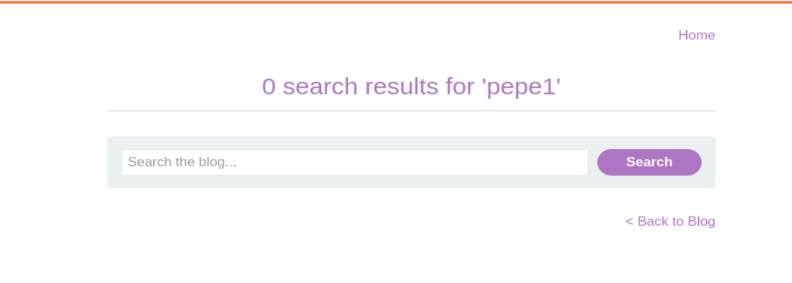
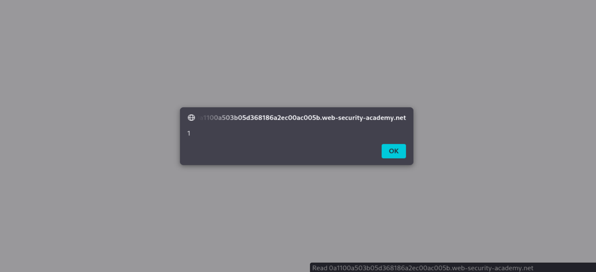

# Write-up - PortSwigger Lab 23

Voy a hacer un laboratorio de PortSwigger. El lab 23 de Cross-site scripting.

URL del laboratorio:

```text
https://portswigger.net/web-security/cross-site-scripting/reflected/lab-html-context-nothing-encoded
```

--------------------------------------------------------------------------------------------------------------------------------------------------------------------------------------------------------------------------------

# Laboratorio: XSS reflejado en contexto HTML sin ningún tipo de codificación

Este laboratorio contiene una vulnerabilidad simple de cross-site scripting (XSS) reflejado en la funcionalidad de búsqueda.

Para resolver el laboratorio, realiza un ataque de cross-site scripting que invoque la función:

```javascript
alert
```

--------------------------------------------------------------------------------------------------------------------------------------------------------------------------------------------------------------------------------

# Objetivo principal

El objetivo del laboratorio es conseguir que el navegador ejecute JavaScript controlado por nosotros.

En concreto, PortSwigger pide ejecutar la función:

```javascript
alert()
```

Esto se consigue aprovechando que el input introducido en el buscador se refleja en la respuesta HTML sin ningún tipo de codificación ni escape.

Payload final del laboratorio:

```html
<script>alert(1)</script>
```

--------------------------------------------------------------------------------------------------------------------------------------------------------------------------------------------------------------------------------

# Qué es XSS Reflejado

XSS Reflejado (`Reflected Cross-Site Scripting`) es el tipo más común de inyección de scripts en el lado del cliente.

Se llama “reflejado” porque el código malicioso viaja desde la solicitud del usuario hacia el servidor, y el servidor lo rebota o lo refleja de vuelta hacia el navegador sin haberlo guardado en ninguna base de datos.

Es decir:

```text
input del usuario -> servidor -> respuesta HTML -> navegador
```

Si la aplicación incluye ese input dentro de la respuesta HTML sin codificarlo, el navegador puede interpretarlo como HTML o JavaScript real.

--------------------------------------------------------------------------------------------------------------------------------------------------------------------------------------------------------------------------------

# Funcionamiento del XSS reflejado

El ataque ocurre cuando una aplicación web recibe datos en una solicitud HTTP e incluye esos datos dentro de la respuesta inmediata de una manera insegura.

## Flujo del ataque

1. El atacante encuentra un parámetro reflejado.
2. El atacante construye una URL maliciosa.
3. La víctima abre esa URL.
4. El servidor refleja el payload en el HTML.
5. El navegador interpreta el payload como código.
6. El JavaScript se ejecuta en el contexto del dominio vulnerable.

Ejemplo normal:

```text
https://web.com/search?q=zapatos
```

Ejemplo malicioso:

```text
https://web.com/search?q=<script>alert(1)</script>
```

Si el servidor genera algo como:

```html
<div>Resultados para: <script>alert(1)</script></div>
```

el navegador ejecuta el script.

--------------------------------------------------------------------------------------------------------------------------------------------------------------------------------------------------------------------------------

# Características principales del XSS reflejado

## No es persistente

El script no se guarda en el servidor. Si cierras la página y entras de nuevo normalmente, el ataque desaparece.

## Requiere interacción

El atacante normalmente necesita que la víctima haga click en un enlace específico o envíe una petición manipulada.

## Se ejecuta en el navegador

El servidor no ejecuta JavaScript. El JavaScript lo ejecuta el navegador de la víctima.

## Se ejecuta como si perteneciera al sitio vulnerable

Esto es lo peligroso. El navegador considera que el JavaScript pertenece al dominio vulnerable.

--------------------------------------------------------------------------------------------------------------------------------------------------------------------------------------------------------------------------------

# Por qué XSS es peligroso

Aunque en el laboratorio solo ejecutamos:

```javascript
alert(1)
```

en un caso real, un XSS puede permitir:

- robar cookies si no tienen `HttpOnly`;
- leer datos sensibles del DOM;
- modificar la página;
- capturar formularios;
- realizar acciones como la víctima;
- redirigir a phishing;
- enviar peticiones autenticadas;
- manipular contenido visible para el usuario.

El `alert(1)` es solo la prueba de ejecución.

No es el impacto real.

--------------------------------------------------------------------------------------------------------------------------------------------------------------------------------------------------------------------------------

# Same Origin Policy y XSS

La Same Origin Policy (`SOP`) es una defensa del navegador.

Dice que un script solo puede acceder a datos del mismo origen.

Un origen se define por:

```text
protocolo + dominio + puerto
```

Pero con XSS, el script inyectado se ejecuta dentro del dominio vulnerable.

Por eso el navegador lo trata como si fuese código legítimo de la aplicación.

Ese es el motivo por el que XSS es tan importante.

--------------------------------------------------------------------------------------------------------------------------------------------------------------------------------------------------------------------------------

# Contexto del laboratorio: HTML context

El laboratorio se llama:

```text
Reflected XSS into HTML context with nothing encoded
```

Esto significa que el input del usuario se refleja dentro del HTML normal de la página.

Ejemplo conceptual:

```html
<h1>0 search results for 'INPUT_USUARIO'</h1>
```

Si el input es texto normal, no pasa nada.

Si el input contiene etiquetas HTML, el navegador puede interpretarlas.

Si el input contiene un `<script>`, el navegador puede ejecutar JavaScript.

--------------------------------------------------------------------------------------------------------------------------------------------------------------------------------------------------------------------------------

# Qué significa “nothing encoded”

Significa que la aplicación no está escapando caracteres peligrosos.

Caracteres peligrosos en HTML:

```text
<
>
"
'
&
/
```

Una aplicación segura debería convertir:

```text
<  -> &lt;
>  -> &gt;
"  -> &quot;
'  -> &#x27;
&  -> &amp;
```

Si buscamos:

```html
<h1>pepe1</h1>
```

una aplicación segura debería mostrar:

```html
&lt;h1&gt;pepe1&lt;/h1&gt;
```

Pero si la aplicación vulnerable devuelve:

```html
<h1>pepe1</h1>
```

el navegador interpreta la etiqueta como HTML real.

--------------------------------------------------------------------------------------------------------------------------------------------------------------------------------------------------------------------------------

# Cómo detectar XSS reflejado manualmente

## 1. Localizar reflexiones

Introducimos una cadena controlada:

```text
pepe1
```

Si aparece en la respuesta, tenemos una reflexión.

## 2. Probar caracteres especiales

Probamos:

```text
< > ' " /
```

y revisamos si el servidor los codifica o los deja tal cual.

## 3. Probar HTML

Antes de ejecutar JavaScript, probamos HTML simple:

```html
<h1>pepe1</h1>
```

Si el navegador interpreta la etiqueta, es una señal fuerte.

## 4. Probar JavaScript

Finalmente probamos:

```html
<script>alert(1)</script>
```

Si aparece el popup, el XSS queda confirmado.

--------------------------------------------------------------------------------------------------------------------------------------------------------------------------------------------------------------------------------

# Vamos a llevar a cabo esto de forma práctica

Le damos a empezar laboratorio y se nos abre la siguiente página web:

```text
https://0a1100a503b05d368186a2ec00ac005b.web-security-academy.net/
```

La página web tiene el aspecto de la imagen 1.


**Referencia a la imagen 1:** Vista inicial del laboratorio. Se observa el buscador del blog, que será el punto de entrada para probar la vulnerabilidad XSS reflejada.

Una vez dentro, abrimos BurpSuitePro y en el navegador activamos FoxyProxy para que en el HTTP History vayan apareciendo las distintas requests mientras navegamos por la página.

Como ya nos dice el laboratorio, contiene una vulnerabilidad de XSS reflejado en la funcionalidad de búsqueda.

Por tanto, nos centramos en el buscador.

--------------------------------------------------------------------------------------------------------------------------------------------------------------------------------------------------------------------------------

# Primer paso: probar una cadena normal

Probamos a meter cualquier cadena aleatoria en el buscador para saber cómo se comporta.

En nuestro caso usamos:

```text
pepe1
```

La página responde con el mensaje mostrado en la imagen 2.



**Referencia a la imagen 2:** La página muestra `0 search results for 'pepe1'`. Esto confirma que el valor introducido por el usuario se refleja en la respuesta HTML.

El mensaje observado es:

```text
0 search results for 'pepe1'
```

--------------------------------------------------------------------------------------------------------------------------------------------------------------------------------------------------------------------------------

# Interpretación del resultado con `pepe1`

Esto nos da una señal muy fuerte de vulnerabilidad potencial.

La página muestra:

```text
0 search results for 'pepe1'
```

Eso significa que:

```text
el valor que introducimos se inserta en el HTML de respuesta
```

El dato `pepe1` no se queda solo en el servidor.

Vuelve al navegador dentro de la respuesta.

Esto es necesario para un XSS reflejado.

--------------------------------------------------------------------------------------------------------------------------------------------------------------------------------------------------------------------------------

# Por qué esto es peligroso

Si el input del usuario se refleja sin ningún tipo de codificación o escape, entonces el navegador no distingue entre:

```text
texto normal
```

y:

```text
código HTML o JavaScript
```

Es decir, estamos controlando parte del HTML de la página.

La clave real es esta:

Si el input se muestra así:

```text
'pepe1'
```

sin convertir caracteres especiales, entonces probablemente:

```text
< no se convierte en &lt;
> no se convierte en &gt;
```

Y ahí es donde entra XSS.

--------------------------------------------------------------------------------------------------------------------------------------------------------------------------------------------------------------------------------

# Segundo paso: comprobar si interpreta HTML

Para confirmarlo, vamos a meter en el buscador:

```html
<h1>pepe1</h1>
```

La respuesta visual cambia.

Nos responde con algo parecido a:

```text
0 search results for '
pepe1'
```

Esto ya sugiere que el navegador está interpretando la etiqueta `<h1>` como HTML.

--------------------------------------------------------------------------------------------------------------------------------------------------------------------------------------------------------------------------------

# Inspección del código fuente

Para confirmarlo mejor, inspeccionamos el código fuente.

Para ello usamos:

```text
Ctrl + U
```

Y efectivamente vemos algo como:

```html
'<h1>pepe1</h1>'</h1>
```

Esto es importante porque demuestra que el input no se está mostrando como texto escapado.

Se está insertando directamente en el HTML.

--------------------------------------------------------------------------------------------------------------------------------------------------------------------------------------------------------------------------------

# Tercer paso: probar otra etiqueta HTML

Vamos a probar ahora con:

```html
<h3>pepe1</h3>
```

La página vuelve a responder interpretando el HTML.

Vemos algo parecido a:

```text
0 search results for '
pepe1'
```

Volvemos a inspeccionar el código fuente y vemos:

```html
'<h3>pepe1</h3>
```

Esto confirma que las etiquetas HTML se están interpretando.

--------------------------------------------------------------------------------------------------------------------------------------------------------------------------------------------------------------------------------

# Qué significa esto

Esto significa:

```text
Tu input se inserta directamente en el HTML
```

También significa:

```text
NO está siendo escapado
```

No vemos:

```html
&lt;h3&gt;pepe1&lt;/h3&gt;
```

Vemos la etiqueta real:

```html
<h3>pepe1</h3>
```

Por tanto, el navegador sí interpreta etiquetas HTML.

--------------------------------------------------------------------------------------------------------------------------------------------------------------------------------------------------------------------------------

# Lo que falta para confirmar XSS real

Interpretar HTML no siempre implica automáticamente ejecución de JavaScript.

La pregunta importante ahora es:

```text
¿puedo ejecutar JavaScript?
```

Prueba mental:

Si esto funciona:

```html
<script>alert(1)</script>
```

y se ejecuta, entonces el XSS queda confirmado.

--------------------------------------------------------------------------------------------------------------------------------------------------------------------------------------------------------------------------------

# Payload final

Probamos con:

```html
<script>alert(1)</script>
```

Este payload crea una etiqueta `<script>`.

Dentro de la etiqueta se ejecuta JavaScript:

```javascript
alert(1)
```

El navegador interpreta el script y muestra un popup.

--------------------------------------------------------------------------------------------------------------------------------------------------------------------------------------------------------------------------------

# Resultado del payload

Al enviar el payload, se lanza el popup de la imagen 3.



**Referencia a la imagen 3:** Popup generado por `alert(1)`. Esto confirma que el JavaScript inyectado se ha ejecutado en el navegador.

El popup muestra:

```text
1
```

--------------------------------------------------------------------------------------------------------------------------------------------------------------------------------------------------------------------------------

# Qué acaba de pasar

Ese popup no estaba antes.

Aparece tras insertar el payload.

El popup es generado por el navegador, no por la aplicación.

Eso significa una sola cosa:

```text
Tu JavaScript se ha ejecutado en el navegador
```

Hemos conseguido:

- inyectar código en la respuesta;
- romper el contexto HTML correctamente;
- ejecutar JavaScript;
- confirmar XSS reflejado.

Resultado:

```text
XSS reflejado confirmado al 100%
```

--------------------------------------------------------------------------------------------------------------------------------------------------------------------------------------------------------------------------------

# Por qué funciona

Antes vimos que:

```text
el input se reflejaba sin escapar
```

y además:

```text
se insertaba directamente en el HTML
```

Ahora hemos metido un payload ejecutable:

```html
<script>alert(1)</script>
```

El navegador lo interpreta como código legítimo del sitio.

Por eso se ejecuta.

--------------------------------------------------------------------------------------------------------------------------------------------------------------------------------------------------------------------------------

# Qué vería conceptualmente el navegador

La aplicación probablemente genera algo parecido a:

```html
<h1>0 search results for '<script>alert(1)</script>'</h1>
```

El navegador no lo trata como texto.

Lo trata como HTML.

Al llegar a:

```html
<script>alert(1)</script>
```

ejecuta el código.

--------------------------------------------------------------------------------------------------------------------------------------------------------------------------------------------------------------------------------

# Resolución del laboratorio

Además, cuando le damos OK al popup, la página nos muestra que el laboratorio está resuelto.

Esto se ve en la imagen 4.


**Referencia a la imagen 4:** Banner de PortSwigger indicando que el laboratorio está resuelto después de ejecutar el `alert`.

--------------------------------------------------------------------------------------------------------------------------------------------------------------------------------------------------------------------------------

# Resumen técnico completo

La secuencia completa del laboratorio ha sido:

1. Abrimos el laboratorio.
2. Identificamos el buscador del blog.
3. Introducimos una cadena normal:

```text
pepe1
```

4. Observamos que se refleja en la respuesta:

```text
0 search results for 'pepe1'
```

5. Probamos HTML:

```html
<h1>pepe1</h1>
```

6. El navegador interpreta la etiqueta.
7. Probamos otra etiqueta:

```html
<h3>pepe1</h3>
```

8. Confirmamos que no se codifican los caracteres `<` y `>`.
9. Probamos JavaScript:

```html
<script>alert(1)</script>
```

10. El navegador ejecuta el JavaScript.
11. Aparece el popup.
12. El laboratorio se marca como resuelto.

--------------------------------------------------------------------------------------------------------------------------------------------------------------------------------------------------------------------------------

# Payloads utilizados

## Cadena de prueba

```text
pepe1
```

## Prueba de HTML

```html
<h1>pepe1</h1>
```

## Segunda prueba de HTML

```html
<h3>pepe1</h3>
```

## Payload final

```html
<script>alert(1)</script>
```

--------------------------------------------------------------------------------------------------------------------------------------------------------------------------------------------------------------------------------

# Vulnerabilidad identificada

Tipo:

```text
Reflected XSS
```

Contexto:

```text
HTML context
```

Codificación:

```text
Nothing encoded
```

Vector:

```text
Search functionality
```

Impacto de laboratorio:

```text
alert(1)
```

--------------------------------------------------------------------------------------------------------------------------------------------------------------------------------------------------------------------------------

# Defensa correcta

La aplicación debería codificar el input antes de insertarlo en el HTML.

Por ejemplo:

```text
<  -> &lt;
>  -> &gt;
"  -> &quot;
'  -> &#x27;
&  -> &amp;
```

Si el usuario introduce:

```html
<script>alert(1)</script>
```

la página debería mostrarlo como texto:

```html
&lt;script&gt;alert(1)&lt;/script&gt;
```

y no ejecutarlo.

Además, la defensa debe ser contextual.

No es lo mismo escapar para:

- contexto HTML;
- atributo HTML;
- JavaScript;
- URL;
- CSS.

Cada contexto requiere reglas diferentes.

--------------------------------------------------------------------------------------------------------------------------------------------------------------------------------------------------------------------------------

# Conclusión

Este laboratorio demuestra un XSS reflejado básico pero muy importante.

La aplicación toma el valor introducido en el buscador y lo refleja directamente dentro del HTML sin codificarlo.

Primero confirmamos la reflexión con:

```text
pepe1
```

Después confirmamos que interpreta HTML con:

```html
<h1>pepe1</h1>
```

Finalmente confirmamos ejecución JavaScript con:

```html
<script>alert(1)</script>
```

FRASE CLAVE:

```text
Si tu input se refleja en HTML y los caracteres < y > no se escapan, el navegador puede convertir tu texto en código.
```

Payload final:

```html
<script>alert(1)</script>
```

**Laboratorio resuelto.**

